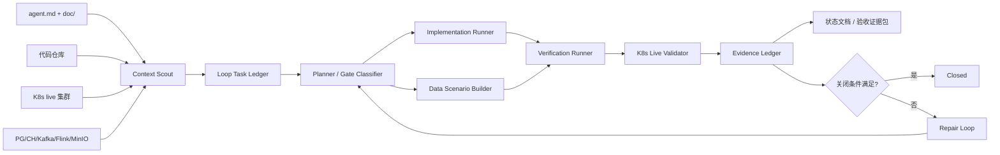

# Codex Loop Engineering 设计

更新时间：2026-06-19
适用范围：`traffic-analysis-platform` 仓库、K8s live 集群、真实数据库/Kafka/Flink/APISIX/Web UI 联调。

## 1. 定义

Codex Loop Engineering 是面向本项目的“自主研发、验证、修复、证据沉淀”闭环工程机制。它不是普通 CI，也不是只让 Codex 跑脚本；它把 `agent.md`、`doc/`、代码、K8s 现场、数据库数据、测试结果和验收证据统一纳入一个可重复循环：

```text
读取约束 -> 发现差距 -> 拆解任务 -> 修改实现 -> 构造真实数据
  -> 本地验证 -> K8s live 验证 -> 证据入库/入文档 -> 状态关闭或回到修复
```

本设计遵守三条硬约束：

1. K8s-first：重要验收必须基于 live K8s 基础设施，不能只看本地 mock。
2. Data-backed：功能验证必须使用数据库/Kafka/Flink/对象存储中的真实或造数数据；造数也要有来源、清理策略和对账证据。
3. Evidence-gated：不得把 smoke 通过写成性能、算法、安全、HA 或第三方验收通过。

## 2. 输入依据

Loop 启动时必须读取并固化以下输入：

| 输入 | 作用 |
|---|---|
| `agent.md` | 仓库结构、K8s 入口、验证命令、编码约束、当前真实状态 |
| `doc/01_design/课题一产品与技术总体设计.md` | 产品定位、主链路、REQ-T1 矩阵、P0/P1 整改总表 |
| `doc/02_acceptance/README.md` | smoke/regression/acceptance/third-party 证据分层和门禁 |
| `doc/03_review/专家深评整改清单.md` | 多角色 P0/P1 问题、整改动作、验收证据 |
| `doc/05_status/*.md` | 当前已实现、未实现、未验收、待生产化的真实状态 |
| `web/ui/src/components/Layout/MainLayout.tsx` | 前端菜单和路由真源 |
| `proto/traffic/v1`、`common`、部署清单 | 跨语言契约、Topic、DDL、配置真源 |

## 3. 总体架构



## 4. Loop 分层

| Loop | 目标 | 典型输入 | 关闭条件 |
|---|---|---|---|
| Mission Loop | 把任务书指标和当前工程状态对齐 | REQ-T1、P0/P1 表、专家整改项 | 每个指标有 owner、测试、证据路径、状态 |
| Product Loop | 补齐页面、菜单、路由、权限和业务状态机 | UI 规范、MainLayout、API 列表 | 菜单可达、API 真实、错误态/空态/权限态可测 |
| Code Loop | 实现缺失 API、服务、前端和数据逻辑 | issue/gap、源码、契约 | 单测/构建/契约测试通过 |
| Data Loop | 造数、回放、对账、清理 | Kafka topic、PG/CH schema、样本集 | API、DB、Kafka/Flink 输出一致 |
| Live Loop | 在 K8s 现场验证 | APISIX、Pod、ConfigMap、镜像 | 无 4xx/5xx、无 requestfailed、Pod/Job 健康 |
| Evidence Loop | 把测试变成可复核验收材料 | 日志、报告、截图、SQL、PromQL | 证据文件落到 `doc/02_acceptance/` |
| Security Loop | 收敛生产安全风险 | Secret、TLS、ACL、RBAC、审计 | 负向用例、扫描、审计和策略报告通过 |
| Release Loop | 冻结可复现版本 | commit、镜像、manifest、DDL、Topic | release manifest 完整且现场 diff 可解释 |

## 5. 状态机

```text
DISCOVERED
  -> TRIAGED
  -> SPECED
  -> IMPLEMENTING
  -> LOCAL_VERIFIED
  -> LIVE_VALIDATING
  -> EVIDENCING
  -> CLOSED
```

异常分支：

| 状态 | 触发条件 | 下一步 |
|---|---|---|
| REPAIRING | 测试失败、接口缺失、数据不一致、K8s 漂移 | 回到 IMPLEMENTING 或 DATA_PREP |
| BLOCKED | 需要外部硬件、第三方报告、账号权限或无法造出的现场条件 | 写入风险台账和替代证据 |
| DEFERRED | 非 P0/P1，且不阻塞当前验收 | 进入 Roadmap |
| QUARANTINED | 测试不稳定或证据口径不可信 | 先修测试/口径，不准关闭功能 |

## 6. 任务模型

每个循环任务必须落成结构化记录，建议后续实现为 `codex-loop/tasks/*.yaml`：

```yaml
id: CLE-P0-DQ-001
title: 修复数据质量接口并补空窗口/有数据窗口验证
priority: P0
source:
  - doc/05_status/代码实证状态核对-2026-06-19.md
  - doc/03_review/专家深评整改清单.md#QA-09
subsystems:
  - go/control-plane
  - web/ui
  - clickhouse
acceptance_type: regression
data_plan:
  mode: live_generated
  tenant: default
  seed_path: tests/fixtures/data-quality/
  cleanup: by_run_id
k8s_targets:
  namespace: traffic-analysis
  entrypoint: http://10.0.5.8:30180
verification:
  local:
    - cd go/control-plane && go test ./...
    - cd web/ui && npm run build
  live:
    - curl /api/v1/data-quality
    - ROUNDS=100 tests/run_tests.sh live
evidence:
  - doc/02_acceptance/02-regression/data-quality-report.md
close_when:
  - HTTP 200
  - no scan error
  - empty window and data window are distinguishable
  - UI shows pass/warn/unhealthy with reasons
```

## 7. Gate 设计

| Gate | 必须检查 | 不通过时动作 |
|---|---|---|
| G0 Intake | 已读 `agent.md`/`doc`、检查脏工作区、确认任务优先级 | 停止改动，先记录冲突或风险 |
| G1 Contract | API response shape、proto、Topic、DDL、TS 类型是否兼容 | 改契约或增加兼容 endpoint |
| G2 Data | 数据来自 API/Kafka/Flink/DB，造数有 run_id 和清理策略 | 补 seed/replay/cleanup |
| G3 Local | Go/Rust/Java/Web/Proto 对应局部测试通过 | 进入 REPAIRING |
| G4 Live | APISIX 真实路由、JWT、tenant、DB/Kafka/Flink 对账 | 修路由、镜像、配置或数据 |
| G5 Browser | 全菜单无 4xx/5xx、无 requestfailed、无非 warning console/pageerror | 修 UI/API/权限/状态 |
| G6 Evidence | 报告、日志、截图、SQL/PromQL、版本信息齐全 | 补证据，不准关闭 |
| G7 Release | commit、镜像 digest、manifest、DDL、Topic、site values 冻结 | 不进入验收口径 |

## 8. K8s 与数据库数据策略

### 8.1 K8s 策略

所有 live 验证默认使用 APISIX 入口：

```text
http://10.0.5.8:30180
```

集群操作遵守 `agent.md` 约定，必要时清理代理环境：

```bash
env -u http_proxy -u https_proxy -u HTTP_PROXY -u HTTPS_PROXY kubectl get pods -A
```

Loop 必须记录：

- namespace、Pod、Service、ConfigMap、Secret 引用、镜像 tag/digest。
- APISIX route 与前端 route manifest 是否一致。
- live 镜像和仓库 manifest 是否漂移。
- Flink Job RUNNING、checkpoint age、restart、backpressure。
- Kafka topic lag、ClickHouse/PG 写入和查询对账。

### 8.2 数据策略

| 数据模式 | 用途 | 规则 |
|---|---|---|
| live_existing | 读取现场已有数据 | 不修改数据，只做只读对账 |
| live_generated | 通过 API/Kafka/ingest 写入测试数据 | 必须带 `run_id`、tenant、时间窗和 cleanup |
| replay | 回放 PCAP/Kafka fixture | 记录输入样本 hash、offset、输出结果 |
| db_seed | 仅用于 DB 层或无法绕过的元数据准备 | 必须标记为非端到端证据 |
| mock | 单元测试隔离依赖 | 不能作为 live/验收通过依据 |

资产、告警、反馈、PCAP、MLOps 等业务闭环优先走真实链路：API 或 Kafka 注入 -> Flink/Service 处理 -> PG/CH/MinIO -> API -> UI。

## 9. 自动化执行矩阵

| 场景 | 命令/动作 | 证据 |
|---|---|---|
| 基础巡检 | `kubectl get pods -A --field-selector=status.phase!=Running,status.phase!=Succeeded` | 非运行 Pod 清单 |
| Go 控制面 | `cd go/control-plane && go test ./...` | Go test 日志 |
| Web 构建 | `cd web/ui && npm run build` | build 日志 |
| Web 单测 | `cd web/ui && npm test -- --run` | vitest 报告 |
| Java/Flink | `cd java && mvn test` | surefire 报告 |
| Rust Probe | `cd rust && cargo test --workspace` | cargo test 日志 |
| Proto | `buf lint && ./scripts/generate.sh` | 生成差异和编译结果 |
| Python/MLOps | `make python-test` | pytest 报告 |
| 全量功能 | `tests/run_tests.sh full` | full summary |
| live 100 轮 | `ROUNDS=100 tests/run_tests.sh live` | live summary、失败样本 |
| 浏览器全菜单 | Playwright live matrix | trace、HAR、截图、console report |
| 发布漂移 | `kubectl diff` + route/service/image diff | drift report |

## 10. 前端 Product Loop

前端 Loop 以 `MainLayout.tsx` 和 UI 前端规范为真源，目标是二级菜单、权限、路由和页面状态一致。

一级菜单固定为：

| 一级菜单 | 二级页面 |
|---|---|
| 综合态势 | Dashboard、Topics、Screen |
| 采集监测 | Probes、DataQuality |
| 威胁分析 | Alerts、Campaigns、Attack Chains、Encrypted Traffic、Forensics |
| 资产图谱 | Assets、Graph、Fusion、Baselines |
| 检测运营 | Rules、Deployments、Models、MLOps、Playbooks、Whitelist |
| 审计配置 | Compliance、AuditLog、Notifications、Settings |

Product Loop 关闭标准：

- 菜单、路由、面包屑、权限守卫共用 route manifest。
- 所有 API 调用进入 `web/ui/src/services/api.ts` 或后续领域服务封装，不直接散落 fetch。
- 页面必须有 React Query loading/error/empty/success 状态。
- `/screen` 的 public/private 边界明确；WebSocket 只在授权场景连接。
- 全菜单 Playwright live 验证无 4xx/5xx、无 requestfailed、无非预期 console/pageerror。

## 11. 后端与数据流 Loop

后端 Loop 每次变更按“API -> service -> repository -> schema -> deployment -> test”检查。

| 类型 | 必查项 |
|---|---|
| REST API | JWT、tenant、request id、日志、recovery、兼容 response shape |
| PG 元数据 | migration/init script、索引、事务、审计字段 |
| ClickHouse | 本地表/分布式表、分区、TTL、schema diff、scan 类型 |
| Kafka | topic catalog、producer/consumer、DLQ、幂等键、lag |
| Flink | stable UID、checkpoint、savepoint、DLQ、热更新 |
| MinIO | object key、sha256、size、retention、签名 URL、审计 |

## 12. Evidence Ledger

每次 Loop 运行产生一个 run 目录，建议结构：

```text
doc/02_acceptance/runs/<run_id>/
  run-summary.json
  task.yaml
  git-status.txt
  k8s-pods.txt
  api-report.json
  db-reconcile.sql.txt
  kafka-offsets.txt
  flink-jobs.txt
  browser-console-report.md
  screenshots/
  logs/
```

`run-summary.json` 最少字段：

```json
{
  "run_id": "20260619-210000-cle-p0-dq",
  "commit": "unknown-or-sha",
  "entrypoint": "http://10.0.5.8:30180",
  "priority": "P0",
  "acceptance_type": "regression",
  "data_mode": "live_generated",
  "status": "passed",
  "failed_checks": [],
  "evidence_files": []
}
```

## 13. 初始任务队列

按当前文档和状态，Codex Loop Engineering 的第一批任务建议如下：

| 优先级 | 任务 | 关闭证据 |
|---|---|---|
| P0 | 冻结 baseline：commit、镜像、manifest、DDL、Topic、模型、规则 | `00-baseline/` 清单 |
| P0 | route manifest：菜单、路由、权限、APISIX 对齐 | route matrix、未授权负例 |
| P0 | `/screen` 权限边界和 WebSocket 延迟连接 | browser live 报告 |
| P0 | P95 时间戳链路：event -> ingest -> kafka -> flink -> alert -> api -> ui | latency P50/P90/P95/P99 |
| P0 | DLQ envelope、replay API、幂等验证 | 坏消息注入与重放报告 |
| P0 | PCAP hash、签名 URL、过期、跨租户拒绝、下载审计 | pcap forensics report |
| P0 | Kafka TLS/SASL/ACL、ExternalSecret、默认凭证收敛 | security report |
| P0 | DataQuality 空窗口/有数据窗口/失败原因 | data-quality report |
| P1 | Threat Intel、SNMP/LLDP、融合价值消融实验 | API/UI/评测报告 |
| P2 | Playwright 全菜单、Go/Web/Java/Rust/Proto 覆盖率补齐 | test matrix |

## 14. 角色与协作

可以由一个 Codex 主控顺序执行，也可以拆成子代理，但只能有一个 Loop Controller 负责关闭状态。

| 角色 | 职责 |
|---|---|
| Loop Controller | 读文档、排优先级、维护任务状态、决定是否关闭 |
| Repo Scout | 扫描代码、测试、路由、契约、脏工作区 |
| Backend Agent | Go API、PG/CH、审计、通知、Playbook、DataQuality |
| Frontend Agent | 二级菜单、页面状态、React Query、Playwright |
| Stream Agent | Proto/Kafka/Flink/Rust Probe、DLQ、重放 |
| SRE/Security Agent | K8s、镜像、APISIX、Secret、NetworkPolicy、TLS |
| QA/Evidence Agent | 100 轮测试、全菜单、DB 对账、证据包 |
| Product/Acceptance Agent | REQ-T1 矩阵、演示脚本、验收措辞和状态分层 |

## 15. 通过标准

Codex Loop Engineering 自身的 MVP 通过标准：

1. 能从 `agent.md` 和 `doc/` 自动生成 P0/P1 任务队列。
2. 每个任务有结构化状态、数据策略、K8s 目标、验证命令和证据路径。
3. 至少跑通一条完整循环：发现缺口 -> 修改代码或配置 -> 构造真实数据 -> live 验证 -> 证据落盘 -> 状态关闭。
4. 100 轮 live smoke 的结果只标为 regression evidence，不误标为性能/算法/安全验收。
5. 所有关闭项都能追溯到 API、DB/Kafka/Flink/K8s/UI 至少一个真实证据。

## 16. 后续落地建议

第一阶段先做轻量实现：

```text
scripts/codex_loop/
  discover.sh
  plan.py
  run_local.sh
  run_live.sh
  collect_evidence.sh
  update_status.py
```

第二阶段再扩展为可长期运行的控制器：

```text
codex-loop-controller
  task registry
  run scheduler
  k8s inspector
  db/kafka reconciler
  playwright runner
  evidence publisher
```

最终形态不是替代人工评审，而是把“Codex 自主开发测试”变成可审计、可复现、可验收的工程系统。
