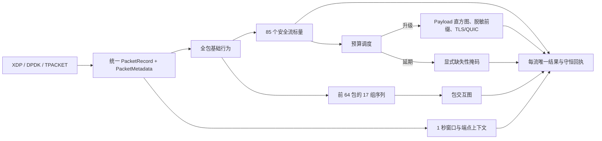

# 统一全流量多模态特征水库

## 目标

本模块把 CAEOS 全 PCAP 离线特征契约与 HFT-MGBS 在线采集、识别、预算调度
连接为同一条可重算链。离线源契约为 143 列双向流分段；在线模型特征不包含
数据集、采集文件、端点、绝对时间、标签或原始端口身份。

代码入口：

- `hft_mgbs/unified_feature_reservoir.py`
- `configs/unified_feature_reservoir_v1.json`
- `scripts/audit_unified_feature_parity.py`
- `tests/test_unified_feature_reservoir.py`

源合同：

- `unified_multimodal_v4.schema.json`：143 个持久化列，SHA-256
  `f300834ba34c47d1b8d4bbd5506f081b142889e51f12150ddf55608214ef6ce1`；
- `unified_multimodal_v5.feature_views.json`：三模态视图，SHA-256
  `3bf4061d62a4c10910f2740652f9676eab7b0f837c8a7bfb97746c2b64e3ad04`。

## 143 列完整覆盖契约

代码把“结构覆盖”和“每条流的模态可观测性”分开：所有 143 列都有确定来源，
但标签与数据来源由外部控制面提供；Payload、TLS、QUIC 等预算化模态若未执行，
必须报告缺失，不能伪造全零值。只有深层模态完整时，
`materialize_unified_pcap_row` 才允许导出合格的 143 列记录。

| 类别 | 数量 | 代码责任 |
|---|---:|---|
| 审计/溯源列 | 17 | 外部上下文输入；流哈希、时间、端点哈希和分段号由导出器重算 |
| 标签列 | 6 | 标签控制面输入，禁止由抓包代码猜测 |
| 在线可抽取列 | 120 | `UnifiedFeatureReservoir` 全面覆盖 |
| 其中候选模型持久化列 | 116 | 85 标量 + 17 序列 + 8 加密结构 + Payload/L4 独有字段去重 |
| 基础导出辅助列 | 4 | `packet_count_stored`、`port_a`、`port_b`、`application_protocol_hint` |
| 可确定性派生列 | 7 | 不重复写入 143 列 CSV，由序列和缺失性证据复算 |
| 在线窗口上下文 | 10 | HFT 扩展字段，不改变 143 列离线契约 |

### 17 个审计/溯源列

`schema_version`、`dataset_id`、`dataset_role`、`sample_id`、`capture_id`、
`source_container_sha256`、`source_member`、`label_status`、`label_source`、
`label_mapping_version`、`dataset_native_label`、`flow_key_hash`、
`flow_start_ns`、`flow_end_ns`、`endpoint_a_hash`、`endpoint_b_hash`、
`flow_segment_index`。

### 6 个标签列

`traffic_class`、`attack_category`、`attack_subcategory`、`fine_label`、
`family_label`、`binary_label`。

### 85 个安全行为标量

基础与规模（22）：`duration_us`、`ip_version`、`transport_protocol`、
`packet_count_total`、`forward_packet_count`、`reverse_packet_count`、
`packet_bytes_total`、`forward_packet_bytes`、`reverse_packet_bytes`、
`payload_bytes_total`、`forward_payload_bytes`、`reverse_payload_bytes`、
`forward_transport_header_bytes`、`reverse_transport_header_bytes`、
`reverse_forward_packet_ratio`、`reverse_forward_byte_ratio`、
`direction_switch_count`、`direction_switch_rate`、
`direction_switch_iat_us_mean`、`direction_switch_iat_us_std`、
`fragmented_packet_count`、`noninitial_fragment_count`。

包长度（16）：`packet_length_min`、`packet_length_max`、
`packet_length_mean`、`packet_length_std`、`packet_length_median`、
`packet_length_variance`、`packet_length_skewness`、
`packet_length_coefficient_of_variation`、`forward_packet_length_min`、
`forward_packet_length_max`、`forward_packet_length_mean`、
`forward_packet_length_std`、`reverse_packet_length_min`、
`reverse_packet_length_max`、`reverse_packet_length_mean`、
`reverse_packet_length_std`。

包到达间隔（19）：`packet_iat_us_total`、`packet_iat_us_min`、
`packet_iat_us_max`、`packet_iat_us_mean`、`packet_iat_us_std`、
`packet_iat_us_median`、`packet_iat_us_variance`、`packet_iat_us_skewness`、
`packet_iat_us_coefficient_of_variation`、`forward_packet_iat_us_total`、
`forward_packet_iat_us_min`、`forward_packet_iat_us_max`、
`forward_packet_iat_us_mean`、`forward_packet_iat_us_std`、
`reverse_packet_iat_us_total`、`reverse_packet_iat_us_min`、
`reverse_packet_iat_us_max`、`reverse_packet_iat_us_mean`、
`reverse_packet_iat_us_std`。

单包 Payload 长度（8）：`packet_payload_length_min`、
`packet_payload_length_max`、`packet_payload_length_mean`、
`packet_payload_length_std`、`packet_payload_length_median`、
`packet_payload_length_variance`、`packet_payload_length_skewness`、
`packet_payload_length_coefficient_of_variation`。

Active/Idle（10）：`active_duration_us_total`、`active_duration_us_min`、
`active_duration_us_max`、`active_duration_us_mean`、`active_duration_us_std`、
`idle_duration_us_total`、`idle_duration_us_min`、`idle_duration_us_max`、
`idle_duration_us_mean`、`idle_duration_us_std`。

速率与 TCP 标志（10）：`packets_per_second`、`bytes_per_second`、
`tcp_fin_flag_count`、`tcp_syn_flag_count`、`tcp_rst_flag_count`、
`tcp_psh_flag_count`、`tcp_ack_flag_count`、`tcp_urg_flag_count`、
`tcp_ece_flag_count`、`tcp_cwr_flag_count`。

### 前 64 包的 17 个序列列

`packet_length_seq`、`ip_length_seq`、`packet_iat_us_seq`、`direction_seq`、
`packet_protocol_seq`、`tcp_flags_seq`、`ip_dscp_ecn_seq`、`ip_flags_seq`、
`ip_fragment_offset_seq`、`ip_fragment_id_seq`、
`transport_header_length_seq`、`tcp_sequence_seq`、
`tcp_acknowledgement_seq`、`packet_payload_length_seq`、
`sanitized_l4_packet_length_seq`、`packet_ttl_seq`、`tcp_window_seq`。

### Payload、脱敏 L4 与加密结构

Payload/L4 持久化字段：`payload_b64`、`payload_histogram`、
`payload_bytes_total`、`payload_bytes_stored`、`forward_payload_bytes`、
`reverse_payload_bytes`、`sanitized_l4_b64`、`sanitized_l4_bytes_total`、
`sanitized_l4_bytes_stored`。

8 个 TLS/QUIC 结构字段：`tls_record_type_seq`、
`tls_record_version_seq`、`tls_record_length_seq`、
`tls_handshake_type_seq`、`tls_client_hello_present`、
`tls_server_hello_present`、`quic_long_header_packet_count`、
`quic_version_seq`。

### 4 个基础导出字段与 7 个派生字段

基础导出字段：`packet_count_stored`、`port_a`、`port_b`、
`application_protocol_hint`。端口和应用提示只用于审计/诊断，默认禁止入模。

派生字段：`initiator_relative_direction_seq`、`signed_packet_length_seq`、
`directional_burst_count`、`directional_burst_packet_count_summary`、
`directional_burst_byte_summary`、`payload_presence_fraction`、
`modality_missingness_mask`。

## 分层抽取



### 全流基础层

每个成功解析的数据包更新流量规模、方向、分片、包长、IAT、Payload 长度、
Active/Idle、速率和 TCP flags。每个观测流均生成 85 个安全标量，不能因为预算
不足而删除流记录。

### 有界时序层

每个流分段保存最多 64 个包的包长、IP 长度、IAT、方向、协议、TCP flags、
DSCP/ECN、IP flags、分片、传输首部长度、TCP seq/ack、Payload 长度、TTL 和
TCP window。第 64 包后结束当前分段，后续包进入递增的
`flow_segment_index`；不能把第 65 包以后静默截断。`direction_seq`严格使用规范
端点 A→B/B→A，`initiator_relative_direction_seq`另行表达首包发起方向。

### 预算化深层

只有被调度到 deep tier 的流才物化以下内容：

- 最多 4096 字节 Payload 前缀；
- 最多 2048 字节脱敏 L4 前缀；
- 256 维 Payload 直方图；
- TLS record/handshake 类型、版本、长度以及 ClientHello/ServerHello；
- QUIC long-header 数量和版本序列。

未选择 deep tier 时，直方图是缺失模态，不是合格的全零直方图。

### 图与上下文

包图包含时间邻接、同向突发和请求—响应转换三种边。窗口层输出包、字节、流
数量，协议/服务端口熵，SYN/RST 比例，最大扇出、最大唯一目的端口数和新流速率；
原始端点标识不会进入窗口结果。

## 与 A09 的兼容边界

Rust 的冻结 38 维 `RAW_FEATURE_ORDER` 及 A09 的 38→34 维投影不变。统一特征
水库作为附加语义层运行，不能改变当前模型、阈值或回退工件哈希。A09 仍只消费
原 34 维 `invariant_no_ports_v1` 输入。

## 守恒式

对每批次：

```text
parsed_packets = recognized_packets = base_featured_packets
observed_flows = pipeline_results
observed_flow_segments = unified_feature_records
deep_selected_segments + deep_deferred_segments = unified_feature_records
```

所有截断、头部元数据缺失、深层延期、Payload 未完整可见和脱敏字节不可用均进入
`modality_missingness_mask`。

## 离线—在线契约审计

```powershell
$env:PYTHONPATH=(Get-Location).Path
python scripts/audit_unified_feature_parity.py `
  --caeos-schema "F:/泉城实验室/二期/论文/异常检测/source/CAEOS-EMTD/configs/unified_multimodal_v4.schema.json" `
  --caeos-feature-views "F:/泉城实验室/二期/论文/异常检测/source/CAEOS-EMTD/configs/unified_multimodal_v5.feature_views.json" `
  --reservoir-policy "F:/泉城实验室/二期/论文/异常检测/source/HFT-MGBS/configs/unified_feature_reservoir_v1.json" `
  --output "F:/tmp/unified-feature-parity.json" `
  --require-verified
```

审计会重哈希两个 CAEOS 源合同，并逐项验证 143 个持久化列、17 个审计列、
6 个标签列、120 个在线可抽取列、116 个候选模型列、85 个标量、17 个序列、
8 个加密结构字段、7 个派生字段、10 个窗口上下文以及 9 项消融要求。

## 资格边界

本模块闭合特征语义、缺失性和守恒，不自动证明 Rust 热路径已经以目标吞吐实现
全部特征。`rust_hotpath_parity_qualified` 和 `final_pareto_ingestion_allowed` 默认均为
`false`。生产资格仍需 Rust 等价实现、离线—在线数值复放、资源基准以及 XDP/DPDK
硬件实验。
