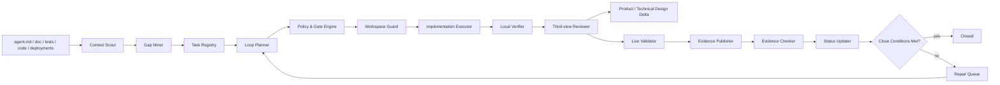
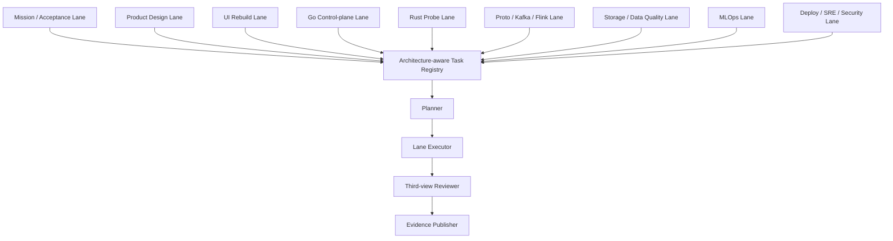

# 自动开发 Loop 引擎设计

更新时间：2026-06-23
适用范围：`traffic-analysis-platform` 仓库、K8s live 集群、真实 APISIX/API/DB/Kafka/Flink/Web UI 验证链路。
关联文档：`agent.md`、`doc/01_design/Codex-Loop-Engineering-设计.md`、`doc/02_acceptance/README.md`、`doc/03_review/专家深评整改清单.md`、`doc/05_status/*.md`。

产品页面和全栈交付的强化学习扩展见 `doc/04_assets/ui_suite_gpt_v1/specs/REINFORCEMENT_LEARNING_DELIVERY_LOOP.md`。该扩展复用本引擎的 policy、workspace、Reviewer、evidence 和人工门禁，不允许 reward 绕过现有控制面。

## 1. 设计目标

自动开发 Loop 引擎是 Codex Loop Engineering 的工程化执行层。它不是普通 CI，也不是无边界自动改代码工具，而是一个把“发现缺口、生成任务、修改实现、真实链路验证、证据沉淀、状态关闭”串成可审计循环的仓库内控制器。

目标闭环：

```text
读取项目约束
  -> 发现 P0/P1 缺口
  -> 生成结构化任务
  -> 判定可自动执行范围
  -> 修改代码 / 配置 / 测试 / 文档
  -> 本地最小验证
  -> 第三视角审阅
  -> K8s live 验证
  -> 证据落盘
  -> 产品 / 技术设计增量更新
  -> 更新任务状态
  -> 关闭或进入修复循环
```

核心约束：

| 约束 | 含义 |
|---|---|
| Repo-native | 以本仓库 `agent.md`、`doc/`、`tests/`、`Makefile`、`deployments/` 为真源，不引入脱离仓库的流程系统 |
| K8s-first | 重要闭环必须最终走 APISIX/K8s/live 数据链路验证，本地 mock 只能作为单元级辅助 |
| Data-backed | 功能关闭必须能追溯到 API、DB、Kafka、Flink、MinIO、浏览器或 K8s 证据 |
| Evidence-gated | smoke、regression、acceptance、third-party 四类证据不能混写 |
| Review-separated | 实现者自测和第三视角审阅分离，Reviewer 必须能独立否决关闭或要求设计迭代 |
| Human-bounded | 生产破坏性动作、凭证变更、外部第三方结论、真实压测资源申请必须显式进入人工门禁 |

## 2. 引擎边界

### 2.1 自动执行范围

| 类型 | 自动程度 | 说明 |
|---|---|---|
| 文档缺口抽取 | 自动 | 从 `doc/05_status`、`03_review`、`02_acceptance` 抽 P0/P1 |
| 代码静态定位 | 自动 | 用 `rg`、manifest、route、proto、topic、DDL 扫描映射影响面 |
| 普通代码修复 | 自动 | Go/Web/Flink/Rust/Proto 中可局部验证的缺口可自动修 |
| 本地测试 | 自动 | 使用 `tests/run_tests.sh`、`Makefile` 和子系统原生命令 |
| 第三视角审阅 | 自动 | 从代码 diff、任务目标、产品设计、技术设计和证据口径独立审查 |
| live 只读验证 | 自动 | Pod、route、API GET、状态页、只读 DB/Kafka/Flink 查询 |
| live 造数验证 | 半自动 | 必须声明 run_id、tenant、cleanup，且只用于测试范围 |
| 证据落盘 | 自动 | 写入 `doc/02_acceptance/runs/<run_id>/` |

### 2.2 必须人工门禁

| 类型 | 门禁原因 |
|---|---|
| 删除或重建生产数据、PVC、Topic、Bucket | 不可逆或高影响 |
| 修改真实 Secret、证书根 CA、生产凭证 | 安全边界 |
| 生产 Kafka TLS/SASL/ACL 切换 | 影响所有生产者/消费者 |
| 多口 100Gbps / 512Mpps 压测执行 | 需要专用硬件、窗口和网络隔离 |
| 第三方/CNAS 结论标记 | 只能由外部报告确认 |
| 对外发布、客户试点材料盖章 | 项目管理和商务边界 |

## 3. 总体架构



组件职责：

| 组件 | 职责 | 输入 | 输出 |
|---|---|---|---|
| Context Scout | 固化当前项目上下文 | `agent.md`、`doc/`、`git status`、manifest | `context.snapshot.json` |
| Gap Miner | 抽取 P0/P1 缺口和整改项 | 状态文档、评审文档、验收门禁 | 候选任务列表 |
| Task Registry | 保存任务、状态、证据路径 | 候选任务、人工任务、历史任务 | `tasks/*.yaml` |
| Loop Planner | 分解执行步骤和验证策略 | task、影响面、依赖图 | run plan |
| Policy & Gate Engine | 判定可自动执行或需人工门禁 | run plan、风险规则 | allow / hold / block |
| Runtime Preflight | 检查生产入口运行条件 | resource profile、工具链、路径、队列、磁盘、内存、锁 | preflight report |
| Resource Quota Planner | 约束 lane、mode、subsystem 和总资源权重 | guidance、task lane、quota policy | quota report、quota usage |
| Resource Monitor | 采集运行时资源压力并给出 admission 建议 | CPU/load/memory/disk/process/thread/queue、observability policy | resource monitor report、recommended workers |
| Workspace Isolation Planner | 为并发执行池规划每任务 workspace backend 和改动范围 | scheduler selected queue、allowed_paths、isolation policy、git status | workspace isolation plan、per-task workspace spec |
| Workspace Cleanup | 受控清理 per-task workspace | workspace isolation plan、cleanup gate、allowed roots | cleanup plan、cleanup result |
| Queue Service | 提供持久队列的进程边界和远程 claim API | SQLite queue、HTTP request、auth token | queue service health、claim/update response |
| HTTP Queue Client | 让 scheduler/worker/pool 经 queue service 仲裁队列状态 | queue service URL、token、queue operation | enqueue/claim/complete/fail/recover response |
| Execution Sandbox Planner | 生成隔离执行计划 | task、stage、sandbox policy、image、resource limit | K8s Job、NetworkPolicy、container command |
| Sandbox Executor | 在显式闸门下执行隔离计划 | sandbox plan、execute gate、cleanup policy | execution log/status |
| Sandbox Queue Worker | 将 scheduler queue 桥接到隔离计划和显式执行 | scheduler plan、queue claim、sandbox executor | sandbox worker report、queue update |
| Executor Pool | 从 scheduler plan 或持久队列启动受限执行池 | scheduler plan、SQLite queue、quota policy、runner | executor pool summary、child runs |
| Executor Pool Stress Runner | 重复运行执行池并检查 cleanup 与 workspace 泄漏 | scheduler plan、executor pool args、cleanup policy | stress summary、leak findings |
| Remote Pool Stress Runner | 经 HTTP queue service 压测 remote-style worker 仲裁和 lease owner 回写 | queue service、SQLite/WAL、worker count、task count | remote stress summary、duplicate claim findings |
| Remote Pool K8s Stress Planner | 渲染或执行 K8s Indexed Job 多 Pod worker 压测 | queue service URL、worker count、token Secret、image/PVC | K8s stress summary、Job YAML、dry-run/log evidence |
| Remote Pool K8s Readiness Auditor | 只读审计多 Pod 压测真实执行前置条件 | stress summary、namespace、Service、PVC、Secret、Job manifest、execute gate | readiness summary、redacted kubectl checks、release blocker |
| K8s Bootstrap Planner | 验证或显式应用 queue service 前置资源 | deploy plan、PVC、Deployment、Service、token env、execute gate、loop-control image path | bootstrap summary、dry-run evidence、redacted command template |
| Objective Stop Evaluator | 判断整个自动开发目标是否应成功停止、继续、修复停止或人工裁决 | task pool、guidance、evidence ledger、release manifest、stop policy | stop summary、stop report、daemon stop recommendation |
| Soak Runner | 重复运行 bounded cycle 并采集稳定性证据 | service/daemon args、resource policy、health、metrics | soak summary、cycle health、metrics trend |
| Workspace Guard | 防止覆盖无关改动 | git status、影响文件白名单 | workspace report |
| Implementation Executor | 执行代码/配置/测试/文档修改 | run plan、repo context | patch set |
| Patch Runner | 生成 Codex work order、结构化输出契约和候选 patch intake | implementation brief、context pack、design pack、Codex output | patch request、output schema、patch intake |
| Model Profile Selector | 为外部 Codex patch 尝试选择模型、sandbox、schema 和命令模板 | task、patch request、model policy、execution policy | model profile、command template |
| Codex Runner | 在策略门禁下计划或执行外部 Codex 命令 | model profile、patch request、execution policy | invocation audit、redacted output |
| Local Verifier | 选择最小本地验证 | 子系统、修改范围 | local report |
| Third-view Reviewer | 独立审阅代码、产品逻辑、技术设计和证据口径 | diff、task、local report、设计文档 | review report、design delta |
| LLM Reviewer | 生成外部模型审阅请求并 intake 审阅结论 | task、static review、semantic review、context pack、patch intake | LLM review request、schema、profile、decision |
| Live Validator | 执行 K8s/APISIX/DB-backed 验证 | entrypoint、token、run_id | live report |
| Evidence Publisher | 归档日志、报告、截图、SQL、命令 | local/live 输出 | evidence run 目录 |
| Evidence Checker | 判定证据是否足够关闭任务 | task、run summary、review、local/live/evidence report、guidance | evidence-check result |
| Repair Planner | 将失败证据转成下一轮行动 | evidence-check blocker、task、allowed paths | repair plan、Codex repair prompt |
| Status Updater | 更新任务状态和状态文档建议 | evidence、close_when | status patch / summary |

### 3.1 项目架构地图

自动开发 Loop 引擎必须先理解项目架构，再选择任务、执行器和验证 Gate。当前系统按以下主链路运行：

```text
Rust Probe
  -> Ingest Gateway
  -> Kafka Topics
  -> Flink Jobs
  -> ClickHouse / PostgreSQL / OpenSearch / NebulaGraph / Redis / MinIO
  -> Go Control-plane APIs
  -> Web UI
  -> Feedback / Whitelist / Rule Review / MLOps
  -> rule.updates / model-updates
  -> Flink hot update
```

架构层映射：

| 层级 | 目录 | 职责 | Loop 关注点 |
|---|---|---|---|
| 采集层 | `rust/probe-agent` | AF_XDP/AF_PACKET/PCAP 采集、流聚合、PCAP 归档、mTLS 上报 | 性能、丢包、解析率、证书、上报契约 |
| 接入层 | `go/control-plane/cmd/ingest-gateway` | 接收 Probe 数据、限流、鉴权、写 Kafka/DLQ | gRPC、mTLS、tenant、DLQ、重放 |
| 契约层 | `proto/traffic/v1` | 跨语言 Protobuf 真源 | 生成代码、消费者兼容、字段注释 |
| 流处理层 | `java/flink-jobs` | Session、Feature、Rule、CEP、Behavior、PCAP Index、Log、User Behavior | stable UID、checkpoint、DLQ、批量 sink、热更新 |
| 存储层 | `common`、K8s init jobs | CH/PG/OS/Nebula/Redis/MinIO schema 和初始化 | DDL、索引、Topic、对象路径、schema diff |
| 控制面 | `go/control-plane` | auth、alert、rule、asset、graph、forensics、MLOps API | API、RBAC、tenant、审计、repository 分层 |
| 产品前端 | `web/ui` | React/Ant Design/ECharts 页面、路由、菜单、状态和真实 API | 备份旧版、按 UI 图重做、route manifest、Tab 矩阵、Playwright |
| MLOps | `mlops`、`deployments/kubernetes/argo-events` | 训练、评估、注册、激活、模型热更新 | 盲测包、指标门禁、champion/challenger、回滚 |
| 部署运行 | `deployments/kubernetes` | APISIX、基础设施、服务、init job、Flink | drift、Secret、NetworkPolicy、镜像 digest、release manifest |
| 验收证据 | `doc/02_acceptance`、`tests` | smoke、regression、acceptance、third-party 证据 | 证据层级、run_id、报告、截图、SQL/PromQL |

### 3.2 架构感知引擎布局

重布局后的引擎不再把所有任务丢给一个通用执行器，而是按架构层选择专用 Lane。每个 Lane 有自己的输入、修改边界、验证命令和 Reviewer 视角。



Lane 设计：

| Lane | 任务来源 | 可改范围 | 首选验证 | Reviewer 重点 |
|---|---|---|---|---|
| Mission / Acceptance | REQ-T1、P0/P1 门禁、`02_acceptance` | `doc/02_acceptance`、`doc/05_status` | evidence schema、报告完整性 | 不把 regression 写成 acceptance |
| Product Design | 主设计、菜单矩阵、Tab 矩阵、UI 设计套装 | `doc/01_design`、`doc/04_assets` | 文档一致性、页面矩阵完整性 | 产品闭环是否自洽 |
| UI Rebuild | UI 图、菜单矩阵、Tab 矩阵、旧前端备份 | `web/ui`、`doc/04_assets`、`doc/02_acceptance` | `npm run build`、Playwright、全菜单 smoke | 新前端是否符合设计真源 |
| Go Control-plane | API 缺口、权限、审计、forensics、alert、asset | `go/control-plane` | `go test ./...`、API smoke | handler/service/repository 分层和 tenant |
| Rust Probe | 采集、性能、mTLS、PCAP 归档 | `rust/probe-agent` | `cargo test --workspace`、mTLS smoke | 性能口径不能冒充专项验收 |
| Proto / Kafka / Flink | Topic、Protobuf、Flink job、DLQ | `proto`、`common/kafka`、`java/flink-jobs` | `buf lint`、生成、`mvn test` | 契约兼容和批量 sink |
| Storage / Data Quality | CH/PG/OS/Nebula/MinIO、DLQ、对账 | `common`、deploy init、Go repository | schema diff、DB-backed smoke | DDL 与消费者一致 |
| MLOps | 训练、评估、注册、激活、模型热更新 | `mlops`、Go rules、Flink model consumer | `make python-test`、workflow lint | 小样本结果不能支撑 95%/5% |
| Deploy / SRE / Security | K8s、APISIX、Secret、NetworkPolicy、release | `deployments`、Dockerfile、Makefile | dry-run、drift report、security report | 生产安全和可复现发布 |

调度原则：

1. 一个任务只能有一个 primary Lane，但可以声明 dependent Lane。
2. 修改 `proto`、Kafka topic、DB schema、APISIX route 时必须自动扩展 dependent Lane。
3. UI 重做任务必须先跑 `UI-BACKUP`，再进入 UI Rebuild Lane。
4. 任何 Lane 的关闭都必须经过 Third-view Reviewer。
5. Mission / Acceptance Lane 负责最终证据层级，不允许实现 Lane 自己把任务标成验收通过。

### 3.3 前端备份与重做专线

当前前端不再作为零散修补对象。自动开发 Loop 引擎必须把前端工作切到“备份旧版 -> 按新设计真源重做 -> 真实 API 适配 -> 全菜单验证”的专线。

前端重做输入真源：

| 真源 | 用途 |
|---|---|
| `doc/01_design/面向园区网络的全流量采集分析系统-左侧菜单信息架构.md` | 6 个一级菜单、24 个二级菜单、route manifest 分组 |
| `doc/01_design/面向园区网络的全流量采集分析系统-二级菜单功能点与表现形式矩阵.md` | 每个二级页面的内容、表现形式、闭环动作 |
| `doc/01_design/面向园区网络的全流量采集分析系统-Tab页功能点与表现形式矩阵.md` | 页面内 Tab 状态和补图矩阵 |
| `doc/01_design/面向园区网络的全流量采集分析系统-UI前端规范.md` | AppShell、视觉 token、组件密度、状态色 |
| `doc/04_assets/ui_suite_gpt_v1/manifest.json` | UI 图清单、页面/浮层/组件/状态图范围 |
| `doc/04_assets/ui_suite_gpt_v1/screens/` | 目标视觉参考 |
| `agent.md` | API 真实链路、浏览器 smoke、部署和验证约束 |

前端重做阶段：

| 阶段 | 任务 | 产物 | 关闭条件 |
|---|---|---|---|
| UI-BACKUP | 备份现有 `web/ui` | `web/ui_legacy_<timestamp>/` 或归档包清单 | 可回退、记录 commit/status、未丢文件 |
| UI-FOUNDATION | 新建 AppShell、token、layout、route manifest | 基础壳、菜单、权限元数据 | 6 个一级菜单、24 个二级路由可解释 |
| UI-PAGES | 按二级菜单矩阵重做页面 | 页面骨架和主工作区 | 每页至少有下钻、动作或审计入口 |
| UI-TABS | 按 Tab 矩阵补页面状态 | Tab 内容、状态图映射 | Tab 激活态和业务内容与矩阵一致 |
| UI-API | 适配真实 API 和错误/空/加载态 | services、query hooks、DTO normalizer | 禁止直接散落 fetch，mock 仅 `VITE_USE_MOCK=true` |
| UI-E2E | 全菜单和关键闭环验证 | Playwright 报告、console report | 无 4xx/5xx、无 requestfailed、无非 warning pageerror |
| UI-REVIEW | 第三视角审阅 | `review-report.md`、`design-delta.md` | 新前端符合产品/技术/验收逻辑 |

备份规则：

1. 不允许在未备份旧前端的情况下删除或覆盖 `web/ui/src`。
2. 备份必须记录 `git status --short web/ui`、文件清单、package 版本和当前构建命令。
3. 旧前端只作为 API 调用、业务细节和回退参考，不作为新 UI 布局真源。
4. 新前端菜单、路由、Tab、组件密度和视觉必须以 `doc/01_design` 与 `doc/04_assets/ui_suite_gpt_v1` 为准。
5. 如果 UI 图与产品矩阵冲突，进入 `DESIGN_ITERATING`，不得随意按旧代码迁就。

### 3.4 子系统 Gate 矩阵

| 改动触点 | 必须扩展检查 | 最小 Gate | 不可关闭条件 |
|---|---|---|---|
| `web/ui` | route manifest、菜单矩阵、Tab 矩阵、API service、Playwright | Web build + Reviewer | 未备份旧前端、页面不符合矩阵 |
| `go/control-plane/internal/alert` | 告警状态机、反馈、审计、ClickHouse/OpenSearch | Go test + API smoke | 前后端状态值不一致 |
| `go/control-plane/internal/forensics` | PCAP hash、presign、tenant、audit | Go test + PCAP 负例 | 只验证下载成功不验证审计/跨租户 |
| `proto/traffic/v1` | Go/Rust/Java 生成物、Flink consumer、Go API | buf lint + generate + 消费者编译 | 手改生成物或未检查消费者 |
| `java/flink-jobs` | stable UID、checkpoint、DLQ、CH sink | mvn test + live checkpoint | 单条 INSERT、无 DLQ 或无 UID |
| `rust/probe-agent` | capture、parser、aggregator、archiver、sender | cargo test + ingest smoke | `unwrap()`、阻塞 async、硬编码配置 |
| `common/sql` | init job、repository 查询、schema diff | dry-run + DB-backed query | 只改 DDL 不改消费者 |
| `deployments/kubernetes` | APISIX、Secret、NetworkPolicy、image、namespace | dry-run + drift report | 明文凭证、默认口令、未说明攻击面 |
| `mlops` | dataset、metrics、model registry、Argo | python-test + workflow lint | 小样本指标冒充任务书 95%/5% |

## 4. 运行模式

引擎必须显式声明运行模式，禁止默认进入高风险 live 写入。

| 模式 | 可执行动作 | 典型用途 |
|---|---|---|
| `discover` | 只读扫描文档、代码、git 状态 | 生成任务池 |
| `plan` | 只读生成任务执行计划 | 给人审查 |
| `review` | 只读审阅计划、diff、产品逻辑和技术设计一致性 | 第三视角 Reviewer Gate |
| `backup` | 只做备份和清单，不改业务逻辑 | 前端重做、发布基线、设计切换前保护 |
| `local` | 修改代码并跑本地最小验证 | 普通开发修复 |
| `live-readonly` | 读取 K8s/API/DB/Kafka/Flink 状态 | 真实环境健康验证 |
| `live-generated` | 写入带 run_id 的测试数据并清理 | 回归、数据质量、闭环验证 |
| `release-freeze` | 生成 release manifest 和证据包 | 评审/验收基线冻结 |

默认模式为 `plan`。只有任务 YAML 明确写入 `execution.mode` 且通过策略检查时，才能进入 `local` 或 live 模式。

## 5. 目录设计

第一阶段使用轻量脚本，默认不启动常驻进程；需要持续运行时，通过 repo-native supervisor 显式启动：

```text
scripts/codex_loop/
  README.md
  discover.py
  scout.py
  guide.py
  daemon.py
  objective_stop.py
  service.py
  soak.py
  deploy.py
  k8s_bootstrap.py
  release.py
  preflight.py
  resource_quota.py
  resource_monitor.py
  workspace_isolation.py
  workspace_cleanup.py
  sandbox.py
  sandbox_executor.py
  sandbox_worker.py
  executor_pool.py
  executor_pool_stress.py
  remote_pool_stress.py
  remote_pool_k8s_stress.py
  remote_pool_k8s_readiness.py
  lock_manager.py
  queue_store.py
  queue_sqlite.py
  queue_http.py
  queue_backend.py
  queue_service.py
  metrics.py
  design.py
  context_pack.py
  workflow.py
  worker.py
  implement.py
  patch_runner.py
  model_profile.py
  codex_adapter.py
  codex_runner.py
  llm_reviewer.py
  evidence_check.py
  repair.py
  auto_repair_loop.py
  scheduler.py
  task_state.py
  plan.py
  run_task.py
  review.py
  collect_evidence.py
  update_status.py
  policies/
    default.yaml
    runtime-preflight.yaml
    execution-sandbox.yaml
    resource-profiles.yaml
    resource-quotas.yaml
    resource-observability.yaml
    workspace-isolation.yaml
    codex-execution.yaml
    live-write-denylist.yaml
  templates/
    task.yaml
    run-summary.json
    review-report.md
    evidence-report.md
  tasks/
    CLE-P0-BASELINE-001.yaml
    CLE-P0-REVIEWER-001.yaml
    CLE-P0-UIBACKUP-001.yaml
    CLE-P0-ROUTE-001.yaml
    CLE-P0-AUTH-001.yaml
    CLE-P0-SCREEN-001.yaml
    CLE-P0-P95-001.yaml
    CLE-P0-DLQ-001.yaml
    CLE-P0-PCAP-001.yaml
    CLE-P0-SEC-001.yaml
    CLE-P1-FUSION-001.yaml
    CLE-P1-PILOT-001.yaml
  runs/
    .gitkeep
```

长期证据不放在 `scripts/`，而是进入验收目录：

```text
doc/02_acceptance/runs/<run_id>/
  run-summary.json
  task.yaml
  plan.md
  design/
    design-summary.json
    product-iteration.md
    feature-spec.md
    user-flow.md
    state-machine.md
    api-contract.md
    data-contract.md
    visual-correction.md
    architecture-evolution.md
    acceptance-cases.md
    implementation-plan.md
  context-pack/
    task-context-pack.md
    task-context-pack.json
    context-budget.json
    decision-log.jsonl
    handoff.md
  workflow/
    workflow-summary.json
    workflow-report.md
    gate-decision.md
  implementation/
    implementation-brief.md
    codex-implementation-prompt.md
    patch-scope.json
    patch-validation.json
    apply-report.md
  patch-runner/
    patch-request.md
    patch-request.json
    codex-output-contract.json
    codex-output-schema.json
    patch-intake.json
    patch-runner-summary.json
  model-profile/
    model-profile.json
    model-profile.md
    command-template.txt
  llm-review/
    llm-review-request.md
    llm-review-schema.json
    llm-review-profile.json
    command-template.txt
    llm-review-summary.json
    llm-review-report.md
  preflight/
    preflight.json
    preflight.md
  resource-quota/
    resource-quota.json
    resource-quota.md
  resource-monitor/
    resource-monitor.json
    resource-monitor.md
  workspace-isolation/
    isolation-plan.json
    isolation-report.md
  workspace-cleanup/
    cleanup-plan.json
    cleanup-report.md
  sandbox/
    sandbox-plan.json
    sandbox-report.md
    codex-loop-sandbox-job.yaml
    codex-loop-sandbox-networkpolicy.yaml
    local-container-command.txt
  sandbox-executor/
    execution.json
    execution-report.md
    *.stdout.txt
    *.stderr.txt
  codex-adapter/
    invocation-plan.md
    invocation.json
    stdout.txt
    stderr.txt
  codex-runner/
    invocation.json
    codex-runner-report.md
    stdout.txt
    stderr.txt
  service/
    service-summary.json
    service-report.md
    health.json
    health.md
    recover.json
  executor-pool/
    executor-pool-summary.json
    executor-pool-report.md
    workspace-isolation.json
    workspace-isolation.md
  executor-pool-stress/
    stress-summary.json
    stress-report.md
  soak/
    soak-summary.json
    soak-report.md
  queue-service/
    queue-service-summary.json
    queue-service-report.md
    smoke-responses.json
  deploy/
    deploy-plan.json
    deploy-report.md
    codex-loop.service
    codex-loop-pvc.yaml
    codex-loop-cronjob.yaml
    kustomization.yaml
    validation.json
    kubectl-dry-run.txt
    systemd-verify.txt
  release/
    release-manifest.json
    release-manifest.md
    rollback-plan.md
    git-status.txt
    loop-diff.patch
  review/
    review-summary.json
  semantic-review/
    semantic-review.json
    semantic-review-report.md
  evidence-check/
    evidence-check.json
    evidence-check-report.md
  repair/
    repair-plan.json
    repair-report.md
    codex-repair-prompt.md
  auto-repair/
    auto-repair-summary.json
    auto-repair-report.md
  task-state/
    task-state.json
    task-board.md
    transition-plan.json
    apply-report.md
    transition-log.jsonl
  git-status.txt
  changed-files.txt
  local-report.md
  review-report.md
  design-delta.md
  live-report.md
  evidence-report.md
  logs/
  screenshots/
  sql/
  artifacts/
```

当前 MVP-0 已落地到 `scripts/codex_loop/`：

| 文件 | 作用 |
|---|---|
| `README.md` | 使用说明、默认安全边界和命令入口 |
| `discover.py` | 生成首批 P0/P1 任务 YAML 和架构地图 |
| `scout.py` | 生成上帝视角账本：上下文快照、缺口索引、依赖影响图、证据账本和人读摘要 |
| `guide.py` | 基于上帝视角账本生成纠偏、下一步排序和状态建议 |
| `daemon.py` | 运行有界 scout/guide/scheduler/worker 循环，默认 prepare，不自动 live 写入或外部 Codex 执行 |
| `objective_stop.py` | 评估项目级目标停止条件，区分 `OBJECTIVE_STOP_READY`、`OBJECTIVE_STOP_CONTINUE`、`OBJECTIVE_STOP_BLOCKED` 和 `OBJECTIVE_STOP_HUMAN_GATE` |
| `maturity_audit.py` | 只读审计 loop 引擎生产级成熟度，按能力域输出 `READY`、`PARTIAL`、`MISSING` 和下一步证明要求 |
| `service.py` | 可选 supervisor，提供 once/start/stop/status/health/recover，重复运行 bounded daemon cycle 并写入服务证据 |
| `soak.py` | 重复运行 bounded service/daemon cycle，并采集 resource monitor、health 和 metrics 长稳证据 |
| `deploy.py` | 基于资源 profile 渲染 systemd unit 和 K8s CronJob 清单，默认只生成不安装、不 apply |
| `image_build.py` | 计划或执行 loop-control 镜像构建，记录 Docker build 成功/失败证据，供 release 和 objective stop 消费 |
| `k8s_bootstrap.py` | 验证或显式应用 queue service 的 PVC、token Secret、Deployment 和 Service；默认只 dry-run，Secret 命令脱敏 |
| `release.py` | 冻结 loop 引擎发布证据、健康、队列、metrics、diff 和回滚计划 |
| `preflight.py` | 检查生产入口 runtime readiness：Python/工具链/关键路径/磁盘/内存/队列路径/profile 安全项/workspace lock |
| `resource_quota.py` | 按 lane、mode、subsystem、live-generated 和总权重评估调度配额，为多 worker 执行池提供前置控制面 |
| `resource_monitor.py` | 采集 CPU、load、内存、磁盘、进程/线程和队列压力，给 preflight、executor pool 和 release 提供动态 admission 证据 |
| `workspace_isolation.py` | 为 bounded executor pool 生成每任务 workspace 隔离计划，记录 backend、base commit、allowed_paths、源工作区脏状态和可选创建闸门 |
| `workspace_cleanup.py` | 为 per-task workspace 生成受控清理计划，只有显式 `--execute` 和 cleanup 环境闸门才移除已注册 worktree 或本地 clone |
| `sandbox.py` | 渲染隔离执行计划、K8s Job、deny-all NetworkPolicy 和本地容器命令；默认不执行、不 apply |
| `sandbox_executor.py` | 默认审计 sandbox plan；显式环境闸门打开后执行 K8s Job 或本地容器，并收集日志/状态/cleanup 证据 |
| `sandbox_worker.py` | 将 scheduler queue 逐项转成 sandbox plan；显式 `--execute-sandbox --claim-queue` 时调用 executor 并回写队列 |
| `executor_pool.py` | 从 scheduler plan 或持久队列读取候选任务，应用 resource quota 后用有界线程池运行 `sandbox_worker.py` 或 `worker.py`，默认只并发生成 sandbox plan |
| `executor_pool_stress.py` | 重复运行 executor pool 和可选 workspace cleanup，记录迭代状态、worktree/workspace 前后快照和泄漏 findings |
| `remote_pool_stress.py` | 通过 embedded loopback 或显式授权的外部 HTTP queue service 压测多个 remote-style worker 对同一批 synthetic task 的 claim/complete 争用，验证无重复成功认领、lease owner 回写和最终队列 drain |
| `remote_pool_k8s_stress.py` | 渲染 K8s Indexed Job 多 Pod worker 压测计划，默认只 dry-run；显式环境闸门打开后可 seed 队列、apply Job、等待完成、收集日志并检查 target task drain |
| `remote_pool_k8s_readiness.py` | 只读审计 K8s 多 Pod worker 执行前置条件，检查 namespace、queue service、workspace PVC、token Secret、worker Job dry-run 和执行闸门，不写出 Secret 值 |
| `scripts/codex_loop/Dockerfile` | 构建 loop-control 镜像，默认只包含 `scripts/codex_loop` 引擎代码，不打包完整项目仓库 |
| `lock_manager.py` | 管理 workspace 租约锁、heartbeat、过期锁接管和 release |
| `queue_store.py` | 持久化 scheduler backlog，支持 claim、done、failed、retry budget、过期 claim 恢复和 quarantine |
| `queue_sqlite.py` | SQLite/WAL 事务队列后端，支持原子 claim、完成、失败、过期 claim 恢复和事件表 |
| `queue_http.py` | HTTP queue service 客户端，兼容远程 enqueue、status、claim、complete、fail 和 recover |
| `queue_backend.py` | 队列后端分发层，兼容 `repo-json`、`sqlite` 与 `http` |
| `queue_service.py` | 基于 HTTP 暴露 status、enqueue、claim、complete、fail、recover 和 stop，默认 loopback + SQLite，非 loopback 必须 token |
| `metrics.py` | 汇总 run summary、持久队列和 workspace lock，生成 loop 运行指标 |
| `design.py` | 基于任务、上帝视角账本和纠偏结果生成产品迭代、功能设计、前端视觉纠偏、架构慢演进和验收用例设计包 |
| `context_pack.py` | 将很长的自动化上下文压成任务级工作包、预算报告、决策日志和接力 handoff |
| `workflow.py` | 将上帝视角推荐任务编排到设计、上下文包、计划、审阅模板、证据收集和受控执行 |
| `worker.py` | 按 scheduler queue 顺序执行受控 workflow，默认只执行 prepare |
| `implement.py` | 生成实现简报，校验 patch 是否符合任务范围、契约声明和 blocker 门禁，可选显式应用 patch |
| `patch_runner.py` | 生成 Codex patch work order、结构化输出契约和 JSON Schema，校验 Codex 输出、unified diff、allowed_paths、contracts 和 guidance blocker |
| `model_profile.py` | 根据任务风险、契约影响和策略文件选择外部 Codex 模型画像、sandbox、timeout、schema 和命令模板 |
| `codex_adapter.py` | 生成外部 Codex 调用计划，只有显式 `--execute --command` 才运行外部命令，保留兼容用途 |
| `codex_runner.py` | 生产推荐的外部 Codex 执行闸门，可直接读取 model profile，默认只规划，执行需策略、命令白名单、环境白名单、脱敏审计和环境变量授权 |
| `llm_reviewer.py` | 基于 static/semantic review、context pack、patch intake 生成 LLM 审阅请求、JSON Schema、模型画像，并 intake 外部模型审阅输出 |
| `evidence_check.py` | 保守判定 run 证据是否满足任务关闭条件，包括 evidence.required、证据层级、local report、live/browser report、SQL artifacts、Reviewer/LLM Reviewer、close_when 和 guidance blocker |
| `repair.py` | 将 evidence-check blocker 归类为 design、implement、verify、review、evidence 或 triage，并生成下一轮 Codex 修复计划 |
| `auto_repair_loop.py` | 从 repair plan 选择下一轮 workflow stage，默认只规划，显式 `--execute` 才执行 |
| `scheduler.py` | 基于 guidance、evidence ledger 和任务 allowed_paths 生成队列、工作区锁和 retry plan |
| `task_state.py` | 根据 guidance、workflow run 和证据账本生成任务状态看板、迁移计划和可选状态写回 |
| `plan.py` | 为单个任务生成 Gate 化 `plan.md` |
| `run_task.py` | 受控任务入口，默认只写计划，本地命令需显式 `--execute-local` |
| `review.py` | 读取 patch scope、diff、guidance 和 local report，生成 diff-aware `review-summary.json`、`review-report.md` 和 `design-delta.md` |
| `semantic_reviewer.py` | 读取任务、设计、上下文、review 和 evidence 文本，生成语义层启发式审阅报告 |
| `collect_evidence.py` | 收集 `git-status.txt`、`changed-files.txt` 和 `run-summary.json` |
| `update_status.py` | 更新 run summary 状态 |
| `policies/` | 默认策略、模型画像策略、资源策略、workspace isolation 和 live 写入拒绝清单 |
| `templates/` | task、run summary、review、evidence 模板 |
| `tasks/` | 当前首批 12 个结构化任务 |

MVP-0 的定位仍然是只读发现和证据骨架，不代表任何 P0 任务已经关闭。生成的 `doc/02_acceptance/runs/mvp-0*` 目录只作为脚手架 smoke 证据，证据层级为 regression，不得写成专项验收或第三方通过。

上帝视角输出约定：

| 文件 | 含义 | 不能代表 |
|---|---|---|
| `context.snapshot.json` | 当前 commit、工作树、主文档指纹、子系统、任务池和本机工具可用性 | 不代表 live 集群健康 |
| `gap-index.json` | 从任务 YAML 聚合的 P0/P1 缺口、状态、Lane 和高风险任务 | 不代表任务已经修复 |
| `dependency-map.json` | subsystem/contract 到任务的影响映射，并抽取 Web route、Proto symbol、Kafka topic 和 schema/init job 文件 | 不替代完整静态分析或编译验证 |
| `evidence-ledger.json` | `doc/02_acceptance/runs/*` 下已有 run summary 和核心证据文件缺口 | 不代表证据内容真实充分 |
| `god-view.md` | 面向人阅读的全局信号和推荐下一步任务 | 不代表自动关闭结论 |

纠偏与引导输出约定：

| 文件 | 含义 |
|---|---|
| `guidance/guidance.json` | 机器可读的 blocker、warning、info、任务排序和状态建议 |
| `guidance/guidance-report.md` | 人可读纠偏报告，列出不能关闭的证据/任务、推荐下一任务和建议状态迁移 |

`guide.py` 只产出建议，不直接修改任务 YAML 或 run summary。若输出 blocker，受影响任务不得进入 `CLOSED`；若输出状态建议，例如 `DISCOVERED -> RECOMMENDED_NEXT` 或 `PLANNED -> EVIDENCE_INCOMPLETE`，需要由执行者或后续 `update_status.py` 明确应用。

上帝视角设计包输出约定：

| 文件 | 含义 | 不能代表 |
|---|---|---|
| `design/design-summary.json` | 机器可读设计包摘要，包含任务、上下文、纠偏信号、建议策略、blocker/warning 和输出文件索引 | 不代表任务已实现 |
| `design/product-iteration.md` | 面向产品负责人的迭代价值、行为边界、非目标和调度信号 | 不替代正式 PRD/DOCX |
| `design/feature-spec.md` | 功能角色、能力、正负场景和 close_when 对齐 | 不替代代码实现 |
| `design/user-flow.md` | 主流程、只读/演示/异常流程等人机路径 | 不替代 Playwright 或 API 验证 |
| `design/state-machine.md` | 任务或功能状态机，尤其用于认证、只读、降级和拒绝态 | 不代表运行时状态已存在 |
| `design/api-contract.md` | API 形态草案、负例和契约影响提示 | 不代表 Proto/API 已改 |
| `design/data-contract.md` | 数据模式、租户、清理、敏感信息和截图规则 | 不代表 live 数据可写 |
| `design/visual-correction.md` | 前端视觉真源、菜单/页面/响应式/浏览器 QA 纠偏规则 | 不替代视觉截图验收 |
| `design/architecture-evolution.md` | 系统架构慢演进切片、依赖信号和停止条件 | 不替代 SDD 或架构评审结论 |
| `design/acceptance-cases.md` | 验收用例、负例和最小验证候选 | 不代表 regression 已通过 |
| `design/implementation-plan.md` | 从设计评审到实现、验证、Reviewer、证据的阶段计划 | 不授权越过任务门禁 |

`design.py` 是 `scout.py -> guide.py` 之后的设计阶段，证据层级标记为 `acceptance-prep`。它可以进行产品迭代、功能设计、前端视觉矫正和系统架构慢演进，但只输出设计和执行建议，不自动修改业务代码，不自动关闭任务。

长上下文治理输出约定：

| 文件 | 含义 | 不能代表 |
|---|---|---|
| `context-pack/task-context-pack.md` | 给当前任务执行器使用的短上下文，包含目标、范围、close_when、验证、纠偏、设计和来源索引 | 不替代原始文档/源码 |
| `context-pack/task-context-pack.json` | 机器可读上下文包，保留任务、repo 状态、scope、signals 和 source_refs | 不代表事实不会漂移 |
| `context-pack/context-budget.json` | 上下文预算报告，记录最大字符数、实际字符数、来源数和被省略章节 | 不代表内容充分性证明 |
| `context-pack/decision-log.jsonl` | 本轮压缩时形成的关键决策日志，便于长任务断点续跑 | 不替代 Reviewer |
| `context-pack/handoff.md` | 下一轮/下一个执行器恢复任务时的最小接力说明 | 不替代 `git status` 和当前代码检查 |

长上下文必须按三层处理：

1. 原文层：`agent.md`、`doc/`、源码、日志、截图、测试输出全部落盘，不强塞进模型窗口。
2. 索引层：`context.snapshot.json`、`dependency-map.json`、`evidence-ledger.json`、`guidance.json`、`design-summary.json` 负责提供可追溯信号。
3. 工作层：`task-context-pack.md/json` 只保留当前任务需要的短上下文，并用 `source_refs` 指回原文。

如果上下文包与当前源码、当前 `git status`、最新证据账本冲突，以当前源码和最新证据为准。上下文包只能帮助恢复任务和减少模型窗口压力，不能作为任务关闭证据。

工作流总控输出约定：

| 文件 | 含义 | 不能代表 |
|---|---|---|
| `workflow/workflow-summary.json` | 机器可读编排结果，记录选中任务、来源、阶段、blocker、步骤 exit code 和核心输出 | 不代表任务已关闭 |
| `workflow/workflow-report.md` | 人读编排报告，说明从上帝视角到任务计划/执行的路径 | 不替代 Reviewer 结论 |
| `workflow/gate-decision.md` | 当 blocker 阻止执行时的门禁说明 | 不代表 blocker 已解决 |

`workflow.py` 是上帝视角和具体任务执行之间的总控层。默认 `--stage prepare` 只做设计、上下文包、计划、实现简报、Codex patch work order、模型画像选择、安全 Codex runner 计划、外部 Codex 兼容调用计划、diff-aware Reviewer、semantic reviewer、LLM reviewer 请求、证据收集、证据判定和修复计划；`--stage dry-run` 会调用 `run_task.py` 但不执行本地命令；只有 `--stage execute-local` 或 `--execute-local` 才会让 `run_task.py` 执行任务 YAML 里的本地验证命令。若 `guide.py` 对选中任务输出 blocker，且没有显式 `--allow-blocker-execution`，工作流必须写入 `gate-decision.md` 并停止执行。

Runtime preflight 输出约定：

| 文件 | 含义 | 不能代表 |
|---|---|---|
| `preflight/preflight.json` | 机器可读运行前检查，覆盖 Python、工具链、关键路径、磁盘、内存、队列路径、profile 安全项和 workspace lock | 不代表业务任务通过 |
| `preflight/preflight.md` | 人读运行前检查报告，列出 blocker/warning 和资源快照 | 不替代 service health 或 release freeze |

`preflight.py` 是生产入口前置闸门。`service.py once/run/start` 默认先执行 preflight；只有 `RUNTIME_PREFLIGHT_BLOCKED` 会阻断服务执行，warning 会进入 health/release 证据但不直接阻断 prepare 型自动化。它避免 supervisor 真启动后才发现 Python、工具链、磁盘、内存、队列路径或资源 profile 不满足条件。

Resource quota 输出约定：

| 文件 | 含义 | 不能代表 |
|---|---|---|
| `resource-quota/resource-quota.json` | 机器可读 quota 评估，记录 policy、selected、deferred、lane/mode/subsystem/data mode/total weight usage | 不代表任务已执行 |
| `resource-quota/resource-quota.md` | 人读 quota 报告 | 不替代 scheduler plan 或 workspace lock |
| `scripts/codex_loop/policies/resource-quotas.yaml` | lane、mode、subsystem、live-generated 和总资源权重策略 | 不代表实际资源已经隔离 |

`resource_quota.py` 是多 worker 执行池之前的控制面。它按任务 lane、execution mode、subsystem、data mode 和总权重限制一次调度可进入执行池的任务，避免多个高风险 lane 同时争用同一类资源。`scheduler.py` 默认执行该配额策略并把 usage/deferred 写入 `scheduler-plan.json`；`--skip-quota` 仅用于调试，不建议作为生产入口。

Resource monitor 输出约定：

| 文件 | 含义 | 不能代表 |
|---|---|---|
| `resource-monitor/resource-monitor.json` | 机器可读动态资源观测，记录 CPU/load/memory/disk/process/thread/queue 压力、admission 建议和 findings | 不代表任务已执行 |
| `resource-monitor/resource-monitor.md` | 人读资源观测报告 | 不替代 scheduler plan 或 runtime preflight |
| `scripts/codex_loop/policies/resource-observability.yaml` | 动态资源阈值策略，定义 warning/blocker 和 recommended workers 上限 | 不代表实际资源隔离 |
| `doc/02_acceptance/runs/.loop/resource-monitor-latest.json` | 最新一次资源观测快照，供 metrics/service/release 引用 | 不替代本次 release 明确传入的证据 |

`resource_monitor.py` 是静态 quota 之外的动态 admission 层。它采集 CPU busy、load per CPU、可用内存、repo/evidence 磁盘、进程/线程数、队列总量、claimed 和 quarantined 压力，并输出 `RESOURCE_MONITOR_READY`、`RESOURCE_MONITOR_DEGRADED` 或 `RESOURCE_MONITOR_BLOCKED`。preflight 会把 monitor blocker 转成启动阻断；executor pool 在 BLOCKED 时不启动子任务，在 DEGRADED 时把并发降为 1；release 可冻结 READY/DEGRADED 证据，但会拒绝 BLOCKED。

Workspace isolation 输出约定：

| 文件 | 含义 | 不能代表 |
|---|---|---|
| `workspace-isolation/isolation-plan.json` | 机器可读每任务 workspace 隔离计划，记录 backend、base commit、workspace path、allowed_paths、源工作区脏状态、创建闸门和 findings | 不代表任务已在该 workspace 执行 |
| `workspace-isolation/isolation-report.md` | 人读隔离计划报告 | 不替代 sandbox plan、worker 或 executor pool 运行证据 |
| `executor-pool/workspace-isolation.json` | executor pool 内嵌的隔离计划摘要，供 release 和 evidence ledger 检查；激活时记录创建后的 workspace backend 与状态 | 不代表任务业务关闭 |
| `executor-pool/workspace-isolation.md` | executor pool 内嵌的人读隔离报告 | 不替代 per-task child run 证据 |
| `workspace-cleanup/cleanup-plan.json` | 机器可读 workspace 清理计划或执行结果，记录 backend、allowed root、注册状态、dirty 状态、cleanup gate、空父目录清理和结果 | 不代表任务业务关闭 |
| `workspace-cleanup/cleanup-report.md` | 人读 workspace 清理报告 | 不替代 release freeze |
| `scripts/codex_loop/policies/workspace-isolation.yaml` | workspace 根目录、默认 backend、最大并发工作区、脏工作区处理和显式创建闸门策略 | 不代表实际 workspace 已创建 |
| `doc/02_acceptance/runs/.loop/worktrees/<run_id>/<task>/` | 可选真实隔离 workspace 根目录；`git-worktree` 写源 `.git` metadata，`local-clone` 只写 workspace root；只有显式 `--create-worktrees` 且环境闸门打开才会创建 | 不自动携带未提交改动 |

`workspace_isolation.py` 是 bounded executor pool 的并发隔离规划层。默认只输出计划，不创建或删除 workspace；真实创建必须传入 `--create-worktrees` 并设置 `CODEX_LOOP_ALLOW_WORKTREE_CREATE=1`。默认 backend 为 `git-worktree`，适合可写源仓库 `.git` 的开发机；`local-clone` 适合受限控制面或容器化运行，因为它只在 workspace root 下写入本地 clone。workspace 基于当前 HEAD，因此当源工作区有未提交改动时状态会进入 `WORKSPACE_ISOLATION_DEGRADED` 并提示风险。`executor_pool.py --max-workers > 1` 要求存在非 BLOCKED 的 workspace isolation plan，并会把每个任务的 `workspace_isolation` spec 注入 synthetic scheduler plan。默认子进程仍采用计划模式；显式 `--create-worktrees --activate-workspaces` 时，child subprocess 的 `CODEX_LOOP_REPO_ROOT` 会切到 per-task workspace，`CODEX_LOOP_RUNS_ROOT` 仍指向主工作区 evidence 根，确保执行隔离和证据集中归档同时成立。若 workspace 未创建、路径越界或 spec 缺失，执行池必须阻断。

`workspace_cleanup.py` 是 workspace isolation 的生命周期收尾层。默认只生成 `WORKSPACE_CLEANUP_PLANNED`，不会删除目录；真实删除必须同时传入 `--execute` 并设置 `CODEX_LOOP_ALLOW_WORKTREE_CLEANUP=1`。它只允许清理 `workspace-isolation.yaml` 中 allowed roots 下的已知 backend：`git-worktree` 必须是已注册 worktree，`local-clone` 必须是 git workspace，并且清理后会尝试移除空父目录；如果 workspace 有未提交改动则默认 BLOCKED，除非人工确认后显式 `--force`。release 可以冻结 cleanup 证据，scout 会把 cleanup run 纳入 evidence ledger。

Execution sandbox 输出约定：

| 文件 | 含义 | 不能代表 |
|---|---|---|
| `sandbox/sandbox-plan.json` | 隔离执行计划，记录 driver、stage、image、policy、子 run、local container command、dry-run 校验和 findings | 不代表已执行 workflow |
| `sandbox/sandbox-report.md` | 人读隔离计划报告 | 不替代 worker/service 运行证据 |
| `sandbox/codex-loop-sandbox-job.yaml` | 受限 K8s Job：禁用 service account token、drop ALL、禁止特权提升、只读 rootfs、资源限制 | 不自动 apply |
| `sandbox/codex-loop-sandbox-networkpolicy.yaml` | 针对本 run 的 deny-all Ingress/Egress NetworkPolicy | 依赖集群 CNI 支持，不代表网络已实际隔离 |
| `sandbox/local-container-command.txt` | 本地容器运行命令计划，默认 `--network none`、`--cap-drop ALL`、`--read-only` | 不自动运行容器 |

`sandbox.py` 是从 host supervisor 过渡到隔离 executor 的桥。默认策略只允许 `prepare` / `dry-run`，禁止 `execute-local`、live 写入、外部 Codex、service account token、特权提升和网络 egress。带 `--validate` 时只执行 `kubectl apply --dry-run=client`，不创建资源。

Sandbox executor 输出约定：

| 文件 | 含义 | 不能代表 |
|---|---|---|
| `sandbox-executor/execution.json` | 隔离执行审计，记录 plan、driver、execute gate、执行步骤、exit code、cleanup 和 findings | 不代表任务关闭 |
| `sandbox-executor/execution-report.md` | 人读执行报告 | 不替代 workflow/review/evidence-check |
| `sandbox-executor/*.stdout.txt`、`*.stderr.txt` | K8s apply/wait/logs/cleanup 或本地容器输出 | 不代表验收通过 |

`sandbox_executor.py` 默认只输出 `SANDBOX_EXECUTION_PLANNED`。真实执行必须传入 `--execute` 并设置 `CODEX_LOOP_ALLOW_SANDBOX_EXECUTION=1`。K8s driver 会按 plan apply NetworkPolicy 和 Job、等待 Job complete、收集 logs/describe，并可用 `--cleanup` 删除 Job/NetworkPolicy；local-container driver 会按 plan 的本地容器命令执行。执行结果仍需回到 workflow、review 和 `evidence_check.py`，不能直接关闭任务。

实现守门输出约定：

| 文件 | 含义 | 不能代表 |
|---|---|---|
| `implementation/implementation-brief.md` | 给 Codex 或执行器使用的实现边界，包含输入、允许路径、close_when、验证命令和 patch findings | 不代表已经实现 |
| `implementation/codex-implementation-prompt.md` | 面向 Codex 的实现提示，要求遵守 brief、source refs 和 blocker 门禁 | 不替代上下文读取 |
| `implementation/patch-scope.json` | patch 触碰路径、任务 allowed_paths 和契约声明 | 不代表 patch 可用 |
| `implementation/patch-validation.json` | patch 范围、契约和 guidance blocker 校验结果 | 不代表测试通过 |
| `implementation/apply-report.md` | `git apply --check` 与可选 `git apply` 结果 | 不代表任务关闭 |

`implement.py` 是 Codex 具体写代码之前的安全外壳。默认只生成实现简报，不修改业务代码。传入 `--patch <file>` 时只校验 unified diff 是否在 `workspace.allowed_paths` 内、是否违反 `contracts` 声明、是否被 guidance blocker 阻断；只有同时传入 `--apply-patch` 时，才会在校验和 `git apply --check` 通过后应用 patch。

Codex patch runner 输出约定：

| 文件 | 含义 | 不能代表 |
|---|---|---|
| `patch-runner/patch-request.md` | 给 Codex 的实现 work order，包含输入、allowed_paths、close_when 和验证要求 | 不代表 patch 已生成 |
| `patch-runner/patch-request.json` | 机器可读 patch 请求 | 不代表允许越过 blocker |
| `patch-runner/codex-output-contract.json` | Codex 必须回填的结构化输出契约：summary、files、tests、evidence、risks | 不代表输出已合规 |
| `patch-runner/codex-output-schema.json` | 可传给 `codex exec --output-schema` 的 JSON Schema | 不代表模型已执行 |
| `patch-runner/patch-intake.json` | Codex 输出和 unified diff 的 intake、scope、contract、blocker 与 `git apply --check` 结果 | 不代表测试通过 |
| `patch-runner/patch-runner-summary.json` | patch runner 状态：`PATCH_REQUESTED`、`PATCH_VALIDATED`、`PATCH_APPLIED` 或 `PATCH_REJECTED` | 不代表任务关闭 |

`patch_runner.py` 是 Loop 与 Codex 执行面的接口。默认只生成 work order、结构化输出契约和 JSON Schema；传入 `--patch` 时校验 diff，传入 `--codex-output` 时校验结构化回填，只有显式 `--apply-patch` 才会应用 patch。这样 Codex 的自由输出会被收束为可审阅、可验收、可回放的结构化产物。

Model profile 输出约定：

| 文件 | 含义 | 不能代表 |
|---|---|---|
| `model-profile/model-profile.json` | 外部 Codex 模型画像，记录 selected_profile、model、sandbox、timeout、schema、命令模板和 findings | 不代表已经调用模型 |
| `model-profile/model-profile.md` | 人读模型画像报告，解释选择理由和 guardrail | 不替代 runner 审计 |
| `model-profile/command-template.txt` | 给 `codex_runner.py` 消费的 `codex exec` 命令模板 | 不绕过执行策略 |

`model_profile.py` 根据 `policies/model-profiles.yaml` 的默认 profile、P0/high-risk/contract/docs-only 规则选择模型画像，再用 `policies/codex-execution.yaml` 预校验命令片段。它默认只产出 `MODEL_PROFILE_SELECTED` 或 `MODEL_PROFILE_BLOCKED` 证据，不调用外部 Codex，不应用 patch。

Codex adapter 输出约定：

| 文件 | 含义 | 不能代表 |
|---|---|---|
| `codex-adapter/invocation-plan.md` | 外部 Codex 调用计划，指向 patch request 和输出契约 | 不代表已经调用模型 |
| `codex-adapter/invocation.json` | 调用状态、命令、exit code 和输出索引 | 不代表 patch 已可信 |
| `codex-adapter/stdout.txt`、`stderr.txt` | 外部命令输出捕获 | 不替代 patch runner 校验 |

`codex_adapter.py` 是外部 Codex CLI/API 的安全入口。默认只生成调用计划；只有显式提供 `--execute --command` 时才运行外部命令。外部命令的输出仍必须回到 `patch_runner.py` 做结构化输出和 patch 校验。

Codex runner 输出约定：

| 文件 | 含义 | 不能代表 |
|---|---|---|
| `codex-runner/invocation.json` | 外部 Codex 安全执行计划或执行审计，记录策略、命令 argv、环境闸门、脱敏环境索引、exit code 和 findings | 不代表 patch 已可信 |
| `codex-runner/codex-runner-report.md` | 人读执行闸门报告，列出策略拒绝、授权状态和 guardrail | 不替代 Reviewer |
| `codex-runner/stdout.txt`、`stderr.txt` | 外部 Codex 输出的脱敏捕获 | 不替代 patch runner 校验 |

`codex_runner.py` 是生产推荐入口。它默认只输出 `CODEX_RUNNER_PLANNED`，不调用外部 Codex；可以直接读取 `model-profile/model-profile.json` 中的 command template。真实执行必须同时满足 `--execute`、`policies/codex-execution.yaml` 的命令白名单、`{prompt}` 占位符、环境变量白名单、无危险命令片段和 `CODEX_LOOP_ALLOW_EXTERNAL_CODEX=1` 环境闸门。它使用 argv 调用而不是 shell，stdout/stderr 落盘前会脱敏，且不会直接应用 patch 或关闭任务。

Diff-aware Reviewer 输出约定：

| 文件 | 含义 | 不能代表 |
|---|---|---|
| `review/review-summary.json` | 机器可读审阅结果，包含 decision、changed_paths、local_status、perspectives 和 findings | 不代表 evidence gate 通过 |
| `review-report.md` | 人读第三视角审阅报告 | 不替代 local/live 验证 |
| `design-delta.md` | 当 reviewer 发现设计缺口时记录需要回写的设计增量 | 不自动修改设计文档 |

`review.py` 不再只是模板。它会读取本轮 patch scope、可选 unified diff、patch runner intake、guidance blocker 和 `local-report.md`，检查越界文件、契约声明、明显高危代码形态、未执行验证和设计 blocker，并输出 `pass`、`repair_required`、`design_update_required`、`human_gate_required` 或 `pending`。

语义审阅输出约定：

| 文件 | 含义 | 不能代表 |
|---|---|---|
| `semantic-review/semantic-review.json` | 机器可读语义审阅结果，检查 P0 证据、/screen 策略、auth/evidence 语义覆盖和 mock 误用风险 | 不等于人工专家深评 |
| `semantic-review/semantic-review-report.md` | 人读语义审阅报告 | 不替代 diff-aware reviewer 和 evidence gate |

`semantic_reviewer.py` 是静态启发式语义层，不调用模型。它补上 diff-aware reviewer 看不到的产品/技术语义风险，但最终关闭仍由 `evidence_check.py` 裁定。

LLM Reviewer 输出约定：

| 文件 | 含义 | 不能代表 |
|---|---|---|
| `llm-review/llm-review-request.md` | 给外部模型使用的审阅请求，汇总 task、static review、semantic review、context pack、design 和 patch intake | 不代表模型已经审阅 |
| `llm-review/llm-review-schema.json` | 外部模型必须返回的 JSON Schema，包含 decision、perspectives、findings、evidence_gaps 和 next action | 不替代 evidence gate |
| `llm-review/llm-review-profile.json` | LLM reviewer 模型画像和命令模板审计 | 不授权直接执行 |
| `llm-review/command-template.txt` | 可交给安全 runner 的 `codex exec` 命令模板 | 不绕过策略白名单 |
| `llm-review/llm-review-summary.json` | LLM reviewer 状态：`LLM_REVIEW_PLANNED`、`LLM_REVIEW_PASSED`、`LLM_REVIEW_REPAIR_REQUIRED`、`LLM_REVIEW_DESIGN_REQUIRED`、`LLM_REVIEW_HUMAN_GATE_REQUIRED` 或 `LLM_REVIEW_BLOCKED` | 不单独关闭任务 |
| `llm-review/llm-review-report.md` | 人读 LLM reviewer 报告 | 不替代 diff-aware reviewer、本地验证或 live evidence |

`llm_reviewer.py` 默认只生成请求、schema、profile 和命令模板，不调用模型。传入 `--llm-output <json>` 时才 intake 外部模型输出；非 pass 决策会被 `evidence_check.py` 和 `release.py` 识别为 repair、design iteration 或 human gate blocker。

证据判定与修复闭环输出约定：

| 文件 | 含义 | 不能代表 |
|---|---|---|
| `evidence-check/evidence-check.json` | 机器可读证据判定，记录 evidence.required、证据层级、run 状态、guidance blocker、patch 校验、本地验证、Reviewer/LLM Reviewer 和 close_when 检查结果 | 不自动关闭任务 |
| `evidence-check/evidence-check-report.md` | 人读证据判定报告，列出 blocker、warning 和建议下一状态 | 不替代 Reviewer |
| `repair/repair-plan.json` | 将 evidence blocker 归类为 design、implement、verify、review、evidence 或 triage 的修复计划 | 不自动修改代码 |
| `repair/repair-report.md` | 人读修复步骤，说明下一轮应先修设计、实现、验证、审阅还是证据 | 不代表修复已完成 |
| `repair/codex-repair-prompt.md` | 面向 Codex 的下一轮修复提示，保留 allowed_paths 和修复步骤 | 不授权越过任务门禁 |

`evidence_check.py` 是任务关闭前的保守裁判。准备型证据、证据层级不匹配、run 状态仍是 blocked/prep/failed、guidance blocker 未解除、patch runner 或 patch validation 为 false、本地验证未执行或失败、live/browser report 出现 4xx/5xx、requestfailed、pageerror 或非 warning console 错误、SQL 证据里出现破坏性语句、Reviewer 决策不是 pass、LLM reviewer 实际输出为非 pass、缺少 `evidence-report.md` 或 `close_when` 未映射到具体证据时，任务都不能进入 `CLOSED`。`LLM_REVIEW_PLANNED` 只会产生 warning，不能当作关闭证据。

`repair.py` 是自动化失败后的反馈入口。它读取 `evidence-check.json`，把失败原因转成下一轮动作：设计迭代、实现修复、验证重跑、Reviewer 完成、证据补齐或人工 triage。它不自动 patch 业务代码，也不自动写任务状态；修复完成后必须重新运行 verification、review 和 `evidence_check.py`。

自动修复循环输出约定：

| 文件 | 含义 | 不能代表 |
|---|---|---|
| `auto-repair/auto-repair-summary.json` | 根据 repair plan 选择下一轮 workflow stage，记录是否执行和 child run | 不代表修复成功 |
| `auto-repair/auto-repair-report.md` | 人读下一轮修复计划 | 不自动越过 blocker |

`auto_repair_loop.py` 默认只规划下一轮 stage，例如 design/implement/evidence 走 `prepare`，verify 走 `execute-local`。只有显式传入 `--execute` 才会调用 `workflow.py`。

任务状态闭环输出约定：

| 文件 | 含义 | 不能代表 |
|---|---|---|
| `task-state/task-state.json` | 机器可读任务状态图，汇总当前状态、建议状态、依据、最新 run 和 validation | 不代表任务已经实现 |
| `task-state/task-board.md` | 人读任务看板，展示当前状态、建议状态、原因、推荐排序和最新证据 | 不替代执行计划 |
| `task-state/transition-plan.json` | 可应用的状态迁移计划 | 不自动修改任务 YAML |
| `task-state/apply-report.md` | 本次是否应用状态写回、计划变更、无效变更和实际应用变更 | 不替代 Reviewer |
| `task-state/transition-log.jsonl` | 使用 `--apply` 时写入的状态迁移审计日志 | 不代表 CLOSED 证据 |

`task_state.py` 默认只生成状态建议，不修改任务池。只有显式传入 `--apply` 时，才允许写回 `scripts/codex_loop/tasks/*.yaml` 的 `status` 字段。它不得自动写入 `CLOSED`；任务关闭仍必须由 workflow、验证、Reviewer 和 evidence gate 共同证明。

任务队列与锁输出约定：

| 文件 | 含义 | 不能代表 |
|---|---|---|
| `scheduler/scheduler-plan.json` | 根据 guidance 推荐、evidence attempts、allowed_paths 冲突和 resource quota 生成的任务队列、deferred 原因、retry attempt 和可选 lock | 不自动执行任务 |
| `scheduler/queue.md` | 人读队列报告 | 不代表工作区已安全修改 |
| `doc/02_acceptance/runs/.locks/workspace.lock` | 可选工作区互斥锁，保护代码修改型任务 | 不替代 git status 检查 |
| `doc/02_acceptance/runs/.loop/queue.json` | 持久 backlog，记录 task_id、lane、mode、subsystem、resource weight、state、attempts、claim 租约、last worker result 和 history | 不代表任务已关闭 |
| `doc/02_acceptance/runs/.loop/queue-events.jsonl` | 队列事件流，记录 enqueue、claim、complete、fail、quarantine 和 claim 过期恢复 | 不替代 evidence-check |
| `doc/02_acceptance/runs/.loop/queue.sqlite3` | SQLite/WAL 事务队列，记录 queue_items、lane/resource 元数据、queue_events 和 meta | 不替代 workspace lock 或 evidence-check |
| `http://<queue-service>/v1/queue/*` | HTTP queue backend，供跨 Pod/跨机器 worker 通过 queue service 统一仲裁队列操作 | 不替代 token、NetworkPolicy 或 service health |

`scheduler.py` 是当前 MVP 的轻量调度层。它不会常驻，也不会直接运行 `workflow.py`，但可以按 guidance 排序、allowed_paths 冲突、resource quota、retry budget 和 workspace lease lock 生成下一批可执行队列，避免多个任务同时修改同一工作区或同一高风险 lane 被同时推进。带 `--persist-queue` 时，调度结果进入所选队列后端：`repo-json` 便于人工审计，`sqlite` 提供事务 claim 和 WAL 持久化，`http` 通过 queue service 作为单一仲裁入口，适合跨 Pod/跨机器 worker。重复调度会更新未完成队列项，已完成或 quarantine 的队列项不会被静默重复执行。workspace lock 带 `expires_at` 和 heartbeat，过期锁会被归档后接管，避免旧进程异常退出后永久阻塞。

Queue Service 输出约定：

| 文件 | 含义 | 不能代表 |
|---|---|---|
| `queue-service/queue-service-summary.json` | HTTP 队列服务或 smoke 的机器可读摘要，记录 backend、queue path、auth、checks、final queue 和 findings | 不代表任务业务关闭 |
| `queue-service/queue-service-report.md` | 人读队列服务报告 | 不替代 worker/executor pool 证据 |
| `queue-service/smoke-responses.json` | smoke 中 health、enqueue、status、claim、complete、recover、stop 的 HTTP 响应 | 不代表真实集群已部署 |
| `doc/02_acceptance/runs/.loop/queue-service-state.json` | `serve` 模式写入的进程状态、pid、host、port、backend 和启动参数 | 不替代进程管理器 |

`queue_service.py` 是从本地文件/SQLite 队列走向外部队列服务的进程边界。它默认绑定 `127.0.0.1` 并使用 SQLite/WAL；如果绑定非 loopback 地址，必须提供 token 环境变量。服务只代理 `status/enqueue/claim/complete/fail/recover/stop`，不选择任务、不执行 workflow、不关闭任务，也不绕过 scheduler、worker、reviewer、evidence gate 或 sandbox 闸门。`complete/fail` 必须由当前 lease owner worker 回写，错误 worker 会被拒绝。`queue_http.py` 与 `queue_backend.py` 让 scheduler、worker、sandbox worker、executor pool 可以通过 `--queue-backend http --queue-path <base-url>` 使用该服务，`CODEX_LOOP_QUEUE_TOKEN` 是远程操作凭据。`queue_service.py smoke` 会用临时 SQLite 队列验证完整 HTTP 链路和 HTTP backend client，并将服务证据纳入 release freeze。

Worker 输出约定：

| 文件 | 含义 | 不能代表 |
|---|---|---|
| `worker/worker-summary.json` | 从 scheduler queue 执行的 workflow 子 run、exit code 和输出尾部 | 不代表任务关闭 |
| `worker/worker-report.md` | 人读 worker 执行报告 | 不替代每个 child run 的 evidence gate |

`worker.py` 是轻量 worker，不是常驻 daemon。它读取 `scheduler-plan.json`，按队列顺序执行有限数量的 `workflow.py` 子 run，默认 stage 为 `prepare`，因此不会自动写业务代码、执行 live 写入或调用外部 Codex。带 `--claim-queue` 时，worker 必须先从持久队列认领任务；执行成功写回 `done`，失败消耗 attempts，超出 retry budget 后进入 `quarantined`，供下一轮上帝视角纠偏。

Sandbox Worker 输出约定：

| 文件 | 含义 | 不能代表 |
|---|---|---|
| `sandbox-worker/sandbox-worker-summary.json` | 从 scheduler queue 生成的 sandbox plan、可选 executor run、queue claim/update 摘要 | 不代表任务业务关闭 |
| `sandbox-worker/sandbox-worker-report.md` | 人读隔离执行池桥接报告 | 不替代每个 sandbox plan/execution 子 run 证据 |

`sandbox_worker.py` 是从轻量 worker 走向隔离执行池的桥接层。默认只把 scheduler 选中的任务逐个转换成 `sandbox.py` 计划，不认领队列、不执行容器、不回写任务状态；只有同时传入 `--execute-sandbox --claim-queue` 时，才会在持久队列中认领任务、调用 `sandbox_executor.py`，并依据 `SANDBOX_EXECUTION_COMPLETED` 回写 done，否则写回 failed/quarantine。它让 daemon/service 可以选择 `workflow`、`sandbox-plan` 或 `sandbox-execute` runner，同时保留 sandbox executor 的环境变量闸门。

Executor Pool 输出约定：

| 文件 | 含义 | 不能代表 |
|---|---|---|
| `executor-pool/executor-pool-summary.json` | 机器可读执行池摘要，记录来源、runner、quota、selected、children、findings 和输出路径 | 不代表任务业务关闭 |
| `executor-pool/executor-pool-report.md` | 人读执行池报告，列出 guardrail、子任务 run 和 findings | 不替代 child run 的 evidence gate |
| `executor-pool/workspace-isolation.json` | 执行池本轮选中任务的 workspace 隔离计划摘要；激活时记录创建后的 backend 与 workspace 状态 | 不代表任务业务关闭 |
| `executor-pool/workspace-isolation.md` | 执行池内嵌隔离计划报告 | 不替代单独的 workspace isolation run 或 sandbox execution |
| `executor-pool/scheduler-plans/*.scheduler-plan.json` | 每个任务的单任务 synthetic scheduler plan，供 worker 或 sandbox worker 执行 | 不代表原 scheduler 队列已变更 |
| `executor-pool-stress/stress-summary.json` | 多轮 executor pool 压测摘要，记录每轮 pool/cleanup、workspace backend、git worktree 前后快照和目录泄漏 findings | 不代表业务验收通过 |
| `executor-pool-stress/stress-report.md` | 人读 executor pool stress 报告 | 不替代长期 soak 或真实生产执行 |
| `remote-pool-stress/stress-summary.json` | 机器可读远程队列压测摘要，记录 service mode、HTTP service、worker 并发 claim、lease owner 校验、重复认领、本轮 target task 状态和最终队列状态 | 不代表真实跨机器长稳压测 |
| `remote-pool-stress/stress-report.md` | 人读远程队列压测报告 | 不替代长期 soak 或真实生产执行 |
| `remote-pool-stress/worker-results.json` | 每个 remote-style worker 的 claim/complete 结果 | 不代表 workflow 子任务已执行 |
| `remote-pool-stress/http-responses.json` | enqueue、lease integrity、final queue 和 stop 响应 | 不替代 queue service 部署证据 |
| `remote-pool-k8s-stress/stress-summary.json` | 机器可读 K8s 多 Pod 远程队列压测摘要，记录 service URL、Indexed Job、worker/task 数、dry-run/execute 状态和 findings | 不代表业务验收通过 |
| `remote-pool-k8s-stress/remote-pool-worker-job.yaml` | K8s Indexed Job manifest，每个 Pod 运行 `remote_pool_stress.py --worker-only` | 不代表已经 apply |
| `remote-pool-k8s-stress/kubectl-dry-run.txt` | `kubectl apply --dry-run=client --validate=false` 输出 | 不代表 Job 已真实运行 |
| `remote-pool-k8s-readiness/readiness-summary.json` | 机器可读 K8s 执行 readiness 审计，记录 namespace、Service、PVC、Secret key、worker Job dry-run 和执行闸门 | 不代表已经执行 Job |
| `remote-pool-k8s-readiness/kubectl-checks.json` | kubectl 只读检查结果，Secret 数据脱敏 | 不可作为凭证来源 |
| `objective-stop/stop-summary.json` | 机器可读项目级停止条件摘要，记录 READY/CONTINUE/BLOCKED/HUMAN_GATE、任务池、release 状态和 findings | 只有 READY 表示成功完成 |
| `objective-stop/stop-report.md` | 人读目标停止报告，列出未闭合任务、阻断证据和停止建议 | 不修改任务状态 |
| `soak/soak-summary.json` | 机器可读 bounded soak 摘要，记录每轮 runner、resource monitor、health、metrics、失败预算和 findings | 不代表业务任务关闭 |
| `soak/soak-report.md` | 人读 soak 报告 | 不替代真实生产长期运行或业务验收 |

`executor_pool.py` 是当前“多 worker”能力的安全收敛版本：它从 scheduler plan 或持久队列读取候选任务，先执行 per-lane resource quota、dynamic resource monitor 和 workspace isolation plan，再按 `--max-workers` 与 `--max-tasks` 启动有界线程池。默认 runner 是 `sandbox-plan`，只并发生成隔离计划，不认领队列、不启动容器。`sandbox-execute` 或 `workflow` 在 `--max-workers > 1` 时必须显式 `--allow-parallel-execution`，且并发队列变更必须使用 SQLite；其中 `sandbox-execute` 仍然受 `CODEX_LOOP_ALLOW_SANDBOX_EXECUTION` 环境闸门保护。显式 `--activate-workspaces` 时，执行池会将 child subprocess 的 repo root 切到已创建的 per-task workspace，并把 child summary 回读到主 runs 账本；未创建 workspace 时不得静默回退。

`executor_pool_stress.py` 是生产级并发能力的轻量压测入口。它按 `--iterations` 重复调用 `executor_pool.py`，可选每轮执行 `workspace_cleanup.py`，并在 cleanup-enabled 模式下检查是否留下新增 git worktree 或 workspace 目录。该脚本不绕过 `CODEX_LOOP_ALLOW_WORKTREE_CREATE` 或 `CODEX_LOOP_ALLOW_WORKTREE_CLEANUP`；任一迭代 executor、cleanup 失败或 cleanup 后仍存在新 workspace，状态必须进入 `EXECUTOR_POOL_STRESS_BLOCKED`。

`remote_pool_stress.py` 是远程队列仲裁的轻量压测入口。默认模式会启动 embedded loopback HTTP queue service 和临时 SQLite 队列；传入 `--service-url` 时可以指向已经部署的 queue service。非 loopback URL 必须显式 `--allow-external-service` 或 `CODEX_LOOP_ALLOW_REMOTE_POOL_STRESS=1`，并提供 `CODEX_LOOP_QUEUE_TOKEN` 或 `--auth-token`；外部服务默认不调用 stop。它用多个 remote-style worker 并发争抢同一批 synthetic task，并验证三件事：同一任务不能被多个 worker 成功 claim，非 lease owner 不能 `complete/fail`，压测结束后本轮 target task 必须全部 drain 到 done。该脚本不执行真实 workflow、不绕过 worker/reviewer/evidence gate；它补齐的是 HTTP 边界和 lease 语义证据，不替代真实跨机器长期运行。

`remote_pool_k8s_stress.py` 是从 remote-style 本机压测走向真实多 Pod 压测的计划/执行入口。默认只渲染一个 `completionMode: Indexed` 的 Kubernetes Job，每个 Pod 以 completion index 作为 worker index 调用 `remote_pool_stress.py --worker-only`，并从 `codex-loop-queue-token` Secret 注入 token。K8s worker 默认从 `/app` 运行 loop-control 代码，把证据和队列状态写到 PVC 的 `/workspace/doc/02_acceptance/runs`；这避免空 PVC 覆盖镜像内的 `scripts/codex_loop`。带 `--validate` 时执行 client dry-run；真实 apply 必须同时传入 `--execute` 和 `CODEX_LOOP_ALLOW_K8S_REMOTE_POOL_STRESS=1`，并要求本地有 token 完成 seed/finalize。它只处理 synthetic queue task，不执行真实业务任务；`REMOTE_POOL_K8S_STRESS_VALIDATED` 证明 manifest 和 dry-run 路径可用，`REMOTE_POOL_K8S_STRESS_COMPLETED` 才证明 Job 真正在 K8s 中完成。

`remote_pool_k8s_readiness.py` 是 K8s 多 Pod 压测前的只读审计入口。它从 stress summary 或命令行参数读取 service URL、namespace、Secret、PVC 和 worker Job manifest，检查 `kubectl`、namespace、queue service port、workspace PVC `Bound` 状态、token Secret key 是否存在、worker Job 是否仍能 dry-run，以及 `CODEX_LOOP_ALLOW_K8S_REMOTE_POOL_STRESS` 是否已经显式接受。Secret 内容只记录 key presence，不写出值；缺 Service/PVC/Secret/manifest dry-run 失败进入 `REMOTE_POOL_K8S_READINESS_BLOCKED`，执行闸门缺失默认进入 `REMOTE_POOL_K8S_READINESS_DEGRADED`，传入 `--require-execute-gate` 时升级为 blocker。它把“manifest 可渲染”和“集群已具备真实执行条件”拆成两类证据，供 guide/release/scout 做纠偏。

`objective_stop.py` 是项目级目标停止条件检查器。它读取任务池、上帝视角 evidence ledger、可选 guidance 和 release manifest，并按 `policies/objective-stop.yaml` 评估自动开发循环是否应该停止。调用方可用 `--objective` 固定本轮人读目标，用 `--context-run-id`、`--guidance-run-id` 和 `--release-run-id` 避免长上下文中手工拼路径。状态语义固定为四类：`OBJECTIVE_STOP_READY` 是唯一成功停止，要求 P0/P1 等必要任务闭合、release 已冻结、关键运行证据无 blocker；`OBJECTIVE_STOP_CONTINUE` 表示未发现硬阻断但任务或证据仍需继续；`OBJECTIVE_STOP_BLOCKED` 表示存在 release/readiness/关键运行 blocker，应停止进入修复；`OBJECTIVE_STOP_HUMAN_GATE` 表示 P0 deferral 或人工门禁未决。guidance 中指向未闭合任务的 blocker 会转成 pending，使 loop 继续修该任务；只有全局 blocker 或已闭合任务被 blocker 反证才进入 BLOCKED。`stop-summary.json` 会写入 `stop_conditions`，把成功停止、继续循环、修复停止和人工门禁停止的条件展开成机器可读检查项，供 daemon、release 和后续自动化消费。显式传入的 context 或 release 证据路径缺失、解析失败也必须进入 BLOCKED，避免证据丢失被误判成继续循环。该脚本不修改任务状态、不部署、不执行验证，只输出 `objective-stop/stop-summary.json` 和报告，供 release/scout/daemon 使用。

`soak.py` 是生产级长稳验证入口。它按 `--cycles` 重复运行 bounded `service.py once` 或 `daemon.py` cycle，并在每轮采集 `resource_monitor.py`、`service.py health` 和 `metrics.py` 证据。它不选择新安全策略、不绕过 preflight/worker/sandbox/queue/reviewer/evidence/external Codex 闸门；runner、health、metrics 或 resource monitor blocker 超过失败预算时进入 `SOAK_BLOCKED`，资源或健康 warning 进入 `SOAK_DEGRADED` 并在 release 中可见。

Daemon 输出约定：

| 文件 | 含义 | 不能代表 |
|---|---|---|
| `daemon/daemon-summary.json` | 有界 daemon 循环的每轮 scout、guide、scheduler、worker exit code | 不代表任务关闭 |
| `daemon/daemon-report.md` | 人读 daemon 运行报告 | 不替代 child run 的 evidence gate |
| `metrics/loop-metrics.json` | 运行指标，汇总 run status/kind、持久队列状态和 workspace lock | 不自动修改任务状态 |
| `metrics/loop-metrics.md` | 人读运行指标报告 | 不替代验收证据 |
| `doc/02_acceptance/runs/.loop/metrics-latest.json` | 最新一次指标快照 | 仅用于观测和恢复判断 |

`daemon.py` 是向生产级执行器过渡的 bounded daemon。它按 `--iterations` 限定循环次数，每轮执行 `scout -> guide -> scheduler --acquire-lock --persist-queue -> runner -> metrics`，默认 `--worker-runner workflow`、worker stage 为 `prepare`，并在轮次结束释放 workspace lock。显式切到 `sandbox-plan` 时只生成隔离计划，切到 `sandbox-execute` 时会调用 `sandbox_worker.py --execute-sandbox --claim-queue`，但仍受 sandbox executor 环境闸门保护。带 `--check-objective-stop` 时，daemon 每轮末尾运行 `objective_stop.py`；再带 `--stop-on-objective` 时，遇到 `READY`、`BLOCKED` 或 `HUMAN_GATE` 会提前退出 bounded loop，其中只有 READY 表示目标成功完成。daemon 会把 `--objective` 和可选 `--objective-stop-release` / `--objective-stop-release-run-id` 传给停止器，避免有界循环丢失项目目标和 release 证据。它不是无限常驻服务，也不会默认调用外部 Codex、隔离执行或 live 写入。

Service supervisor 输出约定：

| 文件 | 含义 | 不能代表 |
|---|---|---|
| `service/service-summary.json` | `service.py once/run` 的服务运行摘要，记录 daemon cycle、退出码、worker stage、租约和失败次数 | 不代表具体任务关闭 |
| `service/service-report.md` | 人读服务运行报告 | 不替代 daemon/worker 子 run 证据 |
| `service/health.json` | 机器可读健康检查，汇总 service state、queue、lock 和 metrics | 不自动恢复或关闭任务 |
| `service/health.md` | 人读健康检查报告 | 不替代验收证据 |
| `service/recover.json` | 恢复动作记录，包含过期 claim 和过期 lock 处理结果 | 不代表业务任务已修复 |
| `doc/02_acceptance/runs/.loop/service-state.json` | 可选后台 supervisor 状态、pid、heartbeat、最近 cycle 和运行参数 | 不替代进程管理器 |
| `doc/02_acceptance/runs/.loop/service.stop` | stop 请求哨兵文件 | 只表示请求停止 |

`service.py` 是当前生产化过渡层。`once` 用于前台验证并落服务证据；`start` 后台启动 repo-native supervisor，内部仍然按间隔重复调用 bounded daemon；`status` 检查 pid、stop 标记和 heartbeat；`health` 汇总队列、锁、metrics 和 service state；`recover` 触发过期 queue claim 恢复并归档过期 workspace lock。`once/run/start` 都可以传入 `--objective`、`--objective-stop-release` 或 `--objective-stop-release-run-id`，并通过 `--check-objective-stop --stop-on-objective` 让 service 级循环按 daemon 的 objective stop 状态收敛：CONTINUE 继续，READY 形成 `SERVICE_OBJECTIVE_READY`，BLOCKED/HUMAN_GATE 形成 `SERVICE_OBJECTIVE_STOPPED`。所有服务化入口默认仍采用 `workflow` runner 和 `prepare` stage，不会绕过 workflow、Reviewer、evidence gate、sandbox 执行闸门、live 写入门禁或外部 Codex 执行门禁。
`once/run/start` 默认还会写入 `preflight/preflight.json` 与 `preflight/preflight.md`，把运行前检查纳入同一 run 证据。`health` 会包含当前 preflight 摘要；preflight blocker 会使 health 进入 `UNHEALTHY`，但 warning 只作为可见风险记录。

Deploy / Release 输出约定：

| 文件 | 含义 | 不能代表 |
|---|---|---|
| `deploy/deploy-plan.json` | 机器可读部署计划，记录 profile、systemd/K8s 变量、资源边界和 findings | 不代表已部署 |
| `deploy/deploy-report.md` | 人读部署计划 | 不替代 dry-run 或运维审批 |
| `deploy/codex-loop.service` | systemd unit 模板渲染结果 | 不自动安装 |
| `deploy/codex-loop-pvc.yaml` | K8s 工作区 PVC 渲染结果 | 不自动创建存储 |
| `deploy/codex-loop-cronjob.yaml` | K8s CronJob 渲染结果，`concurrencyPolicy: Forbid` | 不自动 apply |
| `deploy/codex-loop-queue-service-deployment.yaml` | K8s queue service Deployment 渲染结果，含 health probes 和 token Secret 引用 | 不自动 apply |
| `deploy/codex-loop-queue-service.yaml` | K8s queue service ClusterIP Service 渲染结果 | 不创建网络访问策略 |
| `deploy/kustomization.yaml` | Kustomize 入口 | 不替代集群环境校验 |
| `k8s-bootstrap/bootstrap-summary.json` | 机器可读 K8s bootstrap 摘要，记录 manifest dry-run、Secret dry-run、执行闸门和 token env presence | 不包含 Secret 值 |
| `k8s-bootstrap/command-template.txt` | 人读 bootstrap 命令模板，使用 `$CODEX_LOOP_QUEUE_TOKEN` 占位 | 不可粘贴真实 token 到文档 |
| `deploy/validation.json` | 可选本地部署校验结果，汇总 kubectl dry-run 和 systemd verify | 不代表已部署 |
| `deploy/kubectl-dry-run.txt` | `kubectl apply --dry-run=client` 输出 | 不创建 K8s 资源 |
| `deploy/systemd-verify.txt` | `systemd-analyze verify` 输出 | 不安装 systemd unit |
| `release/release-manifest.json` | 发布冻结清单，记录 health、queue、metrics、deploy plan、workspace isolation、cleanup、stress、soak、model profile、LLM review 和 findings | 不代表业务验收通过 |
| `release/release-manifest.md` | 人读发布冻结摘要 | 不替代 PR/变更审批 |
| `release/rollback-plan.md` | 停止 supervisor、释放锁、健康检查和人工回滚步骤 | 不自动执行回滚 |
| `release/git-status.txt` | 发布时 loop 相关工作树状态 | 不等于完整仓库状态 |
| `release/loop-diff.patch` | loop 引擎和文档 diff 快照 | 不包含未跟踪证据目录内容 |

`deploy.py`、`image_build.py`、`k8s_bootstrap.py` 与 `release.py` 共同补齐生产级运行前的“部署计划”、“镜像构建”、“K8s 前置资源”和“冻结/回滚证据”。`deploy.py` 从 `policies/resource-profiles.yaml` 读取资源 profile；推荐生产 profile 为 `sqlite_conservative`，固定单 worker、`prepare` stage、SQLite 事务队列、repo-json 状态、禁止 live write、禁止外部 Codex。需要受限并发计划池时使用 `sqlite_pool_plan`，它把入口切到 `executor_pool.py`，runner 固定为 `sandbox-plan`，并要求 SQLite 队列、workspace isolation policy、`prepare` stage、禁止 live write、禁止外部 Codex；profile 默认 `create_worktrees=false`、`activate_workspaces=false`，如果生产 profile 打开 `activate_workspaces`，必须同时打开 `create_worktrees` 并提供对应环境闸门。需要独立队列进程边界时使用 `queue_service_sqlite`，它渲染 `queue_service.py serve` 的 systemd unit 和 K8s Deployment/Service，并要求 SQLite/WAL 与 token env；K8s 形态默认使用 `/app` 作为镜像内代码目录、`/workspace` 作为 PVC 状态目录，队列路径自动落到 `/workspace/doc/02_acceptance/runs/.loop/queue.sqlite3`。需要跨 Pod/跨机器 worker 经服务仲裁队列时使用 `http_queue_worker_k8s`，它渲染 `service.py once --queue-backend http`，并从 `codex-loop-queue-token` Secret 注入 `CODEX_LOOP_QUEUE_TOKEN`。`scripts/codex_loop/Dockerfile` 只打包 loop-control 引擎脚本，构建时以 `scripts/codex_loop` 为 context，避免把完整项目仓库写进镜像；它适用于 queue service 和 synthetic remote-pool worker。`image_build.py` 将 Docker build 成功或失败记录为 `IMAGE_BUILD_COMPLETED/BLOCKED`，供 release/objective-stop 阻断未构建镜像的发布。真正执行项目代码修改的 K8s profile 必须使用 `full-repo` 镜像或显式挂载受控工作区，`deploy.py` 会把 `image_layout` 写入证据，并阻断把 `control-only` 镜像用于 service/executor 工作流。`k8s_bootstrap.py` 接收 queue service deploy 目录，默认只 dry-run PVC/Deployment/Service 和 Secret 创建命令；真实 apply 必须同时传入 `--execute`、`CODEX_LOOP_ALLOW_K8S_BOOTSTRAP=1` 和 `CODEX_LOOP_QUEUE_TOKEN`，并且不把 Secret 值写进 evidence。`release.py` 在发布前检查 service health、queue 是否存在 claimed item，并冻结 diff、回滚计划和可选 image build / k8s bootstrap / resource quota / resource monitor / workspace isolation / workspace cleanup / sandbox plan / sandbox execution / sandbox worker / executor pool / executor pool stress / remote pool stress / remote pool K8s stress / remote pool K8s readiness / soak / model profile / LLM review / queue service / objective stop 证据。四者都不修改业务代码、不执行 destructive git 操作。
发布冻结会记录 health 内的 preflight 摘要；如果 preflight blocker 存在，release 必须阻断。若传入 `--k8s-bootstrap`，release 接受 `K8S_BOOTSTRAP_VALIDATED` 或 `K8S_BOOTSTRAP_APPLIED`，拒绝 blocked 和未知状态。若传入 `--resource-quota`，release 只接受 `RESOURCE_QUOTA_READY`，否则阻断。若传入 `--resource-monitor`，release 接受 `RESOURCE_MONITOR_READY` 或 `RESOURCE_MONITOR_DEGRADED`，拒绝 `RESOURCE_MONITOR_BLOCKED`。若传入 `--workspace-isolation`，release 接受 `WORKSPACE_ISOLATION_PLANNED`、`WORKSPACE_ISOLATION_READY` 或 `WORKSPACE_ISOLATION_DEGRADED`，拒绝 `WORKSPACE_ISOLATION_BLOCKED` 和未知状态。若传入 `--workspace-cleanup`，release 接受 `WORKSPACE_CLEANUP_PLANNED`、`WORKSPACE_CLEANUP_COMPLETED` 或 `WORKSPACE_CLEANUP_EMPTY`，拒绝 `WORKSPACE_CLEANUP_BLOCKED` 和未知状态。若传入 `--sandbox-plan`，release 只接受 `SANDBOX_PLAN_READY`，否则阻断。若传入 `--sandbox-execution`，release 只接受 `SANDBOX_EXECUTION_COMPLETED`，否则阻断。若传入 `--sandbox-worker`，release 只接受 `SANDBOX_WORKER_PLANNED` 或 `SANDBOX_WORKER_COMPLETED`，否则阻断。若传入 `--executor-pool`，release 只接受 `EXECUTOR_POOL_PLANNED` 或 `EXECUTOR_POOL_COMPLETED`，否则阻断。若传入 `--executor-pool-stress`，release 只接受 `EXECUTOR_POOL_STRESS_COMPLETED` 或 `EXECUTOR_POOL_STRESS_EMPTY`，否则阻断。若传入 `--remote-pool-stress`，release 只接受 `REMOTE_POOL_STRESS_COMPLETED` 或 `REMOTE_POOL_STRESS_EMPTY`，否则阻断。若传入 `--remote-pool-k8s-stress`，release 接受 `REMOTE_POOL_K8S_STRESS_PLANNED`、`REMOTE_POOL_K8S_STRESS_VALIDATED` 或 `REMOTE_POOL_K8S_STRESS_COMPLETED`，拒绝 blocked 和未知状态。若传入 `--remote-pool-k8s-readiness`，release 接受 `REMOTE_POOL_K8S_READINESS_READY` 或 `REMOTE_POOL_K8S_READINESS_DEGRADED`，拒绝 blocked 和未知状态。若传入 `--objective-stop`，release 只接受 `OBJECTIVE_STOP_READY`，拒绝 continue、blocked、human gate 和未知状态。若传入 `--soak`，release 接受 `SOAK_COMPLETED`、`SOAK_DEGRADED` 或 `SOAK_EMPTY`，拒绝 `SOAK_BLOCKED` 和未知状态。若传入 `--model-profile`，release 只接受 `MODEL_PROFILE_SELECTED` 且 findings 中没有 blocker。若传入 `--llm-review`，release 接受 `LLM_REVIEW_PLANNED` 或 `LLM_REVIEW_PASSED`，拒绝 blocked 和实际非通过结论。若传入 `--queue-service`，release 只接受 `QUEUE_SERVICE_READY` 或 `QUEUE_SERVICE_SMOKE_PASSED`，否则阻断。
若传入 `--deploy-plan`，release 只接受 `DEPLOY_PLAN_READY`，并把 `image_layout`、`app_root`、`state_root` 和 `k8s_queue_path` 写入 manifest；这保证目标停止和发布冻结不会绕过 K8s 运行镜像/路径 blocker。若传入 `--image-build`，release 只接受 `IMAGE_BUILD_COMPLETED`，拒绝 build blocker、未执行计划或未知状态。

### 5.1 与 Codex 自动化的六个接口问题

| 问题 | 当前回答 | 已落地组件 | 仍需补强 |
|---|---|---|---|
| Loop 是否驱动 Codex 生成补丁 | MVP 已落地为 patch work order、JSON Schema、模型画像、安全 Codex runner 和 patch intake；默认不直接调用模型，不私自改业务代码；真实外部 Codex 执行必须经过环境闸门、模型画像和策略白名单 | `patch_runner.py`、`model_profile.py`、`codex_adapter.py`、`codex_runner.py`、`policies/model-profiles.yaml`、`policies/codex-execution.yaml`、`implement.py`、`codex-output-schema.json` | 后续可接入容器级隔离和真实外部 Codex 长时执行池 |
| 失败后是否自动修复 | 已从“失败停留在聊天解释”升级为“失败生成修复计划和下一轮 stage”；修复执行仍需显式 `--execute` | `evidence_check.py`、`repair.py`、`auto_repair_loop.py` | 下一阶段可增加 retry policy、租约和连续执行预算 |
| 证据是否有语义判定 | 已不只检查文件存在，而是检查证据层级、run 状态、本地验证、live/browser 报告、SQL artifacts、Reviewer、LLM Reviewer、guidance blocker、patch runner 和 close_when 映射；LLM planned 只给 warning，实际非 pass 会阻断 | `evidence_check.py`、`llm_reviewer.py`、`scout.py` evidence ledger | SQL/PromQL、截图和浏览器 trace 可继续做结构化 schema |
| Reviewer 是否仍只是模板 | 已升级为 diff-aware + semantic + LLM reviewer 计划/intake 层，可读取 patch scope、diff、guidance、local report、设计、上下文包、patch intake 和证据文本并给出 decision/findings | `review.py`、`semantic_reviewer.py`、`llm_reviewer.py`、`review/review-summary.json`、`llm-review/llm-review-summary.json` | 仍需真实外部模型长期审阅运行和人工专家深评对照 |
| 调度/队列是否完整 | 已有轻量 queue/lease lock/retry planner、per-lane resource quota、dynamic resource monitor、workspace isolation planner/activation、workspace cleanup、executor pool stress、remote pool stress、remote pool K8s stress plan、remote pool K8s readiness 审计、K8s bootstrap、objective stop、bounded soak、repo-json 审计队列、SQLite/WAL 事务队列、HTTP queue service、HTTP queue backend、本机 workflow worker、sandbox worker、bounded executor pool、bounded daemon、可选 supervisor、systemd/K8s 部署计划、发布冻结和运行指标，避免同一工作区、资源压力或同一高风险 lane 冲突，并能在计划模式或显式执行门禁下运行有限任务；显式激活时 child subprocess 已能切到 per-task workspace，证据仍回写主 runs 根；受限环境可用 `local-clone` backend 避免写源 `.git`；HTTP 边界已能压测多个 remote-style worker 的 claim/complete 争用、lease owner 回写和最终队列 drain；K8s Indexed Job dry-run 已覆盖多 Pod worker manifest 路径；bootstrap 已覆盖 queue service PVC/Secret/Deployment/Service 的 dry-run 和显式 apply 闸门；readiness 会阻断缺 Service/PVC/Secret 的伪完成状态；objective stop 会把成功完成、继续执行、修复停止和人工裁决停止分开 | `scheduler.py`、`resource_quota.py`、`resource_monitor.py`、`workspace_isolation.py`、`workspace_cleanup.py`、`executor_pool_stress.py`、`remote_pool_stress.py`、`remote_pool_k8s_stress.py`、`remote_pool_k8s_readiness.py`、`k8s_bootstrap.py`、`objective_stop.py`、`soak.py`、`model_profile.py`、`policies/objective-stop.yaml`、`policies/resource-quotas.yaml`、`policies/resource-observability.yaml`、`policies/workspace-isolation.yaml`、`policies/model-profiles.yaml`、`queue_store.py`、`queue_sqlite.py`、`queue_http.py`、`queue_backend.py`、`queue_service.py`、`lock_manager.py`、`worker.py`、`sandbox_worker.py`、`executor_pool.py`、`daemon.py`、`service.py`、`deploy.py`、`release.py`、`metrics.py`、`sqlite_pool_plan`、`queue_service_sqlite`、`http_queue_worker_k8s`、workspace lock | 仍需真实长时 soak、真实 K8s Job 执行完成证据和 P0/P1 任务闭合证据 |
| Codex 与 Loop 职责是否清楚 | 已形成控制面和执行面的分工，并通过 patch request、adapter invocation、runner audit、codex-output contract、LLM review request/schema、resource admission、workspace isolation、sandbox plan/execution、review/evidence/repair/worker/executor pool/remote pool stress/K8s stress/bootstrap/readiness/objective stop 产物回填；外部 Codex 只负责候选实现或候选审阅，Loop 负责范围、执行授权、资源观测、隔离计划、调度配额、审阅、bootstrap/readiness 阻断、目标停止和关闭裁决 | `scout.py`、`guide.py`、`design.py`、`context_pack.py`、`patch_runner.py`、`codex_adapter.py`、`codex_runner.py`、`llm_reviewer.py`、`resource_monitor.py`、`workspace_isolation.py`、`sandbox.py`、`sandbox_executor.py`、`sandbox_worker.py`、`executor_pool.py`、`remote_pool_stress.py`、`remote_pool_k8s_stress.py`、`remote_pool_k8s_readiness.py`、`k8s_bootstrap.py`、`objective_stop.py`、`review.py`、`semantic_reviewer.py`、`evidence_check.py`、`repair.py`、`scheduler.py`、`worker.py` | 后续可增加真实外部模型长期审阅运行、真实外部 Codex 长时产出和真实 K8s Job 执行完成证据 |

因此当前阶段从“相辅相成的闭环 MVP”推进为“可审计的自动开发控制面 MVP + per-lane quota + dynamic resource monitor + workspace isolation planner/activation/cleanup + executor pool stress + remote pool stress + remote pool K8s stress/bootstrap/readiness + objective stop + bounded soak + HTTP queue service/backend + 轻量执行器 + 隔离执行池桥接器 + bounded executor pool + bounded daemon + 可选 supervisor + 事务队列 + 部署/冻结/回滚证据 + 持久运行账本 + 模型画像 + LLM reviewer + 外部 Codex 安全执行闸门”：Loop 已经能约束、观测、调度、持久化 backlog、记录 lane/resource 元数据、租约互斥、通过 HTTP 服务提供远程队列 claim 边界、让远程 worker 经 queue service 统一仲裁队列、认领任务、校验 lease owner 回写、记录 retry/quarantine、生成 Codex work order、选择模型画像、规划外部 Codex 调用、通过 runner 审计真实外部 Codex 执行、生成 workspace isolation plan、显式创建并激活 per-task workspace、按 `git-worktree` 或 `local-clone` backend 受控清理 workspace、运行轻量 executor pool stress、remote-style HTTP 仲裁压测、K8s bootstrap 计划和 K8s readiness 阻断审计、评估项目级成功/继续/修复/人工停止条件、重复运行 bounded soak 并采样资源/健康/指标、生成 sandbox plan、在显式门禁下调用 sandbox executor、通过受限执行池并发生成隔离计划并在资源退化时降级、接收 patch、审阅、语义检查、生成 LLM 审阅请求并 intake 外部模型结论、判定证据、生成修复计划并让 worker/daemon/service/executor pool 执行有限 workflow 或隔离计划，还能渲染 systemd/K8s 运行清单并冻结发布/回滚证据；它仍不是完整生产自治系统，因为真实长时 soak、真实跨机器/Pod 执行池压测、真实外部模型长期审阅运行和真实外部 Codex 长时间自动产出 patch 还需要继续补齐。

## 6. 任务模型

任务是自动开发 Loop 的最小调度单元。每个任务必须能回答：为什么做、改哪里、怎么验、证据在哪里、什么条件算关闭。

```yaml
id: CLE-P0-ROUTE-001
title: 建立 routeManifest 并统一菜单路由权限验收点
priority: P0
status: DISCOVERED
lane:
  primary: UI Rebuild
  dependent:
    - Product Design
    - Deploy / SRE / Security
source:
  - doc/05_status/代码实证状态核对-2026-06-19.md#P0
  - doc/03_review/专家深评整改清单.md#SUB-UI-02
acceptance_type: regression
subsystems:
  - web/ui
  - deployments/kubernetes/configmaps
risk:
  level: medium
  reasons:
    - touches auth boundary
    - touches route visibility
execution:
  mode: local
  allow_live_write: false
workspace:
  allowed_paths:
    - web/ui/src/
    - web/ui/e2e/
    - doc/02_acceptance/
    - doc/01_design/
contracts:
  proto: false
  kafka_topics: false
  database_schema: false
  apisix_routes: true
data_plan:
  mode: live_existing
  tenant: default
  cleanup: none
verification:
  local:
    - tests/run_tests.sh web
  live_readonly:
    - curl --noproxy '*' http://10.0.5.8:30180/login
review:
  required: true
  perspectives:
    - code_correctness
    - product_logic
    - technical_design
    - acceptance_evidence
  design_update_allowed:
    - doc/01_design/课题一产品与技术总体设计.md
    - doc/01_design/自动开发Loop引擎设计.md
    - doc/05_status/
evidence:
  run_dir: doc/02_acceptance/runs/${run_id}
  required:
    - local-report.md
    - review-report.md
    - route-matrix.md
    - browser-console-report.md
close_when:
  - menu route and breadcrumb derive from one manifest
  - unauthorized routes have an explicit behavior
  - no 4xx/5xx in live route smoke except expected auth negatives
  - evidence files exist and reference run_id
```

字段规则：

| 字段 | 必填 | 说明 |
|---|---|---|
| `id` | 是 | 全局唯一，建议 `CLE-<P0/P1>-<DOMAIN>-<NNN>` |
| `priority` | 是 | P0、P1、P2 |
| `lane` | 是 | primary Lane 和 dependent Lane，决定执行器和 Reviewer 范围 |
| `acceptance_type` | 是 | smoke、regression、acceptance、third-party |
| `subsystems` | 是 | 影响 Go/Web/Rust/Flink/Proto/Deploy/MLOps 等范围 |
| `execution.mode` | 是 | 限定执行模式 |
| `workspace.allowed_paths` | 是 | 限定可改文件范围 |
| `contracts` | 是 | 声明是否影响 proto/topic/schema/apisix |
| `review` | 是 | 声明审阅视角、是否允许设计回流、审阅报告要求 |
| `verification` | 是 | 最小本地验证和可选 live 验证 |
| `close_when` | 是 | 可检查的关闭条件 |

## 7. 状态机

```text
DISCOVERED
  -> TRIAGED
  -> SPECED
  -> PLANNED
  -> APPROVED_FOR_AUTO
  -> IMPLEMENTING
  -> LOCAL_VERIFIED
  -> REVIEWING
  -> LIVE_VALIDATING
  -> EVIDENCING
  -> CLOSED
```

异常状态：

| 状态 | 触发条件 | 处理 |
|---|---|---|
| `NEEDS_HUMAN_GATE` | 触碰凭证、生产破坏性动作、专项压测、第三方结论 | 停止执行，产出 gate request |
| `DESIGN_ITERATING` | Reviewer 发现产品逻辑或技术设计与代码现实冲突 | 更新设计增量，回到 SPECED 或 PLANNED |
| `REPAIRING` | 本地或 live 验证失败 | 保留失败证据，回到计划或实现 |
| `QUARANTINED` | 测试自身不可信或证据口径混乱 | 先修测试和口径 |
| `BLOCKED` | 需要外部硬件、账号、报告或现场窗口 | 写明阻塞来源和替代证据 |
| `DEFERRED` | 非当前优先级 | 放入 Roadmap |

关闭规则：

1. `CLOSED` 必须满足全部 `close_when`。
2. `CLOSED` 必须有 `run-summary.json`。
3. `CLOSED` 必须有 `review-report.md`，且无 P0/P1 阻断项。
4. `CLOSED` 必须说明证据类型，不得把 regression 写成 acceptance。
5. 任务触及代码时必须记录修改文件和验证命令。
6. 任务触及 live 数据时必须记录 run_id、数据来源和清理结果。

## 8. Gate 设计

| Gate | 检查内容 | 自动失败条件 |
|---|---|---|
| G0 Intake | 是否读取 `agent.md`、相关 `doc/`、检查 `git status` | 未声明上下文来源 |
| G1 Scope | 改动是否落在 `allowed_paths` | 计划修改范围外文件 |
| G2 Contract | proto/topic/schema/apisix 是否声明并检查消费者 | 改契约但无生成/消费者验证 |
| G3 Security | 是否触碰 Secret、证书、token、RBAC、tenant | 明文凭证、绕过鉴权、缺审计 |
| G4 Data | 数据模式、run_id、cleanup、tenant 是否明确 | live 写入无清理策略 |
| G5 Local | 最小本地验证是否通过 | 相关测试失败且无解释 |
| G6 Reviewer | 代码、产品逻辑、技术设计、验收口径是否一致 | Reviewer 存在 P0/P1 阻断项 |
| G7 Live | APISIX/API/K8s/DB-backed 证据是否符合类型 | live 报告缺失或混用证据层级 |
| G8 Evidence | 证据文件是否完整 | 无 run-summary 或证据路径 |
| G9 Release | baseline 是否可复现 | 缺 commit、镜像、manifest、DDL、Topic |

## 9. 第三视角 Reviewer Gate

第三视角 Reviewer 是自动开发 Loop 的独立审阅层，必须在实现者自测之后、任务关闭之前运行。它的目标不是重新跑一遍测试，而是回答四个问题：

1. 代码是否真的解决了任务，而不是只修了表面现象。
2. 实现是否符合当前产品设计逻辑。
3. 设计文档是否已经被代码现实反向证明需要迭代。
4. 证据口径是否足以关闭对应层级的任务。

### 9.1 审阅视角

| 视角 | 检查重点 | 阻断条件 |
|---|---|---|
| Code Reviewer | diff、边界条件、错误处理、租户、权限、并发、回滚、测试覆盖 | 引入回归、绕过既有模式、错误吞掉、权限缺口 |
| Product Logic Reviewer | 页面/流程是否符合业务闭环，状态机是否能完成下一步动作 | 页面只展示不闭环、状态值不一致、用户路径断裂 |
| Technical Design Reviewer | proto/topic/schema/API/K8s/存储是否与设计真源一致 | 契约漂移、部署漂移、数据链路不闭环 |
| Acceptance Reviewer | 证据类型、run_id、报告、截图、SQL/PromQL 是否足够 | smoke 冒充验收、缺证据、无法复现 |

### 9.2 输入输出

Reviewer 输入：

```text
task.yaml
plan.md
changed-files.txt
local-report.md
live-report.md（如已执行）
git diff
agent.md
doc/01_design/课题一产品与技术总体设计.md
doc/01_design/面向园区网络的全流量采集分析系统-二级菜单功能点与表现形式矩阵.md
doc/02_acceptance/README.md
doc/03_review/专家深评整改清单.md
doc/05_status/*.md
```

Reviewer 输出：

```text
doc/02_acceptance/runs/<run_id>/review-report.md
doc/02_acceptance/runs/<run_id>/design-delta.md
```

`review-report.md` 必须包含：

| 字段 | 含义 |
|---|---|
| `decision` | `pass`、`repair_required`、`design_update_required`、`human_gate_required` |
| `blocking_findings` | P0/P1 阻断项 |
| `non_blocking_findings` | 可后续处理项 |
| `product_logic_result` | 是否符合产品闭环 |
| `technical_design_result` | 是否符合技术设计和工程约束 |
| `evidence_result` | 证据层级和关闭条件是否匹配 |
| `required_design_updates` | 必须回写的产品/技术设计增量 |

### 9.3 设计回流规则

Reviewer 可以推动产品设计和技术设计迭代，但必须遵守以下边界：

1. 如果代码偏离设计且设计仍正确，任务进入 `REPAIRING`，不得通过改设计掩盖实现问题。
2. 如果实现暴露出设计遗漏，例如状态机缺动作、验收口径不完整、API 边界不清，任务进入 `DESIGN_ITERATING`。
3. 设计更新必须落到 `doc/01_design/`、`doc/02_acceptance/` 或 `doc/05_status/`，并在 `design-delta.md` 记录原因。
4. 设计更新后必须重新生成或更新任务 `close_when`，再进入实现或验证。
5. 涉及任务书指标、第三方验收、安全红线的设计变化必须进入人工门禁。

### 9.4 审阅决策

| 决策 | 后续状态 | 说明 |
|---|---|---|
| `pass` | `LIVE_VALIDATING` 或 `EVIDENCING` | 无阻断问题，可继续验证或归档 |
| `repair_required` | `REPAIRING` | 实现或测试存在阻断缺陷 |
| `design_update_required` | `DESIGN_ITERATING` | 产品/技术设计需要先更新 |
| `human_gate_required` | `NEEDS_HUMAN_GATE` | 触碰安全、生产、第三方、外部资源边界 |

### 9.5 首批 Reviewer 检查清单

| 检查项 | 适用任务 |
|---|---|
| route manifest 是否能解释全部 6 个一级菜单和 24 个二级路由 | `CLE-P0-ROUTE-001` |
| `/screen` 是受保护、只读 token 还是脱敏公开，三者只能选一种清晰策略 | `CLE-P0-SCREEN-001` |
| 告警状态值是否与后端状态机一致，是否支持审计和失败回滚 | `CLE-P0-ROUTE-001`、告警相关任务 |
| P95 是否是完整 `event_ts -> ui_seen_ts` 链路，不是局部字段差 | `CLE-P0-P95-001` |
| DLQ replay 是否有审批、审计、幂等和修复样本路径 | `CLE-P0-DLQ-001` |
| PCAP 下载是否具备 hash、签名 URL、过期、跨租户拒绝和审计 | `CLE-P0-PCAP-001` |
| smoke 是否被错误标记为 acceptance 或 third-party | 所有任务 |

## 10. 调度策略

优先级顺序：

```text
P0 验收红线
  -> P0 生产安全
  -> P0 权限边界
  -> P0 证据可复现
  -> P1 竞争力增强
  -> P2 工程质量
```

并发规则：

| 资源 | 并发限制 |
|---|---|
| 主工作区代码修改 | 1 个任务 |
| 文档只读扫描 | 可并发 |
| 本地测试 | 按子系统串行，避免日志混乱 |
| live 造数验证 | 同一 tenant 同一时间只跑 1 个 |
| release freeze | 全局互斥 |

任务选择评分：

```text
score =
  priority_weight
  + acceptance_blocker_weight
  + evidence_gap_weight
  + dependency_unblock_weight
  - risk_weight
  - external_dependency_weight
```

P0 默认高于 P1；但如果 P1 能解除多个 P0 的依赖，例如统一 route manifest 支撑权限负例和全菜单验证，可以提升执行顺序。

## 11. 影响面识别

引擎必须先根据任务类型识别影响面，再选择验证命令。

| 任务类型 | 典型文件 | 必查 |
|---|---|---|
| Web 路由/菜单/权限 | `web/ui/src/App.tsx`、Layout、services、e2e | `npm run build`、路由矩阵、浏览器 smoke |
| Go API | `go/control-plane/internal/<domain>`、cmd、config | `go test ./...` 或目标包测试、API smoke |
| Proto 契约 | `proto/traffic/v1/*.proto` | `buf lint`、生成、至少一个消费者编译 |
| Kafka/Flink | `common/kafka`、`java/flink-jobs` | topic diff、mvn test、checkpoint/lag 只读检查 |
| Rust Probe | `rust/probe-agent` | cargo test、配置检查、mTLS/ingest smoke |
| K8s/部署 | `deployments/kubernetes` | dry-run、route/service/image diff |
| MLOps | `mlops`、Go orchestrator、Argo | `make python-test`、workflow lint、模型事件检查 |
| 验收证据 | `doc/02_acceptance` | evidence schema、证据层级标记 |

## 12. 数据与证据策略

数据模式沿用 `Codex-Loop-Engineering-设计.md`：

| 数据模式 | 用途 | 证据口径 |
|---|---|---|
| `live_existing` | 只读检查现场已有状态 | 可作为 smoke/regression 辅证 |
| `live_generated` | 构造带 run_id 的真实链路测试数据 | 可作为 regression，特定脚本可进入 acceptance |
| `replay` | PCAP/Kafka fixture 回放 | 可作为 regression 或专项验收输入 |
| `db_seed` | 无法绕过的元数据准备 | 必须标记非端到端证据 |
| `mock` | 单元测试 | 不得作为 live 或验收证据 |

证据目录必须包含：

| 文件 | 内容 |
|---|---|
| `run-summary.json` | run_id、任务、commit、状态、证据类型、结论 |
| `task.yaml` | 本次任务定义快照 |
| `plan.md` | 实际执行计划 |
| `local-report.md` | 本地验证命令、结果、失败说明 |
| `live-report.md` | live 验证入口、请求、状态、异常 |
| `review-report.md` | 第三视角审阅结论、阻断项和非阻断项 |
| `design-delta.md` | 产品/技术设计增量更新原因和目标文档 |
| `evidence-report.md` | 人可读结论，明确 smoke/regression/acceptance/third-party |
| `changed-files.txt` | 本次改动文件 |
| `git-status.txt` | 执行前后工作树状态 |

## 13. 安全策略

自动开发 Loop 引擎不得扩大攻击面。

必须内建的策略：

1. 禁止把凭证写入文档、日志、代码或 evidence。
2. 禁止自动执行 `git reset --hard`、删除 PVC、删除命名空间、清空数据库等破坏性动作。
3. 禁止把 `kubectl delete`、`helm uninstall`、Topic 删除、Bucket 删除列入自动计划。
4. live 写入必须带 run_id，默认 tenant 为测试 tenant 或明确的 `default` 测试窗口。
5. `/screen`、route manifest、WebSocket、token、RBAC 相关任务必须进入安全 Gate。
6. PCAP 下载、签名 URL、跨租户负例必须记录审计证据，不能只看 UI 成功。
7. 外部 Codex 执行必须通过 `codex_runner.py` 或等价策略闸门，默认 plan-only；真实执行必须显式 `--execute`、环境变量授权、命令白名单、环境变量白名单和 stdout/stderr 脱敏。
8. 生产 supervisor 启动前必须通过 runtime preflight；Python/工具链/关键路径/磁盘/内存/队列/profile/lock 任一 blocker 未解除时不得进入 daemon cycle。
9. 生产执行计划必须有 sandbox plan；默认禁用 service account token、特权提升、网络 egress、外部 Codex 和 live 写入，且只能进入 prepare/dry-run stage。
10. 真正运行 sandbox plan 必须通过 `sandbox_executor.py --execute` 和 `CODEX_LOOP_ALLOW_SANDBOX_EXECUTION=1`，并把执行日志、状态和 cleanup 结果落盘。
11. `executor_pool.py --max-workers > 1` 必须生成非 BLOCKED 的 workspace isolation plan；未提交源工作区改动只能作为 DEGRADED 风险进入证据，不得被静默复制到 per-task workspace。`--activate-workspaces` 只能使用已创建且策略允许的 workspace，不能在缺失时静默回退主工作区。
12. per-task workspace 清理必须通过 `workspace_cleanup.py --execute` 和 `CODEX_LOOP_ALLOW_WORKTREE_CLEANUP=1`；脏 workspace 默认不得删除，`local-clone` 目录必须确认是 git workspace 且位于 allowed roots 下。
13. executor pool stress 只能编排既有 gated executor/cleanup 工具，不得绕过 workspace create/cleanup 环境闸门；cleanup-enabled stress 后不得留下新增 git worktree 或 workspace 目录。
14. soak 只能编排 bounded service/daemon cycle、resource monitor、health 和 metrics；不得绕过 preflight、worker、sandbox、queue、reviewer、evidence 或外部 Codex 闸门。
15. model profile 只能选择模型、sandbox、timeout、schema 和命令模板；不得调用模型、不得应用 patch，且命令模板必须继续通过 `codex_runner.py` 的执行策略。
16. LLM reviewer 默认只生成审阅请求、schema、模型画像和命令模板；不得自动调用模型或自动关闭任务，外部模型非 pass 结论必须进入 repair、design iteration 或 human gate。
17. remote pool stress 只能验证 HTTP queue service 的 remote-style worker 仲裁、lease owner 回写和本轮 target task drain；外部 service URL 必须显式授权并带 token，默认不得停止外部服务，不得执行真实任务或替代真实跨机器/Pod 长稳验证。
18. remote pool K8s stress 默认只能渲染/validate Indexed Job；真实 apply 必须显式 `--execute` 和 `CODEX_LOOP_ALLOW_K8S_REMOTE_POOL_STRESS=1`，worker Pod 只能处理 synthetic queue task，不能执行真实业务任务或外部 Codex。
19. remote pool K8s readiness 只能做只读资源审计和 client dry-run；不得创建、修改、删除 K8s 资源，不得把 Secret data 写入 evidence。
20. K8s bootstrap 默认只能 dry-run；真实 apply 必须显式 `--execute`、`CODEX_LOOP_ALLOW_K8S_BOOTSTRAP=1` 和 `CODEX_LOOP_QUEUE_TOKEN`，Secret 值不得写入 evidence。
21. objective stop 只能评估停止条件和写 evidence；不得自动把任务改为 CLOSED，不得把 BLOCKED/HUMAN_GATE 解释为成功完成。

## 14. 第一批任务队列

| 顺序 | 任务 ID | 任务 | 类型 | 关闭证据 |
|---:|---|---|---|---|
| 1 | CLE-P0-BASELINE-001 | 生成 baseline/release manifest 草案 | release | commit、镜像、manifest、DDL、Topic、模型、规则清单 |
| 2 | CLE-P0-REVIEWER-001 | 开启第三视角 Reviewer Gate | regression | review-report 模板、design-delta 模板、Reviewer 阻断规则 |
| 3 | CLE-P0-UIBACKUP-001 | 备份现有 `web/ui` 并生成旧前端清单 | backup | 备份目录/归档清单、git status、package 版本、回退说明 |
| 4 | CLE-P0-UIFOUNDATION-001 | 基于 UI 图、菜单矩阵、Tab 矩阵重建前端基础壳 | regression | AppShell、route manifest、6 组菜单、24 路由、review-report |
| 5 | CLE-P0-ROUTE-001 | routeManifest 统一菜单、路由、权限、验收点 | regression | route matrix、未授权负例、全菜单 smoke、review-report |
| 6 | CLE-P0-AUTH-001 | 启动 `/auth/me` 鉴权和 WebSocket 延迟连接 | regression/security | 过期 token、未登录、授权页连接证据、review-report |
| 7 | CLE-P0-SCREEN-001 | `/screen` 只读 token 或脱敏公开边界 | security/regression | 未授权访问结论、大屏数据脱敏说明、review-report |
| 8 | CLE-P0-P95-001 | 完整 P95 时间戳链设计与埋点计划 | acceptance-prep | event/ingest/kafka/flink/api/ui_seen 分位报告、design-delta |
| 9 | CLE-P0-DLQ-001 | DLQ replay API、审批、审计、幂等验证 | regression | 坏消息注入、修复、重放、无重复写入报告 |
| 10 | CLE-P0-PCAP-001 | PCAP hash、签名 URL、跨租户拒绝、下载审计 | regression/security | hash 对账、过期链接失败、403、audit log |
| 11 | CLE-P0-SEC-001 | Kafka TLS/SASL/ACL、ExternalSecret、NetworkPolicy profile | security | TLS/ACL 负例、secret scan、NetworkPolicy 负例 |
| 12 | CLE-P1-FUSION-001 | 多源融合消融实验框架 | acceptance-prep | 单源/多源指标对比报告 |
| 13 | CLE-P1-PILOT-001 | 试点交付包和 25 分钟演示证据脚本 | third-party-prep | 演示脚本、部署确认、周报、经济效益模板 |

## 15. MVP 落地

### MVP-0：只读任务发现、架构地图与 Reviewer 模板

目标：从文档自动生成架构地图和任务池，不改代码。

输入：

- `doc/05_status/未开发项梳理-2026-06-19.md`
- `doc/05_status/代码实证状态核对-2026-06-19.md`
- `doc/03_review/专家深评整改清单.md`
- `doc/02_acceptance/README.md`

输出：

```text
scripts/codex_loop/tasks/*.yaml
doc/02_acceptance/runs/<run_id>/context.snapshot.json
doc/02_acceptance/runs/<run_id>/architecture-map.json
```

关闭标准：

- 至少生成 5 个 P0 任务。
- 每个任务包含 lane、source、subsystems、acceptance_type、verification、close_when。
- 生成 `review-report.md` 和 `design-delta.md` 模板。
- 架构地图覆盖 Rust、Go、Flink、Web、Proto、MLOps、Deploy、Acceptance。
- 没有执行任何 live 写入。

当前脚手架 smoke：

```bash
python -m py_compile scripts/codex_loop/*.py
python scripts/codex_loop/discover.py --priority all --out scripts/codex_loop/tasks --architecture-map doc/02_acceptance/runs/mvp-0/context/architecture-map.json
python scripts/codex_loop/scout.py --run-id mvp-1-god-view
python scripts/codex_loop/guide.py --context-dir doc/02_acceptance/runs/mvp-1-god-view/context --run-id mvp-2-guidance
python scripts/codex_loop/design.py --task scripts/codex_loop/tasks/CLE-P0-SCREEN-001.yaml --context-dir doc/02_acceptance/runs/mvp-1-god-view/context --guidance doc/02_acceptance/runs/mvp-2-guidance/guidance/guidance.json --run-id mvp-3-design-screen
python scripts/codex_loop/context_pack.py --task scripts/codex_loop/tasks/CLE-P0-SCREEN-001.yaml --context-dir doc/02_acceptance/runs/mvp-1-god-view/context --guidance doc/02_acceptance/runs/mvp-2-guidance/guidance/guidance.json --design-dir doc/02_acceptance/runs/mvp-3-design-screen/design --run-id mvp-4-context-screen --max-chars 12000
python scripts/codex_loop/workflow.py --context-dir doc/02_acceptance/runs/mvp-1-god-view/context --guidance doc/02_acceptance/runs/mvp-2-guidance/guidance/guidance.json --run-id mvp-5-workflow-screen --stage prepare
python scripts/codex_loop/implement.py --task scripts/codex_loop/tasks/CLE-P0-SCREEN-001.yaml --context-pack doc/02_acceptance/runs/mvp-5-workflow-screen/context-pack/task-context-pack.md --design-dir doc/02_acceptance/runs/mvp-5-workflow-screen/design --plan doc/02_acceptance/runs/mvp-5-workflow-screen/plan.md --guidance doc/02_acceptance/runs/mvp-5-workflow-screen/guidance/guidance.json --run-id mvp-7-implementation-screen
python scripts/codex_loop/task_state.py --context-dir doc/02_acceptance/runs/mvp-5-post-workflow-scout/context --guidance doc/02_acceptance/runs/mvp-2-guidance/guidance/guidance.json --run-id mvp-6-task-state
python scripts/codex_loop/plan.py --task scripts/codex_loop/tasks/CLE-P0-ROUTE-001.yaml --run-id mvp-0-route-plan --write
python scripts/codex_loop/review.py --task scripts/codex_loop/tasks/CLE-P0-ROUTE-001.yaml --run-id mvp-0-route-plan
python scripts/codex_loop/collect_evidence.py --task scripts/codex_loop/tasks/CLE-P0-ROUTE-001.yaml --run-id mvp-0-route-plan --status PLANNED --evidence-type regression
python scripts/codex_loop/run_task.py --task scripts/codex_loop/tasks/CLE-P0-ROUTE-001.yaml --mode local --run-id mvp-0-route-dryrun
```

上述命令只生成上帝视角账本、纠偏报告、设计包、任务级上下文包、工作流报告、实现简报、任务状态计划、计划、Reviewer 模板、run summary 和 dry-run local report，不执行 `tests/run_tests.sh web`，不访问 live 写入路径。

### MVP-1：前端备份与本地自动修复

目标：先完成旧前端备份，再选择一个低风险 P0/P1 任务完成代码或文档修复并通过本地验证。

推荐首个任务：

```text
CLE-P0-UIBACKUP-001 备份现有 web/ui
CLE-P0-UIFOUNDATION-001 重建前端基础壳
```

原因：

- 影响验收、权限、全菜单 smoke 和 UI 闭环。
- 主要集中在 Web UI 和文档，不需要先改 Kafka/DB/Proto。
- 可以用 `npm run build` 和 Playwright route smoke 验证。
- 与用户要求一致：先备份旧前端，再按 UI 图和矩阵重做。

关闭标准：

- 任务从 DISCOVERED 走到 LOCAL_VERIFIED。
- 证据目录包含 run-summary、local-report、review-report、changed-files。
- 未触碰任务范围外文件。

### MVP-2：live-readonly 验证

目标：不写 live 数据，仅验证 APISIX、登录页、健康接口、Pod/Flink 状态。

关闭标准：

- 生成 `live-report.md`。
- 明确记录无 4xx/5xx、无 requestfailed、无非 warning console/pageerror，或记录真实失败。
- 失败不能关闭任务，只能进入 REPAIRING 或 QUARANTINED。

### MVP-3：live-generated 闭环

目标：为 DataQuality、DLQ、PCAP、告警反馈等任务写入带 run_id 的测试数据，完成端到端验证和清理。

关闭标准：

- API/Kafka/Flink/DB/UI 至少三类证据齐备。
- cleanup 报告存在。
- 证据层级只标记为 regression，除非任务本身是专项验收脚本。

## 16. 引擎接口

建议命令接口：

```bash
# 只读发现
python scripts/codex_loop/discover.py --priority P0 --out scripts/codex_loop/tasks

# 生成上帝视角账本
python scripts/codex_loop/scout.py --run-id 20260623-scout

# 生成纠偏和下一步引导
python scripts/codex_loop/guide.py --context-dir doc/02_acceptance/runs/20260623-scout/context --run-id 20260623-guidance

# 生成产品/功能/视觉/架构设计包
python scripts/codex_loop/design.py --task scripts/codex_loop/tasks/CLE-P0-SCREEN-001.yaml --context-dir doc/02_acceptance/runs/20260623-scout/context --guidance doc/02_acceptance/runs/20260623-guidance/guidance/guidance.json --run-id 20260623-design-screen

# 生成任务级上下文包
python scripts/codex_loop/context_pack.py --task scripts/codex_loop/tasks/CLE-P0-SCREEN-001.yaml --context-dir doc/02_acceptance/runs/20260623-scout/context --guidance doc/02_acceptance/runs/20260623-guidance/guidance/guidance.json --design-dir doc/02_acceptance/runs/20260623-design-screen/design --run-id 20260623-context-screen --max-chars 12000

# 工作流总控：从上帝视角推荐任务进入 prepare/dry-run/execute-local
python scripts/codex_loop/workflow.py --context-dir doc/02_acceptance/runs/20260623-scout/context --guidance doc/02_acceptance/runs/20260623-guidance/guidance/guidance.json --run-id 20260623-workflow --stage prepare

# 生成实现简报并校验可选 patch，默认不修改业务代码
python scripts/codex_loop/implement.py --task scripts/codex_loop/tasks/CLE-P0-SCREEN-001.yaml --context-pack doc/02_acceptance/runs/20260623-workflow/context-pack/task-context-pack.md --design-dir doc/02_acceptance/runs/20260623-workflow/design --plan doc/02_acceptance/runs/20260623-workflow/plan.md --guidance doc/02_acceptance/runs/20260623-workflow/guidance/guidance.json --run-id 20260623-implement-screen

# 生成任务状态看板和迁移计划，默认不写回任务 YAML
python scripts/codex_loop/task_state.py --context-dir doc/02_acceptance/runs/20260623-scout/context --guidance doc/02_acceptance/runs/20260623-guidance/guidance/guidance.json --run-id 20260623-task-state

# 生成架构地图
python scripts/codex_loop/discover.py --architecture-map doc/02_acceptance/runs/20260623-cle/context/architecture-map.json

# 生成单任务计划
python scripts/codex_loop/plan.py --task scripts/codex_loop/tasks/CLE-P0-ROUTE-001.yaml

# 备份旧前端
python scripts/codex_loop/run_task.py --task scripts/codex_loop/tasks/CLE-P0-UIBACKUP-001.yaml --mode backup

# 执行本地任务
python scripts/codex_loop/run_task.py --task scripts/codex_loop/tasks/CLE-P0-ROUTE-001.yaml --mode local

# 第三视角审阅
python scripts/codex_loop/review.py --task scripts/codex_loop/tasks/CLE-P0-ROUTE-001.yaml --run-id 20260623-cle-p0-route-001

# 收集证据
python scripts/codex_loop/collect_evidence.py --run-id 20260623-cle-p0-route-001

# 更新状态
python scripts/codex_loop/update_status.py --run-id 20260623-cle-p0-route-001 --status LOCAL_VERIFIED
```

`run_task.py` 必须先输出 plan，并在策略检查通过后执行。任何策略失败都只生成 `gate-request.md`，不继续执行。

## 17. 与现有工程的关系

| 现有能力 | 引擎使用方式 |
|---|---|
| `tests/run_tests.sh full` | 全量 regression gate |
| `tests/run_tests.sh live` | live smoke gate，不等同 performance/third-party |
| `make python-test` | MLOps Python gate |
| `agent.md` | 上下文与验证规则真源 |
| `doc/02_acceptance` | 证据落盘根目录 |
| `doc/05_status` | gap miner 输入 |
| `doc/03_review` | 多角色整改任务输入 |
| `doc/01_design/课题一产品与技术总体设计.md` | Product Logic Reviewer 的产品闭环真源 |
| `doc/01_design/面向园区网络的全流量采集分析系统-二级菜单功能点与表现形式矩阵.md` | 页面职责和闭环动作真源 |
| `deployments/kubernetes/configmaps/apisix-routes.yaml` | route/service live 对齐输入 |
| `proto/traffic/v1` | 跨语言契约真源 |
| `common` | Topic/DDL/Redis/OpenSearch/Nebula 等共享真源 |

## 18. 成功标准

自动开发 Loop 引擎达到可用状态时，应满足：

1. 能自动从文档生成 P0/P1 任务池。
2. 能为单个任务生成可执行计划和风险 Gate。
3. 能限制改动范围，避免覆盖已有未提交工作。
4. 能按影响面选择最小测试。
5. 能运行第三视角 Reviewer Gate，并产出 `review-report.md`。
6. 能在审阅发现产品/技术设计不完整时产出 `design-delta.md` 并回到设计迭代。
7. 能把 live 验证和本地验证分层记录。
8. 能把证据落到 `doc/02_acceptance/runs/<run_id>/`。
9. 能阻止高风险生产动作进入自动执行。
10. 能把失败任务送入 REPAIRING，而不是用不完整证据关闭。
11. 能为 bounded executor pool 生成 workspace isolation 证据，显式激活时能让 child subprocess 切到 per-task workspace，并在发布冻结中拒绝 BLOCKED 隔离计划。
12. 能为 per-task workspace 生成 cleanup 证据，并在显式环境闸门下清理已注册 worktree 或本地 clone。
13. 能通过 executor pool stress 反复运行隔离执行池，并证明 cleanup 后没有新增 git worktree 或 workspace 泄漏。
14. 能通过 remote pool stress 验证 HTTP queue service 下多个 remote-style worker 无重复成功认领、错误 worker 不能回写 complete/fail、最终队列 drain，并让 release 和 scout 全链路识别该证据。
15. 能通过 remote pool K8s stress 渲染并 dry-run 多 Pod Indexed Job 压测计划，并让 release 和 scout 全链路识别该证据；真实执行需要额外完成 `REMOTE_POOL_K8S_STRESS_COMPLETED`。
16. 能通过 remote pool K8s readiness 审计 namespace、Service、PVC、Secret、worker Job dry-run 和执行闸门，阻断缺少真实集群前置条件的发布冻结。
17. 能通过 K8s bootstrap 验证 queue service PVC/Deployment/Service 和 token Secret 创建命令，并在显式闸门下应用前置资源。
18. 能通过 objective stop 评估项目级停止条件，区分 `READY`、`CONTINUE`、`BLOCKED`、`HUMAN_GATE`，并让 daemon/release/scout 全链路识别该证据。
19. 能通过 soak 反复运行 bounded cycle，并把 resource monitor、service health、metrics 和失败预算冻结进 release 证据。
20. 能通过 model profile 选择外部 Codex 模型、sandbox、timeout、schema 和命令模板，并让 workflow、runner、release 和 scout 全链路识别该证据。
21. 能通过 LLM reviewer 生成外部模型审阅请求、JSON Schema、模型画像和命令模板，并让 workflow、evidence_check、release 和 scout 全链路识别该证据。

## 19. 一句话结论

自动开发 Loop 引擎的核心不是“让模型一直写代码”，而是把本项目的研发动作变成一个带状态、带门禁、带第三视角审阅、带真实数据、带 K8s 验证、带证据账本的自动工程循环。第一阶段应先落地 `scripts/codex_loop/` 的只读任务发现、Reviewer 模板和单任务本地闭环，再逐步接入 live-readonly 和 live-generated 验证。
