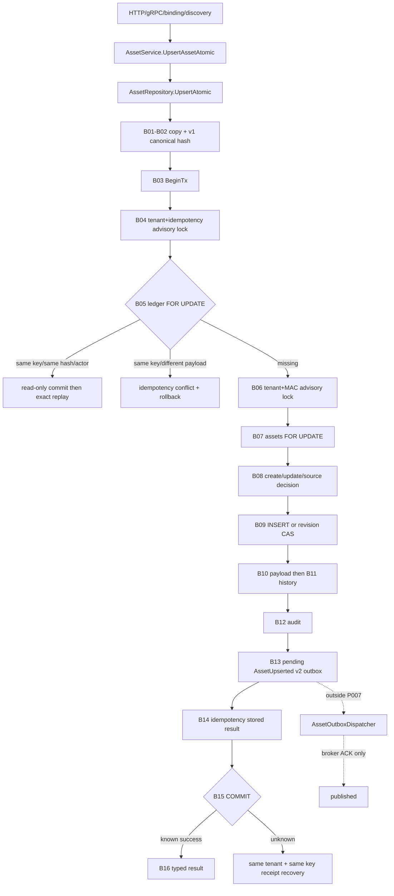
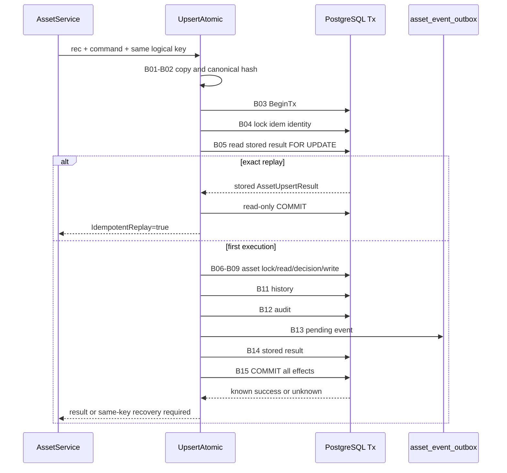

# T1-M06-P007 函数与事务流程图

```mermaid
flowchart TD
  H[HTTP/gRPC/binding/discovery] --> S[AssetService.UpsertAssetAtomic]
  S --> U[AssetRepository.UpsertAtomic]
  U --> B01[B01-B02 copy + v1 canonical hash]
  B01 --> B03[B03 BeginTx]
  B03 --> B04[B04 tenant+idempotency advisory lock]
  B04 --> B05{B05 ledger FOR UPDATE}
  B05 -->|same key/same hash/actor| R[read-only commit then exact replay]
  B05 -->|same key/different payload| X[idempotency conflict + rollback]
  B05 -->|missing| B06[B06 tenant+MAC advisory lock]
  B06 --> B07[B07 assets FOR UPDATE]
  B07 --> B08[B08 create/update/source decision]
  B08 --> B09[B09 INSERT or revision CAS]
  B09 --> B11[B10 payload then B11 history]
  B11 --> B12[B12 audit]
  B12 --> B13[B13 pending AssetUpserted v2 outbox]
  B13 --> B14[B14 idempotency stored result]
  B14 --> B15{B15 COMMIT}
  B15 -->|known success| B16[B16 typed result]
  B15 -->|unknown| Q[same tenant + same key receipt recovery]
  B13 -. outside P007 .-> D[AssetOutboxDispatcher]
  D -. broker ACK only .-> P[published]
```

```mermaid
sequenceDiagram
  participant C as AssetService
  participant R as UpsertAtomic
  participant PG as PostgreSQL Tx
  participant O as asset_event_outbox
  C->>R: rec + command + same logical key
  R->>R: B01-B02 copy and canonical hash
  R->>PG: B03 BeginTx
  R->>PG: B04 lock idem identity
  R->>PG: B05 read stored result FOR UPDATE
  alt exact replay
    PG-->>R: stored AssetUpsertResult
    R->>PG: read-only COMMIT
    R-->>C: IdempotentReplay=true
  else first execution
    R->>PG: B06-B09 asset lock/read/decision/write
    R->>PG: B11 history
    R->>PG: B12 audit
    R->>O: B13 pending event
    R->>PG: B14 stored result
    R->>PG: B15 COMMIT all effects
    PG-->>R: known success or unknown
    R-->>C: result or same-key recovery required
  end
```

边界：`pending`只证明事务内投递意图，`published`只能由dispatcher收到真实broker ACK后设置。本图不把Kafka或下游投影纳入P007成功谓词。

