# 课题一系统工程 PR 里程碑代码级详细设计

> 文档状态：`DESIGN_BASELINE_ACCEPTED / NOT_EXECUTED / EXECUTION_NO_GO`
>
> 适用仓库：`traffic-analysis-platform`
>
> 适用范围：课题一“园区网络流量智能检测与分析”的系统工程交付、M00—M13 里程碑、原子 PR、代码重构、验证、证据、回滚与发布。
>
> 不纳入：论文、专利、软件著作权、商务收益和合作意向；不把课题二的真实流量清洗、黑洞路由、攻击源阻断和 BOT 自动处置写成课题一完成能力。
>
> 重要边界：本文是面向执行的设计，不是完成证明。仓库账本中的 `OPEN / IMPLEMENTING / VERIFYING / OBSERVING / BLOCKED` 不因本文出现而变化。
>
> 内部三视角设计审查：上一冻结版曾对M00—M13骨架、候选物料、逐REQ制品、BOM跃迁及回滚/观察来源形成一致`ACCEPT_DESIGN_BASELINE`裁决；开发领取包曾处于1270/1287叶历史快照，本轮已继续演进为1289个叶子与212个父任务闭环，须以本轮重新生成、双重校验和新一轮专家答辩结果为准。这不是第三方或CNAS验收。执行裁决仍为`NO-GO`，所有任务仍为`DRAFT`、0个`READY`，不得启动业务切流、生产启用或M02以后PROM。

## 0. 文档目标与阅读方式

### 0.1 为什么需要这份文档

本文件把任务书、总体设计、102 项 canonical 整改账本、29 个工作包、Rust 探针、Kafka、Flink、六类存储、Go 控制面、React Web UI、MLOps、Kubernetes、测试与证据系统串成一条可执行主线。目标是让新加入的产品、前端、后端、数据、算法、测试、SRE 或评审人员不用先阅读全部源码，也能回答以下问题：

1. 用户在页面上做了什么，系统应该产生什么最终事实；
2. 一个字段从 Proto、Kafka、Flink、存储、API 到 UI 如何传播；
3. 一个写操作在哪里被受理，在哪里成为最终状态，失败后如何补偿；
4. 每个里程碑需要拆成哪些可合并、可验证、可回滚的小任务；
5. 哪些现有代码可以复用，哪些大文件已经形成维护风险；
6. 单测、G0、隔离 G1、真实 G2/G3、性能 G4、浏览器 G5、发布 G6、整改 G7、外部验收之间有什么区别；
7. 如何从最小合同交付继续演进到强化工程版本，而不让自设指标反向阻塞任务书最小交付。

### 0.2 推荐阅读路径

| 角色 | 必读章节 | 目的 |
|---|---|---|
| 新成员 | 0–4、21、31、37、38–40 | 十分钟内理解系统主链、状态语义、代码入口和命令终态 |
| 产品/前端 | 3–5、M09、22、28、37.8、40、45、59 | 理解页面、typed API、最终业务事实、partial和浏览器证据 |
| Go 后端 | 3–5、M01/M04/M09、21、23、26、37.8–37.9、41、49、55–56 | 理解 handler/service/repository、事务、outbox、执行包和故障点 |
| Rust/采集团队 | 3–5、M02/M03/M13-E、24、25、37.6、43 | 理解实时采集、PCAP、ACK、重放和性能边界 |
| Flink/数据平台 | 3–5、M03–M08、24、26、37.6–37.7、42、57 | 理解 consumer-first、UID、checkpoint、水位和多sink投影 |
| 算法/MLOps | M07–M09、M11、24、28、37.5、52、58 | 理解数据血缘、未知攻击、分阶段指标、盲测和模型激活/回滚 |
| 测试/验收 | 2、4、M04/M05/M11–M13、28–30、37.12、47、49、51–53 | 理解门禁、逐REQ闭包、完成manifest、CNAS和禁止声明 |
| SRE/实施 | 4、M10/M13-E、26、28、29、37.9/37.12、46、53、60 | 理解不可变候选、BOM、灰度、恢复、HA和部署DAG |
| 重构负责人 | 5、M09/M13-R、23、27、30、37.10、48、55–61 | 理解热点、黄金剖面、切缝、兼容外壳和删除时机 |

### 0.3 可持续扩展到百万字级的文档结构

“百万字”不应表现为一个无法检索的超长文件。本文先建立主控卷，后续按以下稳定层次扩展：

```text
主控卷（本文件）
├── 需求与里程碑索引
├── 代码地图与跨层流程
├── 212个父执行任务
├── 数据、接口、状态机、证据与回滚规则
└── 分卷路由
    ├── M00-M05 中期工程卷
    ├── M06-M10 完成态系统卷
    ├── M11-M13 验收发布卷
    ├── 前端页面与交互卷
    ├── Go 服务与事务卷
    ├── Rust 采集与PCAP卷
    ├── Flink作业与状态卷
    ├── 六存储Schema与生命周期卷
    ├── MLOps与检测质量卷
    └── 测试、证据、回滚与运行手册卷
```

扩展时必须保持任务 ID、requirement ID、canonical ID、代码路径和证据 ID 稳定。主控卷只保存权威摘要和跳转，不复制不断漂移的实现细节。

## 1. 事实层、设计层和执行层

### 1.1 三类事实不得混写

| 层 | 内容 | 可以证明 | 不能证明 |
|---|---|---|---|
| 任务书事实 | 已知/未知、50%、95%、误报率、CNAS、四源融合等 | 合同范围和硬门 | 当前代码已实现 |
| 目标设计 | 本文、总体设计、Feature Contract、OpenAPI/Proto | 预期结构和执行方式 | live 已部署、质量已达标 |
| 当前证据 | ledger、run manifest、真实依赖、浏览器、第三方报告 | 对应候选和范围内的事实 | 未执行门、其他 hash 或其他环境 |

### 1.2 当前工程事实基线

- 主链：`probe-agent -> ingest-gateway -> Kafka -> Flink -> storage -> Go API -> Web UI -> feedback/rules/MLOps`。
- Proto 真源：`proto/traffic/v1/*.proto`。
- 账本真源：`contracts/alignment/remediation-ledger.json`，当前仍无 `CLOSED` 项。
- 现有工作树包含预存在且归属未核验的 Topic/告警证据变更，执行 PR 必须使用隔离 clean worktree。
- 既有 G0/G1 证据必须按 candidate identity 和 `production_applied` 边界使用，不能与不同 hash 拼装。

#### 1.2.1 2026-08-10 当前审查快照

| 字段 | 当前值 | 可以证明 | 不可以证明 |
|---|---|---|---|
| Git HEAD | `f6072c4540b6198677b345e3df4bf876df5c7410` | 当前读取到的提交指针 | 它是已验证发布候选 |
| worktree | 2026-08-10T08:07:21+08:00点时为96个`git status --short`条目，清单SHA-256=`19e6b5f5df92da056d1e629440bc0284842f23db185d7a0de6af10125f81972b` | 当前树不干净；该点时清单可复核 | 后续时点的变更归属、可发布性；计数变化必须重生成manifest而非手改本行 |
| ledger | BLOCKED 3 / IMPLEMENTING 41 / OBSERVING 1 / OPEN 31 / VERIFYING 26 / CLOSED 0 | 102 项的当前生成账本分布 | 任何canonical已关闭 |
| global gates | G7=`OPEN`，G8=`BLOCKED` | 全局整改/项目门仍未关闭 | 课题一scoped profile已存在或已PASS |
| latest indexed G0 | `20260809-remediation-g0-full-v227`，content=`4015c51e...`，PASS | 该历史clean candidate的 alignment/full/python 基线 | live100、生产候选、Windows Chrome、G2–G6、G8 |
| active promotable candidate | `NONE` | 当前没有可以PROM的同一候选证据链 | 不同hash/环境的局部证据可被聚合 |
| CNAS | 正式候选、盲测原始输出和签名报告未登记 | 当前外部硬门未完成 | template/readiness/internal evaluator可代替CNAS |

上表是文档编制时的定点快照，不是自动更新的当前真值。执行任何里程碑前必须用机器生成 current-state manifest 取代本表，并将其hash绑定到任务卡。

## 2. 里程碑、原子 PR、任务和证据的关系

### 2.1 四层执行模型

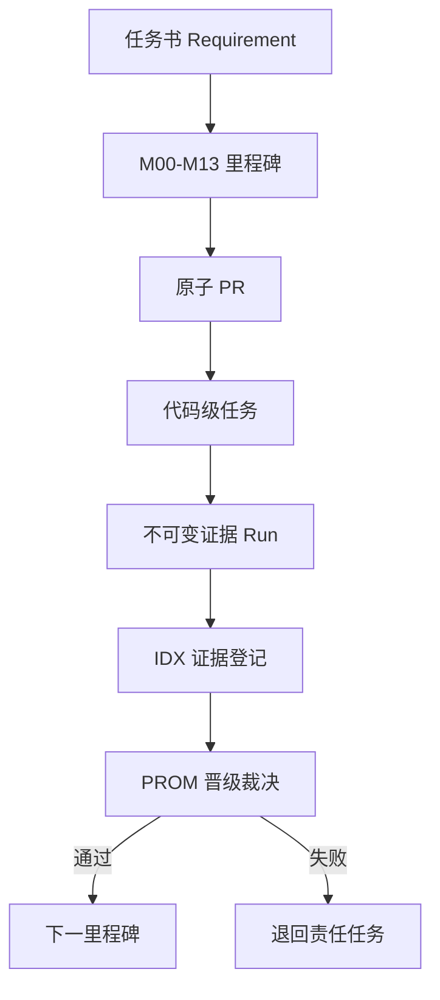

### 2.2 原子 PR 类型

```text
T1-Mxx-Pnn-{CTR|EXP|PRJ|WRT|UI|OPS|REF|TST-PRE|TST-POST|IDX|PROM}-slug
```

这里的 212 个 `T1-Mxx-Nnn` 是父执行任务（WBS work unit），不是 212 个可直接合并的 PR。表格中出现的 `WRT/PRJ`、`CTR/OPS`、`IDX/PROM` 等斜杠组合表示该父任务必须展开成有序 `pr_sequence[]`，每一个实际 PR 只能有一个上述类型。`REF` 只允许行为等价的重构；`EXT-EXECUTE`、`EXT-ATTEST`、签字和现场批准是 `external_activity`，不进入 PR 类型枚举。

```yaml
parent_task_expansion:
  task_id: T1-Mxx-Nnn
  status: DRAFT
  primary_id: ""
  accountable_milestone: T1-Mxx
  pr_sequence:
    - pr_id: T1-Mxx-P01-CTR-example
      pr_type: CTR
      depends_on: []
    - pr_id: T1-Mxx-P02-PRJ-example
      pr_type: PRJ
      depends_on: [T1-Mxx-P01-CTR-example]
  external_activities: []
```

机器可读task registry当前设计实例化212个父任务、30个R00–R29 closure slice和1289个单类型原子PR。相对上一1270版本，新增的19叶只服务`T1-M06-N004`代码级闭环，使用不相交`P901–P919`区间并永久保留既有`P007/P008`身份；不会把旧回执重新解释为新语义。新增列车把来源合同、语义验证与双owner签署批准、权威事务、HTTP/gRPC未知结果映射及各自测试、事件rail及其测试、权威事务故障测试、真broker测试以及授权真实依赖G2/G3对账逐叶串联。父任务/closure精确统计由同candidate生成器写回下方标记，不以本段自然语言替代机器真源。每个canonical拥有自己的CTR/EXP/PRJ/WRT/UI/OPS/TST/IDX适用序列；不存在用一个CTR一次关闭多个event/API版本的捷径。外部CUSTODY/EXECUTE/ATTEST/APPROVAL也作为非PR节点进入统一DAG；校验器区分`structure_status=PASS`与`dor/candidate/promotion_status=BLOCKED`。因此结构PASS不等于任务READY，本文仍不能被批准为M02以后的一次性执行基线。

<!-- topic1-registry-counts task=212 closure=30 parent_atomic=650 slice_atomic=639 atomic=1289 canonical=102 -->

事件驱动链默认采用 consumer-first：

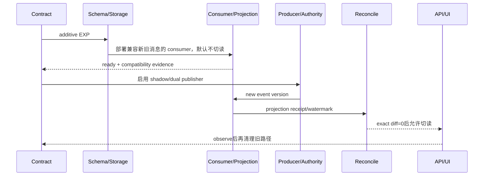

同步权威动作采用 authority-write-first 运行语义：

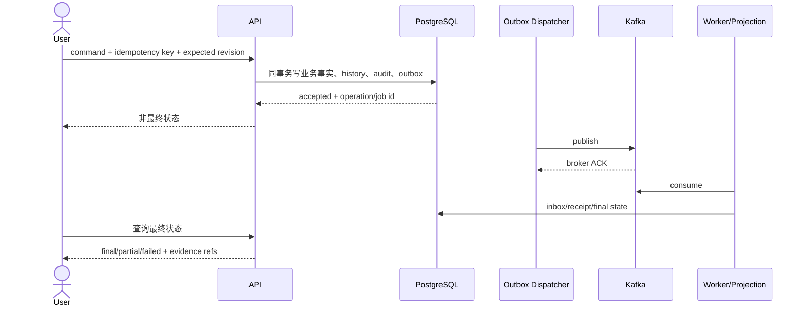

### 2.3 每个代码级任务的统一模板

每个任务必须能回答：

```yaml
task_id: T1-Mxx-Nnn
title: 动宾结构的单一结果
primary_kind: requirement|canonical|technical|release|external_gate
primary_id: requirement/canonical/technical/release/external_gate ID
secondary_ids: []
affected_ids: []
accountable_milestone: T1-Mxx
pr_type: CTR|EXP|PRJ|WRT|UI|OPS|REF|TST-PRE|TST-POST|IDX|PROM
pr_sequence: []
external_activities: []
depends_on: []
code_paths: []
path_resolution: EXISTING_FILE|EXISTING_GLOB|PROPOSED_FILE|LOGICAL_ARTIFACT|CONTRACT_ID|EXTERNAL_ARTIFACT
entrypoints: []
input_contract: Proto/OpenAPI/Event/DDL/Config
output_contract: response/event/storage/object/UI state
authority: authoritative store or external authority
side_effects: database/event/object/deployment
positive_tests: []
negative_tests: []
required_gate: G0-G8 profile
evidence: run and manifest requirements
rollback: code/config/schema/event/data/in-flight handling
refactor_trigger: size/duplication/coupling threshold
allowed_claim: "candidate + profile + environment + time window + one bounded capability"
forbidden_claim: one sentence
```

### 2.4 任务完成定义

任务完成不等于里程碑完成。任务最多把 canonical 状态推进到 `IMPLEMENTING` 或 `VERIFYING`。只有同一候选完成所需门、独立 IDX 登记、PROM 预合并 allowed-path/equivalence 校验、PROM 无生产逻辑、合并后 production-content 等价复核且完成前清单签署后，里程碑才可晋级和签 tag。

## 3. 系统代码地图

### 3.1 当前实现拓扑（as-is，含已知漂移）

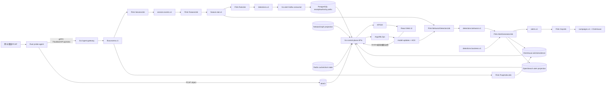

已知漂移：`contracts/events/kafka-topic-catalog.v1.json` 把 `detections.v1` 登记为 `AlertGeneratorJob` 的消费 Topic，但当前 `AlertGeneratorJob.java` 的默认代码读取 `detections.behavior.v1` 和 `detections.business.v1`。图中PG路径是Go consumer/命令/回执路径，不是 AlertGenerator 直写。这些漂移在M04 Topic convergence完成前必须保持`BLOCKED`，不得用文档目标图覆盖当前代码事实。

### 3.2 目标检测 Topic 收敛拓扑（to-be，须先批准CTR）

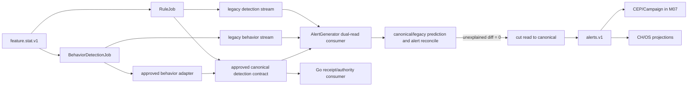

目标拓扑不预先规定必须新建 Topic。首个CTR必须对 `detections.v1`、`detections.behavior.v1`、`detections.business.v1` 的 Proto、key、语义和生产/消费者做compatibility decision；只有批准合同才能决定是扩展现有 `detections.v1`、新建版本或保留分流。启用顺序严格为 dual-read consumer-ready→consumer部署→producer dual-publish→对账→切读→退役观察。

### 3.3 主要代码入口

| 层 | 入口/真源 | 说明 |
|---|---|---|
| Rust | `rust/probe-agent/probe-agent/src/main.rs` | 注册探针、创建 capture/aggregator/archiver/sender、启动组件和优雅停止 |
| Rust模块 | `capture/`、`parser/`、`aggregator/`、`archiver/`、`sender/` | 抓包、协议解析、Flow聚合、PCAP归档、gRPC发送 |
| Proto | `proto/traffic/v1/*.proto` | EventHeader、Flow、Session、Feature、Detection、Alert、PCAP、Asset 等跨语言合同 |
| Ingest | `go/control-plane/cmd/ingest-gateway/main.go` | gRPC接入、认证、Kafka发布和探针控制 |
| Flink | `java/flink-jobs/flink-*-job` | Session、Feature、Behavior、CEP、Rule、Alert、PCAP索引、日志、用户行为 |
| Go API | `go/control-plane/cmd/*/main.go` | alert、asset、auth、forensics、graph、rule、threat-intel 等服务装配 |
| Go领域 | `go/control-plane/internal/<domain>` | handler/service/repository、事务、outbox、consumer和投影 |
| Web | `web/ui/src/App.tsx`、`pages/`、`services/` | 路由、页面、typed API、状态规范化和业务交互 |
| 数据 | `common/sql/`、`deployments/*/migrations/` | PG/CH schema、版本化迁移和初始化入口 |
| 事件 | `contracts/events/`、`common/kafka/` | Topic、ACL、JSON Schema、consumer/producer目录 |
| 部署 | `deployments/kubernetes/` | 应用、基础设施、init jobs、安全、canary、可观测性 |
| MLOps | `mlops/` | 数据抽取、训练、评估、解释、ONNX、注册、Argo workflow |
| 证据 | `scripts/alignment/`、`doc/02_acceptance/` | capture/verify、manifest、候选身份和各级门禁 |

## 4. 跨层不变量

1. `tenant_id` 必须来自认证上下文并贯穿事件、存储、API、UI，不能信任普通请求体覆盖。
2. `event_id`、`trace_id`、`community_id`、`schema_version`、event time 和 source version 必须可跨语言重放。
3. Kafka ACK 只证明 broker 接受；最终投影必须由 receipt/watermark/reconcile 证明。
4. PostgreSQL 保存权威命令状态、事务历史、审计和 outbox；ClickHouse保存分析事实；OpenSearch保存搜索投影；Nebula保存图投影；Redis保存短状态/幂等；MinIO保存对象和manifest。
5. 图、搜索、缓存、对象索引都不能反向覆盖权威事实。
6. 页面必须区分 loading、empty、partial、unavailable、accepted、running、completed、failed、canceled、conflict。
7. 所有写动作需要稳定 action ID、权限、幂等、revision、审计和最终状态查询。
8. 任何 source/config/schema/model/data profile 变化必须通过影响矩阵使下游证据失效。

## 5. 重构总策略

### 5.1 已识别的大文件热点

下表为 2026-08-09 在当前工作树执行 `wc -l` 得到的点时快照，不是长期不变的门禁输入。任务开工时应由脚本重算并把candidate hash、测量命令和结果写入任务卡；重构优先级由耦合/风险/当前纵切片决定，不由行数单独决定。

| 文件 | 当前规模（约） | 风险 | 目标切缝 |
|---|---:|---|---|
| `web/ui/src/styles/pages.css` | 59,790行 | 全局覆盖、页面耦合、删除困难 | 按页面/组件/token分层，保留兼容入口后逐路由迁移 |
| `go/control-plane/internal/alert/api/handler_product_pages.go` | 7,606行 | 多领域快照和动作混合 | 按 encrypted/fusion/baseline/topic/data-quality 拆 handler+service |
| `web/ui/src/services/pageSnapshotAdapters.ts` | 4,556行 | 多页面转换耦合、字段漂移 | 每个页面独立 adapter + shared envelope/errors |
| `web/ui/src/pages/TopicWorkbenchPage.tsx` | 3,762行 | 视图、请求、状态机、导出混合 | query hooks、view models、panels、actions、export拆分 |
| `go/control-plane/internal/alert/api/handler_system.go` | 2,989行 | 系统路由和领域动作混合 | route registry、system query、domain command分层 |
| `web/ui/src/services/pageApiPlans.ts` | 2,591行 | 页面计划和运行逻辑混合 | contract生成物与运行client分离 |
| `web/ui/src/services/api.ts` | 1,970行 | 全域API聚合 | 按domain client拆分，保留稳定barrel export |
| `go/control-plane/cmd/alert-service/main.go` | 1,824行 | 装配、迁移、worker、路由混合 | composition root + module wiring + worker registry |

### 5.2 重构规则

- 不做无业务证据的大爆炸重构；每次抽取必须由一个里程碑任务驱动。
- 先建立 contract/characterization tests，再抽模块，再切调用，最后删除旧入口。
- 旧 API、事件和读路径必须在观察窗内保持兼容。
- 同一 PR 不同时完成行为变化和大规模文件搬迁；搬迁 PR 要求 behavior-neutral。
- UI 拆分先抽数据和状态机，再抽组件，最后抽 CSS，避免只拆 JSX 仍共享巨大隐式状态。
- Go 拆分先隔离依赖接口和 repository，再移动 handler，避免产生循环包。
- Flink 拆分保持稳定 operator UID 和 savepoint 兼容；禁止为代码整洁随意更名 UID。

## 6. 里程碑总索引与任务数

| 里程碑 | 主题 | 计划代码级任务数 |
|---|---|---:|
| M00 | 任务书真源、边界和声明 | 8 |
| M01 | 候选身份、基线、合同和早期护栏 | 14 |
| M02 | 实时/离线采集和PCAP写链 | 16 |
| M03 | 解析、会话、特征和离线文件还原 | 18 |
| M04 | 已知攻击与中期预警准确率（签字方法）≥50% | 12 |
| M05 | 中期证据与PROM | 8 |
| M06 | 四源接入、两个缺失producer与实体时序 | 18 |
| M07 | 质量、融合、基准、图和攻击链 | 20 |
| M08 | 已知/未知AI与模型治理 | 18 |
| M09 | 产品、证据、取证、反馈和UI | 24 |
| M10 | 最小部署、安全和范围恢复 | 16 |
| M11 | 冻结盲测和CNAS | 12 |
| M12 | 合同最小晋级 | 8 |
| M13 | 整改收敛与工程强化 | 20 |
| 合计 |  | 212 |

> 后续章节逐项定义这 212 个父执行任务。父任务还要按PR类型展开为原子叶子PR，数量不是承诺全部已实现。

## 7. M00：任务书真源、边界和声明治理（8项）

### 7.1 目标与退出条件

M00 不改运行代码。它建立后续所有代码任务的需求主键、指标口径占位、课题边界和声明词典。退出上限是“范围与追溯结构已冻结”，禁止声明采集、检测或验收能力完成。

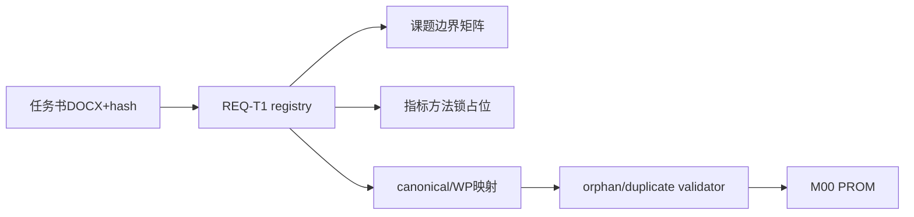

### 7.2 代码级任务

| ID | PR | 代码/文档路径 | 执行动作 | 验证与回滚 |
|---|---|---|---|---|
| T1-M00-N001 | CTR | `doc/00_sources/任务书.docx`、`contracts/requirements/topic1-system-requirements.v1.json` | 记录原件 SHA-256、表格位置、研究条款、中期和完成态硬指标；不复制软成果 | 固定抽取测试；回滚为恢复上一版本 registry，不改 DOCX |
| T1-M00-N002 | CTR | `contracts/requirements/topic1-system-requirements.schema.json`、`contracts/requirements/topic1-system-requirements.v1.json`、`scripts/alignment/build_topic1_task_registry.py` | 建立由任务书原件SHA和表格/章节锚定的原子需求registry；可单独寻址一套集成系统、实时/离线与万兆profile、深度解析、文件还原、加密流量特征、四源、三级融合、静/动态基准、攻击链/溯源、GNN、中期已知攻击、最终已知+未知、预警准确率/误报率及CNAS | schema、来源hash和ID唯一校验；软成果与internal strengthening不得进入contract-scope requirement；禁止用canonical ID替代requirement ID |
| T1-M00-N003 | CTR | 拟新增 claim schema、`doc/02_acceptance/README.md` | 定义 `contract_scope/formal_kpi/enabling_engineering/internal_strengthening/out_of_scope` | 负例检查 10×100G 不得归 formal KPI；回滚词典版本 |
| T1-M00-N004 | CTR | 拟新增 `contracts/quality/topic1-metric-method.schema.json` | 为“预警准确率”、误报率、known/unknown、abstain、阈值、分析单元、去重窗和复测建立待签方法模型；候选公式仅作proposal | schema 正负例；签字前只允许 `method_status=pending_signature`，任何proposal不参与门禁 |
| T1-M00-N005 | CTR | 拟新增 `contracts/requirements/topic-boundaries.v1.json` | 固化课题一检测/证据/建议与课题二清洗阻断、课题四VPN专项等边界 | 自动扫描 allowed/forbidden claim；回滚合同版本 |
| T1-M00-N006 | REF/TST-PRE | 新建`scripts/alignment/test_topic1_traceability.py`；只读`build_topic1_task_registry.py#validate`、canonical、WP与requirements registry；独立`test-result.json`+`case-report.json` | 先实现正向及缺canonical/重复accountable/错误里程碑/漏TASK-IDX/增强图成环fixture，再由后继测试叶在同一候选运行全部case；测试实现叶不写PASS证据，测试证据叶不改runner | 依赖N007；每例有case ID、输入hash、expected/actual；`orphan=0`、`duplicate_accountable=0`、增强DAG无环；失败结果保留且不得生成current IDX |
| T1-M00-N007 | CTR | `contracts/alignment/milestone-registry.v1.json`、`task-registry.schema.json`、`task-registry.v1.json` | 在现有DRAFT registry上补齐真实owner、accountable canonical/requirement、精确depends_on、promotion profile和READY所需字段；结构由生成器维护 | 在N006之前完成；DAG无环、编号连续、accountable唯一；禁止手改生成JSON |
| T1-M00-N008 | IDX/PROM | `doc/02_acceptance/runs/<m00>/manifest.json` | 保存评审签字、输入 hash、验证结果、允许/禁止声明 | PROM 无生产文件；失败保留 manifest 并回到责任任务 |

### 7.3 M00 重构用途

以后发现代码重复或职责漂移时，先根据 requirement/canonical 映射判断其真正归属，再移动代码。禁止以“两个页面看起来相似”为理由合并不同权威状态机，也禁止为一个 canonical ID 建立多个关闭里程碑。

## 8. M01：候选身份、基线、合同与早期护栏（14项）

### 8.1 目标与关键风险

M01 解决“我们到底在测试哪个候选”。候选不是一个 Git SHA，而是源树、预构建制品、镜像、配置、Schema、模型和数据集组成的闭包。现有 v227 source manifest 排除了两个本地 ELF；源码仍被覆盖，但 overlay Dockerfile 可复制这些 ELF，因此需要独立制品来源门。

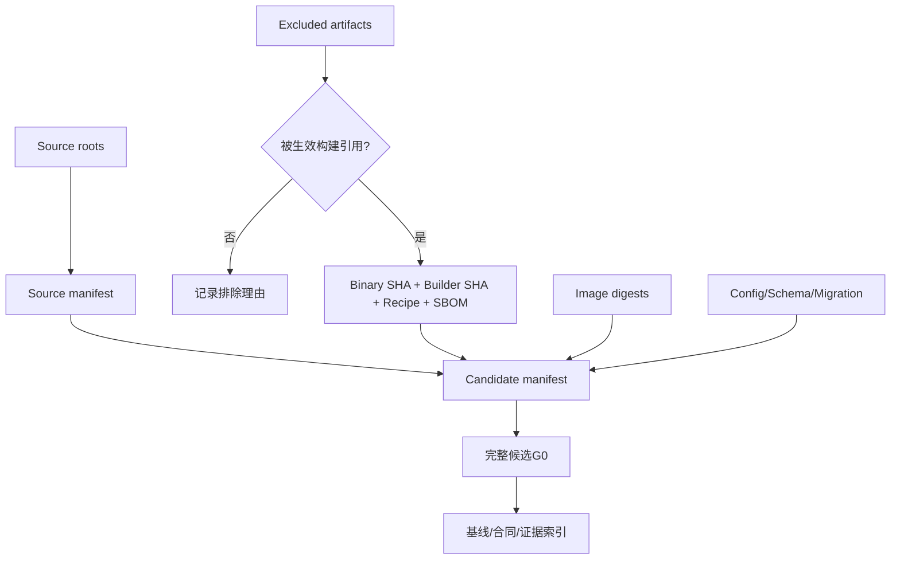

### 8.2 代码级任务

| ID | PR | 代码路径 | 执行动作 | 验证与回滚 |
|---|---|---|---|---|
| T1-M01-N001 | TST-PRE | `scripts/alignment/candidate_snapshot.py`、`capture_g0.py` | 实现 active build/deploy 输入闭包扫描，识别 source fingerprint 排除但被 Dockerfile 引用的制品 | 对 `Dockerfile.alert-service*.overlay` 建负例；缺 provenance 时 fail closed |
| T1-M01-N002 | CTR | 拟新增 `contracts/release/candidate-identity.schema.json` | 定义 source hash、promotion commit、binary、builder、image、config、Schema、model、dataset 字段 | schema 正负例；promotion commit 与生产内容身份分离 |
| T1-M01-N003 | REF/TST-PRE | 新建`scripts/alignment/test_implementation_candidate.py`；只读`validate_implementation_candidate`、prebuilt overlay、candidate与provenance schema；独立`test-result.json`+`case-report.json` | 先实现8类prebuilt/provenance拒绝fixture，再由独立测试叶运行；fixture叶只声明测试资产，证据叶只记录同候选case结果 | 每例绑定binary/builder/recipe/toolchain/image/SBOM/provenance；漏生效排除制品、重复path、tracked/root排除、自报验签等均FAIL；不得把非确定性ELF盲塞source hash |
| T1-M01-N004 | REF/TST-PRE | 新建`test_candidate_freeze.py`；分别修改`capture_g0.py#_git_snapshot`与`capture_g0.py#main`；只读`candidate_snapshot.py#build_snapshot` | 按fixture→git identity→CLI fail-closed→同候选执行证据串行拆4叶，冻结dirty、parent、range、moving HEAD、source roots、exclusion和run覆盖语义 | 8类正负例全部PASS；只在隔离worktree运行，不清理/stash/reset当前用户工作树；失败不写候选指针，回滚恢复fail-closed并保留历史run |
| T1-M01-N005 | CTR/PRJ/REF/TST-PRE | `topic1-contract-inventory.schema.json`→新建`build_topic1_contract_inventory.py#main`→新建`test_topic1_contract_inventory.py#main`→派生`topic1-contract-inventory.v1.json`→独立结果 | schema叶只冻结字段；builder叶只读canonical/feature权威源并生成54功能/48技术、38标准/16 backlog派生盘点；REF叶实现独立mutation/exact-set oracle；TST叶只执行并写结果 | 禁止schema、builder与oracle同叶自证；builder显式`--write`后`--check`，测试runner独立变异输入并产受签结果；不反写权威registry、不把缺合同项写空合同 |
| T1-M01-N006 | CTR | `contracts/alignment/features/`、`feature-contract.schema.json` | 为M02—M13所有backlog功能一次性登记唯一contract owner、稳定ID、初始version和待完善字段；不得由后续里程碑另建同义合同 | 每PR一个主feature；合同含authority、states、permissions、acceptance、rollback；后续CTR只能在同owner下版本化 |
| T1-M01-N007 | CTR | `contracts/openapi/alignment-v1.openapi.json`、Go route注册 | 绑定 operationId、路径、权限、错误、最终状态查询和版本 | `check_openapi.py`；未知/重复 route 阻断 |
| T1-M01-N008 | CTR/PRJ/REF/TST-PRE | matrix schema→新建`build_proto_topic_compatibility_matrix.py#main`→新建`test_proto_topic_compatibility_matrix.py#main`→派生matrix→独立结果；只读12个traffic/v1 Proto、buf配置、Kafka JSON schema及Topic/ACL catalogs | schema、descriptor/catalog/ACL builder、独立mutation oracle和证据结果分4叶；分析单位`(topic,event_version,proto_fqn)`，记录key、producer、consumer-ready、DLQ、ACL、compat状态 | 禁止schema/builder/oracle同叶自证；12个Proto与import closure exact-set、`buf lint`、catalog/ACL双向差集及consumer-first负例通过；不新增Topic/Proto、不启producer/consumer |
| T1-M01-N009 | CTR/PRJ/REF/TST-PRE | authority schema→新建`build_schema_authority_registry.py#main`→新建`test_schema_authority_registry.py#main`→派生registry→独立结果；只读批准PG/CH全部init、migration及生产runtime DDL callsite | schema、确定性scanner、独立mutation oracle和证据结果分4叶；按`(storage,schema,object)`登记唯一authority、init、version、checksum、predecessor、replay和runtime入口 | 文件↔registry双向差集、顺序/checksum/重放/重复authority/runtime DDL负例通过；不执行DDL，回滚只撤未晋级schema/builder/test/派生版本 |
| T1-M01-N010 | CTR/REF/TST-PRE/OPS/TST-POST | 3个trust/request/attestation schema；新建`test_trusted_signature_verifier.py#main`后再新建`verify_trusted_signature.py#verify_exact_payload`；迁移`require_trusted_signature_verifier`及9个调用方（含内建self-test和work-order evidence正向验签）；default-off部署manifest | 严格串行为合同→fixture harness→adapter→typed wrapper→9个单symbol调用方迁移→10类负例→受保护后端→正例；fixture不读取尚未创建的adapter，后续叶显式读取前驱runner；任何未迁移调用方仍硬阻断 | exact payload/hash、signature、roles、purpose/time、policy、candidate/profile/environment及CNAS scope适用时全传；OPS专用checker验证default-off、pinned digest、Secret ref、NetworkPolicy和hard-block回滚；正例只关闭技术验签叶 |
| T1-M01-N011 | CTR | common response、adapter registry、UI client | 定义 accepted/final/partial、错误码、trace、watermark和 unknown-field 行为 | 合同测试；HTTP 2xx 不得归 final |
| T1-M01-N012 | TST-PRE | `scripts/alignment/build_*`、`validate.py` | 建立派生目录漂移、固定计数漂移、未生成客户端和合同差集门 | mutation测试；生成物必须可重复 |
| T1-M01-N013 | IDX | `contracts/alignment/evidence-index.json`、run manifests | 建立证据新鲜度和失效传播：路径→门→run→里程碑 | 改动fixture验证旧证据变STALE；ledger不得手改 |
| T1-M01-N014 | PROM | M01 checklist、candidate manifest | 汇总完整G0、合同差集、排除制品、允许/禁止声明 | PROM tree不含生产变化；合并后重算身份并跑promotion-profile G0 |

### 8.3 M01 完成上限

M01 完成只证明候选和合同可识别、可复建、可审计。它不证明任何 API 已部署、Kafka 已消费、页面可用或 CNAS 达标。

## 9. M02：实时/离线采集与PCAP耐久写链（16项）

### 9.1 目标架构

M02 建立抓包、Flow 聚合、gRPC 发送、Kafka 耐久受理、PCAP 对象归档、manifest 和索引 receipt。`F-PROBE-001/002` 是主功能；完整取证 `F-FORENSICS-001` 只作为 secondary，留到 M09 关闭。

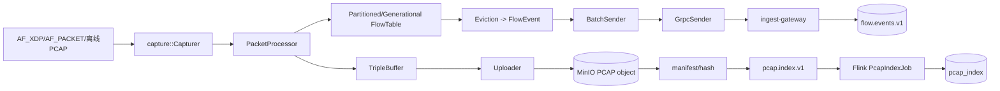

### 9.2 代码级任务

| ID | PR | 代码路径 | 执行动作 | 验证与回滚 |
|---|---|---|---|---|
| T1-M02-N001 | CTR | `proto/traffic/v1/common.proto`、`flow.proto`、`pcap.proto`、`ingest.proto` | 冻结 EventHeader、FlowBatch、PcapIndexMeta、tenant/probe/event/community/time/schema字段 | Proto固定向量、旧消息兼容；每PR最多一事件版本 |
| T1-M02-N002 | CTR | `contracts/kafka/event-envelope-idempotency.v1.json`、`pcap-metadata-ack.v1.json` | 定义稳定event ID、key、ACK阶段、重复/冲突和final-indexed语义 | 合同负例；Kafka ACK不得称最终索引 |
| T1-M02-N003 | EXP | Topic/ACL目录、`01-kafka-topics.yaml`、service identities | additive创建/核对flow、pcap-index、DLQ和consumer group权限 | 旧producer/consumer兼容；topic不在回滚中删除 |
| T1-M02-N004 | WRT | Rust `config.rs`、`capture/` | 校验接口、抓包模式、frame/ring、CPU/NUMA、背压和安全transport | Rust单测、无权限/接口消失/坏配置负例；回退配置 |
| T1-M02-N005 | WRT | `aggregator/packet_processor.rs`、flow table、community_id | 稳定五元组方向、Community ID、分区表、eviction和重启身份 | 跨语言固定向量、重复包/乱序/超时测试 |
| T1-M02-N006 | WRT | `rust/probe-agent/probe-agent/src/archiver/buffer.rs`、`upload_journal.rs`、`uploader.rs`、`mod.rs` | 建立PCAP journal、buffer轮转、multipart、对象命名和本地恢复 | 中断上传、磁盘满、对象已存在/摘要冲突；保留journal回滚 |
| T1-M02-N007 | WRT | `sender/`、`main.rs` | 批量Flow发送、超时、重试、in-flight限制和优雅停止 | gateway不可用、重启、不丢本地待发状态；停止新publisher回滚 |
| T1-M02-N008 | WRT | `cmd/ingest-gateway/main.go`、`internal/ingest/server/handler.go` | 认证tenant/probe、拒绝body/header漂移、Kafka RequireAll ACK和非最终响应 | Go集成测试、broker失败返回Unavailable、不生成伪成功 |
| T1-M02-N009 | PRJ | Kafka兼容consumer、Flink common | 先部署能读取旧/新envelope的consumer，未知字段容忍、非法字段DLQ | consumer ready后才能开producer；回滚保持双读 |
| T1-M02-N010 | PRJ | `flink-pcap-index-job/PcapIndexJob.java` | 读取pcap index，稳定UID，checkpoint，批量写CH索引 | 乱序/重复/坏对象/迟到、savepoint恢复、sink对账 |
| T1-M02-N011 | WRT/PRJ | MinIO object governance、PCAP manifest | 对象、version ID、SHA、大小、时间窗、probe和tenant形成不可变manifest | Stat/下载hash/跨tenant负例；对象不随索引回滚删除 |
| T1-M02-N012 | WRT | Probe注册/heartbeat/control ACK | desired/reported配置、证书、操作租约、过期、重复和乱序ACK | Agent离线/重启/轮证；accepted与applied分离 |
| T1-M02-N013 | OPS | probe DaemonSet、ingest、Kafka、MinIO、Flink canary | 按tenant/probe灰度，consumer先ready，再启producer | 失败先停producer；保留consumer和数据作对账 |
| T1-M02-N014 | TST-PRE | Rust/Go/Proto/Flink专项 | G0/G1：固定PCAP、回环Kafka/MinIO、幂等和故障注入 | `production_applied=false`；不得冒充真实G2/G3 |
| T1-M02-N015 | TST-POST | `scripts/alignment/capture_probe_canary.py`、`capture_trace_watermark_reconcile.py`、拟新profile matrix | 分别对实时网卡和离线PCAP按批准接口/模式/包长/时长/重启/背压/磁盘满/对象失败做矩阵，对账offered/captured、NIC/probe drop、journal、broker offset、object/hash/index；批准的万兆或更高profile须冻结发生器、镜像点、测量精度和归因规则 | 仅当`observed_system_attributable_drop_packets=0`且`unexplained_diff=0`才形成该contract profile PASS；发生器/镜像/计量不确定性无法界定则run无效，不得转成系统免责 |
| T1-M02-N016 | IDX/PROM | M02 run manifests | 分离IDX和PROM叶子PR，登记G2/G3、profile matrix、零系统归因丢包裁决、回滚、观察窗和未覆盖项 | allowed=该candidate/profile/environment/window观测系统归因丢包为0且链路耐久；禁止泛化为任意环境绝对zero loss、10×100G/512Mpps或全协议覆盖 |

## 10. M03：深度解析、会话、特征与离线文件还原（18项）

### 10.1 责任边界

M03 形成协议解析、Session、Feature、基础加密流量特征，并建立离线应用层会话重组与文件还原的底层能力。`F-ENCRYPTED-001` 和 `F-FORENSICS-001` 的完整产品关闭仍在 M09；M03 只交付版本化底层事实、对象和状态，禁止声明产品或全协议覆盖完成。

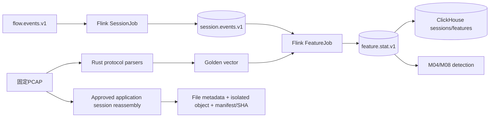

### 10.2 代码级任务

| ID | PR | 代码路径 | 执行动作 | 验证与回滚 |
|---|---|---|---|---|
| T1-M03-N001 | CTR | `session.proto`、`feature.proto` | 冻结Session/Feature身份、event time、evidence refs、缺失与版本字段 | Proto lint和固定向量；旧reader兼容 |
| T1-M03-N002 | CTR | `contracts/events/kafka-topic-catalog.v1.json`、`proto/traffic/v1/feature.proto` | 冻结现有`session.events.v1`和`feature.stat.v1`的key/producer/consumer；seq/fingerprint默认作为版本化Feature字段，新Topic必须另立批准CTR | 当前catalog不存在`feature.stats.v1/feature.fingerprint.v1`；orphan producer/consumer=0或BLOCKED |
| T1-M03-N003 | WRT | `rust/probe-agent/probe-agent/src/parser/mod.rs`、`dns.rs`、`dhcp.rs`、`arp.rs`及planned decoder paths | 统一L2–L4/已批准应用协议的截断、坏包、扩展头、fragment和unsupported语义；planned path必须在任务卡精确展开 | parser corpus、fuzz/负例；失败不panic；不把拟新文件写成已存在 |
| T1-M03-N004 | WRT | Rust aggregator | 把解析结果映射为稳定Flow字段、方向和协议元数据 | 重放同PCAP结果稳定；不填造缺失字段 |
| T1-M03-N005 | PRJ | `flink-session-job/SessionJob.java` | consumer-first读取Flow，稳定UID、event-time、window、state TTL、批量CH sink | 重复/乱序/迟到、checkpoint/savepoint；回旧job/savepoint |
| T1-M03-N006 | PRJ | `flink-feature-job/FeatureJob.java` | 计算统计、时序、方向、包长、间隔和会话上下文特征，输出`feature_category`枚举：flow_metadata、plaintext_visible、side_channel、raw_reference、randomness_statistics | 离在线同向量；不丢tenant/community/evidence；类别、窗口、单位、算法版本和缺失语义固定 |
| T1-M03-N007 | PRJ | Feature fingerprint相关代码 | 产生JA3/JA4、SNI、证书、TLS/QUIC、长度/方向序列、熵/随机性与统计性度量、侧信道和原始流量引用 | 加密不等同恶意；熵算法/窗口/单位版本化；缺证书、无SNI、不可计算、unsupported分开；golden vector验证离在线确定性 |
| T1-M03-N008 | EXP | CH sessions/features迁移与Schema authority | additive增加版本、source event、watermark、partial字段 | 双重回放、旧查询兼容；禁止Flink启动DDL |
| T1-M03-N009 | PRJ | ClickHouse批量sink | 使用Distributed目标和batch写入，失败重试有界 | 不允许逐条新连接；部分失败和重复写对账 |
| T1-M03-N010 | PRJ | DLQ/quality signals | 对坏schema、坏timestamp、不可解析、超迟到建立规范DLQ和handoff | DLQ ACK后再提交源offset；源tuple可反查 |
| T1-M03-N011 | TST-PRE | 固定PCAP/golden vectors | 建立正常、攻击、IPv6、TLS、QUIC、截断、大流和空样本集合 | 输出hash、版本、预期字段；不含盲测标签泄漏 |
| T1-M03-N012 | TST-POST | 离线重放与在线采集对比 | 同一PCAP走offline replay和realtime pipeline，对比Session/Feature | exact或批准容差；差异逐字段解释 |
| T1-M03-N013 | OPS | Flink consumer-first rollout | 先新consumer shadow，恢复savepoint，再灰度新producer/event | UID/savepoint兼容；回滚旧producer/旧job |
| T1-M03-N014 | TST-POST | 解析覆盖与批准吞吐profile | 在M02同一万兆或更高批准profile上输出协议覆盖、Session/Feature完整性、失败率、积压、checkpoint、sink延迟 | 仅`PASS_FOR_COVERED_PROFILE`的contract-scope/engineering证据；不宣称全协议或强化性能通过 |
| T1-M03-N015 | CTR | 拟新 `contracts/forensics/file-restoration.v1.json`、`REQ-T1-FILE-RESTORE` | 定义应用层会话重组、批准协议覆盖矩阵（如HTTP/FTP/SMTP的实际批准子集）、文件元数据、对象/SHA、`complete/partial/truncated/corrupt/oversize/unsupported` | 合同不把PCAP裁剪当文件还原；未批准协议不声明支持 |
| T1-M03-N016 | PRJ | planned `go/control-plane/internal/forensics/reassembly/`、`extractor/`、现有`index/`、`s3client/` | 从PCAP索引按五元组/时间窗重组TCP/已批准应用流，生成文件元数据、隔离对象、manifest/hash和可见部分状态 | 不执行恢复内容；tenant/quota/retention、超大、zip-bomb、路径穿越、坏编码负例；默认off |
| T1-M03-N017 | TST-POST | 拟新file-restoration golden corpus/validator | 覆盖批准协议、乱序/重传/丢包/截断/加密/多文件/超大/恶意容器，对账输入流、输出元数据、对象和SHA | 仅批准矩阵PASS；恶意内容不被打开/执行；对象孤儿必须对账 |
| T1-M03-N018 | IDX/PROM | M03 evidence | 拆分IDX/PROM叶子PR，登记G2/G3、golden vector、parity、解析/文件覆盖矩阵、回滚和未实现产品语义 | allowed=覆盖profile的基础特征/文件底层链；forbidden=F-ENCRYPTED/F-FORENSICS产品完成 |

## 11. M04：已知攻击检测与中期预警准确率（签字方法）≥50%（12项）

### 11.1 目标和指标边界

M04 对应任务书指标1.1中期栏：可检测已知网络攻击类型，预警准确率达到50%以上。任务书未给出课题一“预警准确率”的公式，因此必须在看评测结果前由项目/算法/QA/验收方签字方法，并使用事前冻结的已知攻击数据、标签和阈值。内部F1、页面数字、训练集结果或未签候选公式都不参与中期硬门。

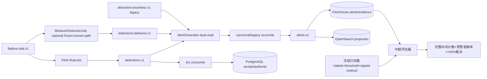

### 11.2 代码级任务

| ID | PR | 代码路径 | 执行动作 | 验证与回滚 |
|---|---|---|---|---|
| T1-M04-N001 | CTR | metric method schema、任务书映射 | 以`metric_name=预警准确率`冻结签字方法、分析单位、分母/分子、去重窗、阈值选择和无效样本规则 | 签字前`method_status=pending_signature`；看结果后不得换方法 |
| T1-M04-N002 | CTR | known taxonomy、rule/model registry | 定义已知攻击类别、正常负例、规则/模型版本和证据要求 | 类别ID稳定；不混入未知攻击完成声明 |
| T1-M04-N003 | TST-PRE | 拟新增中期dataset manifest | 冻结PCAP/feature样本、labels、split、hash、许可和保管人 | 泄漏扫描、重复实体/时间窗口检查 |
| T1-M04-N004 | WRT | `java/flink-jobs/flink-rule-job/.../RuleJob.java`及source/sink | 读取版本化`feature.stat.v1`和已冻结规则更新，稳定UID，产生确定性`detections.v1` | 坏规则、部分ACK、热更新、回滚；旧/新event版本不漂移 |
| T1-M04-N005 | WRT | `java/flink-jobs/flink-behavior-job/.../BehaviorDetectionJob.java` | 如中期方案需要，只消费事前冻结的known artifact/threshold并产生可对账检测；不引用M07动态baseline | 默认off；正常负例/tenant/迟到/阈值；`F-BASELINE/F-MLOPS`不在M04关闭 |
| T1-M04-N006 | CTR/PRJ | `contracts/events/kafka-topic-catalog.v1.json`、`AlertGeneratorJob.java` | 对三类检测Topic/Proto/key做compatibility decision，实现AlertGenerator对批准canonical与legacy的dual-read consumer-ready | 先部署idle consumer；坏schema/DLQ/重放/savepoint兼容；CEP不在本任务 |
| T1-M04-N007 | WRT/OPS | `RuleJob.java`、`BehaviorDetectionJob.java`、`AlertGeneratorJob.java`、`alert.proto` | 在N006 consumer-ready后启批准dual-publish/canary，对账canonical/legacy prediction和alert，无未解释diff后切读；Detection→Alert保持稳定ID/trace/evidence/version | producer不先启；重放不重复告警；回旧读路由和savepoint |
| T1-M04-N008 | EXP/PRJ | CH alerts/evidence、OpenSearch alert index、Go PG receipt的独立planned leaf PRs | 分存储additive保存检测版本、threshold、source event和projection receipt；AlertGenerator只直写CH/OS/Kafka，PG由Go consumer/命令路径物化 | CH/OS/PG同source version/hash对账；各EXP/PRJ独立；extra不静默删除 |
| T1-M04-N009 | UI | `AlertTriagePage.tsx`、`AlertDetailPage.tsx`、typed client | 提供最小真实告警列表/详情、检测依据、状态和证据链接 | mock off、权限/空/partial/失败状态；不做完整M09闭环 |
| T1-M04-N010 | TST-POST | 中期评估脚本 | 对冻结预测严格按签字方法计算完整中间计数、分层结果和签名指标文件 | 独立重算一致、预警准确率（签字方法）≥50%；失败保留 |
| T1-M04-N011 | OPS/TST | 已知规则/既有不可变artifact/阈值回滚 | 记录旧版本、停止阈值、各consumer ACK、savepoint、读路由和恢复结果 | 回滚后预测/告警恢复；不关闭M08完整模型治理；不能只回UI显示 |
| T1-M04-N012 | IDX/PROM | M04 manifest | 绑定candidate、dataset、labels、predictions、threshold和评估结果 | allowed=已知攻击中期口径；forbidden=未知/95%/CNAS |

## 12. M05：2026-10-30中期系统证据点（8项）

### 12.1 里程碑性质

M05 是日期化 `TST/IDX/PROM`，不承载新业务代码。任何功能缺陷必须退回 M02—M04 的责任任务修复；PROM 中不能顺便改代码、迁移、规则或阈值。

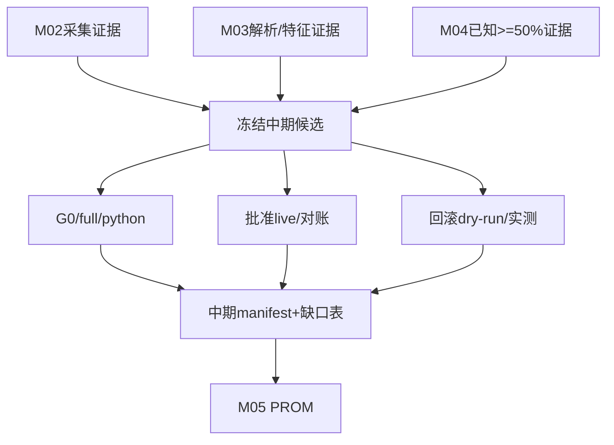

### 12.2 代码级任务

| ID | PR | 路径 | 执行动作 | 验证与回滚 |
|---|---|---|---|---|
| T1-M05-N001 | IDX | candidate/evidence index | 选择M02—M04共同完整候选，冻结source/artifact/image/config hash | 不同候选证据不得拼接 |
| T1-M05-N002 | TST-POST | `tests/run_tests.sh`、Makefile | 跑alignment/full/python最小全量基线 | 记录原始日志、exit code、耗时和排除项 |
| T1-M05-N003 | TST-POST | live smoke与纵向专项 | 在批准环境运行采集→解析→检测→告警链 | 7014/7014类smoke只作功能证据，不冒充质量/性能 |
| T1-M05-N004 | TST-POST | 中期质量包 | 重算已知攻击场景下预警准确率（签字方法）≥50%，核对签字公式和hash | 模板、bootstrap、空labels拒绝；不得误写为检出率/recall |
| T1-M05-N005 | OPS | affected-surface rollback rehearsal | 按候选影响面演练停受理、flag、image/config、event兼容、Kafka offset、Flink savepoint、PG权威恢复、CH/OS派生重建、MinIO manifest、在途任务和业务oracle；不适用项必须给证据化理由 | runbook存在不等于执行；任一受影响面缺演练或终态不可查则BLOCK |
| T1-M05-N006 | IDX | 中期差异清单 | 输出PASS、PARTIAL、NOT_EXECUTED、BLOCKED及责任任务 | 不把未来工作写成已完成 |
| T1-M05-N007 | IDX | 中期报告技术附件 | 汇总开发环境、`{加密, 非加密} × {实时, 离线}`四象限采集/特征识别证据，以及已知攻击预警准确率（签字方法）≥50%的同候选证据 | 任一象限缺失即BLOCKED；不纳入软著/专利/论文等软指标 |
| T1-M05-N008 | PROM | `topic1-system-v0.5-midterm` | 晋级只修改release/证据指针 | 合并后重证candidate equivalence；失败回退latest指针 |

## 13. M06：四源接入、缺失producer、实体身份和事件时间（18项）

### 13.1 四源架构

M06 只完成流量、资产、设备日志、用户行为的独立接入和统一身份/时间桥，不提前关闭 `F-FUSION-001`。当前Topic目录中`asset.bindings.v1`和`device.logs.v1`都为consumer-only，因此必须先补资产绑定权威producer与真实设备日志connector；不能用PG seed或fixture伪造四源。四个Topic有数据也不等于融合完成。

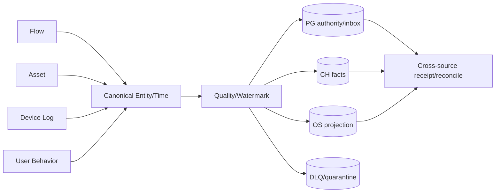

### 13.2 代码级任务

| ID | PR | 代码路径 | 执行动作 | 验证与回滚 |
|---|---|---|---|---|
| T1-M06-N001 | CTR | `asset.proto`、common/event schemas | 冻结asset/entity/source/event-time/quality/revision字段 | tenant/entity/time必填与兼容测试 |
| T1-M06-N002 | CTR | `contracts/events/kafka-topic-catalog.v1.json`、`deployments/kubernetes/init-jobs/01-kafka-topics.yaml`、`deployments/kubernetes/init-jobs/00-kafka-acl-plan.yaml` | 登记flow、`asset.events.v2`、`asset.bindings.v1`、device.logs、user.events各自payload/key/producer/consumer/DLQ；四类业务来源与资产被动绑定子rail分开建模 | producer-only/consumer-only显式BLOCKED；禁止在不同payload的Topic间复用消息 |
| T1-M06-N003 | EXP | PG资产迁移、`atomic_upsert.go` | additive建立资产权威、history、source revision、outbox和inbox | 双回放、审计失败全事务回滚 |
| T1-M06-N004 | WRT | `go/control-plane/internal/asset/repository/atomic_upsert.go`、`go/control-plane/internal/asset/repository/outbox_dispatcher.go`、`go/control-plane/internal/asset/config/config.go` | 认证tenant、expected revision、幂等upsert和来源优先级，同事务写history/audit/outbox；dispatcher只生产现有资产权威rail `asset.events.v2`，不得把`AssetUpsertedV2Json`写入`asset.bindings.v1` | 跨tenant、陈旧revision、冲突payload、outbox失败全回滚；真broker ACK前不称published；payload/topic不匹配必须fail closed |
| T1-M06-N005 | PRJ | `go/control-plane/internal/asset/consumer/asset_projection_event.go`、`go/control-plane/internal/asset/consumer/asset_projection_worker.go` | consumer-first处理`asset.events.v2`资产权威事件，写durable inbox和目标投影 | 重放、乱序、同ID异载荷、offset屏障；在N004 writer启用前确认ready |
| T1-M06-N006 | PRJ | `java/flink-jobs/flink-log-job/.../LogJob.java` | 在N016 producer合同下只负责consumer-first严格反序列化、tenant/device身份、event time、有界乱序水位、DLQ与offset屏障；CH/OS投影分别归N012叶子 | 在producer前部署ready；value-only、header/key不一致、坏日志、时钟回拨、超迟到、DLQ失败均不提交offset；不得把当前Loki/OS装配外推成CH能力 |
| T1-M06-N007 | PRJ | `flink-user-behavior-job/UserBehaviorJob.java` | 用户事件规范化、身份映射、行为时间线和质量状态 | 缺用户、跨tenant、超迟到、重复事件 |
| T1-M06-N008 | CTR/PRJ | entity resolution technical contract | 定义asset_id、user_id、IP/MAC、probe、community的关联规则和置信度 | 歧义不强行合并；来源和规则版本可追溯 |
| T1-M06-N009 | PRJ | event-time/watermark shared library | 统一source time、ingest time、processing time、allowed lateness、as_of | 时钟回拨、未来时间、无时区、窗口边界 |
| T1-M06-N010 | WRT/PRJ | source-quality receipt planned leaves | 仅保存四源ingress的accepted/rejected/invalid/late/duplicate/conflict/missing类别、source tuple、watermark和receipt；repair/replay/审批/baseline治理延后M07合同 | receipt幂等、tenant、source hash和offset屏障；不首次建M07质量权威模型 |
| T1-M06-N011 | PRJ | DLQ/quality signals | 四源分别记录invalid/late/duplicate/conflict/missing-source | canonical DLQ ACK后提交源offset |
| T1-M06-N012 | PRJ×6 | CH四源时序事实、OS资产/日志搜索的六个分存储planned leaves；现有`flink-log-job/.../LogJob.java`只装配Loki和OpenSearch，planned `sink/ClickHouseSinkFactory.java`不是存量能力 | 分成CH-flow、CH-asset、CH-device-log、CH-user-event、OS-asset、OS-device-log六个PRJ；每源使用确定性目标ID和source version写可重建投影与receipt。device-log CH叶子必须先建立真实sink与DDL，未落地前保持PLANNED/BLOCKED；Nebula从M07-N012起步 | 旧版本拒绝、同版本同hash幂等、同版本异hash失败；不得因设计列出planned CH sink就声称已有设备日志CH投影 |
| T1-M06-N013 | TST-PRE | 四源fixture与ephemeral验证 | 每源至少一个正样本、一个权限负例、一个坏消息、一个重放 | fixture不得作为PROM的真实源证据 |
| T1-M06-N014 | TST-POST | trace/watermark reconcile | 同一候选接入四个真实源，记录各source authority/connector、原始输入、producer receipt/broker offset、接受/拒绝、水位和目标receipt | 不用PG seed/fixture代替外部源；差异逐源可见；任一consumer-only即BLOCKED |
| T1-M06-N015 | OPS | 逐源canary和回滚 | 每次只开一个source producer/projection，观察后再开下一源 | 停单源不影响其他源；PG权威记录不删除 |
| T1-M06-N016 | CTR/PRJ/WRT/WRT/CTR/WRT | `asset.proto`、`ingest.proto`、现有ARP/DHCP parser、`sender/grpc.rs`、`internal/ingest/server/handler.go`、`internal/ingest/queue/producer.go`、现有`binding_consumer.go`、planned device-log collector合同 | Rail A冻结`MacIpBinding`及authenticated probe→ingest RPC→gateway Kafka publisher合同；先验证BindingConsumer ready，再独立建立默认关闭的gateway bridge，最后让probe沿现有mTLS/token gRPC链上传绑定，由ingest-gateway校验tenant/probe并发布`asset.bindings.v1`。禁止在probe内直接新增绕过gateway、ACL和身份边界的Kafka client。Rail B待N006 consumer ready后启真实日志publisher | 分别做坏schema、tenant/probe冒用、ACK、重放/DLQ、断网/坏证书/时钟回拨/磁盘满；资产authority outbox仍只发`asset.events.v2`，不得冒充binding producer |
| T1-M06-N017 | OPS/TST-POST × 3 rails | asset.events、probe→ingest→asset.bindings、device.logs producer acceptance | asset.events为OPS→TST，binding为gateway OPS→probe OPS→TST，device.logs为OPS→TST，共七个叶子；分别验证producer identity、payload/key、ACK、重放/DLQ、停止阈值和consumer-ready | N014直接依赖三条rail的三个TST-PASS叶子，少一条就不能进入四源聚合对账；`production_applied`和环境明示 |
| T1-M06-N018 | IDX/PROM | M06 manifest | 拆分IDX/PROM叶子PR，汇总四源真实性、三个producer rail、身份/时间合同、质量和对账 | allowed=四源接入与对齐；forbidden=融合增益/攻击链完成 |

## 14. M07：数据质量、三级融合、行为基准、图投影和攻击链（20项）

### 14.1 六条叶子列车

M07 是一个需求追溯里程碑，不是一个巨型 PR。内部按下列顺序推进，BASELINE 在输入质量满足后可与图链有限并行准备，但合并和晋级仍按候选依赖串行。

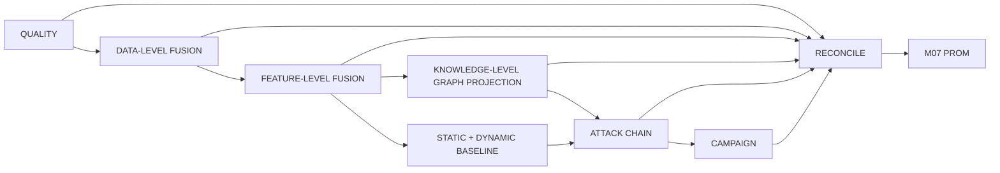

### 14.2 代码级任务

| ID | 子列车/PR | 代码路径 | 执行动作 | 验证与回滚 |
|---|---|---|---|---|
| T1-M07-N001 | QUALITY/CTR | `contracts/data-quality/*`、`F-DATAQUALITY-001` | 冻结dataset状态、问题生命周期、repair/replay语义和质量SLO | 真实零、未到达、不可用、过期和partial分开 |
| T1-M07-N002 | QUALITY/WRT | data-quality PG migrations/handlers | 原子创建规则、冻结选择、审批、任务、history、audit、outbox | 重放、过期token、自审批、审计失败回滚 |
| T1-M07-N003 | QUALITY/PRJ | repair/replay consumer | 严格校验Topic/key/header/body/tenant/repair ID，写inbox/receipt | 毒消息DLQ屏障、源offset不越过未完成领域事实 |
| T1-M07-N004 | FUSION/CTR | M01唯一owner下的`F-FUSION-001`版本化合同 | 分别定义数据层标准化/实体对齐、特征层窗口聚合与消融、知识层关系投影；冻结来源优先级、冲突类型、人工覆盖、撤销和权威回写 | 不新建同义owner；合同包含source cursor、as_of、version、quality/partial、provenance和rollback；三级输出不得混为一个snapshot |
| T1-M07-N005 | FUSION/EXP | PG/CH融合schema | additive保存source snapshot、resolution、version、watermark和provenance | 双回放、旧reader兼容、不在图中存权威裁决 |
| T1-M07-N006 | FUSION/WRT | fusion handler/service/repository | 实现来源同步job、冲突裁决、expected revision、audit/outbox | 并发裁决、撤销、同源重放、跨tenant |
| T1-M07-N007 | FUSION/PRJ | Flink/Go融合投影 | 先产数据层canonical snapshot，再按闭窗口产特征层fusion snapshot和质量摘要；知识层只消费已闭合来源事实 | 单源/多源消融、每层count/hash/watermark；缺源必须partial而非补零，不得声称融合必然提升准确率 |
| T1-M07-N008 | BASELINE/CTR | M01唯一owner下的`F-BASELINE-001`版本化合同 | 分开定义静态规范基准与动态行为基准；冻结learning/frozen/active/retired/failed状态、样本资格、漂移窗口和阈值 | 不新建同义owner；静态规则与动态统计不得共用隐式版本；状态机、权限、过期/漂移负例；激活前版本不可变 |
| T1-M07-N009 | BASELINE/WRT | baseline PG/CH服务 | 建立定义、构建任务、样本snapshot、版本、审批、outbox | 样本不足、窗口漂移、重复构建、审计失败 |
| T1-M07-N010 | BASELINE/PRJ | Behavior job/模型消费者 | 读取active baseline，返回baseline version、deviation和evidence | 版本不存在/过期/partial时fail visible |
| T1-M07-N011 | BASELINE/OPS | baseline ACK/rollback | 所有目标consumer ACK后才active，保留上一稳定版本 | 部分ACK停止扩展；回滚后线上版本可查 |
| T1-M07-N012 | GRAPH/CTR | graph Feature Contract、`graph.proto` | 定义observed/derived/analyst边、有效期、source event、confidence和tenant | 推断边不得渲染为观测事实 |
| T1-M07-N013 | GRAPH/EXP | Nebula schema/migrations | additive Tag/Edge/Index、tenant编码VID、版本和TTL策略 | schema重复执行、跨tenant VID隔离 |
| T1-M07-N014 | GRAPH/PRJ | graph projector/worker | consumer-first将PG/CH来源投影到Nebula，确定性VID/EID和source version | 重放、旧版本拒绝、同版本异hash失败 |
| T1-M07-N015 | GRAPH/TST | graph reconcile/rebuild | 按闭窗口权威集合比较missing/stale/extra，extra默认不删 | repair前后manifest、查询预算和PROFILE |
| T1-M07-N016 | ATTACKCHAIN/CTR | `F-ATTACKCHAIN-001`合同 | 定义source/target、阶段、候选路径、替代路径、证据锚点、时间顺序、来源、置信度、不确定性和截断 | 超深/循环/时间逆序/无证据/相互矛盾路径负例；derived不得伪装observed |
| T1-M07-N017 | ATTACKCHAIN/PRJ | attack-chain query/assembler、versioned graph snapshot | 组合CH时间事实、Nebula路径、PG人工结论生成同snapshot链，并按任务书为M08输出版本化GNN graph snapshot（图Schema、节点/边集合、水位、标签/证据引用）；替代GNN只能引用正式需求变更 | 每边回到event/rule/model/evidence，显示替代路径与不确定性；graph snapshot count/hash可复核；partial/truncated显式 |
| T1-M07-N018 | CAMPAIGN/CTR+EXP+PRJ+REF+TST-PRE+WRT+OPS+TST-POST（16 leaves） | `CepJob.java`、`select/ScanExploitSelector.java`、`select/CampaignBuilderUtils.java`、planned `campaigns.v1` Protobuf consumer/inbox、现有`campaign_event_consumer.go`、`config.go`与`cmd/alert-service/main.go` | Rail A先冻结合同/expand/consumer；随后把CEP key从仅`src_ip`改为`tenant_id+src_ip`，用独立TST-PRE证明跨tenant相同src不匹配、全pattern tenant一致且空tenant fail closed，再启`campaigns.v1` publisher。Rail B拆`consumer_enabled`与`dispatcher_enabled`，先启动JSON v2 consumer并取得ready receipt，后启动PG outbox。最后建立两rail correlation合同/迁移/投影、canary与reconcile | 十六叶顺序为CTR→EXP→PRJ→REF→TST-PRE→WRT→PRJ→WRT→CTR→EXP→PRJ→OPS(CEP)→OPS(B consumer)→OPS(B dispatcher)→OPS(correlation)→TST-POST；禁止JSON consumer解析Protobuf、publisher先于consumer、`unknown` tenant或相同src跨租户组成campaign |
| T1-M07-N019 | TST-POST | four-store/graph/chain专项 | 一条四源窗口贯穿融合、基准、图、攻击链和campaign | PG/CH/OS/Nebula同trace/watermark/provenance |
| T1-M07-N020 | IDX/PROM | M07 manifest | 分别登记质量、数据层融合、特征层融合、基准、知识图和链/战役六条列车G2/G3、回滚和消融证据后聚合；展开为独立IDX与PROM | PROM无逻辑；禁止把图/UI展示替代融合或链路正确性 |

## 15. M08：已知/未知攻击 AI 与模型治理（18项）

### 15.1 模型生命周期


### 15.2 代码级任务

| ID | PR | 代码路径 | 执行动作 | 验证与回滚 |
|---|---|---|---|---|
| T1-M08-N001 | CTR | M01唯一owner下的`F-MODEL-001`、`F-MLOPS-001`版本化合同 | 定义dataset→feature→graph→code→run→artifact→model→deployment→feedback血缘 | 不新建同义owner；合同唯一authority、权限、states、rollback |
| T1-M08-N002 | CTR | dataset/feature/graph manifest schema | 固化数据版本、来源、许可、时间窗、实体集合、标签版本、feature hash，以及GNN图Schema、节点/边集合、水位、source evidence和graph snapshot hash | 缺字段/漂移/重复manifest阻断；图快照不得读取未来边 |
| T1-M08-N003 | WRT | `mlops/scripts/extract_data.py` | 按tenant、time、as_of、水位和质量门抽取不可变snapshot | 不读取未来数据；源count/hash可复核 |
| T1-M08-N004 | TST-PRE | split/leakage checker | 建立按实体、节点、时间、站点、攻击家族的隔离切分，图邻接和派生边也受split约束 | 同实体/节点跨split、未来边、标签泄漏、重复PCAP阻断 |
| T1-M08-N005 | WRT | `train_model.py`、workflow template、planned GNN trainer | 记录seed、参数、代码、环境、依赖和资源，训练任务书GNN候选及非图基线，输出可复现实验 | 同输入重复训练差异有界；训练跳过不算成功；GNN与非图基线共用批准split |
| T1-M08-N006 | TST-PRE | `evaluate_model.py`、planned graph ablation evaluator | 分层计算known、normal、unknown、per-class、macro/micro和CI，并做GNN/非图、去边/去源消融 | 不用单一F1替代合同指标；图增益、退化和无增益均如实记录 |
| T1-M08-N007 | TST-PRE | open-set evaluator | 实现leave-class/time/site-out、拒识/abstain、unknown recall和误报分析 | 未知样本不得来自训练标签同分布复制 |
| T1-M08-N008 | WRT | `explain_model.py` | 生成普通特征贡献、GNN节点/边/路径解释、限制、校准和模型卡 | 解释与精确artifact/feature/graph snapshot/inference version绑定 |
| T1-M08-N009 | WRT | `export_onnx.py`、MinIO | 输出普通/GNN模型、推理graph schema、checksum、signature和兼容元数据 | 坏hash/坏schema/对象替换/图版本不兼容拒绝 |
| T1-M08-N010 | WRT+OPS | `register_model.py`、Go rule/model service | 先PG原子登记metadata/model version/artifact/evaluation/audit但不产生可投递激活事件；N011 ready后再由独立WRT/OPS叶子写activation outbox并发布shadow更新 | metadata登记不等于激活；Idempotency-Key、expected revision、自审批、consumer未ready时发布阻断 |
| T1-M08-N011 | PRJ | model-updates consumer | 在任何activation publisher启用前，consumer-first校验普通/GNN model、feature/graph schema/hash，加载shadow，写inbox/ACK | 部分ACK、超时、重复、旧version、图Schema不兼容拒绝 |
| T1-M08-N012 | OPS | champion/challenger shadow | 在线双跑但不切用户结果，比较prediction、latency和资源 | 差异、错误和超时可观测；关flag回退 |
| T1-M08-N013 | OPS | tenant canary | 小范围切模型，设置停止阈值、最小样本和观察窗 | 任一安全/质量阈值越界自动停止扩展 |
| T1-M08-N014 | PRJ | feedback consumer/inbox ready | consumer-first接收M09反馈事件，校验tenant、prediction/model/rule version、label revision和仲裁状态，写inbox/receipt并保持默认关闭 | M09-N017权威writer启用前先证明兼容ready；跨tenant、重复、撤销、乱序和同revision异hash失败 |
| T1-M08-N015 | OPS | drift detection/retrain trigger | PSI/分布/性能/质量信号只触发候选，不直接自动激活 | 漂移信号缺失/延迟/误触发；审批不可绕过 |
| T1-M08-N016 | OPS/TST-POST | model rollback | 激活上一不可变模型，所有consumer ACK并恢复预测 | 部分回滚失败、savepoint恢复和最终版本查询 |
| T1-M08-N017 | TST-POST | 在线/离线parity和G4内部画像 | 同样本比较Python/ONNX/Flink预测，测延迟/吞吐/资源 | 只作内部工程门；不宣称CNAS95%/5% |
| T1-M08-N018 | IDX/PROM | M08 manifest | 绑定dataset/model/threshold、在线ACK、canary、rollback证据 | allowed=未知检测工程链可复现；forbidden=CNAS已通过 |

## 16. M09：分析产品、可解释快照、完整取证、反馈和 typed UI（24项）

### 16.1 产品闭环

M09 负责把底层事实组织成用户可理解、可操作、可追溯的产品。`F-ENCRYPTED-001` 和 `F-FORENSICS-001` 的唯一关闭责任在本里程碑。真实流量清洗和攻击源阻断仍不属于课题一完成能力。

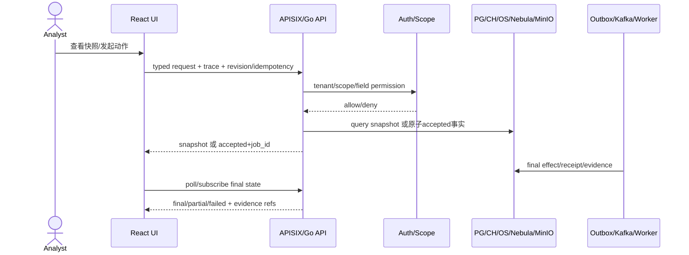

### 16.2 代码级任务

| ID | PR | 代码路径 | 执行动作 | 验证与回滚 |
|---|---|---|---|---|
| T1-M09-N001 | CTR | M01唯一owner下的product contract版本 | 完善`F-ENCRYPTED-001/002`、`F-FORENSICS-001`及必要product contracts的本里程碑版本，不创建平行合同 | 每合同定义snapshot/action/authority/state/permission/perf/rollback；owner/ID漂移阻断 |
| T1-M09-N002 | REF | `handler_product_pages.go` | 仅为当前纵向切片先建characterization test，再抽对应handler/service seam；不得先做全域大搬迁 | 单域行为等价、观察后cleanup；不和业务语义变化同PR |
| T1-M09-N003 | REF | `alert-service/main.go` | 仅在当前切片需要时抽composition root/module wiring/worker registry/route seam | 启动路由/worker/配置快照等价；每次迁一个worker/route，无循环依赖 |
| T1-M09-N004 | REF | `web/ui/src/services/api.ts` | 仅为正在交付的alert/encrypted/forensics等领域抽typed client，保留兼容barrel | 合同测试保护请求形态；单域迁移、观察、cleanup，禁止一次拆完整文件 |
| T1-M09-N005 | REF | `pageSnapshotAdapters.ts`、`pageApiPlans.ts` | 只迁当前页面adapter/plan，共享envelope/error/watermark工具 | 逐页面迁移；先characterization、后单页切换、观察后删旧分支 |
| T1-M09-N006 | WRT/PRJ | alert snapshot repository | 统一CH事实、OS搜索、PG人工状态/receipt和source watermark | missing/stale/extra显式；不把OS当权威 |
| T1-M09-N007 | CTR/PRJ | encrypted snapshot API | 按`flow_metadata/plaintext_visible/side_channel/raw_reference/randomness_statistics`返回TLS/QUIC/SNI/JA3/证书/隧道/外传、熵/统计方法版本、来源、模型/规则版本、as_of/watermark/partial | 加密不等同恶意；每类事实引用可下钻；零值、无样本、不可计算、不可用分开 |
| T1-M09-N008 | UI | `EncryptedTrafficPage.tsx` | 消费真实snapshot，展示解释、限制、字段权限和下钻 | mock off、模型版本变化、partial/权限/空态 |
| T1-M09-N009 | WRT | forensics task PG command | 在N010兼容idle worker ready后启用创建/取消/重试，冻结五元组、时间窗、probe、alert/case、权限和用途 | 审计/history/outbox同事务；writer默认off直至consumer ready；重复请求幂等 |
| T1-M09-N010 | PRJ | forensics worker/MinIO | 先部署兼容idle worker，再消费任务查M02 PCAP索引；通过M03版本化文件还原接口/manifest编排裁剪、重组结果引用、文件对象、manifest/hash、保留和receipt，不另建第二套重组算法 | 断点恢复、partial/corrupt/oversize、对象缺失、错hash、过期和跨tenant；恢复文件永不执行 |
| T1-M09-N011 | UI | `ForensicsWorkbenchPage.tsx`、forensics client | 展示任务状态、Session replay、受控下载、验证和证据导出 | accepted不等completed；刷新后任务可恢复 |
| T1-M09-N012 | WRT/PRJ | alert evidence manifest | link/unlink evidence使用revision、对象身份、history/outbox和consumer | 同对象同摘要幂等、不同摘要冲突、旧revision拒绝 |
| T1-M09-N013 | PRJ/UI | attack chain/campaign pages | 使用M07 snapshot，显式展示source/target、observed/derived/analyst、替代路径、不确定性、truncated、provenance和溯源结论 | 页面不补线；每边和每个溯源结论可下钻证据 |
| T1-M09-N014 | PRJ/UI | graph entity/path | 有界查询、continuation、权限、字段脱敏和保存视图 | 超预算/超级节点/循环/跨tenant |
| T1-M09-N015 | PRJ/UI | OpenSearch search + PIT/cursor | 稳定排序、PIT、cursor、source watermark和失败关闭 | stale cursor、alias切换、OS不可用；不退回伪数据 |
| T1-M09-N016 | WRT/PRJ | export/report jobs | 冻结查询、版本、水位、对象格式和manifest，异步生成 | 重试不重复对象；取消/过期/partial可查 |
| T1-M09-N017 | WRT | TP/FP feedback authority/outbox | 依赖M08-N014 consumer-ready后，PG原子记录标签、原因、prediction/model/rule版本、audit、outbox，投递MLOps/规则复审 | producer默认off直至consumer receipt通过；重复/撤销/冲突/跨tenant；标签仲裁可追踪 |
| T1-M09-N018 | WRT/UI | whitelist draft/governance | 从FP建议生成草案，审批、撤销、过期、投影ACK和规则版本 | 只改变检测治理；不执行真实网络阻断 |
| T1-M09-N019 | WRT/UI | rule/model review | 验证、审批、灰度、ACK、回滚和证据导出 | 部分ACK停止扩展；旧版本保持可恢复 |
| T1-M09-N020 | WRT/PRJ | response recommendation handoff | 创建建议/dry-run/外部交接任务，显示provider receipt | 默认off/fail closed；禁止课题一直接清洗/黑洞路由 |
| T1-M09-N021 | UI | 页面状态与可访问性 | 统一loading/empty/partial/unavailable/conflict/final，Drawer保持上下文 | keyboard/focus/ARIA/长文本/1366与1600视口 |
| T1-M09-N022 | REF | `pages.css`和大页面 | 仅为当前路由提取tokens/domain stylesheet/component styles，观察通过后删除该路由旧规则 | 同视口diff；不在业务修复PR中搬迁全部CSS |
| T1-M09-N023 | TST-POST | 按旅程拆分的指定Windows Chrome + 跨存储trace叶子 | 每条旅程分别覆盖查询、mutation、权限、失败恢复、下载和最终业务事实，再由只读聚合器汇总 | 证据记录browser/OS/version/backend/viewport/URL、app image/config hash、network/console、receipt/final fact；当前dirty或异hash截图不可用 |
| T1-M09-N024 | IDX/PROM | M09 manifest + integrated BOM | 为每个用户旅程绑定network→receipt→storage/object→final effect，并生成、校验和IDX登记同一候选的`ASSEMBLED`一体化BOM | 只有全链可反查且BOM组件角色、依赖边与hash闭合才PROM；禁止HTTP2xx/截图或分散demo替代完成 |

## 17. M10：最小现场部署、安全物化、限定恢复与 G6（16项）

### 17.1 部署边界

M10 把 M09 的业务候选物料化为“可复现、最小安全、可回切”的限定tenant/站点部署候选。身份、租户、scope、Secret、传输安全和审计必须实际生效；多可用区、八存储域破坏性灾备、完整 CNI 政策和批准 RPO/RTO 属于 M13-E，不得在 M10 虚假关闭。

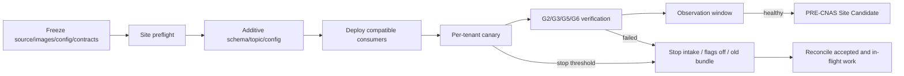

### 17.2 代码级任务

| ID | PR | 代码路径 | 执行动作 | 验证与回滚 |
|---|---|---|---|---|
| T1-M10-N001 | CTR | `deployments/` release bundle contract | 定义source tree、image digest、config、schema、topic、model、threshold和runbook闭包 | 任一输入不可验证即fail closed |
| T1-M10-N002 | OPS/TST-PRE | candidate provenance guard | 扫描生效Dockerfile/manifest引用的excluded/prebuilt artifact，登记binary SHA、builder/source SHA、toolchain、SBOM和attestation | overlay选中但制品未登记、镜像内二进制不一致则阻断 |
| T1-M10-N003 | CTR/OPS | site values schema | 区分global/site/tenant/secret_ref，固化端口、DNS、CA、保留、quota和外部依赖 | 未知字段、明文Secret、默认tenant阻断 |
| T1-M10-N004 | OPS | preflight CLI/script | 检查CPU/NUMA/NIC/磁盘/时钟/DNS/证书/权限/容量/外部端点 | 输出机器可读manifest；不以readiness代替真实部署 |
| T1-M10-N005 | OPS | approved additive migrations/topics apply | 只应用已在责任里程碑冻结并通过G1的migration/topic/ACL/retention计划，保留旧版读写；现场不得首次设计EXP | 核验精确artifact hash、重复回放、旧版兼容、半失败恢复；禁止同窗口drop或临时改合同 |
| T1-M10-N006 | OPS | APISIX/routes/services | 物化真实route、upstream、timeout、body limit、auth plugin和trace header | 路由差集为0或显式BLOCKED；旧route可回切 |
| T1-M10-N007 | OPS/TST | authn/authz/tenant | 生成最小角色和action/scope映射，强制tenant、object和字段权限 | 无token、过期、越scope、横向tenant、猜ID全部失败关闭 |
| T1-M10-N008 | OPS/TST | Secret/TLS/PKI | 引用Secret、部署CA链和证书轮换机制，服务间启用mTLS或已批准等价方案 | 错CA、过期、SAN不匹配、撤销、轮换中断负例 |
| T1-M10-N009 | OPS/TST-POST | minimum network policy | 在确认具备policy enforcement的CNI后仅开放候选必需入/出向，限制存储、broker、control plane和operator通道；无执行能力时必须采用经批准等价控制并记录残余风险 | 非授权pod/端口/外联负例必须真实失败；仅有YAML不算生效，完整CNI强化留M13-E |
| T1-M10-N010 | OPS | consumer-first rollout | 先部署idle-compatible consumer/projector，确认ready后再按tenant启producer/writer | 无消费者窗口为0；同步权威写例外需单独记录 |
| T1-M10-N011 | OPS | canary controller/runbook | 仅在N012 telemetry/on-call ready和信号注入通过后，按flag→tenant→实例扩大，使用已验证的错误、延迟、DLQ、差异、资源停止阈值 | 越界立即停止新受理，不自动忽略错误 |
| T1-M10-N012 | OPS+TST-PRE+TST-POST | observability/on-call | 先部署metrics/logs/traces/SLO、外部依赖健康、告警路由和on-call通讯树；canary前注入无流量/积压/存储慢/证书过期验证信号，canary后验证观察与通知终态 | 严格`OPS-ready→TST-PRE injection→N011 canary→TST-POST observation`；任一停止信号不可见则不得canary |
| T1-M10-N013 | OPS/TST-POST | scoped backup/restore and rebuild | PG权威/配置、MinIO对象manifest必须抽样恢复；Kafka offset/retention与Flink savepoint/checkpoint必须可恢复；CH事实若非权威则由Kafka/PCAP重放并对账，OS/Nebula/Redis必须从权威源重建并验证业务oracle | 在隔离目标验证identity/hash/watermark/count/final fact；明确未覆盖故障域、风险owner和现场RTO，不关闭`T-DR-001` |
| T1-M10-N014 | OPS/TST-POST | application rollback | 演练停受理→关flag→回bundle/image/config→旧读路由→处理在途任务→对账 | 已accepted任务必须最终completed/failed/cancelled可查 |
| T1-M10-N015 | TST-POST/IDX | scoped G2/G3/G5/G6 | 先以叶子TST-POST采集同一candidate真依赖、对账、浏览器、发布/回切和观察证据，再由独立IDX登记 | `production_applied`、排除项、run/hash、环境身份和失效传播完整 |
| T1-M10-N016 | IDX/PROM | M10 site manifest + integrated BOM | IDX与PROM分PR；把M09的同一候选BOM与现场deployed digest/config/environment逐项核验后转为`DEPLOYED_VERIFIED`，发布限定tenant/站点的`PRE_CNAS_SITE_CANDIDATE` | forbidden=合同最小交付、生产完成、完整HA/DR、CNAS、95%/5%；BOM身份漂移即STALE；回退release pointer |

## 18. M11：冻结盲测与 CNAS 硬验收门（12项）

### 18.1 三段式外部验收

M11 不是功能开发版本，而是 `PREPARE → EXECUTE → ATTEST` 的外部质量门。仓库可以实现评估器、完整性检查和证据登记，不能自行制造“CNAS 通过”。失败结果必须保留，任何模型、特征、阈值、数据或运行配置修改都生成新 candidate 和新盲集/批准复测 run。运行环境不得持有盲标签，出网、调试接口和人工读取路径必须受控并留审计。

```mermaid
sequenceDiagram
  participant OWN as Project/QA/Algorithm owners
  participant CUST as Independent data custodian
  participant LAB as CNAS laboratory
  participant SYS as Frozen candidate
  participant IDX as Append-only evidence index
  OWN->>IDX: Sign formula/threshold/candidate manifest
  CUST->>LAB: Release blind inputs; retain labels
  LAB->>SYS: Execute fixed interface
  SYS-->>LAB: Raw predictions/logs
  CUST->>LAB: Release labels after prediction lock
  LAB->>LAB: Compute signed alert-accuracy/false-alarm metrics
  LAB->>IDX: Signed raw outputs and report
  IDX->>IDX: Verify qualification/signature/hash/result
```

### 18.2 代码级任务

| ID | PR | 代码路径 | 执行动作 | 验证与回滚 |
|---|---|---|---|---|
| T1-M11-N001 | CTR | `REQ-T1-QUAL` method contract | 事前冻结analysis unit、去重窗、known/unknown/normal、abstain、无效样本和重测规则 | 项目/算法/QA/第三方签字；看结果后不得改口径 |
| T1-M11-N002 | CTR | metric specification | 任务书未定义公式，因此将“预警准确率”和“误报率”的formula authority保持`UNRESOLVED`；可列precision/generic accuracy/其他候选但只作proposal | 项目/算法/QA及有CNAS资质且认可范围覆盖本方法的第三方实验室在揭盲前共同签字；不得用recall/F1或任何未签候选偷换 |
| T1-M11-N003 | IDX | candidate freeze manifest + integrated BOM | 登记source/artifact/image/config/schema/model/threshold及M10环境闭包，并将同一`DEPLOYED_VERIFIED` BOM冻结为`CNAS_FROZEN` | 候选/BOM闭包不全、状态跳跃或dirty则不可发放数据；冻结后任一相关输入变化均须新candidate与新BOM |
| T1-M11-N004 | IDX | dataset manifest | 登记样本身份、来源、权限、版本、hash、known/unknown分层、各层最小样本、已签非空洞检测判据和保管人 | 数据泄漏/重复/训练重合检查；任一层样本不足则BLOCKED；盲标签不进candidate |
| T1-M11-N005 | TST-PRE | evaluator/integrity guard | 实现只读prediction、label、formula、strata、CI和hash校验 | 金标矩阵、边界分母、缺失/重复/非法类别负例 |
| T1-M11-N006 | CTR/TST-PRE | fixed execution interface | 用CTR冻结输入manifest、不可突变threshold、prediction schema、日志/资源捕获、运行时无标签和受控出网要求，再以独立TST-PRE验证 | 参数偷改、运行时读取标签、未授权出网、超时、局部失败、输出数不对等阻断 |
| T1-M11-N007 | IDX + external_activity:CUSTODY | chain-of-custody | 由独立数据保管方接收冻结盲集，记录交付人/接收人、时间、介质、加密、hash、签名、访问控制和开封事件；外部receipt先PASS，仓库IDX后登记 | 链路中断、重放旧包、未授权读取、标签进入运行环境或receipt未受信验签均阻断；CUSTODY不是仓库PR |
| T1-M11-N008 | external_activity:EXECUTE | CNAS blind run | 第三方在冻结候选上独立执行known+unknown测试；它不是仓库PR | 运行日志、原始prediction、排除/失效样本、环境身份全部原样保留 |
| T1-M11-N009 | external_activity:ATTEST | CNAS calculation/report | 按签字方法计算known/unknown分层、`unknown_recall`单报、总体预警准确率、误报率和已签附加统计量，签署报告；它不是仓库PR | 预警准确率（签字方法）≥95%且误报率（签字方法）<5%；任一分层未达已签判据则BLOCKED；失败后复测使用新run和新盲集或事前批准独立复测集 |
| T1-M11-N010 | IDX | append-only evidence intake | 登记CNAS资质证书编号/有效时点/认可范围和检测能力表、报告编号/签章、原始输入输出、签名/时间戳/撤销链、hash和candidate | 认可范围必须覆盖本测试对象与方法；失败run不覆盖；普通PR不修外部证据 |
| T1-M11-N011 | TST-POST | attestation validator | 机器校验签名/时间戳/撤销链、资质有效时点和认可范围、candidate/dataset/prediction/method/result一致性 | 任一不一致进BLOCKED，不映射为PARTIAL PASS |
| T1-M11-N012 | IDX | proposed CNAS quality profile | 生成`PROPOSED_T1_CNAS_QUALITY_PROFILE`记录，只引用不可变外部质量证据 | 仅解锁M12聚合检查；不是现有canonical G8或PROM，不修改global `g8_status=BLOCKED` |

## 19. M12：课题一系统合同最小发布（8项）

### 19.1 无新业务逻辑的发布提升

M12 的 PROM 只能改发布指针、证据索引和声明。若为了“凑通过”而修改源码、生成物、DDL、event、配置、模型或阈值，必须退回对应责任里程碑，重新生成后续证据。

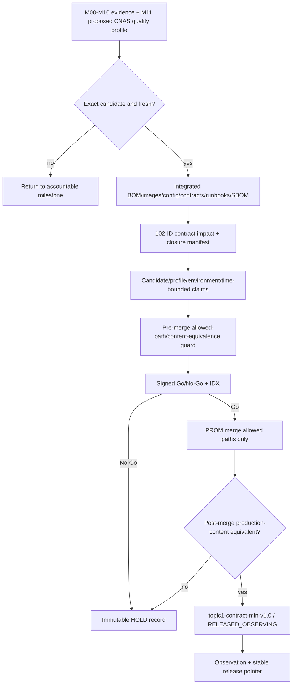

### 19.2 代码级任务

| ID | PR | 代码路径 | 执行动作 | 验证与回滚 |
|---|---|---|---|---|
| T1-M12-N001 | IDX | contract closure and impact manifest | 对102个canonical逐项登记`contract_impact`枚举required、not_applicable、residual并聚合M00–M11追溯；任何direct/indirect映射`REQ-T1-*`的项只能为required | required必须同候选闭合，否则阻断M12；not_applicable仅限无REQ映射或已有等价accountable closure；解除任务书范围必须引用正式需求变更编号和验收方签字，普通owner/risk/expiry不构成waiver；residual仅限internal strengthening/非合同整改 |
| T1-M12-N002 | TST-PRE | evidence freshness/impact | 根据文件、镜像、配置、schema、模型、阈值、数据变化传播STALE | 禁止跨hash拼接；等价manifest必须机器可验 |
| T1-M12-N003 | TST-PRE | promotion pre-merge guard | 验证PROM diff只修改release/IDX允许路径，且相对冻结candidate的production tree/content hash可证明等价 | 一旦包含源码/生成物/DDL/event/config/model/threshold变更则撤回PROM并退回责任里程碑 |
| T1-M12-N004 | OPS | one-system delivery package | 以单一集成BOM固结全部images、deployed digest、SBOM/provenance、site-values、schema/topic/migration、模型、UI、contract、安装/升级/回滚包 | 离线hash校验、安装dry-run和一套系统的前后端/数据面联通；多个分散demo或缺件阻断 |
| T1-M12-N005 | IDX | allowed/forbidden claims | 每条声明绑定candidate、profile、environment、time window和证据run，显式列其他课题/强化项排除 | 不包含论文/专利/软著/商务等软指标；禁止泛化为任意环境/长期稳定 |
| T1-M12-N006 | IDX + external_activity:APPROVAL | signed Go/No-Go + proposed contract profile | 外部责任owner/QA/安全/运维/验收方对同一manifest签字后，由独立IDX PR聚合M00–M10单一系统闭环与M11质量证据，生成`PROPOSED_T1_CONTRACT_PROFILE` | 签字活动不是代码PR；任一必需签名/外部门缺失则No-Go；不修改global G8 |
| T1-M12-N007 | PROM | `topic1-contract-min-v1.0` + integrated BOM | 预合并等价检查通过后合并PROM，合并后重算production content等价；仅等价PASS才签不可变tag、把同一BOM依次登记为`CONTRACT_RELEASED`和`RELEASED_OBSERVING`并设置observing pointer，关联`PROPOSED_T1_CONTRACT_PROFILE` | 全局G8继续BLOCKED；观察前不称稳定完成或整个项目完成；PROM不得重组BOM或替换组件 |
| T1-M12-N008 | OPS/IDX | post-release observation, stable pointer and integrated BOM | tag后记录T+0/T+1及批准观察窗的安全/正确性/资源信号；观察通过才把同一BOM转为`STABLE`、移动stable release pointer并独立IDX | 超停止阈值回到M10最后稳定候选；BOM保持`RELEASED_OBSERVING`或登记失败状态，事实/证据/tag不删除；观察中不得称稳定完成 |

M12闭包集合不从`MILESTONE_REQUIREMENTS`手工并集推导，而从requirements registry的`claim_class in {contract_scope, formal_kpi, enabling_engineering}`实时生成并要求恰好15项：SYS、DATA-CAPTURE、DATA-PARSE、FILE-RESTORE、ENCRYPTED、DATA-FOUR-SOURCE、FUSION、BASELINE、ATTACKCHAIN、AI、GNN、DET-MIDTERM、QUAL、EVI、SYS-DEPLOY。`release_evidence`和`internal_strengthening`不进入这15项。上述任一项缺少M00–M11责任里程碑、同候选证据或正式需求变更签字，M12必须BLOCK；普通waiver、owner风险接受或到期计划不能把合同项降为residual。

## 20. M13：doc/102项整改收敛与自设强化工程门（20项）

### 20.1 两条独立发布列车

M13 不是一个 mega PR。`M13-R` 用于将 doc 整改账本中尚未关闭的系统工程项逐片收敛；`M13-E` 用于 10×100G、512Mpps、P95≤60s、全存储 HA/DR 和更强安全等仓库自设强化目标。它们可以在 M12 后并行准备，独立发布，失败不追溯否定已冻结的 M12。但只要 M13 变更了检测或部署候选，必须按影响矩阵重验，必要时重做 CNAS。

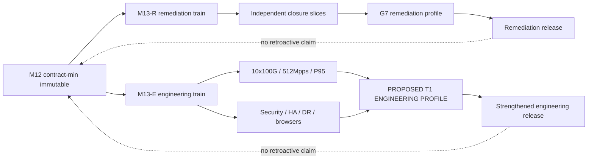

### 20.2 代码级任务

| ID | 轨道/PR | 代码路径 | 执行动作 | 验证与回滚 |
|---|---|---|---|---|
| T1-M13-N001 | R/TST-PRE | canonical dependency registry audit | 审计M00/M01已建立的`accountable_milestone/depends_on/secondary/affected/closure_decision`，禁止在M13首次补模或静默改owner | 每canonical ID只有一个关闭责任里程碑和一次关闭裁决；漂移退回M00/M01版本化变更 |
| T1-M13-N002 | R/CTR | remaining Feature Contracts | 以实际backlog为准补齐未建立的snapshot/action/authority/state/permission/performance/rollback | alignment strict、route/action/scope/schema差集为0或BLOCKED |
| T1-M13-N003 | R/REF | shared Go/API foundations | 抽取重复envelope、error、tenant、idempotency、revision、audit/outbox helper，不改业务语义 | characterization/contract tests先行；每次只迁一个域 |
| T1-M13-N004 | R/REF | shared React foundations | 抽取typed async state、snapshot envelope、permission、watermark、error mapping和领域client生成 | 页面逐个切换；删旧路径前G5和视觉diff通过 |
| T1-M13-N005 | R/REF | storage adapters/reconcile | 统一cursor、as_of、watermark、source identity、rebuild和差异输出，保持PG/CH/OS/Nebula/MinIO权威边界 | 不设计“通用仓库”隐藏各存储语义 |
| T1-M13-N006 | R/OPS/TST | closure slices R00–R09 | 逐片收敛common/auth/schema/adapter/security/PG/Kafka/audit/MinIO/CH/OS/Flink基础项 | 每片独立CTR/EXP/PRJ/WRT/TST/OPS/IDX，独立回滚 |
| T1-M13-N007 | R/OPS/TST | closure slices R10–R19 | 逐片收敛Redis/DQ/Probe/Asset/Alert/Campaign/Fusion/Model/Dashboard/Graph | 真依赖和最终事实为准；代码merge不自动CLOSED |
| T1-M13-N008 | R/OPS/TST | closure slices R20–R29 | 逐片收敛Asset/Graph/Search/Export/Topic/Encrypted/Rule/Deploy/Playbook/Compliance/Notification/Settings/DR/P2 | P2允许owner+计划；不得掩盖P0/P1 |
| T1-M13-N009 | R/TST-POST | current completion audit/G7 | 在同一干净candidate重跑账本、门禁、浏览器、回滚、观察和排除项审计 | 历史latest不当当前真值；`OBSERVING/GRAY/PARTIAL`不当PASS |
| T1-M13-N010 | R/IDX/PROM | remediation release | 发布doc/102项系统整改版，列明关闭、保留、P2和外部边界 | 不把直接清洗/黑洞路由/真实provider阻断写成课题一责任 |
| T1-M13-N011 | E/CTR | strengthened performance contract | 单独定义10×100G、512Mpps、P95≤60s的流量模型、包长、协议混合、持续时间、丢失和资源口径 | 明确`claim_class=internal_strengthening`；不回写任务书指标 |
| T1-M13-N012 | E/OPS/TST | hardware topology/calibration | 冻结NIC/NUMA/CPU/内存/磁盘/交换机/流量发生器/时钟，校准发送和捕获计数器 | 原始profile、固件/驱动、端口拓扑、校准误差可复核 |
| T1-M13-N013 | E/REF/OPS | Rust hot path | 按每个已测瓶颈展开独立REF与OPS叶子：capture→parser→aggregator→archiver→sender的buffer/pool/batch/backpressure/NUMA调优 | 每个优化独立benchmark/flamegraph/回退；禁止同PR改协议语义 |
| T1-M13-N014 | E/REF/OPS | Kafka/Flink hot path | 按partition/key/batch/compression/checkpoint/state/backend/operator分别展开叶子，保持稳定UID/savepoint | 每项独立积压、checkpoint、DLQ、端到端差异和恢复对账 |
| T1-M13-N015 | E/REF/OPS | storage/query hot path | PG/CH/OS/Nebula/Redis/MinIO按存储域分别建EXPLAIN/PROFILE、优化、canary、回滚叶子 | 不跨存储同日大切换；一个存储通过不能代表其他存储 |
| T1-M13-N016 | E/TST-POST | per-metric performance runs | 10×100G、512Mpps、P95≤60s分别冻结实验、运行、原始数据和裁决；不得用一次full run混合替代 | 每项证据含原始输入、捕获/丢失、各段P50/P95/P99、资源、错误、环境与观察窗 |
| T1-M13-N017 | E/OPS/TST | full security/CNI | 施加default-deny、egress allowlist、管理面隔离、镜像签名策略、Secret轮换和安全负例 | 需批准维护窗；紧急旁路有时限/审批/审计/撤销 |
| T1-M13-N018 | E/OPS/TST-POST | per-domain full HA/DR | PG/CH/OS/Nebula/Redis/Kafka/Flink/MinIO八域分别建立维护窗、故障注入、隔离、恢复和业务oracle叶子 | 每域独立fencing/PITR/savepoint/rebuild与批准RPO/RTO；八域全通过后才可关`T-DR-001` |
| T1-M13-N019 | E/TST-POST | full browser/release regression | 在指定生产候选Chrome覆盖全主旅程、mutation、权限、失败恢复、可访问性和大数据量 | 同候选mock off；network→receipt→final fact可反查 |
| T1-M13-N020 | E/IDX/PROM | `topic1-engineering-strict-v1.0` | 运行影响矩阵，必要时重验CNAS，登记`PROPOSED_T1_ENGINEERING_PROFILE`并发布强化版 | engineering profile不替代contract/CNAS profile，不修改global G8；回滚至M12/M13-R稳定指针 |

### 20.3 R00–R29 canonical 关闭切片

下表以 2026-08-09 的 `contracts/alignment/canonical-registry.json` 为快照，精确覆盖102个唯一canonical ID。R00–R29是residual closure-audit分组，不产生、迁移或重新认领`accountable_milestone`，也不是30个巨型PR；每一行已经在机器registry继续展开为适用的单类型`CTR/EXP/PRJ/WRT/UI/OPS/TST/IDX`叶子。它们只能接收M12分类为`residual`且没有`REQ-T1-*`直接或间接映射的非合同残项；任何合同required项必须在M12前闭合。若registry发生变化，先通过M00/M01的版本化合同变更重新生成本表，禁止手工静默增删。

| Slice | 精确 canonical IDs | 主要收敛面 | 关闭前最低要求 |
|---|---|---|---|
| R00 | `F-COMMON-001`, `F-COMMON-003`, `F-AUTH-001`, `T-SCHEMA-001` | 公共合同、状态/权限、Schema | 合同差集、权限负例、生成物与证据措辞一致 |
| R01 | `F-COMMON-002`, `F-COMMON-004`, `F-ADAPTER-001`, `F-ADAPTER-002` | adapter、最终状态、错误/水位 | accepted与final分离，adapter真实终态可反查 |
| R02 | `T-SEC-001`, `T-GW-001`, `T-CONFIG-001`, `T-PKI-001` | 安全、网关、配置、PKI | 生效环境负例、轮换、路由差集、回滚 |
| R03 | `T-PG-001`, `T-PG-002`, `T-PG-003`, `T-PG-004`, `T-PG-005` | PG权威/事务/迁移 | authority+history+audit+outbox原子、恢复与对账 |
| R04 | `T-KAFKA-001`, `T-KAFKA-002`, `T-KAFKA-003`, `T-KAFKA-004`, `T-KAFKA-005` | Topic/ACL/envelope/DLQ | consumer-first、真实broker、offset/DLQ/retention/回退 |
| R05 | `F-AUDIT-001` | 审计产品闭环 | 所有关键动作审计不可绕过、可检索、可导出 |
| R06 | `F-FORENSICS-001`, `T-MINIO-001`, `T-MINIO-002`, `T-MINIO-003` | 取证与对象治理 | M03/M09文件/PCAP链、manifest/hash/retention/orphan对账 |
| R07 | `T-CH-001`, `T-CH-002`, `T-CH-003`, `T-CH-004`, `T-CH-005` | CH时序事实 | 分区/TTL/版本、closed-window reconcile、恢复oracle |
| R08 | `T-OS-001`, `T-OS-002`, `T-OS-003`, `T-OS-004` | OS搜索投影 | stable ID/version、alias/backfill/PIT、权威重建 |
| R09 | `T-FLINK-001`, `T-FLINK-002`, `T-FLINK-003`, `T-FLINK-004` | Flink作业/状态 | stable UID、savepoint/checkpoint、source→sink对账 |
| R10 | `T-REDIS-001`, `T-REDIS-002` | Redis缓存/协调 | 缓存非权威、失效/重建/锁与租户隔离 |
| R11 | `F-DATAQUALITY-001`, `T-OBS-001`, `T-OBS-002`, `T-DQ-001` | 数据质量与可观测 | 真实零/缺失/partial、repair/replay、SLO和告警注入 |
| R12 | `F-PROBE-001`, `F-PROBE-002` | 实时/离线探针 | 覆盖profile、drop/journal/object/index矩阵与回滚 |
| R13 | `F-ASSET-001`, `F-ASSET-002`, `F-ASSET-003`, `F-ASSET-004` | 资产权威/身份/接入 | 真实producer、revision/outbox、entity resolution和租户负例 |
| R14 | `F-ALERT-001`, `F-ALERT-003`, `F-ALERT-004`, `F-ALERT-005`, `F-ALERT-006` | 告警核心/建议动作 | detection→alert收敛、证据/反馈/审计终态；真实阻断排除 |
| R15 | `F-ALERT-002`, `F-CAMPAIGN-001`, `F-ATTACKCHAIN-001` | 战役/攻击链 | `alerts.v1→campaigns.v1`、来源/替代路径/不确定性 |
| R16 | `F-FUSION-001`, `F-BASELINE-001` | 三级融合与基准 | 数据/特征/知识层、静/动态基准、消融与回滚 |
| R17 | `F-MODEL-001`, `F-MLOPS-001`, `T-MLOPS-001` | 模型治理 | 血缘、open-set、ACK/canary/rollback、训练不跳过 |
| R18 | `F-DASHBOARD-001`, `F-DASHBOARD-002`, `F-SCREEN-001` | 仪表盘/大屏 | typed snapshot、真实API、浏览器终态与可访问性 |
| R19 | `F-GRAPH-001`, `F-GRAPH-004`, `T-NEBULA-001`, `T-NEBULA-002`, `T-NEBULA-003` | 图事实/关系/底座 | observed/derived边、确定性ID、PROFILE/rebuild/reconcile |
| R20 | `F-ASSET-005`, `F-ASSET-006`, `F-GRAPH-003` | 资产扩展与图视图 | 权威边界、字段权限、图投影不可反写PG |
| R21 | `F-SEARCH-001`, `F-EXPORT-001`, `F-GRAPH-002` | 搜索/导出/路径 | PIT/cursor、冻结查询、对象manifest、有界路径 |
| R22 | `F-TOPIC-001`, `F-TOPIC-002`, `F-TOPIC-003`, `F-TOPIC-004` | 专题产品 | 三Tab真实数据、权限、导出和浏览器旅程 |
| R23 | `F-ENCRYPTED-001`, `F-ENCRYPTED-002` | 加密流量产品 | M03事实+M08版本+M09解释snapshot；加密不等于恶意 |
| R24 | `F-RULE-001`, `F-DEPLOY-001` | 规则治理/部署 | 审批、灰度、ACK、候选闭包和现场回切 |
| R25 | `F-PLAYBOOK-001`, `F-WHITELIST-001` | 剧本建议/白名单 | dry-run/default-off handoff、检测治理；真实阻断不关单 |
| R26 | `F-COMPLIANCE-001` | 合规 | 适用范围、证据、保留、字段权限与导出审计 |
| R27 | `F-NOTIFICATION-001`, `F-SETTINGS-001` | 通知/设置 | authority、权限、幂等、失败回执和UI终态 |
| R28 | `T-PG-006`, `T-CH-006`, `T-OS-005`, `T-NEBULA-004`, `T-FLINK-005`, `T-MINIO-004`, `T-DR-001` | 全域恢复/DR | 八域业务oracle、批准RPO/RTO、破坏窗与reconcile |
| R29 | `F-NOTIFY-001`, `F-PREF-001`, `T-REDIS-003` | P2通知偏好 | owner、期限、风险和不阻断批准P0/P1的书面裁决 |

生成器必须先校验canonical registry schema及实际ID字段（当前为`id`），并验证读取集合非空；随后验证`union(R00..R29) == canonical_registry_ids`、交集为空、总数为102。2026-08-09点时复核两侧规范化集合SHA-256均为`017851e6f235bb13d9debe90bc712923bb33c7bcafe211c89e1015ca282b27c9`。任何schema漂移、空集合、新增、缺失或重复都使 M13-R 为`BLOCKED`；禁止“空集合等于空集合”假通过。代码合并只推进实现/验证状态，只有对应门、观察、证据与人工关闭裁决齐全才可`CLOSED`。

# 附录A：跨里程碑系统设计

## 21. 权威数据、派生数据与存储职责

### 21.1 存储边界总表

| 存储 | 应存什么 | 不应成为什么 | 主键/身份原则 | 一致性与恢复 |
|---|---|---|---|---|
| PostgreSQL | 权威命令、人工状态、版本、审批、审计、outbox/inbox、job/receipt | 高基数原始流量时序库 | `tenant_id + domain_id`，动作带revision/idempotency | 业务事实+audit+outbox同事务；PITR/备份证据 |
| ClickHouse | flow/session/feature/detection、统计和可重建时序事实 | 用户可修改工单的唯一权威源 | `tenant_id + event_time + stable_id/version` | append/replacing语义显式；以Kafka/manifest重建 |
| OpenSearch | 全文检索、筛选、排序、用户搜索投影 | 告警工作流状态的权威源 | stable document ID + version，alias切换 | PG/CH→outbox/Kafka→index；PIT/cursor；可重建 |
| NebulaGraph | 实体关系、派生边、攻击链路图投影 | 资产和告警人工状态的权威库 | tenant-aware vertex/edge ID + event/evidence provenance | 由权威事实重建；禁止图反写PG事实 |
| Redis | 有界缓存、锁、限流、短期cursor/session | 唯一业务状态或无期限证据 | key必须含tenant/domain/version，明确TTL | 缓存丢失可回源；锁有token/fencing/expiry |
| MinIO | PCAP、文件还原、模型、报告、导出和不可变manifest | 无manifest的孤立对象堆 | bucket/object/version + sha256 + tenant + retention | 先对象后manifest/index的可恢复协议；孤儿对账 |
| Kafka | 已接受事件、可重放日志、异步组件边界 | 数据已进入所有最终存储的证明 | event_id/aggregate_id/version/tenant/event_time/schema_version | producer durability、consumer inbox、DLQ ACK、offset屏障分开 |

### 21.2 一条事实的跨存储生命周期

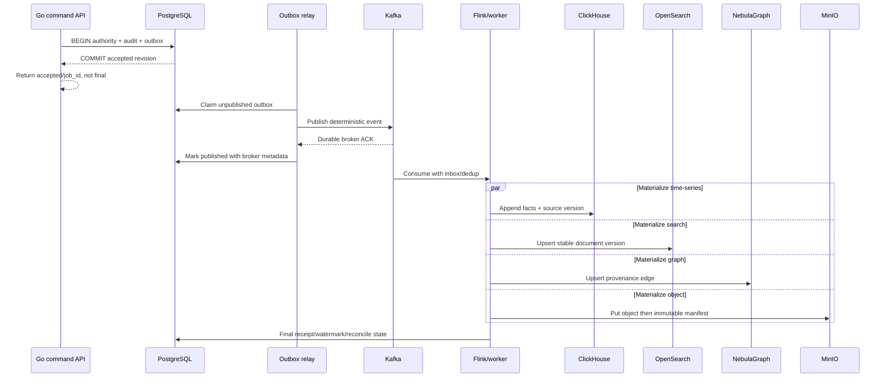

### 21.3 最终状态的判定原则

1. HTTP `2xx` 只能证明同步请求被受理，不证明 Kafka、Flink、搜索、图或对象已完成。
2. Kafka broker ACK 只证明事件持久化，不证明所有 consumer 或领域效果成功。
3. 终态必须由权威终态表/receipt、consumer ACK、源水位和目标事实共同证明。
4. `partial` 是一等状态：返回已获得的源、缺失源、失败原因、水位和重试策略，不用空数组伪装正常。
5. 任何投影都必须能够从权威事实重建，重建不得改变业务语义。

## 22. 前端、API 与用户旅程设计

### 22.1 前端分层目标

```mermaid
flowchart TD
  ROUTE[Route/Page shell] --> VM[Page View Model]
  VM --> QUERY[Domain query client]
  VM --> COMMAND[Domain command client]
  QUERY --> TYPED[Generated/manual typed transport]
  COMMAND --> TYPED
  TYPED --> GW[APISIX + Go API]
  VM --> STATE[loading/empty/partial/unavailable/conflict/final]
  VM --> UI[Domain components]
  UI --> ACCESS[Keyboard/focus/ARIA/responsive]
```

| 层 | 职责 | 禁止项 | 当前主要落点 |
|---|---|---|---|
| Route/Page shell | 路由参数、布局、权限门、页面级错误 | 直接拼多库数据 | `web/ui/src/pages/*.tsx` |
| Page View Model | 把snapshot、command state、filters、selection转成稳定界面模型 | 在render中发请求/修改全局状态 | 拆分`pageSnapshotAdapters.ts`、`pageApiPlans.ts` |
| Domain query client | 读snapshot/list/detail，解析as_of/watermark/partial | 自动回退mock或吞错 | `*Api.ts`、由`api.ts`逐域拆出 |
| Domain command client | idempotency/revision/action/accepted/receipt/final | 把accepted当completed | `*ActionApi.ts`、`*GovernanceApi.ts` |
| Components | 领域展示、受控交互、可访问性 | 混入网络和存储细节 | 页面目录下逐域拆分 |
| Styles | token→foundation→domain→component的层级 | 继续向`pages.css`追加全局选择器 | 拆分`web/ui/src/styles/pages.css` |

### 22.2 Snapshot 响应标准

```json
{
  "data": {},
  "as_of": "2026-08-09T00:00:00Z",
  "source_watermarks": [
    {"source": "clickhouse", "event_time": "...", "status": "available"}
  ],
  "partial": false,
  "missing_sources": [],
  "stale_after": "...",
  "trace_id": "...",
  "contract_version": "v1"
}
```

Snapshot 必须同时回答“这是什么”、“截至什么时间”、“来自哪些源”、“是否部分”、“哪些源不可用”和“按哪个合同解析”。空列表是有效数据结果，不是依赖不可用的替代响应。

### 22.3 Command 响应和状态机

```mermaid
stateDiagram-v2
  [*] --> REQUESTED
  REQUESTED --> ACCEPTED: authority transaction committed
  REQUESTED --> REJECTED: validation/permission/conflict
  ACCEPTED --> RUNNING: worker claimed
  ACCEPTED --> CANCELLED: cancelled before claim
  RUNNING --> PARTIAL: bounded partial result
  RUNNING --> COMPLETED: final receipt and facts
  RUNNING --> FAILED: terminal failure/DLQ policy
  PARTIAL --> RUNNING: approved retry/resume
  PARTIAL --> COMPLETED
  PARTIAL --> FAILED
  FAILED --> ACCEPTED: explicit retry creates new attempt
  COMPLETED --> [*]
  CANCELLED --> [*]
  REJECTED --> [*]
```

Command API 的最小响应包含 `command_id/job_id`、`accepted_revision`、`status_uri`、`trace_id` 和当前状态。最终页面必须重新查权威终态，而不是根据前端本地 optimistic state 推导成功。

### 22.4 前端旅程验收单元

| 阶段 | 必须记录 | 通过条件 |
|---|---|---|
| 登录/权限 | user/tenant/roles/scopes、路由和字段裁剪 | 越权动作和直接URL均被拒绝 |
| Query | request/response/trace/as_of/watermark | 真API、mock off、空/部分/错误态可区分 |
| Mutation | payload/idempotency/revision/accepted receipt | 重复提交不重复副作用，冲突可见 |
| Final fact | PG/CH/OS/Kafka/MinIO/Nebula中适用的终态 | 同trace/domain ID可反查，刷新页面状态不丢 |
| Recovery | 依赖失败、页面刷新、重试、取消 | 不伪成功、不丢已受理任务、无重复效果 |
| Visual/accessibility | 指定Chrome、viewport、console/network/page errors | 界面可用且无阻断问题；截图仅作视觉证据 |

## 23. Go 控制面和后端服务设计

### 23.1 目标包结构

```text
go/control-plane/
├── cmd/<service>/main.go             # 仅组装、配置、生命周期
├── internal/<domain>/api/          # HTTP/gRPC adapter、DTO转换
├── internal/<domain>/application/  # command/query use case、事务边界
├── internal/<domain>/domain/       # 实体、状态机、不变式
├── internal/<domain>/repository/   # 领域端口，不泄漏跨库返回类型
├── internal/<domain>/infra/        # PG/Kafka/CH/OS/MinIO/Nebula adapter
└── internal/platform/              # 受控共享：trace、auth、outbox、errors
```

上述是演进目标，不表示当前每个目录都已存在。重构顺序是“特征测试锁定现有行为→抽端口→移动纯逻辑→移动基础设施适配器→最后缩减 handler/main”。

### 23.2 命令端不变式

1. 在进入 application 层前完成身份、tenant、action/scope、字段权限、request size 和合同版本验证。
2. 所有可重试动作必须有 Idempotency-Key；所有修改必须有 expected revision 或明确的 last-write-wins 合同。
3. 权威事实、history/audit 和 outbox 在同一 PostgreSQL 事务内提交。
4. handler 返回的 accepted 必须能用 `status_uri` 轮询到终态，服务重启不能丢任务。
5. 外部 provider 副作用必须有独立权限、审批、实时 authority lookup、超时、receipt、补偿和演练回滚。

### 23.3 查询端不变式

1. 用 query object 表达过滤、排序、页码/cursor、`as_of` 和预算，禁止 handler 中拼接临时 SQL/DSL。
2. 跨存储 snapshot 在 application 层聚合，每个 adapter 返回自己的水位和可用性，不互相调用。
3. 查询超时、截断、最大边/顶点/结果数、对象下载和字段脱敏是合同的一部分。
4. cache 只缓存可重建 snapshot，key 包含tenant、contract version、query hash 和 source watermark。

### 23.4 错误模型

| 错误类 | HTTP建议 | 必须字段 | 是否可重试 |
|---|---:|---|---|
| VALIDATION_FAILED | 400 | code/field/reason/contract_version/trace | 修改请求后 |
| UNAUTHENTICATED | 401 | code/trace | 刷新身份后 |
| FORBIDDEN | 403 | code/action/scope/trace | 权限变更后 |
| NOT_FOUND | 404 | code/resource_type/id/trace | 资源出现后 |
| REVISION_CONFLICT | 409 | expected/current/reload_uri/trace | 刷新并人工确认 |
| DEPENDENCY_UNAVAILABLE | 503 | dependency/retry_after/partial/trace | 有界重试 |
| COMMAND_ACCEPTED | 202 | job_id/status_uri/revision/trace | 轮询，不重复创建 |
| TERMINAL_FAILURE | 状态API 200 | job_id/state/error/evidence/retry_policy | 按显式新attempt |

## 24. Proto、Kafka 和 Flink 数据面设计

### 24.1 共享 EventEnvelope

`proto/traffic/v1/common.proto` 应作为跨 Rust、Java、Go 的公共定义源，各领域 proto 只定义领域 payload。最小 envelope 语义包含：

| 字段 | 用途 | 不变式 |
|---|---|---|
| `event_id` | 全链去重/反查 | 重放不变；不用消费时间随机生成 |
| `tenant_id` | 数据隔离 | 生产事件不允许空或default tenant |
| `producer_id` | 来源身份 | 与Kafka principal/probe/service identity可关联 |
| `event_time` | 业务时间 | 不被ingest time覆盖 |
| `ingest_time` | 平台接收时间 | 只用于延迟/水位，不改变业务窗口 |
| `schema_version` | 兼容路由 | producer-first 前必须consumer-ready |
| `trace_id` | 端到端证据 | 同一业务链传播，不以日志局部ID替代 |
| `aggregate_id/version` | 有序变更 | 低版本投影不覆盖高版本 |
| `source_ref` | PCAP/log/object/evidence来源 | 可对象/hash/offset反查 |

### 24.2 Topic 设计清单

1. topic 的 owner、producer、consumer、key、partition 语义、retention、RF、ACL、schema 版本和 DLQ 必须在目录中唯一登记。
2. partition key 优先保证领域有序性，不为“均匀”随意破坏 aggregate/version 顺序。
3. consumer 必须在执行副作用前写入 inbox/processing identity，副作用和 ACK 遵循领域屏障。
4. 永久失败消息只在写入 canonical DLQ、记录原始位置/错误/版本并获得 DLQ ACK 后提交源 offset。
5. replay 必须带 run/reason/operator/window，默认不跳过去重、版本和 tenant 校验。
6. topic 分区数、RF、ACL/TLS 属于高风险运行变更，feature flag 不能代替它们的维护窗和回滚计划。

### 24.3 九个 Flink 作业的逻辑位置

| 作业目录 | 输入→输出 | 主要验证 |
|---|---|---|
| `java/flink-jobs/flink-session-job/` | Flow→Session | key/window/watermark、乱序、超时、稳定session ID |
| `flink-feature-job/` | Session→Feature | feature contract、离在线parity、缺失值 |
| `flink-behavior-job/` | Feature/baseline→Detection | baseline version、as_of、冷启动、漂移 |
| `flink-cep-job/` | Event/Detection→multi-step detection | pattern version、跨窗、超时、重复抑制 |
| `flink-rule-job/` | Rule update + Feature→rule match | 规则ACK、部分更新、旧版防覆盖 |
| `flink-alert-generator-job/` | Detection→Alert event | 稳定alert ID、evidence refs、去重/升级 |
| `flink-pcap-index-job/` | PCAP metadata/manifest→index | object/hash/offset、孤儿/重放对账 |
| `flink-log-job/` | Device log→normalized event | parser/version/quality/entity/time/tenant |
| `flink-user-behavior-job/` | User event→behavior fact | identity、session/time、迟到/缺失、脱敏 |

所有作业都必须保持稳定 operator UID，升级前保存 savepoint，兼容消费者先上线。“Exactly once”只能按 source→state→sink 的完整业务边界声明，不能仅凭 Flink checkpoint 开关宣称。

## 25. Rust Probe 的执行链与资源所有权

### 25.1 实际入口与逻辑分层

`rust/probe-agent/probe-agent/src/main.rs` 是当前主入口，子模块应保持 capture、parser、aggregator、archiver、sender 的资源边界。

```mermaid
flowchart LR
  NIC[NIC/AF_PACKET/eBPF/file replay] --> CAP[Capture owner]
  CAP --> Q1[Bounded packet queue]
  Q1 --> PARSE[Parser workers]
  PARSE --> Q2[Bounded flow/update queue]
  Q2 --> AGG[Flow/session aggregator]
  CAP --> JOURNAL[PCAP journal]
  JOURNAL --> ARCHIVE[Archiver + manifest]
  AGG --> SEND[Kafka sender]
  ARCHIVE --> META[PCAP metadata sender]
  SEND --> ACK[Durable ACK/checkpoint]
  META --> ACK
  ACK --> RETAIN[Retention/reclaim]
```

### 25.2 Probe 不变式

1. capture 线程只负责获取包、时间戳、端口/队列身份和最小分流，不执行可阻塞的网络/对象存储 I/O。
2. 所有队列有明确上界、背压模式和丢弃计数器；不用无界 channel 隐藏内存溢出。
3. parser 对截断/坏包/未知协议返回 typed outcome，不 panic，不将“无法解析”写成“正常”。
4. Flow/Event ID 在重放中稳定；配置、parser/feature version 和捕获源身份进入事件。
5. PCAP 对象的删除依赖持久manifest/index ACK和保留策略，不依赖内存发送成功。
6. graceful shutdown 顺序为停止新capture→drain有界队列→flush journal/batch→持久checkpoint→退出，超时时保留可恢复记录。

# 附录B：数据库、迁移、重构与验证规范

## 26. 数据库和索引演进

### 26.1 PostgreSQL Expand–Migrate–Contract

```mermaid
flowchart LR
  BASE[Old readers and writers] --> EXPAND[Add nullable column/table/index]
  EXPAND --> DUALREAD[New code reads old and new]
  DUALREAD --> BACKFILL[Idempotent bounded backfill]
  BACKFILL --> VERIFY[Count/hash/constraint reconcile]
  VERIFY --> DUALWRITE[Authority write new form]
  DUALWRITE --> CUTREAD[Cut read to new form]
  CUTREAD --> OBSERVE[Observation window]
  OBSERVE --> CONTRACT[Separate approved drop/constraint PR]
  VERIFY -->|diff| STOP[Stop; keep old path]
```

| 阶段 | PR 类型 | 必须条件 | 回滚 |
|---|---|---|---|
| Contract first | CTR | DDL所有者、字段语义、旧新兼容、容量/锁预算 | 仅撤回合同文档 |
| Expand | EXP | 可重复执行、不drop/改名/非空全表锁，并发索引 | 保留新结构或在无读写时单独回滚 |
| Compatible code | PRJ/WRT | 旧新schema都能运行，新路径默认off | 关flag/回旧image |
| Backfill | OPS | cursor、batch、rate limit、checkpoint、retry、tenant范围 | 停止任务；已写数据保留并可重入 |
| Verify | TST-POST | count、null、hash、采样业务oracle、反向差集 | 任一未解释diff停止cutover |
| Cutover | OPS/UI | 按tenant/canary，旧读路由保留 | 读回旧字段/旧表 |
| Contract/drop | 独立EXP/OPS | 观察窗完成、无旧版实例/查询/回滚依赖、维护窗批准 | 先备份/恢复oracle；破坏性DDL不靠feature flag |

PostgreSQL 迁移的当前主路径是 `deployments/postgres/migrations/` 和 `deployments/kubernetes/init-jobs/02-postgres-schema.yaml`。迁移命名应保持时间顺序、领域、意图和版本；应用启动时不得用隐式 runtime DDL 替代受审迁移。

### 26.2 ClickHouse 演进

1. 原始事实表、聚合表和 materialized view 分开所有权，不让查询直接依赖未稳定中间表。
2. 新列先支持缺失/默认语义，新 materialized view 先 shadow，对账后切查询。
3. Replacing/Collapsing 引擎必须定义 version/sign 的业务来源，不用查询时 `FINAL` 掩盖模型错误。
4. partition/order/primary key/TTL 变更是容量和性能变更，需原始分布、查询样本、磁盘预算和重建路径。
5. 以 `deployments/clickhouse/migrations/` 和 `03-clickhouse-schema.yaml` 为实际入口，所有更改都必须与 Java sink 和 Go query 共同审查。

### 26.3 OpenSearch 演进

```mermaid
flowchart LR
  TEMPLATE[Versioned template] --> NEWIDX[Create new physical index]
  NEWIDX --> SHADOW[Dual project/shadow backfill]
  SHADOW --> DIFF[Count/query/document-version diff]
  DIFF --> ALIAS[Atomic read alias cutover]
  ALIAS --> OBS[Observe]
  OBS --> RETIRE[Retain then retire old index]
  DIFF -->|unexplained| REBUILD[Discard/rebuild new index]
```

Mapping 变更不就地强改已有索引；新 template→新物理索引→投影/回填→对账→alias 原子切换→观察→退役。回滚为 alias 指回旧索引，新索引和差异证据保留。

### 26.4 NebulaGraph、Redis 和 MinIO 演进

| 系统 | 演进单位 | 切换 | 回滚/重建 |
|---|---|---|---|
| NebulaGraph | versioned tag/edge/schema + projector | 新边先shadow，有界查询对账后切读 | 停新projector、读旧版；从event/PG/CH重建 |
| Redis | versioned key namespace/value schema | 新旧key短期兼容，TTL自然退役 | 关新路径/清精确namespace；不依赖Redis恢复权威事实 |
| MinIO | bucket/prefix/manifest version/retention | reader先支持新manifest，writer再启用 | 停writer、读旧manifest；对象不因回滚即时删除 |

## 27. 可维护性与减冗重构手册

### 27.1 什么时候必须拆分

以下是“开启重构设计”的信号，不是脱离上下文的自动失败阈值：

- 一个文件同时处理路由、权限、查询、业务规则、存储、异步状态和显示适配中的三类以上。
- 新增一个页面/动作需要编辑巨大 switch、全局注册或无边界 CSS 文件。
- 同一份 validation/error/envelope/outbox/reconcile 逻辑在三个以上领域复制，且已发生语义漂移。
- 测试只能通过构造巨大环境、启动整个服务或依赖实际外部系统才能触发纯逻辑。
- 任何修改都会触发大面积无关测试、样式或生成物变更，导致review不能区分意图。

### 27.2 必须先补特征测试

重构不以“看起来等价”为验收标准。对现有巨型文件，先记录如下特征：

| 对象 | 特征测试 |
|---|---|
| Go handler | route/method、permission、input normalization、SQL/adapter call、status/body/header/error/audit |
| Go service/main | config precedence、dependency wiring、worker list、startup/shutdown order、health/readiness |
| React page | route params、API plan、request count/order、state mapping、user action、accessibility tree |
| API adapter | request path/query/body/header、response mapping、error/partial/watermark、cancel/retry |
| CSS | 指定viewport下的component screenshot diff、computed token、focus/hover/disabled |
| Data job | fixed input→output、key/window/watermark、duplicate/late/failure、savepoint compatibility |

### 27.3 一次只消除一种耦合

```mermaid
flowchart TD
  LOCK[Characterization tests] --> SEAM[Introduce interface/seam]
  SEAM --> MOVE[Move one coherent responsibility]
  MOVE --> COMPAT[Keep compatibility adapter/export/route]
  COMPAT --> VERIFY[Unit + contract + scoped integration + visual if UI]
  VERIFY --> CANARY[Default-off or one-page/one-tenant cutover]
  CANARY --> DELETE[Separate cleanup after observation]
  VERIFY -->|diff| REVERT[Revert extraction, keep tests]
```

不允许在同一 PR 中同时完成“移动代码+修改行为+变更合同+切流+删旧逻辑”。不允许为了减少文件行数而建立一个新的无语义 `utils` 或通用仓库。

### 27.4 当前优先重构队列

| 优先级 | 对象 | 目标分解 | 不可越过的证据 |
|---|---|---|---|
| P0 | `handler_product_pages.go` | 按encrypted/fusion/baseline/topic/data-quality拆API adapter和use case | route/permission/response/SQL characterization |
| P0 | `alert-service/main.go` | composition root、worker registry、route modules、lifecycle | 启动配置、worker、health、shutdown等价 |
| P0 | `api.ts` | transport core + domain query/command clients | 所有已有API contract tests |
| P0 | `pageSnapshotAdapters.ts` | 按领域建adapter，共享envelope/watermark helper | 固定fixtures输入输出等价 |
| P0 | `pageApiPlans.ts` | 每页面独立plan，移除全局分支 | request sequence/count/error behavior |
| P1 | `TopicWorkbenchPage.tsx` | page shell + tab view models + domain sections + hooks | 三Tab真数据旅程和导出 |
| P1 | `pages.css` | tokens/foundation/domain/component分层拆分 | 指定Chrome/viewport截图diff+焦点可访问性 |

## 28. 测试、门禁和证据体系

### 28.1 G0–G8 证明能力边界

| Gate | 证明什么 | 不证明什么 | 典型输入 |
|---|---|---|---|
| G0 | 候选代码/合同/生成物基线一致，单元/静态/全量测试达到定义 | 真实broker/存储/部署/浏览器/性能/CNAS | `tests/run_tests.sh full`、`make python-test`、alignment validators |
| G1 | 可重入expand、兼容回放、配置/证书预检 | 生产已应用或业务最终事实 | isolation/ephemeral migrations and compatibility |
| G2 | 在批准真实依赖上的功能链和故障路径 | 跨库一致、UI、性能或CNAS | Kafka/PG/CH/OS/Nebula/MinIO/Redis/Flink integration |
| G3 | 源→投影→终态的水位、count/hash/oracle对账和重建 | 性能、可用性、安全、UI | reconciliation reports and rebuild runs |
| G4 | 批准负载下的延迟、吞吐、资源和稳态 | 任务书质量指标或未指定硬件的外推 | performance profile/raw telemetry |
| G5 | 指定浏览器上的真API用户旅程、mutation和最终事实 | 整个项目或后端所有路径 | Chrome network/console/screenshot + storage receipts |
| G6 | 候选的部署、canary、回滚、观察和运维闭环 | 完整HA/DR或外部质量验收 | rollout/rollback/observation evidence |
| G7 | doc/102项整改账本在当前候选上收敛 | 任务书CNAS或自设性能门 | current closure audit |
| `PROPOSED_T1_CONTRACT_PROFILE` | 拟议课题一scoped profile：冻结requirements registry中全部contract-scope REQ均闭合，并覆盖已知+未知、预警准确率（签字方法）≥95%、误报率（签字方法）<5%、CNAS和一套集成系统 | 10×100G/512Mpps/P95/full-HA、全局G8或五课题项目完成 | M00–M10同候选system evidence + M11 proposed CNAS quality profile + M12无waiver closure/release manifest |
| `PROPOSED_T1_ENGINEERING_PROFILE` | 拟议工程强化scoped profile | 不替代CNAS/contract profile，不修改当前global G8 | M13-E performance/security/HA/DR evidence |

### 28.2 系统全量基线命令

```bash
tests/run_tests.sh full
make python-test
ROUNDS=100 LOG_DIR=/tmp/<candidate-run> tests/run_tests.sh live
```

这三条是全项目常用基线，不应脱离运行条件解读：`full` 不自动包含 MLOps 和 live smoke；live smoke 会通过 APISIX/API/DB 写真实测试记录，执行前需批准环境和清理策略；即使100轮通过，也不替代性能、CNAS、浏览器、安全或灾备门。

### 28.3 候选身份闭包

```yaml
candidate_identity:
  implementation_candidate_commit: "<sha>"
  production_tree_content_sha256: "<sha256>"
  tree_hash_algorithm: sha256-canonical-path-mode-blobsha256-v1
  dirty_count: 0
  source_roots: []
  excluded_paths:
    - path: "<path>"
      reason: "<reason>"
      referenced_by_active_build: false
  external_or_prebuilt_artifacts:
    - path: "<path>"
      binary_sha256: "<sha256>"
      source_or_builder_sha: "<sha>"
      recipe_toolchain: "<identity>"
      sbom_attestation: "<ref>"
      image_internal_binary_sha256: "<sha256>"
  image_digests: []
  config_schema_migration_hashes: []
  config_schema_migration_artifacts:
    - artifact_id: "<id>"
      artifact_role: "<config|contract|schema|migration>"
      source_kind: CANDIDATE_GIT_BLOB
      path: "<repo-relative path>"
      sha256: "<sha256>"
      provenance_receipt_path: null
      provenance_receipt_sha256: null
  model_threshold_dataset_hashes: []
  model_threshold_dataset_artifacts: [] # Git blob或TRUSTED_EXTERNAL_ARTIFACT+受信receipt
  supply_chain_artifact_hashes: [] # SBOM/provenance/attestation
  supply_chain_artifacts: []       # image/prebuilt provenance须把digest/binary hash写入受签role
  runtime_artifact_hashes: []      # UI bundle/runtime ACK/environment manifest
  runtime_artifacts: []
  image_attestations:
    - image_digest: "sha256:<digest>"
      deployed_image_digest: "sha256:<digest>"
      manifest_path: "<candidate Git blob>"
      manifest_sha256: "<sha256>"
      attestation_path: "<trusted external artifact>"
      attestation_sha256: "<sha256>"
  delivery_artifacts:
    - artifact_id: install-manifest # exact five: install/preflight/upgrade/rollback/restore
      path: "<candidate Git blob path>"
      sha256: "<sha256>"
  environment_id: "<site/cluster/runtime>"
```

source hash 不等于完整候选身份。validator对固定生产根执行`git ls-tree`，以`path/mode/blob_sha256`规范序列重算`production_tree_content_sha256`；提交者不能自报source roots或借excluded path删掉生产输入。任何candidate commit中已跟踪的blob或目录都禁止从fingerprint排除，尤其禁止排除完整生产root；`excluded_paths`只允许登记“不在Git tree、但被当前生效构建引用”的单文件预构建制品，且每项必须`referenced_by_active_build=true`并与prebuilt集合1:1闭合。inactive说明只能进入普通说明字段，不能改变hash输入。被生效Dockerfile、构建上下文或部署manifest引用的外部制品，必须用独立binary hash、builder/recipe、image digest、image内binary hash、SBOM/provenance和实际部署digest形成可验证闭包。四类artifact ref只能是候选Git blob，或带`candidate-artifact-provenance-receipt`并通过受保护trust policy验签的外部制品；仅“文件存在+hash相等”不构成来源证明。BOM中的source必须解析为`implementation_candidate_commit`中的真实Git blob；image、config/contract/migration、model/threshold/dataset、SBOM/provenance、runtime ACK和五类交付文件必须分别属于已验证候选集合，不接受BOM内自报hash。

### 28.4 证据新鲜度传播

| 变更 | 至少失效的证据 |
|---|---|
| 受覆盖源码/生成物 | G0及使用该路径的下游G1–G6 |
| Proto/OpenAPI/event/schema | compat G0/G1、生产者/消费者G2、投影G3、相关G5 |
| DDL/topic/ACL/TLS/config | G1、真环境G2/G3、部署/回滚G6，按影响可扩大 |
| 模型/特征/阈值/数据分布 | M08内部评估、在线parity/canary、M11 CNAS |
| UI/client/route | 相关contract tests、G5，如改命令语义则G2/G3 |
| 纯IDX/PROM且生产content hash等价 | 不使业务证据失效，但需promotion-profile G0和equivalence校验 |

### 28.5 候选、PROM意图与合并结果三段式清单

PROM前无法知道最终merge/squash commit和合并后的content hash，因此不得把事后字段伪装成“PROM前已冻结”。晋级使用三个独立、不可覆盖的manifest：

```yaml
implementation_candidate_manifest:
  milestone_id: "T1-Mxx"
  promotion_profile: "milestone|cnas_quality|contract_min|remediation|engineering_strict"
  profile_definition_status: "PROPOSED|APPROVED"
  scoped_evidence_result: "PASS|BLOCKED"
  global_g8_before: "BLOCKED"
  global_g8_after: "BLOCKED"
  global_g8_unchanged: true
  requirement_ids: []
  claim_class: "contract_scope|formal_kpi|enabling_engineering|internal_strengthening"
  accountable_ids: []
  secondary_ids: []
  affected_ids: []
  implementation_candidate_commit: ""
  production_tree_content_sha256: ""
  dirty_count: 0
  source_roots: []
  excluded_paths_and_reasons: []
  external_or_prebuilt_artifacts:
    - artifact_path: ""
      binary_sha256: ""
      source_or_builder_sha: ""
      build_recipe_toolchain: ""
      sbom_provenance_attestation: ""
      image_internal_binary_sha256: ""
  image_digests: []
  config_schema_migration_hashes: []
  model_threshold_dataset_hashes: []
  supply_chain_artifact_hashes: []
  runtime_artifact_hashes: []
  delivery_artifacts: []
  ledger_snapshot_sha256: ""
  required_gates: []
  gate_results:
    - gate: "Gx"
      status: "PASS|BLOCKED"
      run_id: ""
      manifest_sha256: ""
      candidate_identity_manifest_sha256: ""
      environment_identity: ""
  production_applied: false
  browser_identity:
    os: ""
    browser: ""
    version: ""
    backend: ""
    viewport: ""
    base_url: ""
    app_bundle_sha256: ""
    app_image_digest: ""
    app_config_sha256: ""
  browser_journeys_actions_final_facts: []
  rollback_run_id_and_result: ""
  observation_window_and_status: ""
  external_approval_and_signature: []
  explicit_exclusions: []
  stale_or_superseded_evidence: []
  allowed_claims:
    - candidate: ""
      profile: ""
      environment: ""
      time_window: ""
      capability: ""
  forbidden_claims: []
  change_impact_and_revalidation: []

promotion_intent_manifest:
  schema_version: 1.0.0
  promotion_id: ""
  candidate_manifest_sha256: ""
  profile_id: ""
  current_idx_manifest_sha256: "" # IDX已含REQ satisfaction/completion/BOM hashes
  promotion_commit_parent: ""
  allowed_paths: []
  premerge_equivalence_result: "PASS"
  milestone_promotion_closure_sha256: ""
  bom_transition_manifest_sha256: null
  approvals: []
  created_at: ""

promotion_result_manifest:
  schema_version: 1.0.0
  promotion_id: ""
  promotion_intent_manifest_sha256: ""
  promotion_commit: ""
  candidate_manifest_sha256: ""
  postmerge_production_content_sha256: ""
  equivalence_result: "PASS"
  promotion_profile_g0_result: "PASS"
  milestone_promotion_closure_sha256: ""
  bom_transition_manifest_sha256: null
  tag_or_pointer: ""
  created_at: ""
```

只有`promotion_result_manifest.equivalence_result=PASS`且`promotion_profile_g0_result=PASS`后才能写tag或移动observing pointer；失败只保留结果并回退意图，不修改既有运行证据。PROM必须直接依赖当前里程碑、当前profile、当前candidate的IDX，任意历史IDX祖先不构成授权。

`PASS_FOR_*`、`PARTIAL`、`GRAY_PASS`、`OBSERVING`、`HOLD`、`OPEN` 和 `BLOCKED` 都不等于所需门禁的 `PASS`。

## 29. 回滚与失败处理矩阵

| 变更面 | 停止动作 | 回滚动作 | 必须保留 | 必须对账 |
|---|---|---|---|---|
| 代码/镜像 | 停canary扩大/新受理 | 回上一image digest | 失败logs/traces/candidate identity | 已受理任务/版本 |
| Feature flag | 关新读/新projection/新executor | 返旧路由 | 新路径产生的权威事实 | shadow/canary差异 |
| PostgreSQL expand | 停回填/双写 | 读旧结构，新结构留存 | 已回填数据/cursor | old/new count/hash |
| destructive DDL/contract | 禁止继续drop/cleanup | 仅按已批准PITR/restore或前向兼容修复；不可假设可逆 | DDL、审批、备份、失败现场 | authority数据、reader/writer兼容和恢复oracle |
| 数据backfill | 停worker并冻结cursor | 回旧读路由；已写新结构保留 | cursor、批次、失败键、source snapshot | old/new closed-window count/hash |
| Kafka producer | 关producer flag | 回旧event version | broker中新版消息 | consumer ACK/DLQ/offset |
| Kafka Topic/ACL | 停新producer/consumer启用 | 恢复旧ACL/route；不直接删含消息Topic | topic config、ACL、offset、retention证据 | producer/consumer权限、积压、DLQ和读取连续性 |
| Flink job | 停新job | 从批准savepoint恢复旧job | 失败checkpoint/savepoint | source offset→sink watermark |
| OpenSearch/Nebula | 停新projector | alias/读路由回旧投影 | 新索引/图和diff | 权威源与旧/新projection |
| MinIO | 停新writer | reader回旧manifest version | 已写对象和manifest | object/manifest/index/orphan |
| TLS/PKI/Secret | 停轮换/新连接扩展 | 回上一有效证书/Secret版本并撤销失败版本 | CSR、证书链、版本、审计 | trust chain、SAN、撤销状态和各consumer reload |
| NetworkPolicy/CNI | 停扩大default-deny | 恢复上一批准policy，仅在时限审批下启紧急旁路 | 生效CNI身份、policy diff、旁路审批 | 必需通信、未授权通信负例、旁路撤销 |
| APISIX/route | 停新route/traffic shift | 回旧route/upstream/plugin配置 | route diff、请求trace、配置版本 | operation、scope、timeout、在途请求和终态 |
| 模型 | 停扩大/canary | 激活上一不可变模型，等待所有consumer ACK | 新prediction/反馈/漂移 | active version、ACK、在线/离线结果 |
| 外部provider handoff | 停新交接/副作用请求 | 发送批准的cancel/compensation；无法补偿则升级人工处置 | provider request/receipt、审批、审计 | provider最终状态、内部任务终态、重复副作用 |
| 发布 | 停新tenant/流量 | release pointer回稳定候选 | 发布和回滚证据 | 配置、在途任务、终态 |

回滚不等于删除新数据，更不等于覆盖失败证据。回滚的目标是停止风险扩大、恢复稳定路径、保持事实可查并为后续修复保留完整现场。

# 附录C：执行、维护与阅读方法

## 30. 小任务到原子 PR 的映射

### 30.1 标准 PR 顺序

异步事件链默认顺序：

```text
CTR → EXP → PRJ-ready(default-off, consumer-first)
    → WRT(default-off authority/outbox/publisher)
    → TST-PRE(G0/G1)
    → OPS-expand → OPS-consumer → OPS-producer-canary
    → TST-POST(G2/G3) → UI → TST-POST(G4/G5)
    → IDX → PROM
```

同步权威命令可以登记 `WRT-first` 例外，但仅限于同事务权威写+audit+outbox，或 writer 默认关闭且不会提前产生新事件。例外必须写明为何没有消费者窗口、启用顺序和回滚。

### 30.2 原子 PR 上限

- 一个主 `primary_id`，可有 `secondary_ids` 和 `affected_ids`；一个 canonical ID 可跨多个原子 PR，但只有一个 accountable milestone。
- 手写 changed LOC 硬默认不超过 800，生产手写文件不超过 25；生成物单独计数并说明生成源。超限必须先取得架构owner书面例外，例外仍不能跨越事务、schema/event版本、启用或回滚边界。
- 一个 PR 最多一个 additive migration 和一个 event/API 版本。
- 禁止同一 PR 混入 schema 合同与 drop、功能实现与默认切流、大量重构与业务语义修改。
- 超限时按 `CTR→EXP→PRJ→WRT→UI→OPS→TST→IDX→PROM` 继续分解，不通过放宽 review 标准解决；IDX和PROM永远不是同一实际PR。

### 30.3 每个里程碑完成前必须输出的任务清单

| 区块 | 必须内容 |
|---|---|
| 身份 | milestone_id、promotion_profile、candidate闭包、dirty=0 |
| 需求 | requirement_ids、任务书条款、claim_class、allowed/forbidden claims |
| 责任 | accountable_ids、secondary/affected IDs、owner/reviewer/approver |
| DoR | 合同、数据源、权威源、权限、依赖、窗口、回滚准备 |
| 任务 | 本章212个N父任务的适用子集，展开成单类型原子PR、外部活动及状态 |
| 验证 | 每PR负责/不负责的G门、正/负/冲突/重放/失败/回滚用例 |
| 证据 | run ID、manifest hash、环境/时间、production_applied、精确排除、stale传播 |
| 退出 | 状态提升上限、观察窗、未达项和外部blocker |
| 回滚 | code/flag/schema/event/model/object/在途任务/数据各自处理和演练run |

## 31. 开发者阅读路线

### 31.1 30 分钟快速建立全局

1. 阅读根 `agent.md` 和 `doc/README.md`，理解项目规则、文档结构和证据边界。
2. 阅读本文第1–5节，建立 M00–M13、PR类型、候选身份和端到端数据流的概念。
3. 阅读 `proto/traffic/v1/common.proto`、`flow.proto`、`feature.proto`、`detection.proto`、`alert.proto`、`pcap.proto`，掌握跨语言数据主干。
4. 对照第21节理解PG/CH/OS/Nebula/Redis/MinIO/Kafka的权威边界，禁止把“哪里都能查到”理解成“哪里都能写”。
5. 浏览 M02→M04 和 M06→M09 两条主链，理解流量如何变成告警和分析产品。

### 31.2 按角色阅读

| 角色 | 首读 | 再读代码 | 必须理解的边界 |
|---|---|---|---|
| 产品/项目 | M00/M04/M05/M11/M12、allowed/forbidden claims | Feature Contracts和验收manifest | 设计目标、当前证据、完成声明分离 |
| 前端 | M09、第22/27/28节 | `web/ui/src/pages/`、`services/`、`styles/` | accepted≠final、partial、真API、权限、G5 |
| Go后端 | M01/M04/M09、第21/23/26节 | `go/control-plane/cmd/`、`internal/`、PG migrations | authority+audit+outbox、query snapshot、幂等/版本 |
| Rust探针 | M02/M03/M13-E、第24/25节 | `rust/probe-agent/probe-agent/` | 队列/背压、journal/checkpoint、稳定ID、无声丢失 |
| Flink/数据 | M03/M04/M06–M08、第24/26节 | `java/flink-jobs/` | event time/watermark、UID/savepoint、DLQ、sink一致 |
| MLOps/算法 | M08/M11 | `mlops/`、Feature/Detection proto | 数据泄漏、版本血缘、阈值冻结、CNAS独立性 |
| DBA/平台 | M01/M10/M13-E、第21/26/28/29节 | `deployments/`、init jobs、migrations | expand/cutover/contract、候选闭包、HA/DR oracle |
| QA/审计 | 全部PROM清单、第28节 | `tests/`、acceptance scripts、evidence manifests | 同候选、证据级别、失效传播、禁止越级 |

### 31.3 调试一条业务链的正确顺序

1. 从用户页面或入口事件获取 `trace_id`、tenant、domain ID、contract/event version。
2. 检查 APISIX route、身份与 scope，再查 Go handler/application 的 accepted/authority transaction。
3. 如是命令，检查 PG authority/history/audit/outbox；如是查询，检查snapshot的每个source watermark。
4. 跟踪 Kafka event ID、partition/offset、consumer group、inbox/DLQ/ACK和 Flink checkpoint/watermark。
5. 按第21节的权威关系检查PG/CH/OS/Nebula/MinIO最终事实，不随意选“最容易查的库”。
6. 返回前端查询终态，确认刷新、重登录、依赖局部失败后状态仍可理解。
7. 若存在不一致，先保留时间线和原始证据，再从第一个水位/版本分歧点定位，不直接在下游“补数”隐藏原因。

## 32. 文档扩展到百万字级的稳定方法

### 32.1 不建立一个无法 review 的百万字单文件

本文是“总索引+里程碑骨架+代码级任务卡”。达到百万字级信息容量时，应扩展为可校验的文档集，而不是一个难以同步、无法评审的超大 Markdown。

```text
doc/07_alignment/topic1_detailed_design/
├── 00_INDEX.md                         # 本文的机器可读索引
├── milestones/M00/.../M13/           # 每里程碑的N任务卡和PROM清单
├── domains/alert|asset|fusion|.../   # 按领域的前后端/数据/运行设计
├── contracts/proto|openapi|events/   # 合同语义、兼容矩阵和样例
├── data/pg|ch|os|nebula|redis|minio/ # 模型、DDL、索引、保留和恢复
├── flows/<flow-id>/                   # 跨层时序、状态机、失败/回滚
├── refactoring/<hotspot-id>/          # 特征测试、目标结构和迁移进度
├── operations/site|security|dr/       # 现场、安全、发布、灾备
└── evidence/<candidate>/<gate>/       # 只引用不可变manifest，不复制大证据
```

### 32.2 每个子卷的固定模板

1. 目标、非目标、任务书/内部声明分类。
2. 当前代码入口、owner、依赖、上下游和权威数据源。
3. 前端用户旅程、View Model、API、权限、错误和可访问性。
4. 后端 command/query、状态机、事务、outbox/inbox、幂等和冲突。
5. Proto/OpenAPI/event/topic、数据库、索引、对象manifest和保留。
6. 正常、负例、部分、重放、故障、恢复和回滚流程图。
7. 性能/容量/安全/可观测预算、验收清单、证据级别和排除项。
8. 重构热点、当前冗余、特征测试、分步迁移和删除条件。
9. 变更历史、影响矩阵、已失效设计的 superseded 指针。

### 32.3 文档与代码的双向校验

- 每个任务ID应能定位到 PR、主代码路径、测试ID、evidence run 和 ledger 状态。
- 每个 OpenAPI operation、Proto message/event、Kafka topic、DDL对象、route、action/scope 应能反向找到 Feature Contract 和 accountable milestone。
- CI 应检查断链、重复ID、已删代码路径、不存在测试ID、不符合Mermaid语法和未声明的设计偏离。
- 设计不应随代码变化静默被改写：保留 superseded 记录、原因、批准人、替代版本和生效candidate。

## 33. 本设计的使用边界

1. 本文把任务书系统硬要求、仓库当前证据和内部强化门分开；不包含软著、专利、论文、经济效益或商务合作等软指标。
2. 212 个父任务是评审中的WBS分解，不是212个必然一对一的 PR；实际 PR 根据合同、迁移、consumer-first、切流和回滚边界继续拆分。在机器task registry完成前，本文不是已批准执行基线。
3. 任务表中的代码路径是实际入口或拟新建的责任位置；执行前必须在当时候选上重新检查文件、合同和 ledger，不得把本文当成已实现证据。
4. 每个里程碑在 PROM 前必须从任务表生成当次清单；清单与候选hash、证据run、回滚演练和允许/禁止声明一起评审。
5. 文档详细度可按第32节持续扩展到百万字级，但任何细节都必须有稳定ID、可验证代码/合同引用和失效规则，避免用重复文字伪造“详细”。

## 34. 任务代码落点解析与现有工具复用

### 34.1 “代码/文档路径”列的解析规则

212 个父任务表中既有精确存量路径，也有需要建立的逻辑制品。为避免把逻辑名当成已存在文件，任务进入 `READY` 前必须将落点解析为以下类型之一：

| 类型 | 语义 | 任务卡必须记录 | 示例 |
|---|---|---|---|
| `EXISTING_FILE` | 当前候选中的精确文件 | repo-relative path、关键符号/行为、owner | `proto/traffic/v1/common.proto` |
| `EXISTING_GLOB` | 已存在且需多语言/多模块共同变更 | 展开后的文件列表、producer/consumer、生成源 | `proto/traffic/v1/*.proto` |
| `PROPOSED_FILE` | 本任务准备新建的文件 | 精确目标路径、为何新建、与现有入口的关系 | `contracts/requirements/topic1-system-requirements.v1.json` |
| `LOGICAL_ARTIFACT` | manifest、registry、report、runbook等逻辑制品 | 生成器路径、schema路径、输出根、不可覆盖规则 | `M09 manifest` |
| `CONTRACT_ID` | canonical/requirement/feature/technical ID | registry path、accountable milestone、生成物 | `F-ENCRYPTED-001` |
| `EXTERNAL_ARTIFACT` | CNAS、签字、现场批准等仓库外产物 | custodian、intake schema、hash/signature、保管链 | `EXT-T1-CNAS-*` |

如果一条任务只写了“worker”、“manifest”、“schema”或“client”，而没有在开工清单中解析成上述六类之一，其状态只能是 `DRAFT/BLOCKED`。

### 34.2 对齐控制面的可复用落点

| 逻辑制品 | 当前真实入口 | 当前可复用能力 | 还需补的部分 |
|---|---|---|---|
| canonical/WP/ledger | `contracts/alignment/canonical-registry.json`、`work-packages.json`、`remediation-ledger.json` | 102项唯一ID、29个WP、生成账本 | requirement ID、accountable milestone、`depends_on/secondary/affected` |
| Feature Contract | `contracts/alignment/features/*.json`、`feature-contract-registry.v1.json` | 已有标准合同、registry、schema和生成器 | 以实时backlog为准补缺口，禁止固定旧计数 |
| common response | `common-response-protocol.v1.json`、`capture_common_response_adapter.py`、`verify_common_response_adapter.py` | accepted/partial/error/adapter校验基础 | 扩展最终业务事实和unknown-field负例 |
| OpenAPI/client | `contracts/openapi/alignment-v1.openapi.json`、`check_openapi.py`、`generate_ts_client.py` | operation/route/schema检查和TS生成链 | 与Feature Contract/action/scope/final-state双向差集 |
| Kafka catalog/envelope | `contracts/events/`、`check_event_catalog.py`、`capture_kafka_event_envelope.py`、`verify_kafka_event_envelope.py` | topic/key/schema/producer/consumer/DLQ和envelope守门 | 里程碑accountability、consumer-ready运行证据 |
| Topic/ACL | `reconcile_kafka_topics.py`、`generate_kafka_acl_plan.py`、`capture_kafka_acl_plan.py` | topic差集和ACL计划 | 生产窗口、应用后终态和回滚见证 |
| PG transaction/outbox | `capture_pg_transaction_outbox.py`、`verify_pg_transaction_outbox.py` | authority+audit+outbox局部证据 | 按领域的真Kafka/inbox/final receipt扩展 |
| PCAP ACK/object | `verify_pcap_metadata_ack.py`、`capture_minio_object_governance.py`、`verify_minio_object_governance.py` | metadata ACK和对象治理基础 | probe→broker→object→index同候选trace |
| Flink registry/recovery | `build_flink_job_release_registry.py`、`verify_flink_nine_jobs.py`、`capture_flink_state_recovery.py`、`verify_flink_state_recovery.py` | 作业目录、制品、UID/savepoint/checkpoint验证 | 按消息版本的consumer-ready和业务sink对账 |
| cross-store reconcile | `cross_store_reconcile.py`、`capture_trace_watermark_reconcile.py`、`verify_trace_watermark_reconcile.py` | trace/watermark/diff的共享框架 | 每领域权威集、extra处置和业务oracle |
| OpenSearch演进 | `render_opensearch_alerts_v2_expand.py`、`plan_opensearch_alerts_v2_backfill.py`、`verify_opensearch_projection_reconciliation.py` | expand/backfill/reconcile/repair范式 | 其他领域索引的稳定ID/version/alias精确合同 |
| 安全目录 | `build_service_identity_catalog.py`、`build_pki_catalog.py`、`build_configuration_catalog.py` | service identity、PKI、config目录和verify/capture | 现场应用、负例、轮换、紧急旁路和撤销 |
| 候选/G0 | `candidate_snapshot.py`、`capture_g0.py`、`evidence-index.json` | source快照、G0 run、证据索引 | active-build excluded artifact闭包和promotion equivalence |
| DR | `build_dr_recovery_catalog.py`、`capture_dr_recovery_catalog.py`、`verify_dr_recovery_catalog.py`、`tests/chaos/` | 恢复目录、准备性和演练脚手架 | 批准RPO/RTO、破坏窗、全域恢复oracle |
| UI 设计/生产bundle | `verify_ui_page_design_contracts.py`、`verify_production_ui_bundle.py`、`tests/e2e/` | 页面设计合同和生产bundle校验 | 指定Chrome真API、mutation、最终事实和视觉diff |

### 34.3 任务开工时的精确路径展开

开发者不应根据表格中的简写自由猜测路径。每个原子 PR 的任务卡必须先展开：

```yaml
resolved_targets:
  - kind: EXISTING_FILE
    path: go/control-plane/internal/alert/api/handler_product_pages.go
    symbols: ["<exact function/type>"]
    reason: "existing behavior seam"
  - kind: PROPOSED_FILE
    path: go/control-plane/internal/alert/application/<use_case>.go
    created_by_this_pr: true
    compatibility_entrypoint: "<old handler symbol>"
  - kind: LOGICAL_ARTIFACT
    generator: scripts/alignment/<capture_or_build>.py
    schema: contracts/<schema>.json
    output_root: doc/02_acceptance/runs/<run_id>/
  - kind: EXISTING_GLOB
    generator_source: proto/traffic/v1/<domain>.proto
    generated_consumers: [go, rust, java]
```

任务卡中没有精确symbol时，只能形成`DRAFT`调研卡，并至少指明包/模块责任和建立characterization test的方法；进入`READY`前必须按49.2解析并冻结精确locator、signature、candidate blob hash和兼容入口。任何“拟新增”落点都必须解释为何不能扩展现有registry/script/package。

## 35. 里程碑 DAG 与 212 父任务执行波次

### 35.1 跨里程碑硬依赖

```mermaid
flowchart TD
  M00[M00 真源/边界] --> M01[M01 候选/合同/护栏]
  M01 --> M02[M02 采集/PCAP]
  M02 --> M03[M03 解析/会话/特征]
  M03 --> M04[M04 已知攻击>=50%]
  M04 --> M05[M05 中期证据点]
  M01 --> M06[M06 四源/实体/时序]
  M03 --> M06
  M04 --> M07[M07 质量/融合/基准/图/链]
  M06 --> M07
  M03 --> M08[M08 AI/MLOps]
  M06 --> M08
  M07 --> M08
  M04 --> M09[M09 产品/取证/UI]
  M07 --> M09
  M08 --> M09
  M01 --> M10[M10 最小现场]
  M09 --> M10
  M08 --> M11[M11 CNAS]
  M10 --> M11
  M09 --> M12[M12 contract-min]
  M10 --> M12
  M11 --> M12
  M12 --> M13R[M13-R 整改收敛]
  M12 --> M13E[M13-E 工程强化]
```

M05 是日期化证据锚，它不是 M06 以后研发的技术前置；中期锚必须按期交付，但 M06 的代码准备可在独立分支/合同前提成熟后并行。任何里程碑 PROM 仍必须严格满足图中入边。

### 35.2 波次定义

| 波次 | 含义 | 合并要求 | 运行启用要求 |
|---|---|---|---|
| W0 | 真源/合同/身份/方法 | G0、owner review、无生产行为变化 | 不适用 |
| W1 | additive schema、目录、生成物 | G1重放和旧版兼容 | 不得切读/启producer |
| W2 | consumer/projector/authority code，默认off | 单元/合同/隔离集成 | 异步链必须consumer-ready先于producer |
| W3 | scoped rollout/canary | 真依赖G2、停止阈值、回滚准备 | 按tenant/source/instance有界放量 |
| W4 | reconcile/browser/performance/rollback | G3/G4/G5/G6中适用门和同候选证据 | 未解释diff立即停止 |
| W5 | IDX/PROM | 只登记不可变证据与发布指针 | 禁止生产代码/配置/模型变更 |

### 35.3 M00–M06 任务波次

| 里程碑/波次 | 任务 | 精确前置 | 可并行边界 | 本波输出/阻断条件 |
|---|---|---|---|---|
| M00-W0 | N001 | 任务书原件可读且hash可计算 | 不可并行编造条款 | 真源manifest；原件/表格位置不明则BLOCKED |
| M00-W1 | N002–N005 | N001 | 四个合同可并行，共用同一source hash | requirement/claim/metric/boundary schemas |
| M00-W2 | N007→N006 | N002–N005 | registry必须先落地，validator后运行，不得并行倒置 | DAG无环、orphan=0、duplicate accountable=0 |
| M00-W5 | N008.IDX→N008.PROM | N006–N007 | 父任务展开两个PR；IDX先登记，PROM后裁决 | M00 manifest与声明上限；PROM无生产变化 |
| M01-W0A | N002→N001→N003 | M00 PROM | 先冻结candidate identity schema，再扫描active build，最后补齐被引用制品provenance | active-build closure和artifact provenance contract |
| M01-W0B | N005–N011 | M00 PROM | N005先盘点；N006补合同后N007–N011可按目录并行 | Feature/OpenAPI/event/DDL/security/response差集 |
| M01-W0C | N004 | N001–N003且active inputs闭包 | 不与dirty工作树混用 | dirty=0的独立candidate及parent SHA |
| M01-W1 | N012 | N004–N011 | 不允许跳过生成物刷新；在完整候选上重建G0 | 六类compat diff、漂移门和完整candidate G0 |
| M01-W4 | N013 | N002、N012 PASS | IDX不与生成新证据或PROM混合 | path→gate→run→milestone失效图 |
| M01-W5 | N014 | N001–N013 | PROM不并入任何生产逻辑 | 完整G0/candidate manifest |
| M02-W0 | N001–N002 | M01 PROM | Flow/PCAP语义同一review | envelope、ID、key、ACK/final合同 |
| M02-W1 | N003 | N001–N002 | topic/ACL expand独立于代码PR | additive topic/ACL/DLQ计划和G1 |
| M02-W2A | N009–N010 | N001–N003 | 兼容consumer先开发/部署，N010依赖N009 envelope-ready | idle consumer/PCAP index projector ready |
| M02-W2B | N004–N008、N011–N012 | N001–N003 | 可分Rust/Ingest/Object/Control小PR并行，运行默认off | publisher/authority/object代码与事务局部证据 |
| M02-W2C | N014 | N004–N012 | 隔离G0/G1不与真环境证据混用 | fixed PCAP、故障注入、`production_applied=false` |
| M02-W3 | N013 | N009–N010 ready、N014 PASS | 先consumer再producer；各tenant/probe分批 | canary run、stop threshold、rollback pointer |
| M02-W4 | N015 | N013 | 分实时/离线和批准profile反查broker/object/index | G2/G3；万兆或更高profile须系统归因丢包=0且unexplained diff=0，否则BLOCKED或run无效 |
| M02-W5 | N016 | N015及rollback/observation | 不可与性能声明捆绑 | M02 manifest |
| M03-W0 | N001–N002、N011、N015 | M02 PROM或批准稳定回放样本 | Session/Feature与文件还原合同可并行review；golden样本不改变合同真源 | Session/Feature/catalog/file-restoration contracts与golden manifest |
| M03-W1 | N008 | N001–N002 | CH expand独立窗口 | additive schema、旧查询兼容G1 |
| M03-W2A | N005–N010 | N001–N002、N008 | 作业代码可并行且默认off；若Session event演进，N006 Feature consumer-ready必须先于N005 Session publisher在N013启用 | consumer/projector ready，无新事件无人消费窗口 |
| M03-W2B | N003–N004 | N001、N011 | parser/aggregator可并行开发，不得在consumer-ready前启新event | writer code + golden behavior |
| M03-W2C | N016 | N015、M02 PCAP/index稳定 | 先部署默认off worker；与M09产品下载/API分离 | session reassembly/file object/manifest底层链 |
| M03-W4A | N012、N017 | N003–N011、N015–N016 | feature parity与file corpus可并行，分别出run | parity diff + file restoration coverage matrix |
| M03-W3 | N013 | N005–N012 | 先shadow consumer/savepoint，再producer/event | rollout/rollback run |
| M03-W4B | N014 | N013 | 只作批准工程profile | 覆盖/失败/队列/checkpoint/sink证据 |
| M03-W5 | N018.IDX→N018.PROM | N012–N014、N017 | IDX与PROM分PR，不关闭完整产品合同 | M03 manifest |
| M04-W0 | N001–N003 | M03稳定Feature候选 | 方法、taxonomy、dataset可并行review，签字后冻结 | metric/taxonomy/dataset manifests |
| M04-W1 | N008.EXP leaves | N002 | CH/OS/PG逐存储additive schema独立 | 旧reader兼容G1 |
| M04-W2A | N006.PRJ + N008.PRJ leaves | N001–N003、N008.EXP | AlertGenerator dual-read及各投影consumer先ready；CEP明确不在M04 | compatible detection consumers/projections ready |
| M04-W2B | N004–N005→N007 | N006 consumer-ready、N008 projection-ready | Rule/可选frozen Behavior producer先默认off，再dual-publish/canary | 确定性prediction/alert/evidence chain |
| M04-W2UI | N009 | N007–N008 | UI与底层writer分PR | 真列表/详情/证据查询 |
| M04-W4 | N010–N011 | N004–N009 | 评估和回滚可准备并行，都绑定同候选 | >=50%评估和实测回滚 |
| M04-W5 | N012 | N010–N011 PASS | 不捆绑unknown/95%/CNAS | M04 manifest |
| M05-W0 | N001 | M02–M04精确候选及证据 | 不可跨hash拼接 | 中期candidate/evidence index |
| M05-W4A | N002–N004 | N001 | G0、纵向live、>=50%质量可并行执行，各自保持证明边界 | baseline/live/quality runs |
| M05-W4B | N005 | N001且回滚环境批准 | 不以runbook存在代替执行 | rollback run+业务oracle |
| M05-W5A | N006–N007 | N002–N005终态 | 差异清单与技术附件可并行 | 不可变中期证据包 |
| M05-W5B | N008 | N006–N007审批 | PROM不带任何功能修复 | 中期release/evidence pointer |
| M06-W0 | N001–N002、N008、N016.CTR | M01且M03稳定合同 | 四源、身份、时间、设备日志producer合同可并行 | source/entity/time/topic/producer contracts |
| M06-W1 | N003 | N001–N002 | PG authority expand独立 | migration replay + old-reader compatibility |
| M06-W2A | N005–N007、N009、N011–N012 | N001–N003、N008、N016.CTR | 各source consumer/projector可并行，默认off；N006必须先于设备日志producer启用 | four-source consumer-ready + receipt/DLQ |
| M06-W2B | N004、N010、N016.WRT | N001–N003、N008–N009、N016.CTR | asset authority与设备日志producer只完成默认off代码；N4 publisher等待N5，N16 publisher等待N6 | authority+audit+outbox和producer局部证据 |
| M06-W2C | N013 | N004–N012 | fixture只用于G0/G1 | 每源正/负/坏消息/重放证据 |
| M06-W3 | N017.OPS→N015→N017.TST-POST | N005–N013、N016 ready | N017展开为producer canary OPS与独立acceptance TST-POST；每次仅启一个source | 真实asset/device producer receipts、逐源观察和回滚 |
| M06-W4 | N014 | 四源N015及两个N017 producer run达到观察窗 | 对账可分源运行，PROM前必须聚合 | four-source real trace/watermark reconcile |
| M06-W5 | N018.IDX→N018.PROM | N014无未解释diff | IDX与PROM分PR；不宣称融合增益 | M06 manifest |

### 35.4 M07–M13 任务波次

| 里程碑/波次 | 任务 | 精确前置 | 可并行边界 | 本波输出/阻断条件 |
|---|---|---|---|---|
| M07-Q | N001→N003.PRJ-ready→N002.WRT→N003.OPS | M06质量状态/DLQ | repair/replay consumer先ready，再启authority outbox/dispatcher | quality authority→event→consumer receipt |
| M07-F | N004→N005→N007→N006 | M06四源稳定水位 | N007 consumer/projection先ready，N006 authority/publisher再启用 | fusion snapshot/provenance/conflict authority |
| M07-B | N008→N010.PRJ-ready→N009.WRT→N011.OPS | M07-F snapshot语义和质量门 | baseline consumer先ready；build可写候选，但activation/outbox必须等ready | active baseline与全consumer ACK/回滚 |
| M07-G | N012→N013→N014→N015 | M06实体ID+来源事实 | Nebula expand、projector、reconcile分窗口 | graph projection无未解释missing/stale/extra |
| M07-A | N016→N017 | M07-F、M07-B、M07-G可用snapshot | attack-chain合同/投影独立，替代路径与不确定性必显式 | chain每边可回源 |
| M07-C | N018.CTR/EXP→campaigns projection/inbox PRJ-ready→Cep publisher WRT(default-off)→authority/outbox consumer PRJ-ready→command WRT/OPS→reconcile | M07-G且`alerts.v1`稳定 | `campaigns.v1`下游先ready，才启CEP publisher；authority命令同样等其下游ready | `alerts.v1→campaigns.v1→projection/authority receipt`、成员/阶段可回源 |
| M07-W4/W5 | N019→N020.IDX→N020.PROM | M07-Q/F/B/G/A/C全部局部门通过 | 集成对账、IDX、PROM分别执行 | four-store/chain证据和M07 manifest |
| M08-W0 | N001–N002 | M03/M06/M07稳定输入 | lineage和dataset schema可并行review | immutable data/feature/run lineage contract |
| M08-W2A | N003→N004→N005 | N001–N002 | 抽取、泄漏检查、训练必须串行 | reproducible dataset/split/run |
| M08-W2B | N006–N008 | N004–N005 | known/open-set evaluation/explanation可并行，共用一run | signed engineering metrics/model card |
| M08-W2C | N009→N010.metadata→N011.PRJ-ready→N010.activation-WRT/OPS→ACK | N006–N008 PASS | metadata登记不发布；model-update consumer ready后才写/发激活outbox | registered immutable model + shadow-ready consumers + activation ACK |
| M08-W3 | N012→N013 | N011 | shadow先满观察窗才tenant canary | online comparison/canary stop evidence |
| M08-W2D/W3 | N014→N015 | N010 | N14只把feedback consumer/inbox做成默认off ready；M09-N017以后才启producer；drift不得自动激活 | feedback consumer-ready + governed drift candidate |
| M08-W4 | N016–N017 | N011–N015 | rollback与parity/profile可准备并行，执行绑定同candidate | model rollback + offline/online parity/G4 internal |
| M08-W5 | N018 | N016–N017 PASS | 不宣称95%/5%/CNAS | M08 manifest |
| M09-W0 | N001 | M07/M08产品合同前置 | backlog以当时registry为准 | encrypted/forensics/product contracts |
| M09-R | N002–N005按当前纵切片选用 | N001且该切片characterization先建 | 只抽当前领域seam：characterization→单域迁移→观察→cleanup；禁止四个全域重构先行 | slice-scoped compatibility seams |
| M09-D1 | N006–N008 | N001、M07/M08 snapshots | snapshot repository→API→UI串行 | encrypted/alert可解释snapshot |
| M09-D2 | N010.PRJ-ready→N009.WRT→N010.OPS/PRJ→N011 | N001、M02 PCAP/index、M03文件还原底层链 | 先idle worker ready，再启command writer/outbox，最后消费/对象终态和UI | forensics accepted→file/PCAP object→final-state journey |
| M09-D3 | N012–N016 | M07及N006 | evidence/graph/search/export可分域并行，每域内WRT/PRJ/UI串行 | bounded read/action journeys |
| M09-D4 | N017–N020 | M04/M08 feedback/rule/model合同 | 治理域可分PR；外部handoff默认off/fail-closed | feedback/whitelist/review/recommendation receipts |
| M09-UX | N021–N022 | 各页面有characterization/visual baseline | state/accessibility和CSS迁移分PR，逐路由 | 统一状态语义与可回滚样式切缝 |
| M09-W4/W5 | N023各旅程叶子→只读聚合→N024.IDX→N024.PROM | M09-R/D1/D2/D3/D4/UX的目标旅程ready | Chrome旅程、聚合、IDX、PROM分别执行；dirty/异hash截图禁入 | 真浏览器终态证据与M09 manifest |
| M10-W0 | N001–N003 | M01候选护栏+M09候选 | provenance/site schema可并行，共用一release candidate | deployable candidate closure |
| M10-W1 | N004→N005 | N001–N003及各责任里程碑G1 | preflight先于apply；只应用已冻结的additive制品，不在现场设计EXP | site preflight + approved schema/topic/ACL apply |
| M10-W2 | N006–N010 | N004–N005 | route/auth/PKI/policy可按组件分PR；consumer rollout在producer前 | minimum security materialization + consumer-ready |
| M10-W3 | N012.OPS-ready→N012.TST-PRE→N011→N012.TST-POST | N006–N010 | telemetry/on-call和停止信号注入先于canary；canary后再验观察终态 | verified stop threshold/on-call/canary/observation run |
| M10-W4 | N013–N015 | N011–N012达观察窗 | restore、rollback、G2/G3/G5/G6可分演练，最终同candidate聚合 | scoped restore/rollback/evidence package |
| M10-W5 | N016.IDX→N016.PROM | N013–N015 PASS | IDX与PROM分PR；不关闭full DR/CNAS | `PRE_CNAS_SITE_CANDIDATE` manifest |
| M11-W0 | N001–N002 | M08方法基础、第三方参与 | 指标和重测规则共同事前签字 | signed method contract |
| M11-W1 | N003–N004 | M10冻结候选、N001–N002 | candidate与dataset保管分离、可并行登记 | candidate/dataset manifests |
| M11-W2 | N005–N007 | N001–N004 | evaluator/interface/custody可并行准备，盲标签不进candidate | validated evaluator/interface/custody chain |
| M11-EXT | N008 external→N009 external→N010 IDX | N005–N007 PASS及第三方窗口 | 外部执行、外部计算签署、仓库intake严格串行，前两项不是PR | immutable raw predictions/report/qualification |
| M11-W4/W5 | N011→N012 | N010 | validator PASS后只登记proposed quality profile | `PROPOSED_T1_CNAS_QUALITY_PROFILE`；global G8仍BLOCKED |
| M12-W0A | N002 | M00–M11同候选证据 | 先独立计算freshness/impact | exact-candidate freshness PASS |
| M12-W0B | N004→N001→N005 | N002 PASS | 单一系统BOM先冻结，再做102项contract impact/closure，最后产生有界claims | integrated package + contract closure + bounded claims |
| M12-W5A | N006.IDX | N001、N004、N005且外部签字完成 | 外部approval不是PR，IDX只登记不可变签字与proposed profile | signed Go/No-Go evidence |
| M12-W5B | N003→N007 | N006 PASS | 预合并allowed-path/equivalence通过后才合并；合并后复核等价才签tag | `topic1-contract-min-v1.0 / RELEASED_OBSERVING` |
| M12-W5C | N008 | N007 post-merge equivalence PASS | 观察不修改历史tag；通过后才移动stable pointer | T+0/T+1/批准观察窗与rollback pointer |
| M13-R0 | N001→N002 | M12 | 先审计M00/M01依赖registry，再只补remaining contracts | machine-readable residual closure plan |
| M13-R1 | N003–N005 | N001–N002、特征测试 | Go/React/storage可分列车，每次仅迁一领域 | behavior-neutral refactor seams |
| M13-R2 | N006→N007→N008 | N001–N005 | R00–R29每一slice内部原子展开；不跨存储同日大切 | 102项逐片证据和ledger updates |
| M13-R4/R5 | N009→N010 | N006–N008达账本准入 | current audit PASS后才发整改版 | G7/remediation release |
| M13-E0 | N011–N012 | M12、独立硬件/破坏窗批准 | 性能合同与拓扑校准串行冻结 | strengthened test contract/topology |
| M13-E2 | N013–N015 | N011–N012 | Rust、Kafka/Flink、各storage按瓶颈分PR，不跨域捆绑 | 可回退性能优化candidate |
| M13-E4A | N016 per-metric leaves | N013–N015稳定 | 10×100G、512Mpps、P95分别run，均不与调参同run | per-metric raw performance evidence |
| M13-E4B | N017→N018→N019 | N013–N015、批准窗口 | security、HA/DR会改环境，终态候选上再跑full browser | security/HA/DR/browser evidence |
| M13-E5 | N020.IDX→N020.PROM | N016–N019、影响矩阵和必要的CNAS重验 | 不与M13-R强制捆绑发布；IDX/PROM分PR | proposed engineering profile/strict release；不宣称global G8 PASS |

### 35.5 覆盖性和调度规则

1. 上述波次覆盖各里程碑表中的全部 212 个父任务；同一父任务可因 `pr_sequence[]` 在consumer-ready、writer启用、IDX/PROM等多个阶段出现，但每个原子PR只有一个主波次。
2. “可并行”只表示代码/合同准备可同时进行，不表示可在同一生产窗口跨存储切换。
3. 任何一项的前置证据为 `STALE/PARTIAL/OPEN/BLOCKED`，下游只能做默认关闭的开发，不得进入运行启用或PROM。
4. 任务卡中的 `depends_on` 必须从本节继承并可以增加局部依赖，不可删除本节硬依赖。
5. 实际执行时，M00-N007 建立的机器registry应成为本表的可执行真源，M13-N001只审计不得首次补模；文档是review view，registry和文档必须由CI校验无漂移。

## 36. 可直接实例化的代码级任务卡

本节不是宣称任务已经执行，而是给出从父任务到原子PR、代码入口、验证、证据和回滚的完整实例。实际开工时必须在clean candidate上重新解析symbol、owner和依赖；若现状不同，先通过CTR更新任务卡，不得静默照抄。

### 36.1 机器 task registry 与状态机

已落地的DRAFT结构索引；在DoR、owner、精确symbol和clean candidate闭合前，不是执行真源：

```text
contracts/alignment/task-registry.schema.json        # JSON Schema
contracts/alignment/task-registry.v1.json            # 212父任务+30 slices/1289原子PR生成registry
contracts/alignment/milestone-registry.schema.json   # M00-M13结构Schema
contracts/alignment/milestone-registry.v1.json       # M00-M13依赖和保守执行顺序
contracts/alignment/task-execution-overlay.schema.json
contracts/alignment/task-execution-overlay.template.v1.json # 每次生成的NO-GO模板，永不承载签字执行权
contracts/alignment/execution-acceptance-receipt.schema.json
contracts/alignment/implementation-candidate.schema.json
contracts/alignment/evidence-run-binding.schema.json
contracts/alignment/current-evidence-index.schema.json
contracts/alignment/external-activity-receipt.schema.json
contracts/alignment/signed-contract-intake.schema.json
contracts/alignment/promotion-intent.schema.json
contracts/alignment/promotion-result.schema.json
scripts/alignment/build_topic1_task_registry.py       # --write / --check / --check-execution-instance
```

```bash
python3 scripts/alignment/build_topic1_task_registry.py --write
python3 scripts/alignment/build_topic1_task_registry.py --check
python3 scripts/alignment/build_topic1_task_registry.py \
  --check-execution-instance doc/02_acceptance/topic1/execution/<run>/instance.json
```

生成模板与受签执行实例严格分离：`--write`只重建`TEMPLATE_EXECUTION_NO_GO`模板，不能覆盖或产生`ACCEPTED_FOR_SCOPED_EXECUTION`。真正执行实例必须另存不可变路径，逐一绑定milestone、`atomic_pr_id`和外部activity run；审批签名覆盖“将decision receipt字段置空后的完整execution instance canonical body”，而不只覆盖scope名字。scope中的task/slice集合必须精确等于所选原子PR的父工作项集合，milestone集合必须精确等于原子PR前缀推导集合；父工作项与所选叶PR必须绑定同一candidate，叶PR的精确selected paths必须是父工作项批准路径的子集；每条PR→PR依赖边以及PR↔外部活动边必须保持同一candidate/profile；每个milestone profile必须等于milestone registry声明值。禁止用M00 scope承载M12 PROM、让父任务在candidate A READY却执行candidate B叶子、拼接旧候选前驱证据，或把合同profile替换成同候选的自造profile。校验器从所选原子PR反向遍历完整PR/external祖先闭包，逐节点验证PASS、候选manifest、profile、证据run和签名receipt。只把当前PR设为READY、再把历史依赖状态字符串手改为PASS不能通过。

每个原子PR在受签实例中必须同时具备：实名owner/reviewer/approver、精确文件与symbol、非目录/非glob的`allowed_paths`、clean candidate路径/hash、profile、测试/证据/回滚计划。`candidate_paths`只是候选搜索空间；目录候选只允许在其下选择具体文件，目录本身、仓库根、glob和逻辑名永远不能变成写权限。IDX只选择evidence/closure制品，PROM只选择release pointer；promotion intent与post-merge result是被引用的独立不可变manifest，不是PROM顺便生成的证据。

当前结构校验目标：`task_count=212`、`closure_slice_count=30`、`atomic_pr_count=1289`、`canonical_slice_count=102`；外部活动依赖完整、统一执行DAG无环、R00–R29按每个canonical分别展开到IDX、PROM直接依赖当前IDX。R00–R29集合SHA-256=`017851e6f235bb13d9debe90bc712923bb33c7bcafe211c89e1015ca282b27c9`。校验器实际加载task、milestone、requirements、metric-method、execution-template、candidate/evidence/PROM及external-receipt Schema并执行状态条件；当前结果仍为`structure=PASS / DoR=BLOCKED / candidate=BLOCKED / promotion=BLOCKED`，未证明任何运行门或任务READY。

```mermaid
stateDiagram-v2
  [*] --> DRAFT
  DRAFT --> READY: DoR字段齐全且路径解析成功
  READY --> IMPLEMENTING: 首个原子PR开始
  IMPLEMENTING --> VERIFYING: 代码/合同叶子合并，未越过运行门
  VERIFYING --> OBSERVING: 真环境门通过并进入观察窗
  OBSERVING --> CLOSED: 唯一accountable milestone关闭裁决
  DRAFT --> BLOCKED: 缺真源/owner/合同
  READY --> BLOCKED: 外部窗口或依赖失败
  VERIFYING --> BLOCKED: 必需门失败
  OBSERVING --> BLOCKED: 停止阈值越界
  BLOCKED --> DRAFT: 形成新版本任务卡
```

状态约束：

- `MERGED` 是PR状态，不是canonical关闭状态。
- `PASS_FOR_*`、`PARTIAL`、`GRAY_PASS`、`OBSERVING`均不能映射为`CLOSED`。
- 同一canonical可以出现在多个任务的`secondary_ids/affected_ids`，但只能有一个`accountable_milestone`。
- `READY` 必须具备精确`primary_id`、owner/reviewer、resolved paths/symbols、依赖、单类型PR序列、required gates、测试、证据schema、回滚和声明边界。
- `PROM`只能引用已存在的IDX，不生成新证据；PROM diff若超出allowed paths立即退回。

registry最小结构：

```yaml
task_registry_entry:
  task_id: T1-Mxx-Nnn
  version: 1
  status: DRAFT
  primary_kind: canonical
  primary_id: F-EXAMPLE-001
  accountable_milestone: T1-Mxx
  secondary_ids: []
  affected_ids: []
  requirement_ids: []
  depends_on_tasks: []
  resolved_targets: []
  pr_sequence:
    - pr_id: T1-Mxx-P01-CTR-example
      pr_type: CTR
      depends_on_prs: []
      depends_on_external_activities: []
      candidate_paths: []
      selected_targets: []
      allowed_paths: []
      candidate_manifest_path: null
      candidate_manifest_sha256: null
      profile_id: null
      current_idx_manifest_path: null
      current_idx_manifest_sha256: null
      promotion_intent_manifest_path: null
      postmerge_result_manifest_path: null
      evidence_run_bindings: []
      max_handwritten_loc: 800
      max_production_files: 25
      feature_flag: not_applicable
      required_gates: [G0]
      rollback_runbook_id: RB-T1-Mxx-P01
  external_activities:
    - activity_id: EXT-T1-Mxx-Nnn-APPROVAL
      status: PENDING
      depends_on_prs: []
      depends_on_external_activities: []
      receipt_artifact: doc/02_acceptance/external/<run>/receipt.json
  allowed_claims: []
  forbidden_claims: []
```

validator至少执行以下不变量：

1. `task_id/pr_id`全局唯一；`primary_id`必须解析但可以被同一feature的多个原子PR复用；每个canonical只能有一个accountable milestone和一次关闭裁决；统一PR+外部活动执行图引用存在且无环。
2. 每个实际PR只有一个类型、最多一个expand migration、最多一个event/API版本。
3. 所有复合父任务、逐旅程/逐指标/逐存储/逐故障域PR family和R00–R29均展开为单类型`pr_sequence[]`；PROM直接依赖同里程碑、同profile、同candidate的当前IDX，不能只拥有任意历史IDX祖先。
4. async producer的启用PR依赖compatible consumer的ready证据；同步权威写例外有批准记录。
5. 所有路径解析为第34.1节类型；`EXISTING_*`在candidate存在，`PROPOSED_FILE`有compatibility entrypoint。
6. `PROM` allowed paths不含生产源码、生成物、DDL、event、配置、模型或阈值。
7. 每条allowed claim都含candidate/profile/environment/time window。
8. 按已验证registry schema读取的canonical集合非空；R00–R29并集与该集合完全相等且交集为空，空集合比较必须失败。

### 36.2 示例A：M01候选身份完整闭包

```yaml
task_id: T1-M01-N001
title: 验证active build实际输入的候选身份闭包
primary_kind: requirement
primary_id: REQ-T1-EVI-001
accountable_milestone: T1-M01
secondary_ids: [T-CONFIG-001, T-SCHEMA-001]
depends_on_tasks: [T1-M00-N007, T1-M01-N002]
authority: candidate identity schema + active build/deploy manifests
allowed_claim: "candidate=<content hash>; profile=M01; environment=isolated clean worktree; time=<run window>; active build inputs form a verified closure"
forbidden_claim: "source hash alone proves a deployable or production-tested candidate"
```

| 顺序 | 原子PR | 精确落点 | 单一结果 | 验证/证据 | 回滚 |
|---:|---|---|---|---|---|
| 1 | `T1-M01-P01-CTR-candidate-identity` | planned `contracts/release/candidate-identity.schema.json` | 冻结source/artifact/image/config/schema/model/data闭包schema | schema正负例，promotion SHA与content身份分离 | 回上一schema版本 |
| 2 | `T1-M01-P02-TST-PRE-active-build-scan` | existing `scripts/alignment/candidate_snapshot.py` | 枚举生效Dockerfile/context/deploy引用与source exclusions | 未登记overlay/二进制负例fail closed | 仅回脚本；历史run保留 |
| 3 | `T1-M01-P03-TST-PRE-artifact-provenance` | existing `go/control-plane/deployments/docker/Dockerfile.alert-service.overlay`, `Dockerfile.alert-service.prebuilt.overlay`; planned validator | 核验ELF binary/source-builder/toolchain/SBOM/image内hash | 镜像内二进制与登记hash一致 | 禁用overlay，回标准builder路径 |
| 4 | `T1-M01-P04-OPS-clean-candidate` | 隔离worktree、candidate manifest | 产生dirty=0且输入闭包完整的候选 | git/source/artifact/image/config hash | 删除隔离worktree；不改当前用户树 |
| 5 | `T1-M01-P05-TST-PRE-complete-g0` | existing `scripts/alignment/capture_g0.py`, tests | 在该候选运行完整G0 | immutable logs + run manifest | 无运行回滚；失败保留 |
| 6 | `T1-M01-P06-IDX-candidate-evidence` | existing evidence index + planned manifest schema | 只登记run/hash/exclusions | freshness和签名校验 | 回latest pointer，不覆盖run |
| 7 | `T1-M01-P07-PROM-candidate-baseline` | release/IDX allowed paths | 晋级M01基线 | 预合并allowed-path、合并后content等价 | 不签tag，回PROM提交 |

### 36.3 示例B：M02 PCAP耐久写链

```mermaid
sequenceDiagram
  participant Probe as Rust probe-agent
  participant Journal as upload_journal
  participant Ingest as Go ingest-gateway
  participant Kafka
  participant Index as PcapIndex consumer
  participant MinIO
  participant PG as Index/receipt
  Probe->>Journal: seal segment + local durable entry
  Probe->>Ingest: metadata/chunk + tenant/probe/event identity
  Ingest->>Kafka: publish only after contract validation
  Kafka-->>Ingest: broker ACK (not final)
  Index->>Kafka: consume compatible event
  Probe->>MinIO: upload object
  MinIO-->>Probe: version/hash/stat
  Index->>PG: object/index receipt + watermark
  PG-->>Index: durable final receipt
  Index->>Kafka: commit offset after domain barrier
```

```yaml
task_id: T1-M02-N006
primary_kind: canonical
primary_id: F-PROBE-002
accountable_milestone: T1-M02
secondary_ids: [T-KAFKA-001, T-KAFKA-002, T-MINIO-001]
resolved_targets:
  - EXISTING_FILE: rust/probe-agent/probe-agent/src/archiver/buffer.rs
  - EXISTING_FILE: rust/probe-agent/probe-agent/src/archiver/upload_journal.rs
  - EXISTING_FILE: rust/probe-agent/probe-agent/src/archiver/uploader.rs
  - EXISTING_FILE: rust/probe-agent/probe-agent/src/archiver/mod.rs
allowed_claim: "candidate=<hash>; profile=<approved capture profile>; environment=<lab/site>; time=<window>; PCAP segments are recoverable through object and index receipts"
```

原子顺序：

1. `CTR`：PCAP envelope、segment/object/manifest/index ID、ACK阶段、retention、tenant/probe合同。
2. `EXP`：仅加法Topic/ACL/DLQ/PG索引结构；重复回放和旧reader兼容。
3. `PRJ`：先部署PCAP index consumer、inbox/receipt和object existence validator，默认off。
4. `WRT`：分别修改Rust buffer、journal、uploader；封段、落journal、上传、恢复cursor各自小PR，禁止一PR包办。
5. `WRT`：Ingest校验、Kafka publisher与broker ACK状态；不把ACK标final。
6. `OPS`：consumer ready后逐probe/tenant启publisher和uploader。
7. `TST-POST`：实时网卡、离线PCAP、重启、背压、磁盘满、Kafka/MinIO失败矩阵；对账offered/captured/drop/journal/offset/object/hash/index。
8. `IDX`、`PROM`：分别登记和晋级；只允许`PASS_FOR_COVERED_PROFILE`。

回滚必须停新publisher、保留journal/object/manifest/broker消息与offset，回旧consumer/read route，再对账所有已接受segment；禁止删Topic或覆盖失败run。

### 36.4 示例C：M06设备日志真实producer

```yaml
task_id: T1-M06-N016
primary_kind: requirement
primary_id: REQ-T1-DATA-FOUR-SOURCE-001
accountable_milestone: T1-M06
secondary_ids: [T-KAFKA-002, T-FLINK-004, T-DQ-001]
resolved_targets:
  - EXISTING_FILE: java/flink-jobs/flink-log-job/src/main/java/com/traffic/flink/log/LogJob.java
  - EXISTING_FILE: java/flink-jobs/flink-log-job/src/main/java/com/traffic/flink/log/parser/SyslogParser.java
  - PROPOSED_FILE: contracts/events/device-logs-producer.v1.json
  - PROPOSED_FILE: deployments/log-collectors/<approved-connector>.yaml
forbidden_claim: "a consumer_only catalog entry, fixture, or PG seed proves device-log source integration"
```

```mermaid
flowchart LR
  DEVICE[Approved device/syslog source] --> COL[Fluent Bit/Syslog connector]
  COL --> BUF[Durable local buffer]
  BUF --> K[(device.logs.v1)]
  K --> LOG[LogJob consumer-first]
  LOG --> VALID[Parse + tenant/source/time/quality]
  VALID --> CH[(CH fact)]
  VALID --> OS[(OS projection)]
  VALID --> DLQ[(Canonical DLQ)]
  CH --> REC[Source/offset/watermark reconcile]
  OS --> REC
```

`pr_sequence[]`必须为：producer CTR → LogJob兼容consumer PRJ/TST → connector WRT默认off → collector identity/Secret/ACL OPS → 单源canary OPS → 真broker/DLQ TST-POST → CH/OS reconcile TST-POST → IDX。验收至少包含设备身份映射、tenant错误、坏证书、断网、本地buffer满、坏行、时钟回拨、重发、同event ID异payload和DLQ屏障；任一环节只有fixture时保持`VERIFYING/BLOCKED`。

### 36.5 示例D：M09取证命令、worker、对象和UI

```mermaid
sequenceDiagram
  actor Analyst
  participant UI as ForensicsWorkbenchPage
  participant API as forensics/api/handler.go
  participant PG as task_command_atomic.go
  participant Worker as task/async_cutter.go
  participant CH as index/clickhouse.go
  participant Cut as cutter/pcap_cutter.go + reassembly
  participant Obj as s3client/client.go
  Analyst->>UI: create task
  UI->>API: idempotency + revision + scope
  API->>PG: task + history + audit + outbox in one tx
  PG-->>UI: accepted + task_id (not final)
  Worker->>PG: lease with expected revision
  Worker->>CH: locate PCAP segments
  Worker->>Cut: cut/reassemble approved content
  Cut->>Obj: object + manifest + SHA
  Worker->>PG: completed/partial/failed receipt
  UI->>API: reload final state
  API-->>UI: final state + evidence refs
```

精确存量入口：

- `go/control-plane/internal/forensics/api/handler.go`
- `go/control-plane/internal/forensics/repository/task_command_atomic.go`
- `go/control-plane/internal/forensics/repository/task_command_atomic_integration_test.go`
- `go/control-plane/internal/forensics/task/async_cutter.go`
- `go/control-plane/internal/forensics/index/clickhouse.go`
- `go/control-plane/internal/forensics/cutter/pcap_cutter.go`
- `go/control-plane/internal/forensics/s3client/client.go`
- `web/ui/src/pages/ForensicsWorkbenchPage.tsx`
- `web/ui/src/services/forensicsApi.test.ts`

原子顺序必须是：合同/状态/权限CTR → additive schema EXP（若仍需）→ worker兼容PRJ默认idle → PG命令WRT/outbox默认off → worker OPS启用 → M03文件还原引用/MinIO receipt PRJ → typed UI → PG/Kafka/CH/MinIO终态TST-POST → Windows Chrome journey → IDX。`accepted`只能证明命令耐久受理；关闭`F-FORENSICS-001`必须同时看到对象/manifest/hash、PG终态、权限负例、浏览器恢复和下载审计。

回滚顺序：停止新任务 → 关writer/worker flag → 已accepted任务按策略完成/失败/取消 → 回旧API/UI路由 → 保留对象与manifest → 对账孤儿对象、lease、outbox、inbox和最终状态。恢复内容永不在服务端执行。

### 36.6 示例E：M11 CNAS外部活动与仓库证据PR分界

```yaml
external_gate_plan:
  gate_id: REQ-T1-QUAL-001
  accountable_milestone: T1-M11
  prepare_repository_tasks: [T1-M11-N001, T1-M11-N002, T1-M11-N003, T1-M11-N004, T1-M11-N005, T1-M11-N006, T1-M11-N007]
  external_activities:
  - activity_id: EXT-T1-CNAS-EXECUTE-<run>
    task_id: T1-M11-N008
    authority: qualified CNAS laboratory
    mutable_by_repository_authors: false
  - activity_id: EXT-T1-CNAS-ATTEST-<run>
    task_id: T1-M11-N009
    authority: qualified CNAS laboratory
    mutable_by_repository_authors: false
  intake_repository_tasks: [T1-M11-N010, T1-M11-N011, T1-M11-N012]
```

第三方失败时不允许任何仓库PR“修报告、修prediction或覆盖run”。只能保留失败证据，退回M03/M07/M08/M09的责任任务形成新candidate，按事前签字复测规则申请新盲集或批准独立复测集，再产生新的`EXT-*`活动ID。

### 36.7 每张任务卡的提交前自检

```text
[ ] primary/accountable/secondary/affected/requirement IDs已解析且唯一
[ ] 当前candidate为clean，active build制品、镜像、配置、schema、模型、数据闭包完整
[ ] 所有代码落点标EXISTING或PROPOSED，并写到symbol/entrypoint
[ ] 每个实际PR单一类型，LOC/文件/event/migration上限满足或有批准例外
[ ] async链consumer-ready严格先于producer enable
[ ] authority、accepted、final、projection、object、audit、水位语义分开
[ ] 正/负/租户/幂等/冲突/重放/迟到/故障/恢复/回滚测试明确
[ ] required gate只声明本PR能证明的范围，production_applied正确
[ ] evidence绑定candidate/profile/environment/time window且append-only
[ ] allowed/forbidden claim完整，HTTP 2xx/截图/单测不越级
[ ] IDX先于PROM；PROM无生产变化；合并后等价复核和tag条件明确
```

## 37. 从设计目录到代码执行：v1.1落地导航

本章解决两个不同问题：第一，新成员怎样沿文档迅速找到真实代码、契约、数据和运行入口；第二，任务怎样从`DRAFT`安全转换为可建PR的`READY`。它不是对前文的摘要，而是执行时必须逐项实例化的导航层。

### 37.1 当前二元结论

| 判定对象 | 当前结论 | 能证明什么 | 不能证明什么 |
|---|---|---|---|
| 主里程碑结构 | M00–M13保留 | 合同最小交付、整改收敛、工程强化三条轨道边界明确 | 任一里程碑已经完成 |
| 父任务结构 | 212项、编号连续 | WBS覆盖可稳定寻址 | 212项已经具备owner、symbol或环境 |
| 关闭切片 | R00–R29共30片，精确覆盖102项canonical | 集合无重复、无遗漏、集合hash稳定 | 102项已经CLOSED，或每片已可直接建PR |
| 原子PR结构 | 历史1270个单类型叶子（父任务631、逐canonical整改639）；当前1289见67章 | 复合父任务、逐域测试、R切片和高风险实验已被机器拆开 | 这些PR已创建、已合并或顺序已获现场批准 |
| 外部活动 | EXECUTE、ATTEST、APPROVAL进入统一DAG | CNAS执行/签章与仓库PR有机器依赖边 | 仓库作者能够生成或修复外部证明 |
| 本地校验 | `STRUCTURE_PASS` | JSON Schema、ID、依赖存在性、DAG、单类型、IDX/PROM和集合检查通过 | G0–G8、真实broker、浏览器、性能、回滚或CNAS通过 |
| 执行资格 | `DoR=BLOCKED` | 缺口能够fail closed暴露 | 可以开始业务切流或PROM |

因此，稳定表述只能是：**设计结构已可继续评审，工程执行仍为NO-GO**。任何人把`STRUCTURE_PASS`解释为任务`READY`、候选`PASS`或发布可晋级，均属于证据越级。

### 37.2 新成员最短阅读路径

```mermaid
flowchart TD
  A[agent.md<br/>仓库约束/主链/验证边界] --> B[doc/README.md<br/>角色导航]
  B --> C[本设计 M00-M13<br/>系统工程演进]
  C --> D[requirements registry<br/>任务书系统条款]
  C --> E[task registry<br/>父任务/原子PR/外部节点]
  C --> F[canonical registry<br/>54功能+48技术]
  E --> G[resolved_targets<br/>路径候选/symbol候选]
  G --> H[语言入口<br/>Go/Rust/Flink/React/Proto]
  H --> I[数据真源<br/>PG/Kafka/CH/OS/Nebula/MinIO/Redis]
  I --> J[测试与证据<br/>G0-G8/回滚/观察/CNAS]
```

新人不得从某个页面或某个handler孤立理解系统。推荐固定采用以下六问：

1. 这项能力映射哪个`REQ-T1-*`，属于合同、整改还是内部强化？
2. 哪个canonical ID拥有唯一关闭责任里程碑，当前ledger状态是什么？
3. 谁是权威写源，谁只是投影或缓存？
4. 同步返回代表`accepted`还是`final`，最终事实在哪里？
5. 事件的payload、key、版本、producer、consumer、DLQ和offset屏障是什么？
6. 哪个候选、环境、窗口、门禁和证据允许什么声明，又明确禁止什么声明？

### 37.3 机器对象及其责任边界

```mermaid
flowchart LR
  REQ[Requirement<br/>合同条款] --> TASK[Parent Task<br/>用户/系统结果]
  CAN[Canonical ID<br/>唯一关闭责任] --> TASK
  TASK --> PR1[Atomic PR<br/>single type]
  TASK --> EXT[External Activity<br/>EXECUTE/ATTEST/APPROVAL]
  PR1 --> RUN[Evidence Run]
  EXT --> RECEIPT[Signed Receipt]
  RUN --> IDX[Append-only IDX]
  RECEIPT --> IDX
  IDX --> PROM[Promotion Intent PR]
  PROM --> POST[Post-merge Equivalence]
  POST --> TAG[Release Tag/Pointer]
```

各对象必须保持以下边界：

- `Requirement`只表达任务书系统条款及其来源锚点。指标公式尚未签字时必须为`PENDING_SIGNATURE`，不能用开发团队默认公式替代。
- `Parent Task`表达一个可理解的工程结果，可以展开多个PR；它不是PR号。
- `Atomic PR`一次只允许一种类型。跨语言合同可以有多个文件，但不能同时夹带破坏性DDL、producer切流和UI默认启用。
- `External Activity`不是PR。它必须有authority、输入hash、不可变receipt、失败路由和前置节点。
- `Evidence Run`必须逐run绑定完整candidate identity manifest；不同hash的G0/G2/G5不得拼成同一候选。
- `IDX`只登记既有证据，不运行测试、不改结果。
- `PROM`只表达晋级意图，不增加生产代码、配置、模型、阈值或证据。
- `Post-merge Equivalence`证明合并后的生产内容与被测implementation candidate等价；失败则不得签tag。

### 37.4 `DRAFT → READY`的代码级条件

一条父任务只有同时满足下列条件才能进入`READY`：

| 维度 | READY硬条件 | 失败状态 |
|---|---|---|
| 身份 | `task_id/primary_kind/primary_id/requirement_ids/accountable_ids/secondary_ids/affected_ids`已评审 | DRAFT |
| 责任 | owner实名，reviewer与approver按领域落实 | BLOCKED |
| 代码落点 | 每个目标解析到exact path或批准的planned path；关键symbol/entrypoint已选定 | DRAFT/BLOCKED |
| 契约 | OpenAPI/Proto/Event/DDL/Topic/ACL/状态机/权限影响均有版本和owner | BLOCKED |
| 依赖 | 前置PR与外部activity均存在，统一DAG无环 | BLOCKED |
| 原子性 | 每PR单类型，默认LOC≤800、生产文件≤25、migration≤1、event/API版本≤1 | SPLIT |
| 候选 | clean implementation commit与production-content closure已冻结 | BLOCKED |
| 验证 | 所需门、测试矩阵、环境、evidence run ID格式明确 | DRAFT |
| 回滚 | flag、image/config、schema/event、offset/savepoint、authority/derived store、在途任务均有处理 | BLOCKED |
| 声明 | allowed/forbidden claim带candidate/profile/environment/window | DRAFT |

`resolved_targets[].symbol_candidates`只是候选集合，不等于已经选定修改点。任务owner必须在开工卡中写出最终symbol、调用方、被调用方和兼容测试。对于planned path，CTR PR必须先证明为何扩展现有包不合适，并冻结新包边界。

### 37.5 M00–M13代码执行导航与完成前清单

| 里程碑 | 首要输入 | 主要代码/制品面 | 完成前必须输出的清单 | PROM上限 |
|---|---|---|---|---|
| M00 真源与边界 | 任务书原件hash、课题一正文与指标表 | `contracts/requirements/`、`contracts/quality/`、alignment registry/generator | 条款ID、来源锚点、课题边界、软成果排除、方法签字状态、需求到canonical/WP映射 | 只称需求边界冻结 |
| M01 候选与合同基线 | M00真源、clean候选 | Feature/OpenAPI/Proto/Event/DDL/Scope/Action/Error/Config/PKI目录 | source roots、excluded artifacts、prebuilt provenance、six-diff、owner、orphan/duplicate、G0 run | 只称可复现合同基线 |
| M02 实时/离线采集 | Probe identity、PCAP/网卡来源、Kafka/MinIO/PG | Rust capture/archiver/sender、Ingest、PCAP index、manifest | 两类输入矩阵、drop归因、journal/offset/object/index对账、批准万兆profile、回滚run | 仅covered profile采集闭环 |
| M03 解析/会话/特征/文件还原 | M02可重放样本、协议矩阵 | parser、Session/Feature jobs、CH事实、重组与对象还原 | 协议成功/失败、乱序/截断、离在线parity、文件partial/corrupt/oversize、安全边界 | 仅批准协议矩阵深析 |
| M04 已知攻击≥50% | 冻结known集、签字中期方法 | RuleJob/确定性artifact、Alert链、评测器 | 数据/标签/阈值hash、TP/FP等原始表、签字公式、≥50%报告、失败样本、回滚 | 仅中期已知攻击能力 |
| M05 中期证据锚 | M02–M04同候选证据 | manifest/IDX/PROM，不含业务代码 | 2026-10-30包、四象限采集、已知攻击指标、未达项、签收receipt、latest回退 | 工程中期候选，不称结题 |
| M06 四源与实体时序 | 流量/资产/设备日志/用户行为真实source owner | asset authority、binding rail、log connector、auth event、Flink、PG/CH/OS | 每源producer/consumer/ACL、entity/time/watermark、迟到/重复/缺源、三条新增producer rail证据 | 只称四源独立可追溯 |
| M07 融合/基准/图/攻击链 | M06四源事实、M04告警 | fusion/baseline、Nebula、CEP、campaign projection | data/feature/knowledge层版本、消融、baseline漂移、图边来源、两条campaign rail、chain重建 | 不称质量95%达标 |
| M08 AI与模型治理 | 冻结dataset/feature/label/split | MLOps、model registry、model-update consumer、Flink shadow/canary | 泄漏检查、known/unknown split、训练/评估/注册/激活、ACK、rollback、GNN与非图基线 | 工程候选，不称CNAS |
| M09 产品与证据闭环 | M04/M07/M08最终事实合同 | Go API/service/repository、forensics、search/export、React typed client/pages | 页面旅程、accepted/final、PG/CH/OS/Kafka/MinIO/audit同trace、权限负例、Windows Chrome矩阵 | 最小研判系统候选 |
| M10 现场部署/安全/恢复 | M09候选BOM、site values | K8s/APISIX/Secret/PKI/observability/backup/rebuild | digest/config绑定、tenant/auth/secret/mTLS、逐tenant canary、逐域恢复、rollback、观察窗口 | `PRE_CNAS_SITE_CANDIDATE` |
| M11 CNAS外部门 | 冻结M08模型与M10现场候选 | method/dataset/prediction schema、外部activity、attestation validator | 资质认可范围、盲集托管、threshold lock、EXECUTE/ATTEST receipt、签名/撤销链、失败保留 | 只称外部质量结果 |
| M12 合同最小发布 | M00–M11同候选闭环 | closure manifest、IDX、PROM、postmerge equivalence | 所有contract-scope REQ、零普通waiver、单一BOM、fresh evidence、批准签字、观察状态 | `T1-CONTRACT-PROFILE`，不称全局G8 |
| M13-R 整改残项 | M12明确判为非合同residual项 | R00–R29/102 canonical叶子列车 | 每片canonical、精确path/symbol、G门、rollback、closure authority、剩余风险 | G7整改收敛，不反阻M12 |
| M13-E 工程强化 | 独立硬件/维护窗/安全owner | 10x100G/512Mpps/P95、完整HA/DR/security/browser实验 | 每指标/每域独立run、硬件profile、故障oracle、RTO/RPO、恢复证据 | Strengthened Engineering Release |

每一行“完成前清单”都要作为对应里程碑最后一个IDX之前的机器制品，不得只存在于PR描述或会议纪要。某项不适用时必须写`N/A + authority + reason`，不能留空，也不能用空数组暗示已执行。

### 37.6 M06当前态与目标态：五条事件rail

M06必须把“流量、资产、设备日志、用户行为四源”与“资产内部的被动绑定子rail”分开。当前真实契约如下：

```mermaid
flowchart LR
  subgraph Current[当前态]
    AAPI[Asset API/authority] --> APG[(PG asset authority)]
    APG --> AOB[asset outbox dispatcher]
    AOB --> AE[asset.events.v2 JSON v2]
    AE --> APRJ[asset projection consumer]
    BIND[asset.bindings.v1<br/>Proto MacIpBinding] --> BCON[BindingConsumer]
    AUTH[auth-service] --> UE[user.events.v1]
    UE --> UJOB[user-behavior job]
    DL[device.logs.v1] --> LJOB[log job]
  end
  MISSING1[缺被动binding publisher] -.-> BIND
  MISSING2[缺真实device log publisher] -.-> DL
```

资产权威rail和绑定rail的payload、key、owner完全不同：

| Rail | Producer | Topic | Payload | Key/幂等 | Consumer | 当前缺口 |
|---|---|---|---|---|---|---|
| 资产权威 | `AssetOutboxDispatcher` | `asset.events.v2` | JSON v2资产聚合事件 | aggregate/tenant/revision | asset projection | 同候选G2/G3与跨投影对账 |
| 被动绑定 | Probe沿认证gRPC上传至ingest-gateway；gateway校验后发Kafka | `asset.bindings.v1` | canonical仅单条Proto `MacIpBinding`；批量RPC只可作为显式legacy replay兼容输入，不是Kafka value | Kafka key=`tenant_id+mac`；header/body tenant、probe、observation/event ID一致 | `BindingConsumer` | gRPC合同、gateway bridge、Kafka key/header校验、ACL Write、durable retry |
| 用户行为 | auth-service | `user.events.v1` | 已登记用户事件 | tenant+user+event | user-behavior job | 真实源和水位对账 |
| 设备日志 | 计划的syslog/collector | `device.logs.v1` | 待冻结日志envelope | tenant+device+event | log job | producer、身份、buffer和Secret |
| 流量 | Probe/Ingest | flow/session/feature rail | Proto流量事实 | tenant+community/event | Flink jobs | M02/M03证据复用 |

目标启用顺序：

```mermaid
sequenceDiagram
  participant C as Contract/ACL
  participant BC as BindingConsumer
  participant IG as Ingest Gateway Bridge
  participant BP as Probe gRPC Sender
  participant LC as LogJob Consumer
  participant LP as Log Collector Publisher
  participant Q as Reconcile/Quality
  C->>BC: deploy compatible consumer (off/idle)
  BC-->>C: schema/key/DLQ/replay ready receipt
  C->>IG: deploy authenticated gRPC receiver and Kafka bridge (off/idle)
  IG-->>C: tenant/probe/key/header/ACL ready receipt
  C->>IG: enable one tenant bridge canary
  C->>BP: enable one probe gRPC canary
  BP->>IG: binding RPC with tenant/probe identity
  IG->>BC: one MacIpBinding per Kafka record
  BC->>Q: PG final fact + offset/inbox
  C->>LC: deploy device.logs compatible consumer
  LC-->>C: parser/DLQ/sink ready receipt
  C->>LP: enable one device connector
  LP->>LC: signed device log envelope
  LC->>Q: CH/OS final fact + watermark
  Q-->>C: source-to-final reconciliation
```

M06的禁止实现包括：把`AssetUpsertedV2Json`发到`asset.bindings.v1`；让已有`BindingConsumer`解析资产聚合JSON；以数据库seed冒充设备日志publisher；用Topic存在或Kafka ACK宣称四源完成。

### 37.7 M07战役双rail与攻击链事实边界

当前系统存在两条战役事件轨，不能通过“字段看起来相似”互相替代：

```mermaid
flowchart TB
  subgraph RailA[Rail A: 检测派生战役]
    ALERT[alerts.v1 Proto Alert] --> CEP[Flink CepJob]
    CEP --> CP[campaigns.v1 Proto Campaign]
    CP --> NEWC[planned campaigns.v1 compat consumer/inbox]
    NEWC --> DPROJ[derived projection]
  end
  subgraph RailB[Rail B: 人工/权威战役命令]
    CMD[Campaign command] --> PG[(PG authority+history+audit+outbox)]
    PG --> CE[campaign.events.v2 JSON v2]
    PG --> CME[campaign.membership.events.v2 JSON v2]
    CE --> EC[existing CampaignEventConsumer]
    CME --> EC
    EC --> AP[authority projections]
  end
  DPROJ --> LINK[explicit correlation/link policy]
  AP --> LINK
  LINK --> GRAPH[Nebula/attack-chain view]
```

代码锚点：

- Rail A producer：`java/flink-jobs/flink-cep-job/src/main/java/com/traffic/flink/cep/CepJob.java`与`sink/KafkaSinkFactory.java`。
- Rail A payload真源：`proto/traffic/v1/alert.proto`中的`Campaign`定义；在正式CTR通过前，`contracts/events/kafka-acl-catalog.v1.json`仍把`campaigns.v1`标为blocked。
- Rail A consumer：当前不存在，必须新建批准的Protobuf consumer/inbox/projection，且先于CEP publisher启用。
- Rail B consumer：`go/control-plane/internal/alert/consumer/campaign_event_consumer.go`，严格校验JSON、`schema_version=2`、header/body、topic和partition key。
- Rail B装配：`go/control-plane/cmd/alert-service/main.go`与`go/control-plane/internal/alert/config/config.go`。
- 当前Rail A CEP只按`src_ip`做`keyBy`，selector会取第一条tenant且空值回退`unknown`；这是明确的跨租户战役混合风险。目标合同必须使用`tenant_id+src_ip`复合key，对五类pattern全部运行“相同src、不同tenant永不匹配”“pattern内tenant完全一致”“空tenant进入DLQ而非unknown”的负例。
- 当前Rail B由单一`CAMPAIGN_EVENT_PIPELINE_V2_ENABLED`同时启动producer/outbox与consumer，composition root又先启动outbox worker。目标实现必须拆成至少`CAMPAIGN_EVENT_CONSUMER_V2_ENABLED`与`CAMPAIGN_EVENT_DISPATCHER_V2_ENABLED`：前者先启并产ready receipt，后者才可启；Kubernetes values和Kafka Write ACL必须随dispatcher叶子延后开放。

两条rail合流必须通过显式relation/correlation policy，记录derived campaign ID、authority campaign ID、source event IDs、relation revision、as-of/watermark和置信度。禁止直接用同一个ID覆盖、图数据库反写PG权威、或让JSON consumer尝试Protobuf解码。

### 37.8 前端到最终事实的统一代码流

所有会改变业务状态的页面都按同一模式理解和重构：

```mermaid
sequenceDiagram
  actor U as User
  participant P as React Page
  participant C as Typed API Client
  participant H as Go Handler
  participant S as Domain Service
  participant R as Authority Repository
  participant O as Outbox/Worker
  participant D as Derived Stores
  participant A as Audit
  U->>P: action
  P->>C: typed command + idempotency + expected revision
  C->>H: HTTP request with tenant/scope/trace
  H->>S: validated domain command
  S->>R: authority tx
  R->>A: audit in same authority boundary
  R->>O: outbox/job receipt
  H-->>C: accepted + id/status/revision
  O->>D: Kafka/CH/OS/Nebula/MinIO final effects
  O->>R: final/partial/failed receipt
  C->>H: poll/reload
  H-->>P: final fact + evidence refs
  P-->>U: final state, partials and recovery action
```

前端任务的最小代码定位模板：

| 层 | 必填定位 | 必验行为 |
|---|---|---|
| Page | route、page component、state/query key | loading/empty/error/partial/retry/permission |
| Typed client | request/response type、operation ID、error union | accepted与final分离；未知字段兼容 |
| Gateway | APISIX route、auth plugin、upstream | 无旁路、tenant/scope传递、超时语义 |
| Handler | method、validator、error mapper | 不写领域事务；trace与审计上下文完整 |
| Service | command/query method、状态机 | 幂等、revision冲突、权限、补偿 |
| Authority repo | SQL/transaction/outbox | authority+history+audit+outbox原子 |
| Worker/consumer | group、key、offset、DLQ、retry | consumer-first、inbox、毒消息、终态 |
| Projection | CH/OS/Nebula/MinIO对象 | as-of/watermark/partial/rebuild/reconcile |
| Browser evidence | OS/browser/version/viewport/URL/app bundle/image/config | network、console、mutation receipt、最终事实 |

### 37.9 数据库与存储权威矩阵

| 存储 | 主要责任 | 可以作为最终事实的条件 | 禁止用法 | 回滚/恢复主策略 |
|---|---|---|---|---|
| PostgreSQL | 命令、身份、配置、资产/规则/模型元数据、任务、审计/outbox/inbox | 领域定义其为authority且事务边界完整 | 让投影反写覆盖权威；只写业务表不写audit/outbox | backup/PITR或批准smoke、revision、outbox replay |
| Kafka | 耐久事件传输与回放 | 只能证明某阶段durable ACK，不等于下游业务final | 以topic存在、broker ACK或consumer lag=0宣称业务完成 | consumer-first、offset/retention、DLQ、compat reader |
| ClickHouse | 流量/会话/特征/告警/证据/战役等分析事实 | sink receipt、watermark、发送/接受/拒绝对账齐全 | 单行count或随机样本代替全窗对账 | append、partition/backfill、从Kafka/对象重建 |
| OpenSearch | 搜索投影 | PIT/as-of、索引版本、source authority和reconcile明确 | 作为命令权威或用搜索命中替代PG状态 | alias切换、reindex、从authority重建 |
| NebulaGraph | 图关系投影和有界遍历 | 每条边可回源事件/实体/revision，query budget有证据 | 图反写PG；seed图冒充攻击链 | 停projection、清受影响space/tag或增量重建 |
| MinIO | PCAP、还原文件、模型、报告、manifest等不可变对象 | object hash、manifest、retention、tenant和索引一致 | 仅对象存在即称任务完成；覆盖失败证据 | version/immutable key、orphan reconcile、index rebuild |
| Redis | 短时缓存、偏好、锁/限流、临时状态 | 仅当合同明确允许非权威语义 | 承载不可恢复权威或把缓存命中当业务final | key version、TTL、flush/repopulate、降级旁路 |

跨存储任务必须为每个存储分别给出写入阶段、幂等键、失败行为、reconcile oracle与恢复方式。一个“多存储TST”父任务可以存在，但实际PR和evidence run必须按存储/故障域拆分。

### 37.10 面向冗余代码的安全重构方法

详细设计同时承担重构索引，但重构不能成为先行的大爆炸项目。发现巨型handler、重复DTO、重复查询或跨域工具函数时采用以下递推：

```mermaid
flowchart LR
  C[Characterization tests] --> S[Extract seam/interface]
  S --> M[Migrate one caller/domain]
  M --> O[Observe equivalence]
  O --> N{More callers?}
  N -- yes --> M
  N -- no --> D[Delete duplicate after evidence]
```

每个重构叶子的规则：

1. 先锁定当前行为，包括错误码、序列化、SQL、event、审计、路由和UI表现；不以“代码更整洁”推测等价。
2. 只提取当前纵向切片需要的seam，避免先把整个alert-service、全站API client或所有repository搬家。
3. 一次迁移一个caller或一个领域；新旧实现可shadow compare时先比较再切读。
4. 观察窗口内记录输入hash、旧/新输出diff、性能和错误分布；未解释diff阻止cleanup。
5. 删除重复实现必须独立cleanup PR，且确认没有配置、反射、job wiring、脚本或部署清单仍引用旧入口。
6. 重构PR只能证明行为等价，不能顺带提升canonical CLOSED或质量指标。

优先热点包括`alert-service/main.go`的composition root、超大handler中的route/query/command混合、前端重复API类型、Flink sink/配置重复以及跨存储reconcile脚本重复。实际是否重构由对应父任务的代码体量、变更耦合和characterization覆盖决定，不因本设计列出热点就自动开工。

### 37.11 原子任务卡实例化规范

```yaml
task_id: T1-M07-N018
atomic_pr_id: T1-M07-Pxxx-PRJ-campaigns-v1-consumer-ready
status: DRAFT
primary_kind: requirement
primary_id: REQ-T1-ATTACKCHAIN-001
accountable_milestone: T1-M07
secondary_ids: [F-CAMPAIGN-001, F-ATTACKCHAIN-001, T-KAFKA-002, T-FLINK-004]
candidate_identity:
  implementation_candidate_commit: null
  production_tree_content_sha256: null
  image_digests: []
  config_schema_migration_hashes: []
target_selection:
  existing:
  - path: java/flink-jobs/flink-cep-job/src/main/java/com/traffic/flink/cep/CepJob.java
    symbol: CepJob.main
  - path: proto/traffic/v1/alert.proto
    symbol: Campaign
  - path: go/control-plane/internal/alert/consumer/campaign_event_consumer.go
    symbol: CampaignEventConsumer.handle
    role: comparison-only-json-v2-rail
  planned:
  - path: go/control-plane/internal/alert/consumer/campaign_detection_consumer.go
    symbol: CampaignDetectionConsumer.handle
    role: protobuf-campaigns-v1-consumer
dependencies:
  prs: [campaigns-v1-contract, campaigns-v1-inbox-expand]
  external_activities: []
runtime:
  default_state: off
  producer_enable_forbidden_until_consumer_ready: true
required_gates: [G0, G1, G2, G3]
evidence:
  run_ids: []
  candidate_manifest_sha256: null
rollback:
  runbook_id: RB-T1-M07-CAMPAIGN-DETECTION-CONSUMER
  steps: [disable-consumer, preserve-inbox-and-offset, route-read-to-old-view, reconcile]
allowed_claim: campaigns.v1 protobuf consumer is compatible for the exact candidate/profile/environment/window
forbidden_claim: campaign authority, attack chain, CNAS quality, or project completion
readiness_blockers:
- campaigns.v1 authoritative contract and ACL are still blocked
- planned consumer path and owner not approved
- clean candidate not frozen
```

上例故意保持`DRAFT`：它展示“代码落点足够具体”与“可以执行”是两个条件。只有合同、owner、候选、测试环境和回滚都闭合后，才允许改为READY。

### 37.12 外部门、PROM和发布三阶段

```mermaid
flowchart LR
  FREEZE[Freeze implementation candidate] --> EVID[Run gates on exact identity]
  EVID --> EXT[External execute/attest if required]
  EXT --> IDX[Append-only evidence intake]
  IDX --> PRE[Promotion intent pre-merge guard]
  PRE --> MERGE[Merge PROM-only commit]
  MERGE --> EQ[Post-merge production-content equivalence]
  EQ -->|equal| TAG[Sign tag/release pointer]
  EQ -->|changed| STALE[Mark affected evidence STALE]
```

三个manifest不得合并成一个可回写文件：

- implementation candidate manifest记录被测代码、prebuilt artifacts、镜像、配置、schema、模型、阈值、数据与环境。
- promotion intent manifest记录拟晋级profile、current IDX、批准人和PROM allowed paths。
- post-merge result记录promotion commit、合并后生产content hash、等价结果、轻量G0和最终tag。它不能回写前两个manifest。

M11外部失败、M12审批拒绝或post-merge不等价都必须保存为新的不可变结果。失败不允许删run、改prediction、换阈值、修改公式后复用原盲集，或把`PARTIAL/GRAY_PASS/PASS_FOR_*`映射为所需门PASS。

证据叶子的`READY`与`PASS`必须严格分开。`TST/OPS READY`表示已批准执行，但尚未产生run，因此`evidence_run_bindings`必须为空；完成后转为`PASS`时，必须对该叶子的每个`required_gate`各绑定且只绑定一个同candidate、profile、environment的`result=PASS` run。每个run还必须声明`run_purpose=VERIFICATION|ROLLBACK_REHEARSAL|OBSERVATION|RECONCILIATION|EXTERNAL_ATTESTATION`；门结果、回滚演练和观察窗口不能共用一个含糊的run身份。`FAIL/BLOCKED/PARTIAL/GRAY_PASS/PASS_FOR_*` run只能进入不可变历史或superseded列表，不能满足当前门。IDX不运行测试，它登记的binding集合必须与`current-evidence-index.evidence_runs`按规范化有序列表逐项、逐基数完全一致，run ID不可重复，至少覆盖IDX所需门，并包含其PR/外部活动传递祖先中的全部当前PASS run；每个run manifest的candidate/profile/environment/purpose/gate/result/production_applied/exclusions必须与binding一致且路径/hash再次校验。PROM只能依赖该current IDX，不能另附run。

```mermaid
stateDiagram-v2
  [*] --> READY: owner/paths/candidate/plans approved
  READY --> RUNNING: execute exact candidate
  RUNNING --> FAIL: any required gate not PASS
  RUNNING --> PASS: one current PASS run per required gate
  FAIL --> RETAINED: append-only history
  PASS --> IDX: exact run-set equality
  IDX --> PROM: same candidate/profile/current-index
  PROM --> OBSERVING: post-merge equivalence PASS
  OBSERVING --> STABLE: approved observation completed
```

外部活动不能靠`status=PASS`和任意64位字符串过门。每次EXECUTE/ATTEST/APPROVAL必须有`activity_id + run_id`唯一实例；其每个直接PR前驱和外部活动前驱都必须先为`PASS`，不能在同一execution scope里用`READY`前驱提前桥接外部门。执行实例中的required input ID集合、顺序和唯一性必须与registry模板精确一致，只允许填入对应hash，不允许删掉blind dataset、threshold lock、lab scope、CNAS attestation或Go/No-Go输入后用另一组自洽文件替换。receipt绑定同一candidate和完整`artifact_id+sha256`集合；receipt还要引用实际被签payload和分离的signature artifact。

task registry中外部活动的`profile_id`是该活动在责任里程碑上的native/default profile，不是允许任意改写的授权字段。进入新的scoped milestone时，实际execution profile由“所选milestone registry profile + 父任务/叶PR + 全部PR/external依赖边”共同固定；跨里程碑引用必须在目标profile上对同一candidate的完整传递祖先重新验证、必要时重新签章，不能直接沿用源profile的旧PASS。current IDX保留每个run的source profile，目标profile只表示本次聚合/晋级口径。由此M11 CNAS原始证据可作为不可变输入，但M12合同profile仍必须重新完成目标profile的闭包检查和批准，不能把模板默认值或自造profile当作捷径。

文件hash只能证明payload/signature artifact未发生变化，不能证明签名者身份。真正的受信验签必须以exact payload为输入，使用独立保护的trust store或仓外受信验证服务，校验证书链/公钥、算法与用途、authority-role映射、有效期、撤销状态、时间戳，以及CNAS证书在执行时点的认可范围。T1-M01-N010负责通用trust policy与真实验签后端，T1-M11-N011在其上增加CNAS资质时点/认可范围/测试对象与方法校验。当前二者尚未落地，因此生成器对requirements `APPROVED`、metric method `SIGNED`、external activity `PASS`和scoped execution acceptance全部硬阻断；receipt中的自报`verification=PASS`不产生任何授权。仓库作者只能append intake/index，不能覆盖失败receipt或代替外部authority签字。

首次trust bootstrap不能由尚未建立信任根的execution checker给自己签字。它必须通过仓库外既有的受保护分支/CI控制、至少安全owner与平台owner双人批准以及可审计维护窗完成；trust anchor私钥不得进入仓库，仓库只登记不可变policy ID、公钥/证书fingerprint和外部验证服务identity。bootstrap完成并经独立负例验证前，所有execution instance继续`NO-GO`；之后每次trust policy/anchor/role mapping变更都按安全变更重新bootstrap并使下游签字证据STALE。

```mermaid
flowchart LR
  BODY[Exact canonical payload] --> HASH[Payload SHA-256]
  BODY --> VERIFY[Trusted cryptographic verifier]
  SIG[Detached signature/CMS] --> VERIFY
  TRUST[Protected trust anchors + role policy] --> VERIFY
  TIME[Validity/revocation/timestamp] --> VERIFY
  SCOPE[CNAS accredited scope when applicable] --> VERIFY
  HASH --> CLOSE[Hash/identity closure]
  VERIFY -->|PASS| CLOSE
  VERIFY -->|missing/fail| BLOCK[BLOCKED; no authority granted]
  CLOSE --> RECEIPT[Immutable verified attestation]
  RECEIPT --> NEXT[External/IDX/PROM dependency]
```

### 37.13 当前执行NO-GO清单

在下一轮专家统一表决之前，至少以下条件仍明确阻止执行：

1. 全部212个父任务仍为DRAFT；owner/reviewer/approver未实名落实。
2. registry仍有大量逻辑或计划目标，精确symbol与兼容entrypoint未逐任务选定。
3. 当前工作树非clean，尚无可晋级implementation candidate，也没有针对该候选重建的完整G0。
4. requirements与metric method仍待权威签字，尤其“预警准确率/误报率”公式不能由开发团队预置。
5. `campaigns.v1`权威payload/ACL及其Protobuf consumer尚未落地；现有JSON v2 consumer不可替代。
6. `asset.bindings.v1`与`device.logs.v1`缺真实producer；Topic存在和consumer-only目录不构成四源完成。
7. M02–M10缺同一候选、同环境的G2–G6闭环；M11无正式CNAS执行/签章；M12无发布批准。
8. R00–R29虽已机器实例化，但合同影响分类、精确改动面、owner和每片回滚仍未闭合，不能批量启动。
9. T1-M01-N010通用受信验签器/受保护trust policy bootstrap，以及T1-M11-N011的CNAS认可范围验证尚未实现；所有需要外部签名授权的状态由机器硬阻断。

允许的下一步仅是：在不改业务运行态的前提下继续M00/M01设计治理，逐任务补owner、路径、symbol、accountability、依赖、测试与回滚；然后在隔离clean worktree冻结首个完整候选，重建候选闭包和G0。M02以后按各自DoR逐里程碑放行，禁止一次性批准当前全部1289个PR。

## 38. 代码执行参考卷：阅读约定与运行时总图

本卷把前述里程碑和原子PR继续下钻到进程、构造函数、Handler、Topic、表、算子、页面服务和最终事实。它不新增父任务编号，不改变212个父任务或102个canonical ID；本轮为消除复合卡自证而把原子PR由1243增至1270。它只回答三个执行问题：代码从哪里进入、状态在哪里成为事实、失败后从哪里恢复。

每个代码落点必须标记以下一种状态：

- `CURRENT`：当前仓库存在且已由只读代码定位确认，但不代表运行验收通过。
- `TARGET`：经本设计约束的目标落点，必须由对应原子PR创建或迁移。
- `GAP`：当前实现与目标合同之间的可验证缺口。
- `EVIDENCE`：只有绑定精确candidate的运行结果；代码存在、单测、HTTP 2xx和截图都不自动属于此类。

### 38.1 端到端运行时总图

```mermaid
flowchart LR
  B[Windows Chrome / React] -->|HTTPS + JWT + Idempotency-Key| X[APISIX]
  X --> A[Go control-plane services]
  P[Rust probe-agent] -->|mTLS gRPC + tenant/probe metadata| I[ingest-gateway]
  I -->|FlowBatch / PCAP metadata| K[(Kafka)]
  A -->|authority transaction| PG[(PostgreSQL)]
  A -->|transactional outbox| K
  K --> F[Java Flink jobs]
  F --> CH[(ClickHouse)]
  F --> OS[(OpenSearch)]
  F --> NG[(NebulaGraph)]
  F --> K2[(derived Topics)]
  P -->|journal + upload| S3[(MinIO)]
  A -->|query / receipt / index| CH
  A --> OS
  A --> NG
  A --> S3
  A --> R[(Redis cache/control)]
  A -->|typed response| X --> B
```

图中任何箭头都不能只以“依赖已配置”判定完成。同步命令必须能从浏览器请求反查到PG权威事实、audit与outbox；异步链必须能继续反查到Kafka offset、consumer inbox/receipt、派生库水位和最终查询结果；PCAP链必须能反查对象manifest、对象hash和索引事实。

### 38.2 进程启动与关闭顺序

| 进程 | CURRENT入口 | 关键构造顺序 | 最小ready条件 | 关闭顺序 |
|---|---|---|---|---|
| Web UI | `web/ui/src/App.tsx` | runtime config → Axios → QueryClient → Router → ProtectedRoute → Page | bundle/config/API base/auth模式一致 | 停止mutation → 取消polling → 保留任务ID |
| APISIX | `deployments/apisix/apisix.yaml` | upstream → route → plugin/scope → timeout | route/upstream/TLS/鉴权探测通过 | 先停止新流量，再切旧route |
| alert-service | `go/control-plane/cmd/alert-service/main.go` | config/logger → PG/CH/OS/Redis/MinIO → repo/service → consumers/workers → handlers → HTTP | 权威写依赖可用；可选派生库缺失按合同返回partial | 停止受理 → 停worker/dispatcher → drain → HTTP shutdown |
| asset-service | `go/control-plane/cmd/asset-service/main.go` | PG authority → detail readers → outbox → projection consumers → HTTP/gRPC | PG可写、消费者flag与Topic合同一致 | producer先停，consumer最后停 |
| rule-manager | `go/control-plane/cmd/rule-manager/main.go` | PG/Redis/audit/Kafka → rule/deploy/model services → consumers → MLOps → routes | rule/model authority与发布器健康 | 停新动作 → worker → publisher → server |
| ingest-gateway | `go/control-plane/cmd/ingest-gateway/main.go` | PG/Redis auth → quota/dedup → Kafka/DLQ → gRPC handler | token/tenant/probe校验和durable publish可用 | 拒绝新stream → flush → `GracefulStop` → 强制超时 |
| graph-service | `go/control-plane/cmd/graph-service/main.go` | CH/Redis/Nebula → circuit breaker → query → API | 至少权威查询所需后端可用；缓存不可冒充事实 | 停query → 等待in-flight → telemetry shutdown |
| forensics-service | `go/control-plane/cmd/forensics-service/main.go` | PG/CH/MinIO → index client → cutter → async worker → routes | 任务库和对象存储可用 | 停新任务 → 保存在途状态 → worker → HTTP |
| probe-agent | `rust/probe-agent/probe-agent/src/main.rs` | config → logging/CPU → register probe → channels/components → tasks | mTLS身份、tenant/probe一致、发送/归档策略有效 | capture → eviction/batch → sender/uploader → metrics |
| Flink jobs | `java/flink-jobs/*/.../*Job.java` | config → source → watermark/key → transform → sink → execute | consumer合同、UID、checkpoint/savepoint、sink权限齐全 | producer canary停 → savepoint → cancel/drain |

`CURRENT`并不表示上述顺序已经被统一编排。Go主函数中仍存在大量直接构造和goroutine启动；重构时必须先以characterization test锁住构造顺序、flag和shutdown行为，再提取`Bootstrap`、`Runtime`或domain module，禁止一次重写整个main。

### 38.3 运行时身份闭包

一次可执行候选不是单个Git SHA，而是以下不可变元组：

```text
CandidateIdentity = {
  implementation_candidate_commit,
  production_tree_content_sha256,
  generated_contract_hashes[],
  external_or_prebuilt_artifacts[],
  image_digests[], supply_chain_artifact_hashes[],
  config_hashes[], schema_hashes[], migration_hashes[],
  model_hash, threshold_hash, dataset_manifest_hash,
  runtime_artifact_hashes[], delivery_artifacts[],
  environment_manifest_hash
}
```

任何CURRENT代码流程图都必须在证据中绑定这个元组。若启用overlay Dockerfile并COPY被source fingerprint排除的ELF，必须额外绑定binary SHA、builder/source SHA、recipe/toolchain、SBOM/attestation、镜像内binary hash和实际部署digest；否则candidate闭包不完整。

## 39. 跨语言契约与事件字段设计

### 39.1 Proto真源与生成边界

`proto/traffic/v1`是Rust、Go、Java之间的消息真源。CURRENT主要合同包括`common.proto`、`ingest.proto`、`flow.proto`、`session.proto`、`feature.proto`、`detection.proto`、`alert.proto`、`campaign.proto`、`asset.proto`、`pcap.proto`。生成目录只能由固定工具链产生，禁止手改Java、Go或Rust生成物来“兼容”某一消费者。

一个新增或演进字段的代码顺序固定为：

```mermaid
flowchart LR
  C[CTR: proto + semantic contract] --> G[Generate all languages]
  G --> COMPAT[Old/new compatibility tests]
  COMPAT --> E[EXP: additive storage/index fields]
  E --> PRJ[Deploy consumer-ready, default-off]
  PRJ --> READY[Receipt/lag/DLQ ready]
  READY --> WRT[Enable writer/publisher canary]
  WRT --> REC[Reconcile old/new facts]
  REC --> CUT[Read/UI cutover]
```

只有同步权威写、不产生新事件的场景可以登记WRT-first例外；例外必须证明没有“新消息进入无人消费Topic”的窗口。

### 39.2 统一事件头

所有新事件必须复用或语义等价映射`EventHeader`，至少覆盖：

| 字段 | 约束 | 错误处理 |
|---|---|---|
| `event_id` | producer域内全局稳定；重放不变化 | 空值进canonical DLQ，不提交源offset |
| `tenant_id` | 来自受信身份，不接受payload覆盖认证上下文 | 不一致直接拒绝并审计 |
| `trace_id` | 同步请求、outbox、Kafka、Flink、sink、UI任务贯通 | 缺失时只能生成入口trace，禁止中途静默换值 |
| `event_time` | 业务发生时间 | 超窗按late policy处理，不改写为ingest time |
| `ingest_time` | 平台接收时间 | 用于延迟和水位，不用于伪造业务顺序 |
| `producer`/`schema_version` | 与catalog注册项一致 | 未知版本fail closed或进入兼容DLQ |
| `community_id`/entity key | 流量与实体关联的稳定键 | 算法版本必须显式，禁止不同版本直接join |
| `revision` | 权威状态单调递增 | 旧revision幂等忽略并写receipt，不覆盖新事实 |

### 39.3 Topic责任矩阵

| Rail | CURRENT生产者 | CURRENT消费者 | TARGET/GAP |
|---|---|---|---|
| flow ingest | ingest-gateway | Session/Feature等Flink job | 需按批准profile证明durable ACK、drop归因、重放与水位 |
| `feature.stat.v1` | FeatureJob | Rule/Behavior链 | 文档与代码统一使用单数`stat`；新fingerprint Topic必须先批准CTR |
| `detections.v1` | RuleJob | 当前AlertGenerator默认链并非唯一直接消费 | 需dual-read/dual-publish桥，不能画成直连完成态 |
| `detections.behavior.v1` | BehaviorDetectionJob | AlertGeneratorJob | 必须保留模型/特征/阈值版本和tenant key |
| `alerts.v1` | AlertGeneratorJob | CepJob等 | Kafka ACK不等于PG或检索最终事实 |
| `campaigns.v1` | CepJob，Protobuf `Campaign` | CURRENT缺权威Protobuf consumer | TARGET新compat inbox/projection；不得复用JSON v2 consumer |
| `campaign.events.v2` | PG authority outbox | `CampaignEventConsumer` | 与`campaigns.v1`双rail分离，需correlation/link policy |
| `asset.events.v2` | asset authority outbox | asset projection consumer | 不得误发到`asset.bindings.v1` |
| `asset.bindings.v1` | CURRENT缺ARP/DHCP真实producer | `BindingConsumer` | TARGET走受认证probe→ingest connector，由consumer-ready后启producer |
| `device.logs.v1` | CURRENT缺批准真实producer | LogJob/目标投影 | TARGET明确collector、ACL、批次合同和CH/OS投影 |
| model update/applied | rule-manager/MLOps | Behavior job/ack consumer | metadata登记与publish/activate分开；consumer-ready先于publish |

### 39.4 可用性、partial和水位

聚合响应必须携带每个来源的`availability`、`as_of`、`watermark`、`partial_reason`和`source_version`。派生库不可用时：

- 权威命令不得谎报成功；已提交PG时返回durable receipt和可查询任务ID。
- 查询可在合同允许时返回`partial=true`，但必须列缺失来源、最后成功水位和重试建议。
- UI不得把空数组当成“0条事实”；必须区分空结果、未执行、无权限、来源不可用和超出水位。

## 40. 浏览器到最终事实的命令/查询流程

### 40.1 统一HTTP客户端与身份

CURRENT入口为`web/ui/src/services/api.ts`中的Axios实例：`baseURL=appConfig.apiBaseUrl`、30秒timeout、请求拦截器附加Bearer token、401清理本地token。`App.tsx`通过`fetchCurrentUser`、`ProtectedRoute`和`routeManifest.requiredScopes`控制页面入口。

目标约束：前端路由权限只改善交互，不能替代APISIX与服务端scope/tenant校验；本地bypass和mock模式不得进入正式候选；每次G5必须记录浏览器/OS/version、URL、viewport、UI bundle hash、app image/config hash、network/console以及最终事实查询。

### 40.2 同步查询流程

```mermaid
sequenceDiagram
  participant UI as React page
  participant Q as React Query/service adapter
  participant GW as APISIX
  participant API as Go handler/service
  participant DB as PG/CH/OS/Nebula/MinIO
  UI->>Q: route params + filters + AbortSignal
  Q->>GW: GET + JWT + trace
  GW->>API: authenticated tenant/scopes
  API->>DB: bounded query + tenant predicate + as_of
  DB-->>API: rows + watermark/availability
  API-->>Q: typed envelope or typed error
  Q-->>UI: data / empty / partial / stale / error
```

所有列表查询至少定义：稳定排序键、cursor或PIT、页大小上限、tenant谓词、时间窗上限、超时、partial语义、取消语义。OpenSearch深分页使用PIT/search_after；Nebula图查询有hop、边数和时间预算；ClickHouse有分区裁剪和最大扫描量。缓存命中仍必须返回来源水位，Redis不得成为业务权威。

### 40.3 异步命令流程

CURRENT示例是告警批量指派：`web/ui/src/services/alertQueueActionsApi.ts`先冻结selection snapshot和每项`state_version`，再创建assignment，随后轮询任务并检查逐项`applied/conflicted/forbidden/failed`。这比`Promise.allSettled`逐条PUT更接近目标合同。

```mermaid
sequenceDiagram
  participant UI
  participant API
  participant PG
  participant OUT as Outbox dispatcher
  participant K as Kafka
  participant C as Consumer/projector
  UI->>API: POST command + Idempotency-Key + expected_revision
  API->>PG: BEGIN; authority row + audit + outbox + request receipt
  PG-->>API: COMMIT(job_id, revision, accepted)
  API-->>UI: 202 durable receipt
  OUT->>PG: claim pending row with lease
  OUT->>K: publish(event_id, revision)
  K-->>OUT: broker ACK
  OUT->>PG: mark published + broker metadata
  C->>K: consume
  C->>PG: inbox dedup + projection receipt
  C->>C: update derived stores/reconcile
  UI->>API: GET job_id
  API-->>UI: final/partial/failed + per-item facts
```

关键状态必须分开：`accepted`只表示权威事务已提交；`published`只表示broker ACK；`projected`表示指定派生事实已写并有receipt；`completed`要求业务定义的全部终态条件满足。任何2xx都不得越级映射为completed。

### 40.4 统一错误合同

| HTTP/业务错误 | 触发条件 | 客户端动作 | 服务端证据 |
|---|---|---|---|
| 400 `INVALID_ARGUMENT` | 参数、非法状态迁移、缺reason | 就地显示字段错误 | trace + validation detail |
| 401 `UNAUTHENTICATED` | token失效 | 清理会话并登录 | auth audit，不泄露租户信息 |
| 403 `FORBIDDEN` | scope/tenant不符 | 禁止重试，保留操作上下文 | authority decision + required scope |
| 404 `NOT_FOUND` | tenant内实体不存在 | 刷新列表 | 不区分跨租户实体是否存在 |
| 409 `REVISION_CONFLICT` | expected revision落后 | 拉取最新快照、人工确认再重提 | current revision + receipt |
| 422 `CONTRACT_MISMATCH` | schema/state/action不兼容 | 阻止提交并提示升级 | contract/version IDs |
| 429 `RATE_LIMITED` | 配额/背压 | 按Retry-After退避 | quota key + limit |
| 503 `DEPENDENCY_UNAVAILABLE` | 权威依赖不可用 | 不伪造accepted | dependency/availability |
| 202 + pending | 权威已提交、异步未完成 | 按job ID轮询 | durable receipt |
| final `partial` | 部分项目终态失败 | 展示逐项结果，不自动整体重试 | item receipts + error codes |

## 41. PostgreSQL权威写、outbox、inbox与审计

### 41.1 单事务写边界

所有改变业务事实的Go服务都应收敛到同一模板：

```sql
BEGIN;
SELECT revision FROM authority_table
 WHERE tenant_id = $1 AND id = $2
 FOR UPDATE;
-- validate expected_revision, transition and scope
INSERT INTO command_requests (..., idempotency_key, request_hash, status)
VALUES (...) ON CONFLICT (...) DO NOTHING;
UPDATE authority_table SET ..., revision = revision + 1
 WHERE tenant_id = $1 AND id = $2 AND revision = $expected;
INSERT INTO audit_log (..., before_hash, after_hash, trace_id);
INSERT INTO domain_outbox (..., event_id, aggregate_id, aggregate_revision,
                           payload, status, next_retry_at);
COMMIT;
```

唯一允许提前返回幂等成功的条件是：同tenant、同operation、同idempotency key且`request_hash`完全一致。key相同而body不同必须409，不能复用旧结果。审计、权威事实和outbox不得分事务提交。

### 41.2 Outbox状态机

```mermaid
stateDiagram-v2
  [*] --> pending
  pending --> processing: lease with SKIP LOCKED
  processing --> published: broker ACK + metadata persisted
  processing --> pending: retryable failure/backoff
  processing --> dead: retry budget exhausted
  processing --> pending: lease expired/reclaimed
  pending --> cancelled: authority cancellation before publish
  published --> [*]
  dead --> replay_pending: approved replay
  replay_pending --> processing
```

`published`写入必须包含Topic、partition、offset或broker可提供的等价metadata。dispatcher崩溃发生在broker ACK之后、PG标记之前时允许重复发布，因此消费者必须以`event_id + aggregate_revision`幂等。禁止用“设置published=true后再发Kafka”的顺序规避重复，因为它会产生永久丢失窗口。

### 41.3 Inbox与投影

消费者事务至少包含：inbox去重记录、当前revision比较、PG投影或投影任务receipt、source offset/watermark。对CH/OS/Nebula等无法加入PG同事务的外部sink，先在PG登记pending projection receipt，写外部库后记录外部版本/hash，再由reconciler核对；只有明确的领域屏障成立后才提交源offset。

### 41.4 数据迁移

EXP迁移只允许additive table/column/index，必须先证明旧版本代码可继续运行。NOT NULL字段采用nullable/add default → backfill → validate → set constraint的分步方式。DROP、rename、类型收窄和重分区属于独立cutover/cleanup窗口，不受feature flag保护，也不得与业务实现同PR。

## 42. Flink作业代码执行设计

### 42.1 CURRENT主链与职责

| Job | CURRENT入口 | 输入/输出职责 | 关键GAP |
|---|---|---|---|
| SessionJob | `flink-session-job/.../SessionJob.java` | Flow → tenant/community keyed session | 固定UID、乱序/迟到、savepoint兼容证据需同候选 |
| FeatureJob | `flink-feature-job/.../FeatureJob.java` | Session/Flow → `feature.stat.v1`等特征 | 离在线parity、协议矩阵、版本字段 |
| RuleJob | `flink-rule-job/.../RuleJob.java` | 特征 → `detections.v1` | 与AlertGenerator消费拓扑需收敛 |
| BehaviorDetectionJob | `flink-behavior-job/.../BehaviorDetectionJob.java` | 特征+模型更新 → behavior detection/ACK | 模型hash、阈值、部分ACK和回滚 |
| AlertGeneratorJob | `flink-alert-generator-job/.../AlertGeneratorJob.java` | behavior/business detection → CH/OS/Kafka alert | 当前不直写PG；最终事实不可画错 |
| CepJob | `flink-cep-job/.../CepJob.java` | `alerts.v1` → Protobuf `campaigns.v1` | CURRENT按src IP key，需tenant复合key；下游consumer缺失 |
| LogJob | `flink-log-job/.../LogJob.java` | device log → Loki/OS等 | CURRENT不能据此声称CH四源投影完成 |
| PcapIndexJob | `flink-pcap-index-job/.../PcapIndexJob.java` | PCAP metadata → index | 对象manifest/hash/index三方对账 |

### 42.2 算子稳定性模板

每个有状态算子必须显式指定：

```text
source.uid("<domain>-source-vN")
  -> assignTimestampsAndWatermarks(contractWatermarkStrategy)
  -> keyBy(tenant_id + "|" + stable_entity_or_community_id)
  -> process(...).uid("<domain>-process-vN")
  -> sink(...).uid("<domain>-sink-vN")
```

UID变化会影响savepoint恢复，必须作为迁移事件审查。key必须把tenant放在第一隔离维度；CepJob当前`keyBy(Alert::getSrcIp)`存在跨租户混配风险，TARGET应使用`tenant_id|src_ip`并增加“相同src IP、不同tenant永不进入同一pattern”的负例。selector不得从首条告警猜tenant或fallback `unknown`生成可晋级Campaign。

### 42.3 Checkpoint、DLQ与offset屏障

- 反序列化失败必须保留原Topic/partition/offset、schema version、payload hash、错误分类和trace到canonical DLQ。
- 可重试sink失败不提交能越过该记录的领域offset；永久失败只有在DLQ durable ACK与领域屏障同时成立后才可继续。
- savepoint恢复测试包含旧job → 新job、故障中断、回退旧job三条路径；只验证“能创建savepoint”不算恢复完成。
- producer canary之前必须看到新consumer运行、ACL通过、lag/反序列化/DLQ指标正常且没有未知schema。

### 42.4 Campaign双rail

```mermaid
flowchart TB
  A[alerts.v1 protobuf] --> CEP[CepJob tenant-keyed CEP]
  CEP --> CP[campaigns.v1 protobuf]
  CP --> NEW[TARGET CampaignDetectionConsumer + inbox]
  NEW --> LINK[correlation/link projection]
  AUTH[PG campaign authority] --> OUT[JSON v2 outbox]
  OUT --> CE[campaign.events.v2]
  CE --> OLD[CURRENT CampaignEventConsumer]
  OLD --> PROJ[authority projection]
  LINK --> READ[campaign/attack-chain read model]
  PROJ --> READ
```

两条rail的payload、权威性和重放策略不同。必须单独定义`detection_campaign_id ↔ authority_campaign_id`的correlation key、冲突规则、as_of和link receipt；绝不能把Protobuf发给只解析JSON v2的CURRENT consumer。

## 43. Rust Probe采集、聚合、发送与归档

### 43.1 CURRENT启动链

`rust/probe-agent/probe-agent/src/main.rs`当前顺序是：读取`ProbeConfig`、初始化日志和CPU亲和、创建`ShutdownManager`、注册metrics、通过`RegisterProbe`向ingest-gateway注册、创建channels/components、启动组件、等待信号并按优先级关闭。

CURRENT通道容量为`FLOW_CHANNEL_SIZE=100000`、`BATCH_CHANNEL_SIZE=1000`、`UPLOAD_CHANNEL_SIZE=100`。这些只是配置事实，不是吞吐验收结论。每个容量都必须有满队列策略、阻塞时长、drop counter、磁盘spill或停止阈值；否则“大buffer”只会延迟暴露背压。

```mermaid
flowchart LR
  NIC[NIC / offline PCAP] --> CAP[Capturer + PacketBatch]
  CAP --> PARSE[parser ARP/DHCP/DNS/L2-L4]
  PARSE --> AGG[PacketProcessor + partitioned flow table]
  AGG --> EVT[FlowEvent channel]
  EVT --> BATCH[Batch collector]
  BATCH --> GRPC[GrpcSender]
  GRPC --> ING[ingest-gateway]
  CAP --> BUF[TripleBuffer / PCAP writer]
  BUF --> J[upload journal]
  J --> UP[Uploader]
  UP --> MINIO[MinIO object + manifest]
```

### 43.2 Packet与内存所有权

`capture/mod.rs`中的`PacketBatch`与frame allocator负责批次生命周期。重构时不得在parser/aggregator中持有指向已归还UMEM或ring frame的借用；跨async边界的数据必须复制为受控owned结构或由明确引用计数对象承载。Drop路径、异常提前返回和shutdown都要证明frame最终归还。

### 43.3 在线与离线一致性

实时capture和`capture/pcap_offline.rs`必须进入同一解析/聚合合同，差异只允许出现在source metadata。固定PCAP向量至少覆盖：截断包、VLAN、IPv4/IPv6、TCP乱序/重传、UDP、ARP、DHCP、DNS、空payload、超大frame和坏校验。离线回放必须携带dataset/run ID，不能混入实时证据。

### 43.4 PCAP归档与journal

`archiver/buffer.rs`、`pcap.rs`、`upload_journal.rs`、`uploader.rs`共同构成CURRENT归档面。上传状态至少为`buffered → sealed → journaled → uploading → uploaded → indexed`；对象上传成功但journal未更新时允许幂等重试，对象key和内容hash必须稳定。磁盘满时执行批准策略：停止归档、降级采集或停止入口之一，禁止静默删除未上传文件。

### 43.5 Probe身份与binding观察

Probe在`RegisterProbe`中提交tenant/probe/hardware/software/build信息，并以metadata携带`x-tenant-id`、`x-probe-id`及token。ARP/DHCP binding不能由Probe直接绕过ingest-gateway向Kafka写入；TARGET优先扩展受认证gRPC合同，由gateway根据认证上下文覆盖tenant/probe并发布`asset.bindings.v1`。payload tenant与认证tenant不一致必须拒绝和审计。

### 43.6 Shutdown顺序

CURRENT `ShutdownManager`为组件分配优先级。目标顺序保持：先停capture产生新数据，再驱逐flow、flush batch，随后sender/uploader完成有限时长drain，最后停止metrics/control。grace period超时必须输出仍未完成的组件、在途数量、journal位置和恢复动作，不允许只记录“forced shutdown”。

## 44. 多存储物理设计与重建Oracle

### 44.1 存储职责

| 存储 | 权威职责 | 派生职责 | 重建Oracle | 禁止用法 |
|---|---|---|---|---|
| PostgreSQL | 用户命令、配置、规则、模型元数据、资产、任务、审计、outbox/inbox/receipt | 少量查询投影 | authority rows + outbox + immutable audit | 用JSONB无版本吞掉跨服务合同 |
| Kafka | 耐久事件传递、重放和offset | 非业务权威 | producer authority/outbox或source journal | broker ACK宣称最终业务完成 |
| ClickHouse | flow/session/feature/detection/alert时序分析 | 报表与统计 | Kafka/对象/PG receipt按域决定 | 直接承接可变工作流权威 |
| OpenSearch | 全文检索、聚合和PIT分页 | 告警/资产搜索 | PG/CH/Kafka source fact | 用搜索结果反写权威状态 |
| NebulaGraph | 实体关系、攻击路径和有界图查询 | graph projection | canonical entities/edges + projection receipt | 用图节点替代实体权威 |
| MinIO | PCAP、文件还原对象、模型、报告/evidence artifact | 大对象下载 | immutable manifest + content hash | 仅保存object key而无hash/tenant/retention |
| Redis | cache、quota、dedup、短期control | 非持久加速 | 各权威存储 | 成为唯一任务状态或唯一审计来源 |

### 44.2 PG迁移阅读地图

`common/sql/pg/00-init.sql`包含tenant/user/token/probe等基础权威表；`02-features-rules.sql`包含rules、versions、rule outbox和workbench；`08-behavior-baseline.sql`包含baseline settings/actions/versions/outbox；`10-whitelist-governance-v2.sql`包含whitelist authority/projection；`17-alert-response-reconciliation-compensation-v1.sql`包含响应授权复核、补偿尝试/receipt/history；`20-alert-batch-assignment-execution-v1.sql`包含批量指派状态、history、inbox、projection receipt和DLQ receipt。

新人修改任一表前必须先回答：谁是authority writer、哪个outbox对应它、哪个consumer维护派生事实、revision如何递增、删除/保留策略是什么、重建oracle在哪。答不全时只能做CTR/characterization，不能直接写migration。

### 44.3 索引设计原则

- 所有共享表索引首列优先`tenant_id`，再接稳定过滤/排序键。
- outbox使用针对pending/processing的部分索引，避免扫描历史published行。
- 幂等表以tenant+operation+idempotency key唯一，并保存request hash。
- 时序表按时间分区时必须同时保留tenant过滤；生命周期删除需与证据保留策略一致。
- JSONB字段进入热查询前必须冻结schema版本并建立表达式/GIN索引或迁出类型化列。

### 44.4 文件还原对象模型

PCAP裁剪不等于文件还原。TARGET文件还原至少包含：`restoration_id`、tenant、session/community ID、协议、方向、源/目的、文件名/MIME/size、object key、SHA-256、完整性`complete|partial|corrupt|oversize|blocked`、parser version、source packet range、retention、created time。HTTP/FTP/SMTP等覆盖范围由批准矩阵决定；压缩炸弹、超大对象和恶意内容只保存证据，不执行或自动解压未知内容。

## 45. Web UI页面、状态与可维护性设计

### 45.1 页面装配

CURRENT `App.tsx`显式lazy-load大量页面，再用长条件链按`route.id`选择组件；`routeManifest.tsx`同时承载导航、scope、验收、PageSpec和大量展示元数据。此结构可运行，但修改一个页面容易触碰共享巨型文件。

TARGET分三层：

```text
routes/<domain>.route.tsx       只定义路由、lazy component、scope、feature flag
features/<domain>/api/*.ts      typed DTO、query/mutation、error mapping
features/<domain>/pages/*.tsx   页面编排，不直接拼URL或猜状态
features/<domain>/model/*.ts    view model、state machine、selectors
```

迁移采用“characterization → 单route注册 → 单service adapter → 观察 → 删除旧分支”，不得先整体重写`App.tsx`或`pageApiPlans.ts`。

### 45.2 页面状态机

```mermaid
stateDiagram-v2
  [*] --> loading
  loading --> ready
  loading --> empty
  loading --> partial
  loading --> forbidden
  loading --> failed
  ready --> submitting: mutation
  partial --> submitting: allowed scoped action
  submitting --> accepted: durable receipt
  accepted --> polling
  polling --> completed
  polling --> partial_result
  polling --> failed
  polling --> cancelled
  completed --> stale: watermark/config changed
  stale --> loading: refresh
```

每个页面必须实现并测试`loading/empty/partial/forbidden/failed`，每个mutation实现`submitting/accepted/final/partial_result/conflict/cancelled`。Ant Design message/toast只能提示，不能成为唯一任务状态；刷新页面后必须能用job ID恢复查询。

### 45.3 Query key与缓存失效

Query key必须包含tenant隐式上下文、resource ID、过滤器、cursor/PIT、as_of或snapshot version。mutation完成后不得粗暴`invalidateQueries()`全局刷新；应按authority revision更新详情、使相关列表过期，并保留在途任务查询。切tenant或注销时清空所有tenant-bound cache。

### 45.4 真实浏览器验收旅程

每个M09/M10产品叶子至少记录：

1. 直接打开正式route，mock关闭，认证用户与scope明确。
2. Network证明请求到批准APISIX upstream，而非fixture、dev proxy或旧环境。
3. 提交mutation并保存request、Idempotency-Key、trace、durable receipt。
4. 刷新或新开页面，用job ID恢复状态。
5. 查询PG/CH/OS/Kafka/MinIO/audit中该旅程要求的最终事实。
6. 覆盖409、403、依赖失败、partial和取消/补偿至少一个负例。
7. 保存浏览器/OS/version、viewport、URL、bundle/image/config hash、console/network日志和截图。

截图只证明当时的视觉状态；只有第3至第6步证明交互和业务事实。

## 46. 可观测性、故障处理与恢复设计

### 46.1 Trace传播

入口若无trace，由APISIX或首个服务生成；之后HTTP header、gRPC metadata、PG command/audit/outbox、Kafka header/Proto、Flink日志和sink receipt都复用同一trace。日志字段至少有`tenant_id`、`trace_id`、`operation_id/event_id`、`component`、`candidate/image`和`error_code`，敏感payload不得直接打印。

### 46.2 最小指标集

| 层 | 指标 |
|---|---|
| Probe | NIC/kernel/app drop、capture rate、flow channel depth、PCAP journal bytes、upload retry、shutdown drain |
| Ingest | auth/quota reject、dedup、Kafka publish latency/error、DLQ、active streams |
| Kafka | producer error、consumer lag、under-replicated、retention headroom |
| Flink | checkpoint duration/failure、restart、watermark lag、late/DLQ、sink retry、model ACK |
| Go API | request latency/error、revision conflict、idempotent replay、outbox age、inbox duplicate、worker lease |
| Storage | PG locks/replication、CH mutation/scan、OS reject/PIT、Nebula query budget、MinIO integrity、Redis eviction |
| UI | route load、API error class、accepted-to-final latency、poll timeout、console error |

### 46.3 恢复表面

每个candidate生成affected-surface恢复计划，至少逐项声明：入口停止、feature flag、image/config、API/event兼容、DDL、Kafka Topic/ACL/offset、Flink savepoint、PG authority backup/restore、CH/OS/Nebula重建、MinIO manifest、在途任务、外部provider补偿、证据失效范围。runbook文件存在只表示准备态；G6要求在精确候选和批准环境执行并记录oracle结果。

```mermaid
flowchart TD
  FAIL[Fault detected] --> STOP[Stop intake / producer canary]
  STOP --> CLASS{Authority committed?}
  CLASS -->|No| ROLLBACK[Rollback image/config/flag]
  CLASS -->|Yes| PRESERVE[Preserve authority/outbox/in-flight IDs]
  PRESERVE --> CONSUMER[Restore compatible consumer/savepoint]
  CONSUMER --> REBUILD[Rebuild derived stores]
  REBUILD --> REC[Reconcile counts/hash/watermark]
  ROLLBACK --> REC
  REC --> OBS[Observe approved window]
  OBS -->|clean| RESUME[Resume scoped intake]
  OBS -->|diff| HOLD[HOLD and retain evidence]
```

## 47. 每个里程碑完成前的代码级清单

以下清单是PROM前必须输出的任务清单摘要，不替代每个原子PR自己的DoR/DoD。所有“通过”都指同candidate/profile/environment的证据，不指代码已存在。

### 47.1 M00–M03

| 里程碑 | 代码/合同输出 | 必须验证 | 明确禁止声明 |
|---|---|---|---|
| M00 | REQ-T1系统条款、BOM schema及mandatory component roles、公式状态、跨课题边界、accountable模型 | DOCX hash、17→15合同闭包、无软成果、公式PENDING时为UNRESOLVED | 已产生候选BOM或系统能力已实现 |
| M01 | 完整candidate fingerprint、Feature/OpenAPI/Proto/DDL/action/scope/error目录、trust policy接口 | clean candidate、source/prebuilt/image/config闭包、orphan/duplicate差集、真实验签缺失时fail closed | G0等于live或安全完成 |
| M02 | 实时capture、离线PCAP replay、journal/upload/manifest/index receipt | 实时/离线矩阵、重启/背压/磁盘满/对象失败、drop归因、对象hash/index对账 | 绝对zero loss、10x100G/512Mpps |
| M03 | session/feature链、协议矩阵、加密基础特征、文件还原后端 | 旧新消息、迟到/重复/DLQ/savepoint、离在线parity、partial/corrupt/oversize对象 | 全协议、完整加密研判产品 |

### 47.2 M04–M07

| 里程碑 | 代码/合同输出 | 必须验证 | 明确禁止声明 |
|---|---|---|---|
| M04 | 冻结已知攻击规则/fixture、Detection→Alert兼容桥、评测器 | 已知集、签字方法、预警准确率>=50%、tenant负例、最终告警/evidence | 未知攻击、95%/<5%、CNAS |
| M05 | 2026-10-30 exact-candidate中期IDX/PROM包 | M02–M04状态、缺口、rollback、签收；失败回责任里程碑 | 报告提交等于项目完成 |
| M06 | flow/asset/device-log/user四源producer、entity/time/watermark、asset authority | 每rail真实事件、consumer-first、冲突/迟到/跨租户、asset.events与binding分轨 | Topic存在等于四源或融合 |
| M07 | data quality、fusion snapshot、baseline、graph、campaign/attack chain | 消融、as_of/watermark、图重建、双rail link、tenant-key CEP、来源可穿透 | 图展示等于融合增益或准确率提高 |

### 47.3 M08–M10

| 里程碑 | 代码/合同输出 | 必须验证 | 明确禁止声明 |
|---|---|---|---|
| M08 | dataset/label/feature/graph lineage、GNN/开放集实验、known/unknown模型、threshold、注册/激活/回滚 | 防泄漏split、graph snapshot、consumer-ready、ACK闭包、unknown holdout、离在线parity、复现实验和回滚 | 训练F1等于合同指标；95%/<5%或CNAS已过 |
| M09 | typed UI/API、加密snapshot、告警/战役/攻击链/完整取证/反馈/搜索/导出旅程 | mock off Chrome、mutation receipt、最终事实、partial/冲突/取消/补偿、证据可穿透 | 2xx、截图或页面ACCEPT等于闭环 |
| M10 | site BOM、digest/config、最小安全、scoped backup/restore、consumer-first canary/rollback | auth/tenant/secret/transport负例、受影响面恢复、G2/G3/G5/G6、值班与停止阈值 | 完整HA/DR、合同质量或合同发布通过 |

### 47.4 M11–M13

| 里程碑 | 代码/合同输出 | 必须验证 | 明确禁止声明 |
|---|---|---|---|
| M11 | 冻结candidate/数据/阈值/方法、blind custody、CNAS EXECUTE/ATTEST和质量IDX | 签字公式、known/unknown、按签字方法>=95%且误报<5%、资质认可范围、真实验签 | 自测/template/可执行脚本等于CNAS；合同发布或全局G8 PASS |
| M12 | 15项REQ closure、冻结一体化BOM、fresh current IDX、Go/No-Go、contract PROM和观察 | required项零普通waiver、同candidate/profile、pre/post merge等价、tag后观察 | 整个五课题项目完成；M13强化来自任务书；全局G8 PASS |
| M13-R | 30 closure slices只逐片收敛M12已判定为无REQ直接/间接映射的非合同residual整改项；任何contract-required项进入M13-R即BLOCK并退回其M00–M12责任里程碑 | 每片精确路径/owner/gate/rollback/IDX；不得在M13-R补做或豁免合同required项 | 代码合并自动CLOSED；M13-R反向补齐合同缺口 |
| M13-E | 10x100G、512Mpps、P95<=60s、完整HA/DR/强化安全独立列车 | 真实硬件/破坏窗口/恢复oracle/观察 | 强化数值来自任务书或反向否定不可变contract release |

每个里程碑PROM前生成统一清单，字段沿用37.13之前定义的candidate、gate、evidence、rollback、observation、external approval、allowed/forbidden claims，并额外附本章对应的CURRENT/TARGET/GAP差异。

## 48. 代码冗余与安全重构接缝

### 48.1 重构原则

重构不以“文件很大”为唯一理由，而以重复合同、难以隔离测试、构造顺序隐含、状态语义分叉或跨域改动频繁为证据。每次只为当前纵切片抽一个seam：characterization test → 新接口/adapter → 单调用方迁移 → old/new对账 → 观察 → cleanup。禁止建立一只“全项目代码整理”PR。

### 48.2 前端热点

| CURRENT热点 | 风险 | TARGET seam | 首个安全动作 |
|---|---|---|---|
| `web/ui/src/App.tsx` | 页面选择长条件链、route和component分离 | `RouteComponentRegistry` | characterization覆盖所有route id/scope/component |
| `routes/routeManifest.tsx` | 导航、展示、scope、验收混合 | 按domain拆route manifest，生成聚合 | 先生成只读diff，保证route/id/path/scope集合不变 |
| `services/api.ts` | 多领域DTO和调用集中 | domain typed client | 迁移一个只读端点并比较request/response |
| `services/pageApiPlans.ts` | 大型静态计划易漂移 | 由Feature Contract生成或分域注册 | 先加orphan/duplicate validator |
| `services/pageSnapshotAdapters.ts` | adapter分支扩张 | 每域adapter + shared envelope | 固定partial/availability测试 |
| 大型Page组件 | 查询、mutation、视图状态耦合 | page controller hook + pure view | 先抽query，不改DOM和交互 |

### 48.3 Go热点

各`cmd/*/main.go`只应负责config、bootstrap、signal和进程生命周期。存储构造、domain service、consumer/worker和HTTP route分别进入模块化builder。迁移时不得更改默认flag、启动先后或shutdown先后；尤其event rail必须保持consumer-ready先于dispatcher/publisher。

推荐接口形态：

```go
type RuntimeModule interface {
    Name() string
    Ready(context.Context) error
    Start(context.Context) error
    Stop(context.Context) error
}

type AuthorityCommand[TReq, TReceipt any] interface {
    Execute(context.Context, Identity, TReq, IdempotencyKey) (TReceipt, error)
}
```

接口不是为了抽象而抽象；只有两个以上真实实现、需要隔离外部依赖或需要明确事务边界时才引入。domain repository不得返回HTTP DTO，Handler不得直接跨多个存储拼权威事务。

### 48.4 Flink热点

把重复Kafka source/sink、Proto序列化、header校验、DLQ和watermark收敛到`flink-common`时，必须保留每个job自己的Topic、UID、key和状态兼容合同。禁止用一个“通用JobBuilder”隐藏UID/key，导致savepoint不可审计。

### 48.5 Rust热点

`main.rs`可按component factory和lifecycle plan拆分，但capture热路径避免trait object和不必要复制。channel/backpressure策略必须由配置结构承载并暴露metrics。parser新增协议时使用独立module和固定PCAP fixture，不能把协议判断继续堆入一个巨型match而没有版本化输出。

### 48.6 数据库与事件热点

若多个domain复制outbox/inbox实现，优先统一状态字段、lease、retry和metrics规范，再评估共享库；不要先建立通用表或跨domain dispatcher，因为不同authority事务、payload和取消语义不同。共享代码必须允许domain提供event builder、ordering key、terminal policy和reconcile oracle。

### 48.7 重构PR完成条件

一次重构PR只允许在以下条件同时成立后合并：外部合同diff为0；old/new characterization通过；性能未越预算；default behavior不变；回滚只需切回旧seam；没有顺带migration、Topic切流或UI默认切换；证据明确写`refactor-only`，不得借此推进业务feature为CLOSED。

## 49. 原子PR执行包设计

父任务只描述业务切片，原子PR执行包才是开发者领取工作、修改代码和提交评审的最小单位。当前1289个叶子在没有执行包之前全部保持`DRAFT`；机器生成一个PR ID并不表示其改动面已经被批准。

### 49.1 制品状态头

每份生成或人工补全的执行包必须带统一头，防止详细设计被截取为完成证据：

```yaml
artifact_status: DRAFT_BINDING # DESIGN_TEMPLATE | DRAFT_BINDING | READY_BINDING
atomic_pr_id: null
candidate_manifest_sha256: null
run_ids: []
proof_ceiling: DESIGN_STRUCTURE_ONLY
does_not_prove:
  - implemented
  - merged
  - tested
  - deployed
  - externally_accepted
```

只有执行包通过candidate/locator/plan/责任矩阵闭包后才可使用`READY_BINDING`；它仍只表示“允许在该精确范围执行”，不表示已实现、已合并、已测试、已部署或已验收。真实执行证据必须另存evidence-run manifest，并绑定candidate、run、environment、gate与签名。文首的专家结论仅表示“内部三视角设计审查一致”，不得称第三方、CNAS或项目验收。

### 49.2 类型化代码定位器

路径存在不足以证明落点正确，非空symbol也不足以证明符号真实。每个selected target使用下列结构：

```yaml
locator_id: LOC-T1-EXAMPLE-001
locator_kind: go_symbol # go_symbol|rust_symbol|java_symbol|ts_symbol|python_symbol|proto_fqn|sql_object|json_pointer|yaml_path|file
path: go/control-plane/internal/alert/api/handler.go
symbol_or_pointer: Handler.UpdateAlert
signature: 'func (h *Handler) UpdateAlert(http.ResponseWriter, *http.Request)'
target_state: EXISTING # EXISTING|PLANNED
role: http_entrypoint
production_surface: true # 必须等于validator派生值，不能自报降级
candidate_blob_sha256: null
created_by_atomic_pr_id: null # PLANNED时必须为本PR
creation_reason: null         # PLANNED时必填
compatibility_entrypoint_locator_id: null
activation_guard_locator_id: null
```

READY校验要求：

1. EXISTING locator的path、symbol/pointer和signature必须从candidate tree解析成功；`production_surface`由受控路径规则推导，执行包声明必须与推导值完全一致，不能用`false`绕过resolver或生产文件计数。
2. PLANNED locator必须提供创建该文件的叶子PR、EXISTING兼容入口、预期signature和可由candidate JSON pointer解析且实际为default-off的guard locator；兼容入口与guard只允许出现在只读`context_locators`，不得进入`selected_targets/allowed_paths`并被同PR修改。guard必须定位`contracts/configuration/configuration-catalog.v1.json`中具备owner、非secret、`default_present=true`的真实`entries[i].default`，不能用任意JSON false或Schema关键字冒充。
3. SQL对象解析到migration ID与对象名；Proto解析到FQN、字段号和reserved集合；JSON/YAML解析到pointer/path。
4. directory、glob、workspace root和“相关代码”只能作为DRAFT候选面，不能进入READY allowed paths。
5. locator绑定candidate blob SHA；candidate变化后重新解析，旧locator结果变STALE。

### 49.3 原子执行包完整结构

```yaml
schema_version: 1.0.0
artifact_status: DRAFT_BINDING
atomic_pr_id: T1-Mxx-Pxxx-TYPE-slug
parent_work_id: T1-Mxx-Nxxx
pr_type: CTR
candidate_manifest_path: null
candidate_manifest_sha256: null
profile_id: null
bom_transition_ref: null # 仅M09/M10/M11/M12指定IDX/PROM非空
responsibility:
  owner: null
  reviewers: []
  approvers: []
outcome:
  single_result: null
  non_goals: []
selected_targets: [] # typed locator；恰好等于可写allowed_paths
context_locators: [] # 只读candidate约束，永不进入allowed_paths
allowed_paths: []
contract_impacts: [] # typed OpenAPI/Proto/Kafka/DDL/UI impact
transaction:
  authority_write_point: null
  isolation: null
  locks: []
  idempotency_key: null
  revision_rule: null
  commit_order: []
  crash_points: []
migration: null # EXP时为单一additive/reentrant migration对象
security:
  tenant_source: null
  actions: []
  scopes: []
  object_tenant_predicates: []
  redactions: []
error_mappings: []
plan_refs:
  test: {plan_id: null, path: null, sha256: null}
  evidence: {plan_id: null, path: null, sha256: null}
  rollback: {plan_id: null, path: null, sha256: null}
  observation: null
claims:
  allowed: []
  forbidden: []
proof_ceiling: DESIGN_STRUCTURE_ONLY
does_not_prove: [implemented, merged, tested, deployed, accepted]
readiness:
  status: DRAFT
  blockers: []
```

执行包中的`test_plan_id/evidence_plan_id/rollback_plan_id`不是任意字符串；它们引用独立plan manifest，必须有schema、path、content hash、owner和candidate适用范围。计划正文变化会使READY绑定失效。

### 49.4 字段级合同矩阵

每个CTR、PRJ、WRT、UI叶子按`atomic_pr_id + contract_id`登记：

| 合同类型 | 必填定位 |
|---|---|
| OpenAPI | operationId、method/path、request/response schema、状态码、error code、scope/action、idempotency/revision header |
| Protobuf | package+message FQN、field name/number/type、reserved、presence/default语义、旧新reader/writer |
| Kafka | Topic、key、payload FQN/schema version、producer、consumer group、ACL、DLQ、ordering/retention |
| DDL | migration ID/path/hash、table/column/type/null/default/index/constraint、authority owner |
| UI | route、service function、DTO/view model、query key、mutation、final state source、partial/error mapping |

一个原子PR最多引入一个API或event版本。若同时需要Proto、Topic、DDL和UI，父任务必须按consumer-first序列拆成多个执行包，而不是给一个PR授权全部文件。

### 49.5 Crash-point矩阵

WRT/PRJ执行包逐故障点列出事实和恢复：

| 故障点 | 权威事实 | 事件/派生事实 | 重启动作 | 允许返回 |
|---|---|---|---|---|
| PG commit前 | 未提交 | 无 | 安全重试 | 5xx/明确未受理 |
| PG commit后、HTTP前 | 已提交 | outbox pending | 同key查询旧receipt | accepted replay |
| broker ACK前 | 已提交 | 未确认publish | dispatcher退避重试 | job pending |
| broker ACK后、mark published前 | 已提交 | 可能已入Kafka | 稳定event ID重复发布、consumer幂等 | job pending |
| consumer写外部sink前 | 已提交/已发布 | 未投影 | 不提交领域offset或写pending receipt | partial/pending |
| 外部sink成功、receipt前 | 已提交/已发布 | sink可能已有 | 以external version/hash对账后补receipt | partial/pending |
| UI拿到accepted后断网 | 已提交 | 按后台状态推进 | 用job ID恢复 | 禁止重新造随机命令 |

### 49.6 Fixture与Oracle目录

每个fixture登记path、generator、content SHA、schema、tenant、event time、late/duplicate/corrupt属性和预期结果。Oracle必须同时说明：预期event IDs、PG行/revision、Kafka Topic/key、CH/OS/Nebula/MinIO结果、API状态、UI最终状态和审计记录。fixture证据上限通常为G0/G1；除非测试计划批准真实依赖，它不能替代G2–G6。

### 49.7 执行包生成与人工签入

机器registry负责生成模板和解析候选面；domain owner负责选择精确locator并补全语义；QA/安全/平台分别批准测试、安全与运维字段。生成器不得覆盖已签执行实例：template与instance必须分文件、分hash。任何人工变更都先过schema，再过candidate解析、依赖闭包和owner签字。

## 50. 各PR类型完整参考卡

### 50.1 CTR

单一结果是冻结兼容合同。允许修改Proto/OpenAPI/Topic catalog/Feature Contract/生成物/compat test/runbook；不得改生产写路径或默认行为。完成oracle是跨语言生成无漂移、旧新reader/writer矩阵通过、reserved/removed规则明确。回滚为恢复上一合同版本；已经发布的新字段不可在回滚中复用字段号。

### 50.2 EXP

单一结果是部署旧代码可容忍的additive存储/基础设施结构。必须给migration ID/hash、锁/时长预算、重入、验证SQL和回滚/forward-fix。不得启用writer、切read或DROP旧结构。生产数据库未应用时只能写`production_applied=false`。

### 50.3 PRJ

单一结果是consumer/projection ready且默认off。输入是已冻结event和expand结构；输出是inbox、projection receipt、DLQ与reconcile接口。必须先于新producer启用并证明未知版本fail closed、重复/乱序/迟到可控。不得声称业务数据已经产生。

### 50.4 WRT

单一结果是权威写、audit、outbox/publisher按批准flag可canary。必须明确事务函数、revision/idempotency、事件key、broker ACK语义和crash矩阵。consumer未ready不得enable。回滚通常停新写、保留已提交权威事实并继续兼容读，不删除数据。

### 50.5 UI

单一结果是typed client/view journey在default-off或批准route上消费已存在合同。必须绑定route、scope、query key、mutation、accepted与final source、partial/error状态和Chrome旅程。UI不得成为唯一authority，也不得以截图替代最终事实。

### 50.6 OPS

单一结果是精确candidate在批准环境完成部署、canary、观察或回滚动作。必须有image/config/schema hash、environment、flag/tenant范围、监控、停止阈值、值班人与runbook。OPS不得顺带修改生产源码。

### 50.7 REF

单一结果是抽取一个可回滚seam，外部合同和默认行为不变。必须有characterization、old/new diff和性能预算；禁止同时切Topic、migration或产品默认路径。

### 50.8 TST-PRE与TST-POST

TST-PRE执行静态、compat、隔离依赖和安全负例，不能生成生产通过声明。TST-POST在部署的精确candidate上执行真实依赖、reconcile、浏览器、性能或恢复门。每个required gate有且只有一个current PASS run；失败runappend-only保留。

### 50.9 IDX

单一结果是登记同candidate/profile/environment的当前证据集合。它不执行测试、不改阈值、不生成新结果。current run list按有序、唯一、同基数方式与binding闭合，并包含传递祖先要求的全部PASS run。

### 50.10 PROM

单一结果是移动release pointer/tag。PROM只允许promotion intent、release metadata和post-merge结果路径，禁止生产代码、DDL、Topic、模型、阈值、配置或新证据。合并后production content不等价则不签tag并使受影响证据STALE。

### 50.11 External activity

External activity不是PR。它有activity/run实例、固定required input集合、直接PR/外部前驱PASS、candidate/profile、受信验签receipt与不可变输出。EXECUTE、ATTEST、APPROVAL失败都保留原记录，不能由仓库作者“修成通过”。

## 51. 逐条需求验收契约与里程碑完成manifest

### 51.1 Requirement satisfaction contract

requirements registry中的statement不足以决定完成。每条REQ需要独立验收对象：

```yaml
schema_version: 1.0.0
requirement_id: REQ-T1-EXAMPLE
requirement_class: contract_scope
authority_source:
  document_path: doc/00_sources/任务书.docx
  document_sha256: null
  locator: null
  clause_sha256: null
accountable_milestone: null
satisfaction_state: NOT_STARTED # NOT_STARTED|IMPLEMENTING|VERIFYING|SATISFIED|FAILED|BLOCKED|STALE|SUPERSEDED
evidence_contract_ref:
  requirement_id: REQ-T1-EXAMPLE
  registry_path: contracts/requirements/topic1-evidence-contracts.v1.json
  registry_sha256: null
  registry_status: DRAFT_PENDING_SIGNATURE
inputs: []  # each={artifact_id,path,sha256,schema_ref}
outputs: [] # each={artifact_id,path,sha256,schema_ref}
method_ref: null
failure_conditions: []
evidence_contract:
  required_gates: []
  required_artifact_ids: []
  candidate_bound: true
  profile_bound: true
  environment_bound: true
  time_window_bound: true
closure:
  candidate_manifest_sha256: null
  profile_id: null
  environment_id: null
  time_window: null
  method_manifest_sha256: null
  input_set_sha256: null
  output_set_sha256: null
  evidence_set_manifest_sha256: null
  authority_receipts:
    - receipt_id: null
      path: null
      sha256: null
      schema_version: 1.0.0
  evidence_run_ids: []
  result: BLOCKED
allowed_claim: null
forbidden_claims: []
```

每条REQ只有一个accountable milestone，且该字段已经进入`topic1-system-requirements.v1.json`的机器Schema；需求自身的`status=APPROVED`与能力自身的`satisfaction_state=SATISFIED`是两套独立状态。其他里程碑只能作为dependency/affected，不得重复宣称关闭。17条REQ各自拥有一份独立输入/输出真源，位于`contracts/requirements/topic1-evidence-contracts.v1.json`；其方向、artifact ID、Schema、失败语义和required gates必须在看到运行结果前受签。evidence-contract的签字不能替代requirements approval：只有requirements registry本身及17条REQ全部经独立`REQUIREMENTS_APPROVAL` intake成为APPROVED后，才允许`EVIDENCE_CONTRACT_SIGNATURE`；SATISFIED时还要再次检查两层批准状态。两类intake不可互换。当前两个registry仍为`DRAFT_PENDING_SIGNATURE`，所以任何SATISFIED实例都应fail closed。

`SATISFIED`只允许由符合`contracts/alignment/requirement-satisfaction.schema.json`的typed closure manifest判定，不由任务数或文本勾选决定。validator先从受签evidence-contract取得精确`(direction, artifact_id, schema_ref)`集合，再要求所选PASS evidence run、satisfaction manifest输入输出和该集合三方等值；同一artifact ID换方向、换Schema、换path/hash、在不同run中冲突或用无关hash重标语义都必须拒绝。`input_set_sha256/output_set_sha256`按完整五元组而非单纯hash集合计算，authority decision body同时签入evidence-contract registry hash、完整artifact tuples、run IDs和evidence-set hash。每个authority receipt由`requirement-satisfaction-authority-receipt.schema.json`约束，绑定责任角色、候选、profile、environment和exact decision body；受信验签器未安装时即使文件hash自洽也必须BLOCK。该closure不引用尚未生成的current IDX，避免与最后IDX形成hash循环；IDX随后反向登记该closure的hash。

### 51.2 Milestone completion manifest

为避免manifest引用自己所在的IDX形成hash循环，完成清单分成两个不可变对象：IDX前生成`milestone-completion-candidate`，IDX后由PROM前置检查生成`milestone-promotion-closure`。前者只声明期望证据集合及其hash，不引用尚未存在的current IDX；后者引用前者与已经合并的IDX。

```yaml
schema_version: 1.0.0
milestone_id: T1-Mxx
promotion_profile: null
candidate_manifest_sha256: null
environment_id: null
accountable_requirements: []
accountable_canonical_ids: []
required_atomic_prs: []
required_external_activity_ids: []
expected_evidence_run_ids: []
expected_evidence_set_sha256: null
requirement_results: []
gate_results: []
rollback_run_id: null
rollback_plan_ref:
  subject_pr_id: null
  execution_package_sha256: null
  plan_id: null
  plan_sha256: null
  bom_transition_sha256: null
observation:
  window: null
  status: NOT_REQUIRED # observation_required=true时只允许PASS
  run_id: null
  plan_ref: null # PASS时结构同rollback_plan_ref
external_results: []
explicit_exclusions: []
not_applicable_entries: [] # each item={authority,reason,receipt_path,receipt_sha256}
allowed_claims: []
forbidden_claims: []
result: BLOCKED # READY_FOR_IDX|BLOCKED
```

IDX登记后生成：

```yaml
schema_version: 1.0.0
milestone_id: T1-Mxx
promotion_profile: null
candidate_manifest_sha256: null
environment_id: null
completion_candidate_manifest_sha256: null
current_idx_manifest_sha256: null
current_evidence_set_sha256: null
evidence_set_matches_candidate: false
prom_has_no_production_change: false
bom_transition_sha256: null
blockers: []
result: BLOCKED # PASS|BLOCKED
```

两种manifest分别由`contracts/alignment/milestone-completion-candidate.schema.json`和`milestone-promotion-closure.schema.json`约束，要求路径、hash、状态和typed result，禁止只填“已检查”字符串。每个里程碑的最终IDX必须携带`milestone_completion_candidate_ref`；每个PROM必须携带`milestone_promotion_closure_ref`。M13明确有两个互不冒充的完成点：N010为无合同REQ认领的整改列车，N020才认领internal-strengthening REQ；二者各自有completion/IDX/PROM，不能共用一份封版清单。IDX把completion、逐REQ satisfaction和BOM transition的hash写入`current-evidence-index`；PROM intent与post-merge result再绑定promotion closure和BOM transition。完成候选中的requirement/external/gate结果按ID和基数精确闭合，重复ID不能last-wins；`accountable_canonical_ids`必须与责任注册表精确一致，M12和M13-R必须绑定102项全量追溯而不允许空数组。`rollback_run_id`与观察run不仅要同候选、同里程碑和PASS，还要逐项匹配传递祖先中的`subject_pr_id/execution_package_sha256/plan_id/plan_sha256/bom_transition_sha256`；其他里程碑或未进入当前DAG的旧run不得借用。需观察里程碑必须绑定窗口一致的OBSERVATION run，不能填`NOT_REQUIRED`。若任一责任REQ未SATISFIED、required PR未PASS、required gate非PASS、证据candidate不同或IDX evidence set与candidate期望集合不一致，result必须BLOCKED。Schema和overlay引用硬门已经建立，但具体实例尚未生成，因此仍不构成执行通过。

### 51.3 十五项合同系统要求的验收纲要

下表给出M12合同闭包的15个系统条目。M05中期证据锚和M13工程强化不计入这15项；它们分别是阶段发布与internal strengthening列车。

| 需求/唯一责任里程碑 | 输入→输出/状态 | 失败条件与必需证据 |
|---|---|---|
| SYS / M12 | 15项closure+冻结BOM→一套集成系统；ASSEMBLED→VERIFIED→OBSERVING→STABLE | 缺件、断边、异candidate；BOM hash、部署digest、端到端trace、安装/回滚run |
| DATA-CAPTURE / M02 | 批准万兆或更高profile、实时接口/离线PCAP→Flow、PCAP对象/index/drop ledger | NIC/probe/journal/broker/object归因缺口；offered/captured/drop、offset、object/hash/index与恢复run |
| DATA-PARSE / M03 | Flow/PCAP+批准协议矩阵→Session/Feature事实 | unsupported/截断/坏包/离在线漂移；golden vector、覆盖矩阵、parity、CH receipt |
| FILE-RESTORE / M09（M03 engine dependency） | PCAP索引、五元组/时间窗、协议策略→文件对象、metadata、manifest | partial/corrupt/oversize/unsupported/孤儿/越权；packet→session→object hash、PG终态、下载审计 |
| ENCRYPTED / M09（M03 secondary） | 会话+批准特征schema→随机性/统计/侧信道/元数据解释snapshot | 不可计算、parity漂移、把加密等同恶意；特征版本、CH事实、模型/规则、watermark/availability、UI解释 |
| FOUR-SOURCE / M06 | 四类真实source+owner→canonical entity/event/time/watermark/DQ | 缺producer、fixture冒充、重复/冲突/时钟漂移；每源ACK/offset/ACL负例/存储与重放 |
| FUSION / M07 | 四源canonical事实+版本→数据/特征/知识三级融合 | 缺源、冲突未裁决、版本/水位漂移；provenance、消融、确定性重放与对账 |
| BASELINE / M07 | 静态规则、动态样本资格/窗口→versioned baseline/threshold | 样本不足、污染、未批准激活；dataset/threshold hash、批准、canary、drift、rollback |
| ATTACKCHAIN / M07（M09 product secondary） | 检测、融合、图投影+来源事件→campaign/chain/溯源snapshot | seed冒充、边无来源、权威/投影分叉；event→edge→chain、PG/Nebula对账、重放、UI下钻 |
| AI / M08 | 冻结dataset/label/feature/split→model、prediction、registry/ACK | 泄漏、unknown空洞、parity漂移、consumer未ACK；run lineage、内部评估、shadow/canary、rollback |
| GNN / M08（M07图快照为依赖） | versioned graph snapshot+split→GNN、非图基线、去边/去源消融 | 图泄漏、缺基线/消融、snapshot不兼容；seed/hash、训练评估、解释、部署兼容 |
| DET-MIDTERM / M04 | known集、独立签字中期方法、冻结threshold→raw prediction与>=50%报告 | 未签公式、泄漏、分母异常、结果不足；签字receipt、完整计数、raw rows、失败样本 |
| QUAL / M11 | 最终签字方法、CNAS资质、盲集、冻结candidate→raw outputs与签章报告 | scope不符、custody中断、泄漏、threshold漂移、指标失败；四类typed receipt与受信验签 |
| EVI / M09 | 各层事实和稳定ID→conclusion-to-source manifest/replay recipe | 断链、孤儿、跨candidate拼接；manifest/hash、run/IDX、跨存储对账与重放 |
| SYS-DEPLOY / M10 | ASSEMBLED BOM、site profile、Secret refs→deployed verified candidate | digest/config漂移、tenant/auth/canary/restore/rollback失败；K8s快照、安全负例、G6、恢复/观察run |

普通waiver永远不能解除这些条目。只有具备权威签字、来源定位、变更理由、生效时间和影响分析的正式需求变更，才能从合同集合移除或改写条目；原始与变更后的定义均append-only保留。

## 52. 分阶段指标方法与CNAS活动合同

### 52.1 中期与最终方法分离

单一metric-method对象不能一次签字覆盖两个阶段。至少拆为：

- `T1-MIDTERM-KNOWN-ALERT-METHOD`：服务M04/M05，已知攻击、预警准确率>=50%，由项目方、算法、QA和验收方按中期口径签字；不得声明未知或CNAS。
- `T1-FINAL-CNAS-QUALITY-METHOD`：服务M11/M12，已知+未知、预警准确率>=95%、误报率<5%，由项目方、算法、QA与具备具体认可范围的第三方在看结果前签字。

两者分别冻结分析单位、正负样本、去重窗、known/unknown、abstain、macro/micro、阈值、无效样本、标签仲裁、样本规模和复测规则。“预警准确率”的公式在权威签字前保持`UNRESOLVED`，本文任何候选解释都不参与门禁。

### 52.2 CNAS typed activity

```mermaid
flowchart LR
  PREP[PREPARE candidate/dataset/threshold/method/custody] --> CUST[CUSTODY external receipt]
  CUST --> EXEC[EXECUTE blind run]
  EXEC --> RAW[raw predictions/logs]
  RAW --> ATT[ATTEST independent calculation]
  ATT --> SIG[trusted signed report + scope]
  SIG --> IDX[current evidence IDX]
  IDX --> APP[Go/No-Go approval]
```

每个活动有独立schema：

| 活动 | 必需输入 | 必需输出 |
|---|---|---|
| CUSTODY | dataset manifest、label custody policy、candidate、signed final method | custodian identity、sealed hash、access log、handoff timestamps；方法的`threshold_lock.dataset_manifest_hash`必须等于本次blind dataset manifest hash |
| EXECUTE | sealed dataset、runtime image/config、threshold lock、无标签运行环境 | raw predictions、runtime logs、environment manifest、run receipt |
| ATTEST | raw predictions、sealed labels、signed method、scope certificate | metric calculation、known/unknown分层、结果hash、signed report、signed_at |
| APPROVAL | current IDX、requirement closure、BOM、rollback/observation | signed Go/No-Go、allowed claim、release profile |

通用`external-activity-receipt.schema.json`已按CUSTODY/EXECUTE/ATTEST/APPROVAL分别约束`activity_payload`，而不是保存任意JSON；CNAS receipt还须由受信validator校验证书有效时点、认可范围、测试对象/方法、签名/时间戳/撤销链。CUSTODY不只比较candidate/profile：validator加载仓库内被签字的最终方法，将其dataset lock与`blind-dataset-manifest`输入逐hash绑定，再沿CUSTODY output→EXECUTE input传递sealed hash；任一处换集都BLOCK。机器registry现已在M11-N007的IDX之前实例化`CUSTODY`外部DAG节点并由N007登记其receipt；它当前状态仍为PENDING，最终方法未SIGNED或受信验签器未安装时都不能变成PASS。

### 52.3 失败与复测

首测失败后原dataset、prediction、logs、calculation和报告全部append-only。任何模型、特征、阈值、公式、数据清洗或样本排除变化都产生新candidate和新run；不能在同一盲集反复调参后仍称盲测。复测使用预先批准的独立复测集或新盲集，并登记失败原因链。

## 53. 一体化系统BOM与交付生命周期

任务书要求的是一套AI驱动多源融合检测分析系统，不是多个彼此分离的demo。M00冻结系统组成，M09形成`ASSEMBLED`产品候选BOM，M10在现场物化为`DEPLOYED_VERIFIED`，M11将受测BOM与CNAS候选一起冻结为`CNAS_FROZEN`，M12封版合同BOM。

```yaml
schema_version: 1.0.0
bom_id: T1-BOM-example
system_requirement_id: REQ-T1-SYS-001
version: null
status: BOM_DRAFT
candidate_manifest_sha256: null
profile_id: null
environment_id: null
environment_manifest_sha256: null
predecessor_bom_sha256: null
components:
  - component_id: null
    role: null
    source_path: null
    source_sha256: null
    image_digest: null
    deployed_image_digest: null
    sbom_sha256: null
    provenance_attestation_sha256: null
    config_sha256: null
    contract_sha256s: []
    schema_migration_sha256s: []
    model_sha256: null
    required: true
dependency_edges:
  - edge_id: null
    edge_type: http|grpc|topic|storage|artifact
    source_component: null
    target_component: null
    contract_id: null
    contract_sha256: null
    consumer_first_required: true
routes: []
topics: []
storage_dependencies: []
ui_routes: []
requirement_evidence_mapping: # 始终精确15项，前序状态允许未完成
  - requirement_id: REQ-T1-EXAMPLE
    closure_manifest_sha256: null
    current_idx_manifest_sha256: null
    result: NOT_STARTED
model_bundle:
  model_sha256: null
  feature_sha256: null
  threshold_sha256: null
  dataset_manifest_sha256: null
  registry_receipt_sha256: null
  runtime_ack_set_sha256: null
install_package:
  manifest_sha256: null
  preflight_plan_sha256: null
  upgrade_plan_sha256: null
  rollback_plan_sha256: null
  restore_plan_sha256: null
explicit_exclusions: []
created_at: null
```

BOM生命周期为`BOM_DRAFT → ASSEMBLED → DEPLOYED_VERIFIED → CNAS_FROZEN → CONTRACT_RELEASED → RELEASED_OBSERVING → STABLE → SUPERSEDED`。机器Schema已经落在`contracts/alignment/integrated-system-bom.schema.json`与`integrated-system-bom-transition.schema.json`，分别冻结BOM内容和`input_bom_sha256/input_state → output_bom_sha256/output_state`不可变跃迁。完整性校验同时检查mandatory component、typed dependency edge、孤儿producer/consumer、route/upstream、Topic/ACL、六存储资源、model/feature/threshold/dataset、15项requirement-evidence映射、安装/升级/回滚/恢复包，以及source/image/deployed digest、SBOM/provenance。非DRAFT BOM的每个`source_path/source_sha256`必须解析为候选commit中的真实且角色允许的blob；required component source不得复用成多个虚构组件，dependency/route/topic端点必须存在，全部required component在edge/route/topic合成图上连通。image必须属于已验证candidate image attestation，SBOM/provenance属于带受信来源的`supply_chain_artifacts`，config/contract/migration属于候选Git blob或受签外部artifact，model/threshold/dataset与runtime同理；五类安装文件必须精确对应`delivery_artifacts`中的不同candidate Git blob。任何component digest、配置、schema、模型、profile、environment或route变化都会按影响矩阵使相应状态回退；M10不能引用一个没有schema/hash的“候选BOM”，M12也不能只以tag证明一体化系统存在。

每次跃迁必须保持同一`bom_id/candidate/profile/environment`，`state_path[0]`等于输入BOM状态、末项等于输出BOM状态，且输入BOM hash等于上一跃迁的输出BOM hash。M12-N007允许唯一三段路径`CNAS_FROZEN → CONTRACT_RELEASED → RELEASED_OBSERVING`；其他跃迁必须是相邻两态。validator按状态对允许修改的顶层域做白名单：M09可组装组件与依赖，M10只物化部署相关字段，M11只冻结模型/需求证据，M12发布只固结需求映射/交付包，`RELEASED_OBSERVING → STABLE`除状态、前驱hash和时间外不得改BOM内容。`evidence_manifest_sha256s`不是自由填写数组：它必须精确等于当前跃迁可用的上游evidence run、current IDX、completion、REQ closure和前驱transition制品hash集合，逐文件复算且禁止同hash异路径别名；current IDX/PROM closure等会反向引用本transition的对象不得被塞入集合造成hash循环。每次跃迁还要产生`bom-transition-authority-receipt`，签名包括exact evidence集合在内的transition body，并按输出状态要求system/site/security/quality/custody/project/QA/product/operations等角色；文件hash自洽但受信验签未通过时仍BLOCK。15项requirement mapping在前序状态允许`NOT_STARTED/IMPLEMENTING/VERIFYING`，但进入`CONTRACT_RELEASED/RELEASED_OBSERVING/STABLE`时必须15/15为`SATISFIED`并带closure/current IDX hash。

overlay v1.1现已对M09-N024、M10-N016、M11-N003、M12-N007、M12-N008要求不可为空的`bom_transition_ref`，atomic execution package必须与overlay引用完全一致；current IDX、PROM intent和post-merge result分别再次登记相同transition hash。validator还沿传递祖先查找唯一前驱transition并校验其output BOM hash等于本次input BOM hash。具体transition/BOM实例仍不存在，所以机器状态继续NO-GO，但已经不能绕过BOM直接PROM。

其中四类集合必须引用独立schema或使用以下最小字段，禁止无类型自由对象：

- route：`route_id/source_component/target_component/operation_or_prefix/auth_policy_hash/config_hash`。
- topic：`name/key_contract/payload_fqn/schema_version/producer/consumers/acl_hash/retention_hash`。
- storage：`store/object_or_table/schema_hash/authority_owner/rebuild_oracle_id/retention_hash`。
- requirement evidence：`requirement_id/closure_manifest_sha256/current_idx_manifest_sha256/result`。

## 54. 当前设计深化后的剩余NO-GO

本轮新增章节提升了代码阅读与执行约束，但仍没有把当前1289个执行包实例化为READY。当前至少还存在：

1. 1289个叶子的`selected_targets/allowed_paths`尚未逐个冻结，部分candidate paths仍为空或只有逻辑目标。
2. 102项canonical已由生成器按R00–R29唯一分配给M13-R的N006/N007/N008三个聚合责任任务，并在registry构建时强制“全集恰好一次”；R-slice只承担逐ID执行追溯，不可重复认领。真实`owner/reviewer/approver`仍为空，故这些责任任务继续DRAFT，completion虽能得到expected集合，也不能因此晋级。
3. 类型化locator、plan manifest与atomic execution package已经落成机器Schema，并由overlay v1.1绑定；中期与最终指标已拆成两个独立机器method对象；requirement satisfaction、milestone completion/promotion、四类CNAS activity receipt、integrated BOM及transition均已有typed Schema并已进入overlay/IDX/PROM授权字段。1289个执行包、plan、closure和BOM transition实例仍未生成/批准，Go/Proto/Java/Rust/TS/Python/SQL/YAML精确解析器尚未安装。
4. planned path的兼容入口、activation guard和owner未签，不能用本章示例直接创建生产文件；CURRENT validator只硬支持`file/json_pointer`并对其他未安装resolver fail closed。
5. 当前无clean implementation candidate；没有针对本轮设计源hash重建的可晋级G0，更没有G2–G8证据。CUSTODY虽已进入机器DAG，但仍为PENDING且无受信receipt。
6. 受信验签器、trust bootstrap和CNAS scope validator仍未部署；逐REQ evidence-contract registry也仍为`DRAFT_PENDING_SIGNATURE`。因此任何需求SATISFIED、外部制品provenance、BOM状态跃迁或外部签名驱动的APPROVED/SIGNED/PASS都继续机器阻断。

所以下一执行步仍限定为M00/M01治理：为49–53章建立少量DRAFT参考执行包、plan、closure和BOM transition实例；安装固定版本的精确symbol/descriptor解析器后，才逐叶子补定位与plan并在隔离clean worktree冻结候选。本文新增流程图、表格和伪代码只属于`DESIGN_STRUCTURE_ONLY`。

## 55. 黄金剖面一：取证命令从React到MinIO

### 55.1 CURRENT事实

- 页面入口为`web/ui/src/pages/ForensicsWorkbenchPage.tsx`，调用页面快照以及create/cancel/verify/presign mutation。
- typed调用目前位于`web/ui/src/services/api.ts`的`createForensicsJob`、`cancelForensicsJob`、`verifyForensicsPcap`、`presignForensicsPcap`。
- Go入口为`go/control-plane/internal/forensics/api/handler.go`；command metadata/revision在缺失header时仍存在兼容fallback。
- `go/control-plane/internal/forensics/repository/task_command_atomic.go`的`CreateAtomic`/`persistTaskCommand`已经具备在串行化事务内写task、request、history、audit、outbox的基础。
- 实际执行由`go/control-plane/internal/forensics/task/async_cutter.go`承担，CURRENT是内存队列或数据库poller，不是已证明的Kafka worker。
- `common/sql/pg/09-forensics-task-atomic.sql`存在`forensics_task_outbox`，但只发现DDL/写入/测试，尚不能据此证明生产dispatcher闭环。

CURRENT偏差包括：前端create/cancel缺稳定`Idempotency-Key`、`If-Match/expected_revision`与必填reason；mutation成功可能被页面解释成完成；outbox存在但运行时dispatcher未闭合；MinIO对象成功与PG final之间缺统一receipt/reconcile说明。

### 55.2 CURRENT与TARGET双时序

```mermaid
sequenceDiagram
  participant UI as CURRENT React
  participant API as Go forensics API
  participant PG
  participant CUT as AsyncCutter local queue/DB poller
  participant CH
  participant M as MinIO
  UI->>API: create mutation
  API->>PG: task/request/history/audit/outbox atomic
  API-->>UI: mutation success/receipt
  API->>CUT: enqueue or DB poll
  CUT->>CH: lookup PCAP index
  CUT->>M: cut/upload result
  CUT->>PG: update task final
```

```mermaid
sequenceDiagram
  participant UI as TARGET React CommandClient
  participant API as Go authority API
  participant PG
  participant D as ForensicsCommandDispatcher
  participant K as Kafka
  participant W as Idle ForensicsWorker
  participant CH
  participant M as MinIO
  UI->>API: command + idempotency + revision + reason
  API->>PG: serializable task/request/history/audit/outbox
  PG-->>API: durable job/revision
  API-->>UI: 202 ACCEPTED
  D->>PG: lease outbox
  D->>K: publish command
  K-->>D: ACK
  W->>K: consume + inbox
  W->>CH: bounded pcap_index lookup
  W->>M: result object + manifest + sha256
  W->>PG: final receipt / reconciliation fact
  UI->>API: poll/SSE by job ID
  API-->>UI: SUCCEEDED/FAILED/CANCELLED + artifact
```

TARGET状态机：

```mermaid
stateDiagram-v2
  [*] --> ACCEPTED
  ACCEPTED --> QUEUED
  QUEUED --> RUNNING
  RUNNING --> SUCCEEDED
  RUNNING --> FAILED
  ACCEPTED --> CANCEL_REQUESTED
  QUEUED --> CANCEL_REQUESTED
  RUNNING --> CANCEL_REQUESTED
  CANCEL_REQUESTED --> CANCELLED
  CANCEL_REQUESTED --> SUCCEEDED: completion wins by revision policy
```

`ACCEPTED != SUCCEEDED`，`CANCEL_REQUESTED != CANCELLED`。取消与完成竞争由PG revision和单一终态事务裁决，UI不得仅按最后收到的HTTP响应覆盖更新的服务端终态。

### 55.3 目标ER与故障Oracle

```text
forensics_command_requests(idempotency_key, request_hash, receipt)
  -> forensics_tasks(task_id, tenant_id, revision, state)
  -> forensics_task_history(task_id, from, to, revision, reason)
  -> forensics_task_outbox(event_id, aggregate_revision, status)
  -> forensics_worker_inbox(event_id, worker_version)
  -> forensics_worker_receipts(task_id, attempt, status, source_offsets)
  -> forensics_result_objects(task_id, object_key, sha256, manifest_id)
  -> audit_logs(trace_id, action, before_hash, after_hash)
```

必须验证：PG成功/Kafka失败时job保持pending且可重试；Kafka重复投递不重复切片；worker崩溃可由lease/inbox恢复；MinIO成功但final PG失败时reconciler以object hash补receipt；取消与完成竞争保持单调revision；跨租户object key不可presign；revision冲突返回409并保留最新快照。

### 55.4 重构接缝

- 前端抽`ForensicsCommandClient`统一注入idempotency、revision、reason并返回durable receipt。
- Go抽`ForensicsCommandDispatcher`，不让API handler直接决定执行实现。
- 定义`ForensicsWorkerPort`，本地和Kafka可分别实现，但生产候选只允许一种active executor。
- 页面改成accepted/final/failed三层状态，刷新后用job ID恢复；verify/presign只对SUCCEEDED且manifest完整对象开放。

## 56. 黄金剖面二：Whitelist权威写与投影债务

Whitelist链适合作为其他domain复制语义、而非复制全部代码的标准剖面：权威事务位于`go/control-plane/internal/alert/whitelist/command_atomic.go`，outbox dispatcher位于同域`outbox_dispatcher.go`，Kafka durable consumer基础位于`internal/common/kafka/consumer.go`，多存储投影/债务位于`internal/alert/persistence/projection_debt.go`与`dual_writer.go`。

```mermaid
flowchart LR
  CMD[HTTP command] --> TX[PG authority transaction]
  TX --> A[whitelist aggregate/version]
  TX --> AU[audit]
  TX --> O[outbox]
  O --> D[dispatcher]
  D --> K[Kafka ACK]
  K --> C[consumer + inbox]
  C --> P[rule projection]
  C --> EXT[CH/OS/other sink]
  EXT -->|fail| DEBT[projection debt]
  DEBT --> REPAIR[repair worker]
  REPAIR --> REC[reconciled receipt]
```

标准ER：

```text
command_request(tenant,idempotency_key,request_hash)
  -> aggregate(tenant,id,revision)
  -> aggregate_version
  -> outbox(event_id,aggregate_revision,status,attempts,locked_until)
  -> consumer_inbox(event_id,consumer_id)
  -> projection_receipt(store,event_id,version,status)
  -> projection_debt(store,event_id,retry_at,last_error)
  -> audit_event
```

其他domain采用该模板前必须完成合规矩阵，逐项回答request、authority、history、audit、outbox、dispatcher、inbox、final ACK、debt/reconcile是否存在。尤其asset binding、campaign protobuf rail、model action和forensics不得因为“有outbox表”就标完成；没有运行dispatcher或没有消费者receipt仍是半成品。

## 57. Flink JobTopologyDescriptor与多sink一致性

### 57.1 Descriptor

每个Job增加机器可校验的描述符，而不是从Java源码和Deployment猜拓扑：

```yaml
job_id: alert-generator
artifact_sha256: null
source:
  topics: [detections.behavior.v1, detections.business.v1]
  consumer_group: null
  starting_offsets: null
operators:
  - uid: alert-generator-process-v1
    key: tenant_id|stable_detection_key
    watermark: null
    state_descriptors: []
checkpoint:
  mode: EXACTLY_ONCE
  interval_ms: null
sinks:
  - kind: kafka
    target: alerts.v1
    guarantee: null
    idempotency_key: event_id
  - kind: clickhouse
    target: alerts
    guarantee: null
    reconcile_oracle: null
  - kind: opensearch
    target: alerts-*
    guarantee: null
    reconcile_oracle: null
savepoint:
  compatible_from: []
  rollback_artifact: null
```

Descriptor中的UID、key、state schema、Topic、sink guarantee进入release diff。只要其中一项变化，就必须说明savepoint和重放影响。

### 57.2 Checkpoint不等于端到端Exactly Once

CURRENT SessionJob虽有稳定UID和EXACTLY_ONCE checkpoint，部分Kafka sink仍可能是AT_LEAST_ONCE；FeatureJob的Kafka guarantee依配置；BehaviorDetectionJob同时处理模型broadcast、ACK、CH和Kafka；AlertGenerator把同一流扇出CH、OS、Kafka和evidence。一次checkpoint成功不能证明四路外部事实一致。

```mermaid
sequenceDiagram
  participant F as Flink checkpoint
  participant K as Kafka sink
  participant CH
  participant OS
  participant D as projection debt/reconciler
  F->>K: commit transaction/ACK
  F->>CH: batch committed
  F->>OS: bulk partial failure
  F--xF: task restart
  F->>K: possible replay
  F->>CH: idempotent/dedup write
  F->>D: OS missing receipt
  D->>OS: repair by event/version
  D-->>F: reconciled counts/hash/watermark
```

每个外部sink提供idempotency key、receipt和reconcile oracle。没有这些字段时，允许声明“Flink checkpoint恢复通过”，禁止声明端到端exactly-once或多存储一致。

## 58. MLOps模型注册与激活事务

### 58.1 CURRENT偏差

`mlops/scripts/register_model.py`已包含内容寻址MinIO上传、注册API和激活API，但`notify_flink_reload`仍可直接发Kafka，字段较弱，且主流程可能在注册后通知reload而未经过完整激活裁决。这会绕过Go authority/outbox、审批、tenant/制品hash和ACK quorum。

Go侧`go/control-plane/internal/rules/service/model_service.go`已有durable action worker基础；Flink侧`ModelUpdateBroadcastHandler.java`已区分registered、activated、rollback并产生applied ACK。TARGET必须把两端连成唯一权威链。

```mermaid
stateDiagram-v2
  [*] --> ARTIFACT_STAGED
  ARTIFACT_STAGED --> METADATA_REGISTERED
  METADATA_REGISTERED --> CONSUMER_READY
  CONSUMER_READY --> ACTIVATION_REQUESTED
  ACTIVATION_REQUESTED --> SHADOW_LOADED
  SHADOW_LOADED --> ACK_QUORUM
  ACK_QUORUM --> ACTIVE
  ACTIVE --> ROLLBACK_REQUESTED
  ROLLBACK_REQUESTED --> PREVIOUS_ACTIVE
  ACTIVATION_REQUESTED --> FAILED
  SHADOW_LOADED --> FAILED
```

```mermaid
sequenceDiagram
  participant PY as Argo/Python
  participant M as MinIO
  participant GO as Go model authority
  participant PG
  participant K as model-update Topic
  participant FL as Flink BroadcastState
  participant ACK as applied ACK Topic
  PY->>M: upload artifact by content hash
  PY->>GO: register metadata/artifact hash
  GO->>PG: metadata + audit + outbox
  GO->>K: activation event after consumer-ready/approval
  FL->>M: load/verify shadow model
  FL->>ACK: applied/failed ACK with model hash
  ACK->>GO: quorum aggregation
  GO->>PG: advance authoritative active pointer
```

Python的`ModelArtifactPublisher`只负责校验、上传和调用Go API；删除直接Kafka发布职责。激活、审批、outbox、quorum和rollback全归Go。若ACK只覆盖部分Flink实例，状态保持SHADOW/PARTIAL，不得移动active pointer。Argo模板与`mlops/workflows`必须由单一模板源生成或有严格diff validator。

## 59. 多存储Snapshot fan-in与partial状态代数

### 59.1 问题

CURRENT部分前端通过`Promise.all`聚合encrypted/forensics等次级请求，任一失败可能使整页抛错；部分Go产品页Handler又会把来源失败混成500、空数组、零趋势或`source_state=unavailable`。这些语义不统一，最危险的是把“来源不可用”显示成“真实为0”。

### 59.2 SourceResult

```ts
type SourceState = 'healthy' | 'empty' | 'stale' | 'unavailable' | 'timeout';

type SourceResult<T> = {
  data: T | null;
  source_state: SourceState;
  as_of: string | null;
  watermark: string | null;
  source_version: string | null;
  error_code: string | null;
  budget_ms: number;
};
```

真值规则：

| 状态 | data | UI | 可用于统计 |
|---|---|---|---|
| healthy | 非空或合法值 | 正常 | 是 |
| empty | 合法空集合 | 显示“无匹配事实” | 是，表示0 |
| stale | 可选旧值 | 显示as_of和刷新 | 仅按明确as_of |
| unavailable | null | 显示缺失来源 | 否 |
| timeout | null或明确旧值 | 显示超时与重试 | 否，除非标stale |

服务端先在domain `SnapshotAssembler`中完成并发预算、tenant、as_of、watermark和partial envelope，前端消费一个typed snapshot；不要让页面各自猜多个接口的失败语义。CH、OS、Nebula、PG、MinIO实现统一`SourceAdapter[T]`，但每个adapter保留自己的查询上限和错误分类。

## 60. 部署安装DAG与不可变制品绑定

### 60.1 严格安装顺序

```mermaid
flowchart LR
  S[PKI/Secrets refs] --> DB[Kafka + six stores]
  DB --> IAM[principals/ACL]
  IAM --> TOP[Topics]
  TOP --> SC[PG/CH/Nebula schema + OS template + MinIO lifecycle]
  SC --> C[Consumers default-off]
  C --> CR[Consumer ready receipts]
  CR --> P[Producers canary]
  P --> API[Go APIs/APISIX/Web]
  API --> OBS[Observability/on-call]
  OBS --> CAN[Scoped canary]
  CAN --> PROM[Promotion]
```

CURRENT `deployments/kubernetes/deploy.sh`在部分Kafka、存储、初始化Job、Go服务或Flink步骤使用`|| warn`继续，可能让硬依赖未ready时继续安装；部分workload使用digest，部分alert/asset/forensics等仍可能引用mutable tag。TARGET中硬前置失败必须进入BLOCKED，不能warn后继续。

### 60.2 节点状态机

```mermaid
stateDiagram-v2
  [*] --> PLANNED
  PLANNED --> APPLIED
  APPLIED --> DEPENDENCIES_READY
  DEPENDENCIES_READY --> CANARY
  CANARY --> OBSERVING
  OBSERVING --> STABLE
  APPLIED --> BLOCKED
  DEPENDENCIES_READY --> BLOCKED
  CANARY --> ROLLBACKING
  OBSERVING --> ROLLBACKING
  ROLLBACKING --> ROLLED_BACK
```

每个节点记录image digest、builder source SHA、SBOM、config/secret/schema hash、readiness probe、外部依赖探测、apply run和rollback target。mutable tag、digest与manifest不一致、prebuilt来源缺失、Secret值入库、schema未验证均阻断APPLIED。

推荐把单一deploy脚本拆成`plan/apply/verify/promote/rollback`命令；服务注册表生成workload、APISIX route和readiness catalog，手写差异由validator拒绝。apply不等于verify，verify不等于promote。

## 61. 跨层身份与因果传播账本

### 61.1 字段传播

| 身份 | 创建者 | 传输载体 | 持久化/查询 |
|---|---|---|---|
| tenant_id | 认证边界 | HTTP/gRPC context、Proto header | 所有权威/派生表首要谓词 |
| trace_id | 首个受信入口 | header/metadata/event/log | audit/outbox/sink receipt/log search |
| action/operation_id | UI或API按合同 | HTTP body/header、command request | job/request/history |
| idempotency_key | 调用方一次操作 | HTTP header | command request唯一键+request hash |
| event_id | authority publisher | outbox/Kafka/Proto | inbox/projection receipt/DLQ |
| aggregate_id+revision | authority transaction | event payload/key | authority/version/projection |
| Topic/partition/offset | Kafka | consumer metadata | inbox/run/evidence |
| Flink job/operator/checkpoint | Flink runtime | metrics/savepoint/receipt | topology descriptor/evidence |
| object key+sha+manifest | object writer | event/API | PG index/MinIO/evidence |
| model/dataset/threshold/profile | MLOps/quality authority | registry/event/manifest | prediction/run/IDX |

### 61.2 CausalityContext

TARGET统一`CausalityContext`仅允许在入口创建，后续组件可以补充本层字段，但不得重建tenant、trace、operation或authority revision。HTTP middleware、outbox builder、Kafka adapter、Flink event builder和storage receipt都从同一上下文派生。

```mermaid
flowchart LR
  UI[React operation] --> H[HTTP headers/body]
  H --> G[Go context]
  G --> PG[PG request/audit/outbox]
  PG --> K[Kafka headers/envelope]
  K --> F[Flink state/operator]
  F --> ST[CH/OS/Nebula/MinIO receipts]
  ST --> SNAP[API snapshot/evidence manifest]
  SNAP --> DRAW[UI evidence drawer]
```

诊断工具规范为“一条operation/trace定位全部副作用”：输出权威receipt、outbox、Kafka位置、consumer inbox、Flink checkpoint/operator、每个sink receipt、对象manifest、API final和UI evidence reference。工具未落地前只能人工查询，不得在文档中宣称全链可一键追溯。

## 62. 原子执行包机器制品与当前授权上限

### 62.1 已落地的设计Schema

| 制品 | 路径 | 当前作用 |
|---|---|---|
| atomic execution package schema | `contracts/alignment/atomic-pr-execution-package.schema.json` | 固定PR身份、责任、单一结果、typed locator、合同/事务/迁移、安全、plan、claim和readiness |
| atomic plan schema | `contracts/alignment/atomic-pr-plan-manifest.schema.json` | 固定TEST/EVIDENCE/ROLLBACK/OBSERVATION计划及fixture/oracle |
| overlay schema v1.1 | `contracts/alignment/task-execution-overlay.schema.json` | 每个原子PR新增不可变`execution_package_ref`；v1.0只能历史NO-GO |
| requirement/evidence contract schemas | `contracts/requirements/topic1-evidence-contracts.schema.json`、`contracts/alignment/requirement-satisfaction.schema.json` | 先受签冻结17条REQ的方向化artifact真源，再把逐REQ满足绑定到真实PASS run与完整artifact tuple |
| milestone closure schemas | `contracts/alignment/milestone-completion-candidate.schema.json`、`milestone-promotion-closure.schema.json` | 把IDX前完成清单和PROM前封版裁决分成无hash循环的对象，并绑定rollback/observation执行包与plan来源 |
| candidate provenance schema | `contracts/alignment/implementation-candidate.schema.json`、`candidate-artifact-provenance-receipt.schema.json` | 重算Git生产树并区分candidate blob与受签外部制品，禁止候选/BOM自报hash |
| integrated BOM schemas | `contracts/alignment/integrated-system-bom.schema.json`、`integrated-system-bom-transition.schema.json` | 冻结一套系统及M09→M12状态跃迁、前驱hash和允许变更面 |
| generator/validator | `scripts/alignment/build_topic1_task_registry.py` | 加载package/plan、核对hash/identity/paths/PR type并执行fail-closed负例 |

生成的`task-execution-overlay.template.v1.json`当前schema version为1.1，但所有`execution_package_ref`仍为null、状态仍是`TEMPLATE_EXECUTION_NO_GO`。这表示机器合同已经收紧，并不表示任何叶子获得授权。

### 62.2 当前resolver能力

validator当前只接受可独立精确验证的两类locator：

- `file`：只验证精确repo-relative path和candidate Git blob SHA，禁止自报symbol/signature；Go/Rust/Java/TS/Proto/SQL/YAML等生产代码或合同文件禁止借`file`绕过专用resolver。
- `json_pointer`：在通过blob hash的JSON文件上解析RFC6901 pointer。

`go_symbol/rust_symbol/java_symbol/ts_symbol/python_symbol/proto_fqn/sql_object/yaml_path`当前统一fail closed；不以正则、ctags、注释或字符串搜索降级。后续M01原子PR分别安装并锁定Go AST、buf descriptor、TypeScript Compiler API、Javac Tree API、Python AST、syn和受限SQL/YAML解析器，解析失败、歧义或版本漂移都返回BLOCKED。

### 62.3 Package→Plan→Overlay闭包

```mermaid
flowchart LR
  REG[Registry leaf + DAG] --> PKG[Atomic execution package]
  CAND[Candidate manifest] --> PKG
  LOC[Resolved locators/blob hashes] --> PKG
  TEST[Approved TEST plan] --> PKG
  EVID[Approved EVIDENCE plan] --> PKG
  RB[Approved ROLLBACK plan] --> PKG
  OBS[Approved OBSERVATION plan] --> PKG
  REQ[Requirement satisfaction closures] --> IDX[Current evidence IDX]
  MC[Milestone completion candidate] --> IDX
  BOM[Integrated BOM transition] --> PKG
  BOM --> IDX
  PKG -->|path + sha256| OV[Overlay v1.1 atomic binding]
  IDX --> PC[Milestone promotion closure]
  PC --> PI[Promotion intent]
  PI --> PR[Post-merge result]
  OV --> AUTH[Scoped execution receipt]
  AUTH -->|trusted verifier absent| BLOCK[NO-GO]
```

overlay中的历史`test_plan_id/evidence_plan_id/rollback_plan_id`继续保留用于导航，但不再能单独授权；它们必须分别等于package内不可变plan ref的ID。package与overlay在PR ID、parent、type、candidate、profile、owner/reviewer/approver、可写locator路径和allowed paths上逐项完全一致；只读`context_locators`属于package哈希闭包但永不进入allowed paths。

### 62.4 按PR类型的机器硬门

- CTR必须至少一个带可写locator、非`NONE`、非runtime、非空version的typed contract impact；OpenAPI、Proto、Kafka、DDL、UI按种类补齐operation/FQN/field number/topic/key/schema/route身份，且本PR最多一个API/event合同版本。仅字段非空不构成证明，可信contract resolver未安装前CTR整体fail closed。
- EXP必须恰好一个additive、reentrant、path/hash闭合并对应单一`sql_object` locator的migration；可信SQL additive-DDL resolver未安装前整体fail closed。
- WRT/PRJ必须提供transaction和crash semantics；WRT/PRJ/UI必须提供tenant、scope、object tenant predicate与error mapping，WRT/UI还必须提供action。
- OPS必须绑定OBSERVATION plan且不得授权Go/Java/Rust/Web源码、Proto或SQL生产路径。
- REF的contract impact只能为`NONE`且不得runtime enable。
- TST-PRE的gate集合只能是G0/G1；TST-POST至少包含G2+。
- TEST plan的gate集合必须与registry leaf完全一致，proof ceiling等于最高required gate；TST-POST还必须声明非空environment constraints。所有plan的责任矩阵必须与package一致，OBSERVATION必须精确引用同package rollback plan。

### 62.5 已加入的恶意负例

生成器自测明确拒绝：未安装resolver的伪symbol；既有或planned源码伪装为普通file；顶层新Go文件伪装为非生产文件；PLANNED生产路径没有existing兼容入口或default-off guard；完整生产root或tracked blob进入exclusion；未批准requirements之上的证据合同签字；重复metric ID；自由填写或缺失plan artifact；其他里程碑旧rollback/observation run冒充当前完成证据；以及既有的FAIL证据冒充PASS、错误gate、READY提前附run、external跨过非PASS祖先、IDX遗漏/重复/跨identity证据、parent/leaf candidate/path不一致和缺受信验签器。

### 62.6 仍需完成

1. 当前生成目标为1289个developer next-action package；首批M00/M01七条父任务已拆成36张职责互斥卡，M06-N004另建立21行（20个直属叶+terminal P008）黄金列车；精确数量必须由本轮生成器退出门写回，仍需把target-binding任务产出的reviewable binding逐项回填为精确实现locator。
2. 正式`atomic-pr-execution-package`、test/evidence/rollback/observation plan仍需按已接受binding逐项实例化；领取包不得直接提升READY。
3. 安装受信精确locator resolver及解析回执，先放行M00/M01的file/JSON/Go/Proto/SQL合同治理范围。
4. 为51–53章的正式Schema生成DRAFT实例与正/负fixture，逐一验证逐REQ、里程碑、CNAS外部活动和BOM前驱hash闭包。
5. 最后才允许domain owner逐叶子选择allowed paths、签plan和申请scoped execution；trusted verifier未落地前仍会在最终授权处阻断。

## 63. 开发人员直接领取层与父任务闭环

### 63.1 两种状态不得混用

`developer-claim-package-catalog.v1.json`回答“开发人员下一步的精确目标是否已绑定”；`task-execution-overlay`回答“该工作是否已经绑定正式候选、责任人与审批并获准执行”。领取分两类：`DIRECT_TARGET_BOUND_CLAIMABLE`证明下一步的唯一代码、合同、迁移、部署或证据目标已经绑定，但不自动证明它是函数、更不授权修改；`TARGET_BINDING_CLAIMABLE`只创建该叶子的独立target-binding JSON，把尚未唯一定位的候选收敛为一个候选commit下的路径、symbol、兼容入口、default-off guard、测试和回滚。两者都不等于`READY`，均不得绕过受签execution package修改领域生产代码或声称功能已实现。

```mermaid
flowchart LR
  TASK[Parent task] --> LEAF[Atomic implementation leaves]
  LEAF --> CLAIM[Developer claim package]
  CLAIM --> DECIDE{Unique typed locator?}
  DECIDE -->|yes| WORK[Direct target-bound work order]
  DECIDE -->|no| BIND[Target-binding work order]
  BIND --> CHECK[check-target-binding]
  CHECK --> REVIEW[Reviewable exact locator]
  REVIEW --> WORK
  WORK --> RUN[Approved execution package and plans]
  RUN --> EVID[Gate evidence and rollback result]
  EVID --> TC[Task completion candidate]
  TC --> TIDX[Terminal TASK-IDX]
  TIDX --> NEXT[Dependent parent task]
  TIDX --> MIDX[Milestone current IDX]
  MIDX --> PROM[Milestone PROM]
```

### 63.2 每个父任务唯一终点

212个父任务必须各有一个独立且唯一的terminal TASK-IDX。原有14个业务IDX仍只负责领域证据登记，其后另建TASK-IDX；212个专用TASK-IDX曾使父任务叶子由392增至604、总原子PR由1031增至1243，M00/M01复合卡拆分后形成1270叶历史快照；67章M06-N004黄金列车增加19个不相交叶后，当前为父任务650、总原子1289。TASK-IDX只登记该父任务的直属叶PR、外部activity receipt、证据run、回滚结果、输出制品和claim ceiling；不得把需求改为SATISFIED，不得生成CNAS签字，也不得夹带生产代码。

`completion_contract`必须逐项等于父任务除terminal TASK-IDX以外的叶集合，并精确列出外部活动和rollback runbook。任何叶、候选、profile、依赖或回滚计划变化都会使旧task completion失效。下游父任务只消费前序task-current-evidence-index，禁止重新从历史run拼接“完成”。增强后的完成依赖图还会把task依赖、consumer-first交错叶和terminal TASK-IDX一起做有向无环校验；只有已经是实际祖先的dependency TASK-IDX才进入完成合同，避免把父任务依赖与交错叶重复连边形成循环。

TASK-IDX不是仅写一个索引文件。开发领取包必须同时生成`completion-candidate.json`和`current-evidence-index.json`；前者逐项加载并验证每个叶子的`atomic-pr-execution-package`、执行接受回执、post-merge结果、依赖任务current index、外部活动回执及受信验证制品、evidence-run manifest、批准的rollback plan/run和输出制品，后者再把这些非过期哈希形成供下游消费的唯一current指针。不存在路径、不同candidate/profile/environment、非PASS叶、无关run、错误plan、缺失输出或BLOCKED completion均不能发布PASS current index。

### 63.3 领取包的机器真源

| 制品 | 路径 | 作用 |
|---|---|---|
| claim package schema | `contracts/alignment/developer-claim-package.schema.json` | 固定领取包字段、精确target、步骤、命令、oracle、回滚和阻断原因 |
| claim package catalog | `contracts/alignment/developer-claim-package-catalog.v1.json` | 对1289个原子PR逐一生成目标绑定与领取上限判定 |
| exact case report schema | `contracts/alignment/evidence-case-report.schema.json` | 固定每个TST叶的runner/fixture hash、case ID、expected/actual、拒绝码、汇总和技术正例attestation |
| exact fixture recipe schema | `contracts/alignment/evidence-case-fixture.schema.json` | 固定每个case唯一suite/path/recipe/mutation operator/authority inputs/outcome/rejection code，禁止用无关仓库文件重标成fixture |
| code-target binding schema | `contracts/alignment/canonical-pr-target-binding.schema.json` | 约束未解析叶子的候选commit、唯一写locator、只读上下文、兼容入口、guard、验证和回滚 |
| task completion schema | `contracts/alignment/task-completion-candidate.schema.json` | 父任务执行完成后形成不可变完成候选 |
| task current index schema | `contracts/alignment/task-current-evidence-index.schema.json` | TASK-IDX以完成候选为输入，输出供下游消费的当前父任务证据索引 |
| task registry | `contracts/alignment/task-registry.v1.json` | 每个父任务登记completion contract和terminal TASK-IDX |

领取包的`change_targets`只能是精确repo-relative文件，目录、glob和逻辑名称均不能进入；历史remediation evidence只能进入`read_context_paths`，不得转成可写目标。现存源码必须有唯一symbol anchor和候选commit中的精确声明签名；planned生产源码必须先通过target-binding登记预期签名、精确兼容入口和精确default-off guard，入口与guard路径必须进入只读评审上下文。候选面为空时，领取包也必须给出按PR类型限定目录和关键词的只读`rg`定位命令，开发人员执行定位、选出唯一写seam后提交独立binding PR，不允许用目录、伪symbol或任意`false`值凑数。OPS不得写普通生产源码，TST读取测试工具但只写本叶子的独立结果，普通IDX只写current-index，terminal TASK-IDX同时写completion candidate和task current index，PROM只写release pointer。`verification_checks`按Go、Rust、Java、Web、Proto、JSON和K8s变更面给出可执行命令和结果oracle，仍由domain owner在正式plan中绑定候选blob和受信resolver回执。

八个已审查TST叶不允许只生成一个泛化PASS文件：每叶必须同时写`test-result.json`运行信封和`case-report.json`逐例报告，前者绑定candidate/profile/environment/gate，后者绑定runner、与case ID精确对应的fixture hash、expected/actual、按case ID派生的唯一拒绝码、由规范化case事实重算的output hash和汇总。每个fixture又必须对应机器registry预先登记的唯一repo-relative路径，并逐字段等于`evidence-case-fixture.schema.json`约束的suite、recipe ID/version、mutation operator、authority input exact-set、outcome与rejection code；不能从报告自身反推，也不能用`agent.md`、README、Makefile或其他真实文件重新贴标签。fixture实现叶负责写这些配方文件，运行叶只能读取前驱的固定配方。两个结果制品缺任一项、case/fixture集多少一项、fixture路径或配方正文漂移、拒绝码或OUTPUT hash不一致，均不得记录PASS；P047还必须由专用schema解析正向attestation并经受信验签路径核验policy、role、purpose、candidate/profile/environment。

领取目标状态以catalog中的`baseline_candidate_commit`为唯一基线，不根据领取过程中的live worktree重算。基线commit已有blob的目标为`EXISTING`，基线不存在且经评审的实现目标为`PLANNED`，本卡新产出的证据、IDX、PROM指针或target-binding一律为`PLANNED_OUTPUT`。开发者创建planned文件或生成测试结果后，catalog hash不得因`Path.is_file()`变化而自失效；只有新的正式implementation candidate才重新解析blob、symbol和hash。

### 63.4 当前进度与硬退出门

本轮机器生成目标为：`task=212`、`parent atomic=650`、`closure atomic=639`、`atomic=1289`、`canonical=102`。1289/1289均有确定的下一步设计或绑定动作；DIRECT/TARGET_BINDING精确分类只读取当前生成目录，避免自然语言计数漂移。目标绑定只证明设计入口，仍须按`FUNCTION_SET/NON_FUNCTION/TARGET_BINDING`进入对应合同；全量`formal_execution_status`仍为`BLOCKED_UNTIL_SIGNED_OVERLAY`，目标绑定数与执行授权数不得互换。

最终硬门为：

```text
developer_next_action_claimable_count == 1289
developer_direct_target_count == generated_catalog.summary.direct_target_bound_count
developer_target_binding_count == 674
developer_next_action_unclaimable_count == 0
formal_execution_blocked_count == 1289
每个父任务有唯一terminal TASK-IDX
每个领取包有精确写target或独立target-binding输出、定位命令、步骤、验证oracle和回滚
```

上述领取层字段已由生成器强制；其中675项的领取内容是代码目标绑定而非领域实现，614项也只证明精确目标已绑定，禁止混称“1289项均可直接修改生产代码”。当前`DoR/candidate/promotion`仍为BLOCKED；target binding只可用`--check-target-binding`得到`REVIEWABLE_TARGET_BINDING`，只有受签execution instance通过`--check-execution-instance`后才能进入领域代码执行和合并流程。每个非PROM叶子的allowed claim只取本叶`proves[]`或bounded leaf result；只有PROM可继承里程碑声明，TASK-IDX只能声明父任务事实闭包已被索引，禁止用中间CTR/EXP/OPS/TST工作单提前宣称“准确率达标”“CNAS通过”或“一体化系统发布”。

开发人员按原子PR ID领取时使用：

```bash
python3 scripts/alignment/build_topic1_task_registry.py \
  --show-work-order T1-M00-P001-CTR-n001-s1

python3 scripts/alignment/build_topic1_task_registry.py \
  --show-target-binding-template T1-M00-P011-TST-PRE-n006-s1

python3 scripts/alignment/build_topic1_task_registry.py \
  --check-target-binding contracts/alignment/code-target-bindings/<milestone>/<atomic-pr-id>.json

python3 scripts/alignment/build_topic1_task_registry.py \
  --check-task-completion-bundle \
  doc/02_acceptance/topic1/tasks/<task-id>/completion-candidate.json \
  doc/02_acceptance/topic1/tasks/<task-id>/current-evidence-index.json \
  doc/02_acceptance/topic1/tasks/<task-id>/signed-execution-instance.json
```

第一条命令输出唯一结果、写目标、只读上下文、依赖条件、逐步改动、验证命令、oracle、生成制品、回滚和声明上限；第二条为绑定任务输出可保存的DRAFT骨架。`DIRECT_TARGET_BOUND`只有在上游依赖PASS、函数/制品合同通过并取得受签execution package后才能执行；`TARGET_BINDING`只要求依赖节点已登记，可提前领取做代码定位，但本PR只能创建命令给出的binding文件。第三条返回`REVIEWABLE_TARGET_BINDING`后仍须评审并进入受签overlay，不能直接修改生产代码。第四条供terminal TASK-IDX开发者在提交前加载整个父任务闭包；它必须同时输入同任务的受签execution instance，先执行完整overlay、候选、scope、receipt、signature和trusted-verifier校验，再核completion/current引用完全一致。只有这条受信路径可返回`TASK_COMPLETION_BUNDLE_AUTHORIZED_AND_CLOSED`；自报PASS回执、零证据或独立调用语义函数均不能授权任务完成。

## 64. 首批复合卡拆解：M00/M01三十六张代码级领取卡

### 64.1 本批目的与机器边界

上一版把8张复合卡直接标成代码级可领取，专家答辩证明其中存在三类自证：测试结果叶没有fixture写面、Schema与派生instance同叶、验签只改一个`context: str`阻断函数却声称完成集成。本版保留212个父任务与102个canonical，不改变任何任务书验收声明；把这些复合卡展开成27个新增父任务叶，首批合计36张经精确定位的实现/证据卡。生成器使用稳定的`parent_work_id::phase::pr_type`评审键，避免前序拆分导致PR编号漂移后把写权限误挂到另一叶。

36张卡进入`DIRECT_TARGET_BOUND_CLAIMABLE`仅表示开发人员不必再搜索写目标；全部仍为`formal_execution_status=BLOCKED_UNTIL_SIGNED_OVERLAY`。开发人员可以直接看到一个文件/符号、只读权威、依赖、命令、oracle、制品和回滚，但只有责任人、clean candidate、受信resolver和签名overlay闭合后才能执行。

```mermaid
flowchart LR
  ROW[父任务表] --> SPLIT{按闭环职责拆叶}
  SPLIT --> FIX[fixture/test-tool implementation]
  SPLIT --> CTR[schema-only CTR]
  SPLIT --> BUILD[deterministic builder]
  SPLIT --> CODE[one path + one symbol]
  SPLIT --> RUN[immutable evidence run]
  FIX --> RUN
  CTR --> BUILD --> ORACLE[independent mutation oracle] --> RUN
  CODE --> RUN
  RUN --> WO[direct work order]
  WO --> PKG[atomic execution package]
  PKG --> SIGN[signed overlay]
  SIGN --> EXEC[authorized execution]
  SIGN -->|缺责任/候选/验签| BLOCK[BLOCKED]
```

本段记录的是M00/M01首批拆分完成时的历史快照：当时为`631 parent atomic + 639 closure atomic = 1270 atomic PR`，其中`596 direct / 674 binding`。当前真源已经演进为67章和机器registry中的1289张；历史数字只解释演进过程，不得用作当前领取或执行判定。

### 64.2 七条父任务列车与三十六张领取卡

| 父任务 | 严格叶序列 | 精确写面 | 父任务完成前的唯一闭环 |
|---|---|---|---|
| `T1-M00-N006` | `P011 REF fixture → P012 TST-PRE run → P013 TASK-IDX` | `test_topic1_traceability.py#main`；独立result | 结构fixture实现与同候选执行证据均PASS |
| `T1-M01-N003` | `P005 REF fixture → P006 TST-PRE run → P007 TASK-IDX` | `test_implementation_candidate.py#main`；独立result | provenance负例资产与同候选拒绝矩阵均PASS |
| `T1-M01-N004` | `P008 REF fixture → P009 REF _git_snapshot → P010 REF main → P011 TST-PRE run → P012 TASK-IDX` | 每叶一个Python symbol；独立result | 采集实现与8类freeze矩阵闭合，且不修改用户工作树 |
| `T1-M01-N005` | `P013 CTR schema → P014 PRJ builder → P015 REF mutation oracle → P016 TST-PRE evidence → P017 TASK-IDX` | schema、builder、独立test tool和result四种写面互斥 | 54/48、38/16确定性派生与独立exact-set证据闭合 |
| `T1-M01-N008` | `P022 CTR schema → P023 PRJ builder → P024 REF mutation oracle → P025 TST-PRE evidence → P026 TASK-IDX` | schema、builder、独立test tool和result四种写面互斥 | 12个Proto/import、Kafka JSON、Topic/ACL/consumer-first矩阵闭合 |
| `T1-M01-N009` | `P027 CTR schema → P028 PRJ builder → P029 REF mutation oracle → P030 TST-PRE evidence → P031 TASK-IDX` | schema、builder、独立test tool和result四种写面互斥 | 全批准init/migration/runtime DDL authority矩阵闭合 |
| `T1-M01-N010` | `P032 CTR contracts → P033 REF fixture → P034 REF adapter → P035 REF wrapper → P036..P044 9 caller REF（含work-order evidence attestation） → P045 TST-PRE negative → P046 OPS protected backend → P047 TST-POST positive → P048 TASK-IDX` | 每个代码叶一个symbol；OPS一个manifest；测试各有run manifest+typed case report | 合同、所有调用方、fail-closed负例和受保护正例全部闭合；仍不等于CNAS |

### 64.3 T1-M00-N006：追溯fixture与执行证据分离

`P011-REF`唯一写`test_topic1_traceability.py#main`，只允许声明测试资产实现；`P012-TST-PRE`只读runner与当前候选权威输入，生成本叶`test-result.json`运行信封与`case-report.json`逐例报告，只允许声明注册case矩阵结果。两叶不得合并；否则修改断言与生成PASS结果会形成自证。

```mermaid
flowchart TD
  REQ[17条系统REQ] --> MAP[requirement_links]
  CAN[102 canonical IDs] --> ACC[accountable_ids]
  WP[work packages] --> ACC
  MAP --> MILE[accountable milestone]
  ACC --> MILE
  MILE --> ACCEPT[acceptance/evidence/rollback contract]
  ACCEPT --> V{validate}
  V -->|orphan=0, duplicate=0, DAG acyclic| PASS[test-result PASS]
  V -->|任一缺失/重复/循环| FAIL[test-result FAIL; no current IDX]
```

开发步骤：

1. 读取`validate`中canonical全覆盖、唯一accountable、需求关系、父任务completion contract和DAG无环断言；不得仅统计JSON数组长度。
2. 为当前新增映射补正向fixture，并对“缺一个canonical”“同一canonical被两个父任务认领”“REQ映射到错误里程碑”“TASK-IDX漏叶”“增强依赖图成环”分别建立负例。
3. `P012`执行`python3 scripts/alignment/test_topic1_traceability.py --mode matrix --result <本叶结果>`并再跑统一`--check`，把命令、commit、production content identity、退出码、结构计数、失败明细和输入hash写入本叶结果。
4. 只有所有必需断言PASS才允许本叶回执为PASS；不得因任务表可生成就声称系统能力完成。

回滚是不发布新的结果current指针并恢复上一版校验规则；旧FAIL结果不可删除。允许声明仅为“当前候选的需求/canonical/WP/accountable/验收/回滚映射通过结构唯一性测试”。

### 64.4 T1-M01-N003：候选制品fixture与负例证据分离

`P005-REF`只实现`test_implementation_candidate.py#main`及fixture，不修改Dockerfile、ELF、镜像或候选manifest，也不得声明负例已PASS；`P006-TST-PRE`只运行该runner并产出不可变结果。最小负例矩阵为：

| 负例 | 必须命中的拒绝条件 |
|---|---|
| 生效overlay引用被source fingerprint排除的ELF，但无prebuilt记录 | `excluded_active_paths != prebuilt_paths` |
| 同一prebuilt path登记两次 | path/provenance identity不唯一 |
| binary SHA与镜像内SHA不一致 | image internal binary mismatch |
| builder/source SHA或recipe/toolchain与受签receipt不一致 | provenance identity mismatch |
| image digest与deployed digest不同 | immutable deployed digest mismatch |
| SBOM/attestation不在supply-chain闭包 | supply-chain membership mismatch |
| 把tracked blob或整个生产root放入exclusion | fingerprint exclusion rejected |
| 用仓库作者自报`verification=PASS`代替真实验签 | trusted verifier hard block |

验证命令是`python3 scripts/alignment/test_implementation_candidate.py --mode matrix --result <本叶结果>`和统一`--check`；结果必须包含每个case ID、expected rejection、actual rejection、candidate hash和fixture hash。回滚只撤销未晋级fixture/断言，不能删除历史FAIL或把真实prebuilt重新隐藏到source exclusion。

### 64.5 T1-M01-N004：clean candidate四叶列车

`P008-REF`先建立`test_candidate_freeze.py#main`；`P009-REF`唯一修改`capture_g0.py#_git_snapshot`；`P010-REF`唯一修改`capture_g0.py#main`；`P011-TST-PRE`只写同候选测试结果。`candidate_snapshot.py#build_snapshot`始终是只读来源闭包，不得顺带修改source roots或exclusion语义。目标函数形成以下结果代数：

```text
GitIdentity = {
  head_commit,
  parent_commit,
  branch,
  porcelain_v2_lines,
  dirty_count,
  status_sha256,
  production_tree_content_sha256,
  source_roots_sha256,
  exclusions_sha256
}

CandidateFreezeResult = PASS(identity) | BLOCKED(reason, observed_identity)
```

执行顺序为：验证目标worktree不是用户当前脏工作区的隐式清理目标；读取HEAD/parent/branch；读取`git status --porcelain=v2 --untracked-files=all`；若`dirty_count != 0`立即BLOCKED；计算production tree闭包；核对请求的parent/range；最后才允许G0 runner创建新的不可变run目录。不得用`git clean`、stash、reset或忽略untracked文件使dirty变为0。失败时已创建的空run目录可保留为FAILED run，但不得写“候选已冻结”指针。

最低验证包括：clean worktree正例、tracked修改、untracked文件、错误parent、HEAD在采集前后变化、source roots变化、排除集变化和同run-id覆盖负例。回滚为停止采集并恢复旧函数；不删除任何历史run。

### 64.6 T1-M01-N005：合同盘点四叶列车

本列车依次只写`topic1-contract-inventory.schema.json`、`build_topic1_contract_inventory.py#main`、`test_topic1_contract_inventory.py#main`，最后由TST叶生成`test-result.json`和`case-report.json`。builder显式生成`.v1.json`派生物；独立测试工具通过受控mutation验证缺失、重复、重标、错owner和路径漂移；TST叶只运行该工具并写证据。`topic1-contract-inventory.v1.json`是派生盘点，不是第三个权威合同源。每项使用以下结构：

```json
{
  "canonical_id": "F-...|T-...",
  "canonical_kind": "FEATURE|TECHNICAL",
  "accountable_owner_role": "...",
  "work_package_id": "WP-...",
  "scope_class": "STANDARD|BACKLOG",
  "contract_status": "PRESENT_VALID|PRESENT_INVALID|MISSING_EXPLICIT",
  "contract_path": null,
  "schema_sha256": null,
  "openapi_proto_event_ddl_refs": [],
  "blocking_reason": "...",
  "next_task_id": "T1-..."
}
```

builder必须分别断言54个功能ID、48个技术ID、38个标准范围合同和16个显式backlog缺口，且输入registry hash进入输出头。`MISSING_EXPLICIT`必须携带owner、原因和后继task，不得创建空合同来改变计数。证据叶验证JSON schema、canonical exact set、owner唯一、路径存在性、mutation拒绝码和确定性重建diff=0，并输出符合evidence-run envelope的结果。回滚只撤未晋级schema/builder/test/派生版本，绝不回改canonical/feature权威。

### 64.7 T1-M01-N008：Proto/Topic兼容矩阵四叶列车

矩阵的分析单位是`(topic, event_version, proto_fqn)`，每项最小字段为：

```text
topic, event_version, proto_fqn, key_contract,
producer_ids[], producer_enable_guard,
consumer_ids[], consumer_ready_receipts[],
dlq_topic, terminal_dlq_ack_policy,
acl_producer_principals[], acl_consumer_principals[],
compatibility_state, blocking_reasons[]
```

```mermaid
flowchart LR
  PROTO[buf descriptor / field numbers] --> MATRIX[compatibility matrix]
  TOPIC[topic catalog] --> MATRIX
  ACL[ACL catalog] --> MATRIX
  MATRIX --> CHECK{active rail exact closure}
  CHECK -->|consumer ready before producer| OK[COMPATIBLE]
  CHECK -->|schema/key/ACL/DLQ missing| BL[BLOCKED]
```

四叶依次只冻结schema、实现descriptor/catalog/ACL构建器、实现独立mutation oracle、运行oracle并写证据。本列车不新增Topic、不改Proto、不部署producer/consumer。读取闭包包含`proto/buf.yaml`、`proto/buf.gen.yaml`、当前12个`traffic/v1/*.proto`、Kafka JSON event schema及Topic/ACL catalogs；验证覆盖Topic无schema、schema无Topic、producer-only、consumer-only、同Topic多不兼容FQN、缺key、缺DLQ、通配ACL、producer先启和event version重复。`buf lint`只证明Proto语法，不替代矩阵闭包。

### 64.8 T1-M01-N009：DDL权威目录四叶列车

`schema-authority-registry.v1.json`按`(storage, schema, object)`建立唯一记录：authority migration path、init/bootstrap path、migration version、checksum、predecessors、additive/reentrant、runtime DDL callsites、owner和rollback/rebuild oracle。PG/CH之外发现的OpenSearch template、Nebula schema、Redis key contract和MinIO lifecycle只作为后继扩展引用，本叶不混写其部署实现。

四叶依次只冻结authority schema、实现扫描器并生成派生registry、实现独立mutation oracle、运行oracle并写结果。扫描输入必须覆盖批准的PG/CH全部init、migration、Flink job自带SQL bootstrap和检出的生产runtime DDL callsite，并形成双向差集：`migration file -> registry item`与`registry item -> candidate blob`都为0；同一对象多个authority、版本前驱断裂、checksum漂移、服务启动时执行CREATE/ALTER、init与migration定义不一致均BLOCKED。回滚不执行DDL。

### 64.9 T1-M01-N010：受信验签十六叶列车

旧设计把唯一修改点放在`require_trusted_signature_verifier(context: str)`，但该函数无法接收需要验证的主体。本版以十六叶完成接口演进：3个合同→测试fixture harness→`verify_exact_payload`适配器→typed wrapper→9个调用方逐symbol迁移（新增`validate_work_order_evidence_run`正向证明调用点）→负例证据→default-off受保护后端→正例证据。fixture只读取合同和现有生成器，不读取尚未由后继创建的adapter；adapter、wrapper和调用方则显式读取前驱runner。任一调用方未迁移时保持硬阻断；不得用`**kwargs`、全局变量或自由文本context隐藏缺失字段。

```mermaid
sequenceDiagram
  participant Caller as Requirement/CNAS/External/Execution validator
  participant Gate as require_trusted_signature_verifier
  participant Policy as Protected trust policy
  participant Verifier as External cryptographic verifier
  participant Receipt as Attestation receipt
  Caller->>Gate: exact payload bytes + sha256 + required roles + purpose + time
  Gate->>Policy: policy_id + pinned fingerprint
  Gate->>Verifier: bounded request; no shell interpolation
  Verifier->>Verifier: signature, chain, EKU/purpose, validity, revocation, role, scope
  Verifier-->>Gate: signed attestation or hard error
  Gate->>Gate: payload hash/role/purpose/time/policy identity exact match
  Gate-->>Caller: verified receipt
  Note over Gate,Caller: timeout, parse error, missing field, stale policy, revoked signer => BLOCKED
```

输入至少包含payload bytes/hash、signature artifact/hash、authority identities/roles、purpose、evaluation time、policy ID/fingerprint和CNAS扩展上下文（适用时）。输出必须是受保护verifier签发并可再次验真的attestation；不得只读取子进程exit 0或自由文本PASS。实现必须使用参数数组/结构化stdin，设置超时和输出上限，不把secret/trust anchor写入日志。回滚为恢复“无条件BLOCKED”实现，因此回滚后的安全状态是功能不可授权而不是降级接受。

### 64.10 T1-M01-P045/P047：负例与受保护正例证据

fixture REF先实现`test_trusted_signature_verifier.py#main`，不得声明PASS；负例TST-PRE只生成运行信封和十例typed report；正例TST-POST只在OPS受保护后端通过专用manifest/policy checker且具备真实attestation时生成运行信封和技术正例report。最小case集合：

1. exact payload A的签名与payload B组合；
2. 正确key但authority role错误；
3. 证书过期、尚未生效、撤销或用途/EKU错误；
4. trust policy ID正确但fingerprint漂移；
5. chain不完整、未知root、算法不允许；
6. attestation签名正确但candidate/profile/environment不一致；
7. CNAS证书有效但认可范围不覆盖本测试对象或方法；
8. verifier超时、不可达、输出过大、JSON缺字段；
9. 仓库自报`verification=PASS`且signature文件为随机字节；
10. 重放旧attestation到新payload或新candidate。

每例记录fixture hash、expected result=`BLOCKED`、与注册case唯一对应的actual rejection code和未泄露secret断言；正例绑定candidate/profile/environment/policy/attestation hash，只能在独立受保护verifier环境执行。没有正例环境时`P047`保持BLOCKED，父任务不得以负例通过替代技术验签闭环。`P046`最多声明default-off manifest及静态安全合同完成，不能声明受保护后端已可用或已建立信任。

### 64.11 首批完成清单

在这七条父任务、三十六张领取卡申请各自terminal TASK-IDX之前，除通用第63章清单外，必须逐项确认：

- 工作单写目标与本章表格完全一致，且所有其他候选只进入`read_context_paths`；
- existing Python symbol能由精确声明解析器定位；planned Python/JSON/YAML路径由唯一前驱叶创建并携带预期入口；
- fixture实现叶与证据运行叶为不同PR，fixture叶的allowed claim不含PASS，运行叶不得修改runner；
- 每个case fixture必须使用registry固定路径并逐字段符合注册recipe；fixture hash虽取自实际文件，但路径、suite、变异算子、authority input集合、预期结果与拒绝码不得由case report自报；
- schema、确定性builder、派生instance和验证result职责分离；派生instance必须由builder生成，禁止手写自证；
- 每条verification command禁止`true`、`noop`、只看HTTP 2xx或只看截图；
- 测试/OPS结果含candidate/profile/environment/time window和输入输出hash；
- CTR/PRJ派生目录不反写权威源；验签adapter、wrapper及9个调用方任一失败均保持硬阻断；
- 回滚不删除历史证据、不清理用户工作树、不执行破坏性DDL、不把安全验证降级为自报PASS；
- `python3 -m py_compile scripts/alignment/build_topic1_task_registry.py`通过；
- 连续两次`python3 scripts/alignment/build_topic1_task_registry.py --check`均通过且当前计数为`615 direct target / 674 binding / 1289 formal blocked`。

下一批按依赖和复用收益依次处理：M02采集/PCAP的CTR与consumer-ready叶、M03 parser/session/feature的Proto与Flink seam、M06四源producer/consumer三条rail。每批都必须先把真实代码拓扑写入CURRENT/TARGET双图，再冻结精确locator，禁止为了降低binding数字把目录、历史evidence或不相关symbol提升为可写目标。

## 65. M02代码直领化设计：采集、PCAP、Kafka与Probe控制

### 65.1 本章状态与目标

本章是把M02现有12张`TARGET_BINDING`定位卡转换为开发人员可直接修改代码的叶级设计，不改变任务书指标，不声明运行通过。当前机器registry尚未启用下表叶子，因此本章新增条目状态统一为`DESIGNED_NOT_REGISTERED`；只有精确locator、依赖、测试配方和回滚均进入generator，且双专家答辩通过后，才能替换原binding卡。禁止为了减少binding数量把一个父任务整体授权到目录或单文件根。首轮曾预设61叶，严格答辩证明该数字漏掉了生产接线点和父任务自有证据叶；本版取消固定数量，叶数只能由真实依赖和闭环字段推导。

代码复核得到四个必须先改正的当前事实：

1. Probe生产上传使用`UploadFlowsRequest{repeated FlowEvent}`和`StreamFlowsRequest{FlowEvent}`，`FlowBatch`当前没有运行调用方，不能作为M02生产链完成证据。
2. `flow.events.v1`与`pcap.index.v1`虽存在Topic/ACL条目，但Go默认`dlq.ingest-gateway`及Flink默认`dlq.pcap-index-job`与仓库唯一规范`dlq.v1`不一致；前两者没有完整创建、Schema和ACL闭包。
3. PCAP轮转数据先通过内存`mpsc`进入Uploader，`UploadJournal.record_pending`发生在压缩和本地写之后；轮转完成至journal落盘之间存在进程崩溃丢失窗，现状不能称durable journal。
4. SessionJob真实入口是`RawKafkaRecordDeserializationSchema -> FlowEventParseFunction`，不是当前M02候选中的`FlowEventDeserializer`；PcapIndexJob仍使用value-only Proto反序列化，反序列化失败不能形成带原始Topic/partition/offset的DLQ事实。
5. `PcapReader::next_packet`当前用little-endian固定解析packet header，截断时返回`None`；`PcapReplayer::poll`又把`open_next_file`任意错误解释为完成。大端、纳秒、截断和中途坏文件不能形成可区分终态，离线链尚未闭环。
6. `Uploader::do_upload_to_s3`、`upload_multipart`和`upload_to_s3_with_retry`均返回`Result<()>`并丢弃PutObject/CompleteMultipartUpload响应；journal只保存`s3_key`，所以当前没有可供metadata/index对账的真实ETag/version receipt。
7. Kafka topic/partition/offset属于broker record authority，不能由`PcapIndexMeta` payload自报；需要Java内部carrier把meta、source tuple与raw hash一起穿过parse/process/sink。

### 65.2 CURRENT代码流

```mermaid
flowchart LR
  NIC[AF_PACKET/XDP/PCAP offline] --> CAP[create_capturer]
  CAP --> PROC[PacketProcessor]
  PROC --> FLOW[FlowEvent]
  FLOW --> GRPC[GrpcSender]
  GRPC --> UFR[UploadFlowsRequest / StreamFlowsRequest]
  UFR --> GW[IngestHandler]
  GW --> KP[queue.Producer RequireAll]
  KP --> FT[flow.events.v1]
  FT --> RAW[RawKafkaRecordDeserializationSchema]
  RAW --> PARSE[FlowEventParseFunction]
  PARSE --> SESSION[SessionJob]

  PROC --> TB[TripleBuffer]
  TB -->|rotate then memory channel| ROT[run_pcap_rotator]
  ROT --> UP[Uploader.upload_with_journal]
  UP -->|compress/write then journal| J[(UploadJournal)]
  UP --> OBJ[(MinIO/S3 object)]
  UP --> META[UploadPcapIndex]
  META --> PT[pcap.index.v1]
  PT --> PVAL[value-only ProtoDeserializer]
  PVAL --> PJOB[PcapIndexProcessFunction]
  PJOB --> CH[(ClickHouse pcap index)]

  GDLQ[Go default dlq.ingest-gateway] -.missing catalog.-> X1[BLOCK]
  JDLQ[Flink default dlq.pcap-index-job] -.missing schema/ACL.-> X2[BLOCK]
  TB -.crash before journal.-> X3[LOSS WINDOW]
```

### 65.3 TARGET代码流与启用顺序

```mermaid
flowchart LR
  C1[Proto/RPC contracts] --> C2[Topic + ACL + DLQ contracts]
  C2 --> FC[Flow raw consumer ready]
  C2 --> PC[Pcap raw consumer + DLQ ready]
  FC --> GW[Gateway RequireAll writers]
  PC --> GW
  GW --> AG[Agent flow producer canary]

  ROT[Rotated PCAP] --> SPOOL[durable local spool + manifest]
  SPOOL --> J[(journal PENDING)]
  J --> Q[bounded upload queue]
  Q --> OBJ[(MinIO object + SDK receipt)]
  OBJ --> JR[(journal OBJECT_WRITTEN + receipt)]
  JR --> ACK[UploadPcapIndex Kafka accepted]
  ACK --> PC
  PC --> CARRIER[PcapIndexedRecord + broker source tuple]
  CARRIER --> CH[(CH indexed receipt)]

  CMDOUT[PG desired command + transactional outbox] --> CMDC[Router.Route + Redis delivery cache]
  CMDC --> HB[Heartbeat delivery]
  HB --> AGENT[Agent validator/executor + durable ACK journal]
  AGENT --> ACKPUB[Bridge.Exchange ACK publisher]
  ACKPUB --> ACKC[ProbeAckConsumer]
  ACKC --> ACKAUTH[(PG ACK authority)]
  ACKAUTH --> LIFE[probe.events.v2 lifecycle projection]

  NOTE[所有publisher默认off；consumer receipt先于producer canary]
```

硬依赖顺序为：`N001合同 -> N003 Topic/ACL -> N009/N010 consumer-ready -> N008 Gateway writer -> N007 Agent producer`。PCAP支线为：`N006本地耐久 -> N011合同/expand/consumer -> N008 UploadPcapIndex endpoint -> N011 Rust metadata writer`。Probe控制必须区分实现依赖和运行事件：实现时先提供PG ACK authority seam，再接default-off ACK consumer、default-off command Router、Agent validator/具体executor/ACK journal、Gateway ACK bridge、PG desired writer+transactional outbox，最后才启outbox dispatcher；运行时则是`PG desired/outbox -> probe.control.v2 -> Router/Redis delivery cache -> Heartbeat -> Agent persisted ACK -> Bridge.Exchange -> probe.acks.v2 -> ProbeAckConsumer -> PG ACK authority -> probe.events.v2 lifecycle projection`。任何publisher/dispatcher先于对应consumer receipt都必须BLOCK。

#### 65.3.1 Flow写前缓存与非最终ACK时序

```mermaid
sequenceDiagram
  participant P as PacketProcessor/Eviction
  participant C as Agent LocalCache WAL
  participant S as GrpcSender
  participant G as IngestHandler
  participant K as Kafka flow.events.v1
  participant F as SessionJob raw consumer
  P->>C: persist batch/event identity + payload hash
  C-->>S: durable cache ref
  S->>G: UploadFlows or StreamFlows
  G->>K: RequireAll write(key, headers, payload)
  K-->>G: broker durable ACK
  G-->>S: accepted/rejected, not final
  S->>C: mark only explicitly accepted identities
  K->>F: raw record(topic, partition, offset, key, headers, value)
  F->>F: parse or canonical DLQ + checkpoint barrier
```

进程在`LocalCache WAL`之前崩溃仍属于上游聚合/eviction责任，必须由N005固定输入和N007交接边界对账；进入WAL后，任何未收到明确broker durable ACK的identity都必须可重放。`events_sent`只能在accepted身份被确认后增加，不能用RPC调用次数或batch尝试次数代替。

#### 65.3.1a 离线PCAP输入、错误与完成时序

```mermaid
sequenceDiagram
  participant M as Signed Offline Source Manifest
  participant R as PcapReader
  participant P as PcapReplayer
  participant B as PacketBatch
  participant A as PacketProcessor
  M->>R: ordered path + sha256 + endian + precision + linktype
  R->>R: validate global header and exact file hash
  alt unsupported or corrupt global header
    R-->>P: Err(REJECT_PCAP_HEADER_*), never EOF
  else approved pcap
    loop each packet
      R->>R: decode packet header with file byte order
      alt exact EOF after last complete packet
        R-->>P: Ok(None)
      else truncated or invalid packet
        R-->>P: Err(REJECT_PCAP_PACKET_*), never Ok(None)
      else valid packet
        R-->>P: Ok(Some(bytes,timestamp))
        P->>B: preserve manifest order and timestamp unit
        B->>A: same realtime processing entry
      end
    end
    P->>M: open next declared file only
    alt manifest exhausted
      P-->>A: normal replay complete
    else next file invalid or hash mismatch
      P-->>A: Err(REJECT_PCAP_NEXT_FILE_*), never complete
    end
  end
```

新增`PcapReader::next_packet_checked`必须显式区分`Ok(None)`与`Err`，旧`next_packet`在caller迁移前只作兼容入口；`PcapReplayer::poll`只能把“签名manifest最后一个文件的最后一个完整包之后”解释为完成。大/小端、micro/nanosecond、pcap/pcapng和link type都来自文件事实并与manifest相互校验，不能靠扩展名或默认值猜测。离线profile证据引用manifest body hash；换任一输入文件、顺序、解析方法或时间精度都会使证据STALE。

#### 65.3.2 PCAP耐久、对象receipt与最终索引时序

```mermaid
sequenceDiagram
  participant B as TripleBuffer
  participant S as DurablePcapSpool
  participant J as UploadJournal
  participant U as Uploader
  participant O as MinIO/S3
  participant G as UploadPcapIndex
  participant K as Kafka pcap.index.v1
  participant F as PcapIndexJob
  participant H as ClickHouse
  B->>S: persist_rotated(UploadData, tenant, probe)
  S-->>J: JournaledUploadRef after fsync+rename+dir-fsync
  J->>J: record PENDING + flush
  J-->>U: enqueue immutable ref
  U->>O: idempotent object upload
  O-->>U: bucket/key/version_id?/etag/size/sha256
  U->>J: persist OBJECT_WRITTEN + exact receipt
  J-->>U: durable receipt reread
  U->>G: PcapIndexMeta(object fields only)
  G->>K: RequireAll metadata write
  K-->>G: Kafka accepted
  G-->>U: accepted, final_indexed=false
  K->>F: raw record supplies authoritative source tuple
  F->>F: PcapIndexedRecord(meta + source tuple + raw hash)
  F->>H: carrier manifest/source tuple insert
  H-->>F: sink commit
```

PCAP状态机只允许：

```mermaid
stateDiagram-v2
  [*] --> ROTATED
  ROTATED --> SPOOLED: file+manifest fsync
  SPOOLED --> PENDING: journal flush
  PENDING --> OBJECT_WRITTEN: object receipt exact
  OBJECT_WRITTEN --> METADATA_ACCEPTED: Kafka RequireAll ACK
  METADATA_ACCEPTED --> INDEXED: CH row/source offset reconcile
  PENDING --> PENDING: restart/retry same identity
  OBJECT_WRITTEN --> OBJECT_WRITTEN: metadata retry same receipt
  INDEXED --> RETENTION_ELIGIBLE: independent retention policy
```

禁止`ROTATED -> memory queue -> journal`、禁止`OBJECT_WRITTEN -> INDEXED`跳跃、禁止因metadata失败删除对象或spool。若bucket未启版本化，`version_id`必须为空并以bucket配置证据解释；不得制造虚假version ID。

#### 65.3.3 Probe控制双rail时序

```mermaid
sequenceDiagram
  participant A as Alert API/PG authority
  participant O as PG outbox dispatcher
  participant C as Kafka probe.control.v2
  participant R as Gateway Router/Redis cache
  participant H as Heartbeat bridge
  participant X as Agent executor+ACK journal
  participant B as Gateway Bridge.Exchange
  participant K as Kafka probe.acks.v2
  participant Q as ProbeAckConsumer
  participant P as PG ACK authority
  participant L as probe.events.v2 projection
  A->>A: desired operation + audit + outbox atomically
  O->>C: publish requested event last
  C->>R: consumer-ready route and cache
  H->>X: deliver command after authenticated heartbeat
  X->>X: validate + execute + persist terminal ACK
  X->>B: retry ACK until accepted
  B->>K: publish ACK
  K->>Q: consume with tenant/revision guard
  Q->>P: receipt+history+state+lifecycle outbox atomically
  P->>L: publish lifecycle event
```

Redis只承担有TTL的delivery cache；desired/ACK权威均在PG。实现顺序与运行事件方向不同，不能根据图的运行箭头把outbox publisher提前实现或启用。

### 65.4 严格叶级工作单（数量由闭环推导）

下表locator使用`path#qualified-symbol-or-pointer`。“唯一写locator”指唯一primary locator；同名方法必须由语言感知resolver解析到所属类型和完整声明签名，当前仅按名字正则匹配的resolver不得给同名方法发DIRECT卡。若语言编译器要求结构体加字段与现存穷举字面量在同一提交同步，允许登记`companion_locators`，但必须满足：与primary同一源文件、exact qualified symbol、数量不超过2、仅做使同一语义变更可编译的初始化适配、由AST resolver证明覆盖全部穷举literal且无额外写面。companion不是第二个用户结果，也不能借此改调用行为；任一目录/glob/跨域伴随改动都必须拆叶或架构审批。每个父任务都以自己的`REF oracle -> TST evidence -> TASK-IDX`结束；M02-N014只能做跨父任务集成回归，不能替代N001/N003等父任务自己的完成证据。

#### 65.4.1 N001：Proto/RPC合同叶

| 叶ID | 类型 | 唯一写locator | 前置/只读输入 | 实现结果 | 专用oracle与回滚 |
|---|---|---|---|---|---|
| M02-N001-L01 | CTR | `proto/traffic/v1/common.proto#traffic.v1.EventHeader` | M01 Proto authority | 冻结tenant/probe/event/schema/time身份字段 | descriptor diff不得删号/改型；撤销未发布版本 |
| M02-N001-L02 | CTR | `proto/traffic/v1/flow.proto#traffic.v1.FlowEvent` | L01 | 冻结运行态FlowEvent、direction与community字段 | Rust/Go/Java固定向量一致 |
| M02-N001-L03 | CTR | `proto/traffic/v1/flow.proto#traffic.v1.FlowBatch` | L02、全仓调用图 | 标记`DECLARED_ONLY`，不进入M02生产链claim | 若发现运行调用则BLOCK并重做影响分析 |
| M02-N001-L04 | CTR | `proto/traffic/v1/ingest.proto#traffic.v1.UploadFlowsRequest` | L02 | 冻结`repeated FlowEvent`批量输入 | 禁止偷换为FlowBatch；旧wire可读 |
| M02-N001-L05 | CTR | `proto/traffic/v1/ingest.proto#traffic.v1.UploadFlowsResponse` | L04、ACK词典 | 只表达broker durable accepted/rejected | 禁止表达session/index最终完成 |
| M02-N001-L06 | CTR | `proto/traffic/v1/ingest.proto#traffic.v1.StreamFlowsRequest` | L02 | 冻结单FlowEvent流式输入 | 断流、重复事件和半批语义固定 |
| M02-N001-L07 | CTR | `proto/traffic/v1/ingest.proto#traffic.v1.StreamFlowsResponse` | L06 | 冻结逐事件accepted/error | event_id必须与输入身份一致 |
| M02-N001-L08 | CTR | `proto/traffic/v1/pcap.proto#traffic.v1.PcapIndexMeta` | L01 | 只冻结当前base字段：key/SHA/size/window/tenant/probe/community | object version/etag由N011 additive扩展，不在此冒领 |
| M02-N001-L09 | CTR | `proto/traffic/v1/ingest.proto#traffic.v1.UploadPcapIndexRequest` | L08 | 冻结单PcapIndexMeta请求 | body/header identity不一致必须拒绝 |
| M02-N001-L10 | CTR | `proto/traffic/v1/ingest.proto#traffic.v1.UploadPcapIndexResponse` | L09、ACK词典 | 只表达metadata Kafka accepted | `success=true`不得解释成CH indexed |
| M02-N001-L11 | CTR | `contracts/alignment/external-activity-receipt.schema.json#/` | L01-L10、现有四类external activity合同 | 新合同版本增加`SCOPED_CANARY/PROFILE_APPROVAL/PROTECTED_MERGE`三enum、三payload `$defs`及type/payload条件约束 | Draft 2020-12正负例；旧四类型实例继续通过，回滚为未引用的新版本 |
| M02-N001-L12 | CTR | `contracts/alignment/task-registry.schema.json#/$defs/external_activity/properties/activity_type` | L11、task registry external template | registry接受同一三enum且不放宽其他字段 | receipt schema与registry schema enum exact-set；单边更新即BLOCK |
| M02-N001-L13 | REF | `scripts/alignment/build_topic1_task_registry.py#EXTERNAL_ACTIVITY_RE` | L11/L12 | parser只接受旧四类加三类精确名称 | typo、大小写漂移、旧类型重标均拒绝 |
| M02-N001-L14 | REF | `scripts/alignment/build_topic1_task_registry.py#EXTERNAL_ACTIVITY_INPUTS` | L11-L13、65.6.3 exact inputs | 为三类登记exact input ID/order | 少、重、换序、额外input均拒绝 |
| M02-N001-L15 | REF | `scripts/alignment/build_topic1_task_registry.py#EXTERNAL_ACTIVITY_OUTPUTS` | L11-L14、65.6.3 exact outputs | 为三类登记exact output ID/order | output ID不能由receipt自报扩展 |
| M02-N001-L16 | REF | `scripts/alignment/build_topic1_task_registry.py#EXTERNAL_ACTIVITY_RECEIPT_FIELDS` | L11-L15、三payload schema | 登记三payload required field pointer exact-set | payload类型/字段错配拒绝 |
| M02-N001-L17 | REF | `scripts/alignment/build_topic1_task_registry.py#M02_EXTERNAL_ACTIVITY_DEFINITIONS`（planned） | L11-L16、N013/N015/N016目标DAG | 把三个activity ID唯一映射到parent task、type、直接PR/external前驱和native profile | duplicate activity/accountable parent、缺前驱或回边拒绝 |
| M02-N001-L18 | REF | `scripts/alignment/build_topic1_task_registry.py#validate_execution_overlay` | L11-L17、受信验签策略 | 校验三类receipt、输入输出哈希、candidate/profile/environment、direct predecessor PASS、exact authority set/quorum及受信验签 | 任一不闭包保持BLOCKED；回滚恢复“不识别即拒绝” |
| M02-N001-L19 | REF | `scripts/alignment/build_topic1_task_registry.py#run_fail_closed_validator_self_tests` | L11-L18 | 增加unknown type、payload swap、source manifest omission、canary body drift、premerge drift、wrong authority/quorum/candidate/profile/env、self-signed等负例 | 所有恶意fixture必须REJECT，不能只测schema presence |
| M02-N001-L20 | TST-PRE | `doc/02_acceptance/topic1/m02/registry-external-activities/test-result.json`、`doc/02_acceptance/topic1/m02/registry-external-activities/case-report.json`（planned） | L11-L19、exact candidate | 执行三类external activity fail-closed矩阵 | 双制品、exact case/rejection/fixture hash；不证明任一外部活动已发生 |
| M02-N001-L21 | IDX | `doc/02_acceptance/topic1/m02/registry-external-activities/current-evidence-index.json`（planned） | L11-L20、同candidate PASS run | 形成非终端enabling IDX，供三个activity template注册与后继引用 | 只声明“三类活动可被fail-closed表示”；不是N001终点且不授权活动PASS |
| M02-N001-L22 | REF | `scripts/alignment/test_m02_ingest_proto_contract.py#main`（planned） | L01-L10、buf descriptor、`proto/scripts/generate.sh`、Go/Rust/Java生成目录 | 实现field-number、DECLARED_ONLY、RPC input/output、旧vector与生成物exact-diff oracle | 本叶仅实现测试工具，不产PASS；生成物是命令输出闭包，不是手写locator |
| M02-N001-L23 | TST-PRE | `doc/02_acceptance/topic1/m02/n001/proto-contract/test-result.json`、`doc/02_acceptance/topic1/m02/n001/proto-contract/case-report.json`（planned） | L22、exact candidate | 执行buf lint、代码生成、三语言编译/向量和合同矩阵 | G0、`production_applied=false`；生成diff或失败结果append-only |
| M02-N001-L24 | IDX | `doc/02_acceptance/topic1/tasks/t1-m02-n001/completion-candidate.json`、`doc/02_acceptance/topic1/tasks/t1-m02-n001/current-evidence-index.json` | L01-L23均PASS/ACCEPTED，且L21作为non-terminal IDX进入expected exact-set | 关闭N001全部直属叶、证据和回滚引用 | 不关闭M02、REQ或运行能力；L21不得替代本TASK-IDX |

#### 65.4.2 N002：事件identity、幂等与PCAP ACK词典叶

| 叶ID | 类型 | 唯一写locator | 前置/只读输入 | 实现结果 | 专用oracle与回滚 |
|---|---|---|---|---|---|
| M02-N002-L01 | CTR | `contracts/kafka/event-envelope-idempotency.v1.json#/required_fields` | N001 EventHeader、Topic catalog | 冻结event/idempotency/causation/correlation字段集合 | required字段exact-set；旧字段保留 |
| M02-N002-L02 | CTR | `contracts/kafka/event-envelope-idempotency.v1.json#/migration` | L01、producer/consumer inventory | 冻结consumer-first、dual-read、producer canary和offset/DLQ屏障 | 禁止producer-first；回滚不改已提交event ID |
| M02-N002-L03 | CTR | `contracts/kafka/pcap-metadata-ack.v1.json#/ack_semantics` | N001 UploadPcapIndex response | 区分object-written、Kafka-accepted、CH-indexed三阶段 | metadata ACK不删除本地证据 |
| M02-N002-L04 | CTR | `contracts/kafka/pcap-metadata-ack.v1.json#/source_assertions` | L03、N006/N008/N011目标符号 | 冻结identity、RequireAll、journal retention和非最终响应断言 | 静态token仅为G0，不冒充live闭环 |
| M02-N002-L05 | REF | `scripts/alignment/verify_kafka_event_envelope.py#main` | L01/L02、Proto/Topic catalog | 将EventHeader与producer/consumer inventory做exact diff | 本叶不产broker证据 |
| M02-N002-L06 | REF | `scripts/alignment/verify_pcap_metadata_ack.py#main` | L03/L04、Go/Rust目标 | 验证三阶段ACK词典和禁止措辞 | 代码token变化即BLOCK并更新合同版本 |
| M02-N002-L07 | TST-PRE | `doc/02_acceptance/topic1/m02/n002/identity-ack/test-result.json`、`doc/02_acceptance/topic1/m02/n002/identity-ack/case-report.json`（planned） | L05/L06、exact candidate | 执行幂等和ACK静态负例 | G0；production_applied=false |
| M02-N002-L08 | IDX | `doc/02_acceptance/topic1/tasks/t1-m02-n002/completion-candidate.json`、`doc/02_acceptance/topic1/tasks/t1-m02-n002/current-evidence-index.json` | L01-L07 | 索引N002 closure | 不宣称真实Kafka/MinIO/CH完成 |

#### 65.4.3 N003：Topic、Schema、ACL与materialization叶

| 叶ID | 类型 | 唯一写locator | 前置/只读输入 | 实现结果 | 专用oracle与回滚 |
|---|---|---|---|---|---|
| M02-N003-L01 | CTR | `contracts/events/kafka-topic-catalog.v1.json#/topics/0` | N001-L02 | 校准`flow.events.v1` key/FQN/producer/consumer | 禁止producer-only合同 |
| M02-N003-L02 | CTR | `contracts/events/kafka-topic-catalog.v1.json#/topics/21` | N001-L08 | 校准`pcap.index.v1` key/FQN/producer/consumer | consumer identity须等于实际Pcap job |
| M02-N003-L03 | CTR | `contracts/events/kafka-topic-catalog.v1.json#/topics/35` | Kafka JSON Schema `DLQMessageV1Json` | 统一M02失败到`dlq.v1`，私有DLQ仅可作为显式迁移输入 | `dlq.ingest-gateway`/`dlq.pcap-index-job`不得直接创建 |
| M02-N003-L04 | CTR | `contracts/events/kafka-acl-catalog.v1.json#/topic_bindings/0` | L01 | 冻结flow producer/consumer/group最小权限 | 无通配符、无多余Read/Write |
| M02-N003-L05 | CTR | `contracts/events/kafka-acl-catalog.v1.json#/topic_bindings/21` | L02 | 冻结pcap producer/consumer/group最小权限 | principal与部署service account一致 |
| M02-N003-L06 | CTR | `contracts/events/kafka-acl-catalog.v1.json#/topic_bindings/35` | L03 | 为ingest、session、pcap及治理consumer补最小DLQ权限 | Schema不兼容时只加ACL仍判BLOCK |
| M02-N003-L07 | OPS | `common/kafka/create-topics.sh`（file locator） | L01-L03 | materialize三项Topic合同 | 仅该精确路径在DEPLOYMENT_SCRIPT allowlist中判DEPLOYMENT；任意`.sh`仍判DOCUMENT；回滚不删Topic |
| M02-N003-L08 | OPS | `deployments/kubernetes/init-jobs/01-kafka-topics.yaml#/spec/template/spec/containers/0/args/0` | L01-L03/L07 | K8s init Topic集合与shell/catalog exact-set | producer启用前dry-run；只回撤未执行配置 |
| M02-N003-L09 | OPS | `deployments/kubernetes/init-jobs/00-kafka-acl-plan.yaml#/data/apply.sh` | L04-L06、consumer-ready计划 | 生成最小ACL apply脚本 | YAML内嵌脚本仍按resource pointer判DEPLOYMENT；expand不移除旧读权限；cutover另开窗口 |
| M02-N003-L10 | REF | `scripts/alignment/test_m02_kafka_surface.py#main`（planned） | topic catalog、ACL catalog、Kafka JSON schema、两份materialization | 实现Topic/FQN/key/principal/group/exact-set oracle | 本叶不连接broker、不产G1 PASS |
| M02-N003-L11 | TST-PRE | `doc/02_acceptance/topic1/m02/n003/kafka-surface/test-result.json`、`doc/02_acceptance/topic1/m02/n003/kafka-surface/case-report.json`（planned） | L10、exact candidate | 执行静态和隔离dry-run矩阵 | G0/G1隔离态；`production_applied=false` |
| M02-N003-L12 | IDX | `doc/02_acceptance/topic1/tasks/t1-m02-n003/completion-candidate.json`、`doc/02_acceptance/topic1/tasks/t1-m02-n003/current-evidence-index.json` | L01-L11 | 索引N003 exact closure | 不宣称真实broker Topic/ACL已应用 |

#### 65.4.4 N004：Capture配置、fallback、背压与计数叶

| 叶ID | 类型 | 唯一写locator | 前置/只读输入 | 实现结果 | 专用oracle与回滚 |
|---|---|---|---|---|---|
| M02-N004-L01 | WRT | `rust/probe-agent/probe-agent/src/config.rs#ProbeConfig::validate` | CaptureConfig/SenderConfig | 校验interface/mode/frame/ring/buffer/tenant/probe/TLS | 坏mode、空接口、越界frame、缺证书精确拒绝 |
| M02-N004-L02 | WRT | `rust/probe-agent/probe-agent/src/main.rs#apply_cpu_affinity` | L01、CPU拓扑 | NUMA/CPU affinity失败可归因且按批准策略fail closed或显式降级 | 禁止无事件继续运行 |
| M02-N004-L03 | WRT | `rust/probe-agent/probe-agent/src/main.rs#run_capture` | L01/L02、`create_capturer`只读 | XDP启动失败到AF_PACKET fallback必须产生原因和计数 | 真正fallback seam在此，不把`create_capturer`冒充切换点 |
| M02-N004-L04 | WRT | `rust/probe-agent/probe-agent/src/capture/af_packet.rs#AfPacketCapture::stats` | L03 | 输出offered/received/kernel drop | 单调、stop后冻结，不推断NIC总量 |
| M02-N004-L05 | WRT | `rust/probe-agent/probe-agent/src/capture/xdp.rs#XdpCapture::stats` | L03 | 输出XDP/UMEM/ring drop与fallback原因 | 驱动/queue/ring负例 |
| M02-N004-L06 | WRT | `rust/probe-agent/probe-agent/src/aggregator/packet_processor.rs#PacketProcessor::write_to_pcap` | 现有`TripleBuffer::write_packet`与`WriteResult`，不依赖N006新spool | blocked/fallback/rotated/error形成互斥可对账事实 | 不把fallback计为无损成功；本叶不得引用后继N006以免成环 |
| M02-N004-L07 | CTR | `contracts/capture/offline-pcap-input.schema.json#/`（planned） | 任务书实时/离线输入边界、libpcap格式规范 | 定义dataset/run、文件顺序、逐文件SHA、大小端、时间精度、link type、包数/哈希及拒绝码 | pcapng或未批准link type必须显式拒绝，不得按空输入成功 |
| M02-N004-L08 | CTR | `contracts/capture/offline-pcap-input.v1.json#/`（planned） | L07、批准fixture目录 | 冻结M02离线回放source manifest；正文只存相对路径与内容哈希 | 实例未被N015 profile签认前只能用于工程回归 |
| M02-N004-L09 | CTR | `contracts/capture/offline-pcap-runtime-route.schema.json#/`（planned） | L07/L08、现有`CaptureConfig`与`create_capturer`调用图 | 冻结`manifest_path/body_sha256/route_enabled=false`、legacy兼容与拒绝码；manifest route不得回退目录扫描 | manifest缺失/哈希漂移/flag与mode冲突必须fail closed；旧route只作显式回滚 |
| M02-N004-L10 | WRT | primary `rust/probe-agent/probe-agent/src/config.rs#CaptureConfig`；companion `rust/probe-agent/probe-agent/src/config.rs#CaptureConfig::default` | L09、AST穷举literal inventory | additive增加`pcap_manifest_path/pcap_manifest_sha256/pcap_manifest_route_enabled`，同提交只补Default初始化；其他使用点必须使用`..Default::default()`或由inventory显式列出 | 新route默认false；旧配置serde读取和`Default`构造均通过；companion不得启用路由或改其他默认值 |
| M02-N004-L11 | WRT | `rust/probe-agent/probe-agent/src/config.rs#ProbeConfig::validate` | L09/L10、现有mode校验 | PcapOffline新route启用时强制manifest path+64hex body hash且禁止`pcap_dir`混用 | 缺字段、双route、非offline启用均返回固定错误；关闭flag恢复旧route |
| M02-N004-L12 | WRT | `rust/probe-agent/probe-agent/src/capture/pcap_offline.rs#OfflinePcapManifest`（planned） | L07-L11 | 定义manifest identity、base_dir和有序entry，不接受运行时目录扫描结果反写 | relative path禁止逃逸base_dir；entry ID/path/hash唯一 |
| M02-N004-L13 | WRT | `rust/probe-agent/probe-agent/src/capture/pcap_offline.rs#OfflinePcapManifest::load_and_validate(path: &Path) -> Result<Self>`（planned） | L07-L12、candidate-bound contract loader | 解析L08 body并逐项校body hash、path、SHA、size、格式、字节序、时间精度和link type | manifest/body/file任一漂移返回稳定拒绝码，不创建reader |
| M02-N004-L14 | WRT | `rust/probe-agent/probe-agent/src/capture/pcap_offline.rs#PcapReader::from_file(path: &Path) -> Result<Self>` | L13已验证entry、当前`PcapGlobalHeader` | 正确区分大/小端与micro/nanosecond magic，校验版本、snaplen、link type和全局头 | 保持现有签名可编译；坏magic、pcapng、unsupported linktype、短全局头精确拒绝 |
| M02-N004-L15 | WRT | `rust/probe-agent/probe-agent/src/capture/pcap_offline.rs#PcapReader::next_packet_checked(&mut self) -> Result<Option<(Vec<u8>, u64)>>`（planned） | L14、现有`next_packet` compatibility entry | 新增checked API，按文件字节序解析packet header并区分正常EOF与截断/越界/非法长度 | 旧`next_packet`暂保留，截断不得在新API返回`None` |
| M02-N004-L16 | WRT | `rust/probe-agent/probe-agent/src/capture/pcap_offline.rs#ManifestReplayState`（planned） | L12/L13/L15 | 定义manifest body hash、ordered entries、current entry identity、reader、时间基准、统计和loop状态载体 | 状态只由已验证manifest构造；禁止从目录扫描结果补写identity |
| M02-N004-L17 | WRT | `rust/probe-agent/probe-agent/src/capture/pcap_offline.rs#ManifestPcapReplayer`（planned） | L16、现有`Capturer` trait | 新建与legacy `PcapReplayer`并行的manifest专用replayer，持有`ManifestReplayState` | 不修改legacy struct或构造器；类型本身不启用生产route |
| M02-N004-L18 | WRT | `rust/probe-agent/probe-agent/src/capture/pcap_offline.rs#ManifestPcapReplayer::from_manifest(manifest: OfflinePcapManifest, speed: ReplaySpeed, loop_replay: bool) -> Result<Self>`（planned） | L12/L13/L16/L17 | 以有序manifest entries和body hash构造新replayer，不扫描目录 | 旧`PcapReplayer::from_config/new`持续编译且只服务显式legacy route |
| M02-N004-L19 | WRT | `rust/probe-agent/probe-agent/src/capture/pcap_offline.rs#ManifestPcapReplayer::open_next_manifest_entry(&mut self) -> Result<()>`（planned） | L13-L18 | 只打开下一个签名entry并再次核path/hash/size/format identity | 中途坏文件返回错误，不得解释为全部回放完成 |
| M02-N004-L20 | WRT | `rust/probe-agent/probe-agent/src/capture/pcap_offline.rs#ManifestPcapReplayer::start_manifest`（planned） | L17-L19 | 实现与trait无关的manifest启动逻辑，只初始化state并打开签名entry | 独立编译；缺manifest/state返回Err，不触碰legacy route |
| M02-N004-L21 | WRT | `rust/probe-agent/probe-agent/src/capture/pcap_offline.rs#ManifestPcapReplayer::poll_manifest`（planned） | L15/L17-L20 | 实现与trait无关的checked poll与entry切换，保持body/entry identity | 独立编译；换文件失败、坏包、时间精度冲突必须向上返回Err |
| M02-N004-L22 | WRT | `rust/probe-agent/probe-agent/src/capture/pcap_offline.rs#impl Capturer for ManifestPcapReplayer`（planned） | L17/L20/L21、现有`Capturer`完整trait | 在一个原子编译叶一次性实现`start/stop/poll/stats`：start/poll薄委托inherent方法，stop设置受控终止，stats只读快照 | 禁止把trait四方法拆成多个impl叶；缺任一方法、额外业务逻辑或legacy fallback均BLOCK |
| M02-N004-L23 | WRT | `rust/probe-agent/probe-agent/src/capture/mod.rs#create_capturer` | L09-L22 | 仅当受控flag为true时执行`load_and_validate -> ManifestPcapReplayer::from_manifest`；manifest route禁止调用legacy `from_config`或目录枚举 | 完整trait adapter就绪后才接线；manifest missing/drift必须Err，关flag才允许legacy路径 |
| M02-N004-L24 | REF | `rust/probe-agent/probe-agent/tests/m02_capture_mode_matrix.rs#m02_capture_mode_matrix`（planned） | L01-L23、L08 manifest | 实现权限、接口消失、NUMA、fallback、背压、大/小端、micro/ns、截断、坏magic、pcapng、linktype、跨文件损坏、状态identity、四trait方法及“manifest route不触发目录扫描”fixture | 不产生运行PASS；逐case固定manifest/输入文件SHA与期望拒绝码 |
| M02-N004-L25 | TST-PRE | `doc/02_acceptance/topic1/m02/n004/capture-mode/test-result.json`、`doc/02_acceptance/topic1/m02/n004/capture-mode/case-report.json`（planned） | L24、exact candidate | 执行实时capture与离线PCAP矩阵 | rejection code/fixture/runner/source-manifest hash exact；目录扫描spy在manifest route必须为0 |
| M02-N004-L26 | IDX | `doc/02_acceptance/topic1/tasks/t1-m02-n004/completion-candidate.json`、`doc/02_acceptance/topic1/tasks/t1-m02-n004/current-evidence-index.json` | L01-L25 | 索引N004 closure | 仅证明covered capture-mode与冻结离线格式合同 |

#### 65.4.5 N005：Flow身份、方向、Community ID与eviction叶

| 叶ID | 类型 | 唯一写locator | 前置/只读输入 | 实现结果 | 专用oracle与回滚 |
|---|---|---|---|---|---|
| M02-N005-L01 | WRT | `rust/probe-agent/probe-agent/src/aggregator/flow_table.rs#FlowKey::new` | N001 FlowEvent | 五元组规范化和`is_forward`唯一 | A/B与B/A归同key但保留原方向 |
| M02-N005-L02 | WRT | `rust/probe-agent/probe-agent/src/aggregator/community_id.rs#compute_community_id` | L01、Community ID v1固定vector | Community ID与key规范化一致 | ICMP/IPv6/同IP端口负例 |
| M02-N005-L03 | WRT | `rust/probe-agent/probe-agent/src/aggregator/packet_processor.rs#PacketProcessor::process_packet` | L01/L02 | 正常路径写正确方向/counters/community | 重复、乱序、非IP和时间回拨 |
| M02-N005-L04 | WRT | `rust/probe-agent/probe-agent/src/aggregator/packet_processor.rs#PacketProcessor::process_packet_fast` | L03 | 快路径与完整路径逐字段一致 | 同一PCAP双路径diff=0 |
| M02-N005-L05 | WRT | `rust/probe-agent/probe-agent/src/aggregator/eviction.rs#Eviction::to_flow_event` | L01-L04 | 不再硬编码c2s，按FlowKey/FlowValue输出方向 | eviction前后方向和fwd/bwd counters不反转 |
| M02-N005-L06 | WRT | `rust/probe-agent/probe-agent/src/aggregator/partitioned_flow_table.rs#PartitionedFlowTable::update` | L01 | 稳定分区、容量、collision和eviction | 相同key稳定分区；并发边界可重放 |
| M02-N005-L07 | REF | `rust/probe-agent/probe-agent/tests/community_id_cross_language_test.rs#community_id_cross_language`（planned） | Rust/Go/Java vectors、L01-L06 | 实现方向/community/eviction跨语言fixture | 本叶不产PASS |
| M02-N005-L08 | TST-PRE | `doc/02_acceptance/topic1/m02/n005/flow-identity/test-result.json`、`doc/02_acceptance/topic1/m02/n005/flow-identity/case-report.json`（planned） | L07、exact candidate | 执行N005固定向量 | 错方向、错Community ID或双路径diff均BLOCK |
| M02-N005-L09 | IDX | `doc/02_acceptance/topic1/tasks/t1-m02-n005/completion-candidate.json`、`doc/02_acceptance/topic1/tasks/t1-m02-n005/current-evidence-index.json` | L01-L08 | 索引N005 closure | 不宣称总体检测准确率 |

#### 65.4.6 N006：PCAP轮转、durable spool、journal与对象receipt叶

| 叶ID | 类型 | 唯一写locator | 前置/只读输入 | 实现结果 | 专用oracle与回滚 |
|---|---|---|---|---|---|
| M02-N006-L01 | CTR | `contracts/capture/pcap-rotated-spool.schema.json#/`（planned） | N001 base PCAP合同 | 定义spool record schema与拒绝码 | 不放入Kafka合同目录 |
| M02-N006-L02 | CTR | `contracts/capture/pcap-rotated-spool.v1.json#/`（planned） | L01 | 冻结`ROTATED->SPOOLED->PENDING->OBJECT_WRITTEN->METADATA_ACCEPTED` | 同ID异hash/非法跃迁拒绝 |
| M02-N006-L03 | WRT | `rust/probe-agent/probe-agent/src/archiver/spool.rs#JournaledUploadRef`（planned） | L01/L02、现有`UploadTask/UploadData` | 定义不可变spool identity、path、manifest hash和journal task id | 只定义typed ref，不启动producer |
| M02-N006-L04 | WRT | `rust/probe-agent/probe-agent/src/archiver/uploader.rs#Uploader::upload_journaled(&self, upload: JournaledUploadRef) -> Result<UploadResult>`（planned） | L03、现有`upload_with_journal` compatibility seam | consumer-first接入新ref并保持默认off，旧UploadTask路径仍可回切 | 在任何rotator产生新ref前先证明该consumer可idle部署 |
| M02-N006-L05 | WRT | `rust/probe-agent/probe-agent/src/archiver/spool.rs#DurablePcapSpool::persist_rotated(&self, upload: UploadData, tenant_id: &str, probe_id: &str) -> Result<JournaledUploadRef>`（planned） | L01-L04、现有UploadData | 原子写临时文件、fsync、rename、目录fsync并返回不可变ref | 任一步失败不得进入内存队列 |
| M02-N006-L06 | WRT | `rust/probe-agent/probe-agent/src/archiver/buffer.rs#TripleBuffer::try_rotate` | L05 compatibility seam | 轮转只移交可持久化UploadData，不提前复用buffer | channel满、锁竞争、重复rotate不丢identity |
| M02-N006-L07 | WRT | `rust/probe-agent/probe-agent/src/archiver/upload_journal.rs#UploadJournal::record_spooled_pending(&self, upload: &JournaledUploadRef) -> Result<String>`（planned） | L03/L05、现有`record_pending` compatibility entry | 新增接收spool ref的PENDING接口并flush，不改旧方法签名 | fsync失败保持SPOOLED可恢复；旧caller持续编译 |
| M02-N006-L08 | WRT | `rust/probe-agent/probe-agent/src/main.rs#run_pcap_rotator` | L04-L07 | consumer receipt后才切换producer；执行`rotate -> persist/fsync -> record_pending/flush -> enqueue ref` | kill-at-each-step后仅从spool/journal重建；回滚先停producer |
| M02-N006-L09 | WRT | `rust/probe-agent/probe-agent/src/archiver/uploader.rs#ObjectWriteReceipt`（planned） | bucket versioning与对象identity合同 | 定义`bucket/key/version_id/etag/stored_size/sha256`，不接受配置自报 | version_id仅在SDK/受信HEAD证明版本化时非空 |
| M02-N006-L10 | WRT | `rust/probe-agent/probe-agent/src/archiver/upload_journal.rs#JournalObjectState`（planned） | L02/L09、旧`metadata_synced`语义 | additive定义`PENDING/OBJECT_WRITTEN/METADATA_ACCEPTED`并为未知/旧记录提供明确兼容映射 | 不删除旧字段；未知state拒绝，旧记录按字段组合确定性升级 |
| M02-N006-L11 | WRT | primary `rust/probe-agent/probe-agent/src/archiver/upload_journal.rs#JournalEntry`；companion `rust/probe-agent/probe-agent/src/archiver/upload_journal.rs#UploadJournal::record_pending` | L09/L10、现有sled序列化fixture、AST穷举literal inventory | additive增加`journal_version/object_state/object_write_receipt`并在唯一现存构造字面量补兼容初值；全部带serde default并校receipt与task manifest identity | 旧entry反序列化、record_pending、重写和再次读取均编译且字段不丢；companion不得提前改变状态跃迁，receipt缺字段或identity冲突拒绝 |
| M02-N006-L12 | WRT | `rust/probe-agent/probe-agent/src/archiver/uploader.rs#Uploader::do_upload_to_s3_with_receipt(&self, key: &str, data: &[u8]) -> Result<ObjectWriteReceipt>`（planned） | L09、S3 direct-put SDK response、现有`do_upload_to_s3` | 新增direct receipt API，从真实PutObject响应或受信HEAD构造receipt | 旧`Result<()>`入口仍编译；already-exists同hash接受、异hash冲突 |
| M02-N006-L13 | WRT | `rust/probe-agent/probe-agent/src/archiver/uploader.rs#Uploader::upload_multipart_with_receipt(&self, key: &str, data: &[u8]) -> Result<ObjectWriteReceipt>`（planned） | L09、CompleteMultipartUpload response、现有`upload_multipart` | 新增multipart receipt API并保留旧入口 | part成功而complete失败不得生成receipt；不得丢弃SDK响应 |
| M02-N006-L14 | WRT | `rust/probe-agent/probe-agent/src/archiver/uploader.rs#Uploader::upload_to_s3_with_retry_receipt(&self, key: &str, data: &[u8]) -> Result<ObjectWriteReceipt>`（planned） | L12/L13、现有retry entry | 新增receipt retry链，传播同一对象identity和最终真实receipt | 旧`upload_to_s3_with_retry -> Result<()>`继续适配，任一重试不得改key/hash |
| M02-N006-L15 | WRT | `rust/probe-agent/probe-agent/src/archiver/upload_journal.rs#UploadJournal::mark_object_written`（planned） | L07/L09-L11/L14 | 在单次sled batch+flush中耐久保存完整receipt及OBJECT_WRITTEN状态 | 只写`s3_key`不合格；重复同receipt幂等、冲突receipt拒绝 |
| M02-N006-L16 | WRT | `rust/probe-agent/probe-agent/src/archiver/uploader.rs#Uploader::upload_with_journal` | L04/L14/L15 | 在所有新增API已编译后切现有主caller到typed receipt，并在metadata前保存receipt | metadata失败仍从journal恢复同一receipt，不重传对象 |
| M02-N006-L17 | WRT | `rust/probe-agent/probe-agent/src/archiver/uploader.rs#Uploader::recover_pending_uploads` | L10-L16、现有恢复fixture | 单独迁移恢复caller：PENDING走receipt API，OBJECT_WRITTEN从journal复用完整receipt并只重试metadata | 不允许恢复路径继续丢receipt或重复上传对象；旧entry按兼容映射恢复 |
| M02-N006-L18 | REF | `rust/probe-agent/probe-agent/tests/pcap_spool_crash_matrix_test.rs#pcap_spool_crash_matrix`（planned） | L01-L17 | 实现rotate/spool/journal/enqueue/direct/multipart/retry/recovery/receipt/旧entry升级各崩溃点fixture | 本叶不产耐久PASS；direct与multipart响应、serde旧版本分别覆盖 |
| M02-N006-L19 | TST-PRE | `doc/02_acceptance/topic1/m02/n006/pcap-spool/test-result.json`、`doc/02_acceptance/topic1/m02/n006/pcap-spool/case-report.json`（planned） | L18、exact candidate | 执行kill/restart、磁盘满、旧journal兼容和对象receipt矩阵 | `REJECT_SPOOL_BEFORE_JOURNAL_GAP`、`REJECT_OBJECT_RECEIPT_NOT_DURABLE`等exact code |
| M02-N006-L20 | IDX | `doc/02_acceptance/topic1/tasks/t1-m02-n006/completion-candidate.json`、`doc/02_acceptance/topic1/tasks/t1-m02-n006/current-evidence-index.json` | L01-L19 | 索引N006 closure | 不把对象写入等同Kafka accepted或CH indexed |

#### 65.4.7 N007：Agent Flow发送、缓存、重试与优雅停止叶

| 叶ID | 类型 | 唯一写locator | 前置/只读输入 | 实现结果 | 专用oracle与回滚 |
|---|---|---|---|---|---|
| M02-N007-L01 | WRT | `rust/probe-agent/probe-agent/src/sender/grpc.rs#GrpcSenderConfig::from` | N001 Upload/Stream合同、site TLS配置 | tenant/probe/TLS/cache/timeout/in-flight显式映射 | 缺tenant/probe或不完整mTLS fail closed |
| M02-N007-L02 | WRT | `rust/probe-agent/probe-agent/src/sender/grpc.rs#GrpcSender::new` | L01 | 建立受认证channel、local cache和sliding window | 连接失败不得丢本地pending |
| M02-N007-L03 | WRT | `rust/probe-agent/probe-agent/src/sender/retry.rs#LocalCache::save` | L02、缓存容量合同 | 网络发送前持久化batch/event identity与payload hash | 写满/损坏/同ID异payload精确拒绝；无WAL ref不发网 |
| M02-N007-L04 | WRT | `rust/probe-agent/probe-agent/src/sender/grpc.rs#GrpcSender::send_batch_with_window` | N008 UploadFlows ready、L02/L03 | 只发送durable cache ref；有界in-flight；按明确accepted identity清理 | broker accepted前不得记events_sent或删cache |
| M02-N007-L05 | WRT | `rust/probe-agent/probe-agent/src/sender/grpc.rs#GrpcSender::send_stream` | N008 Stream route ready、L02/L03 | 每个事件先有WAL identity，再按逐事件ACK清理 | partial stream只清已明确accepted事件 |
| M02-N007-L06 | WRT | `rust/probe-agent/probe-agent/src/sender/grpc.rs#GrpcSender::retry_cached` | L03-L05 | 按原identity重试且不制造新event ID | 同批重复回放幂等；失败保留缓存 |
| M02-N007-L07 | WRT | `rust/probe-agent/probe-agent/src/sender/grpc.rs#GrpcSender::run` | L04-L06、shutdown handle | producer canary后才启动；停止时先停受理再drain/cache | 超时后剩余批次仍在cache |
| M02-N007-L08 | REF | `rust/probe-agent/probe-agent/tests/m02_grpc_sender_recovery_test.rs#m02_grpc_sender_recovery`（planned） | L01-L07 | 实现disconnect/restart/partial ACK/cache full/graceful stop fixture | 不产真实Gateway PASS |
| M02-N007-L09 | TST-PRE | `doc/02_acceptance/topic1/m02/n007/grpc-sender/test-result.json`、`doc/02_acceptance/topic1/m02/n007/grpc-sender/case-report.json`（planned） | L08、exact candidate | 执行Agent sender矩阵 | producer保持off；G0/G1 |
| M02-N007-L10 | IDX | `doc/02_acceptance/topic1/tasks/t1-m02-n007/completion-candidate.json`、`doc/02_acceptance/topic1/tasks/t1-m02-n007/current-evidence-index.json` | L01-L09 | 索引N007 closure | 不宣称现场零丢包 |

#### 65.4.8 N008：Gateway认证、Kafka writer与accepted响应叶

| 叶ID | 类型 | 唯一写locator | 前置/只读输入 | 实现结果 | 专用oracle与回滚 |
|---|---|---|---|---|---|
| M02-N008-L01 | WRT | `go/control-plane/internal/ingest/config/config.go#KafkaConfig` | N003 DLQ合同 | 默认DLQ改为`dlq.v1`，旧私有值仅在显式兼容flag下读取 | 默认off迁移；未批准私有值fail closed |
| M02-N008-L02 | WRT | `go/control-plane/internal/ingest/queue/producer.go#NewProducer` | N003 Topic/ACL | 强制RequireAll、幂等writer、有界timeout/retry | acks=one/none精确拒绝 |
| M02-N008-L03 | WRT | `go/control-plane/internal/ingest/queue/producer.go#Producer.WriteFlowEvents` | L02、N009 flow consumer receipt | stable key/header/event ID并在broker ACK后返回 | partial批次不能伪全量accepted |
| M02-N008-L04 | WRT | `go/control-plane/internal/ingest/server/handler.go#IngestHandler.UploadFlows` | L03、认证interceptor | token tenant/probe绑定、请求计数与accepted分离 | body/header漂移、跨租户、broker失败返回Unavailable |
| M02-N008-L05 | WRT | `go/control-plane/internal/ingest/server/handler.go#IngestHandler.StreamFlows` | L03、认证interceptor、N001逐事件ACK合同 | 每个事件保持token tenant/probe绑定并只确认明确broker accepted identity | stream中断或partial失败不得确认未写事件 |
| M02-N008-L06 | WRT | `go/control-plane/internal/ingest/queue/producer.go#Producer.WritePcapIndex` | L02、N009 Pcap consumer-ready、N011-L01-L05 | stable key/header/object receipt后写Kafka | 明确排除N011 Rust metadata writer，消除依赖环 |
| M02-N008-L07 | WRT | `go/control-plane/internal/ingest/server/handler.go#IngestHandler.UploadPcapIndex` | L06、N006 object receipt | 校验manifest identity且只返回Kafka accepted | 缺SHA/tenant/probe、versioning矛盾、broker失败拒绝 |
| M02-N008-L08 | REF | `go/control-plane/internal/ingest/server/handler_m02_contract_test.go#TestM02IngestContractMatrix`（planned） | L01-L07 | 实现auth/RequireAll/batch/stream/partial/accepted/final/DLQ fixture | 本叶不连接真实broker |
| M02-N008-L09 | TST-PRE | `doc/02_acceptance/topic1/m02/n008/ingest-gateway/test-result.json`、`doc/02_acceptance/topic1/m02/n008/ingest-gateway/case-report.json`（planned） | L08、exact candidate | 执行Gateway合同矩阵 | G0/G1；拒绝HTTP/gRPC accepted越级 |
| M02-N008-L10 | IDX | `doc/02_acceptance/topic1/tasks/t1-m02-n008/completion-candidate.json`、`doc/02_acceptance/topic1/tasks/t1-m02-n008/current-evidence-index.json` | L01-L09 | 索引N008 closure | 不宣称下游最终事实 |

#### 65.4.9 N009：Session/Pcap consumer-first、raw record、DLQ与job wiring叶

| 叶ID | 类型 | 唯一写locator | 前置/只读输入 | 实现结果 | 专用oracle与回滚 |
|---|---|---|---|---|---|
| M02-N009-L01 | PRJ | `java/flink-jobs/flink-session-job/src/main/java/com/traffic/flink/session/source/RawKafkaRecordDeserializationSchema.java#RawKafkaRecordDeserializationSchema` | N003 flow合同 | 保留topic/partition/offset/key/headers/value | 旧/新消息均送解析层 |
| M02-N009-L02 | PRJ | `java/flink-jobs/flink-session-job/src/main/java/com/traffic/flink/session/source/FlowEventParseFunction.java#FlowEventParseFunction.processElement` | L01 | decode/identity/version失败写规范DLQ | 禁止静默filter；DLQ ACK前不提交源offset |
| M02-N009-L03 | PRJ | `java/flink-jobs/flink-session-job/src/main/java/com/traffic/flink/session/SessionJob.java#SessionJob.main` | L01/L02、N003 ACL | 接入raw source、parse、DLQ sink与checkpoint barrier | 仅修改运行图，不在孤立parser单测后称ready |
| M02-N009-L04 | PRJ | `java/flink-jobs/flink-pcap-index-job/src/main/java/com/traffic/flink/pcap/source/PcapRawKafkaRecord.java#PcapRawKafkaRecord`（planned） | N003 pcap合同 | 定义带source tuple的原始记录 | immutable字段和payload hash固定 |
| M02-N009-L05 | PRJ | `java/flink-jobs/flink-pcap-index-job/src/main/java/com/traffic/flink/pcap/source/PcapKafkaRecordDeserializationSchema.java#PcapKafkaRecordDeserializationSchema`（planned） | L04 | 替换value-only反序列化并保留Kafka上下文 | 新route默认off，旧route可回切 |
| M02-N009-L06 | PRJ | `java/flink-jobs/flink-pcap-index-job/src/main/java/com/traffic/flink/pcap/source/PcapIndexedRecord.java#PcapIndexedRecord`（planned） | L04/L05、N001 PcapIndexMeta | 定义`meta + topic/partition/offset + key/header + raw_sha256`不可变carrier | Kafka source tuple只能来自record context，禁止payload自报 |
| M02-N009-L07 | PRJ | `java/flink-jobs/flink-pcap-index-job/src/main/java/com/traffic/flink/pcap/process/PcapIndexParseFunction.java#PcapIndexParseFunction.processElement`（planned） | L04-L06 | decode/key/header/identity成功输出carrier，失败写规范DLQ | 不允许基础filter吞坏记录或丢source tuple |
| M02-N009-L08 | PRJ | `java/flink-jobs/flink-pcap-index-job/src/main/java/com/traffic/flink/pcap/sink/DLQSinkFactory.java#DLQSinkFactory.createDLQSink` | N003 DLQ合同、L07 | 使用`dlq.v1`且产生canonical DLQ ACK | sink失败必须使source checkpoint失败 |
| M02-N009-L09 | PRJ | `java/flink-jobs/flink-pcap-index-job/src/main/java/com/traffic/flink/pcap/source/PcapConsumerPipeline.java#PcapConsumerPipeline.build`（planned） | L04-L08 | 封装raw source、parse与canonical DLQ barrier，暴露合法`PcapIndexedRecord`流 | consumer默认off；本叶不接CH sink |
| M02-N009-L10 | REF | `java/flink-jobs/flink-session-job/src/test/java/com/traffic/flink/session/source/FlowEventParseFunctionTest.java#FlowEventParseFunctionTest` | L01-L03 | 补旧/新/坏Proto/header-key/tenant/offset fixture | 测试资产不等于consumer-ready |
| M02-N009-L11 | REF | `java/flink-jobs/flink-pcap-index-job/src/test/java/com/traffic/flink/pcap/source/PcapRawRecordDlqTest.java#PcapRawRecordDlqTest`（planned） | L04-L09 | 实现Pcap坏Proto/错key/迟到/重复/source tuple/DLQ/checkpoint fixture | 保留旧value-only route作回滚 |
| M02-N009-L12 | TST-PRE | `doc/02_acceptance/topic1/m02/n009/consumer-ready/test-result.json`、`doc/02_acceptance/topic1/m02/n009/consumer-ready/case-report.json`（planned） | L10/L11、exact candidate | 执行两个job wiring和savepoint矩阵 | 仅`PASS_FOR_CONSUMER_READY_PROFILE` |
| M02-N009-L13 | IDX | `doc/02_acceptance/topic1/tasks/t1-m02-n009/completion-candidate.json`、`doc/02_acceptance/topic1/tasks/t1-m02-n009/current-evidence-index.json` | L01-L12 | 索引N009 closure | producer仍默认off |

#### 65.4.10 N010：PcapIndexJob运行图、checkpoint与sink barrier叶

| 叶ID | 类型 | 唯一写locator | 前置/只读输入 | 实现结果 | 专用oracle与回滚 |
|---|---|---|---|---|---|
| M02-N010-L01 | PRJ | `java/flink-jobs/flink-pcap-index-job/src/main/java/com/traffic/flink/pcap/PcapIndexJob.java#PcapIndexJob.validateConfig` | N003 DLQ/Topic合同 | 默认DLQ改为`dlq.v1`并校验checkpoint/source/sink参数 | 私有DLQ值无显式兼容开关即拒绝 |
| M02-N010-L02 | PRJ | `java/flink-jobs/flink-pcap-index-job/src/main/java/com/traffic/flink/pcap/process/PcapIndexedRecordProcessFunction.java#PcapIndexedRecordProcessFunction.processElement`（planned） | N009合法`PcapIndexedRecord`流、现有`PcapIndexProcessFunction`只读 | 并行新增carrier process function，校验meta并原样保留broker source tuple | 旧PcapIndexMeta generic class保持可编译；不做MinIO Stat、不静默filter |
| M02-N010-L03 | PRJ | `java/flink-jobs/flink-pcap-index-job/src/main/java/com/traffic/flink/pcap/PcapIndexJob.java#PcapIndexJob.main` | N009-L09、L01/L02、N011-L03-L06 | 在并行carrier source/process/sink全部编译后切运行图 | 新route默认off；producer未启前部署idle consumer；失败回旧value-only savepoint |
| M02-N010-L04 | PRJ | `java/flink-jobs/flink-pcap-index-job/src/main/java/com/traffic/flink/pcap/PcapIndexJob.java#PcapIndexJob.configureCheckpoint` | L03、批准checkpoint storage | stable UID、checkpoint、restart和offset commit barrier | sink/DLQ任一失败均不得提交source offset |
| M02-N010-L05 | REF | `java/flink-jobs/flink-pcap-index-job/src/test/java/com/traffic/flink/pcap/PcapIndexJobIntegrationTest.java#PcapIndexJobIntegrationTest` | L01-L04、N011 sink fixtures | 补source->DLQ/CH、checkpoint/savepoint、重复/迟到矩阵 | 不把MiniCluster等同真实Kafka/CH |
| M02-N010-L06 | TST-PRE | `doc/02_acceptance/topic1/m02/n010/pcap-job/test-result.json`、`doc/02_acceptance/topic1/m02/n010/pcap-job/case-report.json`（planned） | L05、exact candidate | 执行Pcap job graph矩阵 | G0/G1；`production_applied=false` |
| M02-N010-L07 | IDX | `doc/02_acceptance/topic1/tasks/t1-m02-n010/completion-candidate.json`、`doc/02_acceptance/topic1/tasks/t1-m02-n010/current-evidence-index.json` | L01-L06 | 索引N010 closure | 只证明consumer/job ready，不证明实时对象已索引 |

#### 65.4.11 N011：对象receipt、additive CH、projection与metadata writer叶

| 叶ID | 类型 | 唯一写locator | 前置/只读输入 | 实现结果 | 专用oracle与回滚 |
|---|---|---|---|---|---|
| M02-N011-L01 | CTR | `proto/traffic/v1/pcap.proto#traffic.v1.PcapIndexMeta` additive字段版本 | N001-L08、N006-L09对象receipt | 只增加bucket/object_version/etag/original_size/stored_size/compression/manifest_version；Kafka source tuple不得进入wire payload | 只additive；运行`proto/scripts/generate.sh`，Go/Rust/Java生成物只能作为生成输出闭包，禁止手写；version_id仅在版本化证明存在时必填 |
| M02-N011-L02 | EXP | `deployments/clickhouse/migrations/202608111200_m02_pcap_manifest_v2.sql#ALTER_TABLE_traffic_pcap_index_local`（planned） | L01、CH authority | nullable/backfill-safe增加manifest与source tuple列 | 无DROP/rename/default rewrite；固定migration仅一份 |
| M02-N011-L03 | PRJ | `java/flink-jobs/flink-pcap-index-job/src/main/java/com/traffic/flink/pcap/sink/ClickHousePcapCarrierSinkFactory.java#ClickHousePcapCarrierSinkFactory.buildInsertSql`（planned） | L01/L02、旧factory只读 | 并行新增carrier INSERT SQL并与DDL逐项一致 | 不改旧factory签名；列数、顺序、nullable exact |
| M02-N011-L04 | PRJ | `java/flink-jobs/flink-pcap-index-job/src/main/java/com/traffic/flink/pcap/sink/ClickHousePcapCarrierSinkFactory.java#PcapIndexedRecordStatementBuilder.accept`（planned） | L03、N009-L06 carrier | 新builder从carrier绑定object metadata与Kafka topic/partition/offset/raw hash | source tuple禁止从PcapIndexMeta字段读取；旧builder仍编译 |
| M02-N011-L05 | PRJ | `java/flink-jobs/flink-pcap-index-job/src/main/java/com/traffic/flink/pcap/sink/ClickHousePcapCarrierSinkFactory.java#ClickHousePcapCarrierSinkFactory.createPcapIndexSink`（planned） | L03/L04 | 以`SinkFunction<PcapIndexedRecord>`组装并行carrier sink | 不替换旧`SinkFunction<PcapIndexMeta>`；仅供N010 cutover |
| M02-N011-L06 | PRJ | `java/flink-jobs/flink-pcap-index-job/src/main/java/com/traffic/flink/pcap/process/PcapManifestValidator.java#PcapManifestValidator.validate`（planned） | L01/L04、N009 carrier | 对carrier内metadata提供partial、size、time、hash与source tuple的纯校验结果 | MinIO Stat不在此类中伪造；source tuple缺失即拒绝 |
| M02-N011-L07 | WRT | `rust/probe-agent/probe-agent/src/archiver/uploader.rs#Uploader::upload_metadata` | L01、N006-L15-L17 durable journal receipt、N008-L07 endpoint ready | 从journal持久化的`ObjectWriteReceipt`构造PcapIndexMeta并等待Kafka accepted | 不重复定义receipt；metadata失败保留spool/object/journal，不删除对象 |
| M02-N011-L08 | REF | `scripts/alignment/verify_pcap_object_metadata_index.py#main`（planned） | MinIO Stat、journal receipt、Kafka source record、CH row、L01-L07 | 实现object->metadata->carrier->index四事实reconcile | object存在不等于indexed；payload自报source tuple必须拒绝 |
| M02-N011-L09 | TST-PRE | `doc/02_acceptance/topic1/m02/n011/pcap-manifest/test-result.json`、`doc/02_acceptance/topic1/m02/n011/pcap-manifest/case-report.json`（planned） | L02-L08、isolated CH/MinIO、生成物diff | 执行Proto生成闭包、DDL重放、parallel carrier binder/sink、partial和对象hash负例 | G1隔离态不得写production applied |
| M02-N011-L10 | IDX | `doc/02_acceptance/topic1/tasks/t1-m02-n011/completion-candidate.json`、`doc/02_acceptance/topic1/tasks/t1-m02-n011/current-evidence-index.json` | L01-L09 | 索引N011 closure | 真实G2/G3另由N015登记 |

#### 65.4.12 N012：Probe desired/ACK/lifecycle双向闭环叶

| 叶ID | 类型 | 唯一写locator | 前置/只读输入 | 实现结果 | 专用oracle与回滚 |
|---|---|---|---|---|---|
| M02-N012-L01 | CTR | `proto/traffic/v1/ingest.proto#traffic.v1.ProbeOperationCommand` | EventHeader、probe.control.v2 schema | 冻结operation/revision/lease/expiry/desired/hash | additive且默认拒绝未知operation |
| M02-N012-L02 | CTR | `proto/traffic/v1/ingest.proto#traffic.v1.ProbeOperationAck` | L01、probe.acks.v2 schema | 冻结reported/hash/applied/error/ack time | applied=false是真终态失败，不是transport ACK |
| M02-N012-L03 | CTR | `proto/traffic/v1/ingest.proto#traffic.v1.HeartbeatRequest` | L02 | 冻结durable ACK重试输入 | 未被Gateway接收前Agent不得删除ACK |
| M02-N012-L04 | CTR | `proto/traffic/v1/ingest.proto#traffic.v1.HeartbeatResponse` | L01/L03 | 冻结command下发和accepted_ack_operation_ids | 空列表不表示ACK |
| M02-N012-L05 | WRT | `go/control-plane/internal/alert/api/handler_probe_ack.go#SystemHandler.applyProbeOperationAck` | L02、PG schema | 先建立PG ACK authority：receipt/history/state/lifecycle outbox同事务 | 事务失败不返回consumer success |
| M02-N012-L06 | PRJ | `go/control-plane/internal/alert/consumer/probe_ack_consumer.go#ProbeAckConsumer.handle` | L05、probe.acks ACL | default-off ACK consumer校验key/header/revision并调用authority | 跨租户、乱序、重复、trailing JSON拒绝 |
| M02-N012-L07 | PRJ | `go/control-plane/internal/alert/consumer/probe_operation_event_consumer.go#ProbeOperationEventConsumer.handle` | L05产生的probe.events outbox | lifecycle consumer投影event/state表 | 图/Redis不得反写PG authority |
| M02-N012-L08 | PRJ | `go/control-plane/internal/ingest/control/bridge.go#Router.Route` | L01、probe.control ACL | default-off command consumer写Redis delivery cache | Redis仅delivery cache，不是desired authority |
| M02-N012-L09 | WRT | `go/control-plane/internal/ingest/server/handler.go#IngestHandler.Heartbeat` | L03/L04/L08 | 读取pending command、接收Agent ACK并返回已接收ID | 只清被Bridge持久接受的ACK |
| M02-N012-L10 | WRT | `rust/probe-agent/probe-agent/src/control.rs#ProbeControlProcessor::process` | L01/L09 | 校验tenant/probe/hash/lease/expiry/revision/allowlist | 先执行，再持久terminal ACK；重复不重做副作用 |
| M02-N012-L11 | WRT | `rust/probe-agent/probe-agent/src/control.rs#ProbeControlProcessor::pending_acks` | L10 | 重启后枚举未被Gateway确认的ACK | ACK顺序和上限稳定 |
| M02-N012-L12 | WRT | `rust/probe-agent/probe-agent/src/control/config_push.rs#ConfigPushExecutor::execute`（planned） | L10 compatibility seam、default-off guard | 以临时文件+fsync+rename应用配置并生成reported hash | 失败恢复旧配置；不接受任意路径 |
| M02-N012-L13 | WRT | `rust/probe-agent/probe-agent/src/control/cert_rotate.rs#CertRotateExecutor::execute`（planned） | L10 compatibility seam、default-off guard | 校验证书链/用途/有效期后原子轮换 | 失败保留旧证书并持久失败ACK |
| M02-N012-L14 | PRJ | `go/control-plane/internal/ingest/control/bridge.go#Bridge.Exchange` | L08-L13 | 把Agent persisted ACK发布到probe.acks并持久接受结果 | Kafka失败不得把ACK列入accepted IDs |
| M02-N012-L15 | WRT | `go/control-plane/internal/alert/api/handler_probe_ops.go#SystemHandler.insertProbeOperation` | L05-L14均可回放 | PG desired operation、audit和outbox同事务 | idempotency/revision/hash冲突fail closed |
| M02-N012-L16 | WRT | `go/control-plane/internal/alert/api/handler_probe_outbox.go#SystemHandler.drainProbeOperationOutbox` | L06/L07/L08/L14 receipt ready、L15 | dispatcher最后启用；按event type发probe.control/probe.events | 回滚先停dispatcher；失败保留PENDING |
| M02-N012-L17 | WRT | `go/control-plane/internal/alert/config/probe_operation_pipeline.go#ProbeOperationPipelineConfig`（planned） | L05-L07/L15/L16 | 定义ACK consumer、lifecycle consumer、desired writer、control publisher、lifecycle publisher、dispatcher六个独立default=false开关 | 禁止沿用`PROBE_OPERATION_ACK_V2_ENABLED=true`总开关 |
| M02-N012-L18 | REF | `go/control-plane/cmd/alert-service/probe_operation_pipeline.go#initProbeOperationPipelines`（planned） | L17、`main.main` compatibility seam | consumer先启动并出receipt；writer可用但publisher/dispatcher保持off | 缺任一consumer receipt时dispatcher flag即使为true也fail closed |
| M02-N012-L19 | WRT | `go/control-plane/internal/ingest/config/probe_control_pipeline.go#ProbeControlPipelineConfig`（planned） | L08/L09/L14 | 定义command consumer、Heartbeat delivery、ACK publisher三个独立default=false开关 | Redis不可用不得悄然降级为进程内authority |
| M02-N012-L20 | REF | `go/control-plane/cmd/ingest-gateway/probe_control_pipeline.go#initProbeControlPipeline`（planned） | L19、`main.initProbeControlBridge` compatibility seam | 先启command consumer并验证receipt，再启Heartbeat delivery和ACK publisher | 旧`initProbeControlBridge`一体化路径保留为off状态回滚入口 |
| M02-N012-L21 | REF | `go/control-plane/internal/ingest/server/m02_probe_control_contract_test.go#TestM02ProbeControlMatrix`（planned） | L01-L20、Rust fixtures | 实现accepted/applied、重启、过期、错租户、配置/证书、六flag顺序矩阵 | 不产运行PASS |
| M02-N012-L22 | TST-PRE | `doc/02_acceptance/topic1/m02/n012/probe-control/test-result.json`、`doc/02_acceptance/topic1/m02/n012/probe-control/case-report.json`（planned） | L21、exact candidate | 执行N012矩阵 | producer/dispatcher均off；G0/G1 |
| M02-N012-L23 | IDX | `doc/02_acceptance/topic1/tasks/t1-m02-n012/completion-candidate.json`、`doc/02_acceptance/topic1/tasks/t1-m02-n012/current-evidence-index.json` | L01-L22 | 索引N012 closure | 不宣称Agent现场控制已启用 |

#### 65.4.13 N013：部署物化、consumer-first canary、回切与观察叶

| 叶ID | 类型 | 唯一写locator | 前置/只读输入 | 实现结果 | 专用oracle与回滚 |
|---|---|---|---|---|---|
| M02-N013-L01 | CTR | `contracts/deployments/m02-rollout-plan.schema.json#/`（planned） | N001-N012 task IDX | 冻结阶段、tenant/probe scope、stop threshold、回切、观察与外部receipt字段 | rollout合同不得放`contracts/releases`证据面；未闭合上游IDX不得生成plan |
| M02-N013-L02 | OPS | `deployments/kubernetes/applications/go-services.yaml#yaml_document(metadata.name=ingest-gateway)/spec/template/spec/containers/0` | N008/N012 consumer+writer ready | 绑定image digest、Topic/ACL、Secret refs和默认off flags | 多文档YAML必须用resource identity+pointer解析 |
| M02-N013-L03 | OPS | `deployments/kubernetes/applications/probe-agent.yaml#yaml_document(kind=DaemonSet,metadata.name=probe-agent)/spec/template/spec/containers/0` | N004-N007/N012 Agent ready | 绑定digest、spool volume、mTLS、producer/control flags | hostPath/PVC须有site持久性审批；禁止明文credential漂移 |
| M02-N013-L04 | OPS | `java/flink-jobs/scripts/submit-session-job.sh`（file locator） | N009 task IDX、`07-flink.yaml`只读cluster context | 先提交flow consumer idle候选并记录job/savepoint identity | 仅在DEPLOYMENT_SCRIPT精确allowlist中分类为DEPLOYMENT；任意`.sh`仍是DOCUMENT并拒绝 |
| M02-N013-L05 | OPS | `java/flink-jobs/scripts/submit-pcap-index-job.sh`（file locator） | N010/N011 task IDX、`07-flink.yaml`只读cluster context | 先提交Pcap raw/DLQ/CH consumer idle候选 | 同上按精确脚本identity分类；savepoint、旧route和`dlq.v1`回切值固定 |
| M02-N013-L06 | REF | `scripts/alignment/run_m02_consumer_first_canary.py#main`（planned） | L01-L05、candidate manifest | 实现`topic/ACL -> consumer idle -> receipt -> Gateway writer -> Agent producer`编排 | 任一步失败停止后续enable |
| M02-N013-L07 | OPS | `deployments/releases/topic1/m02-canary-rollout.v1.yaml#/`（planned） | L01-L06、批准tenant/probe但未执行 | 物化default-off的scoped rollout request、停止阈值和回切动作 | 本PR不得写运行事实；先停producer，再回image/config/route |
| M02-N013-L08 | TST-POST | `doc/02_acceptance/topic1/m02/n013/canary/test-result.json`、`doc/02_acceptance/topic1/m02/n013/canary/case-report.json`（planned） | `EXT-T1-M02-N013-CANARY`受信receipt、观察窗 | 校验实际enable顺序、回切、T+0/T+1和残余offset/object | receipt需绑定L07 hash/candidate/profile/environment；`production_applied`不得默认false |
| M02-N013-L09 | IDX | `doc/02_acceptance/topic1/tasks/t1-m02-n013/completion-candidate.json`、`doc/02_acceptance/topic1/tasks/t1-m02-n013/current-evidence-index.json` | L01-L08 | 索引N013 rollout closure | 只允许声明批准scope的canary结果 |

外部节点`EXT-T1-M02-N013-CANARY`不是PR：现场发布负责人对L07不可变body签名后执行，回执必须包含`rollout_body_sha256/candidate_manifest_sha256/profile_id/environment_id/started_at/finished_at/stop_reason/rollback_run_id/observation_run_id/deployed_image_digests`，并由受保护trust policy验签。缺回执、回执自签、body/candidate/environment漂移或观察未终态，L08和N013 TASK-IDX均BLOCK。

#### 65.4.14-15 N014/N015：集成测试资产、真实计数与运行证据叶

| 叶ID | 类型 | 唯一写locator | 前置/只读输入 | 实现结果 | 专用oracle与回滚 |
|---|---|---|---|---|---|
| M02-N014-L01 | REF | `scripts/alignment/run_m02_loopback_kafka_minio.py#main`（planned） | N001-N012全部task IDX，显式包含N010 | 实现真实loopback Kafka+MinIO+CH runner、故障注入和offset/object对账 | 缺任一父任务current IDX即BLOCK；runner实现不等于G2/G3 PASS |
| M02-N014-L02 | REF | `rust/probe-agent/probe-agent/tests/m02_capture_contract_matrix.rs#m02_capture_contract_matrix`（planned） | N004/N005/N006 | 实现capture/community/spool负例 | recipe/fixture hash固定 |
| M02-N014-L03 | REF | `go/control-plane/internal/ingest/server/m02_ingest_contract_test.go#TestM02IngestAndControlMatrix`（planned） | N008/N012 | 实现tenant/ACK/DLQ/control负例 | 不写evidence |
| M02-N014-L04 | REF | `java/flink-jobs/flink-pcap-index-job/src/test/java/com/traffic/flink/pcap/M02ConsumerDlqMatrixTest.java#M02ConsumerDlqMatrixTest`（planned） | N009/N011 | 实现raw record/DLQ/checkpoint/savepoint负例 | 不启consumer |
| M02-N014-L05 | TST-PRE | `doc/02_acceptance/topic1/m02/n014/rust-contract/test-result.json`、`doc/02_acceptance/topic1/m02/n014/rust-contract/case-report.json`（planned） | L02 | 执行Rust矩阵 | exact case/rejection/hash；production_applied=false |
| M02-N014-L06 | TST-PRE | `doc/02_acceptance/topic1/m02/n014/go-contract/test-result.json`、`doc/02_acceptance/topic1/m02/n014/go-contract/case-report.json`（planned） | L03 | 执行Go矩阵 | 非真实broker结果不可写G2 |
| M02-N014-L07 | TST-PRE | `doc/02_acceptance/topic1/m02/n014/java-contract/test-result.json`、`doc/02_acceptance/topic1/m02/n014/java-contract/case-report.json`（planned） | L04 | 执行Java矩阵 | consumer-ready仅限covered fixture |
| M02-N014-L08 | TST-POST | `doc/02_acceptance/topic1/m02/n014/loopback-kafka-minio/test-result.json`、`doc/02_acceptance/topic1/m02/n014/loopback-kafka-minio/case-report.json`（planned） | L01、批准的ephemeral依赖 | 闭合broker offset、MinIO object/hash和CH row | 必含`REJECT_LOOPBACK_BROKER_NOT_OBSERVED`、`REJECT_MINIO_OBJECT_HASH_MISMATCH`、`REJECT_KAFKA_OFFSET_NOT_CLOSED` |
| M02-N014-L09 | IDX | `doc/02_acceptance/topic1/tasks/t1-m02-n014/completion-candidate.json`、`doc/02_acceptance/topic1/tasks/t1-m02-n014/current-evidence-index.json` | L01-L08 | 索引N014集成回归 | 不替代各父任务IDX |
| M02-N015-L01 | CTR | `contracts/quality/m02-capture-profile.schema.json#/`（planned） | 任务书“万兆或更高速”研究范围、M13-E强化边界 | 定义profile_id、接口/模式/速率/包型/时长/发生器、计量点、环境、停止阈值和签认引用 | 不把10x100G/512Mpps写成任务书原值 |
| M02-N015-L02 | CTR | `contracts/quality/m02-approved-ten-gigabit-or-higher-profile.v1.json#/`（planned） | L01、实验室/现场候选输入 | 形成`PENDING_SIGNATURE`的批准万兆或更高速profile body | 未经外部签认不得改成APPROVED，也不得驱动PASS |
| M02-N015-L03 | CTR | `contracts/quality/m02-capture-counter-attribution.v1.json#/`（planned） | L01/L02、采集器/NIC计数定义 | 冻结offered/captured/NIC/probe/system-attributable/unexplained公式与误差预算 | 未签归因方法则运行无效 |
| M02-N015-L04 | WRT | `rust/probe-agent/probe-agent/src/metrics/mod.rs#inc_capture_local` | L03 | 去除代理计数或双计数，标明计数来源 | 必含`REJECT_CAPTURE_COUNTER_PROXY` |
| M02-N015-L05 | WRT | `rust/probe-agent/probe-agent/src/main.rs#run_capture` | L03/L04 | 单一位置提交capture packet/byte计数 | 必含`REJECT_CAPTURE_COUNTER_DOUBLE_COUNT` |
| M02-N015-L06 | WRT | `rust/probe-agent/probe-agent/src/sender/grpc.rs#GrpcSender::send_heartbeat` | L03-L05 | 心跳只传受权威定义的快照与drop breakdown | 不把upload/capture计数混用 |
| M02-N015-L07 | REF | `scripts/alignment/run_m02_capture_profile_matrix.py#main`（planned） | L01-L06、N004-L08 source manifest、N014 loopback、受信profile receipt | 实现实时/离线/重启/背压/磁盘满/对象失败矩阵 | 发生器、镜像点、误差、时钟、profile/source-manifest hash固定 |
| M02-N015-L08 | TST-POST | `doc/02_acceptance/topic1/m02/n015/realtime-profile/test-result.json`、`doc/02_acceptance/topic1/m02/n015/realtime-profile/case-report.json`（planned） | L07、`EXT-T1-M02-N015-PROFILE-APPROVAL`、真实网卡profile | 对账offered/captured/NIC+probe drop/journal/offset/object/index | 仅批准profile内system-attributable drop=0且unexplained=0可PASS |
| M02-N015-L09 | TST-POST | `doc/02_acceptance/topic1/m02/n015/offline-pcap-profile/test-result.json`、`doc/02_acceptance/topic1/m02/n015/offline-pcap-profile/case-report.json`（planned） | L07、同一profile receipt、N004-L08冻结source manifest | 包数/hash/顺序/timestamp/event/community/object/index exact | 输入损坏、manifest/hash漂移或计量不确定则run invalid |
| M02-N015-L10 | TST-POST | `doc/02_acceptance/topic1/m02/n015/end-to-end-reconcile/test-result.json`、`doc/02_acceptance/topic1/m02/n015/end-to-end-reconcile/case-report.json`（planned） | L08/L09、真实Kafka/MinIO/CH | 同trace闭合Probe->Gateway->Kafka->Object->Index并演练回滚 | 必含`REJECT_UNEXPLAINED_DIFF_NONZERO`；仅`PASS_FOR_COVERED_PROFILE` |
| M02-N015-L11 | IDX | `doc/02_acceptance/topic1/tasks/t1-m02-n015/completion-candidate.json`、`doc/02_acceptance/topic1/tasks/t1-m02-n015/current-evidence-index.json` | L01-L10、profile approval receipt | 索引N015运行证据和profile边界 | 禁止泛化为10x100G/512Mpps或任意环境零丢包 |

外部节点`EXT-T1-M02-N015-PROFILE-APPROVAL`不是普通PR。签认body与required inputs必须精确覆盖L02 profile、L03归因合同以及N004-L08离线source manifest三个内容哈希。合同固定`required_authority_roles=[PROJECT_OWNER,TEST_OWNER,ACCEPTANCE_AUTHORITY]`、`quorum=3`、`distinct_signer_count=3`；三个角色必须分别映射到受保护trust policy中的不同签名身份，禁止一人/一证书重复占多个角色。每份签名绑定exact body、purpose、candidate、profile、environment、validity和role；缺一角色、重复signer、过期/撤销证书或role映射不符均保持BLOCKED。execution registry新增`required_profiles[]`并对`profile_id/path/body_sha256/source_manifest_sha256/counter_contract_sha256/required_authority_roles/quorum/distinct_signer_count/status=APPROVED/signature_receipt_sha256s/candidate/profile/environment`做exact-set校验；全部receipt须通过受保护验签器。L02/L03/N004-L08任一字节变化均使既有L08-L10证据STALE，失败历史不得覆盖。

#### 65.4.16 N016：M02 evidence index、promotion与父任务终点叶

| 叶ID | 类型 | 唯一写locator | 前置/只读输入 | 实现结果 | 专用oracle与回滚 |
|---|---|---|---|---|---|
| M02-N016-L01 | IDX | `doc/02_acceptance/topic1/t1-m02-promotion/evidence-index.json`（planned） | N001-N015全部current TASK-IDX、同candidate evidence | 构建M02 current evidence exact-set，显式列stale/superseded/exclusions | 不产生新测试run、不拼异hash |
| M02-N016-L02 | REF | `scripts/alignment/verify_m02_promotion_equivalence.py#main`（planned） | L01、candidate manifest、promotion intent/result schema | 实现production tree、image/config/schema/profile/evidence exact equivalence oracle | REF只实现工具，不写PASS或release pointer |
| M02-N016-L03 | TST-PRE | `doc/02_acceptance/topic1/t1-m02-promotion/premerge/test-result.json`、`doc/02_acceptance/topic1/t1-m02-promotion/premerge/case-report.json`（planned） | L01/L02、implementation candidate | 以typed run+case双制品冻结production content闭包与允许的PROM-only路径 | exact case覆盖source/image/config/schema/profile/evidence/allowed-path；任一差异BLOCK外部merge |
| M02-N016-L04 | TST-PRE | `doc/02_acceptance/topic1/t1-m02-promotion/postmerge/test-result.json`、`doc/02_acceptance/topic1/t1-m02-promotion/postmerge/case-report.json`（planned） | `EXT-T1-M02-N016-MERGE`受信merge receipt、L02/L03 current PASS run | 以独立双制品对merge commit重算闭包并证明与implementation candidate等价 | exact case覆盖merge body/commit/tree/image/index；失败不得移动release pointer |
| M02-N016-L05 | PROM | `contracts/releases/topic1/t1-m02-release-pointer.json`（planned） | L01/L03/L04均PASS、promotion intent、merge receipt | 只把release pointer晋级到已证明等价的merge commit | PROM不得含源码/DDL/事件/模型/阈值变化；不得生成新证据run |
| M02-N016-L06 | IDX | `doc/02_acceptance/topic1/tasks/t1-m02-n016/completion-candidate.json`、`doc/02_acceptance/topic1/tasks/t1-m02-n016/current-evidence-index.json` | L01-L05 | 关闭N016直属IDX/REF/pre/post/PROM叶 | 只称M02 covered-profile候选；不称M03+或课题完成 |

`EXT-T1-M02-N016-MERGE`由受保护合并系统产生，不是代码作者可编辑的PR。回执必须绑定implementation candidate、premerge result、merge commit、allowed-path diff与目标branch；N016-L04在该回执存在后运行，L05只能消费L04 PASS。这样避免旧顺序`PROM -> postmerge`导致PROM自身要求的postmerge证据永远位于未来。

#### 65.4.17 M02父任务覆盖矩阵

| 父任务 | 代码级叶责任 | 终点 | 当前设计判定 |
|---|---|---|---|
| N001 | Proto/RPC request与response逐symbol冻结，并承载三类M02 external activity机器合同 | N001-L24 TASK-IDX | `DESIGNED_NOT_REGISTERED` |
| N002 | event identity/idempotency/PCAP三阶段ACK | N002-L08 TASK-IDX | `DESIGNED_NOT_REGISTERED` |
| N003 | Topic/Schema/ACL/materialization exact-set | N003-L12 TASK-IDX | `DESIGNED_NOT_REGISTERED` |
| N004 | capture配置、CPU/NUMA、fallback、stats、backpressure与独立manifest replayer生产路由 | N004-L26 TASK-IDX | `DESIGNED_NOT_REGISTERED` |
| N005 | key/direction/community/eviction/partition | N005-L09 TASK-IDX | `DESIGNED_NOT_REGISTERED` |
| N006 | consumer-first ref、rotate->spool->journal->queue、typed journal state/receipt与恢复caller | N006-L20 TASK-IDX | `DESIGNED_NOT_REGISTERED` |
| N007 | gRPC producer、durable retry、drain/stop | N007-L10 TASK-IDX | `DESIGNED_NOT_REGISTERED` |
| N008 | Gateway auth、RequireAll batch/stream/PCAP writer与非最终响应 | N008-L10 TASK-IDX | `DESIGNED_NOT_REGISTERED` |
| N009 | flow/pcap raw consumer、broker-source carrier与DLQ barrier | N009-L13 TASK-IDX | `DESIGNED_NOT_REGISTERED` |
| N010 | PcapIndexJob wiring/checkpoint/savepoint | N010-L07 TASK-IDX | `DESIGNED_NOT_REGISTERED` |
| N011 | Proto object字段、CH source列、并行carrier sink与metadata reconcile | N011-L10 TASK-IDX | `DESIGNED_NOT_REGISTERED` |
| N012 | desired/outbox/command/Agent/ACK/lifecycle闭环 | N012-L23 TASK-IDX | `DESIGNED_NOT_REGISTERED` |
| N013 | K8s物化、consumer-first canary、rollback/observe | N013-L09 TASK-IDX | `DESIGNED_NOT_REGISTERED` |
| N014 | 三语言合同矩阵与loopback Kafka/MinIO/CH | N014-L09 TASK-IDX | `DESIGNED_NOT_REGISTERED` |
| N015 | 真实计数、受信profile签认、离线source manifest与端到端对账 | N015-L11 TASK-IDX | `DESIGNED_NOT_REGISTERED` |
| N016 | exact evidence IDX、pre/post equivalence、受信merge与PROM | N016-L06 TASK-IDX | `DESIGNED_NOT_REGISTERED` |

### 65.5 领取前机器化要求

上述严格叶进入registry前必须满足：

- 每个Proto叶最多一个event/RPC版本；同文件多叶通过串行依赖和字段号diff消除冲突。
- Rust、Go、Java方法locator必须解析到`type + method + exact declaration signature`；若resolver只能按裸方法名匹配，卡片保持`TARGET_BINDING`。
- planned生产类/测试runner必须声明完整预期签名、现有兼容入口和default-off guard；无可信seam resolver时保持BLOCKED。
- N003的Topic目录、两个materialization文件和ACL计划形成四向exact-set；任何私有DLQ缺Schema/ACL/创建脚本都BLOCK。
- N004离线PCAP必须把大小端、micro/ns、EOF/截断、link type、pcapng和跨文件错误逐项分开；`None`吞掉坏包或换文件错误即BLOCK。
- N006必须以kill/restart测试证明journal前移已经消除轮转后内存独占窗口；direct put与multipart complete都必须产生真实SDK object receipt并耐久写回journal，仅有Uploader内部journal测试不够。
- N009必须绑定真实SessionJob/PcapIndexJob入口，不得重新把未被运行图引用的`FlowEventDeserializer`提升为生产target。
- N009/N011必须以内部carrier保留Kafka source tuple；wire Proto禁止自报broker partition/offset。N011的IDX前需同时看到MinIO object manifest、journal receipt、Kafka accepted receipt、CH indexed receipt和差异结果；静态ACK合同或脚本不等于生产闭环。
- N012必须按consumer-first启用；一枚flag同时启动consumer与dispatcher不合格。
- N014/N015每个runner实现叶与证据执行叶分离，并使用第64章的fixture recipe、case report和manifest exact-set。
- N015的万兆或更高速profile必须先由受信外部节点签认，execution按`required_profiles`核验body/candidate/profile/environment；10x100G/512Mpps仍只属于M13-E内部强化。
- N016必须先有premerge结果和受信merge receipt，再运行postmerge等价检查，最后才允许PROM移动release pointer；任何Proto变更须把`proto/scripts/generate.sh`及三语言生成物纳入闭包。
- 原M02的12个binding只有在其全部替代叶已DIRECT或显式留有真实owner/阻断原因后才能删除；替换过程不得让atomic DAG出现空窗。

### 65.6 机器registry落地方案

本章当前有`207`个唯一PR叶ID，分布为：`CTR 36 / EXP 1 / PRJ 21 / WRT 69 / REF 30 / OPS 8 / TST-PRE 18 / TST-POST 5 / IDX 18 / PROM 1`；其中原11个registry enabling叶已正式并入`T1-M02-N001`的L11-L21，L21只是non-terminal enabling IDX，N001-L24才是父任务terminal TASK-IDX。另有`EXT-T1-M02-N013-CANARY`、`EXT-T1-M02-N015-PROFILE-APPROVAL`、`EXT-T1-M02-N016-MERGE`三个非PR外部活动节点。这是设计表计数，不是当前机器registry的atomic PR计数。当前generator仍保留旧M02序列；在完成下面的替换前，全局当前口径为`615 DIRECT_TARGET_BOUND / 674 TARGET_BINDING / 1289 formal BLOCKED`，不得把本章207叶提前计入DIRECT。

<!-- topic1-m02-preview leaf=207 external=3 active_new_leaf=0 id_epoch=P101-P307 status=DESIGNED_NOT_REGISTERED -->

`M02-REG-01A`已把上述正文表确定性物化为`contracts/alignment/m02-code-direct-leaf-catalog.v1.json`：冻结`P101-P307`非复用ID epoch、16个父任务连续L编号和唯一terminal TASK-IDX、三类外部活动节点、父任务摘要依赖以及65.6.1跨叶边，并在207叶+3外部节点的混合图上通过无环校验。它仍是preview，不进入active `task-registry/developer-claim/pr-design`计数；`unresolved_dependency_text_count`保留未被精确结构化的自然语言输入，不能用`mixed_dag=PASS`冒充REG-01全部完成。旧`P001-P034`仍为active legacy卡且不因此获得新设计语义；REG-03原子切换前，全局1289口径不变。

机器化分四个提交完成：

1. `M02-REG-01`增加叶定义、外部activity template和locator resolver fixture，同时显式重写M02父任务依赖与first-leaf边；生成新旧DAG diff，要求无重复leaf ID、无环、无unordered exact locator冲突。它不能在保留旧父任务全序的同时叠加新叶边。
2. `M02-REG-02`为每个叶生成candidate locator、受限`companion_locators`、read context、typed outcome、oracle、rollback、claim ceiling；所有planned生产locator若不能验证compatibility seam和default-off guard，或companion不能与AST穷举literal exact-equal，保持`TARGET_BINDING`。
3. `M02-REG-03`把N001-N016的task completion expected-set切到新叶，旧大卡转`SUPERSEDED_NOT_AUTHORIZED`，但在新TASK-IDX可达前不得删除。
4. `M02-REG-04`重生task/milestone/execution overlay/developer claim catalog，执行pycompile、双`--check`、全DAG遍历、claim mutation tests和旧卡不可领取负例。

`M02-REG-01`必须把旧父任务隐式全序替换为以下无环摘要依赖；摘要依赖只限制first leaf，不代表整个父任务必须在跨任务leaf交错前完成：

| 父任务 | 新`depends_on_tasks`摘要 | 明确移除的旧整任务边 |
|---|---|---|
| N001 | M01-N014 | 保留进入M02的合同基线边 |
| N002 | N001 | 无 |
| N003 | N002 | 无 |
| N004 | N001 | 移除旧`N010 -> N004` |
| N005 | N004 | 无；N004-L06已不再依赖N006 |
| N006 | N004 | 无；内部按consumer-first排列 |
| N007 | N001 | 移除旧`N006 -> N007`与任何`N008 TASK-IDX -> N007 first leaf`；只让发送叶依赖Gateway |
| N008 | N003 | 移除旧`N007 -> N008`；Gateway基础配置可先实现，writer叶等待consumer |
| N009 | N003 | 保留consumer-first |
| N010 | N009 | 保留，运行图叶另等N011 carrier sink叶 |
| N011 | N009 | 移除旧`N008 -> N011`；合同/DDL/sink先行，metadata writer后等Gateway endpoint |
| N012 | N003 | 移除旧`N011 -> N012`，控制rail与PCAP metadata rail解耦 |
| N014 | N001-N012全部TASK-IDX | 必须显式补N010，不得仅列部分父任务 |
| N013 | N014 | canary只能在集成runner闭包后启动 |
| N015 | N013 | 另依赖profile approval external receipt |
| N016 | N001-N015全部TASK-IDX | PROM列车只聚合，不补实现 |

生成器必须先删除旧`previous_task.last_pr -> current_task.first_pr`边，再从本表和65.6.1叶边重建；若只是追加边，会形成`N007-IDX -> N008 -> N007 sender`、`N008-IDX -> N011 -> N008 PCAP writer`等硬环，必须fail closed。

每个叶写入机器registry时至少包含：

| 字段 | 强制语义 |
|---|---|
| `atomic_pr_id` | 由`M02-Nxxx-Lyy`稳定派生；重排不得静默复用旧ID |
| `parent_task_id` | 精确为一个`T1-M02-Nxxx`；不能把集成证据挂到多个父任务 |
| `pr_type` | 与表中类型一致；PROM/IDX不可携带生产代码 |
| `target_state` | `EXISTING`、`PLANNED`或`PLANNED_OUTPUT`；取自冻结candidate baseline，不随执行中工作树变化 |
| `write_locator` | 单一精确path+symbol/pointer；证据叶允许固定的manifest+case report二元输出 |
| `companion_locators` | 默认空；仅语言编译强制时允许同文件exact symbol且最多2个，必须与candidate AST枚举的穷举literal exact-equal，并进入package/allowed-path/hash/test/rollback闭包 |
| `expected_signature` | Go/Rust/Java/Proto必须是完整声明；shell用file locator；多文档YAML用resource identity+JSON pointer |
| `compatibility_entrypoint` | planned生产目标必须指向真实调用seam，且resolver证明seam可调用新实现 |
| `activation_guard` | 绑定具体feature/config registry entry、受保护target和default=false；任意JSON false不合格 |
| `read_context` | 只读权威输入exact-set；必须覆盖Proto import、Topic/ACL、DDL、配置和调用方 |
| `single_outcome` | 一个可验收代码结果，禁止“实现并发布并验证”复合句 |
| `verification` | 实现叶执行characterization/单元/合同检查；证据叶执行独立runner并写typed双制品 |
| `required_profiles/external_activities` | 绑定profile/activity原生ID、body/path/hash、candidate/profile/environment、可信receipt和状态；不得由PR自报APPROVED/PASS |
| `rollback` | 精确到代码、flag、event/schema、在途任务、spool/object、offset/savepoint和派生库 |
| `proves/does_not_prove` | 叶级claim，不继承整个里程碑claim；所有叶均禁止越级声明M02/REQ/CNAS/生产完成 |

写面分类还要新增一条受限规则：只有registry中逐项列出的`common/kafka/create-topics.sh`、`java/flink-jobs/scripts/submit-session-job.sh`、`java/flink-jobs/scripts/submit-pcap-index-job.sh`可按`DEPLOYMENT_SCRIPT`参与对应OPS叶；分类器必须同时校exact path、owner leaf和file hash baseline。其他`.sh`继续判DOCUMENT/TEST_TOOL，不能用扩展名整体放权；负例必须证明未登记脚本、目录、glob和软链接均被拒绝。

#### 65.6.1 必须编码的跨父任务边

以下边不能靠自然语言或父任务串行顺序表达，必须进入`depends_on_prs`：

```text
M01-N014 TASK-IDX -> N001-L01
N001-L24 -> N002-L01
N001-L24 + N002-L08 -> N003-L01
N001-L24 -> N004-L01/N004-L07
N004-L26 -> N005-L01/N006-L01
N001-L24 -> N007-L01
N003-L12 -> N008-L01/N009-L01/N009-L04/N012-L01
N009-L13 -> N008-L03
N008-L04 -> N007-L04
N008-L05 -> N007-L05
N006-L09 -> N011-L01
N009-L06 -> N011-L04/N011-L05/N011-L06
N009-L09 + N011-L01..L06 -> N010-L03
N009-L13 + N010-L07 + N011-L01..L06 -> N008-L06
N006-L15..L17 + N008-L07 -> N011-L07
N012-L05 -> N012-L06 -> N012-L14
N012-L08 -> N012-L09 -> N012-L10 -> N012-L11 -> N012-L14
N012-L15 -> N012-L16 only after L06/L07/L08/L14 receipts
N001..N012 TASK-IDX (including N010) -> N014 integration runners
N014-L09 -> N013-L01..L07 -> EXT-T1-M02-N013-CANARY -> N013-L08 -> N013-L09
N015-L01..L03 + N004-L08 + N001-L21 -> EXT-T1-M02-N015-PROFILE-APPROVAL
N013-L09 + EXT-T1-M02-N015-PROFILE-APPROVAL -> N015-L07..L11
N001..N015 TASK-IDX -> N016-L01 -> N016-L02 -> N016-L03
N016-L03 -> EXT-T1-M02-N016-MERGE -> N016-L04 -> N016-L05 -> N016-L06
```

N007/N008与N008/N011是有意的跨父任务交错，而不是整任务依赖：先完成consumer与N011合同/DDL/carrier sink叶，再完成Gateway writer/endpoint，最后完成Agent producer或Rust metadata writer。N006同样先部署`upload_journaled`兼容consumer，再让rotator产生新ref。generator必须在“PR叶+外部activity”的混合图上验证无环，不能只看parent task图；任何外部activity缺可信receipt时其后继保持BLOCKED。

#### 65.6.2 每父任务完成候选的exact closure

每个`completion-candidate.json`必须从registry派生而不是人工列举，且满足：

- `expected_atomic_pr_ids`等于该父任务全部非TASK-IDX叶exact-set；
- `passed_atomic_pr_ids`与expected逐项相等，无重复、无额外、无last-wins；
- 每个实现叶有accepted execution package/receipt；每个TST叶有同candidate/profile的PASS evidence run；
- rollback/observation run绑定本父任务批准plan、origin leaf和candidate，不能借用旧里程碑run；
- dependency task current IDX与external receipt全部PASS，且candidate/profile沿边一致；
- terminal TASK-IDX同时引用completion candidate和task current index，任一hash漂移即BLOCK。

#### 65.6.3 三类M02外部活动的机器合同与registry enabling叶

现有外部活动合同只接受`CUSTODY/EXECUTE/ATTEST/APPROVAL`及其CNAS/M12固定payload，禁止把M02节点伪装成这些类型。新增合同版本必须显式增加三种activity type：

| activity type | 原生activity ID | exact inputs | exact outputs | payload必须绑定 |
|---|---|---|---|---|
| `SCOPED_CANARY` | `EXT-T1-M02-N013-CANARY` | candidate manifest、L07 rollout body、N001-N012 current IDX集合、consumer receipts、rollback/observation plan | deployed-runtime-manifest、canary-result、rollback-result、observation-result | rollout body hash、scope、deployed digests、start/finish、stop reason、rollback/observation run hash |
| `PROFILE_APPROVAL` | `EXT-T1-M02-N015-PROFILE-APPROVAL` | candidate manifest、N015-L02 profile、N015-L03 counter contract、N004-L08 offline source manifest、environment manifest、N001-L21 enabling IDX | signed-profile-approval | 三份合同hash、`required_authority_roles=[PROJECT_OWNER,TEST_OWNER,ACCEPTANCE_AUTHORITY]`、`quorum=3`、`distinct_signer_count=3`、逐角色受信签名、decision、validity、environment、profile ID |
| `PROTECTED_MERGE` | `EXT-T1-M02-N016-MERGE` | candidate manifest、N016-L03 current premerge PASS run、promotion intent、target branch policy | protected-merge-receipt | implementation commit/tree、merge commit/tree、allowed-path diff、target branch、premerge run hash |

三类receipt复用通用签名外壳，但`activity_payload`必须由各自`$defs`约束并与input/output tuple逐项相等；candidate/profile/environment沿所有直接PR和external前驱一致，前驱非PASS时活动不能PASS。`PROFILE_APPROVAL`还必须对上述三角色做exact-set、3/3 quorum、distinct signer及trust-policy role mapping校验；role缺失、重复身份或错误角色即BLOCK。外部系统只产生append-only receipt，仓库作者不能改写现场结果或自报验签通过。

原先独立编号的`M02-REG-EXT-L01..L11`不得注册为无父任务孤儿。它们已依次并入`T1-M02-N001`的`M02-N001-L11..L21`，其合法机器身份必须由`parent_task_id=T1-M02-N001`和标准`T1-M02-Pxxx-{TYPE}-n001-*`规则派生：L11/L12为CTR，L13-L19为REF，L20为TST-PRE，L21为non-terminal enabling IDX。N001 completion的`expected_atomic_pr_ids`必须精确包含L01-L23，只有N001-L24可作为terminal TASK-IDX；L21不能单独关闭N001，也不能关闭N013/N015/N016。

REG-01必须先让N001-L11..L21取得同candidate current enabling IDX，再把三个activity template写入M02混合DAG；否则N013/N015/N016所有依赖这些活动的后继仍BLOCK。任何generator仍生成`M02-REG-EXT-*`、缺`parent_task_id`或把L21标成terminal的结果都必须被负例拒绝。

### 65.7 开发人员领取卡的最终形态

一个开发人员只需读一张卡就能开始修改，但卡片必须把“改哪里、为什么、怎么验、怎么退”写完整。领取卡固定为六段：

1. `Context`：父任务、requirement、current/target代码流、前驱TASK-IDX和candidate identity。
2. `Edit`：唯一locator、完整签名、最大LOC/文件数、允许新增文件、禁止路径。
3. `Behavior`：输入、输出、状态变化、错误码、幂等key、tenant/trace/time语义。
4. `Verify`：先运行characterization，再执行正负例；列exact command、fixture recipe、expected rejection、oracle。
5. `Evidence`：本叶是否产run；若产，列test-result/case-report、gate/profile/environment和artifact hash。
6. `Rollback`：代码/flag/schema/event/offset/savepoint/spool/object/in-flight分别处理，明确哪些事实永不删除。

例如`M02-N006-L05`领取卡只能改`spool.rs#DurablePcapSpool::persist_rotated(...)`，其成功结果是`JournaledUploadRef`；它不能顺手改Uploader、Kafka或CH。失败oracle必须在temp file write、file fsync、rename、directory fsync四个注入点逐一证明“无queue ref可见”。回滚是关闭新spool producer guard并继续由已先部署的L04兼容consumer读取旧journal，不删除已落盘spool。

例如`M02-N012-L16`领取卡只能改`SystemHandler.drainProbeOperationOutbox`；其前驱必须包含ACK consumer、lifecycle consumer、Router、Bridge和Agent ACK链的receipt。它的启用结果只允许“dispatcher能按event type发布并保留失败PENDING”，不能声明操作已应用；回滚第一步必须停dispatcher，随后等待在途publish终态并对账，不能删除outbox事实。

### 65.8 为降低冗余而允许的最小重构

本章允许抽取seam，但禁止先做全域重构再实现功能。固定顺序为`characterization -> 单一seam抽取 -> 旧路径适配 -> 新路径default-off -> shadow/dual-read -> evidence -> cutover -> cleanup`。

| 重构热点 | 允许抽取 | 禁止做法 |
|---|---|---|
| Rust capture | `CaptureOutcome`/drop attribution纯值对象 | 同PR重写AF_PACKET、XDP和offline三实现 |
| Rust Flow | `FlowIdentity`或方向/community纯函数 | 同时替换flow table、partitioner和eviction存储结构 |
| Rust PCAP | `DurablePcapSpool`与`JournaledUploadRef` | 让Uploader继续隐式创建首次durability identity |
| Rust sender | write-ahead cache ref与accepted identity清理接口 | 以失败后cache代替发送前WAL |
| Go ingest | typed `DurableAcceptedReceipt` | 用gRPC success布尔表示下游indexed |
| Java Kafka | raw record carrier与parse result | 直接在value-only deserializer中吞异常 |
| Java PCAP sink | `PcapManifestValidator`、SQL builder/binder | 以一个巨型PcapIndexJob PR同时改source/process/sink/DDL |
| Probe control | desired authority、delivery cache、ACK authority三接口 | 把Redis升级成权威或一枚flag同时启consumer/dispatcher |

cleanup PR只有在旧路径无流量、offset/savepoint可回切、观察窗完成后才允许创建；cleanup不得与首次cutover同PR。

### 65.9 本章二元结论

- `设计粒度`：207/207个PR叶均有合法父任务、单一类型、精确或planned精确locator、依赖、结果、oracle/回滚和父任务终点；其中11个external registry enabling叶已纳入N001 exact closure，另有3个typed external activity，达到“可生成代码领取卡”的文档设计粒度。该结论不代表locator已经被机器解析。
- `机器领取粒度`：尚未达到。207叶和3个外部节点仍为`DESIGNED_NOT_REGISTERED`，当前机器catalog没有这些领取包；不得把它们计为DIRECT。
- `执行状态`：`NO-GO`。owner/reviewer/approver、clean candidate、selected target、实际evidence、现场窗口均未建立。
- `下一晋级条件`：完成65.6全部registry提交，机器重算207叶/3活动节点，双专家对父任务重写、manifest独立replayer完整trait接线、journal typed receipt、兼容object receipt API、并行carrier、三方profile签认和PROM顺序均无P0，且pycompile+双`--check`、混合DAG无环、旧卡不可领取负例全部通过后，才把相应M02 binding转为开发可领取DIRECT。

## 66. GoF 23种设计模式、函数内部代码设计与PR领取加硬

### 66.1 本章裁决与当前状态

本章回应“设计流程没有下沉到具体代码函数、函数内部实现不清楚”的缺口。资料专家、代码架构专家和过度设计红队已完成两轮独立审查；第二轮裁决为`REVISE / P0_NOT_CLEARED`，不能冒充统一意见。以下是吸收该轮P0后的第三轮候选基线：

1. GoF 23种模式必须全部学习并建立项目裁决目录，但不能成为每PR或每函数的配额；
2. 模式采用/拒绝是PR级ADR，`DIRECT`是完整设计结论，函数只记录decision ID、pattern ID和participant role；
3. 现有1289张原子PR已经有类型、DAG、候选、证据和claim ceiling骨架，但不等于1289张函数级代码卡；
4. 当前674张卡只能领取target binding；615张direct-target卡包含大量合同、证据、测试和部署目标，不能从`DIRECT_TARGET_BOUND`推导为源码函数设计；
5. 现有resolver以正则发现候选，不能受信解析Go/Rust/Java/TypeScript的完整方法签名、impl/重载/多行声明和SQL对象；
6. 第65章M02的207叶接近函数级拆法，但仍为`DESIGNED_NOT_REGISTERED`，不能冒充当前机器catalog；
7. 因此当前总体判定保持`REVIEWED DESIGN CANDIDATE / DESIGN_SCHEMA_ONLY / EXECUTION NO-GO`；只有第三轮六席一致、P0/veto清零、负例全拒绝后才可晋级为函数设计基线。

本章使用以下新合同，但它们目前只是设计schema，尚未接入正式执行validator：

| 制品 | 作用 | 当前上限 |
|---|---|---|
| `contracts/alignment/gof-pattern-catalog.v1.json` | 完整23种模式项目裁决与语言原生形态 | 设计目录；不证明采用 |
| `contracts/alignment/pattern-proposal.schema.json` | 不可变的PR级直接方案与复合模式方案集合 | 设计schema；只允许引用candidate/catalog/负例等上游 |
| `contracts/alignment/pattern-debate-receipt.schema.json` | 六席围绕proposal option ID答辩的回执 | 设计schema；不得引用最终ADR或函数卡 |
| `contracts/alignment/pattern-decision.schema.json` | 只引用proposal与debate的最终PR级ADR | 设计schema；尚无正式项目实例 |
| `contracts/alignment/code-unit-contract.schema.json` | 只引用最终ADR的函数/方法/hook/component/SQL内部步骤 | 设计候选；不回填函数评审receipt |
| `contracts/alignment/function-design-review-receipt.schema.json` | 最后签署ADR、code-unit、函数和oracle exact-set | 设计评审schema；不授予执行权 |

### 66.2 PR级模式决策

proposal的每个`option`把直接方案、GoF/语言原生模式和分布式约束组合为一个可比较实现。最终ADR只选择一个option，避免单一实现形式无法表达`Command + Outbox`或`Adapter + 原生State`：

```text
applicability = APPLICABLE | NOT_APPLICABLE
option.implementation_form = NOT_APPLICABLE | DIRECT | NATIVE_LANGUAGE | GOF | PROJECT_ADAPTATION
option.selected_designs = 0..3项{pattern_id, implementation_form, selection_role, participant_bindings}
option.distributed_constraint_ids = 0..N个PROJECT约束
selected_option_id = 恰好一个复合方案
```

不涉及对象协作的CTR/EXP/OPS/TST/IDX/PROM等可使用`NOT_APPLICABLE`。不得要求对其余22种模式逐一写拒绝理由，只评估进入真实短名单的0–3种。ADR固定回答：问题证据、唯一变化轴、稳定合同、直接方案、现实实现、失败语义、复杂度预算、兼容/回滚和删除规则。只有新增公共抽象、运行时多态、全局生命周期、并发/事务边界或跨存储副作用才强制完整专家答辩。

```mermaid
flowchart LR
  P[冻结candidate与exact symbols] --> D[直接函数或具体类型方案]
  D --> C{存在独立变化轴与稳定合同?}
  C -- 否 --> N[DIRECT]
  C -- 是 --> A[比较0至3个相关模式]
  A --> L[选择语言原生形态]
  L --> R[红队负例与专家答辩]
  R --> U{无P0且无veto?}
  U -- 否 --> B[REVISE/BLOCKED/SPLIT_PR]
  U -- 是 --> E[NATIVE_LANGUAGE或GOF或PROJECT_ADAPTATION]
```

23种逐项函数义务、测试义务、默认裁决和资料页定位，以`doc/00_sources/external-engineering-standards/02_Software_Architecture_and_Patterns/00_Project_Software_Index/GoF23种设计模式函数级落地规范.md`为真源。本主文档不复制23份长说明，避免两处漂移。

### 66.3 函数/代码单元合同

一张生产代码PR必须把每个非平凡代码单元建模为：

```text
unit identity
  -> candidate/AST locator/full before-after signature
  -> purpose/non-goals
  -> callers/callees
  -> inputs/outputs/preconditions/postconditions
  -> body_steps
  -> effects/atomicity/idempotency/concurrency/cancel
  -> errors/observability/security/performance
  -> compatibility/rollback
  -> step-to-test-to-oracle closure
```

`body_steps`不是自然语言“实现函数”，而是函数内部可执行序列。每步必须包含：

| 字段 | 代码执行含义 |
|---|---|
| `op` | decode/validate/auth/lock/read/decide/write/publish/ack/cleanup/return等单一动作 |
| `guard` | 进入此步的精确条件 |
| `reads/writes/invokes` | exact value/effect/callee |
| `invariant_before/after` | 此步前后必须保持的领域与资源不变量 |
| `error_ids` | 引用本代码单元的typed error；不可失败步骤允许空数组，不编造错误 |
| `cancel_point` | 取消发生时是安全退出、需清理还是结果unknown |
| `oracle_ids` | 证明这一步的测试/检查ID |

两函数及以上的PR必须生成代码流程图，节点使用`path#qualified-symbol`，边写typed data/result，数据库提交点写`COMMIT`，异步边写topic和receipt：

```mermaid
flowchart LR
  A[transport#decodeRequest] -->|ValidatedCommand| B[domain#decide]
  B -->|Decision| C[repository#executeAtomic]
  C -->|COMMIT state/history/outbox/receipt| D[api#toAcceptedEnvelope]
  C -.->|OutboxEvent| E[dispatcher#publish]
  E -.->|BrokerRecord| F[consumer#applyProjection]
  F -.->|ProjectionReceipt| G[status#deriveOperationView]
```

图中的节点/边与`code_units/callers/callees/side_effects`必须exact-set一致。图不能代替函数合同，函数合同也不能省略端到端调用图。

### 66.4 F0–F7函数级门禁

这些门禁位于现有G0–G8之前，用于证明设计和代码定位具备执行粒度；它们不替代真实依赖、浏览器、性能、HA或发布证据。

| Gate | 必须证明 | 失败状态 |
|---|---|---|
| F0 Leaf Classification | 代码/合同/迁移/部署/证据分类正确；非代码叶明确豁免 | `WRONG_SURFACE` |
| F1 Trusted Locator | AST/descriptor/SQL parser解析完整签名、blob/node hash且唯一 | `TARGET_BINDING` |
| F2 Call Graph | primary、caller、callee、compatibility seam、guard均可解析 | `DESIGN_INCOMPLETE` |
| F3 Semantic Contract | body step、不变量、错误、effect、测试映射和模式ADR齐全 | `DESIGN_INCOMPLETE` |
| F4 Scope/Compatibility | 一个主seam、companions最多2、consumer-first/default-off/expand-contract闭合 | `SPLIT_REQUIRED` |
| F5 Static/Build | 受影响模块编译，diff只命中授权AST node/companion/generated output | `IMPLEMENTATION_FAILED` |
| F6 Function Tests | 定向unit/property/negative/concurrency/fault通过业务oracle | `TEST_FAILED` |
| F7 Integration Binding | 适用G1–G8证据绑定同candidate/profile/environment/run | `EVIDENCE_BLOCKED` |

### 66.5 五类代码抽样与当前误差

以下是静态审查样本，不是要在本轮整改的业务实现：

| 语言 | 当前卡片问题 | 真正需要的函数级设计入口 |
|---|---|---|
| Go | 上一版`T1-M06-P007-WRT-n004-s1`曾误绑`assetUpsertIdentity` struct；当前已由candidate-bound Go AST receipt纠正 | `repository.(*AssetRepository).UpsertAtomic`，完整签名、caller、5个仓内callee、B01–B16、5个事务effect和before/after delta均已进入试点合同；仍待领域来源矩阵批准、模式终局ADR与受签overlay |
| Rust | 旧M02 sender卡曾误绑`xtask/src/main.rs#Commands` | `GrpcSender::run/send_batch_with_window/do_send/send_stream/retry_cached/drain`和`LocalCache::save` |
| Java/Flink | M02 Pcap卡只绑`PcapIndexJob` class | `main/configureCheckpoint/validateConfig/processElement`及UID/state/watermark/DLQ/savepoint合同 |
| TypeScript | M09取证卡绑整个`ForensicsWorkbenchPage` | client/decoder/domain hook/view model/component逐函数，含query key、unknown receipt和a11y |
| SQL | M07 planned SQL以文件stem冒充sql_object | schema-qualified object+statement kind+normalized AST、锁/时长、reentrant、validation和forward-fix |

因此，旧字段`DIRECT_IMPLEMENTATION_CLAIMABLE`已退役并改为`DIRECT_TARGET_BOUND_CLAIMABLE`：它只证明下一设计/开发动作已有精确目标，不表示实现已完成、测试已通过或执行已授权。任何弱正则选到type/class/enum/page入口的卡，必须在F1前降回`TARGET_BINDING`。

### 66.6 函数级递推PR列车

不得一次手写1289×23段样板。采用共享schema/profile+每PR差异实例+生成阅读视图：

1. **FUNC-REG-01 / CTR**：签入23模式catalog、PR级pattern ADR、debate receipt和code-unit schemas；函数卡仅hash引用ADR，只形成设计合同。
2. **FUNC-REG-02 / REF**：安装Go AST、Rust syn/rust-analyzer、Java compiler tree、TypeScript Compiler API、Buf descriptor、SQL/YAML parser的受信resolver；正则只作candidate discovery。
3. **FUNC-REG-03 / TST-PRE**：多行签名、重载、impl方法、同名symbol、symlink、candidate drift、SQL对象、placeholder和broad locator负例。
4. **FUNC-REG-04 / REF**：给原子执行包增加hash绑定的`pattern_decision_ref`与`code_unit_contract_ref`，按PR类型定义强制/豁免；不得破坏旧执行包读取。
5. **FUNC-REG-05 / TST-PRE**：语义validator验证catalog exact 23/5/7/11、primary恰好1、companion<=2且同文件、call graph exact-set、side effect分类、每body step有test/oracle、六席不同身份、UNIFIED无P0/veto/失败负例。
6. **FUNC-REG-06 / IDX**：发布enabling current index；不宣称任何领域PR已函数化。
7. **黄金样本列车**：依次对Go authority、Rust durable sender、Flink Pcap operator、TS async command、SQL migration各一张卡试点。
8. **按父任务滚动**：每批一个父任务或10–25个code units，先M00/M01治理，再注册第65章M02叶，随后M03–M13。

旧atomic PR identity不可复用为新函数语义；resolver和函数卡升级使用新epoch/不相交ID或保留tombstone。迁移第一步必须冻结旧卡领取，避免新旧DIRECT双授权窗口。

### 66.7 每张PR领取前清单

- [ ] candidate、owner、reviewer、approver已冻结；
- [ ] exact AST locator、完整before/after signature和resolver receipt存在；
- [ ] 单一结果和非目标清楚；
- [ ] primary code unit恰好一个；companion最多2个、同文件、仅编译适配；
- [ ] caller/callee和代码流程图exact-set一致；
- [ ] 输入、输出、pre/post和所有body step完整；
- [ ] effect、authority、事务、幂等、并发、取消、unknown完整；
- [ ] error、observability、安全、性能预算完整；
- [ ] PR级pattern ADR或结构化NOT_APPLICABLE完成，无模式配额、无函数级ADR复制；
- [ ] 兼容、default-off、consumer-first、cutover、cleanup、rollback完整；
- [ ] 每个body step映射test case和oracle；
- [ ] F0–F4通过，F5–F7和适用G0–G8已进入执行计划；
- [ ] 触发完整答辩时，六核心席+裁决人绑定同candidate/ADR hash/function exact-set，且无P0/活动veto，P1有owner/期限/重开条件；
- [ ] allowed/forbidden claim和TASK-IDX依赖已固定。

### 66.8 每个里程碑完成前新增清单

除第47章既有里程碑清单外，M00–M13每个里程碑完成候选必须再证明：

- [ ] 本里程碑所有生产代码叶均有F0分类；
- [ ] 要求函数合同的叶均有同candidate `code_unit_contract_ref`；
- [ ] 所有生产对象协作PR都有`DIRECT/NATIVE_LANGUAGE/GOF/PROJECT_ADAPTATION`结论，非适用叶具有机器豁免；
- [ ] 无模式覆盖率或空壳抽象；
- [ ] 所有exact locator由受信resolver产生，不由正则/裸名称冒充；
- [ ] call graph、body step、test、oracle无缺口；
- [ ] 旧卡/旧symbol/旧receipt不可映射到新语义；
- [ ] F0–F7及适用G0–G8绑定同一候选；
- [ ] TASK-IDX只聚合直属叶，不因设计schema存在而提前PASS。

### 66.9 本章完成边界

- `资料学习`：本轮已重新复核两本PDF SHA、OCR覆盖、23模式目录和逐模式页级定位；状态为`SOURCE_HASH_VERIFIED / FULL_PAGE_OCR_COMPLETED / TOPIC_REVIEW_COMPLETED`，不声称OCR逐字无误。
- `规范`：23模式逐项函数义务、语言原生化、反模式、负例、模式ADR和专家流程已形成中文版约束。
- `机器设计`：catalog、单向五制品schema和语义负例已签入工作树；状态为`DESIGN_SCHEMA_ONLY`。
- `PR函数化`：尚未把新引用接入现有execution package/registry/validator，尚未安装受信多语言resolver，尚未生成任何正式UNIFIED receipt；状态为`NOT_EXECUTED / NO-GO`。
- `下一步`：必须先执行66.6的bootstrap列车并修复P0，再以五语言黄金样本证明开发人员只看卡即可实现，之后才能按父任务滚动扩展。

### 66.10 状态与唯一真源矩阵

| 关注点 | 唯一真源 | 正交状态 | 禁止推导 |
|---|---|---|---|
| 是否适用、变化轴与方案集 | `pattern-proposal` | `DRAFT / FROZEN_CANDIDATE` | 上游proposal不得引用答辩、ADR或函数卡 |
| 选择的复合实现方案 | `pattern-decision` | `selected_option_id`，恰好一个 | DIRECT不是低质量；一个option可含GoF与PROJECT约束 |
| 专家处置 | `pattern-debate-receipt` | `UNIFIED / SPLIT_PR / REVISE / BLOCKED` | 多数票不能覆盖P0、veto或失败负例 |
| 代码单元设计生命周期 | `code-unit-contract` | `DRAFT / REVIEWED / DESIGN_CANDIDATE` | 候选不等于函数设计已统一 |
| 函数设计统一回执 | `function-design-review-receipt` | `UNIFIED / SPLIT_PR / REVISE / BLOCKED` | 只有末端回执可签函数exact-set |
| 正式执行授权 | 现有execution package+overlay+validator | `READY_BINDING`及现有状态 | 设计UNIFIED/READY绝不自动升级授权 |

制品哈希拓扑必须严格单向：`proposal → pattern debate receipt → final ADR → code-unit contract → function-design review receipt → overlay/package`。箭头表示“后件哈希引用前件”；前件不得保存后件哈希。`code-unit-contract`只保存最终ADR的typed hash ref和函数participant role，函数评审不回填code-unit。任何环、反向引用、typed-ref置换或跨candidate串线均REJECT。新增设计条件只能成为既有执行授权的必要条件，不能删减或替代candidate、owner、overlay、profile、locator、计划、安全、回滚和claim ceiling。

### 66.11 Profile适用性矩阵

| Profile | 必须编码 | 合法空值/不适用 | 典型负例 |
|---|---|---|---|
| PURE / STATE_TRANSITION | typed input/output、pre/post、逐步不变量、错误、复杂度、测试 | `side_effects=[]`；atomicity/timeout为NOT_APPLICABLE；idempotency=DETERMINISTIC；concurrency=IMMUTABLE | 为过schema虚构table、lock、deadline |
| IO_ADAPTER / PRODUCER / CONSUMER | 协议转换、资源owner、deadline/cancel、retry、ACK、partial/unknown | 非权威port可无事务 | vendor ACK冒充终局；错误/时间/revision丢失 |
| AUTHORITY_TX | 隔离、锁序、key/hash、included effects、commit point、crash matrix、commit unknown | 无 | state/history/audit/outbox/receipt非同一边界 |
| WORKER | queue bound、owner、backpressure、retry/DLQ、shutdown/drain、startup recovery | 无 | 无界channel；abort后把业务标cancelled |
| FLINK_OPERATOR | UID、key/state/serializer/TTL、watermark/late、checkpoint/savepoint、sink ACK | 无状态须由locator/拓扑证明 | UID漂移、value-only反序列化吞坏记录 |
| UI_DECODER/HOOK/COMPONENT | runtime decode、tenant/session query key、receipt recovery、权限、a11y、浏览器状态 | 纯展示组件无mutation | unknown默认accepted；cache stale等同业务stale |
| SQL_MIGRATION | migration/statement ordinal、schema-qualified object、normalized AST、事务/锁/时长、兼容读写、backfill checkpoint、validation、forward-fix | GoF通常NOT_APPLICABLE | 文件stem冒充SQL对象；非additive EXP |

所有横切字段使用`applicability + reason + details`判别合同；合法不适用是结构化状态，不得写`N/A/TBD/x/待补/unknown`占位。每个代码单元拥有独立`profile_ref`，不再用PR级单一profile强迫decoder、hook、component或Flink main/operator/config共用一套义务。

### 66.12 Schema与semantic validator分工

Schema负责单件结构、枚举、必填和局部条件；以下跨件/集合不变量只能由受控semantic validator验证，未安装时保持`DESIGN_SCHEMA_ONLY/BLOCKED`：

1. catalog ID exact-set为23项，key=`pattern_id=rule_ref`，分类为5/7/11；
2. decision ID由完整atomic PR ID确定性派生，proposal/debate/final ADR/code-unit/function review绑定同一candidate；
3. proposal option ID exact-set唯一；每个option的primary pattern/constraint属于自身集合，最终ADR恰选择一个完整option；
4. 六核心席身份互异、最终轮推荐同一option，裁决人独立；所有签名绑定同一proposal、option-set、selected-option、catalog、candidate和负例manifest；
5. P0、活动veto、FAIL/BLOCKED负例、错误角色/载荷/签名均阻止UNIFIED；
6. primary code unit恰好一个；unit/locator/step/effect/error/case/oracle ID唯一，所有引用exact-set闭合；
7. EXISTING locator必须有candidate blob、AST node、resolver receipt；PLANNED locator必须有creator、after signature、兼容入口和default-off guard；
8. code-unit target exact-set与execution package selected target exact-set一致；caller/callee只能引用unit/context locators；
9. 每个body step被test/oracle覆盖，每个side effect被atomicity/async/compensation归类；
10. SQL migration恰有一个migration设计、至少一条additive statement，EXP拒绝DROP/rename/default rewrite，旧reader/writer兼容；
11. Mermaid由JSON生成；单unit可无图，两个以上函数才要求diagram receipt；
12. `FUNCTION_DESIGN_COMPLETE`只能由末端function review receipt表达，并且只能增加正式执行前置条件，绝不产生`READY_BINDING`。

仓库现有validator支持`allOf/anyOf/oneOf/if/then`，但不支持`format/contains/minContains/maxContains`。设计schema不得静默使用不支持关键字；唯一性、恰好一个primary、角色身份和RFC3339语义必须在FUNC-REG语义代码和负例中实现后再接入。

### 66.13 五语言黄金实例与退出门禁

FUNC-REG-03/05至少建立以下正反例：

- 合法PURE函数无副作用、无事务、无取消伪字段；
- 合法Go `AUTHORITY_TX`具有完整crash matrix；删任一crash point必须REJECT；
- 合法Rust durable worker具有channel、ACK、retry/DLQ、drain、orphan recovery；
- 合法Java/Flink operator具有UID、state serializer/TTL、watermark、checkpoint/savepoint；
- 合法TS decoder+hook+component具有运行时decode、tenant/session query key、transport unknown恢复和a11y状态；
- 合法SQL expand migration逐statement、additive、reentrant、有锁预算和validation；任一DROP/rename/default rewrite必须REJECT；
- 合法NOT_APPLICABLE不制造模式候选或答辩receipt；
- 23个相同catalog item、同ID不同正文、GOF无selection/证据/负例、DIRECT却选择模式均REJECT；
- READY带blocker、UNIFIED含P0/活动veto/FAIL测试、缺席/重复身份、签名payload不一致均REJECT；
- code-unit零primary、多primary、null blob+null AST+null resolver、call graph/step/test/oracle缺引用均REJECT；
- 设计制品candidate与execution package candidate不同必须REJECT；仅设计UNIFIED或READY时overlay仍为NO-GO。

退出顺序固定为：JSON shape正例PASS → 全部恶意负例REJECT → Go/Rust/Java/TS/SQL五份DRAFT实例可生成开发阅读页 → 六席第三轮同意 → 受控bootstrap PR登记新schema/validator → 生成enabling IDX。任一环节未完成，不能把本章标为函数级执行基线。

### 66.14 先形成模式应用方案、再研判、最后展开函数的固定顺序

每张原子PR必须按以下顺序递推，禁止先写代码再补模式名，也禁止尚无locator时臆造函数：

```mermaid
flowchart LR
  A[冻结PR identity/candidate/单一结果] --> B[受信locator与影响调用图]
  B --> C[冻结不可变proposal options]
  C --> D[直接方案成本基线]
  D --> E[六席按option ID研判]
  E -->|REVISE/SPLIT/BLOCKED| C2[新proposal revision，不覆盖旧件]
  C2 --> E
  E -->|UNIFIED| F[最终ADR选择一个完整option]
  F --> G[逐函数/代码单元合同]
  G --> H[函数内部body steps]
  H --> I[step-test-oracle与流程图]
  I --> J[末端function-design review receipt]
  J --> K[既有执行授权列车]
```

每张PR在详细设计中的“模式应用候选方案”必须先列出：

1. 当前问题与唯一变化轴；
2. 直接函数/具体类型方案；
3. 直接基线加0–3个真实候选option；每个option逐一列GoF模式、PROJECT分布式约束及角色到exact symbol的映射；
4. 采用后的函数划分、调用方向、状态/资源owner和失败传播；
5. 增加的文件、类型、调用跳数、分配/锁/序列化和认知成本；
6. 至少一个“该模式不应采用”的反证和重开条件；
7. 删除旧抽象或兼容层的条件。

随后才进行研判。研判不是在23种中投票，而是验证完整option是否优于直接方案：`DIRECT`可以是最终统一结论；`PROJECT-*`是option内的分布式约束，不能冒充GoF；SQL/配置/证据/IDX/PROM不涉及对象协作时使用最小治理豁免。pattern debate只绑定proposal与所选option，不得提前绑定未来ADR/code-unit；逐函数完成后再由独立function review receipt绑定code-unit exact-set。

当前1289张叶卡的处理分两类：

- 674张`TARGET_BINDING_CLAIMABLE`：先领取locator绑定任务；只输出候选路径、解析器、歧义负例和阻塞清单，禁止提前选择模式或虚构函数；
- 615张`DIRECT_TARGET_BOUND_CLAIMABLE`：先按F0区分函数、非函数代码、合同、证据、测试、部署和SQL；只有`FUNCTION_SET`进入上述模式方案与逐函数步骤，其余进入各自code-unit/SQL/制品合同。`direct_target_bound=true`不是`implementation_ready`，全量1289张仍为`formal_execution_status=BLOCKED_UNTIL_SIGNED_OVERLAY`。

因此“每张PR均处理”不等于“每张PR均强塞对象模式”。每张PR都必须有机器分类结果；每张涉及对象协作的PR都有先应用、后研判的方案；每张函数PR最终都有函数内部步骤。

机器化逐PR目录位于`contracts/alignment/pr-design-application-catalog.v1.json`，对应的人类阅读视图是`doc/07_alignment/generated/PR模式应用与函数展开目录.md`，由`scripts/alignment/build_pr_design_application_catalog.py`从当前1289张developer claim package确定性生成。逐atomic PR ID必须无遗漏无重复；`FUNCTION_SET/NON_FUNCTION_CODE_UNIT/TARGET_BINDING_ONLY`的精确分类和计数只读本轮生成目录，不在正文复制可能漂移的数值。目录中的`non_binding_pattern_hints`默认必须为空，只有叶级变化轴证据才能引入候选；它不是模式配额、候选选择或participant映射。P007专项仅提示`PROJECT-TRANSACTIONAL-OUTBOX`并明确拒绝DTO冒充Command；P902/P903/P904/P918均为`DIRECT`且GoF模式提示为空，P919为证据叶且`NOT_APPLICABLE`。其余未专项研判函数叶仍为`PENDING_REVIEW / REQUIRES_TRUSTED_AST_EXPANSION`，不得称模式已采用或函数设计完成。

### 66.15 五类真实代码入口的模式应用候选与函数内部方案

以下是进入专家研判前的候选设计，不是已批准实现。

#### 66.15.1 Go `(*AssetRepository).UpsertAtomic`

候选应用已修订：首选`DIRECT + PROJECT-TRANSACTIONAL-OUTBOX`。`AssetUpsertCommand`当前只是typed DTO；真实调用是固定的`AssetService.UpsertAssetAtomic → AssetRepository.UpsertAtomic`同步接收者，没有Invoker、多实现、排队/组合/undo变化轴，因此`GOF-BEH-02 Command`在本PR中为明确拒绝/延后项，不能因为类型名含Command而冒充模式。只有未来出现至少两个可替换执行器并需要同一多态Invoker调度或补偿时，才以独立跨路径PR重开Command研判。

函数拆分与内部步骤：

| 函数 | 责任 | 内部步骤 |
|---|---|---|
| `repository.(*AssetRepository).UpsertAtomic` | P007唯一生产写面；单一权威事务协调 | B01复制工作输入 → B02保持v1 canonical bytes/hash → B03 BeginTx → B04 tenant+idempotency lock → B05 ledger replay/conflict → B06 tenant+MAC lock → B07 locked authority read → B08 action-class来源裁决 → B09 INSERT/CAS → B10 checked history serialization → B11 history → B12 checked audit → B13 pending outbox → B14 stored receipt → B15 commit/typed unknown → B16新结果或exact replay；导出签名保持不变 |
| `api.(*HTTPHandler).upsertAsset` | P902 HTTP兼容边 | 认证tenant/scope → trace/request identity → decode → body tenant冲突 → 构造manual command → 调用service → revision/idem冲突映射409 → commit unknown映射稳定pending/unknown响应且不输出`err.Error()` → 成功返回权威result；测试由P909/P910独立承担 |
| `api.(*AssetHandler).UpsertAsset` | P903 gRPC兼容边 | 参数/身份/幂等metadata → tenant绑定 → 调用service →冲突映射Aborted/AlreadyExists → commit unknown映射Unavailable或批准的unknown状态与安全消息 → 其他Internal同样不泄露内部错误；测试由P911/P912承担 |
| `config.(*Config).validate` | P904 启动rail防错 | 当`EventOutboxEnabled || ProjectionEnabled`时强制`EventTopic=asset.events.v2`；当binding consumer启用时强制`Topic=asset.bindings.v1`；两个topic必须不相等；任一错配在构造producer/consumer前失败；测试由P913/P914承担 |

crash矩阵必须覆盖每一次authority write之后、commit之前、commit返回unknown和commit成功后response丢失。测试必须证明same/same不重复实体/审计/outbox，same/different为稳定冲突，CAS丢失不覆盖新版本，任一commit前故障全回滚。

#### 66.15.2 Rust `GrpcSender`与`LocalCache`

候选应用：发送算法只有真实可替换实现时才采用`Strategy`；耐久发送流程主要是`PROJECT-DURABLE-WAL-STATE-MACHINE`，以闭合enum表达`Persisted→InFlight→PartiallyAcked→Acked/Retryable/DeadLetter`。不得把健康worker、重试和状态机合并称为`FallbackStrategy`。

函数拆分与内部步骤：

| 函数 | 责任 | 内部步骤 |
|---|---|---|
| `LocalCache::save_with_ref` | 网络发送前写WAL | canonical batch identity → sled transaction写batch/items/index → flush durability → 返回`CachedBatchRef`；失败时不得进入channel |
| `GrpcSender::send_cached_batch` | 按ref加载并发送 | deadline/cancel检查 → bounded load → 建stream request → 发送 → 解码accepted/rejected item identity → 返回typed partial ACK |
| `LocalCache::apply_partial_ack` | 精确清理accepted、保留rejected | 验ACK所属batch/revision → transaction删除accepted item → 重写rejected集合/attempt → 空集合才删batch索引 → flush |
| `GrpcSender::retry_cached` | 有界恢复 | startup枚举WAL → stable order → attempt/backoff预算 → send/apply ACK → exhausted转DLQ；错误不当End |
| `GrpcSender::drain` | 生命周期所有者关闭 | stop intake → 等待in-flight handles → commit已收到ACK → 未终局保持WAL → flush → join tasks → receipt |

必须注入save前、sled transaction中、flush后send前、partial ACK后rewrite前、shutdown各点；证明不丢、可重放、accepted不重发、rejected不误删、无孤儿task。

#### 66.15.3 Java/Flink `PcapIndexJob`

候选应用：raw Kafka record到domain carrier采用`Adapter`；拓扑骨架使用语言原生显式pipeline，不建立深Template Method继承；sink只有存在两个同合同算法时才考虑`Strategy`。checkpoint不是外部对象终局。

| 函数/方法 | 责任 | 内部步骤 |
|---|---|---|
| `validateConfig` | 启动作业前纯校验 | topic/group/TLS/schema/DLQ/UID/parallelism/checkpoint/savepoint兼容矩阵 → fail closed |
| `deserializeRecord` | 保留raw metadata的Adapter | 读取topic/partition/offset/timestamp/key/value/header → 大小/schema检查 → 返回`RawPcapRecord`或typed parse failure；不得丢raw locator |
| `processElement` | 业务校验与DLQ分流 | parse result → tenant/object/hash/size/manifest校验 → good输出carrier，bad输出side output；不在filter中静默吞弃 |
| `configureCheckpoint` | 冻结容错合同 | stable UID/max parallelism → checkpoint mode/interval/timeout/min pause → externalized retention → restore/savepoint flags |
| `main` | 只组装显式拓扑 | validate → source → deserialize → watermark → process/DLQ → keyBy → sink；每个operator固定UID/name |

测试包括Kafka raw metadata保留、unknown schema、malformed record进入DLQ、UID snapshot、从上一savepoint恢复、sink失败后checkpoint重放、对象manifest不一致不写索引。

#### 66.15.4 TypeScript/React `ForensicsWorkbenchPage`

候选应用：HTTP/receipt到领域状态采用`Adapter`；高风险异步操作用`Command`语义；UI命令/quality/permission使用判别联合`State`的语言原生形式；页面组件本身不建立Facade类，domain hook可作为有限外观。

| 函数/hook/component | 责任 | 内部步骤 |
|---|---|---|
| `decodeForensicsOperationReceipt` | runtime Adapter | schema version → int64 revision string → authority state/targets/error → 不一致terminal/required target拒绝 → typed receipt |
| `useForensicsOperation` | 领域hook | query key含tenant+sessionEpoch+operation → AbortSignal透传 → poll/SSE统一过revision reducer → timeout为transport_unknown → 原key查receipt |
| `submitForensicsCommand` | logical intent | 生成/恢复UUID key → canonical request → preflight绑定revision → mutation不盲重试 → 202仅accepted → 保存非秘密journal metadata |
| `deriveForensicsViewModel` | 纯view state | submission/authority/quality/permission四轴 → loading/empty/error/partial/stale/unknown → 高风险动作fail closed |
| `ForensicsWorkbenchPage` | 页面装配 | 消费view model → 渲染语义组件 → status/polite公告 → 紧急失败才alert → 焦点恢复/键盘路径；不解析HTTP枚举 |

负例必须覆盖unknown服务状态、2^53相邻revision、同key异payload、timeout-after-commit、乱序poll/SSE、tenant切换旧cache、401重认证后非秘密草稿/焦点恢复和全键盘流程。

#### 66.15.5 SQL expand migration

模式应用为`NOT_APPLICABLE`；不得为DDL制造Factory/Builder类。设计真源是逐statement SQL合同：migration ID/file hash/parser receipt → transaction mode → schema-qualified object → statement kind/byte range/normalized AST → lock/duration budget → old readers/writers → validation query/expected result → reentrant/forward-fix。`ADD COLUMN`还必须写parent table、type、nullability/default/backfill/read compatibility；`CREATE INDEX`写keys/include/predicate/concurrently；constraint写expression/NOT VALID/VALIDATE阶段；policy写roles/USING/WITH CHECK。validation只能是受解析器验证的只读SELECT/EXPLAIN。

以上五类方案只有在locator、candidate和专家研判闭合后才生成正式函数卡；当前文字是详细设计候选，不是执行授权。

## 67. 开发能力90分打磨：T1-M06-N004逐PR函数级黄金闭环

本章把第66章的方法用于一个真实父任务。目的不是证明代码已经完成，而是证明开发者在执行权获批后，无需重新猜测架构、文件、函数、分支、错误、测试或回滚。机器真源包括：`task-registry.v1.json`、`developer-claim-package-catalog.v1.json`、candidate manifest、当前23份Go AST receipt（P007七份、P902八份、P903六份、P904两份）、code-unit contract、implementation delta、来源矩阵、四类plan、DRAFT execution package及本文。若本文与机器制品冲突，以候选绑定JSON和validator结果为准，冲突本身为P0。

### 67.1 父任务架构、状态真源与完成谓词

`T1-M06-N004`解决“多源资产如何在一个PostgreSQL权威事务内形成可重放、可审计、可投递的最终事实”。五个同事务effect为：

1. `public.assets`：当前权威资产及revision；
2. `public.asset_events`：不可变历史；
3. `public.audit_logs`：命令审计；
4. `public.asset_event_outbox`：`traffic.asset.v2.AssetUpserted` pending投递意图；
5. `public.asset_upsert_requests`：tenant+idempotency key绑定的stored result。

`UpsertAtomic`成功只意味着五者在同一PG事务提交；不意味着Kafka发布、投影收敛或UI最终态。`published`只有`AssetOutboxDispatcher.DispatchNext`获得真实broker ACK后才能写；投影消费还要独立证明durable inbox/offset。commit返回错误是`transport/authority outcome unknown`，必须以原tenant、原key、原payload hash查询/重放stored result，不能生成新意图。

```mermaid
flowchart LR
  SRC[HTTP/gRPC/ARP-DHCP/SNMP-LLDP] --> SVC[AssetService.UpsertAssetAtomic]
  SVC --> TX[AssetRepository.UpsertAtomic]
  TX --> A[(assets)]
  TX --> H[(asset_events)]
  TX --> AU[(audit_logs)]
  TX --> O[(asset_event_outbox pending)]
  TX --> L[(asset_upsert_requests)]
  O --> D[AssetOutboxDispatcher]
  D -->|RequireAll ACK| K[(asset.events.v2)]
  K --> P[projection consumer]
  P --> I[(durable inbox and derived views)]
```

父任务闭合谓词：P901–P919及既有P007全部有同candidate/profile/environment的实现、验证和rollback receipt；P917必须证明两个不同owner对相同来源矩阵的签署批准；P908仅证明owned-ephemeral G1；P919必须从授权真实依赖环境的PostgreSQL、Kafka和projection受信回执分别产出exact G2与G3 manifest；依赖`T1-M06-P031-IDX-n012-task-completion`为可信PASS；terminal P008加载直属叶与运行门exact-set后才能发布completion/current index。任何叶SKIP、BLOCKED、跨candidate或缺rollback，P008必须拒绝。

### 67.2 非复用串行PR列车与每叶清单

既有P007/P008身份永久保留；新叶使用P901–P919不相交区间。表中“目标已绑定”不等于“已获执行权”，当前所有叶仍为`BLOCKED_UNTIL_SIGNED_OVERLAY`。

| 顺序 | 原子PR | 精确写目标/输出 | 唯一结果 | 开发前清单 | 退出清单 |
|---:|---|---|---|---|---|
| 1 | P901 CTR source-precedence-contract | `asset-upsert-source-precedence.schema.json`与`.v1.json` | 22个`AssetRecord`字段的action-class裁决候选 | [ ] 固定defaults与stale revision规则；[ ] 不声称per-field provenance | [ ] shape通过；[ ] status与blocker一致；[ ] 不授予实现 |
| 2 | P915 REF source-precedence-validator | `validate_asset_upsert_source_precedence.py#validate_contract` | action/字段/class/oracle exact-set语义门 | [ ] candidate中的`AssetRecord`可解析 | [ ] missing/duplicate/approved-with-blocker负例均拒绝 |
| 3 | P916 TST-PRE source-precedence-verification | immutable `test-result.json` | 同candidate来源合同正负例结果 | [ ] P915 receipt PASS | [ ] `--self-test` PASS；[ ] 仍标domain approval未完成 |
| 4 | P917 IDX source-precedence-approval | `current-index.json` | 两名不同owner签同candidate/同subject SHA的批准事实 | [ ] P916 PASS；[ ] schema与22字段body hash闭合 | [ ] data owner + asset service owner各一签；[ ] quorum 2/2；[ ] 不授予实现 |
| 5 | P007 WRT authority-transaction | `atomic_upsert.go#repository.(*AssetRepository).UpsertAtomic` | 五effect同事务、replay/conflict/unknown可编码 | [ ] P917 APPROVED；[ ] exact AST与B01–B16评审通过 | [ ] 编译与本叶receipt；[ ] P905/P906作为下游测试闭环；[ ] 不宣称broker完成 |
| 6 | P902 WRT HTTP mapping | `http_handler.go#api.(*HTTPHandler).upsertAsset` | commit unknown不误报400且不泄漏`err.Error()` | [ ] typed repository error稳定 | [ ] revision/idem兼容；[ ] unknown safe code/message/retry动作 |
| 7 | P909 REF HTTP test fixture | `auth_test.go#api.TestAtomicAssetUpsertCommitUnknownReturnsSafePending`（planned完整签名`func TestAtomicAssetUpsertCommitUnknownReturnsSafePending(t *testing.T)`） | 新增HTTP unknown/no-leak fixture | [ ] 可注入repo/service error | [ ] 断言status、stable code、safe message、trace、无SQL文本 |
| 8 | P910 TST-PRE HTTP verification | immutable `test-result.json` | exact HTTP test运行结果 | [ ] P909 PASS | [ ] `TestAtomicAssetUpsertCommitUnknownReturnsSafePending`恰好一次run+pass；零命中/SKIP=FAIL |
| 9 | P903 WRT gRPC mapping | `grpc_handler.go#api.(*AssetHandler).UpsertAsset` | commit unknown安全映射Unavailable/批准状态 | [ ] typed error；[ ] proto兼容不变 | [ ] 无`err.Error()`；[ ] conflict映射不回归 |
| 10 | P911 REF gRPC test fixture | `grpc_handler_test.go#api.TestAssetHandlerCommitUnknownReturnsUnavailableSafeMessage`（planned完整签名`func TestAssetHandlerCommitUnknownReturnsUnavailableSafeMessage(t *testing.T)`） | 新增gRPC unknown/no-leak fixture | [ ] 可注入service/repo error | [ ] code、message、retry语义与HTTP一致但传输码独立 |
| 11 | P912 TST-PRE gRPC verification | immutable `test-result.json` | exact gRPC test结果 | [ ] P911 PASS | [ ] 命名测试恰好一次run+pass；零命中/SKIP=FAIL |
| 12 | P904 WRT topic rail | `loader.go#config.(*Config).validate` | event/binding topic在启动前fail closed | [ ] 读取`KafkaConfig.Topic/EventTopic`默认值 | [ ] binding启用固定`asset.bindings.v1`；outbox或projection启用固定`asset.events.v2`；互不相等 |
| 13 | P913 REF rail test fixture | `loader_test.go#config.TestAssetEventTopicRailFailsClosed`（planned完整签名`func TestAssetEventTopicRailFailsClosed(t *testing.T)`） | canonical/错配/disabled矩阵 | [ ] 基础Config满足其他validate条件 | [ ] 三类错配、projection-only拒绝；合法/disabled组合通过 |
| 14 | P914 TST-PRE rail verification | immutable `test-result.json` | exact config rail测试结果 | [ ] P913 PASS | [ ] 命名测试恰好一次run+pass；零命中/SKIP=FAIL |
| 15 | P905 REF authority test fixture | `atomic_upsert_test.go`/`atomic_upsert_integration_test.go`的6个planned exact symbol | source/serialize/sqlmock控制流/live-PG逐写点/unknown测试实现 | [ ] B01–B16与error exact-set冻结 | [ ] 每planned oracle有真实test；[ ] PG B09/B11/B12/B13/B14用新连接对账五表；[ ] 不把sqlmock当真PG |
| 16 | P906 TST-PRE PG fault matrix | immutable `test-result.json` | 单元+sentinel PG无SKIP证据 | [ ] Docker、镜像、Go工具链、run ID满足；[ ] owned ephemeral PG | [ ] 每个命名测试run+pass；[ ] B09–B15故障矩阵；[ ] cleanup；[ ] SKIP即FAIL |
| 17 | P907 REF real-broker fixture | `asset_projection_real_kafka_integration_test.go#consumer.TestAssetProjectionRealKafkaDurableInbox` + planned `consumer.TestAssetProjectionKafkaPublishFailureKeepsOutboxPending` | headers/pending/ACK/published/failure/inbox/replay真Kafka fixture | [ ] loopback broker+sentinel PG；[ ] topic单分区测试隔离 | [ ] 前置pending+`published_at IS NULL`；[ ] canonical headers/payload；[ ] 同步RequireAll成功后published；[ ] publish失败仍pending；[ ] replay不增逻辑effect |
| 18 | P908 TST-PRE real-broker ACK | immutable `test-result.json` | 同candidate owned-ephemeral Kafka G1 run | [ ] P907、P906 PASS；[ ] Docker镜像可用 | [ ] broker/PG均cleanup；[ ] exact test run+pass且no SKIP；[ ] `production_applied=false` |
| 19 | P918 REF live reconcile runner | `reconcile_asset_authority_live.py#reconcile_receipts`、`#write_reconciliation_outputs`、`#main`及`tests/alignment/test_reconcile_asset_authority_live.py#main`（均为planned完整签名）与typed schema/fixtures | 实现pure reconcile、受保护命令壳和三制品immutable writer而不宣称运行PASS | [ ] authority/broker/projection identity、required target与字段exact-set冻结 | [ ] positive + 10个恶意负例；[ ] after Python AST/compile receipt；[ ] write exact-set仅result/G2/G3 |
| 20 | P919 TST-POST live reconcile | immutable `test-result.json` + `evidence-g2.json` + `evidence-g3.json` | 授权真实依赖同identity的G2/G3运行事实 | [ ] P918/P908 PASS；[ ] M01验签可用；[ ] run manifest绑定环境和三receipt | [ ] 五表各1、ACK/headers/payload一致、inbox/offset一致、required projection收敛；[ ] unexplained diff=0；[ ] G2/G3各一份manifest |
| 21 | P008 terminal TASK-IDX | completion candidate + current index | 直属叶/依赖/证据/rollback同身份闭包 | [ ] 以上20叶PASS；[ ] signed execution instance可信 | [ ] exact-set无缺失/额外；[ ] current只指不可变completion；[ ] 不得以G0/G1替代P919 G2/G3 |

其中P901–P919为新增不相交ID；表中共21行包含既有P007/P008。P002等旧M06 ID不会被重新解释，本列车也不会在迁移窗口产生两张同义可领取卡。

### 67.3 `UpsertAtomic`完整函数合同与内部算法

完整签名固定为：

```go
func (r *AssetRepository) UpsertAtomic(
    ctx context.Context,
    rec *config.AssetRecord,
    command config.AssetUpsertCommand,
) (*config.AssetUpsertResult, error)
```

直接caller唯一为`service.(*AssetService).UpsertAssetAtomic`；仓内直接callee exact-set为`findAssetByMACTx`、`ensureAssetDefaults`、`mergeAssetGovernance`、`jsonObject`、`jsonBytesOrNil`。candidate AST receipt已经证明before-state五个调用均存在；after-state按delta移除`jsonObject`并可能替换`mergeAssetGovernance`，任何变化都必须重生成AST/调用集receipt，不能只改图。

输入前置：`rec!=nil`、tenant/MAC/action/reason/actor/trace/idempotency key已由service校验；repository不重复承担认证边界。方法先浅复制`rec`，禁止修改调用者的revision/seen字段。tenant必须进入两把advisory lock、所有WHERE、五个effect、receipt和event partition identity。输出为stored或新建`AssetUpsertResult`；错误只返回typed/wrapped cause，HTTP/gRPC负责safe message。

| Step | 代码动作 | 读/写与调用 | 不变量/错误 | 必须测试 |
|---|---|---|---|---|
| B01 | 规范化action/reason并复制工作对象 | 读command/rec；写`requestAsset` | rec非空是caller前置；不得改变调用者输入 | input unchanged/defaults |
| B02 | 构造当前v1 `assetUpsertIdentity`并SHA-256 | `json.Marshal`→`sha256.Sum256`→hex | 本PR不得改变字段顺序/omitempty/UTC字节，否则旧ledger replay变冲突 | golden canonical bytes/hash |
| B03 | `BeginTx(ReadCommitted)`并defer rollback | 产生唯一tx owner | begin失败零effect | begin failure |
| B04 | 锁`tenant+idempotency_key` | `pg_advisory_xact_lock(hashtextextended(...))` | 第一把锁固定；未来代码不得反序 | concurrent same key |
| B05 | `asset_upsert_requests FOR UPDATE` | same/same→stored result；same/different→conflict；miss→继续 | replay不得新增任何effect；commit error为typed unknown | replay/conflict/response loss |
| B06 | 锁`tenant+canonical MAC` | 第二把advisory lock | 锁序为idem→asset，禁止逆序 | concurrent same MAC |
| B07 | locked read current asset | `findAssetByMACTx` | `sql.ErrNoRows`表示create，其余读错回滚 | tenant/MAC scope |
| B08 | action-class来源与revision裁决 | manual/observation、expected/current、observed_at | observation不改治理字段；旧observation不回退事实；unknown action拒绝 | 22字段矩阵、stale observation |
| B09 | INSERT或revision CAS UPDATE | after-state先checked marshal Tags/Metadata，不再静默`jsonObject`为空对象 | CAS零行=revision conflict；write后仍不可见 | serialize failure/CAS race |
| B10 | checked old/new history JSON | 显式处理`oldJSON`和`newJSON`错误 | 任一marshal失败回滚B09 | old/new marshal fault |
| B11 | INSERT `asset_events` | old bytes用`jsonBytesOrNil` | 与asset相同revision/event identity | history failure zero effect |
| B12 | checked audit detail后INSERT `audit_logs` | 不允许`auditDetail,_` | action/reason/trace/event/revision齐全且无secret | audit marshal/write fault |
| B13 | 构造并INSERT pending outbox | FQN固定`traffic.asset.v2.AssetUpserted`、schema=2、key=`tenant:asset` | 只声明pending；不调用broker | envelope golden/outbox fault |
| B14 | INSERT `asset_upsert_requests` | 绑定hash/actor/asset/revision/event/outbox/trace | future replay所需字段完整 | ledger fault/replay identity |
| B15 | `tx.Commit()` | known success或typed `ErrAssetCommitUnknown` | commit error不得当普通失败；repository内部不换key重试 | during-commit ambiguity |
| B16 | 返回新result或stored result | 无新I/O | replay与新提交语义区分；不声称published/projected | result equality/response loss |

错误代数至少含：identity marshal、begin、idem lock/read/conflict、asset lock/read/write/revision conflict、history marshal/write、audit marshal/write、outbox marshal/write、ledger write、replay commit unknown、new commit unknown。`retryable=true`只表示可用同一逻辑意图恢复；idempotency/revision冲突不可盲重试。公共日志和响应不得含SQL、raw payload、idempotency key、MAC或tenant原值。

### 67.4 来源裁决矩阵如何落实到B08

P901的22字段合同是action-class v1，不伪称已实现per-field provenance。四类字段：identity固定；governance只允许manual按revision修改；observation事实仅接受不旧于`LastSeen`的观测；revision/FirstSeen/LastSeen由服务端管理。关键伪代码：

```text
switch actionID:
  asset-upsert:
    require expected revision
    next = manual input merged by explicit per-field rules
  asset-observation-upsert:
    next = copy(current)
    preserve DisplayCode/AssetType/Status/Department/Campus/Owner/Criticality/Tags/Metadata
    if observedAt >= current.LastSeen:
      copy IPAddress/Hostname/Vendor/OSType/Source/VlanID/SwitchPort
      next.LastSeen = observedAt
    else:
      keep all observation fields and LastSeen
  default:
    reject before authority write
```

create observation使用待P917双owner签署的确定性默认值：`AssetType=unknown`、`Status=active`、`Criticality=0`。stale且无事实变化采用冻结规则`ADVANCE_REVISION_PRESERVE_FACTS_AND_EMIT_ACCEPTED_AUDIT_EVENT`：所有事实字段和LastSeen保持不变，但通过CAS将revision加一，并同事务写history/audit/outbox/ledger，避免无ledger的非确定性重放分支；P917不同意则本列车BLOCKED，不允许开发者临场二选一。若未来要求逐字段来源优先级，必须另开EXP/CTR/WRT列车新增可持久化provenance，P007的`max_expand_migrations=0`禁止夹带DDL。

### 67.5 HTTP、gRPC与配置函数的内部步骤

`HTTPHandler.upsertAsset`的after-state：保持现有认证、tenant冲突、manual command和409映射；增加`errors.Is(err, ErrAssetCommitUnknown)`分支，固定返回HTTP `503`，`error.code=asset_upsert_outcome_unknown`、`error.message=asset upsert outcome is unknown; retry with the client-held original Idempotency-Key`、`error.retryable=true`、`error.retry_after_ms=1000`；`meta`仅回显`trace_id/request_id`，禁止回显`idempotency_key`。调用方必须在本地提交日志中保留并复用原key；严禁默认分支把`err.Error()`写入response。HTTP测试必须注入含SQL/secret的内部cause，并证明正文同时不存在cause字节与idempotency key。

`AssetHandler.UpsertAsset`的after-state：保持InvalidArgument/PermissionDenied/Aborted/AlreadyExists；commit unknown固定返回`codes.Unavailable`和`asset upsert outcome is unknown; retry with the same idempotency key`，本PR不新增RetryInfo/metadata协议；默认Internal固定为`asset upsert request failed`，不得回显`err.Error()`。测试检查`status.Code`、message白名单、tenant冲突和idempotency/revision兼容。

`Config.validate`的after-state伪代码：

```text
if Kafka.Enabled and trim(Kafka.Topic) != "asset.bindings.v1": reject
if (Kafka.EventOutboxEnabled or Kafka.ProjectionEnabled) and trim(Kafka.EventTopic) != "asset.events.v2": reject
if Kafka.Enabled and (Kafka.EventOutboxEnabled or Kafka.ProjectionEnabled) and Topic == EventTopic: reject
continue existing config validation
```

若产品明确允许自定义topic，则必须由版本化rail catalog而非常量替代；本PR不得放宽为任意非空。P913测试矩阵至少包含：合法默认、binding错写event rail、event错写binding rail、两者相等、event outbox disabled但binding enabled、binding disabled但event enabled。

四个enablement组合必须作为精确表驱动输入，不允许用“independently disabled”含糊代替：`Kafka.Enabled=false/EventOutboxEnabled=false/ProjectionEnabled=false`不校验两条rail；`true/false/false`只校验binding rail；`false/true/false`只校验event outbox rail；`false/false/true`只校验projection event rail；两类rail同时启用时还必须拒绝相等topic。binding错误固定为`asset binding topic must be asset.bindings.v1 when Kafka.Enabled`，event错误固定为`asset event topic must be asset.events.v2 when EventOutboxEnabled or ProjectionEnabled`，rail碰撞固定为`asset binding and event topics must differ when both rails are enabled`。P904、P913和P914只能引用这三条稳定错误，不得由开发者临场改写。

### 67.6 测试、故障、证据和回滚闭环

测试合同使用正交状态：`design_status=EXISTING_BASELINE|PLANNED_CHANGE`与`execution_status=NOT_RUN|BLOCKED|PASS|FAIL`。Go 1.25.12升级后，本轮以非正式本地诊断方式运行了三个repository baseline测试和两个API鉴权baseline测试并通过；由于没有同candidate不可变运行信封，它们仍不得作为正式PASS receipt。planned测试均为`NOT_RUN`。禁止把一个现有`TestUpsertAtomicCreateCommitsAllDurableEffects`映射到尚未实现的来源优先级、所有写故障和commit unknown oracle。

P916命令强制传入candidate manifest、profile和environment；validator逐字节核对来源合同、`config.go#AssetRecord`与自身源码均属于该candidate，并把三元身份和三份源码hash写入专属typed result。P917必须加载该result并再次核对candidate/profile/environment与source exact-set，之后两张签名receipt还必须逐张经过M01受保护验签器；任意64位伪hash和自报`verification_status=PASS`均保持BLOCKED。

P906命令由`verify_asset_atomic_ephemeral.py --suite asset-upsert-only --run-id ... --candidate-manifest ... --profile-id ... --environment-id ... --output ...`创建唯一loopback PostgreSQL、加载schema、建立sentinel，并通过共享exact runner读取`go test -json`：运行前核对`atomic_upsert.go`及两个测试源码的当前SHA均属于candidate；四个命名单元测试和三个命名集成测试（基线、live-PG逐写点五表对账、commit-unknown恢复）必须分别恰有一次run与一次pass。live-PG逐写点测试还必须逐项输出B09/B11/B12/B13/B14五个结构化oracle marker，unknown测试必须输出same-key exactly-one marker；marker缺失、重复、无条件自报、零命中、顶层或子测试SKIP/FAIL、重复终局均FAIL；最后容器不存在才可PASS。P908命令由`verify_asset_projection_kafka_ephemeral.py`创建唯一loopback PG+Redpanda、单分区`asset.events.v2`和sentinel身份；运行前先核对candidate/profile/environment和测试/dispatcher源码hash，再精确运行真Kafka成功与publish失败两个测试，测试内各个数据库/Kafka断言成功后才允许输出对应oracle marker，runner据marker exact-set派生五个布尔事实，禁止常量自报；任一容器未清理或测试非精确PASS即FAIL。P908只产生G1、`production_applied=false`证据，不承担G2/G3。

P918包含三个正式函数，不得只领取`reconcile_receipts`一个名字：

1. `reconcile_receipts(run_manifest: dict[str, Any], authority: dict[str, Any], broker: dict[str, Any], projection: dict[str, Any]) -> dict[str, Any]`是无I/O纯函数；required projection target exact-set从受信`run_manifest`读取，不是第五个自由输入。R01–R03验证四份输入类型、同candidate/profile/environment/run/tenant/trace/event/asset/revision以及receipt ID唯一；R04–R06验证五张PG表计数恰为1、ledger/outbox/event/result hash闭合、outbox已由ACK推进为published；R07–R09验证`asset.events.v2 + RequireAll + Async=false`、headers/payload/partition/offset；R10–R12按规范JSON重算authority expected final fact hash，并要求projection的required target名称exact-set、顺序、唯一、watermark与final hash全部收敛；R13只在无差异时返回固定`G2,G3` PASS，否则抛出稳定拒绝原因。它不读文件、不验签、不写证据。
2. `write_reconciliation_outputs(run_manifest: dict[str, Any], input_sha256: dict[str, str], reconciled: dict[str, Any], output: Path) -> tuple[Path, Path, Path]`是唯一写入边界。R14先验证`reconciled`仍为`G2,G3` exact-set且`unexplained_differences=[]`，再以临时文件、fsync和同目录rename原子地产生`test-result.json`、`evidence-g2.json`、`evidence-g3.json`；两份manifest的`plan_kind`固定为`EVIDENCE`、`run_purpose`固定为`RECONCILIATION`，不得复用TEST plan或输出未登记的`case-report.json`。
3. `main()`是命令壳。它解析implementation candidate、profile/environment、EVIDENCE plan、run manifest和三receipt的repo-relative path+SHA，先调用M01受保护验签器验证每份receipt的exact payload/path/purpose，再调用纯函数和writer；任何路径越界、hash漂移、cross-candidate、无受信验证器或既有输出字节不同均fail closed。

P918研判结论为`DIRECT`：三个函数分别承担functional core、imperative shell和immutable writer，变化轴不足以引入GoF Template Method、Observer或Strategy。只有未来出现两个以上可替换的authority/projection对账算法时才重开Strategy；本PR不得为“学过23种模式”而提前造接口。P919在授权真实依赖环境调用P918；三receipt必须带经M01受保护验签器验证的typed verifier receipt。输出固定为一个reconcile result以及互不替代的`evidence-g2.json`、`evidence-g3.json`，前者证明真实依赖链，后者证明最终事实零差异。任一回执缺失、cross-candidate、broker未ACK、offset错位、required target diverged或自报未验签PASS均BLOCKED。

六个G0/G1测试叶采用统一的`write_evidence_run_manifest.py`证据适配器，但适配器不判断业务真值。叶级runner必须先输出自己的typed result；适配器强制加载对应result schema，并校验结果中的design-candidate/profile/environment/run/source hash及结构化oracle。证据manifest再绑定正式implementation candidate、受签TEST plan和execution package；design candidate与implementation candidate必须指向同一commit，后者的environment必须等于运行环境。任何裸`{"status":"PASS"}`、跨候选、跨profile、跨环境、跨run、空source、无exact event/oracle均拒绝。该双候选有向链避免一份manifest同时伪装设计源码目录与干净生产候选。

故障矩阵：B09/B11/B12/B13/B14成功后的下一个动作失败且B15前退出，五个PG effect在新连接中必须全部不可见；B15 during允许“已提交/未提交”两种物理结果，但原key恢复后必须exactly one；B15成功后B16前response loss，原key返回相同asset/event/outbox/revision且计数不增。sqlmock只能证明确定性rollback，不能伪造commit unknown。

回滚边界：B15前依靠事务rollback；B15后不删除assets/history/audit/outbox/ledger，只允许原key收敛和新expected revision forward-fix。代码回滚必须停止新intake、保留旧兼容入口、对账inflight、再恢复上一版本。观察窗口为T+0、T+1h、T+24h、T+72h、T+7d；duplicate/cross-tenant/authority-outbox-ledger mismatch必须为0，高基数tenant/MAC/key/payload禁止作为metric label。

### 67.7 七维90分门禁与当前评分规则

每维10个机器/人工谓词，每个10分；出现该维P0直接封顶89。评分对象是“开发设计能力”，不等于执行授权或功能完成。

| 维度 | 90分最低谓词 | 当前试点状态 |
|---|---|---|
| 系统架构/里程碑 | authority/derived边界、topic/table、状态谓词、DAG、依赖、回滚、观察、完成索引、claim ceiling、图文一致至少9项 | 架构与DAG已机器化；正式依赖仍BLOCKED |
| 下一步工作 | 每叶唯一结果、exact target、before/after、非目标、顺序、owner role、输入输出、error、test、rollback至少9项 | 21行列车已列；真实身份待overlay |
| 前置条件 | candidate/profile/environment/dependency/authority/toolchain/fixture/permission/secret/stop gate至少9项 | 设计字段齐；签署身份和环境尚未满足 |
| 精确文件 | writable/read-only/generated/fixture/schema/manifest/receipt/evidence/rollback/index至少9类均有path/hash/角色 | P007候选与四plan hash闭合；P902/P903/P904已有独立candidate manifest、locator receipt和函数卡；非生产叶的运行receipt仍是planned |
| 精确函数 | qualified symbol/full signature/caller/callee/AST/blob/before-after/change kind/owner/test seam至少9项 | P007为7 locator闭合；P902/P903/P904各自AST receipt已经pilot校验，H01–H08/G01–G08/C01–C06为after-state执行卡 |
| 函数内部步骤 | guard/read/write/invoke/pre/post/error/effect/cancel/test/oracle至少9项逐step | P007 B01–B16已闭合；新增叶需复制同等标准 |
| 独立PR闭环 | implementation leaf/test implementation/test run/evidence/rollback/observation/dependency/current index/no SKIP/single claim至少9项 | registry已拆齐；尚无PASS运行receipt，故“设计闭环”可评、“完成闭环”不得评 |

逐叶闭环采用分层事实，不要求WRT反向等待尚未存在的下游测试：WRT只以after-state AST、受影响包编译和单叶receipt关闭“源码变更”声明；REF只以精确planned test symbol、测试源码编译和fixture receipt关闭“测试实现”声明；TST只以结构化runner证明每个命名测试恰好一次run+pass并产不可变结果；P917只关闭双owner领域批准；P008才聚合父任务能力。任何一叶都不得把自己的窄声明升级为父任务完成，但每叶都有独立输入、动作、oracle、输出和回滚，因而不存在循环依赖。

本轮打磨后的设计能力目标分为：系统架构96、下一步工作96、前置条件94、精确文件92、精确函数94、函数内部步骤93、独立PR设计闭环92。这里的分数表示“设计是否足以让开发者在前置获批后按卡执行”，不表示前置已经满足；正式执行授权仍为0。任一专家发现P0、双重生成检查不绿、测试零命中可PASS、模式按PR类型硬塞、来源批准串线或文档/机器真源冲突，对应维度立即降至89以下并重新整改。

退出门：`build_topic1_task_registry.py --check`、`build_pr_design_application_catalog.py --check`、`validate_m06_n004_design_pilot.py`、`validate_asset_upsert_source_precedence.py --self-test`及函数合同恶意负例全部PASS；专家复核前七维均≥90且无P0。即使达到该门，正式执行能力仍保持0，直至owner/reviewer/approver、clean candidate、profile/environment、依赖PASS、最终ADR、function review receipt和signed overlay全部闭合。

### 67.8 每个里程碑完成前统一清单

- [ ] 本里程碑所有父任务均有唯一terminal TASK-IDX；
- [ ] 每个父任务直属叶exact-set、依赖边和非复用ID通过生成器；
- [ ] 每个源码叶具备qualified symbol、完整签名、candidate blob/AST receipt、caller/callee；
- [ ] 每个函数的body step具备guard/read/write/invoke/invariant/error/effect/test/oracle；
- [ ] 每个实现叶后均有独立测试实现与测试执行叶，测试不存在、SKIP或环境缺失均不得PASS；
- [ ] 合同/SQL/部署/证据叶使用对应profile，不强塞GoF；模式采用有真实变化轴，DIRECT为合法终局；
- [ ] 所有制品在同candidate/profile/environment单向哈希链，无双真源或反向哈希环；
- [ ] 每个副作用属于事务、异步、补偿或不适用之一，unknown与failed严格区分；
- [ ] rollback、观察窗口、阈值、stop action、oncall责任均有受签计划；
- [ ] 只加载当前非superseded evidence；历史设计/static PASS不冒充当前运行证据；
- [ ] completion candidate对直属叶、external activity、run、rollback、output、claim ceiling exact-set对账；
- [ ] 里程碑PROM只能引用当前签署IDX；任何P0、blocker或未决veto则NO-GO。

### 67.9 逐PR“先应用、再研判”的冻结结论

| PR | 先应用形成的完整方案 | 专家研判结论 | 开发者不得自行决定的事项 |
|---|---|---|---|
| P007 WRT | 直接事务协调器 + transactional outbox；候选对比GoF Command | 选`DIRECT + PROJECT-TRANSACTIONAL-OUTBOX`；Command拒绝，因为DTO不是Command对象、无Invoker、无两个ConcreteCommand、无运行时替换/undo轴 | B01–B16顺序、五个effect、lock order、v1 hash、commit-unknown和来源矩阵 |
| P902 WRT | HTTP transport adapter在commit unknown时返回受理中查询语义 | `DIRECT`；不创建Facade/Command/State类层级 | 固定HTTP状态、safe error code/message、operation查询动作、不得回显raw idempotency key |
| P903 WRT | gRPC transport adapter映射同一typed ambiguity | `DIRECT`；不为一个错误分支创建Strategy | 固定`codes.Unavailable`、安全message、RetryInfo/metadata是否存在、同key恢复 |
| P904 WRT | 启动前配置predicate验证binding/event两条rail | `DIRECT`；不使用State或Chain of Responsibility | 四种enable组合、三条稳定错误文本、`EventOutboxEnabled || ProjectionEnabled`谓词 |
| P918 REF | pure reconcile + imperative CLI shell + immutable writer | `DIRECT`；Template Method/Observer/Strategy均拒绝，重开条件为至少两个可替换对账实现 | 三函数完整签名、R01–R14、required target exact-set、final fact hash算法、三输出exact-set |
| P919 TST-POST | typed receipt verification + G2/G3 evidence materialization | `NOT_APPLICABLE`；它是证据运行叶，不是对象协作设计 | EVIDENCE plan、受保护验签、真实依赖环境、G2/G3不可互相替代 |

对其余1283张叶卡，机器目录仍给出分类与下一动作，但不得把本黄金样本的模式结论批量复制过去。函数叶先生成DIRECT基线和最多三个有证据候选，非函数叶走合同/SQL/证据profile，target-binding叶先解决locator；没有变化轴就是`DIRECT`或`NOT_APPLICABLE`。

### 67.10 函数领取卡完成定义

开发人员只有在一张函数卡同时包含以下exact-set时，才可说“无需重新做设计即可编码”：

- before/after完整签名、AST node/hash、candidate blob、change kind以及唯一primary；
- 每个直接caller/callee的typed locator，stdlib/external调用单独分类，禁止裸字符串绕过；
- 输入所有权、tenant/revision/secret属性，输出receipt/quality/ordering，以及pre/postcondition；
- 每个body step的guard、reads、writes、invokes、invariant-before/after、error、cancel point、effect和oracle；
- 事务/幂等/并发/超时取消、commit unknown、兼容/default-off/cutover/rollback；
- 每个step至少被一个真实测试case覆盖，runner证明目标恰好一次run+pass；零命中、顶层或子测试SKIP/FAIL、重复终局一律拒绝；
- implementation result绑定after源码/AST和受签命令，测试result绑定design candidate源码，evidence manifest绑定正式implementation candidate与环境；
- pattern proposal、debate、final ADR、code-unit、function review保持单向哈希链；设计候选不能反向引用未来评审receipt；
- 当前formal execution仍必须由owner/reviewer/approver、依赖PASS、profile/environment和signed overlay另行授权，函数卡本身只达到`REVIEWED_DESIGN_CANDIDATE`上限。

## 68. M02首个候选绑定函数剖面：Flow WAL与partial ACK

### 68.1 状态、范围与三方审查结论

本章完成`M02-REG-01A preview + M02-N007/N008 partial-ACK函数候选设计`，不是业务实现。机器真源为：

- `contracts/alignment/m02-code-direct-leaf-catalog.v1.json`：207叶、`P101-P307`、3外部节点和混合DAG；
- `contracts/alignment/m02-partial-ack-function-design.v1.json`：7张叶绑定、8份函数合同、6个candidate-bound P0静态发现、15个`NOT_RUN`负例；
- `scripts/alignment/build_m02_code_direct_leaf_catalog.py`：preview生成和结构/DAG门；
- `scripts/alignment/validate_m02_partial_ack_function_design.py`：source hash、before signature、leaf/locator exact-set、状态机和恶意mutation门。

Rust、Go、registry三位独立审查者形成一致结论：旧M02的34张active卡不能继续作为函数领取卡；§65的207叶应先进入preview，再原子切换。Flow当前存在“RPC Ok等于整批成功”的跨语言错误代数，Rust与Go任何一侧单改都不能闭合。当前状态保持`CANDIDATE_BOUND_STATIC_DESIGN_NOT_FUNCTION_REVIEWED / DOR=BLOCKED / NO-GO`。

Go审查以本地诊断方式执行`go test ./internal/ingest/server ./internal/ingest/queue ./internal/ingest/dedup ./internal/common/kafka`并通过；这只说明现有测试未失败，不覆盖下面的P0，也没有同candidate正式证据manifest。Rust审查未运行构建或测试。两者均不是G0/G1 PASS。

### 68.2 CURRENT跨语言事实与P0

当前批量链为：

```text
FlowEvent -> BatchSender -> GrpcSender.send_batch_with_window
  -> UploadFlows RPC -> IngestHandler.UploadFlows
  -> Producer.WriteFlowEvents -> Kafka WriteMessages
  -> UploadFlowsResponse -> Rust whole-batch accounting/removal
```

六个candidate-bound静态P0为：

1. `GrpcSender::retry_cached`只要RPC返回`Ok`就删除整个缓存条目，不检查`rejected_ids`；
2. `GrpcSender::send_batch_with_window`把整个`batch_size`计为已发送，rejected只计日志/指标；
3. `LocalCache`只在网络失败后保存，不是send-before WAL，进程崩溃窗口内batch仅在内存；
4. `Producer.WriteFlowEvents`对`proto.Marshal`失败执行`continue`，未编码项从返回语义消失；
5. `IngestHandler.UploadFlows`在Kafka失败时仍返回`response,nil`，且非空Flow tenant/probe不与认证上下文比较；
6. dedup仅以裸`event_id`为key，`IsDuplicate -> Kafka -> MarkSeenBatch`不是原子claim，存在跨租户碰撞与并发TOCTOU。

这些是当前工作树静态证据，不是线上事故复现。反过来也不能用现有单测通过否定它们；现有测试没有注入逐消息Kafka结果、ACK exact-set、commit-after-timeout、WAL崩溃点和跨租户相同event ID。

### 68.3 TARGET disposition与WAL状态机

Proto必须以additive字段表达五种逐item disposition：

| disposition | terminal | accepted | dedup commit | Agent动作 |
|---|---:|---:|---:|---|
| `KAFKA_ACKED` | 是 | 是 | 是 | 精确删除对应WAL item |
| `DUPLICATE_COMMITTED` | 是 | 是 | 是 | 不重发，删除对应item |
| `REJECTED_INVALID` | 是 | 否 | 否 | 带稳定reason code进入durable quarantine |
| `RETRYABLE` | 否 | 否 | 否 | 保留原event identity有界重试 |
| `OUTCOME_UNKNOWN` | 否 | 否 | 否 | 释放lease，以原identity恢复，不声称失败 |

WAL状态为：

```text
ABSENT
  -> DURABLE_READY
  -> CLAIMED
  -> PARTIALLY_ACKED -> RETRY_WAIT -> DURABLE_READY
  -> TERMINAL
  -> QUARANTINED
```

网络发送必须位于`ABSENT -> DURABLE_READY`的sled transaction+flush之后。ACK必须完整分割submitted identity exact-set；missing/duplicate/foreign/revision mismatch中的任一种都拒绝整个ACK application。删除terminal item、重写remaining item、写quarantine和batch index更新必须在一个sled transaction中提交并flush；只有remaining exact-set为空才删除batch index。

### 68.4 七叶与八函数合同

| 顺序 | 叶/PR | primary或companion | after签名/结果 |
|---:|---|---|---|
| 1 | `M02-N001-L05 / P105 CTR` | `traffic.v1.UploadFlowsResponse` | additive `item_results/disposition/reason/input_index/ack_scope`；旧字段保留 |
| 2 | `M02-N007-L03 / P202 WRT` | `LocalCache::save` | `pub fn save(&self, batch: &[FlowEvent]) -> Result<CachedBatchRef>` |
| 2 | 同叶companion | `LocalCache::apply_ack` | `pub fn apply_ack(&self, batch_ref: &CachedBatchRef, ack: &AckPartition) -> Result<AckApplication>` |
| 3 | `M02-N008-L03 / P212 WRT` | `Producer.WriteFlowEvents` | `func (...) WriteFlowEvents(...)(BatchWriteResult,error)`；逐输入位置保留encode/Kafka结果 |
| 4 | `M02-N008-L04 / P213 WRT` | `IngestHandler.UploadFlows` | 签名不变；认证绑定、守恒响应、legacy-client fail-safe |
| 4 | 同叶companion | `bindFlowEventIdentity` | `func bindFlowEventIdentity(event *pb.FlowEvent, tenantID string, probeID string) error` |
| 5 | `M02-N007-L04 / P203 WRT` | `send_batch_with_window` | 签名不变；persist→claim→send→apply ACK→release |
| 6 | `M02-N007-L05 / P204 WRT` | `send_stream` | `async fn send_stream(&self, claimed: ClaimedBatch) -> Result<AckApplication>` |
| 7 | `M02-N007-L06 / P205 WRT` | `retry_cached` | 签名不变；stable order、lease、attempt budget、corrupt isolation、绝不whole-batch remove |

每个函数的完整inputs/outputs、B01+内部步骤、error branches、atomicity/idempotency、caller/callee、test IDs和rollback已写入机器合同。当前locator只是candidate source hash与before signature绑定；Rust没有语言AST receipt，故仍不能生成`FUNCTION_DESIGN_REVIEW_RECEIPT`，也不能进入active developer claim catalog。

### 68.5 consumer-first与兼容切换顺序

切换顺序固定为：

```text
P105 Proto additive contract
  -> P202 Agent WAL reader/writer（producer仍off）
  -> N009 flow consumer receipt
  -> P212 Gateway detailed Kafka writer（default off）
  -> P213 Gateway auth/conservation response
  -> P203 unary Agent producer canary
  -> P204 streaming canary（独立default off）
  -> P205 startup retry/recovery
```

在旧Agent尚不能消费逐item disposition时，只要批次出现`RETRYABLE/OUTCOME_UNKNOWN`，Gateway必须返回非OK gRPC状态，使旧Agent保留整批；不能先返回`response,nil`再指望旧客户端理解新字段。新Agent只有在WAL格式兼容reader、Gateway route和consumer receipt齐备后才可scoped enable。回切顺序反向：停Agent producer、收敛in-flight/WAL、停stream、保留Gateway detailed reader、恢复旧路径；任何broker-acked event不可删除或重标failed。

### 68.6 负例与证据上限

15个`NOT_RUN`用例覆盖：WAL flush前后崩溃、同时间并发写、mixed ACK、ACK身份缺失/重复/外来、Kafka逐消息部分结果、deadline outcome unknown、stream半响应、停机守恒、坏entry隔离、protobuf encode失败、响应守恒property、tenant/probe漂移、legacy Agent兼容以及复合dedup并发claim。

退出本剖面的设计门需要：

- preview卡原子进入global registry且旧`P001-P034`进入不可领取tombstone；
- Proto/Go/Rust生成物和三语言向量闭合；
- Rust AST resolver/receipt、最终pattern decision、code-unit exact-set和function review receipt闭合；
- 15个测试由exact runner证明逐个run+pass，无SKIP/零命中/重复终局；
- real Kafka配置证明`acks=all/async=false/RF/min ISR`并产生broker ACK，随后与dedup/consumer offset对账；
- owner/reviewer/approver、candidate/profile/environment和signed overlay授权。

本章没有修改Rust/Go/Proto业务代码，没有运行真实broker，没有生成实现或验收PASS。PCAP方向另有两个静态P0：rotator在spool持久化前释放TripleBuffer，以及`recover_pending_uploads`未接入main；它们已绑定preview `P184/P195/P196`，但尚未达到本章同等函数合同深度，是下一剖面的优先项。

## 69. M02第二个候选绑定函数剖面：PCAP durable spool与对象receipt

### 69.1 状态与机器真源

本章把N006的PCAP路径下钻到候选源码和函数内部步骤，仍不是实现。机器真源为：

- `contracts/alignment/m02-pcap-spool-function-design.v1.json`：9张冻结叶绑定、9份函数合同、10个candidate-bound P0、3个缺失原子叶和18个`NOT_RUN`用例；
- `contracts/alignment/m02-pcap-spool-function-design.schema.json`：状态、函数、缺口、测试和claim ceiling结构门；
- `scripts/alignment/validate_m02_pcap_spool_function_design.py`：candidate source hash、before signature、preview leaf/locator exact-set、状态机与恶意mutation门。

当前状态固定为`CANDIDATE_BOUND_STATIC_DESIGN_BLOCKED_BY_MISSING_ATOMIC_LEAVES / DOR=BLOCKED / NO-GO`。本剖面不新增、不插入或重排`P101-P307`；三个未覆盖生产seam必须先用append-only stable ID进入preview，再谈全局registry切换。

### 69.2 CURRENT链与十个静态P0

现状是`TripleBuffer -> run_pcap_rotator -> mpsc<UploadTask> -> run_pcap_uploader -> upload_with_journal -> local file -> sled journal -> MinIO -> Gateway metadata`。候选绑定静态检查得到：

1. 正常rotator只要内存channel接收就`complete_upload`，尚无本地耐久屏障；
2. 停机rotator丢弃`send`错误后无条件释放最后buffer；
3. `upload_with_journal`直接写最终路径，没有temp、`sync_data`、rename和父目录fsync；
4. `recover_pending_uploads`和`spawn_recovery_task`均无运行时caller；
5. 恢复对象前不重新校验journal中的size与sha256；
6. `DiskMonitor::cleanup_old_files`按mtime删除最老30%，不读取journal状态；
7. local path与object key主要由时间窗生成，缺少稳定capture/spool UUID；
8. `TripleBuffer::wait_for_upload`移交packet records时没有生成可独立解析PCAP所需的global header；
9. `mark_s3_uploaded/mark_metadata_synced`在task不存在时只warn并返回`Ok`；
10. 对象写、journal mark和metadata ACK间没有足够typed receipt证明同一远端对象版本与manifest。

这些仅为当前工作树静态事实，不是线上复现。它们说明“有journal”和“上传函数返回Ok”都不足以证明rotate之后的数据可恢复。

### 69.3 TARGET状态机与不可变式

冻结状态机为：

```text
IN_MEMORY -> SEALED -> SPOOL_TEMP_WRITTEN
  -> SPOOL_DURABLE -> JOURNALED_PENDING -> CLAIMED
  -> OBJECT_WRITTEN -> METADATA_ACCEPTED
  -> CLEANUP_AUTHORIZED -> DELETED
CLAIMED -> RETRY_WAIT -> JOURNALED_PENDING
SPOOL_DURABLE --manifest mismatch--> QUARANTINED
```

关键屏障不可合并：文件`sync_data + rename + parent fsync`证明本地spool；sled entry+flush证明可枚举PENDING；真实SDK响应或受信HEAD形成`ObjectWriteReceipt`；receipt与`OBJECT_WRITTEN`必须同一journal value写入并flush；Gateway仅可确认同一manifest；磁盘删除只接受`CLEANUP_AUTHORIZED`，禁止从文件年龄推断授权。一个spool必须只有一个PCAP global header，packet count/time range与manifest一致。

### 69.4 九叶九函数的consumer-first顺序

| 顺序 | 叶/PR | 函数 | after责任 |
|---:|---|---|---|
| 1 | `L04/P183` | `Uploader::upload_journaled` | 先部署只消费`JournaledUploadRef`的新consumer，producer保持off |
| 2 | `L12/P191` | `do_upload_to_s3_with_receipt` | 从真实对象响应/受信HEAD返回receipt，unknown不得伪造 |
| 3 | `L15/P194` | `UploadJournal::mark_object_written` | 完整receipt与状态单值写入并flush，missing task必须报错 |
| 4 | `L17/P196` | `recover_pending_uploads` | PENDING校验后写对象，OBJECT_WRITTEN只重试metadata，坏entry隔离 |
| 5 | `L07/P186` | `record_spooled_pending` | 稳定task ID、完整manifest、路径边界与冲突检查 |
| 6 | `L05/P184` | `DurablePcapSpool::persist_rotated` | global header、唯一temp、文件/目录fsync、journal flush后返回ref |
| 7 | `L06/P185` | `TripleBuffer::try_rotate` | upload lease保持到durability callback，不因内存enqueue释放 |
| 8 | `L16/P195` | `upload_with_journal` | 旧入口适配相同spool/receipt屏障，保留兼容回切 |
| 9 | `L08/P187` | `run_pcap_rotator` | `rotate -> persist -> journal -> enqueue ref -> release buffer`；停机同序 |

每份合同已冻结完整before/after签名、inputs/outputs、B01+步骤、error branches、atomicity/idempotency、caller/callee、测试与rollback。最后一步必须等三个缺口补叶并评审；不能因为前八个函数有设计就让producer canary启用。

### 69.5 三个缺失原子叶与编号策略

现有N006 20叶没有为以下真实生产写面提供独立PR闭环：

| gap | 必需locator | 为什么不能夹带 |
|---|---|---|
| `M02-PCAP-GAP-01` | `main.rs#run_pcap_startup_recovery_before_capture` | L17只定义恢复函数，不拥有启动顺序、失败健康策略和后台supervisor |
| `M02-PCAP-GAP-02` | `disk_monitor.rs#DiskMonitor::cleanup_old_files` | 这是可删除唯一证据的破坏性writer，需要自己的rollback、symlink边界与故障矩阵 |
| `M02-PCAP-GAP-03` | `main.rs#stage_capture_spool_upload_shutdown` | rotator函数不能控制capture、spool、uploader与依赖关闭的兄弟任务顺序 |

三项建议primary签名分别冻结为：

```rust
async fn run_pcap_startup_recovery_before_capture(
    uploader: Arc<Uploader>,
    handle: ShutdownHandle,
    policy: PcapRecoveryPolicy,
) -> Result<PcapRecoveryRuntime>

async fn cleanup_old_files(&self) -> Result<PcapCleanupReport>

async fn stage_capture_spool_upload_shutdown(
    runtime: &mut PcapPipelineRuntime,
    deadline: tokio::time::Instant,
) -> Result<PcapShutdownReport>
```

startup单结果是“capture admission前完成一次有界reconcile并建立唯一supervisor”；cleanup单结果是“只有revision-claimed `CLEANUP_AUTHORIZED`且位于canonical spool root内的entry可变为`DELETED`”；shutdown单结果是“capture stop→final durable spool→producer close→uploader drain→recovery stop→dependency close”。它们都不能并入L08或L17，否则会混入独立owner、故障矩阵、激活条件与回滚边界。cleanup还暴露一项合同前置：当前L10只冻结`PENDING/OBJECT_WRITTEN/METADATA_ACCEPTED`，正式revision必须明确扩展完整journal lifecycle或增加独立状态合同叶，不能让实现者临场添加删除态。

registry专家在“A：N006插叶并替换terminal、B：新增N017、C：维持阻断等待正式revision”中唯一选择C。A会让正文顺序派号漂移或暗改P199 terminal语义，且缺少每个生产WRT对应的REF/TST闭环；B会突破16个M02父任务、212全局父任务硬门并重写N016聚合语义。三个gap因此继续为`BLOCKED_MISSING_ATOMIC_LEAF_AND_STABLE_ID`，不立即占用P308。

正式revision必须通过五类机器门：逐项比较P101-P307的ID/parent/type/locator/outcome/dependency/terminal语义哈希；新号改为显式分配而非正文顺序派生；为每个新WRT补独立REF/TST及唯一terminal IDX或明确tombstone replacement；证明N006唯一terminal、N016聚合语义和混合DAG；task/claim/PR-design/overlay四目录必须绑定同一candidate hash原子切换，任一失败继续保留旧34卡active。禁止在N006正文中插行导致P184之后ID漂移。全局active M02仍是旧34卡，项目全局仍是1289卡；本剖面不能宣称`REGISTRY_INTEGRATED`。

### 69.6 故障门、回滚与证据上限

18个`NOT_RUN`用例覆盖buffer seal、磁盘满、file/rename/dir-fsync、spool/journal gap、size/hash冲突、channel full、对象unknown、receipt flush、metadata gap、mixed recovery、对象key冲突、重复恢复property、分阶段停机、旧journal、receiver关闭、PCAP可解析性、journal-aware cleanup和path/symlink escape。

回切必须先停new producer，再保留consumer和新journal reader；持久化当前sealed buffer，收敛PENDING/OBJECT_WRITTEN，任何spool、manifest、receipt或quarantine证据都不得降级删除。由于startup recovery、safe cleanup、staged shutdown尚无原子叶，函数评审、signed overlay、真实filesystem crash、MinIO、Gateway、restart测试也都未执行，本章的最高声明仅为`STATIC_DESIGN_ONLY_MISSING_ATOMIC_LEAVES_NOT_IMPLEMENTED_TESTED_EXECUTION_AUTHORIZED_OR_ACCEPTED`。

## 70. M02第三个候选绑定函数剖面：PCAP Kafka raw carrier与canonical DLQ

### 70.1 为什么先做consumer-first而不切主作业

当前PCAP Flink作业直接使用`setValueOnlyDeserializer(new ProtoDeserializer<>(PcapIndexMeta.class))`，在解析前丢失topic/partition/offset/key/headers；默认`skipOnError=true`会让坏Proto返回`null`，后续`filter-invalid-basic`又会静默吞字段非法记录。旧DLQ默认指向`dlq.pcap-index-job`，显式`acks=1`，serializer在失败时返回`null`；生产ACL也没有给`traffic-flink-pcap-index`授予`dlq.v1`写权限。此时直接切`PcapIndexJob.main`会把source offset推进建立在不可证明的失败分支上。

因此本章只冻结N009 `P223-P228 + P230`：先让raw source、parse exact branch和canonical DLQ能够独立编译、测试并idle部署；不切L03/L235主图，不接ClickHouse，不宣称checkpoint-safe或indexed。机器真源为：

- `contracts/alignment/m02-pcap-consumer-function-design.v1.json`：7叶绑定、6函数合同、8个candidate-bound P0、14个`NOT_RUN`用例；
- `contracts/alignment/m02-pcap-consumer-function-design.schema.json`：raw carrier、状态机、downstream boundary和claim ceiling结构门；
- `scripts/alignment/validate_m02_pcap_consumer_function_design.py`：candidate hash、preview leaf/locator、before signature、测试exact-set和恶意mutation门。

状态固定为`CANDIDATE_BOUND_CONSUMER_FIRST_STATIC_DESIGN_NOT_FUNCTION_REVIEWED / DOR=BLOCKED / NO-GO`。

### 70.2 八个当前静态P0

1. value-only source不可恢复Kafka source tuple；
2. `ProtoDeserializer`默认坏数据返回`null`；
3. `filter-invalid-basic`没有side output；
4. DLQ是私有`dlq.pcap-index-job`而非`dlq.v1`；
5. DLQ显式`acks=1`，不能作为durable barrier；
6. DLQ serializer对null/异常返回`null`，再次静默丢失；
7. PCAP Flink principal没有`dlq.v1 Write/Describe/IdempotentWrite`；
8. 旧`PcapIndexProcessFunction`只接payload，既不能校验key/header/schema identity，也不能把原offset写入typed DLQ。

这些均为当前工作树静态证据。Session job已有raw-record参考实现，但其`FlowEventParseFunction`也只做有限tenant/community校验，不能原样复制后宣称PCAP identity闭合。

### 70.3 raw-record状态机与守恒式

```text
KAFKA_FETCHED -> RAW_CAPTURED
  -> PARSED_VALID -> CARRIER_VALIDATED -> MAIN_EMITTED -> BLOCKED
  -> INVALID_CLASSIFIED -> DLQ_PENDING -> DLQ_ACKED -> CHECKPOINT_ELIGIBLE
```

`BLOCKED`不是数据失败，而是设计门：N010 carrier process和N011 ClickHouse carrier sink尚未function-reviewed，main branch不能独自证明offset可提交。每个`topic/partition/offset`必须恰好产生一个main carrier或一个canonical dead letter；raw SHA对Kafka原始value字节计算，tuple/key/header不得从payload猜测；DLQ serializer必须抛错阻断checkpoint，禁止返回`null`；DLQ ACK与ClickHouse indexed是不同事实。

### 70.4 七叶、六函数与测试合同

| 顺序 | 叶/PR | primary | 单一结果 |
|---:|---|---|---|
| 1 | `L04/P223` | `PcapRawKafkaRecord` | defensive copy完整ConsumerRecord并形成稳定source identity/raw SHA |
| 2 | `L05/P224` | `PcapKafkaRecordDeserializationSchema.deserialize` | 一个输入精确collect一个raw carrier或抛错 |
| 3 | `L06/P225` | `PcapIndexedRecord` | 把已验证Meta与broker tuple/hash绑定为不可变carrier |
| 4 | `L07/P226` | `PcapIndexParseFunction.processElement` | 每个raw record精确分到main或typed DLQ |
| 5 | `L08/P227` | `DLQSinkFactory.createDLQSink` | 只接受`dlq.v1 + acks=all + authorized principal`，serializer fail closed |
| 6 | `L09/P228` | `PcapConsumerPipeline.build` | 组装raw/parse/DLQ并暴露carrier stream，不切旧main |
| 7 | `L11/P230` | `PcapRawRecordDlqTest` | 冻结raw、identity、DLQ、checkpoint、savepoint和rebalance fixture |

14个`NOT_RUN`用例覆盖字节/headers defensive copy、坏Proto、key/header/payload冲突、旧Proto兼容、serializer fault、私有topic/弱acks、ACL拒绝、DLQ broker failure、savepoint崩溃窗口、重复replay property、无下游能力拒绝live source，以及valid/invalid/late/duplicate/rebalance综合矩阵。

### 70.5 downstream边界与回切

本剖面明确排除`PcapIndexJob.main` live cutover、N010 checkpoint语义、N011 Proto/DDL/ClickHouse sink、最终reconcile以及仓内不存在的PCAP OpenSearch sink。激活门固定为：`NO_LIVE_SOURCE_ACTIVATION_UNTIL_N010_CARRIER_PROCESS_AND_N011_CLICKHOUSE_CARRIER_SINK_HAVE_FUNCTION_REVIEW_AND_EXACT_CHECKPOINT_TESTS`。

回切前停source并取兼容savepoint，保留已broker-ACK的`dlq.v1`事实和source coordinate，不reset offset、不删DLQ来制造“干净回滚”。当前最高声明仅为`STATIC_CONSUMER_FIRST_DESIGN_ONLY_NOT_LIVE_SOURCE_CHECKPOINT_SAFE_INDEXED_IMPLEMENTED_TESTED_OR_AUTHORIZED`。

## 71. M02第四个候选绑定函数剖面：PCAP carrier到ClickHouse投影

### 71.1 范围、状态与机器真源

本章覆盖N010 `L02-L04/P234-P236`与N011 `L01-L06/P240-P245`，即carrier process、主图、checkpoint、Proto manifest、版本化DDL、INSERT SQL、binder、carrier sink与纯validator。不覆盖Rust/Go metadata receipt，也不生成最终reconcile证据。机器真源为：

- `contracts/alignment/m02-pcap-projection-function-design.v1.json`：9叶绑定、7函数合同、10个candidate-bound P0、4份DDL漂移输入和16个`NOT_RUN`用例；
- `contracts/alignment/m02-pcap-projection-function-design.schema.json`：DDL authority、投影状态机、函数和claim ceiling结构门；
- `scripts/alignment/validate_m02_pcap_projection_function_design.py`：candidate hash、preview exact-set、before signature、DDL输入hash与恶意mutation门。

状态固定为`CANDIDATE_BOUND_STATIC_DESIGN_BLOCKED_BY_DDL_AUTHORITY_AND_DOWNSTREAM_RECEIPT / DOR=BLOCKED / NO-GO`。

### 71.2 当前十个P0与DDL多真源

当前作业图仍是value-only→silent filter→旧`PcapIndexMeta` process→旧JDBC sink。Proto缺少bucket/object version/etag/original/stored size/compression/manifest version；validator允许缺SHA和部分取证字段；binder固定写`packet_count=0`，把byte count、compressed size和byte size全部等同于一个值；community IDs超过1000被截断；created_ts缺失时使用处理时钟，重放生成不同版本。

更严重的是四份PCAP DDL不是同一合同：

| surface | 当前差异 |
|---|---|
| `common/sql/ch/00-all-tables.sql` | 18列、Int64、ReplicatedMergeTree、TTL30、Distributed `rand()` |
| `deployments/kubernetes/init-jobs/03-clickhouse-schema.yaml` | 与共享表近似，但仍是init内嵌副本 |
| `go/control-plane/deployments/docker/init/clickhouse_merged.sql` | 15列、DateTime64、Nullable offset、ReplicatedReplacingMergeTree、`cityHash64` |
| job-local `01-create-tables.sql` | 15列、ReplacingMergeTree、TTL90，与当前18参数binder也不一致 |

现有`PcapIndexJobIntegrationTest`只做任意Kafka topic往返、ClickHouse `SELECT 1`、Proto roundtrip和列表大小，未启动Flink作业，不能覆盖这些P0。

冻结决策为：`ONE_NEW_VERSIONED_MIGRATION_IS_AUTHORITY_OLD_INIT_FILES_BECOME_GENERATED_OR_COMPATIBILITY_INPUTS`。在新migration、Proto、INSERT列序和binder参数序共享同一机器exact-set之前，DDL authority不算选定，live sink不得启动。

### 71.3 投影状态机与事实边界

```text
CARRIER_RECEIVED
  -> MANIFEST_VALID -> BIND_READY -> JDBC_BATCHED
  -> CLICKHOUSE_ACKED -> CHECKPOINT_PENDING -> CHECKPOINT_COMPLETE
  -> INDEXED_CANDIDATE -> RECONCILED
  -> BLOCKED（DDL/sink receipt缺失）
CARRIER_RECEIVED -> MANIFEST_REJECTED -> canonical DLQ
```

`CLICKHOUSE_ACKED`只证明JDBC batch远端成功；`CHECKPOINT_COMPLETE`还要Flink完成同图checkpoint；`INDEXED_CANDIDATE`绑定source tuple、manifest、projection identity和checkpoint ID；`RECONCILED`要求对象receipt、metadata Kafka receipt与FINAL-equivalent ClickHouse查询一致。四者不可互相替代。仓内没有PCAP OpenSearch sink，因此不虚构OpenSearch闭环。

### 71.4 九叶与七函数

| 顺序 | 叶/PR | primary/contract result |
|---:|---|---|
| 1 | `N011-L01/P240` | Proto additive object receipt与manifest字段，旧号不改 |
| 2 | `N011-L02/P241` | 唯一版本化additive migration authority |
| 3 | `N011-L06/P245` | `PcapManifestValidator.validate`纯函数与稳定projection identity |
| 4 | `N011-L03/P242` | `buildInsertSql`从受信列合同生成SQL |
| 5 | `N011-L04/P243` | statement binder逐列绑定真实值，无截断/伪造/处理时钟 |
| 6 | `N011-L05/P244` | carrier sink验证live schema、engine、shard key与重放政策 |
| 7 | `N010-L02/P234` | carrier process精确main/DLQ分类且source tuple不变 |
| 8 | `N010-L04/P236` | checkpoint合同返回有效参数digest并拒绝弱化配置 |
| 9 | `N010-L03/P235` | 全部前驱评审与测试后才原子切主图 |

16个`NOT_RUN`用例覆盖partial/冲突manifest、有序列漂移、table identifier、community IDs、processing clock、live DESCRIBE漂移、UID/savepoint、JDBC崩溃窗口、unknown write outcome、全列property、rebalance重复、manifest冲突、混合checkpoint守恒与最终reconcile差异。

### 71.5 回切与声明上限

切换前carrier sink保持default-off；回切必须stop-with-savepoint，保留additive DDL、source offsets、DLQ和已插入行，不drop列、不reset offset、不删重复证据。in-flight source tuple先对账，再恢复能够读取保留state/schema的旧图。当前最高声明仅为`STATIC_PROJECTION_DESIGN_ONLY_DDL_AUTHORITY_UNRESOLVED_NOT_IMPLEMENTED_CHECKPOINT_TESTED_INDEXED_RECONCILED_OR_AUTHORIZED`。

## 72. M02第五个候选绑定函数剖面：PCAP metadata Kafka receipt

### 72.1 当前正面基础与剩余缺口

当前`Uploader::upload_metadata -> UploadPcapIndex -> WritePcapIndex -> WriteMessages`链已有三项正面基础：Go强制tenant/probe与认证上下文一致；Kafka失败返回gRPC `Unavailable`而不是`response,nil`；成功文案明确只代表Kafka ACK、下游索引仍pending。但它仍不能处理“Kafka已ACK、RPC响应丢失”的幂等恢复：请求没有稳定key，响应只有`success/message`，Handler没有ledger/outbox，Kafka key只是`tenant:probe`。

机器真源为：

- `contracts/alignment/m02-pcap-metadata-receipt-function-design.v1.json`：8叶绑定、6个Rust/Go函数合同、9个candidate-bound P0、1个缺失原子叶和15个`NOT_RUN`用例；
- `contracts/alignment/m02-pcap-metadata-receipt-function-design.schema.json`：receipt状态机、函数、outbox gap与claim ceiling；
- `scripts/alignment/validate_m02_pcap_metadata_receipt_function_design.py`：candidate hash、preview exact-set、before signature、测试与恶意mutation门。

状态固定为`CANDIDATE_BOUND_STATIC_DESIGN_BLOCKED_BY_MISSING_TRANSACTIONAL_RECEIPT_OUTBOX_LEAF / DOR=BLOCKED / NO-GO`。

### 72.2 九个当前P0

1. Rust metadata retry没有request ID/idempotency key；
2. Proto response没有ack scope、receipt、request hash或final indexed；
3. Handler直接publish，没有request ledger/outbox；
4. Kafka key只含tenant/probe，不绑定对象与manifest；
5. common producer在`IdempotentKey`为空时选RoundRobin，即使消息带key也不稳定按key分区；
6. “acks all + retry自动幂等”的源码注释没有producer ID/sequence/transactional ID实现；
7. topic materialization没有冻结`min.insync.replicas`；
8. `validatePcapIndex`只warn zstd range，不拒绝partial manifest；
9. `WriteMessages`抽象只返回error，不保留partition/offset或受信broker receipt。

这些意味着同步`RequireAll`是必要条件，不是端到端幂等或批准副本数的充分条件。

### 72.3 receipt状态机与transactional outbox

```text
ABSENT -> RECEIVED -> BOUND -> VALIDATED
  -> INTENT_DURABLE -> PUBLISHING
  -> KAFKA_ACKED -> RECEIPT_DURABLE -> RESPONDED
PUBLISHING --timeout/cancel--> PUBLISH_UNKNOWN
RESPONDED --response loss same key/hash--> REPLAY_RECEIVED -> RESPONDED
RECEIVED --same key different hash--> CONFLICT
VALIDATED --missing outbox leaf--> BLOCKED
```

目标不是让Handler直接写Kafka后补一张ledger，而是：一个PostgreSQL事务同时写request identity与pending outbox；dispatcher claim同一outbox identity，broker ACK后一个事务同时保存receipt并标published；exact replay读存量receipt，conflicting replay在任何副作用前拒绝。`PUBLISH_UNKNOWN`不能重标failed，必须沿同一event identity对账。

### 72.4 八叶与六函数

| 叶/PR | 结果 |
|---|---|
| `N001 L08-L10/P108-P110` | additive manifest、request key/hash、typed response receipt；旧字段保留 |
| `N003 L02/P134` | `pcap.index.v1` content-bound key与receipt合同 |
| `N003 L08/P140` | topic RF/min ISR/RequireAll运行谓词物化 |
| `N008 L06/P215` | `pcapIdempotencyKey`与dispatcher-only `WritePcapIndex(...)(PcapKafkaReceipt,error)` |
| `N008 L07/P216` | `UploadPcapIndex`、`bindPcapIndexIdentity`与`validatePcapMetadataRequest` |
| `N011 L07/P246` | Rust从`JournaledUploadRef + ObjectWriteReceipt`构造请求并持久化Gateway receipt |

当前冻结叶没有任何一张拥有PostgreSQL schema/repository transaction/dispatcher lease/post-ACK receipt transition。因此新增gap `M02-PCAP-RECEIPT-GAP-01`，要求至少绑定：

```text
PcapReceiptStore.EnqueueOrReplay
PcapReceiptStore.MarkKafkaAcked
PcapMetadataOutboxDispatcher.publishOne
```

它必须经正式registry revision获得append-only WRT、migration、REF、TST与唯一closure；不能夹带进P215/P216，也不能在缺口存在时宣称idempotent receipt已设计闭合。

### 72.5 测试、回切与上限

15个`NOT_RUN`用例覆盖Rust/Go key向量、身份/receipt冲突、marshal、弱Kafka配置、ledger/outbox崩溃点、ACK后响应丢失、broker outcome unknown、ACK后ledger gap、跨租户、100次replay、同key异hash、RF/minISR不足、store unavailable、legacy客户端以及object→Kafka→carrier→ClickHouse identity reconcile。

回切先停Agent metadata请求和dispatcher claim，保留ledger/outbox/receipt/Kafka/object/journal事实；收敛PENDING/PUBLISHING/PUBLISH_UNKNOWN后再恢复兼容路径。禁止把typed receipt降回bool success、reset offset或删除重复证据。当前最高声明仅为`STATIC_DESIGN_ONLY_MISSING_TRANSACTIONAL_OUTBOX_LEAF_NOT_IMPLEMENTED_BROKER_TESTED_INDEXED_OR_AUTHORIZED`。

## 73. M02第六个候选绑定函数剖面：capture到FlowEvent身份链

### 73.1 范围、机器真源与状态

本章从N004离线checked reader接到N005 FlowKey、Community ID、完整/快速处理、分区更新与淘汰输出，并同时引用N001 EventHeader/FlowEvent合同。目标是冻结“capture时间→协议解析→观测规范化→packet方向→事件时间状态→一致快照→event identity”的单一语义链。机器真源为：

- `contracts/alignment/m02-capture-flow-identity-function-design.v1.json`：9叶绑定、7个Rust函数合同、19个candidate-bound P0、13个缺失原子叶与22个`NOT_RUN`用例；
- `contracts/alignment/m02-capture-flow-identity-function-design.schema.json`：身份状态机、方向合同、函数、gap和claim ceiling结构门；
- `scripts/alignment/validate_m02_capture_flow_identity_function_design.py`：candidate source exact-set/hash、preview leaf/locator、before signature、gap、状态机、测试oracle和恶意mutation门。

状态固定为`CANDIDATE_BOUND_STATIC_DESIGN_BLOCKED_BY_MISSING_IDENTITY_ATOMIC_LEAVES / DOR=BLOCKED / NO-GO`。本章不声称function-reviewed、implemented、tested、replay-proven、execution-authorized或N004/N005 accepted。

### 73.2 当前十九项P0

当前工作树的静态证据形成六组互相耦合的身份分叉：

1. **capture时间**：AF_PACKET和XDP均以一次批读的`SystemTime`覆盖批内全部frame；离线micro与nano PCAP又进入同一个无单位`u64`；record header固定little endian；legacy replay还把微秒差值交给`Duration::from_nanos`。
2. **协议与方向**：FlowKey通用排序、Community ID的ICMP映射和full path的`is_forward`是三个规范化权威；quick path把ICMP或非首分片字节当端口，并固定IPv6 transport offset为40；full parser自身也没有冻结IPv4/IPv6分片与扩展头政策。
3. **事件时间**：`FlowValue::default`从处理时钟初始化，update对异常事件时间再用处理时钟修补并允许`last_seen`回拨；eviction只使用live wall clock，没有offline capture watermark与EOF flush。
4. **提交与快照**：fast path没有真实caller；`process_batch`只调用full path，尚无Full/Fast/Shadow单次提交权威；eviction以多个Relaxed load拼接事件，不是一个可证明一致的快照。
5. **观测身份**：FlowKey没有interface、VLAN/QinQ、queue、tap等`ObservationScope`决策，相同五元组可跨观测域错误合并；`direction=c2s`又把双向aggregate误称成未经推断的client/server方向。
6. **重放与回切**：event/flow UUID吸收可漂移的时间窗口，而FlowEvent没有`identity_revision`，混合版本无法可靠区分或additive reconcile。

十九项逐symbol事实以`M02-FLOW-ID-P0-01..19`保存在机器合同内。它们不是运行复现；UUID v5存在、局部Community ID单测存在或full parser能解析一部分协议，都不能替代跨capture mode、双路径、分片/ICMP、快照和跨语言的完整identity proof。

### 73.3 冻结的时间、方向、观测域与淘汰语义

时间载体必须显式携带单位和精度，checked PCAP API目标为：

```rust
pub enum TimestampPrecision { Microsecond, Nanosecond }
pub struct CaptureTimestamp {
    pub epoch_micros: u64,
    pub source_precision: TimestampPrecision,
    pub precision_loss_nanos: u16,
}
pub struct PcapRecord {
    pub bytes: Vec<u8>,
    pub captured_at: CaptureTimestamp,
    pub captured_len: u32,
    pub original_len: u32,
}
pub fn next_packet_checked(&mut self) -> Result<Option<PcapRecord>, PcapReadError>;
```

解析与聚合不得用处理时钟修补事件时间。live eviction使用处理时钟；offline eviction使用capture watermark和显式EOF flush。`produced_at`等处理遥测允许变化，但不得参与event ID、flow ID、idempotency key或重放语义投影。

方向只计算一次：

```rust
pub fn canonicalize_observation(
    observed: ObservedEndpoints,
) -> Result<CanonicalFlowIdentity, FlowIdentityError>;
pub struct CanonicalFlowIdentity {
    pub key: FlowKey,
    pub packet_direction: PacketDirection,
    pub community_tuple: CommunityTuple,
    pub reversible: bool,
}
```

`FlowKey`不得固化首包`is_forward`。可逆观测中，observed source等于canonical A才为FORWARD；非配对ICMP/ICMPv6标记`one_way=true`，不得强行反转成request/reply对。FlowEvent持有A→B与B→A两组counter时，aggregate方向只能是`bidirectional`；既有`c2s`消费者需先取得additive兼容决策。`ObservationScope`单独决定interface/VLAN/QinQ等是否进入聚合key，且不能改变标准Community ID的L3字节。

```text
RAW_CAPTURED -> TIME_CANONICAL -> FLOW_FIELDS_DECODED
  -> OBSERVATION_CANONICAL -> SAMPLE_CANONICAL
  -> FULL / FAST / SHADOW_SINGLE_COMMIT -> EVENT_TIME_APPLIED
  -> EVICTION_CLOCK_READY -> IMMUTABLE_SNAPSHOT
  -> FLOW_EVENT_BUILT -> IDENTITY_REVISION_FROZEN -> REPLAY_MATCHED
bad endian/precision/frame/fragment/parse -> REJECTED
missing leaf or unsigned activation -> BLOCKED
```

### 73.4 九个既有叶与七个候选绑定函数

| 叶/PR | primary/单一结果 |
|---|---|
| `N001-L01/P101` | EventHeader时间、tenant/probe/run、aggregate与idempotency语义 |
| `N001-L02/P102` | FlowEvent tuple、direction、counter与time语义 |
| `N004-L15/P159` | `next_packet_checked -> Result<Option<PcapRecord>, PcapReadError>`，按文件字节序读取且保留source precision |
| `N005-L01/P171` | `FlowKey::new(&CanonicalFlowIdentity, &ObservationScope) -> Self`，不保存首包方向 |
| `N005-L02/P172` | `compute_community_id(&CommunityTuple)`，不再独立重算端点顺序 |
| `N005-L03/P173` | full path只消费typed `CaptureFrame`和共享builder，并最多提交一次更新 |
| `N005-L04/P174` | fast path只处理已证明子集；其他显式fallback，shadow不得双提交 |
| `N005-L06/P176` | `PartitionedFlowTable::update(&FlowSample)`在固定partition count下稳定路由 |
| `N005-L05/P175` | `to_flow_event(..., reason) -> Result<FlowEvent>`只映射已取得的一致快照 |

七个函数合同冻结before/after签名、B01起连续body steps、error branches、atomicity、idempotency、callers/callees、测试与rollback；after签名只是静态目标。特别地，跨不同partition count只要求canonical hash稳定，并分别满足`partition = hash & (count - 1)`，不要求分区号跨count不变。

### 73.5 十三个必须append-only补齐的原子seam

现有P101-P307没有以下独立owner：

| gap | 必须独立拥有的locator | 单一结果 |
|---|---|---|
| `GAP-01` | `CaptureTimestamp::{from_unix_parts,epoch_micros}` | typed time、精度损失与overflow权威 |
| `GAP-02` | `AfPacketCapture::recv_frames_with_timestamps` | 每frame kernel time或显式degraded receipt |
| `GAP-03` | `XdpCapture::consume_rx_with_timestamps` | 每descriptor time或显式degraded receipt |
| `GAP-04` | `canonicalize_observation` | FlowKey输入、方向、CommunityTuple、reversible/one-way一次产出 |
| `GAP-05` | `PacketParser::decode_flow_fields` | QinQ、IPv4 options、IPv6 extensions及首/非首分片政策 |
| `GAP-06` | `FlowSampleBuilder::build` | CaptureFrame、FlowFields、ObservationScope合成不可变sample |
| `GAP-07` | `FlowValue::apply_event_time` | start-min、end-max及双向prior time不回拨 |
| `GAP-08` | `EvictionClock::eviction_now` | live processing clock与offline watermark/EOF边界 |
| `GAP-09` | `FlowSnapshot::try_from_removed` | removed flow的一致不可变快照或typed rejection |
| `GAP-10` | `FlowEventIdentity::derive` | 从语义快照确定性派生event/flow/idempotency identity |
| `GAP-11` | `PacketProcessor::process_batch` | Full/Fast/Shadow显式路由与最多一次table commit |
| `GAP-12` | `FlowAggregationKey::new` | 观测域合并/隔离政策，不改变Community ID |
| `GAP-13` | `traffic.v1.FlowEvent.identity_revision` | additive wire revision及producer/consumer/reconcile支撑列车 |

十三个gap均为`BLOCKED_MISSING_APPEND_ONLY_ATOMIC_LEAF_AND_SUPPORT_TRAIN`。正式registry revision必须保持P101-P307不移动，以新ID追加WRT与对应REF/TST/closure；不得把共享类型、状态机、route、snapshot或Proto字段夹带进P159/P171-P176后宣称原子闭合。

### 73.6 测试、回切与证据上限

22个`NOT_RUN`用例覆盖：PCAP大小端、micro/nano/overflow与截断；TCP/UDP/IPv4/IPv6反向property；配对与one-way ICMP；QinQ、IPv4 options、IPv6 extensions和fragment identity；full-fast逐字段diff与shadow single-commit；固定count分区公式；跨语言Community ID；不同wall-clock重放；乱序状态；offline watermark/EOF；观测域；`c2s`兼容和identity revision共存。微秒/纳秒PCAP只要求同一瞬间归一为相同`epoch_micros`并保留精度损失；live/offline parity必须用注入的fixture clock，不能要求真实live wall clock等于历史PCAP。重放相等性只覆盖event/flow/idempotency identity和排除`produced_at/ingest_ts/kafka_ts/flink_out_ts`后的语义投影，不要求整条事件字节相同。

回切先停capture admission，排空processor ownership，把新identity revision的aggregate flush或quarantine；保留已发event、fixture、rejection和revision证据，禁用fast/manifest route后才能恢复兼容reader。active flow table必须为空或经显式版本迁移，任何已broker-ACK的新ID都只能additive reconcile，不能原地改写。

由于十三个身份原子叶、函数评审、跨语言vector、双路径diff、capture-mode replay和signed overlay均缺失，本章最高声明仅为`STATIC_DESIGN_ONLY_MISSING_IDENTITY_LEAVES_NOT_IMPLEMENTED_FUNCTION_REVIEWED_VECTOR_TESTED_REPLAY_PROVEN_OR_AUTHORIZED`。

## 74. M02第七个候选绑定函数剖面：Probe控制与ACK权威闭环

### 74.1 范围、机器真源与状态

本章覆盖N012的23个既有叶：Proto command/ACK/Heartbeat载体、PostgreSQL desired与ACK authority、Kafka command/ACK/lifecycle桥、Redis delivery cache、Agent执行与sled ACK、consumer-first启动和dispatcher最后启用。机器真源为：

- `contracts/alignment/m02-probe-control-ack-function-design.v1.json`：23个旧叶绑定、23个Go/Rust函数合同、8个P0、5个P1、31个已分配v2预览gap和34个`NOT_RUN`用例；
- `contracts/alignment/m02-probe-control-ack-function-design.schema.json`：authority状态机、ACK scope、函数、gap、rollback与claim ceiling结构门；
- `scripts/alignment/validate_m02_probe_control_ack_function_design.py`：candidate source exact hash、preview leaf/locator、before signature、测试oracle、状态与恶意mutation门。

状态固定为`CANDIDATE_BOUND_STATIC_DESIGN_GAPS_ALLOCATED_IN_V2_PREVIEW_EXECUTION_BLOCKED / DOR=BLOCKED / NO-GO`。`preview_catalog_ref`冻结P101-P307基线，`append_only_resolution`另指向P308-P506预览epoch，避免函数设计与allocation哈希互相引用。当前仅证明设计对象与gap分配可绑定到同一静态候选，不证明function-reviewed、implemented、broker-tested、Agent-restart-proven、rolled-out、execution-authorized或N012 accepted。

### 74.2 权威边界与当前十三项风险

目标权威分层为：PostgreSQL持有desired operation和terminal ACK事实；Kafka持有不可变传输事实；Redis只是command delivery cache；Agent sled持有本地terminal ACK直到Gateway返回精确接受回执；lifecycle projection只能消费，不得反写desired authority。

当前8项P0是：旧总开关默认true且不满足consumer-first；Bridge未按revision比较便publish并删Redis；ACK stale只比较completed而非最大desired revision；Kafka ACK后PG标记失败形成outcome-unknown重发窗口；projection把同事件新offset重投当冲突；common producer会因无关`IdempotentKey`为空选择RoundRobin；command router只收payload丢失key/header/offset；ACK consumer未校验key/revision header且未启`DLQPermanentOnly`。5项P1是：同幂等key异hash返回旧操作；重复ACK只看operation receipt存在；Redis hash-wide TTL且列表不滤过期；expiry没有同事务lifecycle outbox；非配置操作也覆写reported config。

这些都是当前工作树静态事实。现有PG事务骨架、Agent sled flush或`applied=false`字段不能单独证明端到端闭环。

### 74.3 `accepted`、`applied`与幂等边界

`accepted_ack_operation_ids`只允许解释为`GATEWAY_KAFKA_ACKED_AND_REVISION_MATCHED_DELIVERY_CACHE_RELEASED`的兼容投影：Gateway已经按相同operation ID与command revision发布ACK，并完成delivery cache revision-CAS。它不表示PostgreSQL已接收、不表示`applied=true`、不表示lifecycle已投影、更不表示现场验收通过。

`applied`的权威语义是Agent terminal result；`applied=false`可以与Gateway传输接受同时为真，并最终让PostgreSQL状态成为`failed`。Agent只有在收到精确operation ID + revision的accepted receipt后才能删除本地ACK。

```text
DESIRED_TX -> DESIRED_DURABLE -> CONTROL_OUTBOX_CLAIMED
  -> CONTROL_BROKER_ACKED -> DELIVERY_CACHE_DURABLE
  -> COMMAND_DELIVERED -> AGENT_TERMINAL_ACK_DURABLE
  -> ACK_KAFKA_ACKED -> GATEWAY_ACK_ACCEPTED
  -> ACK_AUTHORITY_DURABLE -> COMPLETED / FAILED / STALE
  -> LIFECYCLE_OUTBOX_DURABLE -> PROJECTION_DURABLE
expiry -> state + history + lifecycle outbox one transaction
same key different hash -> CONFLICT with zero effects
missing seam/readiness -> BLOCKED with dispatcher off
```

同一command或ACK的Kafka key固定为批准的tenant/probe逻辑key，并在每个固定partition count下使用稳定Hash；不能要求跨不同count的partition index相同。合法at-least-once重投可能出现在新offset，因此projection幂等只比较event identity和semantic payload，offset只作receipt而非身份的一部分。

### 74.4 二十三叶与二十三个函数合同

23个叶保持P250-P272不变：L01-L04冻结wire contract；L05-L09建立服务端authority/consumer/router/Heartbeat；L10-L13建立Agent执行、ACK replay及配置/证书executor；L14-L16建立Bridge、desired writer和outbox；L17-L20拆分九个默认false开关和两端consumer-first启动；L21-L23承载测试源、执行证据与唯一TASK-IDX。

二十三个函数合同的关键after签名为：

```go
func (h *SystemHandler) applyProbeOperationAck(
    ctx context.Context, source KafkaSource, input ProbeOperationAckInput,
    auditRequest *http.Request,
) (AckAuthorityReceipt, error)

func (router *Router) Route(
    ctx context.Context, message *commonkafka.ReceivedMessage,
) (DeliveryCacheReceipt, error)

func (bridge *Bridge) Exchange(
    ctx context.Context, tenantID, probeID string, acks []*pb.ProbeOperationAck,
) (ProbeControlExchangeResult, error)

func (h *SystemHandler) insertProbeOperation(
    ctx context.Context, db probeOperationInserter, input CreateProbeOperationInput,
) (DesiredOperationReceipt, error)
```

其余合同覆盖ACK consumer、lifecycle consumer、Heartbeat、Agent `process`/`pending_acks`、outbox drain、alert/ingest两端startup、真实generation runner、公共partition message/offset durability processor、readiness/ACK/lifecycle/command四个同包exported adapter、两条`cmd` constructor/cutover调用链和generation-bound lease renewal。公共`Run`只拥有generation生命周期；adapter只把本包小写handler绑定到公共processor；`cmd`只组合exported adapter，不跨包引用小写方法。每项均冻结before/after、连续body steps、error taxonomy、原子边界、幂等、调用关系、测试和回切；签名只是设计目标，源码尚未据此修改。

### 74.5 八个不能夹带的缺失原子seam

| gap | 独立owner | 单一结果 |
|---|---|---|
| `GAP-01` | `publishProbeOperationOutboxItem` | broker receipt与PG published/outcome-unknown窗口 |
| `GAP-02` | `ApplyProbeOperationProjection` | 同事件同payload跨offset幂等 |
| `GAP-03` | `Router.RouteMessage(ReceivedMessage)` | key/header/body/partition/offset source receipt |
| `GAP-04` | `RedisCommandStore.List/DeleteIfRevision` | per-entry expiry和revision-CAS删除 |
| `GAP-05` | `classifyProbeAckError` + consumer config | permanent-only DLQ，retryable不commit |
| `GAP-06` | `expireProbeOperations` | expired state/history/lifecycle outbox同事务 |
| `GAP-07` | `NewKeyedProducer` | message key必选稳定Hash，不受无关配置字符串影响 |
| `GAP-08` | readiness receipt + `AllowClaim` | consumer退出即撤销dispatcher claim admission |

表中八个初始gap与后续发现的broker receipt落库、expiry投影、readiness lifecycle、wire contract、topic/ACL/config/deployment、真实Kafka generation、公共message/offset durability processor、四个exported generation adapter、alert/ingest constructor cutover及generation-bound renewal等共31个gap均为`ALLOCATED_V2_PREVIEW_NOT_IMPLEMENTED`。分配保持P101-P307不可变，以新ID追加WRT、migration（如需）、REF、TST和唯一closure；禁止把不可逆broker窗口、共享Kafka policy、Redis CAS或readiness gate夹带进P254-P269。

### 74.6 测试、回切与证据上限

34个`NOT_RUN`用例覆盖：九开关默认false、认证/envelope错配、ACK revision冲突、retryable DB不进DLQ、desired与ACK重放、Kafka ACK后Redis/响应失败、malformed/trailing JSON、跨offset lifecycle重投、固定count分区稳定、`accepted=true + applied=false`、同key异hash、readiness撤销、Agent/Gateway重启、expiry事务崩溃、Redis旧命令饥饿、sled flush崩溃窗、配置/证书路径安全、operation-specific reported state、Protobuf兼容、topic/ACL/config/deployment exact-set、producer-first留存、真实generation/rebalance及取消超时、两端无同group双路径cutover、稳定generation跨两个TTL续租和revoke后停止续租，以及processor注入、retryable/permanent/DLQ send/DLQ acknowledgement/`Generation.CommitOffsets`响应丢失下的offset+1耐久门。commit响应丢失固定为`COMMIT_OUTCOME_UNKNOWN`，不承诺必然重投或必然未提交。

回切顺序固定为：先停desired writer和dispatcher claim；保留ACK/lifecycle consumer完成排空或quarantine；再分别停Heartbeat delivery与ACK publisher；最后停privileged Agent executor但保留FailClosedExecutor和sled读取。PG operation/receipt/history/outbox/audit/projection、Kafka事实、Redis delivery entry和Agent ACK都不得为了“回滚干净”而删除，offset不得reset。

由于31个原子seam仅分配在v2预览、函数评审、真实Kafka/Redis/PostgreSQL故障证据、Agent重启证据、consumer readiness、signed overlay均缺失，本章最高声明仅为`STATIC_DESIGN_ONLY_GAPS_ALLOCATED_V2_PREVIEW_NOT_IMPLEMENTED_FUNCTION_REVIEWED_BROKER_TESTED_ROLLED_OUT_OR_AUTHORIZED`。

## 75. M02 code-direct v2：199个append-only seam支撑叶与完成集合迁移

### 75.1 版本边界与机器真源

七个候选绑定函数剖面完成后，多轮Go/Rust/registry静态复核确认P101-P307仍缺65个独立owner train。前两轮识别40条seam；后续先增加21条broker receipt、expiry、readiness、PCAP runtime、XDP ABI、generation与部署seam，再把原先三条粗粒度constructor/renewal train重拆为公共message/offset durability processor、readiness/ACK/lifecycle/command四个同包exported adapter、两条`cmd` constructor和generation-bound renewal共七条train。这样既不让`cmd`跨包引用小写handler，也不把offset commit不可逆边界塞进generation生命周期或constructor。每条production/contract owner都拥有独立REF与TST-PRE；4条数据库authority train各有独立EXP。因此最终新增量是199叶。

v2机器真源为：

- `contracts/alignment/m02-code-direct-leaf-allocation.v2.json`：65条显式train，逐叶冻结P308-P506、类型、primary locator、最多四个同叶支撑写面/证据面的companion locator、前驱、单一结果和回切oracle；primary与companion共同构成排他写集合，P308-P506全局不得复用，并绑定七份函数设计输入hash及独立semantic projection hash；
- `contracts/alignment/m02-code-direct-leaf-allocation.v2.schema.json`：allocation exact-shape、base hash、ID epoch与claim ceiling；
- `contracts/alignment/m02-code-direct-leaf-catalog.v2.json`：207个旧叶加199个新叶、显式terminal map、6个completion exact-set revision、exact append-only mixed DAG和四目录切换门；
- `contracts/alignment/m02-code-direct-leaf-catalog.v2.schema.json`：406叶、迁移记录、edge kind、global switch gate与proof ceiling；
- `scripts/alignment/build_m02_code_direct_leaf_catalog_v2.py`：拒绝旧叶/projection/allocation语义漂移、atomic ID类型错配、ID复用、support step缺失、parent错配、第二terminal、新叶依赖旧terminal、completion遗漏、额外/错类/无关feed边、DAG环和目录hash漂移；`--verify`同时检查持久化确定性产物、mutation guards与七份函数设计semantic validator。

v2状态固定为`VERSIONED_PREVIEW_NOT_GLOBAL_REGISTRY`。它没有覆盖v1，也没有把全局task/claim/PR-design/overlay切到406叶。

### 75.2 ID分配与独立owner

| 范围 | parent/新叶 | owner train |
|---|---:|---|
| `P308-P316` | N006 L21-L29 | startup recovery、journal-authorized cleanup、staged shutdown，各为WRT→REF→TST-PRE |
| `P317-P320` | N008 L11-L14 | PostgreSQL EXP→receipt/outbox WRT→REF→TST-PRE |
| `P321-P323` | N001 L25-L27 | FlowEvent `identity_revision` CTR→REF→TST-PRE |
| `P324-P332` | N004 L27-L35 | typed CaptureTimestamp、AF_PACKET time、XDP time，各为WRT→REF→TST-PRE |
| `P333-P359` | N005 L10-L36 | decoder、canonicalization、FlowSample、event-time、aggregation scope、eviction clock、snapshot、identity、process_batch九条WRT→REF→TST-PRE |
| `P360-P383` | N012 L24-L47 | outbox receipt、projection replay、RouteMessage、Redis CAS、error taxonomy、expiry transaction、keyed producer、readiness gate八条WRT→REF→TST-PRE |
| `P384-P392` | N006 L30-L38 | cleanup state CTR、journal revision-CAS claim、durable deletion tombstone三条支撑列车 |
| `P393-P395` | N008 L15-L17 | Kafka writer typed broker receipt WRT→REF→TST-PRE |
| `P396-P410` | N004 L36-L50 | typed carrier、AF_PACKET poll、XDP clock correlation、XDP ABI/poll、offline replay pacing五条支撑列车 |
| `P411-P419` | N005 L37-L45 | ObservationScope、table update、eviction runner三条支撑列车 |
| `P420-P426` | N012 L48-L54 | distinct expiry event CTR列车、PostgreSQL readiness epoch/fence EXP→WRT→REF→TST-PRE |
| `P427-P429` | N001 L28-L30 | UploadPcapIndex typed response receipt CTR→REF→TST-PRE |
| `P430-P433` | N012 L55-L58 | probe outbox broker receipt migration EXP→typed keyed writer→REF→TST-PRE |
| `P434-P437` | N012 L59-L62 | OperationExpired projection migration EXP→dispatcher/projection WRT→REF→TST-PRE |
| `P438-P440` | N012 L63-L65 | real consumer readiness Issue/Renew/Revoke lifecycle WRT→REF→TST-PRE |
| `P441-P443` | N008 L18-L20 | default-off PCAP outbox runtime startup/recovery/shutdown WRT→REF→TST-PRE |
| `P444-P446` | N004 L51-L53 | shared no-std XDP frame metadata ABI CTR→REF→TST-PRE |
| `P447-P449` | N006 L39-L41 | unlink-before-tombstone startup reconciliation WRT→REF→TST-PRE |
| `P450-P452` | N012 L66-L68 | common Kafka真实assignment/rebalance/ready/stop lifecycle WRT→REF→TST-PRE |
| `P453-P455` | N008 L21-L23 | 唯一common BrokerReceipt合同 CTR→REF→TST-PRE |
| `P456-P458` | N012 L69-L71 | ingest command consumer readiness接线与跨进程receipt transport WRT→REF→TST-PRE |
| `P459-P461` | N012 L72-L74 | `ProbeGroupReadinessReceiptV1` Protobuf wire contract CTR→REF→TST-PRE |
| `P462-P464` | N012 L75-L77 | readiness Kafka topic manifest（topic名、partition、retention与key rail）WRT→REF→TST-PRE |
| `P465-P467` | N012 L78-L80 | readiness consumer同包exported generation adapter WRT→REF→TST-PRE |
| `P468-P470` | N012 L81-L83 | readiness topic/固定group最小权限ACL exact-set WRT→REF→TST-PRE |
| `P471-P476` | N012 L84-L89 | ingest publisher与alert receiver两端code config，各自default-off WRT→REF→TST-PRE |
| `P477-P479` | N012 L90-L92 | `ConsumerGroup.Next`/`Generation.Start`真实generation runner WRT→REF→TST-PRE |
| `P480-P485` | N012 L93-L98 | ingest/alert各自aggregate与standalone deployment env闭包 WRT→REF→TST-PRE |
| `P486-P488` | N012 L99-L101 | 公共assigned-partition fetch、`ReceivedMessage`、DLQ barrier与offset+1 commit processor WRT→REF→TST-PRE |
| `P489-P491` | N012 L102-L104 | ACK consumer同包exported generation adapter WRT→REF→TST-PRE |
| `P492-P494` | N012 L105-L107 | lifecycle consumer同包exported generation adapter WRT→REF→TST-PRE |
| `P495-P497` | N012 L108-L110 | command Router同包exported generation adapter WRT→REF→TST-PRE |
| `P498-P500` | N012 L111-L113 | generation-bound readiness lease周期续租与revoke/cancel停止 WRT→REF→TST-PRE |
| `P501-P503` | N012 L114-L116 | alert `cmd`只组合三个exported adapter并拒绝同group双路径 WRT→REF→TST-PRE |
| `P504-P506` | N012 L117-L119 | ingest `cmd`组合Router adapter、lifecycle与续租并拒绝同group双路径 WRT→REF→TST-PRE |

这65个owner不能合并回既有适配叶。尤其：

1. startup recovery依赖N006-L17，但独立拥有启动顺序、capture admission、health和supervisor；
2. cleanup同时依赖N006-L10/L15，并在同一owner内additive扩展`CLEANUP_AUTHORIZED/DELETED`状态；只能删除canonical spool root内、精确revision claim的条目；
3. staged shutdown独立拥有`capture stop < final seal < journal flush < buffer release < producer close < uploader drain`；
4. N008 migration不能夹带进Go writer；WRT owner在旧L06/L07 adapter前；
5. N001 identity revision先于capture/flow新owner；decoder→canonicalization→FlowSample，event-time与aggregation scope汇入snapshot，再派生identity；process_batch等timestamp producer、sample和identity支撑完成；
6. N012共享keyed producer、Redis CAS、error taxonomy、readiness以及不可逆broker/PG receipt窗口均各有独立owner。
7. readiness transport以`Protobuf contract -> topic manifest -> ACL -> code config -> deployment env -> generation lifecycle runner -> injected common message/offset processor -> same-package adapters -> cmd constructor cutover -> publisher/receiver -> generation-bound renewal`排序；Kafka持久化允许producer-first，但dispatcher claim在receiver消费到未过期的合法receipt前始终失败关闭；同一group不得让legacy Reader与GenerationConsumer并行。`NewGenerationMessageProcessor`必须显式注入partition fetcher、error classifier、DLQ producer、durable acknowledgement barrier和commit observer，adapter同时接收runner与processor。handler成功或已确认的永久quarantine之后才请求`Generation.CommitOffsets(offset+1)`；只有确认成功才运行success observer，响应丢失记录`COMMIT_OUTCOME_UNKNOWN`，恢复可从相同或后一offset开始，依靠先行持久化的handler/quarantine事实和语义幂等避免丢失。

### 75.3 旧ID冻结与completion contract revision

v2逐字段保留P101-P307的`leaf_id/atomic_pr_id/parent/type/phase/locator/target/prerequisite/outcome/oracle/dependency/terminal/status/claim`。先前385叶中间预览因generation constructor调用链P0被拒绝，从未review、晋级或进入全局registry；本轮先修正其P308-P485 locator/oracle，再以独立常量冻结这178个叶的同字段有序prefix projection，之后只追加P486-P506。生成器含定向prefix-drift mutation，不能通过同步更新当前整份allocation semantic hash来改写冻结prefix。旧terminal仍是：

```text
N001 L24  N002 L08  N003 L12  N004 L26
N005 L09  N006 L20  N007 L10  N008 L10
N009 L13  N010 L07  N011 L10  N012 L23
N013 L09  N014 L09  N015 L11  N016 L06
```

“append-only”冻结旧terminal的ID和flag，但不假装其completion成员集合永远不变。N001/N004/N005/N006/N008/N012各有一条显式`completion_contract_revision`：保留旧direct member exact-set，并新增等待每条train的TST-PRE末叶。production WRT和REF由train内DAG间接闭合；没有新叶依赖旧terminal，从而避免循环与“完成后再做前置工作”。

### 75.4 当前校验结果与全局切换门

当前v2静态校验结果为：406叶、P101-P506 exact-set、P101-P307 legacy projection与修正后P308-P485 prefix projection各自有独立hash、65条support train exact、P308-P506全部primary/companion write locator全局唯一、16个terminal exact、1156条去重mixed-DAG edge且无环。mutation对目标错误消息做精确断言，覆盖legacy/prefix叶字段和field-list漂移、allocation语义漂移、atomic ID类型错配、ID reuse、locator reuse、support形状、parent错配、第二terminal、新叶依赖terminal、completion遗漏、定向自环、global exact-set、额外/错类/无关feed边和catalog hash错配；统一`--verify`还编排七份函数设计semantic validator，并从四个现役目录派生共同atomic ID exact-set及1289/34/1661计数。

全局候选计数由四目录共同atomic ID exact-set派生：`1289 - 34 + 406 = 1661` atomic PR，task仍是212，M02 parent仍是16。当前四个现役目录仍引用共同的旧34张M02卡；v2记录它们的当前hash，但没有修改：

```text
task-registry.v1.json
developer-claim-package-catalog.v1.json
pr-design-application-catalog.v1.json
task-execution-overlay.template.v1.json
```

只有在review通过、四个catalog能以同一candidate hash原子切换、旧34张卡有显式supersession/tombstone语义且全套生成器/Schema/mutation门通过后，才能把`global_switch_gate`从`BLOCKED_PREVIEW_ONLY`推进。当前仍为`DRAFT_DESIGN / DOR=BLOCKED / candidate=BLOCKED / promotion=BLOCKED / NO-GO`；不声称target binding、function review、implementation、test execution、authorization或acceptance。

`M02-REG-03`现已增加独立的pre-switch readiness层：`contracts/alignment/m02-code-direct-registry-switch-plan.v1.json`由`build_m02_code_direct_registry_switch_plan.py`确定性生成，并由专用Schema约束。该账本冻结四目录当前共同exact-set、旧34卡、406张replacement、1661候选exact-set、16个父任务completion替换、3个external activity注册计划和34张`SUPERSEDED_NOT_AUTHORIZED` tombstone；8个定向mutation负例分别拒绝目录集合漂移、旧卡/新叶/tombstone遗漏、候选hash漂移、terminal/completion错配和premature PASS。它不是第五个active registry，也不改变当前四目录。

当前就绪门为`C01/C02/C05/C08=PASS`，`C03/C04/C06/C07/C09=BLOCKED`：119个现存文件locator已有受信resolver，但200张`PLANNED`叶仍没有candidate-bound locator receipt与兼容/default-off review，另有134个after-state locator文件尚不存在；七份静态设计均明确禁止`FUNCTION_DESIGN_REVIEWED`结论，16个父任务仍是0/16完整owner/reviewer/approver且没有clean candidate。C05已经以additive `schema_version=1.1.0`把`SCOPED_CANARY/PROFILE_APPROVAL/PROTECTED_MERGE`三种typed payload加入通用外部回执合同；旧四类型继续固定为1.0.0，新validator以3个正例和8个定向负例校验type/version、input/output exact-set、hash映射、profile一致性及3/3不同签名人角色集合。该PASS只证明合同可表达和可拒绝恶意结构，不证明受信签名、外部执行或PASS receipt存在。因此REG-03仍只完成replacement/tombstone、外部activity合同和原子切换协议的机器化准备；不得生成或切换1661张active卡。机器阅读视图位于`doc/07_alignment/generated/M02代码直达Registry切换就绪账本.md`。

C03另有机器覆盖清单`m02-code-direct-locator-coverage.v1.json`：200张`PLANNED`叶展开为253个locator occurrence/252个唯一locator，其中119个现存文件locator已经落入Go/Python/Rust/shell AST、Protobuf compiled descriptor或TOML/YAML/JSON structured-config受信resolver但仍缺clean candidate，现存文件resolver缺口为0；另134个locator对应尚不存在的planned文件，只能在兼容seam评审并写入after-state candidate后解析。四个本轮新增resolver都绑定candidate commit、manifest、source blob、resolver source和typed receipt schema：Rust为5正/7负，Protobuf为5正/7负且descriptor import闭包逐文件受manifest约束，structured config为4正/8负并对Kubernetes workload+env做exact match且拒绝输出symlink，shell为1正/8负并通过真正语法树按首个colon字段定位纯字面topic word、拒绝动态展开；没有clean candidate时仍不得生成任何M02 resolved receipt。唯一重复项为`ManifestPcapReplayer::poll_manifest`：P408以`replay_delay`为primary并把该方法列为companion，mixed DAG又以`P408 -> P165`明确排序，故不是unordered双写；但在function review确认“P408只加helper/薄调用、P165拥有最终poll body”或拆分adapter body之前，仍是ordered shared locator blocker。覆盖清单另含occurrence遗漏、false resolved、状态漂移、冲突遗漏、path escape和resolver-check drift六个账本级定向负例，阅读视图位于`generated/M02代码直达Locator覆盖清单.md`。

## 76. 统一分析任务调度中心与采集分析主业务链详细设计

### 76.1 本章裁决、替换范围与证明边界

本章已整体替换上一版“自动/人工计划双lane”设计。规范性裁决为：

> <code>plan_source</code>只回答“计划参数由批准默认值还是授权人工覆盖准备”，不回答“谁在何时触发”，更不改变“任务如何执行”。

自动默认计划和人工定制计划都产生同一种<code>NormalizedAnalysisIntent</code>，由同一个编译器冻结为同一种<code>AnalysisPlanRevision</code>。CRON、持续窗口、事件和按需触发都先冻结同一种<code>TriggerInstance</code>，再由pending materializer调用同一个<code>MaterializeAnalysisTaskAtomic</code>物化<code>AnalysisTask/AnalysisRun</code>，继续经过同一个阶段DAG、执行器、receipt、reconcile和机器摘要闭环。禁止按plan source复制Topic、consumer group、checkpoint、状态机、结果表或报告服务。

旧<code>BF-T1-06@v1</code>作为独立业务流的设计被废止，状态固定为<code>RETIRED_AS_INDEPENDENT_FLOW</code>；其产品能力由<code>BF-T1-01@v2#plan_source=MANUAL_CUSTOM</code>承接。旧BF ID不复用为其他语义，也不进入任务书最小合同关闭集合。

本章状态为<code>DRAFT_ALIGNMENT_CANDIDATE / NOT_EXECUTED / NON_EXECUTION_AUTHORIZATION</code>。本章列出的新增文件、表、函数、Topic和PR均为<code>PLANNED</code>。它们必须在正式atomic PR身份、candidate-bound locator、CodeUnitContract、实名评审和signed overlay齐全后才可领取；本章不能授予执行权，也不能证明业务已完成。

### 76.2 主业务目标与唯一闭环

中期主业务不是“展示许多分析页面”，而是让可复用任务定义在任一合法触发下形成有界业务任务，并让每次运行尝试从接纳到机器结论可追溯、可取消、可恢复、可对账；面向人的HTML/PDF报告在Run终态后独立生成：

~~~text
任务定义 + 不可变计划修订 + 可选自动/事件触发规则修订
  -> TriggerInstance
  -> 统一物化AnalysisTask
  -> 物化首个AnalysisRun
  -> 数据采集/回放
  -> 会话与特征处理
  -> 加密流量特征识别
  -> 恶意流量检测
  -> 结果与证据对账
  -> 机器摘要与证据清单
  -> AnalysisRun终态
  -> AnalysisTask聚合视图更新
  -> 人读报告（可选异步，不阻塞Run）
~~~

统一业务关闭谓词：

~~~text
task definition revision frozen
AND plan exact-set, plan_revision_sha256 and execution_spec_sha256 frozen
AND one bounded run identity exists
AND every required execution node/provider-shard target has a terminal fact
AND all receipts share tenant/task/run/execution spec/plan revision/candidate/profile/environment
AND source, feature, recognition and detection fences reconcile
AND every accepted input × required detector has exactly one DetectorDisposition
AND RunClosureManifest exact-covers terminal facts and decision precedence
AND machine summary exact-covers closure facts and evidence manifest
AND closure, summary and evidence manifest hashes and PG durable ACK verify
AND run current index references no stale or superseded receipt
~~~

人读报告有独立关闭谓词：冻结的机器摘要输入hash、生成器版本、worker receipt、独立对象authority verifier receipt、hash/size与PG metadata全部一致时，<code>ReportState</code>才可进入<code>AVAILABLE</code>。报告失败或未申请不得回退已终态Run。

“无告警”不是成功或正常。只有输入有效、required detector确实执行、模型兼容且每项返回明确NEGATIVE时，Run总体FindingConclusion才允许<code>NO_THREAT_OBSERVED</code>。

### 76.3 当前项目接入点与缺口

| 接入域 | 当前代码锚点 | 可复用机制 | P0缺口 |
|---|---|---|---|
| Dashboard task | <code>go/control-plane/internal/alert/api/dashboard_task_v2.go</code>、<code>dashboard_task_pipeline.go</code> | Serializable事务、outbox/inbox、lease、provider receipt、补偿 | 业务语义属于仪表盘操作，不能直接扩成分析权威 |
| Forensics task | <code>go/control-plane/internal/forensics/repository/task_command_atomic.go</code>、<code>task/async_cutter.go</code> | 幂等账本、revision、history、outbox、worker、cancel/retry | 只覆盖PCAP裁剪/恢复，不覆盖多阶段分析 |
| Probe控制 | Go probe operation/outbox/Heartbeat；Rust <code>control.rs</code> | 控制命令、ACK、fail-closed executor框架 | 尚无typed capture window、lease、限额、停止回执 |
| 采集事件 | <code>proto/traffic/v1/common.proto#EventHeader</code> | 已有event/tenant/run/feature_set基础字段 | 尚无task/plan/stage/fencing统一执行上下文 |
| Session | <code>ValidatedFlowInput.identityKey()</code>、<code>SessionJob</code> | 常驻Flink拓扑、watermark、DLQ、source facts | key当前按tenant/community，未包含run/plan |
| Feature | <code>FeatureProcessFunctionV3</code> | stat/seq/fingerprint计算器、feature config、CH/Kafka sink | 当前会调用全部三类calculator，选择不控制真实执行 |
| 加密识别 | TLS/JA3/JA4/SNI字段、<code>TlsFingerprintMatcher</code>、<code>EncryptedTrafficModel</code> | 指纹、规则和模型基础 | “识别是什么”与“是否恶意”尚未成为两个可冻结stage |
| 恶意检测 | <code>SyncBehaviorDetector</code>、<code>BehaviorDetectorFunction</code>、RuleJob | 多模型/规则推理、Detection事件 | 可能运行租户全部模型；阴性、超时、错误可能无输出 |
| Alert/Report | AlertGenerator、alert report worker、Forensics对象机制 | 告警、对象存储、下载审计、cancel/compensation | 现有报告按alert或取证任务，不是run机器摘要/独立人读报告合同 |
| UI | route manifest、DashboardOperations、ForensicsWorkbench、ModelManagement | 公共Layout/Table/Steps/Drawer/React Query | 菜单按技术域；分析结果过密；未知状态存在误映射风险 |

统一调度中心复用上述机制，不把Dashboard task、Forensics task或MLOps workflow直接重命名成全局AnalysisTask。

### 76.4 总体架构

~~~mermaid
flowchart LR
  TMPL[Approved Defaults] --> DEF[DefaultPlanResolver]
  USER[Operator API/UI] --> CUS[CustomPlanResolver]
  DEF --> NORM[NormalizedAnalysisIntent]
  CUS --> NORM
  SNAP[Catalog Snapshot] --> NORM
  NORM --> COMP[ExecutionPlanCompiler]
  COMP --> PLAN[Immutable AnalysisPlanRevision]
  CRON[Cron/Window Scheduler] --> TRG[TriggerInstance]
  EVT[Event Trigger] --> TRG
  DEM[On-demand Trigger] --> TRG
  PLAN --> MAT[MaterializeAnalysisTaskAtomic]
  TRG --> MAT
  MAT --> AUTH[Task/Run Authority]
  AUTH --> QUEUE[Schedule + Queue + Lease/Fencing]
  QUEUE --> ORCH[Durable Orchestrator]
  BASE[Base Flow Stream] --> ROUTER[RunScopeRouter]
  ORCH --> SUB[RunSubscription/PlanReady]
  SUB --> ROUTER
  ORCH --> CAP[Probe/PCAP Adapter]
  CAP --> ROUTER
  ROUTER --> FEAT[会话与特征]
  FEAT --> ENC[加密流量特征识别]
  ENC --> DET[恶意流量检测]
  DET --> REC[Receipt Reconciler]
  REC --> SUM[Machine Summary Finalizer]
  SUM --> IDX[Run Current Index]
  SUM -.->|optional async| HREP[Human Report Service]
~~~

数据面保持常驻、共享拓扑。原始<code>flow.events.v1</code>保持base事实，不能被某一个任务独占；<code>RunScopeRouter</code>根据已通过PlanReady且由S1 lease激活的<code>RunSubscription(ACTIVE)</code>为每个匹配任务派生run-scoped envelope，因此重叠任务可以消费同一base事件而互不污染。同一run的派生数据由<code>tenant_id + task_id + run_id + execution_spec_sha256</code>关联。plan source只写入计划来源和审计，不参与Kafka key、Flink job选择、队列选择或结果表分表。

### 76.5 正交类型与不变量

~~~text
PlanSource =
  AUTO_DEFAULT
  | MANUAL_CUSTOM

TriggerKind =
  CONTINUOUS_WINDOW
  | CRON_WINDOW
  | EVENT_DRIVEN
  | ON_DEMAND

SourceKind =
  LIVE_STREAM_WINDOW
  | PROBE_CAPTURE_WINDOW
  | PCAP_REPLAY

SchedulingClass =
  BASELINE
  | INTERACTIVE
  | ACCEPTANCE

DefinitionState =
  DRAFT | VALIDATED | ACTIVE | SUSPENDED | RETIRED

PlanState =
  DRAFT | VALIDATED | APPROVED | ACTIVE | RETIRED

ScheduleState =
  DRAFT | ACTIVE | PAUSED | RETIRED

TriggerInstanceState =
  PENDING_MATERIALIZATION | MATERIALIZED | SUPPRESSED | QUARANTINED

HumanReportPolicyState =
  DRAFT | ACTIVE | RETIRED

RunState =
  ACCEPTED | PREPARING | QUEUED | RUNNING | FINALIZING
  | SUCCEEDED | PARTIALLY_SUCCEEDED | FAILED
  | CANCEL_REQUESTED | CANCELLED

ReportState =
  NOT_REQUESTED | QUEUED | GENERATING | VERIFYING
  | AVAILABLE | FAILED | CANCELLED

StageState =
  PENDING | DISPATCHED | RUNNING
  | SUCCEEDED | PARTIAL | FAILED
  | CANCEL_REQUESTED | CANCELLED | SKIPPED

DetectorDisposition =
  POSITIVE | NEGATIVE | INCONCLUSIVE
  | INCOMPATIBLE | ERROR | NOT_RUN

FindingConclusion =
  THREAT_FOUND | NO_THREAT_OBSERVED | INCONCLUSIVE
  | NO_DATA | NOT_EVALUATED

RiskSeverity =
  CRITICAL | HIGH | MEDIUM | LOW | NONE | UNKNOWN
~~~

不变量：

1. plan source不是source kind、trigger kind或scheduling class；
2. 同一task definition的每次计划或触发变化产生各自新revision；
3. MATERIALIZED TriggerInstance恰好物化一个AnalysisTask；SUPPRESSED/QUARANTINED没有Task；一个Task至少一个Run，整任务retry产生新Run，stage retry只产生新StageAttempt；
4. 同一run永远绑定一个execution spec hash和plan revision hash；任何retry不得重写旧terminal Run或StageAttempt；
5. 所有stage状态只由Go authority根据受信receipt推进；
6. Probe、Flink和人读报告worker只发布事实，不直接修改run；
7. terminal状态不回退；迟到事实进入inbox和隔离账本；
8. 自动持续流必须切成有界窗口run，不能永久RUNNING；
9. MANUAL_CUSTOM不得改全局active特征、模型、规则或阈值；
10. PARTIAL必须由冻结completion policy明确允许并在机器摘要和人读报告中列缺口；
11. 人读报告状态与Run状态正交，报告未申请或失败不得阻塞Run终态；
12. base事件不绑定单一task；run identity只出现在RunScopeRouter派生包或明确run-scoped的Probe/PCAP输入；
13. Task聚合状态和<code>current_run_id</code>只是查询便利，Run及其receipt才是执行终局权威。

### 76.6 领域聚合

固定基数：<code>TaskDefinition 1:N PlanRevision</code>、<code>TaskDefinition 1:N ScheduleRevision</code>、<code>TaskDefinition 1:N HumanReportPolicyRevision</code>、<code>TriggerInstance 1:0..1 AnalysisTask</code>、<code>AnalysisTask 1:N AnalysisRun</code>、<code>AnalysisRun 1:N StageAttempt</code>。TriggerInstance在PENDING阶段可暂时为0；MATERIALIZED闭包必须达到1且唯一约束永不允许第二个Task；SUPPRESSED/QUARANTINED闭包固定为0。PlanRevision、ScheduleRevision和HumanReportPolicyRevision的spec均不可变，治理/激活head用CAS切换引用和状态。Run终态不可回退，Task查询态可因显式整任务retry指向新Run，但不得改写旧Run结论。

#### 76.6.1 AnalysisTaskDefinition

~~~text
AnalysisTaskDefinitionRevision {
  tenant_id
  task_definition_id
  definition_revision
  name
  default_scheduling_class
  resource_cap
  default_concurrency_policy
  owner
  spec_sha256
  created_at
}

DefinitionAuthorityHead {
  tenant_id
  task_definition_id
  current_definition_revision
  active_plan_revision?
  active_schedule_revisions[]
  active_human_report_policy_revision?
  trigger_enabled
  state
  authority_revision
  updated_at
}
~~~

<code>trigger_enabled</code>只控制该定义的触发器是否继续产生新TriggerInstance，不终止已运行任务，也不丢弃已冻结的PENDING TriggerInstance。启停必须是带expected revision、权限、幂等和审计的命令；若要阻止已接受触发，必须对其物化后的Run执行显式Cancel，不能靠挂起definition隐式吞掉。

#### 76.6.2 AnalysisPlanRevision

~~~text
AnalysisPlanRevision {
  tenant_id
  task_definition_id
  plan_revision
  plan_source
  source_spec
  capture_window_and_limits
  selected_feature_ids[]
  feature_set_ref
  encrypted_recognition_model_ref
  threat_detector_refs[]
  rule_refs[]
  machine_summary_schema_ref
  stage_dag
  completion_policy
  resource_budget
  catalog_revision
  selection_origins[]
  canonicalization_version
  execution_spec_sha256
  plan_revision_sha256
  created_by
  created_at
}
~~~

automatic default指针和manual选择在运行前都必须解析为exact版本、artifact hash和schema hash。<code>execution_spec_sha256</code>只覆盖规范化执行字段，<code>plan_revision_sha256</code>覆盖执行hash、plan source、selection origin与治理元数据；计划冻结后业务字段不可UPDATE。审批/激活状态只进入<code>PlanGovernanceHead</code>和不可变history。

~~~text
AnalysisScheduleRevision {
  tenant_id
  schedule_id
  schedule_revision
  task_definition_id
  definition_revision
  approved_plan_revision
  approved_plan_revision_sha256
  execution_spec_sha256
  trigger_spec
  prepare_lead_time
  effective_policy_restrictions
  schedule_sha256
  created_by
  created_at
}

ScheduleActivationHead {
  tenant_id
  schedule_id
  active_schedule_revision
  state
  authority_revision
  updated_at
}
~~~

Schedule spec不重复存plan source，UI从绑定plan读取来源；激活后不得跟随Definition active plan漂移。

#### 76.6.3 TriggerInstance与AnalysisTask

~~~text
TriggerInstance {
  tenant_id
  trigger_instance_id
  trigger_kind
  task_definition_id
  definition_revision
  plan_revision
  plan_revision_sha256
  execution_spec_sha256
  schedule_id? / schedule_revision? / schedule_sha256?
  event_bucket_id? / event_exact_set_sha256?
  on_demand_client_key_digest?
  window_id / window_start / window_end
  trigger_payload_sha256
  effective_policy_sha256
  requested_by
  state
  authority_revision
  materialized_task_id?
  created_at
}
~~~

触发来源事实、引用和hash提交后不可UPDATE；只有<code>state/authority_revision/materialized_task_id</code>是物化投影，允许用expected revision从<code>PENDING_MATERIALIZATION</code>单向CAS为<code>MATERIALIZED</code>、按FORBID_OVERLAP等冻结策略进入<code>SUPPRESSED</code>，或在完整性冲突时进入<code>QUARANTINED</code>。Cron/window的稳定源身份是schedule revision+window ID；event是schedule revision+debounce bucket ID；on-demand是tenant+actor+用户幂等键。closed bucket、preflight、plan、window和业务payload hash只进入独立request/trigger payload hash，不进入去重identity。三者先冻结TriggerInstance事务，提交后才调用Materializer。

~~~text
AnalysisTask {
  tenant_id
  task_id
  task_definition_id
  definition_revision
  plan_revision
  plan_revision_sha256
  execution_spec_sha256
  schedule_id?
  schedule_revision?
  schedule_sha256?
  trigger_kind
  trigger_instance_id
  trigger_payload_sha256
  request_sha256
  effective_policy_sha256
  human_report_policy_revision
  human_report_policy_sha256
  current_run_id
  current_run_attempt
  authority_revision
  requested_by
  created_at
}
~~~

<code>AnalysisTask</code>是一次物化的业务请求聚合；身份、definition/plan/optional schedule/trigger/report policy绑定和request hash不可变，只有<code>current_run_id/current_run_attempt</code>可通过expected revision在整任务retry事务中前移。同一定义可由不同TriggerInstance产生多个Task；一个Task可保留多次Run尝试。

#### 76.6.4 AnalysisRun与StageAttempt

~~~text
AnalysisRun {
  tenant_id
  task_id
  run_id
  run_attempt
  trigger_instance_id
  plan_revision
  plan_revision_sha256
  execution_spec_sha256
  effective_policy_sha256
  candidate_manifest_sha256
  profile_id
  environment_id
  window_id
  status
  current_stage_id
  authority_revision
  deadline
  accepted_at
  terminal_at
}

AnalysisStageAttempt {
  tenant_id
  run_id
  task_id
  run_attempt
  stage_attempt_id
  business_phase_id
  execution_node_id
  provider_mode = SHARED_STREAM | DEDICATED_OPERATION | AUTHORITY_LOCAL
  activation_mode = PIPELINED_STREAM | AFTER_UPSTREAM_CLOSE | AUTHORITY_LOCAL
  attempt
  status
  authority_revision
  required
  expected_target_manifest_sha256
  input_replay_manifest_sha256?
  lease_owner
  lease_epoch
  fencing_token
  input_fence
  output_fence
  coverage_counters[] {
    input_unit_kind
    output_unit_kind
    expected_count
    accepted_count
    emitted_count
    rejected_count
    error_count
  }
  coverage_manifest_sha256
  started_at
  finished_at
}
~~~

### 76.7 调度中心模块边界

| 模块 | 唯一职责 | 禁止职责 |
|---|---|---|
| Task Definition Authority | 定义版本、触发启停和revision | 直接调用Probe/Flink |
| CatalogSnapshotService | 冻结Probe/PCAP/feature/model/rule/permission/capacity快照 | 替用户选择未批准资源 |
| PlanInputResolver | 把AUTO默认或MANUAL覆盖转成NormalizedIntent | 产生run或写数据库 |
| ExecutionPlanCompiler | 统一兼容性、DAG、资源和hash裁决 | 按plan source分两套算法 |
| ScheduleManager | 计算下一窗口和due definitions | 执行业务stage |
| RunMaterializer | 由TriggerInstance原子创建AnalysisTask、首个有界Run和start outbox | 等待外部stage完成 |
| ResourceAllocator | 公平队列、租户配额、优先级 | 改变plan exact-set |
| LeaseManager | claim、heartbeat、epoch和fencing | 用客户端时钟推导终局 |
| DurableOrchestrator | 根据权威state/receipt发下一命令 | 通过轮询页面推进状态 |
| StageExecutorAdapters | 将领域命令转换到Probe/PCAP/Flink协议 | 自行裁决任务SUCCEEDED |
| StageReceiptService | inbox去重、验证、CAS推进 | 接受缺身份或自报PASS |
| Reconciler | 查卡死、unknown、差异和provider authority | 无边界无限重试 |
| MachineSummaryFinalizer | 全输入disposition、证据清单、机器摘要和Run终态 | 把无输出当阴性或等待PDF |
| HumanReportService | 独立报告请求、对象ACK、修订和下载审计 | 修改Run终态或在PG事务中等待MinIO |
| Query/Audit | 读模型、权限过滤、审计 | 使用Redis作为终局事实 |

### 76.8 计划来源Resolver与Compiler函数设计（PLANNED）

建议路径：

~~~text
go/control-plane/internal/analysis/domain/
go/control-plane/internal/analysis/plan/
go/control-plane/internal/analysis/scheduler/
go/control-plane/internal/analysis/orchestrator/
go/control-plane/internal/analysis/repository/
go/control-plane/internal/analysis/api/
~~~

#### 76.8.1 Resolver接口

~~~go
type PlanInputResolver interface {
    Resolve(
        ctx context.Context,
        principal auth.Principal,
        request PlanDraftRequest,
        snapshot CatalogSnapshot,
    ) (NormalizedAnalysisIntent, error)
}
~~~

实现：

~~~text
DefaultPlanResolver.Resolve
CustomPlanResolver.Resolve
~~~

Default resolver读取已批准任务模板和active/default指针，但输出必须是exact版本。Custom resolver只接受权限允许的覆盖项；未覆盖字段来自明确模板，并为每个字段写<code>selection_origin=DEFAULT|OPERATOR</code>。两者不得实现兼容性裁决，最终裁决只在Compiler。

#### 76.8.2 ExecutionPlanCompiler.Compile

~~~go
func (c *ExecutionPlanCompiler) Compile(
    ctx context.Context,
    principal auth.Principal,
    intent NormalizedAnalysisIntent,
    snapshot CatalogSnapshot,
) (*AnalysisPlanRevision, *CompatibilityReport, error)
~~~

内部步骤：

| Step | 操作 | 不变量 | Error/Oracle |
|---|---|---|---|
| C01 | 校验tenant/principal/action | permission unknown即拒绝 | cross-tenant/action negative |
| C02 | 校验plan source和selection origins | 默认/人工只决定字段来源，不读取trigger | origin exact-set matrix |
| C03 | 规范化source target/window/filter | 不扩大原请求范围 | canonical source golden |
| C04 | 解析Probe/PCAP/stream snapshot | ownership、available、hash、revision有效 | stale/missing source |
| C05 | 解析feature exact-set | selected IDs、依赖闭包、schema hash | missing/extra/cycle |
| C06 | 解析加密识别模型 | role=recognition、artifact和input schema匹配 | wrong role/schema |
| C07 | 解析恶意detector/rule exact-set | role、version、threshold policy、output schema | unrelated/unapproved |
| C08 | 构建固定BusinessPhase与ExecutionNodeSpec | node冻结required/dependencies/schema/provider/retry/resource/activation；不漏五段与两闸门；人读报告不入DAG | graph/activation mutation |
| C09 | 计算资源预算 | deadline、bytes、packets、sessions、parallelism在限额内 | quota overflow |
| C10 | 绑定共享拓扑执行合同 | plan source不得改变Topic/job/group/checkpoint | topology branch negative |
| C11 | 构建completion policy | 不允许无输出成功；partial规则显式 | silent success negative |
| C12 | 生成compatibility report | 输入选择exact-cover | report exact-set |
| C13 | 两次canonical projection/hash | execution spec排除plan source/origin/creator/time；revision投影包含治理来源 | golden bytes/hash + AUTO/MANUAL execution parity |
| C14 | 返回不可变计划 | 无IO side effect | deterministic property |

### 76.9 定义/计划管理与统一任务物化（PLANNED）

“保存计划”和“产生一次运行”是两个独立命令。计划来源只参与前者；所有触发方式在后者汇合。

#### 76.9.1 TaskDefinitionService.SaveRevision

~~~go
func (s *TaskDefinitionService) SaveRevision(
    ctx context.Context,
    principal auth.Principal,
    cmd SaveTaskDefinitionRevisionCommand,
) (*TaskDefinitionRevisionReceipt, error)
~~~

步骤<code>DF01—DF10</code>：

1. runtime decode并拒绝unknown enum；
2. 校验tenant、action、request size、name/owner/governance fields；
3. 校验客户端预持有的idempotency key和expected definition revision；
4. 重验permission revision和target scope；
5. 对每个已填active plan/schedule/report policy引用校验同tenant、状态、revision和hash；
6. 调用<code>SaveTaskDefinitionRevisionAtomic</code>；
7. 事务仅CAS definition修订/引用并写history/audit/request ledger；
8. commit unknown返回typed恢复句柄；
9. 返回definition revision和active reference snapshot；
10. 不调用Resolver/Compiler，不插入plan/trigger/Task/Run，不写start outbox。

~~~go
func (r *Repository) SaveTaskDefinitionRevisionAtomic(
    ctx context.Context,
    definition AnalysisTaskDefinition,
    expectedRevision uint64,
    identity RequestIdentity,
) (*TaskDefinitionRevisionReceipt, error)
~~~

事务必须完成：幂等锁和ledger校验、permission/active-reference revision重验、definition CAS、history/audit/request receipt写入和COMMIT。相同key/相同hash精确重放；相同key/不同hash稳定409。Plan起草/编译的唯一写入边界是76.31.4的<code>PlanService.SaveDraftAtomic</code>，定义服务不得暗中创建计划。

#### 76.9.2 RunMaterializer.MaterializeAnalysisTaskAtomic

~~~go
func (m *RunMaterializer) MaterializeAnalysisTaskAtomic(
    ctx context.Context,
    principal auth.Principal,
    cmd MaterializeAnalysisTaskCommand,
) (*MaterializeAnalysisTaskReceipt, error)
~~~

<code>MaterializeAnalysisTaskCommand</code>至少含tenant、definition revision、approved plan revision/revision hash/execution hash、trigger kind、已冻结trigger instance/window、optional schedule revision/hash、report policy revision/hash、effective scheduling policy/hash、candidate/profile/environment、deadline、稳定idempotency identity、request sha256和trigger expected authority revision。自动调度器、事件触发器、Cron触发器和API按需触发器必须在TriggerInstance已提交后调用该同一函数，不得各自复制事务。

事务步骤<code>MT01—MT17</code>：

1. Begin SERIALIZABLE；
2. 取得tenant+idempotency advisory lock；
3. request ledger FOR UPDATE；
4. same key/same hash精确replay；
5. same key/different hash返回稳定409；
6. 锁定tenant quota/capacity bucket；
7. 依次锁定definition、approved plan、存在时的schedule revision、report policy revision和trigger instance；
8. 校验TriggerInstance为<code>PENDING_MATERIALIZATION</code>，且其冻结的definition/plan/optional schedule/report policy revision与hash全部存在并相符；不重新要求它们仍为current ACTIVE；
9. 校验trigger kind/window/event identity、quota、concurrency policy与candidate/profile/environment；
10. 生成确定性task instance ID、bounded run ID和ExecutionNode/StageAttempt exact-set；
11. INSERT冻结plan/schedule/trigger/report policy引用的<code>AnalysisTask</code>实例与<code>AnalysisRun(ACCEPTED)</code>；
12. INSERT required StageAttempt，并冻结business phase、execution node、provider/activation mode与expected target manifest；
13. INSERT task/run history和audit；
14. INSERT plan-global execution-spec published与run-scoped PREPARE subscription outbox exact-set，并在同事务记录Run <code>ACCEPTED -> PREPARING</code>；
15. CAS TriggerInstance为<code>MATERIALIZED</code>并回填task ID，同时INSERT request receipt ledger；
16. COMMIT；
17. commit unknown只允许使用原key查询恢复。

任一commit前错误必须使task/run/stage/history/audit/outbox/ledger零可见；commit during允许物理结果未知，但同key恢复后逻辑结果恰一。HTTP 202只能在COMMIT后返回，且不等待任何stage或人读报告完成。

### 76.10 调度、事件、按需触发与资源分配（PLANNED）

#### 76.10.1 Scheduler.Tick

~~~go
func (s *Scheduler) Tick(ctx context.Context, now time.Time) (TickReceipt, error)
~~~

步骤<code>SC01—SC12</code>：

1. 获取scheduler leadership lease和epoch；
2. 读取ACTIVE ScheduleActivationHead、trigger enabled且<code>prepare_at</code> due的schedule revisions；
3. 以稳定规则计算window、prepare_at和misfire集合，并读取schedule精确绑定的approved plan；
4. 生成确定性TriggerInstance/window ID；
5. 在同一事务插入TriggerInstance并前移schedule cursor；
6. 提交schedule事务，禁止持锁跨Materializer；
7. 扫描未物化TriggerInstance；
8. 读取definition、schedule绑定的approved plan、report policy revision并解析EffectiveSchedulingPolicy/AdmissionReservation；
9. 构造统一<code>MaterializeAnalysisTaskCommand</code>并调用<code>MaterializeAnalysisTaskAtomic</code>；
10. 同实例已存在则exact replay；materialized task ID由Materializer事务原子回填；
11. 写调度指标但不含tenant/target高基数label；
12. 释放/续约scheduler lease。

自动任务每个窗口可关闭；时钟回拨、重复tick、多scheduler竞争不得产生重复run。FORBID_OVERLAP命中时TriggerInstance进入SUPPRESSED并写审计，不创建假的Task；LIVE窗口必须在window_start前完成PlanReady、容量准入和ACTIVE subscription ACK，否则按冻结late activation policy处理。

#### 76.10.2 OnDemandTrigger.Submit

~~~go
func (t *OnDemandTrigger) Submit(
    ctx context.Context,
    principal auth.Principal,
    cmd SubmitOnDemandCommand,
) (*MaterializeAnalysisTaskReceipt, error)
~~~

按需触发可以运行<code>AUTO_DEFAULT</code>或<code>MANUAL_CUSTOM</code>准备出的任一已批准plan revision。Submit校验权限、目标definition/plan、窗口、preflight和确认项；在SERIALIZABLE事务中以用户幂等键摘要冻结<code>ON_DEMAND TriggerInstance(PENDING_MATERIALIZATION)</code>，提交后再调用<code>MaterializeAnalysisTaskAtomic</code>。它不重新编译计划，也不是第二套orchestrator；冻结后物化失败由同TriggerInstance exact replay恢复。

#### 76.10.3 EventTrigger.AcceptAtomic

~~~go
func (t *EventTrigger) AcceptAtomic(
    ctx context.Context,
    event TriggerEventEnvelope,
) (*EventTriggerReceipt, error)

func (c *EventBucketCloser) CloseDueAtomic(
    ctx context.Context,
    now time.Time,
    limit int,
) ([]MaterializeAnalysisTaskReceipt, error)
~~~

Accept步骤：验证事件service identity、tenant、event type和source identity；计算canonical event hash；锁定匹配的ACTIVE schedule revision；插入/验证inbox；把事件身份和允许字段追加到确定性<code>analysis_event_trigger_bucket</code>；提交后才允许提交Kafka offset。事件只携带触发事实，不得覆盖plan exact-set。

CloseDue步骤：用<code>FOR UPDATE SKIP LOCKED</code>领取已到<code>bucket_end</code>的OPEN bucket；冻结排序后的event exact-set、target/window和bucket hash；提交不可变TriggerInstance并把bucket置CLOSED；事务提交后逐个调用唯一<code>MaterializeAnalysisTaskAtomic</code>。若在CLOSED与物化之间崩溃，下一轮按TriggerInstance ID exact replay恢复，不丢不重。

#### 76.10.4 ScheduleService.SaveRevision

~~~go
func (s *ScheduleService) SaveRevision(
    ctx context.Context,
    principal auth.Principal,
    cmd SaveScheduleRevisionCommand,
) (*ScheduleRevisionReceipt, error)

func (s *ScheduleService) ActivateAtomic(
    ctx context.Context,
    principal auth.Principal,
    cmd ActivateScheduleRevisionCommand,
) (*ScheduleRevisionReceipt, error)

func (s *ScheduleService) PauseAtomic(
    ctx context.Context,
    principal auth.Principal,
    cmd PauseScheduleRevisionCommand,
) (*ScheduleRevisionReceipt, error)
~~~

Save校验时区、cron/窗口边界、prepare lead、late activation、最大补跑窗口、并发策略、暂停语义和影响预览；还必须选择并校验一个exact approved plan revision/revision hash/execution hash。UI可按plan source筛选，但schedule spec不重复存plan source。事务插入不可变DRAFT spec和初始ScheduleActivationHead，不产生run。Activate在SERIALIZABLE事务中按锁序锁definition head、schedule activation head和绑定plan governance head，重验target scope、capacity/permission revision和重复时间线，CAS activation head并初始化cursor；不得解析当时的definition active plan。Pause写reason、history/audit并CAS activation head为PAUSED；它不删除cursor或pending TriggerInstance，已冻结实例仍按原hash物化。三个命令都使用稳定identity+独立request hash ledger和commit-unknown recovery。启停只影响未来trigger instance，已物化run必须通过Cancel命令处理。

#### 76.10.5 ResourceAllocator.Claim

~~~go
func (a *ResourceAllocator) ClaimStageLeaseAtomic(
    ctx context.Context,
    worker WorkerIdentity,
    capabilities CapabilitySet,
) (*StageLease, error)
~~~

按tenant配额、SchedulingClass、deadline和deficit round-robin公平性选择<code>analysis_stage_queue</code>中的READY项；同run同stage只有一个有效lease epoch。优先级由SchedulingClass而不是plan source决定，且不能越过tenant上限。完整算法见76.32.5。

### 76.11 编排、回执、取消与恢复（PLANNED）

#### 76.11.1 Orchestrator.Advance

~~~go
func (o *Orchestrator) Advance(
    ctx context.Context,
    runID RunID,
) (*AdvanceReceipt, error)
~~~

步骤<code>OR01—OR15</code>：

1. 读取并锁run；
2. terminal则replay；
3. 加载immutable plan、ExecutionNodeSpec exact-set和business phase投影规则；
4. 校验PlanReady的PLAN_VALIDATE、ARTIFACT_RESOLVE、PROVIDER_PREPARE、CAPACITY_ADMIT exact-set；
5. 对每个非terminal node按稳定<code>business_phase_id/execution_node_id</code>顺序计算激活谓词；
6. <code>PIPELINED_STREAM</code>节点在PlanReady且订阅/准入就绪时可并行进入，不等待前序node terminal；
7. <code>AFTER_UPSTREAM_CLOSE</code>节点只有冻结predecessor manifest exact-set齐全时可进入；
8. <code>AUTHORITY_LOCAL</code>节点只在Reconcile/Finalize关闭谓词满足时进入本地事务队列；
9. 一次确定性选择0..N个dispatchable nodes，允许RuleDetection和BehaviorDetection fan-out；
10. 为每个node生成确定性stage queue identity；
11. 批量INSERT/精确重放<code>analysis_stage_queue(READY)</code>和history；attempt仍为PENDING；
12. 无dispatchable node时区分等待watermark/fence、等待外部ACK、需要失败关闭或可最终化；
13. 提交后由ResourceAllocator领取；SHARED_STREAM写逻辑订阅/准入outbox，DEDICATED_OPERATION写provider command，AUTHORITY_LOCAL由本服务执行；
14. 不在事务中调用外部系统；
15. 返回authority revision与0..N queue identities。

不得用“前序stage终态后启动唯一下一stage”的串行算法驱动常驻Flink。PIPELINED_STREAM在采集开始前已经由PlanReady证明consumer能力，数据随流进入S1—S4；StageAttempt记录该Run的逻辑准入、覆盖和关闭事实，不代表每Run新建Flink Job。

#### 76.11.2 StageReceiptService.ApplyAtomic

~~~go
func (s *StageReceiptService) ApplyAtomic(
    ctx context.Context,
    envelope StageReceiptEnvelope,
) (*AnalysisRunSnapshot, error)
~~~

步骤<code>AR01—AR16</code>：

1. runtime decode、service identity和canonical receipt hash验证；
2. 无锁查询event/source tuple是否存在，仅用于快速replay提示；
3. 按全局锁序锁tenant quota、run和stage attempt；
4. INSERT inbox为RECEIVED，冲突时读取既有hash/outcome；
5. 同tuple同hash exact replay并置REPLAYED；同tuple异hash写QUARANTINED_HASH_CONFLICT；
6. 校验tenant/task/run/plan hash；
7. 校验candidate/profile/environment和受信executor principal；
8. 校验stage/attempt/lease epoch/fencing token；
9. 校验input fence等于上游output fence；
10. 校验expected/accepted/emitted/rejected/error守恒；
11. attempt gap、旧epoch或terminal迟到receipt分别写QUARANTINED、STALE_FENCE或LATE_TERMINAL outcome；
12. INSERT immutable receipt；
13. CAS stage状态并按终态释放或保留quota；
14. 根据completion policy推进run或创建下一stage READY queue项；
15. history/audit/fact outbox同事务；
16. commit后才允许consumer提交Kafka offset。

确定性非法receipt必须提交inbox outcome、quarantine/integrity fact后ACK broker，不能整事务rollback导致毒消息无限重投；只有数据库或依赖authority临时不可用才rollback。transport event ID和<code>tenant/run/node/attempt/receipt-kind</code>语义tuple分别唯一。

#### 76.11.3 Cancel

~~~go
func (s *RunCommandService) RequestCancelRunAtomic(
    ctx context.Context,
    principal auth.Principal,
    cmd CancelAnalysisRunCommand,
) (*OperationReceipt, error)

func (s *StageReceiptService) ApplyCancelReceiptAtomic(
    ctx context.Context,
    receipt CancelReceipt,
) (*AnalysisRunSnapshot, error)

func (s *RunCommandService) EvaluateCancelClosureAtomic(
    ctx context.Context,
    runID RunID,
    expectedAuthorityRevision uint64,
) (*AnalysisRunSnapshot, error)
~~~

<code>RequestCancelRunAtomic</code>按全局锁序取得quota/run/stage，CAS到CANCEL_REQUESTED，冻结不可变<code>CancelTargetManifest</code>：请求时全部active stage attempt、READY queue identity、PROCESSING/OUTCOME_UNKNOWN dispatch outbox、provider operation和当前RunSubscription revision exact-set。事务撤销尚未领取的READY项，为每个已领取attempt写带新fence的cancel outbox，并为LIVE范围写更高revision的CANCELLED subscription tombstone，然后写history/audit后commit。

<code>ApplyCancelReceiptAtomic</code>只登记某一个target的terminal/drained/fenced事实，不得凭单个外部ACK直接推进Run终态。<code>EvaluateCancelClosureAtomic</code>重新锁quota/run及manifest引用，逐项证明：READY项已撤销、active attempt已有terminal或cancel receipt、未确认dispatch已由provider authority解析、旧fence再不能写入、subscription tombstone required consumer ACK exact-set已齐。全部成立后调用Reconcile与MachineSummaryFinalizer，冻结取消型<code>RunClosureManifest + MachineAnalysisSummary + EvidenceManifest</code>，同事务CAS为CANCELLED并释放AdmissionReservation/quota。网络abort、仅进入CANCEL_REQUESTED、单个executor ACK或仅发布tombstone都不等于业务cancel；cancel与stage success竞争由同一run锁和revision决定唯一终态。

#### 76.11.4 RetryTask与RetryStage

~~~go
func (s *RunCommandService) RetryTaskAtomic(
    ctx context.Context,
    principal auth.Principal,
    cmd RetryAnalysisTaskCommand,
) (*RunAttemptReceipt, error)

func (s *RunCommandService) RetryStageAtomic(
    ctx context.Context,
    principal auth.Principal,
    cmd RetryAnalysisStageCommand,
) (*StageAttemptReceipt, error)
~~~

<code>RetryTaskAtomic</code>的输入必须携带tenant内task ID、expected task revision、当前run ID/attempt、原因、幂等键和新candidate/profile/environment。事务按全局锁序锁quota、Task和当前Run；只允许当前Run已<code>FAILED/PARTIALLY_SUCCEEDED/CANCELLED</code>且Task绑定的plan/report policy未漂移；生成<code>run_attempt+1</code>的确定性Run ID、required stage attempts和plan/subscription outbox，CAS Task current run指针，写history/audit/request ledger后一次提交。旧Run、receipt和summary永不修改。对已成功Run的再运行、任何plan变更或窗口变更必须新建OnDemand TriggerInstance和Task，不冒充retry。

<code>RetryStageAtomic</code>事务锁quota、Run和目标stage latest attempt；校验Run未终态/未CANCEL_REQUESTED、目标attempt已FAILED且reason在冻结retry policy中、预算未耗尽，并证明任何依赖其输出的node都未产生不可撤销结果。它还必须验证冻结的<code>input_replay_manifest_sha256</code>和provider replay capability；SHARED_STREAM没有旧输入replay manifest时返回<code>STAGE_RETRY_UNSUPPORTED</code>并要求RetryTask。通过后INSERT <code>attempt+1/PENDING</code>和唯一READY queue项，写history/audit/request ledger并提交。Allocator领取时才递增lease epoch和产生fencing token；旧attempt迟到receipt必须被隔离。

#### 76.11.5 Reconciler

~~~go
func (r *Reconciler) ReconcileExpiredLeases(ctx context.Context, cutoff time.Time) error
func (r *Reconciler) ReconcileUnknownDispatch(ctx context.Context, operationID string) error
func (r *Reconciler) ReconcileRunCounts(ctx context.Context, runID RunID) error
~~~

reconciler必须有有界批次、stable cursor、租户范围、重试预算和stop condition。它查询provider authority或权威sink事实；不能仅凭本地超时把任务标失败或成功。

### 76.12 数据采集执行器设计

#### 76.12.1 SourceExecutor统一接口

~~~go
type SourceExecutor interface {
    Dispatch(ctx context.Context, command SourceStageCommand) (*ProviderOperationReceipt, error)
    Cancel(ctx context.Context, command CancelSourceCommand) (*ProviderOperationReceipt, error)
    Resolve(ctx context.Context, operationID string) (*ProviderAuthoritySnapshot, error)
}
~~~

该外部执行器接口由ProbeCaptureAdapter和PcapReplayAdapter实现。LIVE_STREAM_WINDOW不伪造外部provider；ExistingStreamWindowAdapter是纯转换器，将已领取S1 lease和PREPARE subscription转为ACTIVE revision，再由ResourceAllocator事务写入同outbox。Adapter只做领域命令与既有协议转换，不裁决run终态。

#### 76.12.2 Rust CaptureWindowExecutor（PLANNED）

~~~rust
pub struct CaptureWindowCommand { /* tenant/task/run/plan/target/limits/fencing */ }

impl CaptureWindowExecutor {
    pub fn validate(
        &self,
        command: &CaptureWindowCommand,
        policy: &CapturePolicy,
    ) -> Result<ValidatedCaptureWindow>;

    pub async fn start(
        &self,
        command: ValidatedCaptureWindow,
    ) -> Result<CaptureAcceptedReceipt>;

    pub async fn stop(
        &self,
        command: StopCaptureWindowCommand,
    ) -> Result<CaptureCompletedReceipt>;
}
~~~

<code>validate</code>步骤：验证签名、tenant/probe/task/run/plan、target范围、BPF复杂度、deadline、packet/byte上限、磁盘/spool quota、lease epoch和AUTO基线容量；无副作用。

<code>start</code>步骤：先持久化command/lease；创建run-scoped spool；启动bounded capture；每个事件写AnalysisExecutionContext；journal先于上传队列；原子累计packet/byte/drop；达到任一上限即stop；完成后fsync/hash；持久化object/ingest receipt；发布StageReceipt。

现有<code>BuiltinProbeExecutor.execute</code>不得增加自由字符串脚本入口，必须经typed protobuf/adapter。<code>feature_set_id=v1</code>硬编码必须由已验证plan projection替代。

### 76.13 共享Flink拓扑与PlanReady屏障

#### 76.13.1 控制面计划

<code>AnalysisExecutionContext</code>的唯一规范定义见76.34.1；本节不再维护第二份字段清单。它必须同时固定definition/task/run/plan修订与hash、stage/run attempt、lease epoch/fencing token和candidate/profile/environment；其中stage/lease字段按message phase验证，PREPARE/PlanReady阶段不伪造尚未产生的lease。feature/model/detector exact-set位于不可变<code>AnalysisPlanPublished</code>中，不在每个事件上反复平铺。

plan和run subscription通过广播状态或受控计划缓存进入常驻作业。各required consumer验证schema、exact artifact、operator capability和candidate identity并返回<code>PlanReadyReceipt</code>。只有PlanReady exact-set齐全，Orchestrator才允许S1 Acquisition开始。

#### 76.13.2 Session run-scoped key（PLANNED）

~~~java
record RunScopedFlowKey(
    String tenantId,
    String runId,
    String communityId
) {
    static RunScopedFlowKey of(AnalysisExecutionContext context, String communityId);
    String stableKey();
}
~~~

<code>of</code>拒绝空tenant/run/community；<code>stableKey</code>使用无歧义编码。SessionJob所有keyBy、state descriptor、timer和sink identity同时迁移；必须设计旧state savepoint兼容或新UID/default-off切换，不能静默读取旧key state。

### 76.14 特征处理阶段（PLANNED）

~~~java
final class FeatureSelectionPlan {
    static FeatureSelectionPlan resolve(
        AnalysisExecutionContext context,
        FeatureSetSnapshot snapshot,
        AnalysisPlanRef plan);
}

final class SelectedFeatureCalculator {
    SelectedFeatureResult calculate(
        SessionEvent session,
        FeatureSelectionPlan plan);
}
~~~

<code>resolve</code>步骤<code>FS01—FS09</code>：验证执行上下文；读取exact feature set version/hash；验证selected feature IDs；展开依赖闭包；拒绝循环和额外项；绑定calculator IDs；绑定输出schema；计算selection hash；返回immutable plan。

<code>calculate</code>步骤<code>FC01—FC11</code>：验证session identity；按稳定顺序执行selected calculators；未选calculator零调用；required失败即ERROR；optional失败按policy产PARTIAL并列missing；只输出selected exact-set；携带feature hash；更新数量；生成receipt；禁止找不到配置时静默退回全量默认。

现有<code>FeatureProcessFunctionV3</code>无条件调用stat/seq/fingerprint是before状态；after由SelectedFeatureCalculator控制。AUTO默认全选时必须与旧v1 golden输出兼容。

### 76.15 加密流量特征识别阶段（PLANNED）

此阶段回答“加密流量的协议、指纹、应用/家族和可识别性是什么”，不直接回答“是否恶意”。

~~~java
interface EncryptedTrafficRecognizer {
    RecognitionOutcome recognize(
        SelectedFeatureResult input,
        RecognitionSelection selection);
}
~~~

<code>RecognitionOutcome</code>至少包含：

~~~text
tenant/task/run/plan identity
input_object_id
recognition_model_id/version/artifact_sha256
input/output_schema_hash
protocol_family
tls_or_quic_version
fingerprint_family
application_or_family
confidence
recognition_state = RECOGNIZED | NOT_ENCRYPTED | UNKNOWN | INCOMPATIBLE | ERROR
reason_code
evidence_refs
~~~

步骤<code>ER01—ER12</code>：核执行上下文；核输入schema；从预热registry按exact model ref读取；拒绝漂移active指针；执行有界识别；产protocol/fingerprint/family；明确非加密输入产NOT_ENCRYPTED；缺少必要特征产UNKNOWN或INCOMPATIBLE；异常产ERROR；每输入一条outcome；将原FeatureEnvelope与Outcome冻结为<code>AnalysisRecognitionEnvelope</code>；记录模型hash、耗时和带单位coverage receipt。

现有JA3/JA4/SNI/TLS规则和EncryptedTrafficModel应由Adapter接入，不得在同一函数中既做识别又吞掉阴性/错误。

### 76.16 恶意流量检测阶段（PLANNED）

~~~java
interface SelectedThreatDetector {
    DetectionOutcome detect(
        AnalysisRecognitionEnvelope input,
        ThreatDetectionSelection selection);
}
~~~

selection冻结detector/rule exact-set、版本、artifact、threshold policy和ensemble规则。步骤<code>DT01—DT12</code>：

1. 核tenant/task/run/plan；
2. 核feature/recognition双hash与recognition state；
3. 对INCOMPATIBLE/ERROR按completion policy产生显式结果；
4. 加载每个selected detector；
5. 比对role和schema；
6. 执行规则/模型；
7. 每input×detector产生typed outcome；
8. ensemble按冻结规则聚合；
9. POSITIVE带label/score/evidence；
10. NEGATIVE必须是实际执行结果；
11. 异常为ERROR，不返回空集合；
12. 生成<code>RECOGNITION_ENVELOPE→DETECTOR_OUTCOME</code>数量守恒receipt。

现有Behavior detector“运行全部模型、选best、非命中不输出”的逻辑不能接入统一闭环。after不得遍历tenant全部模型；不得把<code>Collections.emptyList()</code>解释成阴性。

### 76.17 结果、证据、机器摘要与人读报告

#### 76.17.1 MachineSummaryFinalizer.FinalizeRunAtomic

~~~go
func (f *MachineSummaryFinalizer) FinalizeRunAtomic(
    ctx context.Context,
    runID RunID,
    expectedAuthorityRevision uint64,
) (*MachineAnalysisSummary, error)
~~~

步骤<code>MF01—MF17</code>：

1. SERIALIZABLE事务锁定run；
2. terminal run精确replay，非<code>FINALIZING</code>拒绝；
3. 加载冻结plan、required ExecutionNode/expected provider-shard exact-set和terminal/skip/cancel receipts；
4. 校验tenant/task/run/execution spec/plan revision/candidate/profile/environment一致；
5. 校验source/feature/recognition/detection fence、count和watermark守恒；
6. 校验每个accepted input×required detector恰有一个typed DetectorDisposition；
7. 校验无未解析lease、dispatch outcome、provider operation或subscription ACK；
8. 调<code>EvaluateRunClosure</code>确定RunState、Completeness、IntegrityState、FindingConclusion和RiskSeverity；
9. 生成确定性<code>RunClosureManifest</code>，冻结判定输入、优先级、node exact-set、差异与决策hash；
10. 生成确定性<code>EvidenceManifest</code>，引用证据对象但不等待新MinIO写入；
11. 生成确定性<code>MachineAnalysisSummary</code>：范围、FindingConclusion、RiskSeverity、完整性、分布、关键发现、限制、evidence refs；
12. 计算canonical bytes、closure/summary/manifest hash；
13. INSERT immutable result、closure manifest、evidence manifest和machine summary；
14. CAS Run到<code>SUCCEEDED/PARTIALLY_SUCCEEDED/FAILED/CANCELLED</code>唯一终态；
15. 写history/audit/current-index outbox并释放AdmissionReservation/quota；
16. COMMIT；
17. 返回机器摘要，不在本事务写人读报告请求。

RunClosureManifest、机器摘要和EvidenceManifest共同构成Run关闭证据；HTML/PDF不是。空结果、模型未运行、输入不可达或count不守恒不得被编码为<code>NO_THREAT_OBSERVED</code>。

#### 76.17.2 HumanReportPolicyService

~~~go
func (s *HumanReportPolicyService) SaveRevisionAtomic(
    ctx context.Context,
    principal auth.Principal,
    cmd SaveHumanReportPolicyCommand,
) (*HumanReportPolicyRevisionReceipt, error)

func (s *HumanReportPolicyService) ActivateAtomic(
    ctx context.Context,
    principal auth.Principal,
    cmd ActivateHumanReportPolicyCommand,
) (*TaskDefinitionSnapshot, error)
~~~

Save仅写不可变policy revision，冻结<code>mode=DISABLED|ON_DEMAND|AUTO_ASYNC</code>、terminal predicate、template revision/hash、locale、generator policy、retention和下载约束；它不读取特征/模型目录，不计入execution spec hash。Activate按全局锁序锁definition和policy，重验template/object retention权限后CAS <code>active_human_report_policy_revision</code>。两者都使用expected revision、幂等ledger、history/audit和commit-unknown recovery；只影响后续新Task，既有Task继续使用已冻结policy hash。

<code>AutoReportCoordinator</code>只消费已提交Run终态与Task冻结policy；AUTO_ASYNC满足terminal predicate时调用同一个<code>RequestHumanReportAtomic</code>，DISABLED和ON_DEMAND不自动请求。它不能在Finalizer事务中直接写对象，也不能修改RunState。

#### 76.17.3 HumanReportService.RequestHumanReportAtomic

~~~go
func (s *HumanReportService) RequestHumanReportAtomic(
    ctx context.Context,
    principal auth.Principal,
    cmd RequestHumanReportCommand,
) (*HumanReportOperationReceipt, error)
~~~

步骤<code>HR01—HR10</code>：验证Run已终态和机器摘要hash、权限及模板；用tenant+run+summary hash+template revision+locale构造输入身份；同key同hash精确重放；INSERT <code>HumanReadableReport(QUEUED)</code>、history/audit/outbox/request ledger后COMMIT。请求失败不得改变Run。

模板、语言、自动请求与保留期来自Task冻结的<code>HumanReportPolicyRevision</code>或一次显式且有权限的请求，不属于<code>AnalysisPlanRevision</code>，也不参与plan hash。改变报告外观不得迫使采集/检测计划产生新revision。

#### 76.17.4 HumanReportService.ApplyHumanReportReceiptAtomic

~~~go
func (s *HumanReportService) ApplyHumanReportReceiptAtomic(
    ctx context.Context,
    receipt HumanReportReceipt,
) (*HumanReadableReportSnapshot, error)

func (v *HumanReportObjectVerifier) Verify(
    ctx context.Context,
    reportID ReportID,
) (*VerifiedReportObjectReceipt, error)

func (s *HumanReportService) ConfirmHumanReportObjectAtomic(
    ctx context.Context,
    receipt VerifiedReportObjectReceipt,
) (*HumanReadableReportSnapshot, error)
~~~

worker只消费冻结机器摘要和证据清单，生成HTML/PDF并先写对象存储，再返回签名的object key/hash/size、generator version与source summary hash。<code>ApplyHumanReportReceiptAtomic</code>完成inbox去重、签名/identity/source hash/declared size验证、PG metadata与报告revision写入，并把成功生成推进到<code>VERIFYING</code>；它不在数据库事务内访问MinIO，也不能仅凭worker自报把报告标为AVAILABLE。

<code>HumanReportObjectVerifier.Verify</code>在事务外用专用只读身份读取对象authority metadata，核对bucket/key、size、etag、内容SHA元数据和不可变保留策略，生成带验证器身份与时间的<code>VerifiedReportObjectReceipt</code>。<code>ConfirmHumanReportObjectAtomic</code>再做inbox去重、report revision/hash匹配和expected state CAS，成功才推进AVAILABLE；对象缺失、异hash或异size推进FAILED并产生完整性告警。三者都不得读取未冻结stage中间表拼接报告，也不得修改Run状态。

<code>HumanReportManifest</code>必须包含task/run/plan、machine summary hash、evidence manifest hash、模板/语言/生成器版本、对象hash/size和限制说明。下载必须使用短期ticket并写审计。

### 76.18 PostgreSQL数据模型（PLANNED）

| 表 | 权威职责 | 关键约束 |
|---|---|---|
| analysis_task_definition_revisions / analysis_task_definition_heads | 不可变定义spec；active plan/schedule/report引用和启停head | tenant+definition+revision唯一；spec只INSERT；head authority revision CAS |
| analysis_plan_revisions / analysis_plan_governance_heads | 不可变计划、execution hash和revision hash；审批/激活head | execution spec canonical唯一；spec只INSERT；maker/checker history append-only |
| analysis_schedule_revisions / analysis_schedule_activation_heads | 不可变触发spec和exact approved plan绑定；启停head | tenant+schedule+revision唯一；spec只INSERT；activation CAS |
| analysis_schedule_cursors | 已裁决触发时间水位 | 只与TriggerInstance同事务前移 |
| analysis_event_trigger_buckets | 事件去重、debounce和关闭exact-set | OPEN可追加；CLOSED不可变 |
| analysis_trigger_instances | 不可变触发事实与物化恢复点 | 稳定source identity与request hash分列；MATERIALIZED恰有一个Task；SUPPRESSED/QUARANTINED无Task |
| analysis_human_report_policy_revisions | 人读报告模板、语言、自动请求和保留策略 | 独立不可变revision；不参与plan hash |
| analysis_tasks | 每次物化的不可变task instance | UNIQUE tenant+trigger instance；definition/plan必须与TriggerInstance一致 |
| analysis_runs | Task下的有界执行尝试和当前状态 | UNIQUE tenant+task+run attempt；terminal不可回退 |
| analysis_stage_attempts | business phase + execution node/attempt/provider/activation/lease/fence/count | UNIQUE tenant+run+execution_node+attempt；authority revision CAS |
| analysis_stage_queue | 可调度READY项、SchedulingClass和cost | queue identity唯一；claim时CAS为DISPATCHED |
| analysis_admission_reservations / analysis_drr_state | Run资源准入与tenant+class公平状态 | reservation epoch唯一；deficit/quantum/scheduler epoch持久化；终态释放 |
| analysis_run_subscription_acks / analysis_provider_operations | ACTIVE/CANCELLED订阅ACK和外部operation authority | tenant+run+subscription revision+provider唯一；operation outcome可恢复 |
| analysis_cancel_target_manifests / analysis_cancel_target_facts | 取消请求时active exact-set及逐target关闭事实 | tenant+run+cancel revision唯一；manifest不可变；fact append-only |
| analysis_stage_receipts | 不可变执行事实 | event和tuple/hash双唯一 |
| analysis_reconciliation_differences | S1—S4 count/fence/watermark差异 | append-only；不允许自动归零 |
| analysis_results | 全输入结果摘要和CH指针 | disposition非空 |
| analysis_run_closure_manifests | 终态判定输入、优先级、node exact-set、差异和决策hash | tenant+run唯一；与summary/Run终态同事务 |
| analysis_evidence_manifests | 冻结run/stage/artifact证据exact-set | tenant+run+revision唯一；canonical hash |
| analysis_machine_summaries | Run机器摘要和evidence manifest hash | tenant+run唯一；业务字段不可UPDATE |
| analysis_human_reports | 人读报告修订、状态和对象metadata | 独立verifier确认后AVAILABLE；不外键驱动Run状态 |
| analysis_report_objects / analysis_download_audit | worker对象声明、verifier authority receipt、下载ticket和审计 | worker receipt与verifier receipt分离；object hash/size双确认；audit append-only |
| analysis_request_ledger | 幂等请求 | tenant+command type+actor+client key唯一；request_sha256分列 |
| analysis_inbox / analysis_receipt_quarantine | 消费去重与poison终局 | transport event和semantic tuple分别唯一；outcome可提交后ACK |
| analysis_outbox | command/fact发布意图 | broker ACK后published |
| analysis_quota_buckets | tenant/class/resource配额与占用 | CAS；按全局锁序先于Run/Stage |
| analysis_history | 状态历史 | revision连续 |
| analysis_audit | 主体、动作和安全审计 | append-only |

SQL使用expand-contract；禁止同PR创建表并切换所有读写。PG拥有Task/Plan/Run/Receipt/MachineSummary/HumanReport metadata权威；CH拥有高容量stage结果；MinIO拥有PCAP/evidence/report对象；Kafka传输；Redis只缓存。

### 76.19 API与事件合同

#### 76.19.1 API

~~~text
GET  /api/v1/analysis/catalog
GET  /api/v1/analysis/task-definitions
POST /api/v1/analysis/task-definitions
POST /api/v1/analysis/task-definitions/{id}:activate
POST /api/v1/analysis/task-definitions/{id}:suspend
GET  /api/v1/analysis/task-definitions/{id}/plans
POST /api/v1/analysis/task-definitions/{id}/plans:preflight
POST /api/v1/analysis/task-definitions/{id}/plans
POST /api/v1/analysis/task-definitions/{id}/plans/{revision}:approve
POST /api/v1/analysis/task-definitions/{id}/plans/{revision}:activate
GET  /api/v1/analysis/schedules
POST /api/v1/analysis/task-definitions/{id}/schedules
POST /api/v1/analysis/schedules/{id}:activate
POST /api/v1/analysis/schedules/{id}:pause
GET  /api/v1/analysis/task-definitions/{id}/report-policies
POST /api/v1/analysis/task-definitions/{id}/report-policies
POST /api/v1/analysis/task-definitions/{id}/report-policies/{revision}:activate
POST /api/v1/analysis/task-definitions/{id}/triggers:on-demand-preflight
POST /api/v1/analysis/task-definitions/{id}/triggers:on-demand
GET  /api/v1/analysis/tasks
GET  /api/v1/analysis/tasks/{task_id}
POST /api/v1/analysis/tasks/{task_id}:retry
GET  /api/v1/analysis/runs
GET  /api/v1/analysis/runs/{run_id}
POST /api/v1/analysis/runs/{run_id}:cancel
POST /api/v1/analysis/runs/{run_id}/stages/{stage_id}:retry
GET  /api/v1/analysis/runs/{run_id}/results
GET  /api/v1/analysis/runs/{run_id}/machine-summary
GET  /api/v1/analysis/human-reports
POST /api/v1/analysis/runs/{run_id}/human-reports
GET  /api/v1/analysis/human-reports/{report_id}
POST /api/v1/analysis/human-reports/{report_id}:retry
POST /api/v1/analysis/human-reports/{report_id}:download-ticket
~~~

preflight绑定tenant、actor、action、idempotency key、request hash、catalog/permission/source revision、impact hash、expires_at和required confirmations。提交时服务端原子重验。

#### 76.19.2 事件与Topic摘要

保留现有flow/session/feature/detection/alert base Topic；不往base Topic强制写入唯一run归属。新增Topic分为四类：计划/订阅控制，run-scoped flow/session/feature/recognition/detection数据，stage command/receipt执行，task/report事件。Topic名、key、cleanup、producer和consumer的唯一规范清单见76.34.3；本节不再维护一份缩减列表。

run-scoped消息必须组合<code>AnalysisExecutionContext</code>并按合同携带event/tenant/task/run/plan/stage/attempt/revision/fence/count/trace/candidate/profile/environment；不适用的字段由具体message合同决定，不得伪造填充。plan source只作metadata。consumer先持久化inbox/业务事实再提交offset；DLQ不等于成功。

### 76.20 UI业务架构重排（DRAFT_UI_CONTRACT）

UI详细设计已恢复推进，但仍只冻结菜单、页面职责、状态、权限、函数和视觉基线，不实现生产页面。统一调度能力必须形成一个完整一级业务域，而不是拆散为“任务中心 / 策略与模板 / 综合报告”三个并列一级入口。现有公共AppShell、可折叠分组导航、Ant Design、React Query、权限、真实API封装和专业路由继续复用。

菜单基线：

~~~text
任务调度
├─ 任务管理
├─ 调度管理
├─ 任务编排
├─ 运行监控
└─ 调度资源（管理员）

分析报告
├─ 机器摘要
└─ 人读报告

研判取证
├─ 告警中心
├─ 战役与攻击链
├─ 加密流量
└─ 取证分析
~~~

#### 76.20.1 五个调度模块与领域对象

| 模块 | 权威对象 | 页面职责 |
|---|---|---|
| 任务管理 | AnalysisTaskDefinition、active引用 | 定义、批准方案、调度绑定、报告策略和审计 |
| 调度管理 | ScheduleRevision、ScheduleActivationHead、TriggerInstance投影 | exact approved plan绑定、持续/定时/事件规则、未来触发和启停 |
| 任务编排 | PlanRevision、StageGraph、CompatibilityReport | 固定五段、版本、exact-set、审批和兼容性 |
| 运行监控 | AnalysisTask、AnalysisRun、BusinessPhase投影、StageAttempt | 一行一个Run、阶段、FindingConclusion、证据状态、取消、重试和深链 |
| 调度资源 | quota、queue、lease、executor capability | 管理员容量、积压、租约和执行器健康 |

分析报告独立管理MachineSummary和HumanReadableReport，不修改Run。普通业务用户不能配置Topic、consumer group、checkpoint、Flink UID或fencing token。

#### 76.20.2 即时分析

即时向导固定三步：选择任务定义与范围、选择默认/自定义方案、校验并提交。TriggerKind固定ON_DEMAND；持续/定时/事件触发在调度管理创建。默认方案只展示批准计划摘要；自定义方案才展开有权覆盖字段。若maker/checker必需，最终动作是“提交审批”，不能伪装成已运行。

#### 76.20.3 编排模板

业务用户只看五段固定编排：

~~~text
数据源
  -> 特征处理
  -> 加密特征识别
  -> 恶意流量检测
  -> 机器摘要
~~~

中期不实现任意拖拽DAG。允许复制批准模板，再选择允许范围内的source、feature set、recognition model、detector/rule和机器摘要schema。人读报告模板/策略独立配置，不进入required DAG。PlanReady和Reconcile是低调展示、不可删除的技术闸门；高级技术参数进入Drawer。

#### 76.20.4 运行监控、运行详情与分析报告

运行监控采用队列优先骨架，列表最多八列，桌面默认不常驻右栏。运行详情采用单Run叙事骨架，最多四个Tab：概览、分析结果、证据、技术详情。Run终态步骤条止于机器摘要；人读报告以独立状态显示<code>未申请/排队中/生成中/对象校验中/可下载/失败</code>。只有AVAILABLE可下载；VERIFYING不得因为对象路径已返回而提前暴露下载。分析报告页先分机器摘要和人读报告；人读正文限制为执行摘要、范围、结论、完整性、关键发现、关键证据和限制，全量特征、模型输出和receipt放附录。

#### 76.20.5 前端函数边界（PLANNED）

~~~text
analysisSchemas.decodeTaskDefinitionPage/decodeSchedulePage/decodeRunPage/decodeRunDetail/decodeReportPage
analysisQueryKeys.taskDefinitions/schedules/orchestrations/runs/run/reports
buildOnDemandAnalysisIntent
preflightOnDemandAnalysis
submitOnDemandAnalysis
recoverAnalysisOperation
acceptAuthoritySnapshot
useAnalysisTaskDefinitions
useAnalysisSchedules
useAnalysisOrchestrations
useAnalysisRunList
useAnalysisRun
deriveAnalysisRunRowViewModel
deriveAnalysisRunOverviewViewModel
AnalysisTaskDefinitionsPage
AnalysisScheduleManagementPage
AnalysisOrchestrationPage
AnalysisRunMonitorPage
AnalysisOnDemandWizardPage
AnalysisRunDetailPage
AnalysisResourceManagementPage
AnalysisReportCenterPage
~~~

query key必须含tenant、session epoch、对象类型和filter/run；unknown enum必须fail closed，不得默认accepted。submission timeout进入transport unknown并复用原idempotency key查询。revision使用十进制字符串/BigInt比较，低版本拒绝，同版本异hash为integrity failure。完整路由、页面蓝图、权限、操作矩阵、API映射、函数合同和八张核心视觉候选任务书见<code>统一分析任务调度中心菜单与UI详细设计.md</code>。

### 76.21 设计模式应用与答辩

| 模式/约束 | 参与者 | 真实变化轴 | 裁决 |
|---|---|---|---|
| GOF-BEH-09 Strategy | DefaultPlanResolver、CustomPlanResolver | 计划输入来源有两个真实实现 | ADOPT；只产NormalizedIntent |
| GOF-CRE-02 Builder | AnalysisPlanBuilder | 多字段跨约束后构造不可变计划 | ADOPT候选 |
| GOF-BEH-02 Command | Create/Activate/Suspend/Cancel/Retry/Report | 幂等、审计、排队、receipt | ADOPT |
| GOF-BEH-08原生State | enum+transition validator | Task/Run/Stage合法迁移 | NATIVE_LANGUAGE |
| GOF-STR-01 Adapter | Probe/PCAP/Flink/Model/Report adapters | 外部协议变化 | ADOPT |
| PROJECT-TRANSACTIONAL-OUTBOX | authority transaction | 提交后可靠分发 | MUST |
| PROJECT-DURABLE-WORKFLOW | Orchestrator/Receipt/Reconciler | 长流程恢复、取消、重放 | MUST |

拒绝：按内存Observer解释Kafka；Chain of Responsibility跳过required stage；Singleton存tenant/model/run状态；跨Flink Template Method继承；把应用服务无条件命名Facade；把DTO命名Command却没有handler/receipt语义。

模式流程保持：direct baseline→proposal→六角色答辩→final ADR→CodeUnitContract→function review。未决P0、veto、负例FAIL或签名串线时只能REVISE。

### 76.22 原子PR串行列车

正式ID由registry生成器分配，不复用既有P号。斜杠不是复合PR；每格均需展开为独立节点和依赖。

| Train | 单一结果 | 串行顺序 |
|---|---|---|
| ATC-GOV | BF/Task/Plan/Run治理和claim ceiling | CTR→TST→IDX |
| ATC-CONTRACT | Proto/API/Topic/state/error合同 | CTR→REF→TST-PRE→IDX |
| ATC-DATA | PG/CH expand schema与MinIO immutable key合同 | EXP→TST-PRE→TST-POST→IDX |
| ATC-PLAN | Resolver/Compiler/Catalog/Preflight | CTR→REF→TST-PRE→WRT→TST-POST→IDX |
| ATC-AUTH | Create/ledger/history/audit/outbox/inbox | CTR→REF→TST-PRE→WRT→TST-POST→IDX |
| ATC-SCHED | Scheduler/Queue/Lease/Fencing | CTR→REF→TST-PRE→WRT→TST-POST→IDX |
| ATC-ORCH | DAG/receipt/reconcile/cancel | CTR→REF→TST-PRE→WRT→TST-POST→IDX |
| ATC-PROBE | bounded capture window adapter | CTR→REF→TST-PRE→WRT→TST-POST→IDX |
| ATC-SESSION | run-scoped session state | CTR→REF→TST-PRE→WRT→TST-POST→IDX |
| ATC-FEATURE | selected feature exact-set | CTR→REF→TST-PRE→WRT→TST-POST→IDX |
| ATC-RECOGNITION | encrypted recognition outcomes | CTR→REF→TST-PRE→WRT→TST-POST→IDX |
| ATC-DETECTION | selected detector/full outcomes | CTR→REF→TST-PRE→WRT→TST-POST→IDX |
| ATC-SUMMARY | result/reconcile/machine summary/Run终态 | CTR→REF→TST-PRE→WRT→TST-POST→IDX |
| ATC-HREPORT | independent human report/object ACK/download audit | CTR→REF→TST-PRE→WRT→TST-POST→IDX |
| ATC-UI | 完整任务调度菜单、五个调度模块、运行详情和分析报告 | UI-D0/D1评审后CTR→REF→TST-PRE→UI→TST-POST→IDX |
| ATC-PROM | same-topology parity/canary | OPS→TST-POST→IDX-CURRENT→PROM→TASK-IDX |

planned symbol不存在且测试无法编译时，先用CTR/PRJ建立稳定port，或把精确测试作为同一窄WRT的非生产目标；禁止合并引用不存在符号的红测PR。WRT必须由自身after AST/build和定向测试关闭，不能依赖未来TST倒补。

### 76.23 测试、故障与恶意负例

| ID | 场景 | 必须结果 |
|---|---|---|
| ATC-N01 | 仅因plan source不同拆Topic/group/checkpoint | contract拒绝 |
| ATC-N02 | AUTO/MANUAL走不同Compiler/state/summary | exact architecture test拒绝 |
| ATC-N03 | 同key不同payload | 409，原task/run不变 |
| ATC-N04 | create响应丢失 | same key恢复同task/run |
| ATC-N05 | scheduler重复tick/时钟回拨 | 同window恰一run |
| ATC-N06 | Session key缺run | 跨run隔离测试失败 |
| ATC-N07 | feature标签正确但调用额外calculator | exact call oracle失败 |
| ATC-N08 | model role/schema/hash不匹配 | INCOMPATIBLE，禁止调用 |
| ATC-N09 | 阴性/异常无结果 | count reconcile失败 |
| ATC-N10 | PlanReady少一个consumer | source不启动 |
| ATC-N11 | 同stage/attempt同hash重放 | 不产生二次outbox |
| ATC-N12 | 同tuple异hash | integrity failure |
| ATC-N13 | attempt gap/旧fencing token | receipt隔离 |
| ATC-N14 | terminal迟到receipt | 状态不回退 |
| ATC-N15 | cancel与success竞争 | 单一terminal |
| ATC-N16 | Probe断连仍无限采集 | lease/deadline停止 |
| ATC-N17 | 空输入/不可达/未运行显示正常 | API/UI合同拒绝 |
| ATC-N18 | 机器摘要或人读报告跨候选/profile/environment | finalization拒绝 |
| ATC-N19 | MinIO对象存在但PG metadata未提交 | report unavailable |
| ATC-N20 | MANUAL修改active配置 | 权限/事务拒绝 |
| ATC-N21 | 缺required stage却SUCCEEDED | closure拒绝 |
| ATC-N22 | BF/current index少/多stage或混BOM | exact-set拒绝 |
| ATC-N23 | unknown UI状态默认accepted | runtime decoder失败关闭 |
| ATC-N24 | 把局部模块PASS当业务完成 | claim ceiling拒绝 |
| ATC-N25 | 同base事件命中两个重叠ACTIVE Run | 稳定产生两个envelope，state/count互不污染 |
| ATC-N26 | Router收到PREPARE但S1尚无lease | 只发PlanReady ACK，产生零业务envelope |
| ATC-N27 | TriggerInstance COMMIT后、Task物化前崩溃 | pending scan恢复且息一Task/Run |
| ATC-N28 | on-demand同幂等键异payload/plan/window | IDEMPOTENCY_CONFLICT，原TriggerInstance不变 |
| ATC-N29 | RetryStage时下游已DISPATCHED或Run已terminal | INVALID_STATE_TRANSITION，不产生新attempt |
| ATC-N30 | RetryTask改plan/窗口或对SUCCEEDED Run重试 | 拒绝，要求新OnDemand TriggerInstance/Task |
| ATC-N31 | 挂起definition/暂停schedule与pending trigger物化竞态 | 不再创建新trigger；已冻结trigger仍exact materialize |
| ATC-N32 | 更换HumanReportPolicy导致plan hash或历史Task改变 | 合同/事务测试拒绝 |
| ATC-N33 | 一个cancel ACK到达但CancelTargetManifest仍有active attempt/dispatch/subscription未关闭 | Run保持CANCEL_REQUESTED，不释放全部quota |
| ATC-N34 | report worker返回对象路径后直接把报告标AVAILABLE | 必须先进入VERIFYING并由独立对象authority receipt确认 |
| ATC-N35 | 用无单位count比较Flow与Session并宣称守恒 | coverage contract拒绝；必须提交FLOW→SESSION与SESSION→FEATURE_BUNDLE counter |
| ATC-N36 | S4只消费RecognitionOutcome并在运行时查询“最新特征” | 合同拒绝；必须消费冻结Feature+Recognition composite envelope |

并发还必须覆盖多scheduler、多worker claim、heartbeat与lease expiry、同run重复receipt、cancel/finalize竞争、机器摘要finalize并发、人读报告重复请求、同Probe配额竞争、Flink checkpoint恢复和模型热加载。上表36项是ATC专项负例设计集，并非已执行测试数。

### 76.24 中期、产品增强与最终发布Profile

#### 76.24.1 M05中期Profile

required：

~~~text
BF-T1-01@v2中期切片
profile_id=T1-M05-MIDTERM-AUTO-V1
M02@MIDTERM_CAPTURE_CORE
M03@MIDTERM_FEATURE_CORE
M04@KNOWN_ATTACK_CORE
same candidate/profile/environment
plan_source=AUTO_DEFAULT
实时/离线 × 加密/非加密四象限
采集、特征、加密识别、已知恶意检测
Alert或明确NEGATIVE
事前签署公式可重算且准确率>50%
rollback/recovery/same-candidate evidence
MACHINE_EVIDENCE_MANIFEST
~~~

required ExecutionNode exact-set为<code>PLAN_VALIDATE, ARTIFACT_RESOLVE, PROVIDER_PREPARE, CAPACITY_ADMIT, SOURCE_ACTIVATE, RUN_SCOPE_ROUTE/PROBE_CAPTURE, SOURCE_FENCE, SESSIONIZATION, FEATURE_EXTRACTION, ENCRYPTED_RECOGNIZER, RULE_DETECTION, BEHAVIOR_DETECTION, DETECTION_AGGREGATE, COVERAGE_RECONCILE, INTEGRITY_RECONCILE, SUMMARY_FINALIZE, RUN_CLOSE</code>。UI仍投影五个业务阶段。excluded：MANUAL_CUSTOM、完整BF04取证与人读PDF、完整文件还原、四源全闭环、攻击链/GNN、未知攻击最终指标、95%/5%、CNAS。RunClosureManifest、机器摘要和Machine Evidence Manifest是Run required closure artifact；中期切片PASS不等于M02/M03/M04整个里程碑PROM。

#### 76.24.2 合同发布Profile

required active flows：BF-T1-01、02、03、04、05、07。旧BF06不要求独立IDX。MANUAL_CUSTOM默认<code>OPTIONAL_PREVIEW</code>或<code>EXCLUDED</code>；若进入正式BOM，则标<code>INCLUDED_SUPPORTED</code>并通过产品级安全、恢复、报告和UI门，但不新增任务书requirement。

### 76.25 UI与业务调整不减功能原则

现有菜单、路由、深链、告警、取证、模型、图谱和加密流量页面在新信息架构完成前保持可访问。菜单调整采用：

~~~text
新增统一任务入口
  -> 复用公共组件
  -> 专业页面以深链/Drawer接入
  -> 单菜单迁移
  -> 浏览器回归
  -> 观察
  -> 再移除重复入口
~~~

不得先整体重写App或删除原路由。新任务调度业务域只负责调度聚合，不复制专业模块的权威状态和权限逻辑。

### 76.26 每个里程碑完成前清单

- [ ] plan source只影响计划来源，不影响执行拓扑；
- [ ] Definition/Plan/Schedule/TriggerInstance/Task/Run/StageAttempt基数和exact identity冻结；
- [ ] Task重试新建Run，改plan新建TriggerInstance和Task，不改写历史；
- [ ] HumanReportPolicy与execution spec hash解耦，RunClosureManifest+MachineSummary+EvidenceManifest而非PDF关闭Run；
- [ ] base flow保持事实语义，RunScopeRouter对重叠任务输出0..N run-scoped envelopes；
- [ ] 自动运行有界且可关闭；
- [ ] primary函数有candidate-bound locator、完整签名和CodeUnitContract；
- [ ] caller/callee/direct call exact-set；
- [ ] body step含guard/read/write/invoke/invariant/error/cancel/oracle；
- [ ] PG事务、幂等、lock order、commit unknown和crash matrix；
- [ ] Probe/Flink/HumanReport adapter不越权裁决Run终态；
- [ ] 每输入×required detector有唯一DetectorDisposition，Run另有FindingConclusion；
- [ ] fence/count/watermark无未解释差异；
- [ ] same candidate/profile/environment/BOM；
- [ ] exact runner拒绝0命中、SKIP、FAIL、duplicate和子测试失败；
- [ ] evidence绑定run/source/plan hashes；
- [ ] rollback、recovery、observation和current index闭合；
- [ ] IDX-CURRENT先于PROM，TASK-IDX只索引PROM；
- [ ] optional MANUAL缺失不阻塞任务书最小Profile；
- [ ] execution、requirement、milestone、release和external claim ceiling未绕过。

### 76.27 当前非声明与下一步

当前可声明：统一分析任务调度中心的业务架构、唯一主链、聚合、状态机、可靠性、跨语言接入、存储事务、函数合同和PR演进已形成详细设计候选；上一版双lane分析及“PDF阻塞Run终态”的分析已被替换。UI已冻结为一个“任务调度”一级业务域、五个二级模块、三步即时分析、正交状态、权限/API/前端函数合同，并已形成八张核心页面视觉候选；仍未实现、未浏览器验收。

当前不可声明：ATC合同或代码已经实现；Flink已经按plan精确执行；人工任务已经可用；机器摘要或人读报告已由真实run生成；任一BF或指标PASS；正式执行已授权。

下一步顺序：

1. 评审本章和配套总体方案；
2. 冻结BF v2、BF06 tombstone、PlanSource和release profiles；
3. 新增Task/Plan/Run/Stage/Receipt合同及机器恶意负例；
4. 由registry生成器分配ATC父任务和原子PR ID；
5. 先实现AUTO_DEFAULT的M05中期闭环；
6. 再实现Scheduler/Orchestrator/RunScopeRouter产品化；
7. 再启用MANUAL_CUSTOM与异步人读报告；
8. 评审UI-D0合同和UI-D1八张核心视觉候选，再补详情、创建、异常和响应式帧；analysis API/状态/错误合同冻结后才进入独立ATC-UI执行包；
9. 最后接入四源、攻击链、模型治理及最终验收；
10. 全程保持clean candidate、signed overlay和真实证据门。

### 76.28 设计决策冻结表

以下决策是本轮详细设计的规范性基线；后续实现不得在单个PR中自行改写。

| ADR | 决策 | 理由 | 禁止替代 |
|---|---|---|---|
| ATC-ADR-01 | 新增独立Go部署单元<code>analysis-service</code>作为Task/Plan/Schedule/Run权威 | 现有Dashboard task和Forensics task属于各自有界上下文，直接扩权会形成跨域上帝服务 | 把alert-service、forensics-service或Web UI改成全局调度权威 |
| ATC-ADR-02 | <code>PlanSource</code>与<code>TriggerKind</code>完全正交 | 默认/自定义只影响计划准备，触发只决定何时物化 | AUTO/MANUAL双状态机、双Topic、双Flink job |
| ATC-ADR-03 | <code>TaskDefinition 1:N PlanRevision</code>、<code>TriggerInstance 1:0..1 Task</code>（MATERIALIZED为1，SUPPRESSED/QUARANTINED为0）、<code>Task 1:N Run</code> | 区分可复用配置、可恢复触发、未执行触发事实、业务请求和执行尝试 | 用假的CANCELLED Task表示SUPPRESSED，或崩溃后丢弃pending trigger |
| ATC-ADR-04 | base流保持无任务归属，由<code>RunScopeRouter</code>派生run-scoped envelope | 同一流可命中多个重叠任务；Probe无法给共享base流绑定唯一run | 在<code>flow.events.v1</code>上强制单一run_id或为每任务复制采集链 |
| ATC-ADR-05 | 业务五段为采集、特征、加密识别、恶意检测、机器摘要；PlanReady和Reconcile是技术闸门 | 用户流程保持简单，同时工程关闭仍可证明 | 把技术闸门暴露成用户可自由编排阶段 |
| ATC-ADR-06 | RunClosureManifest、机器摘要和EvidenceManifest同事务关闭所有Run终态；人读报告独立异步 | 失败/取消也需要机器可读关闭事实，PDF/HTML不应拖住终局 | 失败/取消无摘要，或等待PDF后才终态 |
| ATC-ADR-07 | PostgreSQL持有控制面终局；Kafka只传输；ClickHouse持有高容量事实；MinIO持有对象；Redis只缓存 | 延续现有项目架构并避免多主 | 用Kafka offset、Redis键或对象是否存在直接裁决Run |
| ATC-ADR-08 | 使用常驻共享Flink拓扑和稳定UID，通过广播计划/订阅控制执行 | 避免每任务拉起Job带来的启动、checkpoint和运维爆炸 | 每个Task创建一个Flink Job或consumer group |
| ATC-ADR-09 | 中期编排图固定且版本化，不支持任意拖拽DAG | 先关闭主业务链的类型、恢复和证据合同 | 允许用户绕过required stage |
| ATC-ADR-10 | 所有unknown、无输出、未运行、身份漂移均fail closed | 防止错误显示“未发现威胁” | 将空集合、超时或缺模型映射为NEGATIVE |
| ATC-ADR-11 | Plan同时具有plan revision hash与execution spec hash | 计划来源可审计，同时AUTO/MANUAL同执行spec可证明parity | 让plan source进入runtime key或只保留一个含创建人的hash |
| ATC-ADR-12 | StageAttempt以business phase + execution node标识；PIPELINED_STREAM一次推进0..N节点 | 匹配常驻Flink流水与S4 rule/model fan-out | 等上游终态后只选择一个下一stage |
| ATC-ADR-13 | PlanPublished为plan-global，RunSubscription唯一携带run context | 同plan多Run不会互相覆盖compact key | 按tenant+plan hash压缩却在value放run context |

### 76.29 对象生命周期、状态机与命令语义

#### 76.29.1 对象职责

| 对象 | 是否可变 | 谁创建 | 终局用途 |
|---|---|---|---|
| TaskDefinitionRevision / DefinitionAuthorityHead | spec不可变；head CAS | 任务规划人员/API | 复用业务意图和active治理引用 |
| AnalysisPlanRevision / PlanGovernanceHead | spec不可变；head CAS | Compiler + approval | 冻结execution exact-set和两种hash；审批/激活分离 |
| ScheduleRevision / ScheduleActivationHead | spec不可变；head CAS | ScheduleService | 精确绑定approved plan并冻结trigger；启停不改spec |
| TriggerInstance | 触发事实不可变；物化状态/引用单向CAS | Scheduler/Event/OnDemand adapter | 证明一次触发为什么、何时发生，并支撑Task物化恢复 |
| AnalysisTask | 身份绑定不可变；current run指针CAS前移 | RunMaterializer | 聚合一次业务请求及多次Run尝试 |
| AnalysisRun | 除状态/revision外不可变 | RunMaterializer/RetryTask | 单次执行尝试和终局证据权威 |
| AnalysisStageAttempt | 仅由receipt事务推进 | Orchestrator | 一个business phase内真实execution node的一次尝试 |
| StageReceipt | 不可变 | 受信executor adapter | 执行事实、fence/count/watermark和错误 |
| MachineAnalysisSummary | 不可变 | MachineSummaryFinalizer | Run关闭事实和下游稳定输入 |
| HumanReadableReport | 状态/revision可变，对象修订不可变 | HumanReportService | 面向人的派生材料，不裁决Run |
| HumanReportPolicyRevision | 不可变 | Definition/Report policy command | 冻结自动请求、模板、语言、保留期；不进入plan hash |

#### 76.29.2 状态转换

TaskDefinition：

~~~text
DRAFT -> VALIDATED -> ACTIVE <-> SUSPENDED -> RETIRED
  ^          |
  +----------+  validation failed stays DRAFT
~~~

PlanGovernanceHead：

~~~text
DRAFT -> VALIDATED -> APPROVED -> ACTIVE -> RETIRED
~~~

只有审批命令能进入APPROVED，只有带expected governance revision的激活命令能切换ACTIVE。不可变PlanRevision spec不原地变状态；旧ACTIVE变RETIRED或保留APPROVED按retention policy处理；任何历史Run继续引用原两种hash。

ScheduleActivationHead：

~~~text
DRAFT -> ACTIVE <-> PAUSED -> RETIRED
~~~

暂停只阻止新TriggerInstance，不修改不可变ScheduleRevision，不取消已物化Task/Run，也不丢弃暂停前已提交的PENDING TriggerInstance。

TriggerInstance：

~~~text
PENDING_MATERIALIZATION -> MATERIALIZED
           |
           +-> SUPPRESSED   frozen overlap/misfire policy
           |
           +-> QUARANTINED  only on identity/hash integrity conflict
~~~

<code>MATERIALIZED</code>只能在Task+首个Run+阶段+outbox成功提交的Materializer事务中进入且恰有一个Task；SUPPRESSED/QUARANTINED均无Task。普通依赖失败、配额不足或进程崩溃保持PENDING以便exact replay，不进入QUARANTINED。

HumanReportPolicyRevision：

~~~text
DRAFT -> ACTIVE -> RETIRED
~~~

同一definition同时最多一个active policy引用；新激活只影响新Task，历史Task/Report继续引用原revision/hash。

Run：

~~~text
ACCEPTED -> PREPARING -> QUEUED -> RUNNING -> FINALIZING
    |           |          |          |           |
    +-----------+----------+----------+-----------+-> CANCEL_REQUESTED -> CANCELLED
                                      +------------> SUCCEEDED
                                      +------------> PARTIALLY_SUCCEEDED
                                      +------------> FAILED
~~~

转换约束：

| From | To | 唯一命令/事实 | 拒绝条件 |
|---|---|---|---|
| ACCEPTED | PREPARING | Materializer同事务已写plan/PREPARE subscription outbox | plan/identity漂移 |
| PREPARING | QUEUED | required consumer PlanReady exact-set +有效AdmissionReservation | 少ACK、ACK异hash、reservation过期 |
| QUEUED | RUNNING | 首个required node有效逻辑准入或dedicated lease | capacity/fence不合法 |
| RUNNING | FINALIZING | 所有required node terminal且authority-local Reconcile可运行 | 缺receipt、count差异、取消竞争 |
| FINALIZING | terminal | RunClosureManifest+MachineSummary+EvidenceManifest同事务 | closure/summary/manifest不完整 |
| active | CANCEL_REQUESTED | RequestCancelAtomic | 已terminal、revision冲突 |
| CANCEL_REQUESTED | CANCELLED | CancelTargetManifest exact-set全部terminal/drained/fenced | 尚有有效lease、READY项、未确认provider/dispatch或subscription ACK |

StageAttempt：

~~~text
PENDING -> DISPATCHED -> RUNNING -> SUCCEEDED | PARTIAL | FAILED
                     \-> CANCEL_REQUESTED -> CANCELLED
PENDING -> SKIPPED(reason = OPTIONAL_PREDICATE_FALSE
                          | BLOCKED_BY_UPSTREAM_FAILURE
                          | CANCELLED_BEFORE_DISPATCH
                          | NOT_APPLICABLE_BY_PLAN)
~~~

OPTIONAL_PREDICATE_FALSE/NOT_APPLICABLE可按plan成功关闭；BLOCKED_BY_UPSTREAM_FAILURE强制Run失败关闭；CANCELLED_BEFORE_DISPATCH只参与取消closure。Reconcile和Finalizer不得SKIPPED。Stage retry必须递增<code>attempt</code>和<code>lease_epoch</code>，旧attempt保持terminal；且必须有冻结input replay manifest和provider replay能力。整任务retry在同一Task下创建<code>run_attempt+1</code>的新Run，旧Run终态不回退。

HumanReadableReport：

~~~text
NOT_REQUESTED -> QUEUED -> GENERATING -> VERIFYING -> AVAILABLE
                      |          |             |
                      +----------+-------------+-> FAILED
QUEUED | GENERATING -> CANCELLED  only before immutable object confirmation
~~~

<code>GENERATING→VERIFYING</code>只由已验签的worker receipt推进；<code>VERIFYING→AVAILABLE</code>只由独立对象authority verifier receipt推进。失败重试创建同一report identity下的新revision，不复写FAILED revision。任何报告迁移都不取得Run状态写权限。

#### 76.29.3 命令语义

| 用户动作 | 权威命令 | 结果 |
|---|---|---|
| 保存任务定义 | SaveTaskDefinitionRevision | 新definition revision，不产生Task |
| 验证计划 | ValidatePlanRevision | compatibility report，不激活 |
| 批准/激活计划 | ApprovePlanRevision / ActivatePlanRevision | 切换active plan引用，不产生Task |
| 保存/启停调度 | SaveScheduleRevision / Activate/PauseSchedule | 只影响未来TriggerInstance |
| 立即运行 | SubmitOnDemandTrigger | 产生TriggerInstance并调用统一物化 |
| 取消运行 | RequestCancelRun | 取消当前Run，不暂停Schedule |
| 停止未来运行 | PauseSchedule | 不取消当前Run |
| 重试失败阶段 | RetryStage | 同Run新StageAttempt，plan不变 |
| 重试整任务 | RetryTask | 同Task新Run，plan默认不变；换plan必须新Task |
| 生成人读报告 | RequestHumanReport | 消费已冻结机器摘要，不改Run |

<code>RetryStage</code>只允许目标stage已FAILED/可重试、Run未终态、依赖输出尚未产生不可撤销结果，且冻结input replay manifest可用；否则返回<code>INVALID_STATE_TRANSITION</code>或<code>STAGE_RETRY_UNSUPPORTED</code>并要求<code>RetryTask</code>。RetryTask默认复用原plan/schedule/trigger/report policy快照并创建新Run；若用户选择新plan，必须生成新的OnDemand TriggerInstance和AnalysisTask，避免一个Task跨plan。

### 76.30 analysis-service进程、包与依赖设计

当前仓库不存在<code>go/control-plane/cmd/analysis-service</code>或<code>internal/analysis</code>；以下全部是<code>PLANNED</code>。

~~~text
go/control-plane/cmd/analysis-service/main.go
go/control-plane/internal/analysis/
├─ api/                 HTTP decode、auth、typed response
├─ application/         command/query services和事务编排
├─ domain/              聚合、状态、值对象、transition validator
├─ plan/                resolver、catalog snapshot、compiler、approval
├─ scheduler/           due calculator、event/on-demand trigger、queue、quota
├─ orchestrator/        DAG推进、lease、receipt、cancel、reconcile
├─ adapter/
│  ├─ probe/            ProbeOperationCommand转换和ACK查询
│  ├─ pcap/             PCAP replay/forensics接入
│  ├─ flink/            plan/subscription广播与receipt适配
│  └─ report/           人读报告worker协议
├─ repository/          PostgreSQL authority、outbox、inbox、query projection
├─ dispatcher/          Kafka outbox claim/publish/ACK
├─ config/              env配置和安全默认值
├─ health/              schema/topic/dependency readiness
└─ observability/       metrics、trace、bounded labels

proto/traffic/v1/analysis.proto
common/sql/pg/05-analysis-scheduling.sql
common/sql/ch/08-analysis-results.sql
deployments/kubernetes/applications/analysis-service.yaml
deployments/kubernetes/configmaps/apisix-routes.yaml
deployments/kubernetes/init-jobs/{01-kafka-topics,02-postgres-schema,03-clickhouse-schema}.yaml
~~~

#### 76.30.1 main.go装配顺序

~~~go
func main()
func loadConfig() (config.Config, error)
func verifyDependencies(ctx context.Context, deps Dependencies) error
func buildApplication(cfg config.Config, deps Dependencies) (*application.App, error)
func runWorkers(ctx context.Context, app *application.App) error
func runHTTPServer(ctx context.Context, app *application.App) error
~~~

启动顺序固定为：加载并验证配置；连接PG；只读校验expand schema；连接Kafka并校验required topic metadata/ACL；连接ClickHouse/MinIO只读health；构造Repository和Domain services；启动outbox、scheduler、reconciler、receipt consumer；最后开放readiness和业务路由。任何权威schema、Topic或身份缺失时readiness失败且不得接收写命令。

关闭顺序固定为：停止HTTP写入；停止产生新TriggerInstance；停止claim新lease；等待有界in-flight事务；flush outbox状态；停止consumer并提交已持久化offset；关闭依赖。进程退出不自动取消Run。

#### 76.30.2 依赖方向

~~~text
api -> application -> domain
application -> repository ports / scheduler ports / adapter ports
repository, dispatcher, adapters -> ports
domain -> no SQL/Kafka/HTTP/Flink imports
~~~

禁止application绕过Repository直接写SQL；禁止adapter写Run状态；禁止HTTP handler等待Flink/Probe/MinIO完成。

### 76.31 计划准备、审批与编译函数合同

#### 76.31.1 CatalogSnapshotService

~~~go
func (s *CatalogSnapshotService) Freeze(
    ctx context.Context,
    principal auth.Principal,
    request CatalogSnapshotRequest,
) (*CatalogSnapshot, error)
~~~

输入必须包含tenant、target scope、requested catalog revision和用途。Freeze在同一逻辑快照中读取source ownership、feature definitions、recognition model、detector/rule、schema、permission和capacity版本；输出每项exact ID/version/hash和<code>snapshot_sha256</code>。任一依赖只返回active别名、缺artifact hash或读取跨revision时返回<code>CATALOG_SNAPSHOT_INCONSISTENT</code>。

#### 76.31.2 Resolver

~~~go
func (r *DefaultPlanResolver) Resolve(
    ctx context.Context,
    principal auth.Principal,
    request PlanDraftRequest,
    snapshot CatalogSnapshot,
) (NormalizedAnalysisIntent, error)

func (r *CustomPlanResolver) Resolve(
    ctx context.Context,
    principal auth.Principal,
    request PlanDraftRequest,
    snapshot CatalogSnapshot,
) (NormalizedAnalysisIntent, error)
~~~

Default只读取批准模板，不能读取运行时“最新模型”后留到执行时再解析。Custom先加载批准base template，再逐字段应用授权覆盖，输出<code>selection_origin</code>和<code>override_diff</code>；覆盖不得扩大principal的数据范围、修改全局active指针或引用未批准artifact。

#### 76.31.3 Compiler内部调用链

~~~go
func (c *ExecutionPlanCompiler) Compile(...) (*AnalysisPlanRevision, *CompatibilityReport, error)
func validateIntentIdentity(intent NormalizedAnalysisIntent, snapshot CatalogSnapshot) error
func normalizeSourceSpec(intent NormalizedAnalysisIntent) (SourceSpec, error)
func resolveFeatureClosure(ids []FeatureID, snapshot CatalogSnapshot) (FeatureSelection, error)
func resolveRecognition(ref ModelRef, features FeatureSelection, snapshot CatalogSnapshot) (RecognitionSelection, error)
func resolveDetectors(refs []DetectorRef, recognition RecognitionSelection, snapshot CatalogSnapshot) (ThreatDetectionSelection, error)
func buildFixedStageGraph(input CompiledSelections) (StageGraph, error)
func buildCompletionPolicy(input CompiledSelections, request CompletionRequest) (CompletionPolicy, error)
func computeResourceBudget(source SourceSpec, selections CompiledSelections, limits TenantLimits) (ResourceBudget, error)
func canonicalizeExecutionSpec(plan AnalysisPlanRevision) ([]byte, SHA256, error)
func canonicalizePlanRevision(plan AnalysisPlanRevision) ([]byte, SHA256, error)
~~~

调用顺序必须与上表一致。<code>resolveFeatureClosure</code>输出稳定拓扑排序和calculator exact-set；<code>resolveRecognition</code>/<code>resolveDetectors</code>先比对role、input/output schema和artifact hash，再返回selection；<code>buildFixedStageGraph</code>只能生成批准的BusinessPhase+ExecutionNode图；canonicalization固定字段顺序、集合排序、Unicode NFC、UTC时间和十进制数表示。execution projection排除plan source、selection origin、creator/time；revision projection包含execution hash与治理来源。

#### 76.31.4 Preflight、批准和激活

~~~go
func (s *PlanService) Preflight(ctx context.Context, principal auth.Principal, cmd PreflightPlanCommand) (*PlanPreflightReceipt, error)
func (s *PlanService) SaveDraftAtomic(ctx context.Context, principal auth.Principal, cmd SavePlanDraftCommand) (*PlanRevisionReceipt, error)
func (s *PlanService) ApproveAtomic(ctx context.Context, approver auth.Principal, cmd ApprovePlanCommand) (*PlanRevisionReceipt, error)
func (s *PlanService) ActivateAtomic(ctx context.Context, principal auth.Principal, cmd ActivatePlanCommand) (*TaskDefinitionSnapshot, error)
~~~

Preflight receipt绑定tenant、actor、action、canonical request hash、catalog/permission/capacity revisions、impact hash、required confirmations和expires_at。<code>SaveDraftAtomic</code>在写前重验全部绑定，按plan source调用唯一Default/Custom resolver和Compiler；然后取稳定幂等identity/request hash ledger，锁definition head，INSERT不可变<code>AnalysisPlanRevision</code> spec及两种hash、compatibility report、初始<code>PlanGovernanceHead(DRAFT或VALIDATED)</code>、history、audit和request receipt后COMMIT。它不切换active plan、不修改definition其他字段、不保存Schedule也不产生Task/Run。

Approve要求maker/checker分离，在同事务重验两种plan hash、catalog artifact可用性和approval policy并只CAS PlanGovernanceHead；Activate锁definition head后验证plan governance仍APPROVED、两种hash未漂移，再CAS active plan引用并写history/audit/plan-global execution-spec outbox。批准或激活均不UPDATE不可变spec、不产生Task。所有三个写命令都必须具备幂等ledger、expected authority revision、commit-unknown recovery和same-identity/same-hash replay。

### 76.32 调度、触发、队列与租约算法

#### 76.32.1 TriggerSpec

~~~text
TriggerSpec {
  trigger_kind
  timezone
  cron_expression
  window_size
  window_offset
  prepare_lead_time
  allowed_lateness
  event_type
  event_filter_hash
  debounce_interval
  misfire_policy = SKIP | FIRE_ONCE | CATCH_UP_BOUNDED
  max_catch_up_windows
  concurrency_policy = QUEUE | FORBID_OVERLAP | CANCEL_PREVIOUS
  max_concurrent_runs
  scheduling_class
  deadline_policy
  late_activation_policy = FAIL_WINDOW | DELAY_WINDOW | BOUNDED_REPLAY_IF_PROVEN
}
~~~

<code>CANCEL_PREVIOUS</code>只发出旧Run取消请求；在旧Run进入CANCELLED或超过冻结grace policy前，新Task保持QUEUED，不能假定HTTP 202即取消完成。

#### 76.32.2 确定性due计算

~~~go
func ComputeDueTriggerInstances(
    spec ScheduleRevision,
    cursor ScheduleCursor,
    now time.Time,
) ([]TriggerInstance, ScheduleCursor, error)
~~~

算法：

1. 将<code>now</code>截断为UTC毫秒，但按冻结timezone解释cron；
2. 从已提交cursor之后计算候选边界，不使用进程启动时间；
3. 每个窗口同时冻结<code>prepare_at = window_start - prepare_lead_time</code>，实例在prepare_at到期时创建；实例ID取<code>sha256(tenant|schedule_revision|window_id)</code>；
4. DST重复小时使用UTC边界区分，缺失小时按misfire policy处理；
5. <code>SKIP</code>只前移cursor并写skipped audit；
6. <code>FIRE_ONCE</code>合并所有missed窗口并保留原范围；
7. <code>CATCH_UP_BOUNDED</code>最多产生<code>max_catch_up_windows</code>，其余进入显式backlog；
8. 返回的cursor只有在TriggerInstance与outbox同事务提交后才能保存；
9. PlanReady、AdmissionReservation、PIPELINED_STREAM provider准备和PREPARE subscription必须在window_start前完成；
10. window_start时只有ACTIVE subscription required consumer ACK exact-set齐全才允许采集计数，迟到激活按冻结late_activation_policy处理。

持续流同样切成<code>[window_start, window_end)</code>有界窗口；<code>window_end + allowed_lateness</code>到达前可创建Task但不得完成source fence。当前<code>flow.events.v1</code>保留期只有一天，<code>BOUNDED_REPLAY_IF_PROVEN</code>必须先冻结可用partition offset范围和retention证据，或显式选择PCAP；不能用LIVE Router抽象承诺回填已错过窗口。

#### 76.32.3 Scheduler.Tick与物化

~~~go
func (s *Scheduler) Tick(ctx context.Context, now time.Time) (TickReceipt, error)
func (s *Scheduler) claimDueSchedules(ctx context.Context, now time.Time, limit int) ([]ScheduleLease, error)
func (s *Scheduler) freezeDueTriggerInstancesAtomic(ctx context.Context, lease ScheduleLease, now time.Time) ([]TriggerInstance, error)
func (s *Scheduler) materializePendingTriggerInstances(ctx context.Context, now time.Time, limit int) ([]MaterializeAnalysisTaskReceipt, error)
~~~

<code>claimDueSchedules</code>用<code>FOR UPDATE SKIP LOCKED</code>和scheduler lease epoch领取有界批次。<code>freezeDueTriggerInstancesAtomic</code>在同一事务插入不可变TriggerInstance并前移schedule cursor，不创建Task。<code>materializePendingTriggerInstances</code>扫描<code>state=PENDING_MATERIALIZATION</code>且<code>materialized_task_id IS NULL</code>的实例并逐个调用同一<code>MaterializeAnalysisTaskAtomic</code>；Materializer事务原子回填task ID并转为MATERIALIZED，实例已存在则exact replay。Tick失败不回退已提交实例，下一Tick从authority cursor和pending TriggerInstance恢复。

#### 76.32.4 事件与按需触发

~~~go
func (t *EventTrigger) AcceptAtomic(ctx context.Context, envelope TriggerEventEnvelope) (*EventTriggerReceipt, error)
func (t *EventTrigger) appendToBucketTx(ctx context.Context, tx *sql.Tx, envelope TriggerEventEnvelope, spec ScheduleRevision) (*EventTriggerBucket, error)
func (c *EventBucketCloser) CloseDueAtomic(ctx context.Context, now time.Time, limit int) ([]MaterializeAnalysisTaskReceipt, error)
func (t *OnDemandTrigger) Submit(ctx context.Context, principal auth.Principal, cmd SubmitOnDemandCommand) (*MaterializeAnalysisTaskReceipt, error)
func (t *OnDemandTrigger) freezeOnDemandTriggerAtomic(ctx context.Context, principal auth.Principal, cmd SubmitOnDemandCommand) (*TriggerInstance, error)
~~~

EventTrigger按<code>tenant + schedule revision + debounce bucket</code>聚合，bucket内部按event identity去重。Accept只提交inbox和OPEN bucket；EventBucketCloser在bucket关闭后冻结TriggerInstance，再调用统一Materializer。<code>debounce_interval=0</code>也走截止时间为当前时刻的bucket，不建立另一条同步路径。事件payload只能提供冻结filter允许的target/window事实，不能覆盖plan。OnDemand必须携带approved plan revision、显式window、preflight receipt和用户幂等键；<code>freezeOnDemandTriggerAtomic</code>先提交唯一TriggerInstance，Submit再调用Materializer。默认方案与自定义方案均可按需运行。

#### 76.32.5 公平队列

~~~go
func ResolveEffectiveSchedulingPolicy(
    tenant TenantPolicy,
    definition DefinitionSchedulingDefaults,
    plan ResourceEnvelope,
    schedule *ScheduleRestrictions,
    trigger TriggerSchedulingRequest,
    grants auth.GrantSet,
) (EffectiveSchedulingPolicy, error)

func (a *ResourceAllocator) ReserveAdmissionAtomic(
    ctx context.Context,
    runID RunID,
    policy EffectiveSchedulingPolicy,
    now time.Time,
) (*AdmissionReservation, error)

func (a *ResourceAllocator) ClaimStageLeaseAtomic(
    ctx context.Context,
    worker WorkerIdentity,
    capabilities CapabilitySet,
    now time.Time,
) (*StageLease, error)
~~~

选择顺序不是简单全局priority：

1. <code>ResolveEffectiveSchedulingPolicy</code>按显式授权解析class；数值hard cap取tenant/definition/plan/schedule/trigger逐维最小值，requested满足<code>plan.min ≤ allocation ≤ hard_cap</code>；plan source零参与；
2. 过滤tenant/source/node capability、deadline、provider mode和可用worker；
3. 锁定tenant quota bucket、<code>tenant+class</code> DRR state和候选Run/StageAttempt；
4. 持久DRR state包含deficit、quantum、last_served_at、scheduler_epoch；cost由冻结权重对CPU、内存、GPU和IO resource vector计算；
5. tenant/class间按deficit选择，tenant内部稳定排序为<code>deadline NULLS LAST, ready_at, run_id, execution_node_id, attempt</code>；
6. aging policy按等待时长增加有限credit，并冻结最大饥饿时间；不得靠不稳定随机数破同分；
7. 准入阶段创建<code>AdmissionReservation(RESERVED)</code>；领取时验证未过期并转CONSUMED，过期只触发重新准入；
8. 同事务扣quota、更新DRR、递增lease/reservation epoch、生成128-bit fencing token、CAS StageAttempt为DISPATCHED并写history/audit/唯一dispatch outbox；
9. SHARED_STREAM写ACTIVE subscription/逻辑准入outbox，DEDICATED_OPERATION写typed provider command，AUTHORITY_LOCAL不发外部command；
10. 无容量返回<code>NO_CAPACITY</code>并保持QUEUED，不伪装失败。

人工交互任务可以使用INTERACTIVE class，但plan source本身不决定优先级；AUTO也可由授权Profile进入ACCEPTANCE，MANUAL也可保持BASELINE。

AdmissionReservation状态固定为<code>RESERVED → CONSUMED → RELEASED</code>或<code>RESERVED → EXPIRED</code>，字段至少含run、resource pool、resource vector、effective policy hash、reservation epoch、expires_at和authority revision。Run终态、取消和lease回收必须释放；reservation过期不得直接失败或启动。

<code>CANCEL_PREVIOUS</code>超过grace只允许提高fence并进入Reconcile，旧资源未证明释放前新Run仍QUEUED。<code>FORBID_OVERLAP</code>把TriggerInstance置SUPPRESSED并写审计，不创建假的Task/Run。

#### 76.32.6 Lease函数

~~~go
func (m *LeaseManager) HeartbeatAtomic(ctx context.Context, heartbeat StageLeaseHeartbeat) (*StageLease, error)
func (m *LeaseManager) ReleaseAtomic(ctx context.Context, command ReleaseStageLeaseCommand) error
func (m *LeaseManager) ExpireBatchAtomic(ctx context.Context, now time.Time, limit int) ([]ExpiredLease, error)
~~~

Heartbeat必须匹配tenant/run/stage/attempt/lease epoch/fencing token且不能把deadline延长到plan允许范围外。Expire只把事实标为EXPIRED并交给Reconciler判断retry/fail/cancel；不得仅凭一次heartbeat缺失把Run置FAILED。

### 76.33 RunScopeRouter与重叠任务隔离

#### 76.33.1 为什么必须派生run-scoped envelope

当前<code>EventHeader</code>已有<code>run_id</code>，但当前<code>ValidatedFlowInput.identityKey()</code>以及SessionJob两个<code>keyBy</code>仍是<code>tenant_id + community_id</code>。更重要的是，共享<code>flow.events.v1</code>中的一个base FlowEvent可能同时命中多个Task；若Probe或base producer写入唯一run_id，会导致其余Task漏数或把同一Run语义扩散到全局数据。

因此冻结两层事件：

~~~text
BaseFlowEvent
  identity = tenant + source event/flow/community
  run_id may be empty; remains the collection fact

AnalysisFlowEnvelope
  identity = tenant + task + run + execution spec hash + source identity
  contains immutable base FlowEvent or reference + AnalysisExecutionContext
~~~

#### 76.33.2 RunSubscription

~~~text
RunSubscription {
  tenant_id
  task_id
  run_id
  plan_revision
  plan_revision_sha256
  execution_spec_sha256
  subscription_revision
  subscription_state = PREPARE | ACTIVE | CANCELLED
  source_kind
  target_filter_canonical
  window_start_inclusive
  window_end_exclusive
  prepare_at
  allowed_lateness
  required_provider_set[]
  effective_policy_sha256
  lease_epoch
  fencing_token
  expires_at
  scope_sha256
  subscription_sha256
}
~~~

Materializer在<code>prepare_at</code>阶段发布revision 1/<code>PREPARE</code>。Session/Flink router、feature、recognition和detection required consumers只做合同、artifact、ExecutionNodeSpec和capability验证，缓存但不执行，再发同时绑定两种plan hash与subscription revision的<code>PlanReadyReceipt</code>。只有exact-set ACK齐全、PREPARE subscription hash一致且AdmissionReservation有效，Run才进入QUEUED。

LIVE S1必须在window_start前获得逻辑准入/lease；<code>ExistingStreamWindowAdapter.BuildActivation</code>构造更高revision的<code>ACTIVE</code>，ResourceAllocator同事务写outbox并保持<code>scope_sha256</code>不变。required provider对ACTIVE也提交ACK；window_start时ACK exact-set齐全才开始计数。Router只匹配ACTIVE订阅且绝不回溯先前消息；迟到激活按FAIL_WINDOW/DELAY_WINDOW/BOUNDED_REPLAY_IF_PROVEN处理。取消使用更高revision的CANCELLED tombstone。

#### 76.33.3 Flink函数和调用链

~~~java
final class RunSubscriptionBroadcastFunction
    extends BroadcastProcessFunction<ValidatedFlowInput, RunSubscription, AnalysisFlowEnvelope> {
    void processBroadcastElement(RunSubscription subscription, Context ctx, Collector<AnalysisFlowEnvelope> out);
    void processElement(ValidatedFlowInput input, ReadOnlyContext ctx, Collector<AnalysisFlowEnvelope> out);
}

final class RunScopeMatcher {
    static MatchDecision matches(
        FlowEvent base,
        RawKafkaRecord source,
        RunSubscription subscription);
}

final class CompiledRunScopeIndex {
    void upsert(RunSubscription subscription);
    void remove(String tenantId, String runId, long subscriptionRevision);
    List<RunSubscription> candidates(ValidatedFlowInput input, long eventTimeMillis);
    IndexStats stats();
}

record RunScopedFlowKey(String tenantId, String runId, String communityId) {
    static RunScopedFlowKey of(AnalysisFlowEnvelope envelope);
    String stableKey();
}

final class RunScopeWindowTracker
    extends KeyedProcessFunction<String, AnalysisFlowEnvelope, AnalysisFlowEnvelope> {
    void processElement(AnalysisFlowEnvelope envelope, Context ctx, Collector<AnalysisFlowEnvelope> out);
    void onTimer(long timestamp, OnTimerContext ctx, Collector<AnalysisFlowEnvelope> out);
}
~~~

<code>processBroadcastElement</code>拒绝低revision、同revision异hash、高revision异scope hash、过期subscription和未知schema；状态按tenant+run保存，并注册event-time清理。PREPARE只供PlanReady验证，CANCELLED终止新输出。ACTIVE订阅先编译进按tenant/source kind/time interval/target selector组织的<code>CompiledRunScopeIndex</code>；<code>processElement</code>只对index返回的有界候选调用精确matcher，不得扫描全局或全tenant active runs。候选和最终匹配均按稳定run_id排序。一个base事件可产生0..N个envelope，每个匹配结果记录source Kafka tuple和ACTIVE subscription hash。匹配异常写canonical DLQ和ERROR receipt，不得扩大filter。

容量合同必须冻结<code>max_active_subscriptions_per_tenant_source</code>、<code>max_overlap_per_event</code>、index update延迟、每事件candidate/match CPU预算和过载动作。超过订阅上限在Admission阶段拒绝或排队；运行时fan-out超过上限写ERROR receipt并fail closed，不能截断后假装完整。指标只保留tenant class/source kind等低基数维度，不以run_id作label。

<code>RunScopeMatcher.matches</code>按tenant、source kind、target filter、<code>[start,end)</code>事件时间、source fence和授权范围判断；ingest time只用于监控，不替代event time。输出key使用长度前缀或protobuf canonical bytes，禁止简单分隔符拼接导致歧义。

<code>RunScopeWindowTracker</code>按tenant+run持久化source Kafka partition的最小/最大offset、matched/duplicate/rejected/error计数和最大event time；对每个subscription注册<code>window_end + allowed_lateness</code>事件时间timer。只有所有非idle source partition watermark越过该边界，或冻结deadline policy显式终止，才发布S1 terminal receipt。partition idle判定必须来自冻结EventTimePolicy并写入receipt；不能因暂时无消息提前把窗口当空成功。

#### 76.33.4 source种类接入

| SourceKind | 输入方式 | RunScopeRouter职责 | source receipt |
|---|---|---|---|
| LIVE_STREAM_WINDOW | base flow共享Topic | 按订阅复制0..N个envelope | Kafka start/end offset + event-time fence |
| PROBE_CAPTURE_WINDOW | typed Probe capture command | 校验Probe返回的run context后进入同一envelope | packet/byte/drop + spool/object + start/stop ACK |
| PCAP_REPLAY | immutable manifest replay | source adapter直接构造run-scoped envelope | manifest/object hash + packet/time bounds |

LIVE任务不得动态创建consumer group；Router作为共享拓扑的一部分保持固定group和UID。PCAP和Probe输入不得绕过Router的identity/hash校验，只可跳过base匹配步骤。

#### 76.33.5 savepoint迁移

现有Session keyed state为<code>tenant|community</code>，新状态为<code>tenant/run/community</code>。key serializer仍可能同为String，因此savepoint可以在结构上恢复，但旧state位于旧逻辑key，新事件不会继续命中，语义上不具备状态连续性。采用default-off的新operator UID和双写影子验证：先增加Router但不外部写；用固定fixture比对base路径与单订阅派生路径；从新UID空状态启动，或执行经评审的显式状态迁移；等待旧窗口/去重TTL自然关闭；再切换run-scoped sink。每次切换都必须输出diff并保留旧制品回滚，禁止把“serializer可恢复”误写成“会话/去重状态连续”。

#### 76.33.6 取消订阅

RequestCancelRunAtomic为PREPARE或ACTIVE subscription写带更高revision/lease epoch的CANCELLED tombstone和cancel command。Router收到后停止产生新envelope并返回最后已接受source tuple/watermark；旧fencing token的迟到包进入隔离输出。Run只有在Router、Probe/PCAP及已DISPATCHED required executors的cancel/terminal receipt exact-set齐全后才能CANCELLED。删除Kafka compacted key本身不构成取消ACK。

### 76.34 Protobuf、Topic与跨语言执行合同

#### 76.34.1 Proto文件与ExecutionContext

新增<code>proto/traffic/v1/analysis.proto</code>，不把所有调度字段继续平铺到现有<code>EventHeader</code>。EventHeader保留通用事件身份；run-scoped消息组合以下上下文：

~~~proto
message AnalysisExecutionContext {
  string tenant_id = 1;
  string task_definition_id = 2;
  uint64 task_definition_revision = 3;
  string task_id = 4;
  string run_id = 5;
  uint32 run_attempt = 6;
  uint64 plan_revision = 7;
  string plan_revision_sha256 = 8;
  string execution_spec_sha256 = 9;
  string effective_policy_sha256 = 10;
  string window_id = 11;
  string business_phase_id = 12;
  string execution_node_id = 13;
  uint32 stage_attempt = 14;
  uint64 lease_epoch = 15;
  bytes fencing_token = 16;
  string candidate_manifest_sha256 = 17;
  string profile_id = 18;
  string environment_id = 19;
  string trace_id = 20;
}
~~~

run identity字段必须非空且由control plane生成；stage/lease字段实施message-specific validation：PREPARE和PlanReady可使用<code>stage_id=S0</code>、<code>stage_attempt=0</code>、<code>lease_epoch=0</code>和空fencing token，只有DISPATCHED/RUNNING stage必须lease epoch大于0且<code>fencing_token</code>固定16字节。hash使用64位小写hex SHA-256；revision/attempt单调递增。跨语言代码不得用float或JavaScript Number承载uint64 revision。

#### 76.34.2 核心消息

~~~proto
message AnalysisPlanPublished {
  EventHeader header = 1;
  string task_definition_id = 2;
  uint64 plan_revision = 3;
  bytes canonical_execution_spec = 4;
  string canonicalization_version = 5;
  string execution_spec_sha256 = 6;
  string plan_revision_sha256 = 7;
  repeated string required_provider_ids = 8;
}

message RunSubscription {
  EventHeader header = 1;
  AnalysisExecutionContext context = 2;
  string source_kind = 3;
  bytes canonical_target_filter = 4;
  int64 window_start_ms = 5;
  int64 window_end_ms = 6;
  int64 allowed_lateness_ms = 7;
  repeated string required_executor_ids = 8;
  int64 expires_at_ms = 9;
  string subscription_sha256 = 10;
  uint64 subscription_revision = 11;
  string subscription_state = 12;
  string scope_sha256 = 13;
}

message AnalysisFlowEnvelope {
  EventHeader header = 1;
  AnalysisExecutionContext context = 2;
  FlowEvent flow = 3;
  string source_topic = 4;
  int32 source_partition = 5;
  int64 source_offset = 6;
  string subscription_sha256 = 7;
}

message AnalysisSessionEnvelope {
  EventHeader header = 1;
  AnalysisExecutionContext context = 2;
  SessionEvent session = 3;
  string input_fence = 4;
  string session_algorithm_version = 5;
  string row_sha256 = 6;
}

message AnalysisFeatureEnvelope {
  EventHeader header = 1;
  AnalysisExecutionContext context = 2;
  string input_object_id = 3;
  repeated string selected_feature_ids = 4;
  bytes canonical_feature_bundle = 5;
  string feature_schema_sha256 = 6;
  string selection_sha256 = 7;
  string disposition = 8;
  string reason_code = 9;
  string row_sha256 = 10;
}

message RecognitionOutcome {
  EventHeader header = 1;
  AnalysisExecutionContext context = 2;
  string input_object_id = 3;
  string model_ref = 4;
  string model_artifact_sha256 = 5;
  string protocol_family = 6;
  string fingerprint_family = 7;
  string application_family = 8;
  double confidence = 9;
  string recognition_state = 10;
  string reason_code = 11;
  string row_sha256 = 12;
}

message AnalysisRecognitionEnvelope {
  EventHeader header = 1;
  AnalysisExecutionContext context = 2;
  AnalysisFeatureEnvelope feature = 3;
  RecognitionOutcome recognition = 4;
  string feature_row_sha256 = 5;
  string recognition_row_sha256 = 6;
  string join_sha256 = 7;
}

message DetectionOutcome {
  EventHeader header = 1;
  AnalysisExecutionContext context = 2;
  string input_object_id = 3;
  string detector_ref = 4;
  string detector_artifact_sha256 = 5;
  string disposition = 6;
  string label = 7;
  double score = 8;
  repeated string evidence_refs = 9;
  string reason_code = 10;
  string row_sha256 = 11;
  string feature_row_sha256 = 12;
  string recognition_row_sha256 = 13;
}

message CoverageCounter {
  string input_unit_kind = 1;
  string output_unit_kind = 2;
  uint64 expected_count = 3;
  uint64 accepted_count = 4;
  uint64 emitted_count = 5;
  uint64 rejected_count = 6;
  uint64 error_count = 7;
}

message AnalysisStageCommand {
  EventHeader header = 1;
  AnalysisExecutionContext context = 2;
  string command_type = 3;
  bytes canonical_payload = 4;
  string payload_sha256 = 5;
  int64 deadline_ms = 6;
}

message AnalysisStageReceipt {
  EventHeader header = 1;
  AnalysisExecutionContext context = 2;
  string executor_id = 3;
  string executor_version = 4;
  string state = 5;
  string reason_code = 6;
  string input_fence = 7;
  string output_fence = 8;
  repeated CoverageCounter coverage_counters = 9;
  string coverage_manifest_sha256 = 10;
  reserved 11 to 13;
  int64 input_watermark_ms = 14;
  int64 output_watermark_ms = 15;
  repeated string artifact_refs = 16;
  string receipt_sha256 = 17;
  int64 started_at_ms = 18;
  int64 finished_at_ms = 19;
}

message PlanReadyReceipt {
  EventHeader header = 1;
  AnalysisExecutionContext context = 2;
  string executor_id = 3;
  string executor_version = 4;
  string execution_spec_sha256 = 5;
  string plan_revision_sha256 = 6;
  string subscription_sha256 = 7;
  uint64 subscription_revision = 8;
  string compatibility_state = 9;
  string reason_code = 10;
  string receipt_sha256 = 11;
}
~~~

<code>AnalysisPlanPublished</code>是plan-global消息，<code>EventHeader.run_id</code>必须为空，不组合AnalysisExecutionContext；同一execution spec可被多个Run复用而不互相覆盖。Run上下文只由RunSubscription及run-scoped envelope承载。PlanReadyReceipt必须同时绑定execution/plan revision hash和subscription revision，防止“计划正确但订阅错Run”。

<code>RecognitionOutcome.recognition_state</code>只描述<code>RECOGNIZED/NOT_ENCRYPTED/UNKNOWN/INCOMPATIBLE/ERROR</code>，不承担恶意性裁决；<code>DetectionOutcome.disposition</code>才描述<code>POSITIVE/NEGATIVE/INCONCLUSIVE/INCOMPATIBLE/ERROR/NOT_RUN</code>。S4必须消费同时携带原特征和识别结果的<code>AnalysisRecognitionEnvelope</code>，不得把RecognitionOutcome误当成完整检测特征向量，也不得靠外部“最新特征”查询补齐输入。

<code>CoverageCounter</code>必须携带输入/输出单位，解决Flow经Session化后数量维度变化的问题。S2至少提交<code>FLOW→SESSION</code>和<code>SESSION→FEATURE_BUNDLE</code>两条counter；禁止用一个无单位的<code>expected/emitted</code>计数声称跨转换守恒。实际proto实现还需给enum保留<code>UNSPECIFIED=0</code>并写注释；上文用string只是突出业务值，正式CTR PR应冻结enum及兼容策略。任何<code>UNSPECIFIED</code>进入authority均拒绝。

#### 76.34.3 Topic拓扑

| Topic | Key | Cleanup | Producer | Consumer |
|---|---|---|---|---|
| analysis.plan.events.v1 | tenant+execution spec hash | compact+delete | analysis-service outbox | required Flink executors |
| analysis.run.subscriptions.v1 | tenant+run | compact+delete | analysis-service outbox | SessionJob Router及required executors |
| analysis.flow.envelopes.v1 | tenant+run+community | delete | SessionJob Router、Probe/PCAP adapter | analysis session branch |
| analysis.session.envelopes.v1 | tenant+run+session | delete | SessionJob analysis branch | FeatureJob analysis branch |
| analysis.feature.envelopes.v1 | tenant+run+object | delete | FeatureJob | behavior recognition branch |
| analysis.recognition.envelopes.v1 | tenant+run+object | delete | behavior recognition branch | behavior detection branch、recognition结果投影 |
| analysis.detection.outcomes.v1 | tenant+run+object | delete | behavior detection branch | alert adapter/result sink |
| analysis.stage.commands.v1 | tenant+run | delete | analysis-service outbox | Probe/PCAP/Flink adapters |
| analysis.stage.receipts.v1 | tenant+run | delete | executors/adapters | analysis-service inbox |
| analysis.task.events.v1 | tenant+task | compact+delete | analysis-service outbox | UI projection/audit/other domains |
| analysis.report.commands.v1 | tenant+report | delete | analysis-service outbox | report worker |
| analysis.report.receipts.v1 | tenant+report | delete | report worker | analysis-service inbox |

Topic数量、partition、retention和ACL必须同时更新<code>common/kafka/create-topics.sh</code>、Kafka catalog、K8s init job、service principals及所有producer/consumer配置；不能只改一个脚本。consumer group按部署固定，例如<code>flink-session-analysis-v1</code>，禁止拼入task/run。

#### 76.34.4 兼容发布顺序

~~~text
proto additive messages + generated code
  -> topic/ACL expand
  -> consumers deploy default-off and report PlanReady capability
  -> analysis-service deploy read-only / writes disabled
  -> Router shadow branch
  -> exact fixture and count parity
  -> enable AUTO canary for one tenant/window
  -> observe + rollback gate
  -> broaden AUTO
  -> enable MANUAL_CUSTOM
~~~

生产者先于消费者发布新required字段、消费者把unknown enum当成功、或同PR切Topic并启用流量均禁止。

### 76.35 技术闸门、业务阶段与执行函数

#### 76.35.1 阶段定义

| ID | 产品显示 | 类型 | 输入 | 权威输出/receipt | 默认超时/重试来源 |
|---|---|---|---|---|---|
| S0 PLAN_READY | 不显示 | 技术闸门 | plan + subscription | required executor PlanReady exact-set | plan resource policy |
| S1 ACQUISITION | 数据采集 | 业务阶段 | source spec/window | AnalysisFlowEnvelope + source fence/count | source policy |
| S2 FEATURE | 特征处理 | 业务阶段 | AnalysisFlowEnvelope | run-scoped Session + selected feature exact-set + transform-aware count | feature policy |
| S3 RECOGNITION | 加密特征识别 | 业务阶段 | AnalysisFeatureEnvelope | 每输入AnalysisRecognitionEnvelope | model policy |
| S4 DETECTION | 恶意流量检测 | 业务阶段 | AnalysisRecognitionEnvelope | 每输入×detector outcome + aggregate | detector policy |
| S5 RECONCILE | 不显示 | 技术闸门 | S1—S4 terminal receipts | zero unexplained difference | no blind retry |
| S6 MACHINE_SUMMARY | 机器摘要 | 业务阶段 | reconciled facts/evidence | immutable summary/manifest + Run terminal | authority transaction |

产品五段只映射S1、S2、S3、S4、S6。S0/S5失败应在运行详情显示原因，但不能允许业务用户删除或跳过。

#### 76.35.2 S0 PlanReady调用链

~~~text
RunMaterializer commit
  -> analysis.plan.events outbox
  -> analysis.run.subscriptions PREPARE revision outbox
  -> OutboxDispatcher.PublishBatch
  -> required executor validates schema/artifacts/operator capability
  -> PlanReadyReceipt
  -> ReceiptConsumer.persist inbox
  -> PlanReadyService.ApplyAtomic
  -> exact-set complete
  -> S0 SUCCEEDED + Run PREPARING -> QUEUED
  -> Orchestrator queues S1; no data executes before S1 lease
~~~

~~~go
func (s *PlanReadyService) ApplyAtomic(ctx context.Context, receipt PlanReadyReceipt) (*AnalysisRunSnapshot, error)
func (s *PlanReadyService) evaluateExactSet(ctx context.Context, tx *sql.Tx, run AnalysisRun) (PlanReadyDecision, error)
~~~

同executor同plan/PREPARE subscription同hash重放；异hash进入INTEGRITY_FAILURE。ACK必须绑定部署candidate、profile和environment，旧candidate ACK不得满足新Run。PlanReady完成只证明“可执行”，不授权Router产生数据；S1 lease生成后由ResourceAllocator写入同scope更高revision的ACTIVE subscription outbox才开始窗口。

#### 76.35.3 S1 Acquisition

Go adapter：

~~~go
func (a *ProbeCaptureAdapter) Dispatch(ctx context.Context, cmd SourceStageCommand) (*ProviderOperationReceipt, error)
func (a *ProbeCaptureAdapter) Resolve(ctx context.Context, operationID string) (*ProviderAuthoritySnapshot, error)
func (a *PcapReplayAdapter) Dispatch(ctx context.Context, cmd SourceStageCommand) (*ProviderOperationReceipt, error)
func (a *ExistingStreamWindowAdapter) BuildActivation(lease StageLease, prepared RunSubscription) (RunSubscription, error)
~~~

Rust接入现有<code>ProbeControlProcessor.process</code>，但必须新增typed operation和allowlist，不增加自由脚本：

~~~rust
impl ProbeOperationExecutor for BuiltinProbeExecutor {
    async fn execute_capture_window(
        &self,
        command: ValidatedCaptureWindow,
    ) -> Result<OperationExecution>;
}

impl CaptureWindowExecutor {
    pub fn validate(&self, command: &CaptureWindowCommand, policy: &CapturePolicy) -> Result<ValidatedCaptureWindow>;
    pub async fn start(&self, command: ValidatedCaptureWindow) -> Result<CaptureAcceptedReceipt>;
    pub async fn stop(&self, command: StopCaptureWindowCommand) -> Result<CaptureCompletedReceipt>;
    pub fn recover(&self, operation_id: &str) -> Result<CaptureAuthoritySnapshot>;
}
~~~

调用链：<code>ProbeControlProcessor.process -> validate_envelope -> load_ack -> execute_capture_window -> journal command/lease -> create run spool -> bounded capture -> fsync/hash -> upload journal -> emit receipt -> persist ACK</code>。进程崩溃后从sled command ACK与upload journal恢复；不能仅依赖内存任务。

<code>ExistingStreamWindowAdapter.BuildActivation</code>是无IO纯函数：校验prepared subscription、S1 lease epoch/fencing token和scope hash，返回同scope更高revision的ACTIVE subscription。ResourceAllocator在领取LIVE S1 lease的同一事务写入该subscription outbox；发布结果未知时由OutboxDispatcher按event ID和subscription key/revision恢复，不重新创建lease。S1关闭要求：明确source start/end fence、packet/byte/flow/drop/error计数、source watermark、spool/object或Kafka tuple范围和停止原因。达到deadline/bytes/packets任一上限必须正常停止并说明<code>LIMIT_REACHED</code>，不是静默截断。

#### 76.35.4 S2 Session与Feature

SessionJob在现有base路径旁增加default-off analysis branch：

~~~java
static SingleOutputStreamOperator<AnalysisFlowEnvelope> buildAnalysisRouterBranch(
    DataStream<ValidatedFlowInput> base,
    BroadcastStream<RunSubscription> subscriptions,
    AnalysisBranchConfig config);

static SingleOutputStreamOperator<AnalysisSessionEnvelope> buildRunScopedSessionBranch(
    DataStream<AnalysisFlowEnvelope> input,
    AnalysisBranchConfig config);
~~~

新operator UID固定且不复用现有<code>session-process-function</code>/<code>session-window-aggregator</code>。base的ClickHouse、Kafka和OpenSearch sink不变。analysis branch按<code>tenant/run/community</code>keyBy并使用相同Session算法，输出source tuple range、session count和watermark receipt。

FeatureJob增加analysis source和以下函数：

~~~java
static SingleOutputStreamOperator<AnalysisFeatureEnvelope> buildSelectedFeatureBranch(
    DataStream<AnalysisSessionEnvelope> input,
    BroadcastStream<AnalysisPlanPublished> plans,
    FeatureBranchConfig config);

final class SelectedFeatureCalculator {
    FeatureSelectionPlan resolve(AnalysisExecutionContext context, PlanSnapshot snapshot);
    SelectedFeatureResult calculate(SessionEvent session, FeatureSelectionPlan plan);
}
~~~

现有<code>FeatureProcessFunctionV3</code>同时调用stat/seq/fingerprint且配置缺失时回退default，是legacy before状态。analysis branch必须：找不到exact plan即INCOMPATIBLE；只调用selected calculators；未选calculator零调用；每session输出一条bundle或ERROR；stat/seq/fingerprint分别记录selected/produced hash。legacy路径保持不变直到parity和观察门关闭。

#### 76.35.5 S3 Recognition

Recognition作为<code>flink-behavior-job</code>中的独立operator branch，复用现有JA3/JA4/SNI/TLS matcher和<code>EncryptedTrafficModel</code>适配器，但输出独立Topic和receipt：

~~~java
final class EncryptedRecognitionProcessFunction
    extends BroadcastProcessFunction<AnalysisFeatureEnvelope, AnalysisPlanPublished, AnalysisRecognitionEnvelope> {
    public void processElement(AnalysisFeatureEnvelope input, ReadOnlyContext ctx, Collector<AnalysisRecognitionEnvelope> out);
}

interface EncryptedTrafficRecognizer {
    RecognitionOutcome recognize(SelectedFeatureResult input, RecognitionSelection selection);
}
~~~

识别器只加载plan指定的role=recognition artifact；TLS/QUIC观察不足返回UNKNOWN，schema不兼容返回INCOMPATIBLE，推理异常返回ERROR。无加密协议的有效输入返回<code>NOT_ENCRYPTED</code>typed outcome，仍计数，不丢消息。主输出<code>AnalysisRecognitionEnvelope</code>必须原样携带输入feature row/hash和RecognitionOutcome；因此S4既能使用统计/序列/指纹特征，也能使用识别结果，不需要查询一个可能漂移的外部“最新特征”。

#### 76.35.6 S4 Detection

~~~java
final class SelectedThreatDetectionFunction
    extends RichAsyncFunction<AnalysisRecognitionEnvelope, DetectionOutcome> {
    public void asyncInvoke(AnalysisRecognitionEnvelope input, ResultFuture<DetectionOutcome> future);
    public void timeout(AnalysisRecognitionEnvelope input, ResultFuture<DetectionOutcome> future);
}

interface SelectedThreatDetector {
    DetectorOutcome detect(AnalysisRecognitionEnvelope input, DetectorSelection selection);
}
~~~

现有<code>BehaviorDetectorFunction.runAllModels</code>按tenant遍历全部模型，且正常未命中、exception和timeout都可能<code>Collections.emptyList()</code>，是明确before缺口。after函数按plan exact detector顺序执行；每input×detector都有POSITIVE/NEGATIVE/INCONCLUSIVE/INCOMPATIBLE/ERROR之一；timeout产ERROR outcome；ensemble聚合不删除成员结果。只有所有required detector实际执行并明确阴性，aggregate才可NEGATIVE。

#### 76.35.7 S5 Reconcile与S6 Summary

~~~go
func (r *RunReconciler) ReconcileAtomic(ctx context.Context, runID RunID, expectedRevision uint64) (*ReconcileReceipt, error)
func (f *MachineSummaryFinalizer) FinalizeRunAtomic(ctx context.Context, runID RunID, expectedRevision uint64) (*MachineAnalysisSummary, error)
~~~

Reconcile读取PG terminal receipts、<code>coverage_manifest</code>和每个receipt绑定的CH exact attempt统计，按单位检查：S1的<code>FLOW emitted</code>等于S2 Session子步骤的<code>FLOW expected</code>；Session的<code>SESSION emitted</code>等于Feature子步骤的<code>SESSION expected</code>；Feature的<code>FEATURE_BUNDLE emitted</code>等于S3的<code>FEATURE_BUNDLE expected</code>；S3每个accepted feature恰好一条<code>AnalysisRecognitionEnvelope</code>；S4对每个accepted envelope与required detector exact-set形成笛卡尔覆盖。任一转换的<code>rejected/error</code>必须有逐reason计数并进入completion policy；所有watermark/fence连续，candidate/profile/environment一致。任何差异写<code>analysis_reconciliation_differences</code>且保持RUNNING/FINALIZING，不得自动归零。

Summary只消费通过的ReconcileReceipt、typed outcomes和EvidenceManifest，使用确定性模板生成canonical JSON；不得使用非确定LLM裁决终态。人读报告可使用模板或受治理模型润色，但输入必须锁定summary hash，且输出明确标为派生材料。

### 76.36 PostgreSQL、ClickHouse、MinIO与事务合同

#### 76.36.1 PostgreSQL表分组与关键约束

| 分组 | 表 | 必需约束/索引 |
|---|---|---|
| 配置 | analysis_task_definition_revisions/heads、analysis_plan_revisions/governance_heads、analysis_schedule_revisions/activation_heads | tenant+ID+revision唯一；spec只INSERT；head authority revision CAS；schedule exact绑定approved plan |
| 触发 | analysis_trigger_instances、analysis_schedule_cursors、analysis_event_trigger_buckets | 稳定source identity与request hash分列；MATERIALIZED一Task，SUPPRESSED/QUARANTINED零Task；cursor只随实例提交前移 |
| 执行 | analysis_tasks、analysis_runs、analysis_stage_attempts、analysis_stage_queue、analysis_admission_reservations、analysis_drr_state、analysis_run_subscription_acks、analysis_provider_operations、analysis_cancel_target_manifests/facts | run/node attempt唯一；READY queue identity唯一；reservation/DRR epoch CAS；cancel manifest不可变；terminal防回退 |
| 可靠性 | analysis_request_ledger、analysis_inbox、analysis_receipt_quarantine、analysis_outbox | client identity与request hash分列；transport event/semantic tuple双唯一；poison outcome可提交后ACK；partition sequence唯一 |
| 事实 | analysis_stage_receipts、analysis_reconciliation_differences | receipt tuple+hash唯一；差异append-only |
| 结果 | analysis_results、analysis_run_closure_manifests、analysis_evidence_manifests、analysis_machine_summaries | tenant+run唯一或revision唯一；closure/summary/manifest与Run终态同事务；canonical hash唯一 |
| 报告 | analysis_human_report_policy_revisions、analysis_human_reports、analysis_report_objects、analysis_download_audit | policy不可变；report revision唯一；AVAILABLE要求worker receipt与独立object verifier receipt均匹配 |
| 治理 | analysis_history、analysis_audit、analysis_quota_buckets | history revision连续；audit append-only；quota CAS |

所有tenant-scoped外键必须同时含tenant_id，禁止只用全局ID造成跨租户引用。JSONB只承载已版本化扩展或canonical payload，核心查询字段必须结构化。

#### 76.36.2 全局锁顺序

同一事务只按以下顺序取存在的锁：

~~~text
L1 tenant + idempotency advisory lock
L2 request ledger row
L3 tenant quota/capacity bucket
L4 task definition row
L5 plan revision row
L6 schedule revision / trigger instance row
L7 task row
L8 run row
L9 stage attempt row
L10 inbox/outbox claim row
~~~

Scheduler领取schedule后必须提交，再在新事务调用Materializer，不能持有L6跨函数再回取L1。Receipt、Cancel、Finalize如需释放quota也先取L3再取Run/Stage。任何新事务若无法遵循顺序，必须拆成outbox驱动的后续事务而不是反向加锁。

#### 76.36.3 Outbox状态

~~~text
PENDING -> PROCESSING -> KAFKA_ACKED
              |             |
              +-> OUTCOME_UNKNOWN -> reconcile broker/provider
              +-> RETRY_WAIT -> PENDING
              +-> DEAD only after bounded policy and operator-visible incident
~~~

~~~go
func (d *OutboxDispatcher) ClaimBatchAtomic(ctx context.Context, now time.Time, limit int) ([]OutboxEnvelope, error)
func (d *OutboxDispatcher) PublishOne(ctx context.Context, envelope OutboxEnvelope) (BrokerAck, error)
func (d *OutboxDispatcher) MarkBrokerAckAtomic(ctx context.Context, ack BrokerAck) error
func (d *OutboxDispatcher) ReconcileOutcomeUnknown(ctx context.Context, id OutboxID) error
~~~

<code>published</code>只能在broker ACK含topic/partition/offset后成立。PublishOne网络超时进入OUTCOME_UNKNOWN，不直接重发；先按event ID或下游inbox/provider authority查询，确认未接收后才重试。

#### 76.36.4 ClickHouse结果表

新增analysis专用local+Distributed表，至少包括：

~~~text
analysis_sessions
analysis_feature_results
analysis_recognition_outcomes
analysis_detection_outcomes
analysis_stage_count_facts
~~~

每行必须含tenant_id、task_id、run_id、run_attempt、plan_revision_sha256、execution_spec_sha256、business_phase_id、execution_node_id、stage_attempt、object_id、event_time、candidate/profile/environment、receipt_correlation_id、row_sha256和ingested_at。ClickHouse保留所有attempt事实，不承担“当前attempt”选择；PG terminal receipt明确列出被summary消费的exact attempt/fence/hash。查询不得用无版本<code>FINAL</code>猜测终局。

写入使用批量checkpoint-aware sink。Kafka/CH双写的可见性由stage receipt在checkpoint完成后发布来关闭；仅CH有行或仅Kafka有消息都不足以推进stage。

#### 76.36.5 MinIO对象布局

~~~text
analysis-evidence/{tenant_id}/{task_id}/{run_id}/{business_phase_id}/{execution_node_id}/{attempt}/{sha256}.{ext}
analysis-reports/{tenant_id}/{task_id}/{run_id}/{report_id}/{revision}/{sha256}.{ext}
~~~

对象先以内容hash计算不可变final key；上传完成后验证etag/size/sha256，再提交PG metadata。临时multipart和orphan由有界reconciler按operation ID清理；不得根据列目录结果判断业务成功。下载经短期ticket、tenant校验和audit。

#### 76.36.6 幂等身份配方

| 操作 | 稳定去重identity | 独立request/integrity hash |
|---|---|---|
| 保存definition/plan/schedule | tenant + command type + actor + client key | canonical request sha256 |
| schedule窗口 | tenant + schedule revision + window ID | window/plan/policy payload sha256 |
| event trigger | tenant + schedule revision + debounce bucket ID | closed event exact-set sha256 |
| on-demand | tenant + actor + client key | canonical request + preflight binding sha256 |
| materialize task | tenant + trigger instance ID | frozen trigger/plan/policy request sha256 |
| create run retry | tenant + task ID + retry command key | current run + candidate/profile/environment request sha256 |
| dispatch stage | tenant + run + execution node + attempt + lease epoch | command payload sha256 |
| apply receipt | transport event ID；另有tenant/run/node/attempt/kind语义tuple | receipt sha256 |
| human report | tenant + run + summary hash + template rev + locale | report input manifest sha256 |

同identity/同hash精确重放，同identity/异hash返回稳定<code>IDEMPOTENCY_CONFLICT</code>；preflight、plan、bucket exact-set或receipt hash不得被拼进identity。任何服务不得记录完整idempotency key到普通日志。

### 76.37 崩溃、重放、取消与恢复矩阵

| ID | 故障点 | 持久事实 | 恢复动作 | 禁止结果 |
|---|---|---|---|---|
| F01 | preflight后、保存前崩溃 | 仅preflight receipt | 原key重新提交并重验revision/expiry | 半个plan可见 |
| F02 | PG COMMIT前崩溃 | 事务回滚 | 原key重试 | task无run或有run无outbox |
| F03 | PG COMMIT成功、HTTP响应丢失 | ledger/task/run/outbox均在 | 原key查询返回同receipt | 创建第二Task |
| F04 | outbox claim后、发送前崩溃 | PROCESSING lease | lease过期后reclaim | 永久卡PROCESSING |
| F05 | Kafka已ACK、MarkBrokerAck前崩溃 | OUTCOME_UNKNOWN可能存在 | 按event ID查下游inbox/broker证据后确认 | 直接重复命令产生副作用 |
| F06 | consumer收到命令、执行前崩溃 | Kafka未commit；可能无inbox | 重放；executor按command identity幂等 | 丢命令 |
| F07 | executor完成副作用、receipt未发 | provider journal/authority存在 | Resolve/Reconciler读取同operation | 重新执行不可逆副作用 |
| F08 | receipt发出、authority消费前崩溃 | Kafka receipt存在 | consumer重放 | stage永远RUNNING |
| F09 | receipt事务COMMIT、offset未commit | inbox/receipt/state已在PG | 重放exact replay后提交offset | 二次next-stage outbox |
| F10 | Flink checkpoint前外部sink部分写 | CH部分/失败批次 | checkpoint失败重启；无terminal receipt | 把部分行计为stage成功 |
| F11 | Flink checkpoint成功、stage receipt丢失 | checkpoint和sink事实存在 | executor/reconciler按checkpoint ID补receipt | 无界重跑整个窗口 |
| F12 | Probe掉线但lease未过期 | command journal、最后heartbeat | 等lease/grace，Resolve probe authority | 立即标NEGATIVE/FAILED |
| F13 | Probe恢复且旧命令重放 | sled ACK/highest revision | 返回同ACK或拒绝stale revision | 重启第二capture |
| F14 | cancel与success同时到达 | 同一quota/run/stage锁 | expected revision只允许一个终局；另一方记录竞争结果 | SUCCEEDED和CANCELLED双终态 |
| F15 | stage receipt在Run terminal后迟到 | inbox保留、Run terminal | 隔离为LATE_TERMINAL_FACT并告警 | 状态回退 |
| F16 | Reconcile发现count差异 | difference append-only | 保持FINALIZING，定向补事实或人工裁决 | 自动把差异清零 |
| F17 | Summary COMMIT后服务崩溃 | summary/hash/Run终态同事务 | exact replay | 终态无summary |
| F18 | 报告对象上传后PG前崩溃 | MinIO orphan、无AVAILABLE metadata | orphan reconciler或同operation恢复metadata | 仅凭对象存在显示下载 |
| F19 | 报告生成失败 | Run已terminal，Report FAILED | 有界retry新report revision | 回退Run终态 |
| F20 | scheduler时钟回拨/DST | authority cursor/instance ID | deterministic due计算和exact replay | 重复Task |
| F21 | quota token扣减后dispatch失败 | quota/stage/outbox同事务或全部回滚 | outbox重试；terminal/expire事务释放 | 容量永久泄漏 |
| F22 | plan ACTIVE后artifact被删除 | immutable plan指向缺失artifact | PlanReady INCOMPATIBLE，Run不进QUEUED | 静默改用最新artifact |
| F23 | schedule/event/on-demand TriggerInstance已冻结、Task物化前崩溃 | PENDING TriggerInstance存在，materialized_task_id为空 | pending materializer按TriggerInstance ID exact replay；Materializer事务CAS回填引用 | 丢触发或重复Task |
| F24 | report worker receipt已提交、对象authority校验前崩溃 | ReportState=VERIFYING、object metadata和receipt均在PG | verifier按stable cursor重验对象并提交VerifiedReportObjectReceipt | 凭worker自报显示AVAILABLE |
| F25 | 取消已请求、部分attempt ACK后服务崩溃 | CancelTargetManifest和逐target事实append-only | EvaluateCancelClosureAtomic继续核exact-set；未齐保持CANCEL_REQUESTED | 单ACK推进CANCELLED或提前释放quota |

恢复预算来自Plan/Schedule冻结策略。超过预算进入<code>NEEDS_OPERATOR</code>投影视图，但authority使用既有FAILED/PARTIAL状态和明确reason code，不新增无法解释的“异常中”终态。

### 76.38 安全、权限、配额与可观测性

#### 76.38.1 权限矩阵

| Action | 建议scope | 额外约束 |
|---|---|---|
| 查看任务/结果 | analysis:read | tenant与target data scope |
| 保存definition/plan draft | analysis:plan:write | 不能批准自己需要双人审批的变更 |
| 使用自定义覆盖 | analysis:plan:customize | 字段级allowlist和影响预览 |
| 批准计划 | analysis:plan:approve | maker/checker分离 |
| 激活计划/调度 | analysis:plan:activate / analysis:schedule:activate | expected revision + reason + audit |
| 按需运行 | analysis:run:create | preflight、target scope、quota |
| 取消/重试 | analysis:run:cancel / analysis:run:retry | 当前revision、影响确认 |
| 请求/下载报告 | analysis:report:create / analysis:report:download | summary hash与下载审计 |
| 管理配额 | analysis:quota:admin | 平台管理员，双人审批可配置 |

服务到服务使用现有mTLS/Kafka service identity和ACL体系。StageReceipt必须来自注册的executor principal，principal与<code>executor_id/candidate/profile/environment</code>映射由部署catalog冻结；payload自报executor ID不构成信任。

计划中的source filter必须同时满足用户权限和Probe/数据集ownership；Custom覆盖只能缩小或在授权范围内替换，不能扩大到未授权网段、PCAP、租户或时间范围。审计记录主体、动作、理由、request hash、before/after revision和结果，不记录原始流量、凭证或完整idempotency key。

#### 76.38.2 配额

配额维度至少包括：tenant并发Run、每source并发capture、packet/byte/session上限、PCAP读取字节、Flink analysis branch并发key预算、模型推理并发、人读报告并发和对象存储预算。所有预算在Plan中冻结上限，runtime只能进一步收紧。

容量不足时Task保持QUEUED并给出<code>NO_CAPACITY</code>和下一次重试时间；不得跳过阶段或自动降采样后仍声称完整。若completion policy允许采样，采样率、算法和seed必须在Plan和Summary中显式列出。

#### 76.38.3 指标与日志

| 类别 | 指标示例 | label约束 |
|---|---|---|
| admission | analysis_command_total、command_latency_seconds、idempotency_conflict_total | action/result，不含task/run |
| scheduling | scheduler_due_total、trigger_lag_seconds、misfire_total、queue_depth | trigger/class/tenant tier；tenant ID仅受控环境 |
| lease | stage_lease_claim_total、lease_expired_total、heartbeat_reject_total | stage/reason |
| pipeline | stage_receipt_total、stage_duration_seconds、reconcile_difference_total | stage/state/reason |
| data | stage_input_total、output_total、error_total、watermark_lag_seconds | stage/source kind，不含object ID |
| reliability | outbox_pending、outbox_outcome_unknown、inbox_conflict_total | topic/event type |
| report | report_request_total、generation_duration、object_ack_failure_total | template/state |

task/run/plan作为trace/log字段而不是Prometheus高基数label。所有权威命令日志带trace_id、tenant_id、actor/service identity、aggregate ID/revision、action和result；不打印canonical payload、BPF明文、原始流量或token。

#### 76.38.4 健康与告警

<code>/health/live</code>只证明进程存活；<code>/health/ready</code>要求PG schema、Kafka topic/ACL、required consumer capability catalog和当前candidate identity可用。ClickHouse或MinIO失败可按功能降级让只读APIready，但写任务必须在preflight明确拒绝。

告警必须覆盖scheduler leader缺失、trigger lag、queue starvation、lease expiry激增、PlanReady长期不齐、outbox OUTCOME_UNKNOWN、inbox异hash、reconcile difference、Run长期FINALIZING、报告orphan和quota泄漏。阈值由部署Profile冻结，不在代码硬编码。

### 76.39 开发可领取的函数级执行卡候选

以下卡仍为<code>DRAFT_FUNCTION_CONTRACT / FORMAL_EXECUTION_BLOCKED</code>。正式领取前必须由registry分配ID、解析candidate-bound locator、绑定owner/reviewer/approver并签署execution overlay。

| Card | Planned file / primary symbol | 输入→输出与内部责任 | 必须测试 | 回滚 |
|---|---|---|---|---|
| ATC-FC-01 | proto/traffic/v1/analysis.proto | 冻结ExecutionContext、plan/subscription、command/receipt消息 | buf lint；descriptor字段号/enum兼容；Go/Java/Rust roundtrip | 仅保留未使用additive消息 |
| ATC-FC-02 | contracts/events/kafka-topic-catalog.v1.json + topic/init/ACL manifests | 增加analysis Topic、retention、partition、principal exact-set | catalog、脚本、K8s dry-run、ACL negative | topics保留无producer，禁用feature flag |
| ATC-FC-03 | common/sql/pg/05-analysis-scheduling.sql | expand权威表、tenant复合FK、unique/check/index | ephemeral PG schema/constraint/concurrency | contract不切读写；保留expand表 |
| ATC-FC-04 | common/sql/ch/08-analysis-results.sql | expand local+Distributed immutable attempt事实表 | CH DDL、四副本、批量写、exact attempt query | analysis sinks保持off |
| ATC-FC-05 | internal/analysis/domain/types.go | 值对象、enum、ID/hash validator | table/property/unknown enum/cross-tenant | 删除未接线package |
| ATC-FC-06 | internal/analysis/domain/transitions.go#ValidateRunTransition | 穷尽Run/Stage合法转换和terminal防回退 | transition matrix、cancel/success竞态 | feature flag不启authority |
| ATC-FC-07 | internal/analysis/plan/catalog_snapshot.go#Freeze | 同revision冻结source/feature/model/rule/permission/capacity | mixed revision、missing hash、scope negative | plan write off |
| ATC-FC-08 | internal/analysis/plan/resolver.go#DefaultPlanResolver.Resolve / CustomPlanResolver.Resolve | 默认与自定义均产NormalizedIntent；覆盖记录origin/diff | Cartesian plan-source/trigger；unauthorized expansion | custom capability off |
| ATC-FC-09 | internal/analysis/plan/compiler.go#ExecutionPlanCompiler.Compile | exact-set、固定DAG、resource/completion、canonical hash | deterministic golden、extra calculator/model、schema mismatch | 只保留draft验证 |
| ATC-FC-10 | internal/analysis/application/task_definition_service.go + plan_service.go | definition独立CAS；plan resolver/compiler、immutable save、maker/checker、active引用 | definition-save不产plan、self-approve、revision conflict、commit unknown | suspend definition/restore prior active ref |
| ATC-FC-11 | internal/analysis/application/schedule_service.go + scheduler/due.go | schedule save/activate/pause；cron/window/DST/misfire deterministic instances；实例与cursor同事务；pending实例可恢复物化 | timezone/DST/clock rollback/catch-up/property/instance-before-task crash/pause race | schedules PAUSED；TriggerInstance保留 |
| ATC-FC-12 | internal/analysis/scheduler/event_trigger.go#AcceptAtomic / EventBucketCloser.CloseDueAtomic | inbox dedup、OPEN bucket聚合、关闭后冻结TriggerInstance并统一物化 | duplicate/异hash/offset crash/bucket-close crash/filter expansion | event trigger off；OPEN bucket保留 |
| ATC-FC-13 | internal/analysis/scheduler/on_demand.go#Submit | preflight、approved plan、window、统一物化 | AUTO/MANUAL×ON_DEMAND；timeout recovery | on-demand route disabled |
| ATC-FC-14 | internal/analysis/application/materializer.go#MaterializeAnalysisTaskAtomic | TriggerInstance→Task→Run→Stages/outbox单事务 | rollback zero-visible、same key replay、quota/race | scheduler write off |
| ATC-FC-15 | internal/analysis/scheduler/allocator.go#ClaimStageLeaseAtomic | capability、DRR、公平、quota、fencing；LIVE S1 ACTIVE subscription/其他stage command outbox | starvation、multi-worker、quota leak、old fence、PREPARE提前产数据 | workers drain；leases expire |
| ATC-FC-16 | internal/analysis/orchestrator/plan_ready.go#ApplyAtomic | required executor ACK exact-set与PREPARING→QUEUED | missing/extra/异hash/old candidate ACK | subscriptions tombstone，runs cancel |
| ATC-FC-17 | flink-session-job/.../RunSubscriptionBroadcastFunction + RunScopeWindowTracker | base flow 0..N run envelopes、event-time filter、partition offset/watermark fence和S1 receipt | overlap 0/1/N、boundary、late/idle partition、cross-tenant、savepoint | analysis branch flag off；legacy path不变 |
| ATC-FC-18 | flink-session-job/.../RunScopedSessionFunction | tenant/run/community state和session receipt | two runs same community隔离、watermark/recovery | new UID branch off |
| ATC-FC-19 | flink-feature-job/.../SelectedFeatureCalculator | 只执行selected calculators、typed error、hash | exact call oracle、missing config不回退default | analysis feature branch off |
| ATC-FC-20 | flink-behavior-job/.../EncryptedRecognitionProcessFunction | exact recognition artifact；typed NOT_ENCRYPTED/UNKNOWN/ERROR；冻结Feature+Recognition envelope | role/schema/hash mismatch、per-input output、feature hash保真 | recognition branch off |
| ATC-FC-21 | flink-behavior-job/.../SelectedThreatDetectionFunction | 消费Feature+Recognition composite；exact detectors、每input×detector结果、timeout ERROR | 禁止latest-feature查询、empty-list negative、timeout、ensemble exact-set | detection branch off |
| ATC-FC-22 | rust/probe-agent/.../capture_window.rs#CaptureWindowExecutor | typed bounded capture、journal、spool、limit、ACK/recover | expiry/hash/fence/quota/crash/replay/stop | operation allowlist off；现有capture不变 |
| ATC-FC-23 | internal/analysis/orchestrator/receipt_service.go#ApplyAtomic | inbox、identity/fence/count、CAS、next outbox | same tuple replay/异hash/attempt gap/late terminal | receipt consumer pause；authority不回退 |
| ATC-FC-24 | internal/analysis/orchestrator/reconciler.go#ReconcileAtomic | exact attempt、fence/count/watermark和difference事实 | every mismatch class、CH lag、provider unknown | runs保持FINALIZING |
| ATC-FC-25 | internal/analysis/application/summary.go#FinalizeRunAtomic | result/manifest/summary/Run terminal同事务 | deterministic hash、cancel race、zero input | finalizer off；runs保持FINALIZING |
| ATC-FC-26 | internal/analysis/application/human_report_policy_service.go + report_service.go#Request/Apply/Confirm*Atomic + HumanReportObjectVerifier.Verify | policy独立revision/active ref；QUEUED→GENERATING→VERIFYING→AVAILABLE；独立对象authority、download audit | policy不改plan hash/old Task、worker自报不可AVAILABLE、object orphan/异hash/异size、verifier崩溃恢复、Run不变 | report worker/verifier off；prior policy active ref/Run不变 |
| ATC-FC-27 | internal/analysis/dispatcher/outbox.go#Claim/Publish/MarkAck | partition order、broker ACK、OUTCOME_UNKNOWN reconcile | send-before-ACK crash、duplicate、dead-letter incident | producers pause；outbox保留 |
| ATC-FC-28 | cmd/analysis-service/main.go | 依赖校验、装配、worker、HTTP、优雅关闭 | missing schema/topic/ACL、shutdown in-flight | deployment scale 0 |
| ATC-FC-29 | deployments/.../analysis-service.yaml + APISIX | identity、RBAC、env、probe、route、PDB/rollback | dry-run、config completeness、unauth route | route removal + prior deployment |
| ATC-FC-30 | tests/alignment/analysis_task_e2e* | AUTO/MANUAL parity、四触发、五段、取消恢复、summary/report解耦、ATC-N01—N36 | real PG/Kafka/CH/MinIO/Profile | 不晋级PROM，保留candidate证据 |
| ATC-FC-31 | internal/analysis/application/run_command_service.go#RetryTaskAtomic / RetryStageAtomic / RequestCancelRunAtomic | Task新Run、Stage新attempt、cancel exact-set和旧事实不可变 | retry/cancel/success竞态、下游已dispatch、budget耗尽、same-key replay | command routes off；旧Run/attempt不变 |

每张卡还必须补充精确caller/callee、直接调用exact-set、错误码、事务读写集、故障注入点、验证命令、evidence路径和观察期；上表只建立可分配的函数合同边界，不等于DoR已通过。

### 76.40 分阶段落地、验收门与本轮UI边界

#### 76.40.1 串行落地顺序

| Phase | required结果 | 禁止提前开启 |
|---|---|---|
| P0 Governance | ADR、对象/状态、release profile、claim ceiling签署 | 任何生产写 |
| P1 Contract Expand | proto/topic/ACL/PG/CH expand，消费者生成物可编译 | producer流量、路由暴露 |
| P2 Authority Dark | analysis-service读依赖、写测试tenant，scheduler disabled | 自动触发 |
| P3 PlanReady/Router Shadow | consumer ACK、0..N router影子、legacy零影响 | 外部analysis sink |
| P4 AUTO Canary | 单tenant单窗口默认计划全链、机器摘要 | MANUAL_CUSTOM、广泛schedule |
| P5 AUTO Product | Cron/continuous/event、quota、cancel/retry/reconcile | 自定义覆盖 |
| P6 MANUAL_CUSTOM | maker/checker、field override、与AUTO同拓扑parity | 高级自由编排 |
| P7 Human Report | 独立报告、对象ACK、下载审计 | 报告参与Run终态 |
| P8 Promotion | 性能、恢复、回滚、观察、current index、PROM | 项目完成声明 |

#### 76.40.2 每阶段验收门

- 合同门：Proto/API/Topic/DDL/状态/错误exact-set及兼容测试；
- 静态门：精确symbol/caller/callee、无双lane分支、无每任务Flink job/group；
- 单元门：函数表驱动、property、并发和恶意负例；
- 集成门：真实PG事务、真实Kafka ACK/offset、ClickHouse批量事实、MinIO对象metadata；
- 数据门：每ExecutionNode fence/count/watermark守恒，每输入×required detector唯一DetectorDisposition，Run结论单独判定；
- 恢复门：F01—F25适用项、commit unknown、checkpoint、lease、cancel竞态；
- 安全门：tenant/RBAC/maker-checker/service identity/ACL/下载审计；
- 性能门：在签署数据集和环境中验证调度开销、吞吐、延迟、backpressure和容量；
- 发布门：同candidate/profile/environment/BOM，IDX-CURRENT先于PROM，观察和回滚闭合。

#### 76.40.3 当前边界

本轮已把菜单与UI从暂存候选继续打磨为DRAFT_UI_CONTRACT：统一“任务调度”业务域、五个二级模块、三步即时分析、页面/状态/权限/API/函数和套图合同已经形成；八张核心页面视觉候选已保存，但没有修改Web源码，也没有形成真实浏览器、响应式、键盘或API证据。UI-C1以后仍须等待已冻结API、状态、错误和view model，并通过独立执行授权。

本轮完成后仍只能声明：详细设计已进一步下沉到服务边界、对象基数、状态转换、RunScopeRouter、调度算法、跨语言合同、阶段函数、存储事务、崩溃恢复和34张函数级执行卡候选。仍不能声明任何planned文件/函数已经存在、任何Task真实跑通、任何验收指标PASS或正式执行已授权。

### 76.41 HTTP命令、查询与错误合同

#### 76.41.1 Handler边界

~~~go
type Handler struct {
    commands application.CommandService
    queries  application.QueryService
}

func (h *Handler) CreateTaskDefinition(w http.ResponseWriter, r *http.Request)
func (h *Handler) ActivateTaskDefinition(w http.ResponseWriter, r *http.Request)
func (h *Handler) SuspendTaskDefinition(w http.ResponseWriter, r *http.Request)
func (h *Handler) PreflightPlan(w http.ResponseWriter, r *http.Request)
func (h *Handler) SavePlanRevision(w http.ResponseWriter, r *http.Request)
func (h *Handler) ApprovePlanRevision(w http.ResponseWriter, r *http.Request)
func (h *Handler) ActivatePlanRevision(w http.ResponseWriter, r *http.Request)
func (h *Handler) SaveScheduleRevision(w http.ResponseWriter, r *http.Request)
func (h *Handler) ActivateScheduleRevision(w http.ResponseWriter, r *http.Request)
func (h *Handler) PauseScheduleRevision(w http.ResponseWriter, r *http.Request)
func (h *Handler) SaveHumanReportPolicyRevision(w http.ResponseWriter, r *http.Request)
func (h *Handler) ActivateHumanReportPolicyRevision(w http.ResponseWriter, r *http.Request)
func (h *Handler) SubmitOnDemandTrigger(w http.ResponseWriter, r *http.Request)
func (h *Handler) CancelRun(w http.ResponseWriter, r *http.Request)
func (h *Handler) RetryTask(w http.ResponseWriter, r *http.Request)
func (h *Handler) RetryStage(w http.ResponseWriter, r *http.Request)
func (h *Handler) RequestHumanReport(w http.ResponseWriter, r *http.Request)
~~~

Handler只做：认证主体读取、scope校验、1 MiB body上限、<code>DisallowUnknownFields</code>、runtime enum/ID格式校验、header提取、调用application、typed error映射和响应编码。它不读写SQL、不计算两种plan hash、不发布Kafka、不等待executor。

#### 76.41.2 通用命令头

所有权威POST必须使用前两个通用header；后两个只在标注的高风险/理由必需命令上强制：

~~~text
Idempotency-Key: client-preheld opaque key
If-Match: "<decimal aggregate revision>"   # 新建资源使用"0"
X-Preflight-Receipt: <opaque signed/bound receipt>  # 高风险命令必需
X-Request-Reason: <bounded UTF-8 reason>             # 激活、取消、重试必需
~~~

服务端从认证上下文取得tenant/actor，禁止信任body中的tenant/actor。<code>If-Match</code>不能用浮点解析。Idempotency-Key长度16—200，只允许安全可打印字符；日志只记录key的服务端HMAC摘要。

#### 76.41.3 统一异步响应

~~~json
{
  "operation_id": "uuid",
  "aggregate_type": "ANALYSIS_TASK",
  "aggregate_id": "task-id",
  "aggregate_revision": "1",
  "status": "ACCEPTED",
  "replayed": false,
  "outbox_state": "PENDING",
  "status_url": "/api/v1/analysis/tasks/task-id",
  "trace_id": "trace-id"
}
~~~

返回revision字符串。创建Task/Run使用HTTP 202；保存纯配置修订可用201；exact replay返回与原语义相同的2xx并<code>replayed=true</code>。commit结果未知返回503和<code>TRANSPORT_OUTCOME_UNKNOWN</code>，同时返回operation recovery URL；客户端只能用原key查询/重试。

#### 76.41.4 错误映射

| error_code | HTTP | 含义/客户端动作 |
|---|---:|---|
| INVALID_REQUEST | 400 | 字段、unknown enum、窗口或hash格式错误；修正后新key |
| UNAUTHENTICATED | 401 | 无有效身份 |
| PERMISSION_DENIED | 403 | scope/target越权；不得重试放大 |
| NOT_FOUND | 404 | tenant范围内资源不可见或不存在 |
| IDEMPOTENCY_CONFLICT | 409 | 同key异payload；必须人工纠正 |
| REVISION_CONFLICT | 409 | If-Match陈旧；重新读取 |
| INVALID_STATE_TRANSITION | 409 | 当前状态不允许命令 |
| STAGE_RETRY_UNSUPPORTED | 409 | 无冻结输入replay manifest或provider不可重放；改为整Run retry |
| PREFLIGHT_STALE | 412 | catalog/permission/capacity/impact漂移；重做preflight |
| PLAN_INCOMPATIBLE | 422 | feature/model/schema/DAG不兼容 |
| QUOTA_EXCEEDED | 429 | 请求超租户硬上限；显示retry-after或需管理员 |
| ADMISSION_EXPIRED | 409/412 | AdmissionReservation已过期；重新准入，不直接启动 |
| DEPENDENCY_UNAVAILABLE | 503 | 权威依赖不可用；保持原key |
| TRANSPORT_OUTCOME_UNKNOWN | 503 | commit/publish结果未知；只允许恢复查询 |
| INTEGRITY_FAILURE | 500/503 | 同identity异hash或受信事实冲突；自动隔离并告警 |

错误响应包含<code>error_code、message、trace_id、retryable、recovery_url</code>，不泄露跨租户资源、SQL、Topic offset、对象凭证或内部堆栈。

#### 76.41.5 查询一致性

| 查询 | 权威来源 | 一致性 |
|---|---|---|
| definition/plan/schedule/task/run/stage | PostgreSQL | read-your-write，revision显式 |
| 列表/筛选 | PostgreSQL projection | stable cursor + snapshot upper bound |
| stage高容量结果 | PG receipt选定exact CH attempt | 不查询“最新猜测” |
| machine summary/closure | PostgreSQL immutable summary + RunClosureManifest | 与Run terminal和EvidenceManifest同事务 |
| human report metadata | PostgreSQL；对象经ticket访问MinIO | AVAILABLE才给ticket |
| audit/history | PostgreSQL append-only | tenant/action/time cursor |

列表cursor编码<code>snapshot_time + stable_sort_value + aggregate_id</code>并签名；排序字段只允许白名单。查询结果返回<code>authority_revision、snapshot_hash、generated_at</code>；缓存命中也不能省略。Redis可缓存，但cache miss/eviction不改变语义。

#### 76.41.6 QueryService函数

~~~go
func (q *QueryService) GetTask(ctx context.Context, principal auth.Principal, taskID TaskID) (*TaskSnapshot, error)
func (q *QueryService) ListTasks(ctx context.Context, principal auth.Principal, filter TaskFilter, page CursorPage) (*TaskPage, error)
func (q *QueryService) GetRun(ctx context.Context, principal auth.Principal, runID RunID) (*RunSnapshot, error)
func (q *QueryService) GetRunResults(ctx context.Context, principal auth.Principal, runID RunID, filter ResultFilter, page CursorPage) (*ResultPage, error)
func (q *QueryService) GetMachineSummary(ctx context.Context, principal auth.Principal, runID RunID) (*MachineAnalysisSummary, error)
func (q *QueryService) IssueReportDownloadTicket(ctx context.Context, principal auth.Principal, reportID ReportID) (*DownloadTicket, error)
~~~

每个函数先把principal收缩为tenant+data scopes，再读PG authority；结果查询先读取terminal receipt/evidence manifest列出的CH attempt/hash范围，再发参数化查询。若CH行数/hash与receipt不一致，返回<code>INTEGRITY_FAILURE</code>而不是部分成功页面。

#### 76.41.7 API函数卡补充

| Card | Planned file / symbol | Test | Rollback |
|---|---|---|---|
| ATC-FC-32 | internal/analysis/api/handler.go#command handlers | auth、body limit、unknown field、header、typed error、handler无SQL/Kafka | APISIX route off |
| ATC-FC-33 | internal/analysis/application/query_service.go#Get/List* | tenant scope、cursor稳定、PG/CH exact attempt、integrity mismatch | read routes off；authority不变 |
| ATC-FC-34 | internal/analysis/api/operation_recovery.go#RecoverOperation | commit unknown、same key、no cross-tenant disclosure | recovery route off；ledger保留 |

因此函数级执行卡候选总数更新为34张（ATC-FC-01—31为核心合同和Run command，ATC-FC-32—34为API补充）；数量只是设计快照，正式registry分配前不得写入已授权统计。

### 76.42 Web UI代码级详细设计

#### 76.42.1 当前实现锚点与增量边界

当前Web UI已具备可复用基础：

| 当前锚点 | 可复用能力 | 计划增量 |
|---|---|---|
| <code>web/ui/src/layouts/AppShell.tsx</code> | 可折叠NavGroup、移动Drawer、用户权限后的可见分组 | 直接复用，不为调度中心另造Shell |
| <code>web/ui/src/routes/routeManifest.tsx</code> | 菜单、路由、scope、页面契约入口 | 新增<code>analysis-scheduling</code>域和五个二级路由 |
| <code>web/ui/src/routes/access.ts</code> | group/route scope过滤 | 增加analysis scopes，不在页面复制权限算法 |
| <code>web/ui/src/App.tsx</code> | ProtectedRoute、lazy page、QueryClient | 抽出route page registry，避免继续增加长条件链 |
| <code>web/ui/src/services/api.ts</code>、<code>httpClient.ts</code> | 统一真实API、auth和错误入口 | 新建<code>analysisSchedulingApi.ts</code>并从api.ts兼容重导出 |
| <code>web/ui/src/routes/pageDesignContracts.v1.json</code> | route/page兼容与验收合同 | 增加八个页面和两个兼容别名 |
| <code>web/ui/src/styles/tokens.css</code>、<code>app-shell.css</code> | 深色token、166px侧栏、6px圆角 | 复用；页面只加analysis feature样式 |

禁止整体改写AppShell、删除旧route、在页面内直接fetch、以静态图替换Ant Design组件、或把UI本地状态当作Task/Run权威。

#### 76.42.2 路由、页面和兼容别名

~~~text
analysis-scheduling / 任务调度
  analysis-task-definitions  /analysis/task-definitions
  analysis-schedules         /analysis/schedules
  analysis-orchestrations    /analysis/orchestrations
  analysis-runs              /analysis/runs
  analysis-resources         /analysis/resources  admin only

hidden routes
  /analysis/task-definitions/new
  /analysis/task-definitions/:definitionId
  /analysis/task-definitions/:definitionId/revisions/new
  /analysis/task-definitions/:definitionId/revisions/:revisionId/edit
  /analysis/schedules/:scheduleId
  /analysis/schedules/:scheduleId/revisions/new
  /analysis/orchestrations/:planId/revisions/:revisionId
  /analysis/runs/new
  /analysis/runs/:runId

report group / 分析报告
  /analysis/reports

compatibility aliases
  /analysis/tasks    -> /analysis/runs
  /analysis/policies -> /analysis/task-definitions
~~~

重定向必须保留query/hash；旧专业路由、权限、导出和收藏深链不删除。<code>findRouteByPath</code>必须识别动态definition/run路径并把<code>activeNavId</code>映射到正确二级菜单。

#### 76.42.3 route page registry

~~~tsx
export type RoutePageFactory = (route: NavRoute) => React.ReactNode;

export const routePageRegistry: Partial<Record<string, RoutePageFactory>>;

export function renderRoutePage(route: NavRoute): React.ReactNode;
~~~

内部步骤：

1. 以route ID查精确factory；
2. 未登记时仅对现有legacy ProductPage合同执行明确fallback；
3. detail route不得误回退普通ProductPage；
4. factory只构造lazy page并传route，不做权限判断；
5. ProtectedRoute继续是唯一route access wrapper；
6. registry单测要求<code>navRoutes + detailRoutes</code>每个interactive route恰有一个明确页面或批准fallback。

此重构必须先用现有route行为golden测试证明零减少，再增加analysis页面；不能在一个大PR中同时迁移全部旧页面并新增调度功能。

#### 76.42.4 Runtime decoder与authority guard

~~~ts
export function decodeAnalysisTaskDefinitionPage(input: unknown): AnalysisTaskDefinitionPage;
export function decodeAnalysisSchedulePage(input: unknown): AnalysisSchedulePage;
export function decodeAnalysisRunPage(input: unknown): AnalysisRunPage;
export function decodeAnalysisRunDetail(input: unknown): AnalysisRunDetail;
export function decodeAnalysisReportPage(input: unknown): AnalysisReportPage;

export function acceptAuthoritySnapshot<T extends AuthoritySnapshot>(
  current: T | undefined,
  incoming: T,
): AuthorityAcceptance<T>;
~~~

decoder步骤<code>UI-D01—UI-D09</code>：检查顶层schema version；检查aggregate identity；枚举unknown fail closed；revision保留十进制字符串；hash格式精确；时间转UTC但保留原值；<code>allowed_actions</code>按白名单decode；对象deep-freeze；任一必需字段失败时不返回部分对象。

authority guard步骤<code>UI-A01—UI-A08</code>：校验tenant和session epoch；校验aggregate ID；用BigInt比较revision；低revision返回<code>IGNORED_STALE</code>；同revision同hash返回exact replay；同revision异hash返回<code>INTEGRITY_FAILURE</code>并锁定写操作；高revision验证terminal不回退；通过才替换query cache。

#### 76.42.5 即时分析函数

~~~ts
export function buildOnDemandAnalysisIntent(
  state: OnDemandWizardState,
  capabilities: AnalysisCapabilities,
): OnDemandAnalysisIntent;

export async function preflightOnDemandAnalysis(
  intent: OnDemandAnalysisIntent,
  signal?: AbortSignal,
): Promise<OnDemandPreflightReceipt>;

export async function submitOnDemandAnalysis(
  intent: OnDemandAnalysisIntent,
  preflight: OnDemandPreflightReceipt,
  idempotencyKey: string,
): Promise<AnalysisOperationReceipt>;

export async function recoverAnalysisOperation(
  recovery: PersistedOperationRecovery,
): Promise<AnalysisOperationReceipt>;
~~~

<code>buildOnDemandAnalysisIntent</code>只允许<code>TriggerKind=ON_DEMAND</code>；把plan source与trigger分开；默认方案输出零override；自定义方案只输出capability允许字段和override diff；窗口采用<code>[start,end)</code>；不从中文label反推enum。Preflight将request hash、catalog/permission/capacity revision、impact hash、confirmations和expiry绑定到内存状态。

Submit前客户端必须已持有idempotency key并把最小恢复句柄写入sessionStorage；202后清理句柄并跳转Run详情；409/412保持表单并显示修复动作；503 outcome unknown保留原key和recovery URL，禁止自动生成新key。恢复句柄不得存canonical业务payload、token或跨session可复用凭证，日志不得输出原key。

#### 76.42.6 View model

~~~ts
export function deriveAnalysisRunRowViewModel(
  task: AnalysisTaskSnapshot,
  run: AnalysisRunSnapshot,
  summary: MachineSummarySnapshot | undefined,
  report: HumanReportSnapshot | undefined,
): AnalysisRunRowViewModel;

export function deriveAnalysisRunOverviewViewModel(
  detail: AnalysisRunDetail,
): AnalysisRunOverviewViewModel;
~~~

映射必须分别保留<code>RunState / FindingConclusion / RiskSeverity / Completeness / IntegrityState / ReportState</code>；DetectorDisposition只进入输入×detector明细。只有<code>NO_THREAT_OBSERVED + COMPLETE + VERIFIED</code>才显示“在所选检测范围内未检出威胁”；NO_DATA、NOT_EVALUATED、未运行、不兼容、错误或unknown不能进入绿色正常态。<code>allowedActions</code>只能取服务端返回集合与当前route scope的交集，不能仅由客户端状态机推导。

分析域必须新建穷尽映射的<code>RunStateTag / FindingConclusionView / RiskSeverityTag / CompletenessView / IntegrityStateView / ReportStateTag</code>；禁止复用当前unknown默认绿色的通用StatusTag。运行期unknown统一灰色“状态无法确认”并锁定关键动作。

#### 76.42.7 React Query合同

~~~text
['analysis', tenant, sessionEpoch, 'task-definitions', filterHash, cursor]
['analysis', tenant, sessionEpoch, 'schedules', filterHash, cursor]
['analysis', tenant, sessionEpoch, 'orchestrations', definitionId]
['analysis', tenant, sessionEpoch, 'runs', filterHash, cursor]
['analysis', tenant, sessionEpoch, 'run', runId]
['analysis', tenant, sessionEpoch, 'reports', reportType, filterHash, cursor]
~~~

退出、tenant变化或session epoch变化必须移除整个analysis namespace。权威写命令不做乐观成功；服务端receipt返回后再按aggregate revision精确更新或invalidate。列表返回的snapshot upper bound和cursor必须保持；返回详情后恢复原筛选、cursor和滚动位置。

#### 76.42.8 页面组件调用链

~~~text
AnalysisRunMonitorPage
  -> useAnalysisRunList
  -> decodeAnalysisRunPage
  -> deriveAnalysisRunRowViewModel
  -> AnalysisStageSteps / FindingConclusionView / CompletenessView / IntegrityStateView
  -> navigate(/analysis/runs/:runId)

AnalysisOnDemandWizardPage
  -> buildOnDemandAnalysisIntent
  -> preflightOnDemandAnalysis
  -> submitOnDemandAnalysis
  -> recoverAnalysisOperation on outcome unknown

AnalysisRunDetailPage
  -> useAnalysisRun
  -> acceptAuthoritySnapshot
  -> deriveAnalysisRunOverviewViewModel
  -> Overview / Results / Evidence / Technical tabs

AnalysisOrchestrationPage
  -> useAnalysisOrchestrations
  -> fixed AnalysisStageGraph
  -> PlanStageConfigDrawer
  -> plan preflight/save/approve/activate commands
~~~

每个页面必须覆盖适用的<code>LOADING / READY / EMPTY / READ_ERROR / UNAUTHENTICATED / FORBIDDEN / NOT_FOUND / REVISION_CONFLICT / STALE_PREFLIGHT / VALIDATION_ERROR / QUOTA_LIMITED / TRANSPORT_OUTCOME_UNKNOWN / INTEGRITY_FAILURE / UNKNOWN_ENUM / STALE_SNAPSHOT</code>。Modal只用于短确认；定义、编排、即时分析和运行详情使用独立路由；复杂技术详情使用窄Drawer。

#### 76.42.9 UI原子执行卡候选

UI卡使用独立命名，不改变前述ATC-FC-01—34控制面卡统计；正式registry分配后才能获得原子PR ID。

| Card | Planned file / primary symbol | 单一结果 | 必须测试 | 回滚 |
|---|---|---|---|---|
| ATC-UI-FC-01 | routes/routeManifest.tsx | analysis-scheduling域、五路由、scopes和aliases | route/access/alias/page contract | 移除新分组，aliases保留到旧目标 |
| ATC-UI-FC-02 | routes/routePageRegistry.tsx + App.tsx | 现有页面零行为变化的registry | all route exact coverage、legacy golden | 恢复原render函数 |
| ATC-UI-FC-03 | features/analysis-scheduling/contracts.ts | runtime decoder与unknown fail closed | enum/hash/revision/partial object负例 | 新routes保持off |
| ATC-UI-FC-04 | authoritySnapshot.ts + queryKeys.ts | revision/hash/session epoch guard | stale/equal hash/equal conflict/tenant switch | polling off，回退全量刷新 |
| ATC-UI-FC-05 | services/analysisSchedulingApi.ts + api.ts re-export | typed read/write/recovery API | headers、errors、AbortSignal、no direct fetch | APISIX routes off |
| ATC-UI-FC-06 | AnalysisTaskDefinitionsPage.tsx | 任务定义只读/治理页面 | loading/empty/error/403/revision action | route off |
| ATC-UI-FC-07 | AnalysisScheduleManagementPage.tsx + form | exact approved plan绑定、Trigger正交和暂停影响 | plan-source filter/plan hash、trigger matrix、412、pause/current Run | route off |
| ATC-UI-FC-08 | AnalysisOrchestrationPage.tsx + editor | 固定五段、version/diff/approval | no drag/remove、人读报告不入DAG | route off |
| ATC-UI-FC-09 | AnalysisRunMonitorPage.tsx + viewModels | 八列Run队列和六正交轴 | no-data/not-evaluated/unknown/report-fail文案 | route off |
| ATC-UI-FC-10 | AnalysisOnDemandWizardPage.tsx + operationRecovery.ts | 三步默认/自定义即时分析和原key恢复 | 202/409/412/503、refresh recovery | trigger scope/route off |
| ATC-UI-FC-11 | AnalysisRunDetailPage.tsx | 四Tab、取消/重试、机器摘要和报告独立状态 | allowedActions、terminal、integrity lock | route off |
| ATC-UI-FC-12 | AnalysisResourceManagementPage.tsx | admin-only配额/队列/租约/执行器 | scope、impact、rollback value | route off |
| ATC-UI-FC-13 | AnalysisReportCenterPage.tsx | 机器摘要/人读报告双页签 | report失败不改Run、ticket审计 | route off |
| ATC-UI-FC-14 | pageDesignContracts + browser evidence | 1920/1440/mobile、键盘、真实API和深链 | build/unit/browser/no console/API failures | 不晋级ATC-UI IDX |

每张卡仍需正式CodeUnitContract、caller/callee、allowed paths、测试命令、真实浏览器证据、回滚和观察期；本文不赋予实现授权。

### 76.43 领域对象、业务阶段与执行节点最终统一合同

本节是第76章本轮深化后的规范性收敛层。若76.1—76.42仍有“单一plan hash、revision原地改状态、一个业务阶段等于一个执行attempt、唯一下一stage、DetectorDisposition等于Run总体结论”等旧表述，以76.43—76.48和配套总体方案为准；实现前应机械回扫并删除残余漂移，不能长期依赖“后文覆盖前文”。

#### 76.43.1 唯一聚合链

~~~text
TaskDefinitionRevision + DefinitionAuthorityHead
  -> AnalysisPlanRevision + PlanGovernanceHead
  -> AnalysisScheduleRevision + ScheduleActivationHead (optional)
  -> TriggerInstance
  -> AnalysisTask
  -> AnalysisRun
  -> AnalysisStageAttempt[0..N per business phase]
  -> RunClosureManifest + MachineAnalysisSummary + EvidenceManifest
  -> HumanReadableReport[0..N revisions, async]
~~~

<code>AnalysisStageAttempt</code>保留为统一聚合链中的权威名称；ExecutionNode不是第二套聚合，只是attempt的精确身份维度。<code>BusinessPhaseProjection</code>只用于API/UI聚合，不持有lease、receipt或权威状态。

~~~text
AnalysisStageAttempt {
  tenant_id
  task_id
  run_id
  run_attempt
  stage_attempt_id
  business_phase_id
  execution_node_id
  provider_mode
  activation_mode
  attempt
  authority_revision
  required
  expected_target_manifest_sha256
  input_replay_manifest_sha256?
  lease_epoch
  fencing_token
  status
  coverage_manifest_sha256?
  started_at?
  finished_at?
}
~~~

唯一键为<code>tenant_id + run_id + execution_node_id + attempt</code>；<code>stage_attempt_id</code>是其确定性编码。Task和StageAttempt都必须有authority revision，任何If-Match、retry、cancel或receipt CAS不能依赖未定义的“当前行版本”。

#### 76.43.2 ExecutionNodeSpec

~~~go
type ProviderMode string
const (
    ProviderSharedStream      ProviderMode = "SHARED_STREAM"
    ProviderDedicated        ProviderMode = "DEDICATED_OPERATION"
    ProviderAuthorityLocal   ProviderMode = "AUTHORITY_LOCAL"
)

type ActivationMode string
const (
    ActivatePipelinedStream   ActivationMode = "PIPELINED_STREAM"
    ActivateAfterClose        ActivationMode = "AFTER_UPSTREAM_CLOSE"
    ActivateAuthorityLocal    ActivationMode = "AUTHORITY_LOCAL"
)

type ExecutionNodeSpec struct {
    BusinessPhaseID          string
    ExecutionNodeID          string
    Required                 bool
    DependencyNodeIDs        []string
    InputContractRefs        []ContractRef
    OutputContractRefs       []ContractRef
    ProviderMode             ProviderMode
    ActivationMode           ActivationMode
    ExpectedProviderSet      []ProviderRef
    RetryPolicy              RetryPolicy
    ResourceEnvelope         ResourceEnvelope
    TimeoutPolicy            TimeoutPolicy
    CompletionPredicateRef   string
    SpecSHA256               string
}

func BuildExecutionNodeGraph(plan AnalysisPlanRevision) (ExecutionNodeGraph, error)
func ValidateExecutionNodeGraph(graph ExecutionNodeGraph) error
func ProjectBusinessPhase(
    phaseID string,
    attempts []AnalysisStageAttempt,
    specs []ExecutionNodeSpec,
) (BusinessPhaseProjection, error)
~~~

固定映射：

| 业务/技术阶段 | ExecutionNode exact-set |
|---|---|
| PLAN_READY技术闸门 | PLAN_VALIDATE、ARTIFACT_RESOLVE、PROVIDER_PREPARE、CAPACITY_ADMIT |
| ACQUISITION | SOURCE_ACTIVATE、RUN_SCOPE_ROUTE或PROBE_CAPTURE、SOURCE_FENCE |
| FEATURE_PROCESSING | SESSIONIZATION、FEATURE_EXTRACTION |
| ENCRYPTED_RECOGNITION | ENCRYPTED_RECOGNIZER |
| THREAT_DETECTION | RULE_DETECTION、BEHAVIOR_DETECTION、DETECTION_AGGREGATE |
| RECONCILE技术闸门 | COVERAGE_RECONCILE、INTEGRITY_RECONCILE |
| MACHINE_FINALIZATION | SUMMARY_FINALIZE、RUN_CLOSE |

<code>BuildExecutionNodeGraph</code>步骤：规范化ID；拒绝unknown provider/activation mode；校验五业务阶段和两闸门exact-cover；验证依赖无环；校验PIPELINED_STREAM依赖不要求“前序terminal”；验证provider exact-set、schema/hash、retry replayability和resource envelope；稳定排序；计算每node spec hash与graph hash。任何漏node、重复node、跨phase循环或把HumanReport放进graph都返回<code>PLAN_INCOMPATIBLE</code>。

<code>ProjectBusinessPhase</code>只对spec exact-set做纯投影：任一required node FAILED/BLOCKED则phase FAILED；存在RUNNING/DISPATCHED则RUNNING；全部成功或允许skip则SUCCEEDED；允许部分且有PARTIAL则PARTIAL；全部未开始则WAITING。unknown node、同node双active attempt或同authority revision异hash返回INTEGRITY_FAILURE，不选择“看起来最新”的行。

必须测试：固定图golden、S4双分支并行、缺RULE或BEHAVIOR、重复node、循环、unknown mode、optional skip、blocked skip、cancel before dispatch、同node双active attempt。回滚通过analysis feature flag关闭新route/producer和analysis branch；不可删除已写spec、attempt或history。

### 76.44 RunClosure与机器总体结论函数级合同

#### 76.44.1 类型分层

~~~go
type DetectorDisposition string // input x detector only
const (
    DetectorPositive       DetectorDisposition = "POSITIVE"
    DetectorNegative       DetectorDisposition = "NEGATIVE"
    DetectorInconclusive   DetectorDisposition = "INCONCLUSIVE"
    DetectorIncompatible   DetectorDisposition = "INCOMPATIBLE"
    DetectorError          DetectorDisposition = "ERROR"
    DetectorNotRun         DetectorDisposition = "NOT_RUN"
)

type FindingConclusion string // run-level machine conclusion
const (
    ThreatFound        FindingConclusion = "THREAT_FOUND"
    NoThreatObserved   FindingConclusion = "NO_THREAT_OBSERVED"
    FindingUnclear     FindingConclusion = "INCONCLUSIVE"
    NoData             FindingConclusion = "NO_DATA"
    NotEvaluated       FindingConclusion = "NOT_EVALUATED"
)

type ClosureFacts struct {
    Run                     AnalysisRunSnapshot
    ExpectedNodeTargets     ExpectedTargetManifest
    NodeTerminalFacts       []NodeTerminalFact
    DetectorCoverage        DetectorCoverageManifest
    Reconciliation          ReconcileReceipt
    Cancel                  *CancelClosureFacts
    DeadlineReached         bool
    TrustedPositiveFindings []Finding
    UnresolvedOperations    []OperationIdentity
}

type RunOutcomeDecision struct {
    RunState          RunState
    Completeness      Completeness
    IntegrityState    IntegrityState
    FindingConclusion FindingConclusion
    HighestRisk       RiskSeverity
    LimitationCodes   []string
    DecisionRuleID    string
    DecisionSHA256    string
}

func EvaluateRunClosure(
    facts ClosureFacts,
    policy CompletionPolicy,
) (RunOutcomeDecision, error)

func BuildRunClosureManifest(
    facts ClosureFacts,
    decision RunOutcomeDecision,
    canonicalizationVersion string,
) (RunClosureManifest, error)
~~~

#### 76.44.2 判定顺序

<code>EvaluateRunClosure</code>必须是无IO纯函数，固定执行：

1. 验证run、plan两种hash、candidate/profile/environment和expected target manifest身份；
2. 验证每个required provider/shard/node都有且只有一个terminal/skip/cancel事实；
3. 验证没有未解析lease、dispatch outcome、provider operation、subscription ACK；
4. 验证coverage单位、fence、watermark和转换计数；
5. 验证每个accepted input×required detector恰有一个DetectorDisposition；
6. 任一identity/hash/fence/未解释计数冲突优先返回FAILED/INTEGRITY FAILED/NOT_EVALUATED；
7. 若cancel CAS先胜且exact-set已drain/fence，返回CANCELLED；已有可信阳性保留THREAT_FOUND，否则NOT_EVALUATED；
8. required node失败、blocked或重试耗尽返回FAILED；已有可信阳性可保留，否则NOT_EVALUATED；
9. deadline按allow_partial和阈值决定PARTIALLY_SUCCEEDED或FAILED；
10. accepted input为0时按<code>zero_input_policy=ALLOW_NO_DATA|FAIL_EMPTY</code>返回NO_DATA；
11. 全覆盖存在可信阳性返回SUCCEEDED/THREAT_FOUND；
12. 全覆盖全required detector明确阴性返回SUCCEEDED/NO_THREAT_OBSERVED；
13. 工作与计数完整但证据自身不足返回SUCCEEDED/COMPLETE/INCONCLUSIVE；
14. 允许且解释完备的缺失达到阈值时返回PARTIALLY_SUCCEEDED/PARTIAL；
15. 稳定排序limitation/finding IDs并计算decision hash。

任何低优先级规则不得覆盖高优先级完整性失败；任何<code>NO_THREAT_OBSERVED</code>都必须有非零有效输入、全required detector明确阴性和完整对账。

#### 76.44.3 Finalizer事务

~~~go
func (f *MachineSummaryFinalizer) FinalizeRunAtomic(
    ctx context.Context,
    runID RunID,
    expectedAuthorityRevision uint64,
) (*MachineAnalysisSummary, error)
~~~

事务顺序：锁quota/reservation、run、node attempts；加载expected target manifest与terminal facts；调用Reconcile；调用纯判定；构造closure/evidence/summary canonical bytes；同事务INSERT三个不可变制品；CAS Run唯一终态；前移Task current-run投影；释放reservation/quota；写history/audit/outbox；commit。成功、部分、失败和取消共用这一函数；authority storage不可用时保持FINALIZING，不伪造终态。

必须表驱动覆盖：完整阳性、完整阴性、完整但不确定、允许部分且有阳性、允许部分无阳性、deadline禁止部分、required node失败、integrity冲突、零输入允许、零输入失败、cancel有阳性、cancel无阳性、未解析operation、同input重复outcome、缺detector outcome。属性测试要求输入顺序置换不改变decision hash，增加未解释缺失绝不能把结果提升为成功或阴性。

回滚只关闭新任务物化/Finalizer worker并保留已写closure事实；不能回滚为“没有summary也直接FAILED/CANCELLED”。旧Run没有closure时查询明确显示LEGACY_UNCLOSED，不推测补写。

### 76.45 调度绑定、有效策略、准入与窗口前置准备

#### 76.45.1 Schedule必须绑定exact approved plan

~~~go
type SchedulePlanBinding struct {
    TaskDefinitionID        string
    DefinitionRevision      uint64
    PlanRevision            uint64
    PlanRevisionSHA256      string
    ExecutionSpecSHA256     string
}

func ValidateSchedulePlanBinding(
    binding SchedulePlanBinding,
    definition DefinitionAuthoritySnapshot,
    plan AnalysisPlanRevision,
    governance PlanGovernanceSnapshot,
) error

func (s *ScheduleService) SaveRevisionAtomic(
    ctx context.Context,
    principal auth.Principal,
    cmd SaveScheduleRevisionCommand,
) (*ScheduleRevisionReceipt, error)
~~~

<code>ValidateSchedulePlanBinding</code>固定步骤：tenant/definition identity；definition revision存在；plan属于definition；两种hash精确；governance为APPROVED或ACTIVE；plan未被撤销；schedule限制不扩大plan source/window/resource/target；返回成功时冻结binding。Definition之后切换active plan不影响该schedule；升级必须复制schedule spec为新revision、重新preflight/审批并切换ScheduleActivationHead。

调度UI第一步的plan-source开关只是批准plan目录的筛选器；保存payload只提交exact binding，不重复plan source。四步payload为：任务+exact plan；TriggerSpec；窗口/并发/misfire/class/resource restrictions；impact/compatibility/preflight/approval。服务端不信任客户端显示的plan source。

#### 76.45.2 EffectiveSchedulingPolicy

~~~go
func ResolveEffectiveSchedulingPolicy(
    tenant TenantPolicy,
    definition DefinitionSchedulingDefaults,
    plan ResourceEnvelope,
    schedule *ScheduleRestrictions,
    trigger TriggerSchedulingRequest,
    grants auth.GrantSet,
) (EffectiveSchedulingPolicy, error)
~~~

算法：

1. class取<code>authorized trigger override ?? schedule.class ?? definition.default_class</code>；任何override均校验专用scope，不能用“更高/更低”猜授权；
2. deadline取各层存在值的最早值；
3. concurrency policy按明确兼容矩阵合并，CANCEL_PREVIOUS需要额外权限和grace/fence policy；
4. hard cap逐维取tenant、definition、plan max、schedule cap、trigger cap最小值；
5. requested取trigger、schedule、plan preferred首个存在值；
6. 验证<code>plan.min ≤ requested/allocation ≤ hard cap</code>，否则NO_CAPACITY或INVALID_REQUEST；
7. 只有plan声明adaptable的维度可降配；
8. canonical serialize并计算effective_policy_sha256，冻结进Trigger、Task、Run和AdmissionReservation。

plan source不得参与任何一步。AUTO可获授权INTERACTIVE/ACCEPTANCE，MANUAL也可为BASELINE。

#### 76.45.3 AdmissionReservation与DRR

~~~go
func (a *ResourceAllocator) ReserveAdmissionAtomic(
    ctx context.Context,
    runID RunID,
    policy EffectiveSchedulingPolicy,
    now time.Time,
) (*AdmissionReservation, error)

func (a *ResourceAllocator) ConsumeReservationAtomic(
    ctx context.Context,
    reservationID string,
    expectedEpoch uint64,
    stageAttemptID string,
) (*StageLease, error)

func (a *ResourceAllocator) ReleaseReservationAtomic(
    ctx context.Context,
    reservationID string,
    reason string,
) error
~~~

Reservation字段至少为tenant/run/resource pool/resource vector/effective policy hash/reservation epoch/status/expires_at/authority revision。状态只能<code>RESERVED→CONSUMED→RELEASED</code>或<code>RESERVED→EXPIRED</code>；过期返回ADMISSION_EXPIRED并重新准入。终态、取消、lease expiry/reconcile释放同一资源账。

DRR在<code>analysis_drr_state(tenant_id,scheduling_class)</code>持久化deficit、quantum、last_served_at、scheduler_epoch。cost用冻结权重折算CPU、memory、GPU、IO向量；队列内稳定排序<code>deadline NULLS LAST, ready_at, run_id, execution_node_id, attempt</code>；aging有上限并冻结最大饥饿时间。选中、更新DRR、扣quota、消费reservation、创建lease、CAS StageAttempt DISPATCHED和dispatch outbox必须同事务。

#### 76.45.4 窗口前置准备

~~~go
func ComputePrepareAt(windowStart time.Time, lead time.Duration) (time.Time, error)
func ComputeDueTriggerInstances(spec ScheduleRevision, cursor ScheduleCursor, now time.Time) ([]TriggerInstance, ScheduleCursor, error)
func EvaluateLateActivation(run AnalysisRunSnapshot, facts ActivationFacts, policy LateActivationPolicy) (LateActivationDecision, error)
~~~

Scheduler在<code>prepare_at=window_start-prepare_lead_time</code>冻结Trigger、Task/Run、PlanReady和Reservation；window_start前完成PIPELINED_STREAM provider准备、ACTIVE subscription和required ACK。迟到时：FAIL_WINDOW形成FAILED/NOT_EVALUATED closure；DELAY_WINDOW只在业务允许且生成新窗口identity时执行；BOUNDED_REPLAY_IF_PROVEN必须冻结Kafka partition offset/retention或PCAP manifest。当前flow Topic一天保留不能被抽象为无限回放。

FORBID_OVERLAP命中后TriggerInstance转SUPPRESSED并写原因/冲突Run，不创建Task。CANCEL_PREVIOUS只请求旧Run取消；旧资源未由closure/fence证明释放前新Run保持QUEUED。

必须测试：active plan在保存后漂移、plan source筛选伪造、同revision异hash、未批准plan、DST重复/缺失小时、prepare lead越界、late activation三策略、reservation过期、class无授权、逐维cap、DRR稳定排序/饥饿上限、多scheduler竞争、FORBID_OVERLAP无Task、CANCEL_PREVIOUS不提前复用资源。回滚关闭schedule activation/trigger worker，已冻结Trigger、Reservation和audit保留并由reconciler安全释放。

### 76.46 常驻流式编排、RunScope索引与当前代码接缝

#### 76.46.1 0..N dispatchable node选择

~~~go
func SelectDispatchableNodes(
    graph ExecutionNodeGraph,
    run AnalysisRunSnapshot,
    attempts []AnalysisStageAttempt,
    receipts []StageReceipt,
    providerFacts ProviderReadinessSnapshot,
) ([]ExecutionNodeID, DispatchWaitReason, error)
~~~

步骤：校验graph/run两种hash；构建每node latest authority attempt且拒绝双active；跳过terminal；PIPELINED_STREAM在PlanReady、subscription、provider和reservation就绪后可选，不要求dependency terminal；AFTER_UPSTREAM_CLOSE要求dependency output manifest冻结；AUTHORITY_LOCAL按Reconcile/Finalize谓词；过滤cancel/terminal Run；稳定排序；返回0..N。0个候选时必须返回明确wait reason：WAIT_PLAN_READY、WAIT_WINDOW_START、WAIT_WATERMARK、WAIT_PROVIDER_ACK、WAIT_CAPACITY、READY_TO_RECONCILE、READY_TO_FINALIZE或UNRECOVERABLE_FAILURE。

S4的RULE_DETECTION与BEHAVIOR_DETECTION可同次选中，DETECTION_AGGREGATE等待二者的terminal coverage manifest。函数不得创建Flink Job/group；SHARED_STREAM只创建逻辑StageAttempt、subscription和关闭receipt。

#### 76.46.2 RunScope索引

~~~java
final class CompiledRunScopeIndex {
    void upsert(RunSubscription subscription);
    void remove(String tenantId, String runId, long subscriptionRevision);
    List<RunSubscription> candidates(ValidatedFlowInput input, long eventTimeMillis);
    IndexStats stats();
}
~~~

索引按tenant/source kind/time interval和canonical target selector组织；candidate检索不能O(全局active run)或O(tenant全部run)。广播更新先验证revision/hash/scope，再原子替换index entry；事件候选和最终匹配按run ID稳定排序。硬限制冻结为每tenant/source active subscription上限、每事件candidate上限、每事件fan-out上限、update延迟和CPU预算。Admission超限排队/拒绝；运行时超fan-out写ERROR receipt并fail closed，不静默截断。

#### 76.46.3 CURRENT代码接缝与PLANNED修复

以下是2026-08-16静态代码核对，不是运行证据：

| CURRENT接缝 | 真实问题 | PLANNED函数/合同 |
|---|---|---|
| Rust <code>config.rs</code>、<code>aggregator/flow_table.rs</code>、<code>aggregator/eviction.rs</code> | run_id为启动时静态值，FlowValue/Snapshot不冻结run | capture_start验证并持久化RunContext；Flow首次入表冻结ScopedFlowKey/run；Snapshot原样输出 |
| <code>ValidatedFlowInput.identityKey()</code>与SessionJob两个keyBy | 仅tenant/community，会跨run共享state | analysis branch使用tenant/run/community；base v1不改 |
| <code>SessionAggregator.generateDeterministicSessionId</code>与<code>SessionizeProcessFunction.generateDeterministicSessionId</code> | session ID不含run，event ID虽含run仍无法补救 | 两函数同步加入run_id并更新golden/property tests |
| FeatureJob/FeatureFingerprint/BehaviorJob | fingerprint只写CH，Behavior消费FeatureStat | S3输出原Feature+Recognition复合envelope；S4只消费该冻结输入 |
| Rule/Behavior detector | 遍历租户全部规则/模型且阴性/异常可能空输出 | 按plan exact-set执行；每input×detector恰一typed outcome；rule/model fan-out再aggregate |
| AlertGenerator、Alert/Evidence Proto/CH/Go映射 | key/fingerprint/storage/query缺run，跨run可能去重 | run_id进入Proto、ID、fingerprint、CH/OS/PG/API；旧数据legacy-unattributed |
| encrypted traffic snapshot/query/cursor/UI API | 只按tenant/time，无run | query、continuation、snapshot ID、SQL和typed API全部绑定run |

既有v1 Kafka key继续是tenant+community。新增<code>analysis.plan.events.v1</code>只承载plan-global canonical execution spec，key为tenant+execution spec hash且value不含run context；<code>analysis.run.subscriptions.v1</code>唯一承载run context。AUTO/MANUAL共用同一组analysis envelope Topic、固定group和常驻Job。

Session key仍是String时savepoint可能结构恢复，但旧逻辑key不会被新事件命中，语义不连续。发布必须选drain/等待TTL、显式状态迁移或新UID影子分支之一，输出fixture/count/hash diff并保留旧制品回滚。若要物理partition按run，只能新建v2 Topic双写/影子切换，不静默修改v1 key。

必须测试：两个重叠Run命中同一base event、单Run parity、零匹配、fan-out上限、同revision异hash、CANCELLED tombstone、迟到旧fence、跨run session ID不同、跨run alert fingerprint不同、Recognition composite hash、rule/model全部显式阴性、savepoint隔离恢复。回滚顺序：停新Trigger→CANCEL/关闭subscription→drain analysis branch→切读回旧投影→保留新Topic/表作审计，不删除事实。

### 76.47 Receipt、Outbox、重试与毒消息终局

#### 76.47.1 Receipt inbox

~~~go
func (s *StageReceiptService) ApplyAtomic(
    ctx context.Context,
    envelope StageReceiptEnvelope,
) (*ReceiptApplyResult, error)

type ReceiptApplyOutcome string
const (
    ReceiptApplied               ReceiptApplyOutcome = "APPLIED"
    ReceiptReplayed              ReceiptApplyOutcome = "REPLAYED"
    ReceiptHashConflict          ReceiptApplyOutcome = "QUARANTINED_HASH_CONFLICT"
    ReceiptStaleFence            ReceiptApplyOutcome = "STALE_FENCE"
    ReceiptLateTerminal          ReceiptApplyOutcome = "LATE_TERMINAL"
)
~~~

Apply先以transport event ID插入inbox RECEIVED，再以<code>tenant/run/execution node/attempt/receipt kind</code>校验语义tuple。合法事实写receipt/CAS attempt；同tuple同hash置REPLAYED；同tuple异hash、旧fence、迟到terminal分别提交对应outcome、quarantine/integrity fact。确定性结果commit后consumer提交offset；只有PG/authority临时错误rollback。这样毒消息不会因inbox随事务回滚而无限循环。

#### 76.47.2 Outbox ACK

~~~go
func (d *OutboxDispatcher) PublishOne(
    ctx context.Context,
    envelope OutboxEnvelope,
) (BrokerAck, error)

func (d *OutboxDispatcher) MarkBrokerAckAtomic(
    ctx context.Context,
    ack BrokerAck,
) error
~~~

PublishOne只有拿到topic/partition/offset才返回BrokerAck；网络结果未知进入OUTCOME_UNKNOWN，不调用MarkBrokerAck。Reconciler按event ID查询下游inbox/provider authority后裁决重发或KAFKA_ACKED。函数签名不得一边只返回error、一边要求下游凭不存在的ack推进published。

#### 76.47.3 Stage retry

~~~go
func ValidateStageRetry(
    run AnalysisRunSnapshot,
    attempt AnalysisStageAttempt,
    spec ExecutionNodeSpec,
    replay *InputReplayManifest,
) error
~~~

校验Run非终态/非cancel；attempt FAILED且reason可重试；预算；依赖输出未产生不可撤销结果；replay manifest identity、hash、retention和provider capability。没有replay时返回STAGE_RETRY_UNSUPPORTED并引导RetryTask。不得从当前Topic/CH“最新”数据拼出旧attempt输入。

必须测试：same event replay、semantic tuple hash冲突、旧fence、迟到terminal、quarantine事务成功后offset commit、临时PG失败rollback、Kafka ACK丢失、broker ACK后进程崩溃、无replay stage retry、replay过期、旧attempt迟到receipt。回滚可停止consumer/outbox worker但保留inbox、quarantine和outbox事实；不得清空表后盲重放。

### 76.48 八页UI视觉候选与可开发页面合同

#### 76.48.1 页面对象和路由

| 显示页面 | 权威对象 | 路由/隐藏工作区 |
|---|---|---|
| 任务管理 | DefinitionRevision/Head、plan/schedule/report引用 | `/analysis/task-definitions`；详情与DRAFT revision工作区使用独立动态路由 |
| 调度管理 | ScheduleRevision/ActivationHead、Trigger投影 | `/analysis/schedules`；`/:scheduleId`只读，`/revisions/new`编辑DRAFT |
| 任务编排 | PlanRevision/GovernanceHead、BusinessPhase/ExecutionNodeSpec | `/analysis/orchestrations`；历史revision永久只读 |
| 运行监控 | Task、Run、BusinessPhaseProjection、FindingConclusion | `/analysis/runs`；每行一个Run |
| 即时分析向导 | approved definition/plan、preflight、ON_DEMAND Trigger | `/analysis/runs/new` |
| 运行详情 | 单Run、StageAttempt、closure、summary、report | `/analysis/runs/:runId` |
| 调度资源 | policy/quota/DRR/reservation/lease/provider | `/analysis/resources`，admin-only |
| 报告中心 | MachineSummary、HumanReadableReport | `/analysis/reports?tab=machine|human` |

词汇固定为任务定义、调度计划、编排版本、任务实例、运行、机器摘要、人读报告；页面名可以保留“任务管理/调度管理/任务编排”，但API和字段不得把Task定义与Run混称。

#### 76.48.2 运行列表与状态组件

最终八列为：

~~~text
任务定义/目标（含负责人、Task/Run短ID）
| 方案来源/revision
| TriggerKind
| RunState/唯一五段进度
| FindingConclusion（THREAT_FOUND时可附RiskSeverity）
| Completeness + IntegrityState
| 权威更新时间
| server allowedActions
~~~

DetectorDisposition不进入总体结论列。分析域组件固定为<code>RunStateTag、FindingConclusionView、RiskSeverityTag、CompletenessView、IntegrityStateView、ReportStateTag</code>，穷尽映射已知enum；禁止复用unknown默认绿色的通用StatusTag。unknown显示灰色“状态无法确认”并锁定关键动作。

空态分三种：无批准定义→前往任务管理/联系规划人员；有批准定义无Run→发起即时分析；筛选无结果→清除筛选。零输入不是空列表文案，它是终态summary中的NO_DATA。

#### 76.48.3 调度与即时向导函数

~~~ts
export function buildScheduleRevisionIntent(
  state: ScheduleWizardState,
  catalog: ApprovedPlanCatalog,
): ScheduleRevisionIntent

export function deriveSchedulePlanSource(
  binding: SchedulePlanBinding,
  catalog: ApprovedPlanCatalog,
): PlanSource

export function buildOnDemandAnalysisIntent(
  state: OnDemandWizardState,
  capabilities: AnalysisCapabilities,
): OnDemandAnalysisIntent
~~~

Schedule向导四步：任务+plan-source筛选+exact approved plan；TriggerKind；时区/窗口/并发/misfire/class/resource restrictions；impact/compatibility/preflight/审批。<code>buildScheduleRevisionIntent</code>只提交exact binding，不重复提交plan source，不允许active-plan指针。即时向导固定ON_DEMAND；默认/自定义仅决定plan选择/准备，不能改TriggerKind或直连执行器。

#### 76.48.4 八张核心视觉候选

目录：<code>doc/04_assets/ui_suite_gpt_v1/screens/pages/analysis-scheduling/</code>。

| 页面 | 文件 |
|---|---|
| 任务管理 | analysis-task-management-20260816.png |
| 调度管理 | analysis-schedule-management-20260816.png |
| 任务编排 | analysis-orchestration-20260816.png |
| 运行监控 | analysis-run-monitor-20260816.png |
| 即时分析向导 | analysis-on-demand-wizard-20260816.png |
| 运行详情 | analysis-run-detail-20260816.png |
| 调度资源 | analysis-resource-management-20260816.png |
| 报告中心 | analysis-report-center-20260816.png |

图片实际为1672×941预览；目标实现视口仍为1920×1080，并按≥1600、1200–1599、901–1199、≤900、≤640适配。图片已用于确定信息层级，但字体、字段合并、Shell 80/166/83尺寸和底栏仍需真实浏览器同视口Design QA。目录README和PROMPT_MANIFEST是资产说明；图片不是切图源码、API证据或验收结果。

UI-D1之后还必须补：任务定义五Tab详情、调度创建四步、调度触发历史、即时审批等待/transport unknown、机器/人读报告双状态、通用异常状态板，以及运行监控1440/1024/390、即时向导390、运行详情390。

#### 76.48.5 前端验证与回滚

必须单测：FindingConclusion真值映射、NO_DATA/NOT_EVALUATED、RiskSeverity独立、unknown enum、same revision/different hash、allowedActions交集、schedule exact binding、active plan漂移、三个空态、cursor/URL恢复、401/403/404/409/412/422/429/503 outcome unknown。组件测试要求任务名真实Link、Steps的aria-current、Drawer焦点返回和状态变化才播报live region。

浏览器门使用真实API并在1920/1440/1024/390验证菜单、表格、向导、详情、键盘、console、network和深链；参考图与浏览器截图必须同视口并排比较。回滚按route/feature flag关闭新页面，保留兼容alias和旧专业路由；不能删除已有告警、加密流量、取证、模型、导出或收藏深链。

本轮UI只能标记<code>UI_D1_VISUAL_CANDIDATE / NOT_IMPLEMENTED / NOT_BROWSER_VERIFIED</code>。静态视觉通过不等于页面通过，页面通过不等于统一调度业务闭环通过。
